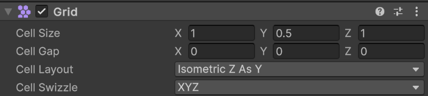
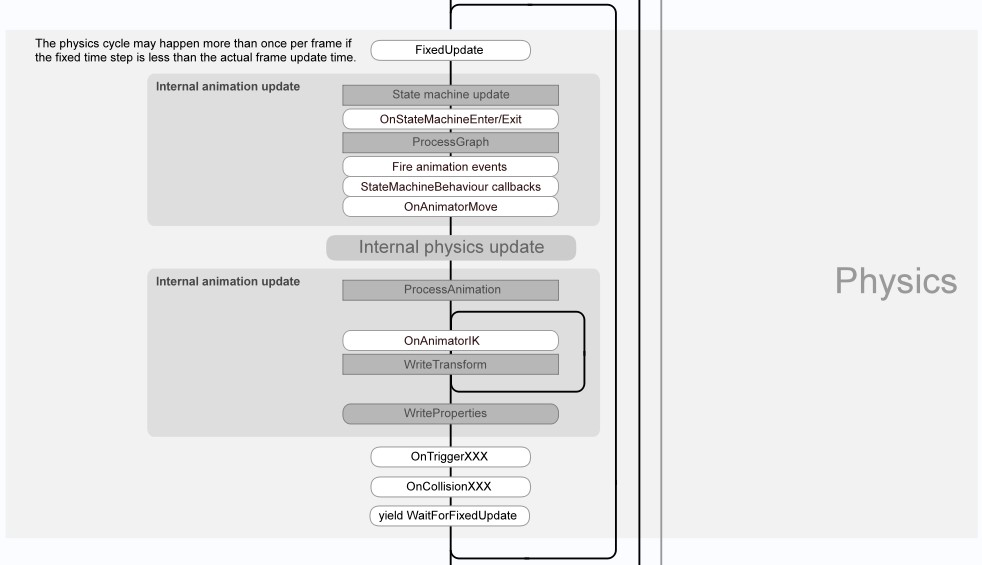
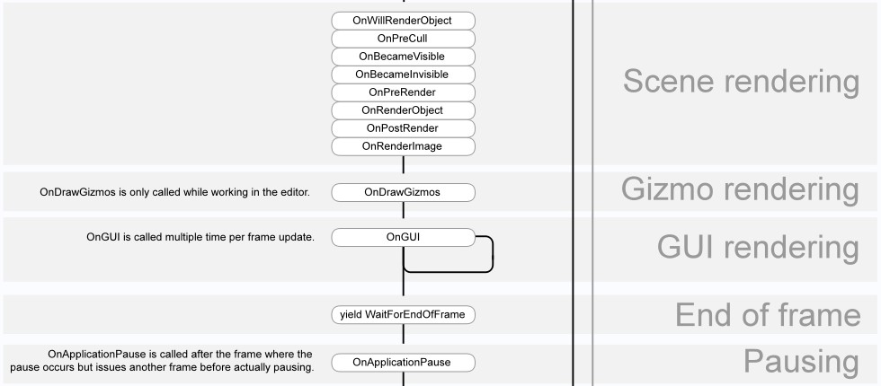

# 资源

## ID

- GUID是资源的ID（场景中对象没有GUID），在资源导入形成时确定，不因相对路径变化
- 一切`UnityEngine.Object`都有InstanceID
  - 同一时刻，所有对象的InstanceID均不同，但InstanceID是运行时确定的、可变的
  - InstanceID与GUID有关

## Audio

### 加载方式

DecompressOnLoad：加载时解压，占用CPU少，占用内存多，适用于小音频

CompressedInMemory：播放时才解压，占用CPU多，占用内存小

Streaming：流式加载，适用于长音频

## 压缩方式

Vobis：压缩比好

ADPCM：解压速度快

MP3：适用于非循环音频，也适用于某些特殊平台

# 相机

## 坐标

- 视口坐标：屏幕左下为（0，0），右上为（1，1）

- 屏幕坐标：屏幕左下为（0，0），右上为（像素宽度，像素高度）

- 世界坐标

- 本地坐标：以某物体的xyz轴为基的坐标，受该物体的位置及旋转影响

- UI坐标：UI的Transfrom或RectTransform组件的position及localPosition属性含义一致，均为世界坐标和本地坐标。RectTransfrom中显示的数字是anchoredPosition
- Screen Space的UI和一般游戏物体**使用同一套世界坐标，只是世界坐标映射到屏幕坐标的方式不同**

  - **对于一般游戏物体、Screen Space - Camera的UI，World Space的UI，世界坐标到屏幕坐标的映射取决于相机**
  - **对于的Screen Space - Overlay的UI，世界坐标就等于屏幕坐标**
  - **要控制UI的位置关系时，优先考虑使用世界坐标**
  - **不要在Awake中获取UI的世界坐标**，因为Canvas的Awake中的一些行为很可能导致其子UI的世界坐标改变

# 资产

## Texture

纹理，二维图片

## Shader

- 可以看作一个脚本，规定了渲染方式，接收一些输入(其中包含一些可调节的变量)，输出材质
- 与渲染管线的概念略有不同，部分内容可编程，部分内容由引擎自动完成

## Material

- 材质，可以看作Shader的实例，把一些变量确定了下来（如颜色、纹理、映射方式、自定义变量等）

## Timeline

- 可以创建Timeline Asset，属于Playable Asset，由Playable Director播放
- 具有可复用性。Timeline Asset中的数据与具体游戏物体无关，与具体游戏物体有关的数据保存在Director中。将Timeline绑定到Playable Director上后，可以为其绑定具体游戏物体；在不同时刻、不同的Director上，同一个Timeline可以绑定不同的游戏物体；绑定了同一个Timeline Asset的Director会共同修改Timeline Asset的数据；但可能出现数据与绑定的游戏物体不匹配的情况（**简言之，Timeline Asset像剧本，Playable Director像导演，游戏物体像演员**）

### Animation Track

- 播放一段动画。此轨道上的游戏物体必须有动画器。可以拖入现有的动画，或通过录制创建动画
- 如果轨道上的动画包含了与轨道上的游戏物体的动画器不匹配的项目，那些项目会被忽略
- 可以将一个游戏物体同时绑定到一个Timeline Asset的两个Animation Track上（如，一个是动画，一个是移动）。如果其中一个被忽略，尝试调整Track的顺序
- 动画中的位置变化被视为世界坐标的变化，所以难以复用（不过，可以添加多个控制移动的轨道，选择其中一个使用）

### Activation Track

- 控制游戏物体的禁用/激活
- 结果会保留，所以播放结束后某个游戏物体是否激活取决于**Timeline Asset的最后时刻该物体是否激活**

### Audio Track

- 播放音频。可以使两段音频重合以实现过渡（运行时会利用AudioMixer混合，然后输出到指定的AudioSource）

### Cinemachine Track

- 控制某一时间段内生效的虚拟相机。可以使同一轨道上代表两个虚拟相机的两段重合以实现过渡
- 同一Timeline Asset内同时存在多个Cinemachine Track时，下面的轨道有更高的优先级，下面的轨道没有内容时，才会使用上面的轨道
- 与其他的Track不同的是，在**某一时刻或时间段，如果任何正在播放的Timeline Asset的任何轨道上都没有正生效的虚拟相机，依然会按照虚拟相机优先级来控制实际相机的位置，不会保留Timeline引起的变化。Director播放结束后也是这样**
- 由于绑定的是某个具体场景中的相机，所以绑定了哪个相机不会保存在Timeline Asset中

## Grid

### Rectangle

- 一格中的所有点->该格左下角的点，某格左下角的点->依然是该点

### RectInt

- min和max属性的值确实是左下角和右上角的点的世界坐标
- 但是x==xMax或y==yMax时不视为被矩形包含，即仅包含左侧边和下侧边

### Isometric Grid

**在上图所示的设置下有：**
$$
将网格坐标到世界坐标的变换记为T,T为线性变换 \hfill \\
T(1,0,0)=(0.5a,0.5b,0) \quad T(0,1,0)=(-0.5a,0.5b,0) \quad T(0,0,1)=(0,0.5bc,c) \hfill \\
T(0.5c,0.5c,0).xy \equiv T(0,0,1).xy \quad (忽略z分量两边恒等,而z分量不影响屏幕坐标) \hfill \\
(a,b,c):\mathrm{CellSize} \hfill \\
$$

# 性能优化

## 脚本

### 基本

- 冷/热分解
- 异步
- 数学优化

### 查找相关

- 游戏物体的tag本质上是int，所以按tag搜索比按名字搜索更快（即使先通过tag粗查找，再根据逐个name判断也能提高性能）

## UGUI

主要目标是减少顶点，减少rebatch，减少rebuild

- 尽量减少UI元素间的相互遮蔽，会移动、变化的对象尽量置于最下层
- 尽量把会变化的UI和不会变化的UI分在不同的Cavas里，因为变化会导致rebatch，而rebatch是以Canvas为单位的
- 不要使用Layout组件
- RenderMode尽量选择Overlay模式
- 同样要关注Material的优化

## Mesh

- 减面
- LOD

## Material

渲染中有batch操作，batch操作是影响渲染性能的关键因素

- 尽量复用材质，如果可以通过参数调整实现不同，就不要新建材质
- 尽量使纹理更小，图片中不要有大片的空白
- 如果一张图片中包含多个纹理（由切割生成），它们中任何一个被使用的话，整张图片都不会被释放，所以非要在一个图片中放多个纹理的话，尽量确保它们的生命周期相同

# 脚本

## Monobehavior类生命周期

### 开始

将脚本挂载到游戏物体上时，会调用Reset方法，但此时脚本尚未被实例化。游戏开始时，脚本实例化，实例化顺序可以在**Edit > Project Settings->Script Execution Order**中修改，也可以用`[DefaultExecutionOrder(xxx)]`修改。

脚本实例化时，Awake执行，OnEnable紧随其后，然后轮到下一个实例化的脚本。待所有Awake、OnEnable执行完，再执行所有脚本的Start。

### 帧

Update和LateUpdate之间，yield null的协程执行；到时间的yield WaitForSeconds的协程执行。LateUpdate之后，yield WaitForEndOfFrame的协程执行。

输入检测发生在Update之前，获取输入结果的方法应由Update调用

### 物理和动画

物理状态更新处于FixedUpdate之后，穿插在动画更新之间。物理、动画相关的方法每固定帧执行一次。

### 渲染

OnGUI执行的频率是帧频的数倍

### 结束

退出应用程序或退出play mode时，会调用OnApplicationQuit和OnDestroy。人为Destroy时，也会调用OnDestroy。但无论如何，只有**游戏对象处于激活状态**时，才可能调用OnDestroy。

## 时间和帧率

### 帧

时间不固定，取决于负载。

### 固定帧

默认每20ms一帧，可在Time窗口调节。没有人为调整值就不会改变

### Maximum Allowed Timestep

通常情况下，Time.fixedDeltaTime可以代表两次FixedUpdate间的时间间隔Time.deltaTIme可以代表两次Update之间的时间间隔。但负载大时可能不是这样。如果物理更新的时间过长，这必然会导致固定帧帧率下降，而且也必然会导致帧率下降。为了缓解高强度物理更新造成的游戏卡顿，引入了**Maximum Allowed Timestep**

Maximum Allowed Timestep是FixedUpdate可以执行的最长时间——实际上，FixedUpdate执行时间超过这个值时，不是强行终止，而是降低其执行频率。结果是，物理更新变慢，和图像不同步（通常不明显）

## 特性

### 序列化

序列化是指，**通过某些方式**将原本存在于内存中的数据保存到硬盘上；反序列化是指，**通过某些方式**运行时将保存在硬盘上的数据读入内存中。可序列化是指，**执行某些操作时**，会将某个数据保存到硬盘上；不可序列化是指，**执行某些操作时**，不会保存某个数据

Unity中的可序列化分两种情况，一种是修改Inspector下的字段时会保存数据；一种是通过API将类写到硬盘上时（如JsonUtility，PrefabUtility，AssetDataBase）会保存数据

对象首先要是可序列化的，才能使其序列化，常见的不可序列化对象包括除了List以外的数据结构（JsonUtility无法直接序列化一个List对象，但可以序列化作为字段存在于一个类中的List对象）

**[SerializeField]**：修饰字段。使其序列化，且Inspector中可见。public字段默认有此特性

**[SerializeReference]**：类似于SerializeField，能够正确序列化涉及多态的实例；可以用于List，但在Inspector中点击“+”时，无法确定要添加哪种类型的实例

**[Serializable]**：修饰类。如果类不是抽象类、静态类、泛型类，使其序列化，该类中的序列化字段会被序列化

**[NonSerializable]**:修饰字段。禁止其序列化，非public字段不需要此特性

**[HideInspector]**：修饰public字段。使字段不再在Inspector中可见

[Delay]：修饰字段。如果字段是A类可序列化的，那么**playmode**时，在**Inspector**中修改该字段的值时，焦点从字段那里移开时修改才会被应用（一般情况下，输入到一半时就会引发变化）（即使有此特性，退出playmode时修改依然会丢失）

[PreferBinarySerialization]：修饰ScriptableObject的子类，用**AssetDataBase**中的方法序列化对象时，生成二进制文件而不是资源文件

### 菜单

**[MenuItem(string,bool,int)]**：修饰静态方法，在菜单栏中增加一项，点击时执行该方法。string：菜单栏中的路径及快捷键；bool：是否禁用，默认否；int：优先级，越低显示在越上方

**[ContextMenu(string,bool,int)]**:修饰Monobehavior类的非静态方法。右键点击Inspector中的该脚本时，增加一个选项，点击时执行该方法。string：选项名称；bool，int：同上

**[ContextMenuItem(string,string,int)]**：修饰Monobehavior类的A类可序列化字段。右键点击Inspector中的该字段时，增加一个选项，点击时执行某个方法。string：选项名；string：要执行的方法名；int：优先级

### Unsorted

[RuntimeInitializeOnLoadMethod]：修饰静态方法，加载场景时，待所有脚本的Awake及OnEnable执行完后，自动执行此方法。多个有此特性的方法顺序不可控。

[TextArea(int,int)]：修饰A类可序列化的string字段。Inspector中出现一个文本框用于修改。int:最小显示行数；int：最大显示行数，超过此行数时，出现滚动条

[Tooltip(string)]：修饰A类可序列化的字段。鼠标落在该字段上时出现一段提示。string：提示内容

# Editor模式

- Editor模式下不能修改运行时数据，只能修改**UnityEngine.Object及其子类中可序列化的数据**

## Inspector中的数据

- 通过`serializedObject.FindProperty`获取
- 通过`SerializedProperty`修改
- 通过`serializedObject.Update`更新
- 通过`serializedObject.ApplyModifiedProperties`保存

## Inspector外的数据

- 通过`ScriptableObject.CreateInstance`创建对象（也可以使用AssetDataBase中的API，下同），然后通过`AssetDatabase.CreateAsset`生成Asset，然后刷新
- 通过资源加载的方式获取
- 直接修改资源，然后将资源设为Dirty，然后按保存键或主动调用保存，然后刷新

## Prefab

- 通过资源加载的方式获取

## Inspector窗口

## Scene窗口

## 弹出窗口
