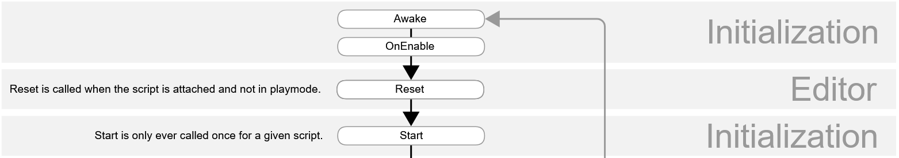
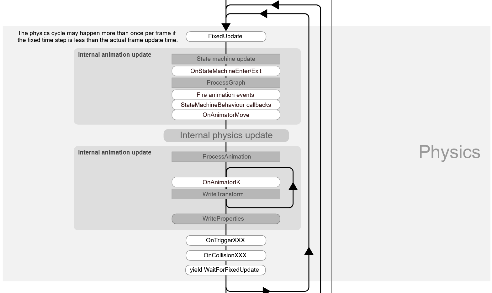
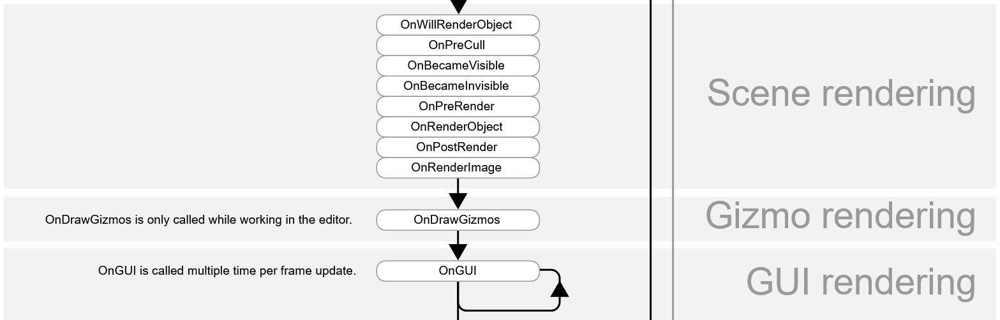
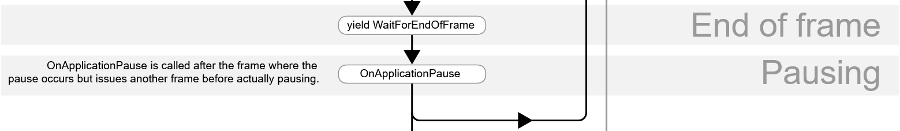
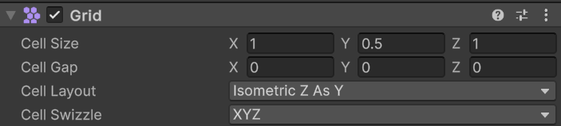

# 渲染

## Shader

- 一个.shader文件由以下部分组成：
  - 一个`Properties`块：规定哪些参数/Keyword可序列化、Inspector中可编辑
  - 若干个`SubShader`块：要适应不同平台、硬件、管线等，便可以定义多个SubShader
    - `Tags`：规定这一SubShader适用于什么环境
    - 若干个`Pass`块：每个包含一个着色器程序，在不同的时机被调用
      - Tags：规定这一着色器程序的调用时机
      - 若干选项：混合、深度测试、剔除等
      - 若干Keyword声明
      - 包依赖
      - 主体：如典型的顶点着色器+片元着色器

  - `Fallback`：此Shader失效时的备用Shader
  - `CustomEditor`


### Keyword

- 在Unity Shader中声明的，类似宏的对象，控制Shader Variant编译
  - Shader中，根据关键字是否**激活**，选择不同的代码编译/执行
  - 关键字可以看作一种特殊的参数，每个材质实例会维护其着色器的各个关键字是否被激活，可以在Inspector或脚本中激活/禁用
- 类型（省略local版本）：
  - `shader_feature`：Unity会自动检测其是否有被激活/禁用，进而决定将哪些Shader Variant打包
  - `multi_compile`：无条件地打包所有变体
  - `dynamic_branch`：编译成运行时分支，不产生变体
- Shader Variant是以更大的包体、更高显存占用、更长加载时间为代价，减少各种Shader中的分支
  - 如果有多组关键字会变化，Variant数量会指数级上升

```c++
Shader "Custom/KeywordExample"
{
    Properties
    {
        _BaseColor ("Base Color", Color) = (1,1,1,1)
        _EmissionColor ("Emission Color", Color) = (0,0,0,1)
    }

    SubShader
    {
        Tags { "RenderType"="Opaque" }
        Pass
        {
            CGPROGRAM
            #pragma vertex vert
            #pragma fragment frag

            #pragma shader_feature _USE_EMISSION

            #include "UnityCG.cginc"

            struct appdata
            {
                float4 vertex : POSITION;
            };

            struct v2f
            {
                float4 pos : SV_POSITION;
            };

            fixed4 _BaseColor;
            fixed4 _EmissionColor;

            v2f vert (appdata v)
            {
                v2f o;
                o.pos = UnityObjectToClipPos(v.vertex);
                return o;
            }

            fixed4 frag (v2f i) : SV_Target
            {
                fixed3 color = _BaseColor.rgb;

                #ifdef _USE_EMISSION
                    color += _EmissionColor.rgb;
                #endif

                return fixed4(color, 1.0);
            }
            ENDCG
        }
    }
}
```


## Material

- 由Shader可以创建出材质实例，每个材质实例有各自设定好的一套参数
- 所有引用了同一Material的Renderer共享同一材质实例
  - 运行时可能创建出新的材质实例，对共享材质实例的修改不会影响这些实例

## Texture

- 就维数而言，可分为2D/2D Array/3D/Cube

- 外部导入各种图片后，统一生成Texture2D

- 一般的Texture勾选`Read/write`后可被程序读写，但通常效率低下

- 优化措施：

  - 尽量缩小纹理尺寸，避免大片空白区域

  - 对于单一图片包含多个纹理的情况，尽量确保这些纹理的生命周期相同

### RenderTexture

- 可以用作RenderTarget的Texture

## 合批(Batch)

- 动态合批：对于**顶点数较少**且**共享材质实例**的**各种Renderer组件**，将其VBO合并，以减少Draw Call次数
  - 由引擎自动在**CPU**上完成
  - 默认情况下，如果一系列Renderer组件使用相同材质且预设参数相同，它们会共享一个材质实例
  - 运行时直接获取`renderer.material`会导致创建出新的材质实例
  - 会将模型空间变换到世界空间，然后统一在世界空间下计算，此时试图利用模型空间坐标会引发问题
- 静态合批：对于标记为**Static(Transform不可变)**的GameObject，预计算其模型变换，将世界空间下的结果存储下来
  - 由引擎自动在**CPU**上完成，会导致包体变大
- GPU Instancing：对于多个**材质(着色器)相同的而参数不同的Mesh Renderer**，将每份参数合并到缓冲区中一次性传递并渲染
  - 利用OpenGL/DX的**多实例渲染API**，在GPU上完成
  - 每个Mesh实例被分配一个InstanceID，表示它使用哪一套着色器参数
  - 需要单独设置一个实例的参数时，应使用MaterialPropertyBlock，避免创建新的材质实例
  - 此外，还可以在脚本中直接用`CommandBuffer`发出指令，用`Material.SetBuffer`一次性设置所有实例的参数，然后在着色器中直接用InstanceID访问
- SRP Batcher：对于连续的多个Draw Call，如果其Shader Variant相同，避免CPU每次重复传递数据
  - 由引擎自动在**CPU**上完成
  - 为每种支持SRP Bathcer的Shader Variant创建持久化的常量缓冲区，？
  - 这样连续的一组使用相同材质的物体称为一次SRP Batch（并不是真正意义上的Draw Call次数减少）


### UGUI

- 主要目标：减少顶点，减少rebatch，减少rebuild


- 尽量减少UI元素间的相互遮蔽，会移动、变化的对象尽量置于最下层
- 尽量把会变化的UI和不会变化的UI分在不同的Cavas里，因为变化会导致rebatch，而rebatch是以Canvas为单位的
- 不要使用Layout组件
- RenderMode尽量选择Overlay模式
- 同样要关注Material的优化

### Mesh

- LoD

### Material

- 

# 脚本

## 事件顺序

**以下按顺序列出一帧内的各阶段；如无特殊说明，所有脚本的各个函数是明确分阶段串行的**

### 实例化




- 加载场景时，大量脚本同时实例化；单个脚本的Awake后紧接着该脚本的OnEnable（目前Unity是这样实现，但不保证一直如此）
- 脚本实例化实例化顺序可在**Edit > Project Settings->Script Execution Order**中修改，也可以用`[DefaultExecutionOrder(xxx)]`修改（两处同时设置时，以Project Settings为准）

### 物理



- 表面上，默认每20ms更新一次物理；实际上，**每一帧中，会根据已累积的时间更新0/1/多次物理**（仅确保平均间隔符合设置）
  - 但`Time.fixedDeltaTime`仍返回固定值，物理相关逻辑仍应该放在`FixedUpdate`中（计算结果稳定，且固定在Update前完成）
  - 在一帧中，不论更新几次物理，这些更新都发生在Update之前
- Animator的UpdateMode如果设为Fixed，则随物理一起更新，内部物理更新插在内部动画更新中间
  - 适用于与物理强相关的动画，能够在动画中途进行物理计算，以影响后续的动画计算


### 游戏逻辑


- 一帧时间不固定，取决于负载
- `Update`和`LateUpdate`之间，`yield null`，`yield WaitForSeconds`，`yield StartCoroutine`等协程依次执行

- 输入检测紧接在在Update之前，因此获取输入结果的方法应由Update调用
- 需要等待`Update`执行完毕才能执行的行为应放到`LateUpdate`中，如相机移动、启用计时器等
- 可以在此基础上进一步实现自定义帧率（如《明日方舟》的战斗相关逻辑固定30帧，原理与`FixedUpdate`类似）

### 渲染



- 通常情况下，游戏逻辑帧率和渲染帧率是一个值

### 帧结束



- 典型用途是获取渲染数据

### 销毁


- 加载场景时，大量脚本同时销毁；单个脚本的OnDisable后紧接着该脚本的OnDestroy（目前Unity是这样实现，但不保证一直如此）
- 退出应用程序或退出play mode时，会调用OnApplicationQuit和OnDestroy
- 至少激活过一次的脚本，销毁时才会调用`OnDestroy`（中途禁用不影响）

## GC

- Unity使用**贝姆(Boehm-Demers-Weiser)GC**，管理托管堆上的对象
  - GC执行时，要求进程**完全暂停**
  - **不分代**，每次需要扫描整个堆
  - 回收后**不压缩**（不将不连续分布的对象移动到一起），导致内存碎片增多，进而导致更频繁的申请更大内存
  - 开发者无法自行实现压缩，只能尽量减少GC，减少内存分配（如对象池）

- Root：垃圾回收器完全确定当前不会被回收的对象，如静态变量，栈上变量等
- GC会利用和维护一套数据结构，如**对象边界表**，**分配表**，**空闲表**
- 流程：
  1. 扫描Roots
  2. 从Roots出发，递归地确定需要保留的对象，将其标记为存活
  3. 遍历堆中的所有对象，将未被标记的对象占用的内存释放
- Unity默认使用**增量式GC**，即把一轮内GC内的工作**分配到多帧进行**
  - 性能要求极高的场景，可以通过**预分配内存+临时禁用GC**，进一步分摊GC成本

- 将来计划迁移至.NET的CLR GC

## Attribute

### 序列化

- 序列化：通过某些方式将原本存在于内存中的数据保存到硬盘上
- 反序列化：通过某些方式将保存在硬盘上的数据读入内存中。可序列化是指，**执行某些操作时**，会将某个数据保存到硬盘上；不可序列化是指，**执行某些操作时**，不会保存某个数据
- 对象首先要是可序列化的，才能使其序列化，常见的不可序列化对象包括除了List以外的数据结构（JsonUtility无法直接序列化一个List对象，但可以序列化作为字段存在于一个类中的List对象）
- **[SerializeField]**：修饰字段。使其序列化，且Inspector中可见。public字段默认有此特性
- **[SerializeReference]**：类似于SerializeField，能够正确序列化涉及多态的实例；可以用于List，但在Inspector中点击“+”时，无法确定要添加哪种类型的实例
- **[Serializable]**：修饰类。如果类不是抽象类、静态类、泛型类，使其序列化，该类中的序列化字段会被序列化

- **[NonSerializable]**:修饰字段。禁止其序列化，非public字段不需要此特性

- **[HideInspector]**：修饰public字段。使字段不再在Inspector中可见

- [Delay]：修饰字段。如果字段是A类可序列化的，那么**playmode**时，在**Inspector**中修改该字段的值时，焦点从字段那里移开时修改才会被应用（一般情况下，输入到一半时就会引发变化）（即使有此特性，退出playmode时修改依然会丢失）

- [PreferBinarySerialization]：修饰ScriptableObject的子类，用**AssetDataBase**中的方法序列化对象时，生成二进制文件而不是资源文件

### 菜单栏

- **[MenuItem(string,bool,int)]**：修饰静态方法，在菜单栏中增加一项，点击时执行该方法。string：菜单栏中的路径及快捷键；bool：是否禁用，默认否；int：优先级，越低显示在越上方

- **[ContextMenu(string,bool,int)]**:修饰Monobehavior类的非静态方法。右键点击Inspector中的该脚本时，增加一个选项，点击时执行该方法。string：选项名称；bool，int：同上

- **[ContextMenuItem(string,string,int)]**：修饰Monobehavior类的A类可序列化字段。右键点击Inspector中的该字段时，增加一个选项，点击时执行某个方法。string：选项名；string：要执行的方法名；int：优先级

### 其他

- [RuntimeInitializeOnLoadMethod]：修饰静态方法，加载场景时，待所有脚本的Awake及OnEnable执行完后，自动执行此方法。多个有此特性的方法顺序不可控。

- [TextArea(int,int)]：修饰A类可序列化的string字段。Inspector中出现一个文本框用于修改。int:最小显示行数；int：最大显示行数，超过此行数时，出现滚动条

- [Tooltip(string)]：修饰A类可序列化的字段。鼠标落在该字段上时出现一段提示。string：提示内容

# Editor模式

- Editor模式下不能修改运行时数据，只能修改**UnityEngine.Object及其子类中可序列化的数据**

## Inspector中的数据

- 通过`serializedObject.FindProperty`获取
- 通过`SerializedProperty`修改
- 通过`serializedObject.Update`更新
- 通过`serializedObject.ApplyModifiedProperties`保存

## Inspector外的数据

- 通过`ScriptableObject.CreateInstance`创建对象（也可以使用AssetDataBase中的API，下同），然后通过`AssetDatabase.CreateAsset`生成Asset，然后刷新
- 通过资源加载的方式获取
- 直接修改资源，然后将资源设为Dirty，然后按保存键或主动调用保存，然后刷新

## Prefab

- 通过资源加载的方式获取

# 高性能架构

## Entity-Coponent-System

- **Coponent**：纯数据对象，每个组件包含一或多个结构体字段
  - 须定义为结构体，并继承`ICoponentData`
  - 如果包含类字段，则须改为继承`ISharedCoponentData`，且会带来性能损失
- **Entity**：只包含ID和若干Coponent引用的对象
- **System**：纯逻辑对象，用于访问各种Entity的Component
  - 提供了`Query`这种高效遍历API和`GetComponentLookup`这种随机访问API
- **ArchType**：一种ArchType表示**一组特定类型组件的组合**，所以可能**有多种Entity对应同种ArchType**
- **Chunk**：内存中固定大小的一块区域，**在每个Chunk内**，对于**ArchType相同的一定数量的Entity，其各个Coponent分别连续存储**
- **ChunkList**：每个ArchType维护一个ChunkList，一个ChunkList包含若干分散在内存各处的Chunk，和一个Chunk地址数组
  - 这种架构不要求大片连续存储空间，又足以提高缓存命中率、支持SIMD

- **Burst Compiler**：用于实现ECS特有的内存布局和访问逻辑的编译器
  - 如果ECS的定义不满足上述规则，Burst失效，使用一般编译器来编译
- ECS核心的内存分配都是非托管的（自行管理），从而降低GC压力

## JobSystem

- Unity提供的便捷的、安全的多线程API

# 资产

## ID

- GUID是资源的ID（场景中对象没有GUID），在资源导入形成时确定，不因相对路径变化
- 一切`UnityEngine.Object`都有InstanceID
  - 同一时刻，所有对象的InstanceID均不同，但InstanceID是运行时确定的、可变的
  - InstanceID与GUID有关

## Audio

### 加载方式

- DecompressOnLoad：加载时解压，占用CPU少，占用内存多，适用于小音频


- CompressedInMemory：播放时才解压，占用CPU多，占用内存小


- Streaming：流式加载，适用于长音频


## 压缩方式

- Vobis：压缩比好


- ADPCM：解压速度快


- MP3：适用于非循环音频，也适用于某些特殊平台


## Timeline

- 可以创建Timeline Asset，属于Playable Asset，由Playable Director播放
- 具有可复用性。Timeline Asset中的数据与具体游戏物体无关，与具体游戏物体有关的数据保存在Director中。将Timeline绑定到Playable Director上后，可以为其绑定具体游戏物体；在不同时刻、不同的Director上，同一个Timeline可以绑定不同的游戏物体；绑定了同一个Timeline Asset的Director会共同修改Timeline Asset的数据；但可能出现数据与绑定的游戏物体不匹配的情况（**简言之，Timeline Asset像剧本，Playable Director像导演，游戏物体像演员**）

### Animation Track

- 播放一段动画。此轨道上的游戏物体必须有动画器。可以拖入现有的动画，或通过录制创建动画
- 如果轨道上的动画包含了与轨道上的游戏物体的动画器不匹配的项目，那些项目会被忽略
- 可以将一个游戏物体同时绑定到一个Timeline Asset的两个Animation Track上（如，一个是动画，一个是移动）。如果其中一个被忽略，尝试调整Track的顺序
- 动画中的位置变化被视为世界坐标的变化，所以难以复用（不过，可以添加多个控制移动的轨道，选择其中一个使用）

### Activation Track

- 控制游戏物体的禁用/激活
- 结果会保留，所以播放结束后某个游戏物体是否激活取决于**Timeline Asset的最后时刻该物体是否激活**

### Audio Track

- 播放音频。可以使两段音频重合以实现过渡（运行时会利用AudioMixer混合，然后输出到指定的AudioSource）

### Cinemachine Track

- 控制某一时间段内生效的虚拟相机。可以使同一轨道上代表两个虚拟相机的两段重合以实现过渡
- 同一Timeline Asset内同时存在多个Cinemachine Track时，下面的轨道有更高的优先级，下面的轨道没有内容时，才会使用上面的轨道
- 与其他的Track不同的是，在**某一时刻或时间段，如果任何正在播放的Timeline Asset的任何轨道上都没有正生效的虚拟相机，依然会按照虚拟相机优先级来控制实际相机的位置，不会保留Timeline引起的变化。Director播放结束后也是这样**
- 由于绑定的是某个具体场景中的相机，所以绑定了哪个相机不会保存在Timeline Asset中

# 组件

## 相机

### 坐标系

- 视口坐标：屏幕左下为（0，0），右上为（1，1）


- 屏幕坐标：屏幕左下为（0，0），右上为（像素宽度，像素高度）


- 世界坐标


- 本地坐标：以某物体的xyz轴为基的坐标，受该物体的位置及旋转影响


- UI坐标：UI的Transfrom或RectTransform组件的position及localPosition属性含义一致，均为世界坐标和本地坐标。RectTransfrom中显示的数字是anchoredPosition
- Screen Space的UI和一般游戏物体**使用同一套世界坐标，只是世界坐标映射到屏幕坐标的方式不同**

  - **对于一般游戏物体、Screen Space - Camera的UI，World Space的UI，世界坐标到屏幕坐标的映射取决于相机**
  - **对于的Screen Space - Overlay的UI，世界坐标就等于屏幕坐标**
  - **要控制UI的位置关系时，优先考虑使用世界坐标**
  - **不要在Awake中获取UI的世界坐标**，因为Canvas的Awake中的一些行为很可能导致其子UI的世界坐标改变

## Grid

### Rectangle

- 一格中的所有点->该格左下角的点，某格左下角的点->依然是该点


### RectInt

- min和max属性的值确实是左下角和右上角的点的世界坐标
- 但是x==xMax或y==yMax时不视为被矩形包含，即仅包含左侧边和下侧边

### Isometric Grid



**在上图所示的设置下有：**
$$
将网格坐标到世界坐标的变换记为T,T为线性变换 \hfill \\
T(1,0,0)=(0.5a,0.5b,0) \quad T(0,1,0)=(-0.5a,0.5b,0) \quad T(0,0,1)=(0,0.5bc,c) \hfill \\
T(0.5c,0.5c,0).xy \equiv T(0,0,1).xy \quad (忽略z分量两边恒等,而z分量不影响屏幕坐标) \hfill \\
(a,b,c):\mathrm{CellSize} \hfill \\
$$

