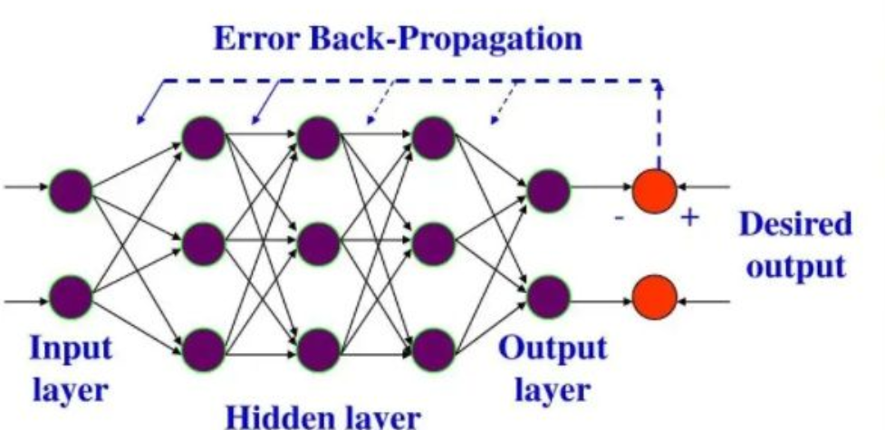

# 感知器模型

- 输入层有若干节点，**输出层仅有一个节点**
  - 输入：向量
  - 输出：数
- 功能函数：对感知器的输出进行调整，使之符合所需的结果的函数，不影响函数增减性

## 单层感知器

$$
y = f(\mathbf X\mathbf W)\quad \mathbf X=(x_1,x_2,...) \quad \mathbf W=(w_1,w_2,...) \hfill \\
\mathbf X:输入 \quad \mathbf W:权重 \quad g:功能函数 \hfill \\
$$

- 没有隐藏层
- 功能函数通常仅调整函数的形状，不影响增减性
- 仅一次向量点乘即得到结果，这意味着单层感知器只能处理线性可分问题

### 训练单层感知器

$$
\mathbf W'=\mathbf W + \eta(d-y) \mathbf X \hfill \\
d:样本期望的结果 \quad \eta:学习率,0 \lt \eta \lt 1 \hfill \\
$$

- 初始权重为较小的随机非0值

## 多层感知器

- 有隐藏层，每个隐藏层有若干节点，每个节点和上一层的若干个节点相连。**每个隐藏层节点和与之相连的上层节点可以看作单层感知器**
- 偏置节点：每个隐藏层均可以添加偏置节点，相当于那一层的所有节点计算加权和时额外增加一个常量
- 多层感知机能处理线性不可分问题，但训练多层感知机需要更复杂的算法

# 反向传播(Back Propagation)神经网络

$$
\mathbf Y^k = f(\mathbf W^k \mathbf Y^{k-1}+\mathbf b^k) \quad
\mathbf W^k=\begin{bmatrix}
w^l_{11}&w^l_{12}&\cdots&w^l_{1n_{k-1}} \\
w^l_{21}&w^l_{22}&\cdots&w^l_{2n_{k-1}} \\
\vdots&\vdots&\ddots&\vdots \\
w^l_{n_k1}&w^l_{n_k2}&\cdots&w^l_{n_kn_{k-1}} \\
\end{bmatrix}
\mathbf Y^k=\begin{bmatrix}
y^k_1 \\
y^k_2 \\
\vdots \\
y^k_{n_k} \\
\end{bmatrix},
\hfill \\
一种常用的激活函数:f(x)=\frac{1}{1+e^{-x}},满足\frac{\mathrm d f(x)}{\mathrm d x} = f(x)[1-f(x)] \hfill \\ 
y^k_i:第k层第i个节点的输出 \quad w^k_{ij}:第k层第i个节点的第j个参数  \quad b^k:第k层的偏置项 \quad n_k:第k层的节点数\hfill \\
\\
输入层和输出层可视为第0层和最后一层的输出:\mathbf X = \mathbf Y^0 \quad \mathbf Y = \mathbf Y^{n+1} \hfill \\
n:隐藏层总数 \hfill \\
$$

- 有输出层、若干隐藏层、输出层，每层均有若干个节点（每层节点数可能不同）
  - 输入：向量
  - 输出：向量

## 反向传播算法

$$
P = \frac{1}{2}|\mathbf D - \mathbf Y|^2 \quad \mathbf W^k {'}= \mathbf W^k-\eta \nabla P \Rightarrow w^k_{ij}{'}=w^k_{ij}+\eta \frac{\partial P}{\partial w^l_{ij}}  \hfill \\
P:损失函数,自变量为所有层的所有权重 \quad \mathbf W:所有层的所有权重构成的向量 \quad w^k_{ij}:第k层第i个节点的第个参数 
\hfill \\
$$

- 将求权重问题转化为用梯度下降法求函数极小值
- 调整偏置节点时，偏置节点可视为输入恒为1、权重可变的节点

