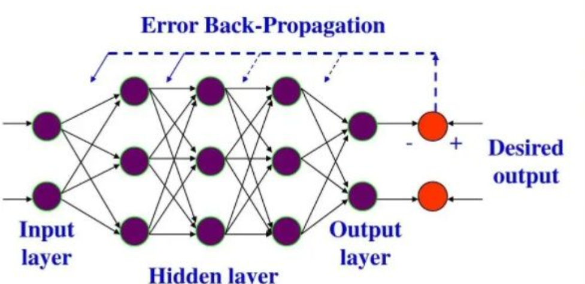

# LLM

## 概念

- Large Language Model：语言模型的规模大到一定程度后展现出智能，因此强调”大“
- Token：大模型处理数据时的基本单位，Token有自然语言、Token ID、向量三种形式
  - Tokenizer：负责分割文本得到Token、自然语言和Token ID间相互转换的程序
  - Embedding(嵌入)：将token ID转化为若干向量形式的token的过程，依赖于已充分训练的神经网络
- Prompt(提示词)：用户或开发者向模型输入的文本，包括指令、要求等
- Context(上下文)：除当前Prompt以外的输入，如之前的对话记录
- Agent：由LLM和一些其他程序构成的整体，能够利用LLM以外的工具，实现不仅限于生成文本的功能
- Retrieval Augmented Generation(检索增强生成)：从数据库中检索与当前问题相关的数据，补充到当前Prompt中，以改善生成结果
  - 需要Embedding Model，将数据文件和用户提出的问题转换成向量数据库和问题向量，以便根据语义相关程度进行查找
  - 在问题与数据库有关的情况下，RAG只检索相关信息的做法能够降低Context Window需求
- Function Calling：LLM在Agent的控制下生成一段特定格式的文本，用这些文本作为输入去调用Agent中的某些程序的过程
- Tool：将Agent中的某些程序独立出来、模块化的产物，提供搜索、读/写/执行文件等各种功能
- Model Context Protocol：Agent调用Tool及接收Tool返回结果时遵循的协议
- Skill：Agent每次执行某类任务时固定要读取的一个文件，其中规定了Agent按怎样的流程和规范完成任务
  - 用Prompt也能实现，但考虑到便利性，将其固定为一种范式
  - 不同类型的任务对应不同的Agent
  - Tool，MCP，访问Skill的程序可以被整合在一起

# 神经网络

## 感知器模型

- 输入层有若干节点，**输出层仅有一个节点**
  - 输入：向量
  - 输出：数
- 功能函数：对感知器的输出进行调整，使之符合所需的结果的函数，不影响函数增减性

### 单层感知器

$$
\begin{aligned}
& y = f(\mathbf X\mathbf W)\quad \mathbf X=(x_1,x_2,...) \quad \mathbf W=(w_1,w_2,...)  \\
& \mathbf X:输入 \quad \mathbf W:权重 \quad g:功能函数  \\
\end{aligned}
$$

- 没有隐藏层
- 功能函数通常仅调整函数的形状，不影响增减性
- 仅一次向量点乘即得到结果，这意味着单层感知器只能处理线性可分问题

$$
\begin{aligned}
& \mathbf W'=\mathbf W + \eta(d-y) \mathbf X  \\
& d:样本期望的结果 \quad \eta:学习率,0 \lt \eta \lt 1  \\
\end{aligned}
$$

- 初始权重为较小的随机非0值

### 多层感知器

- 有隐藏层，每个隐藏层有若干节点，每个节点和上一层的若干个节点相连。**每个隐藏层节点和与之相连的上层节点可以看作单层感知器**
- 偏置节点：每个隐藏层均可以添加偏置节点，相当于那一层的所有节点计算加权和时额外增加一个常量
- 多层感知机能处理线性不可分问题，但训练多层感知机需要更复杂的算法

## 反向传播(Back Propagation)

$$
\begin{aligned}
& \mathbf Y^k = f(\mathbf W^k \mathbf Y^{k-1}+\mathbf b^k) \quad
\mathbf W^k=\begin{bmatrix}
w^l_{11}&w^l_{12}&\cdots&w^l_{1n_{k-1}} \\
w^l_{21}&w^l_{22}&\cdots&w^l_{2n_{k-1}} \\
\vdots&\vdots&\ddots&\vdots \\
w^l_{n_k1}&w^l_{n_k2}&\cdots&w^l_{n_kn_{k-1}} \\
\end{bmatrix}
\mathbf Y^k=\begin{bmatrix}
y^k_1 \\
y^k_2 \\
\vdots \\
y^k_{n_k} \\
\end{bmatrix},
 \\
& 一种常用的激活函数:f(x)=\frac{1}{1+e^{-x}},满足\frac{\mathrm d f(x)}{\mathrm d x} = f(x)[1-f(x)]  \\
& y^k_i:第k层第i个节点的输出 \quad w^k_{ij}:第k层第i个节点的第j个参数  \quad b^k:第k层的偏置项 \quad n_k:第k层的节点数 \\
& \\
& 输入层和输出层可视为第0层和最后一层的输出:\mathbf X = \mathbf Y^0 \quad \mathbf Y = \mathbf Y^{n+1}  \\
& n:隐藏层总数  \\
\end{aligned}
$$

- 有输出层、若干隐藏层、输出层，每层均有若干个节点（每层节点数可能不同）
  - 输入：向量
  - 输出：向量

$$
\begin{aligned}
& P = \frac{1}{2}|\mathbf D - \mathbf Y|^2 \quad \mathbf W^k {'}= \mathbf W^k-\eta \nabla P \Rightarrow w^k_{ij}{'}=w^k_{ij}+\eta \frac{\partial P}{\partial w^l_{ij}}   \\
& P:损失函数,自变量为所有层的所有权重 \quad \mathbf W:所有层的所有权重构成的向量 \quad w^k_{ij}:第k层第i个节点的第个参数
 \\
\end{aligned}
$$

- 将求权重问题转化为用梯度下降法求函数极小值
- 调整偏置节点时，偏置节点可视为输入恒为1、权重可变的节点

