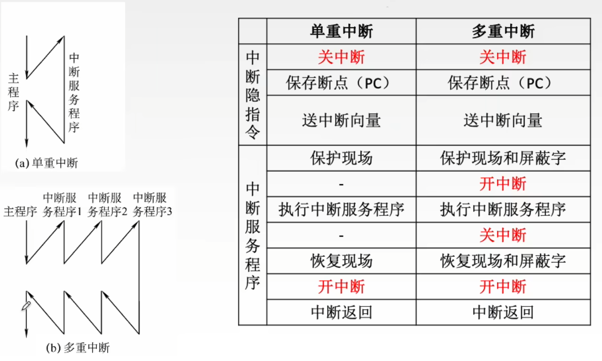
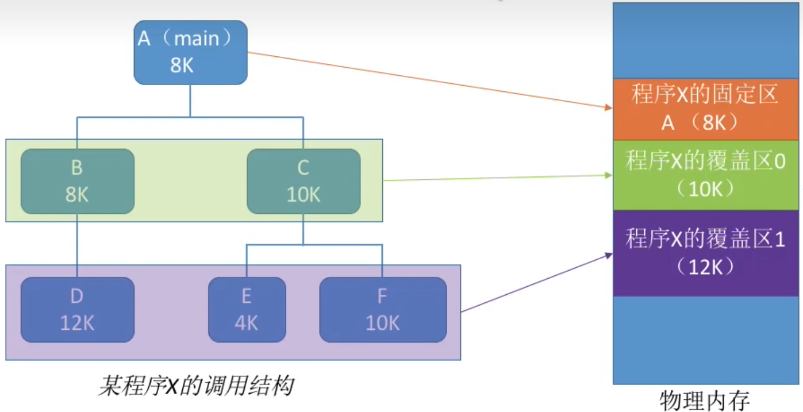
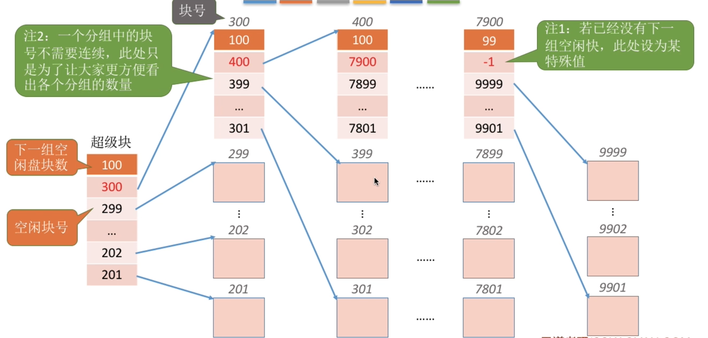

# 操作系统概述

- 定义：控制和管理整个计算机中的**软件和硬件资源**，向用户和其他软件提供**运行环境**与**接口**的**系统软件**
- 操作系统提供的接口（服务）：
  - GUI图形界面
  - **命令接口**：包括**脱机命令接口**和**联机命令接口**，如各类批处理指令
  - **程序接口（系统调用，广义指令）**：开发者通过代码来使用程序接口

## 特征

- 并发：多个程序在一段时间内发生（宏观上看同时运行，实际上交替运行）
  - 并行：多个程序同时运行。并行必须依赖多核处理器
- 共享：系统中的资源由多个**并发**执行的程序共享（并不意味着同时访问）
- 虚拟：主要指时分复用技术（虚拟处理器）和空间复用技术（虚拟存储器）
- 异步：程序不需要立刻执行完毕，而是持续一段时间，时而停止（主要是因为资源冲突），此期间可以并发执行其他程序
- **并发**和**共享**是操作系统最基本的特征

## 发展阶段

- 操作系统主要分为**批处理系统，分时操作系统，实时操作系统**

### 手工操作

- 人工连接电路，设计打孔纸带，计算机计算后将结果输出到打孔纸带上
- 按顺序执行作业，输入、计算、输出简单串行
- 作业：用户提交给计算机的一个任务，含义宽泛
- 手工操作时间相比于计算时间长得多

### 单道批处理系统

- 按顺序执行作业，输入、计算、输出简单串行
- 引入了**脱机输入输出**系统
  - 脱机输入：计算机可以从**外部存储设备**读取输入，输入被事先写入外部存储设备，计算机不需要参与事先工作
  - 脱机输出：计算机可以将结果输出到**外部存储设备**上，供后续使用，计算机不需要参与后续的工作

- 输入输出设备改为**磁带**，速度比纸带快得多
  - 早期单道批处理系统中，用户仍需要使用纸带，纸带的数据通过**外围机**写入磁带，此过程不需要计算机参与

- 优点：输入输出时间缩短
- 缺点：输入输出时，计算机依然无法执行其他工作，利用率低

### 多道批处理系统

- 按顺序流水线式执行作业；计算机中的部件以及外部设备可以同时工作，所以输入、计算、输出可以**并行**

- 引入中断技术，无法获得需要的资源时，作业暂停执行，每个部件上运行的作业可以切换

- 主要特征：制约性、**间断性**、共享性

- 优点：计算机利用率高
- 缺点：依然**无法及时响应**，没有人机交互，没有调试功能

### 分时操作系统

- CPU高速切换，交替执行多个已启动的程序，所有程序都能在短时间内得到响应（宏观上并行，可以说是并行）
- **多任务操作系统**：允许主存中同时运行多个程序的操作系统，约等于分时操作系统
- 主要特征：**同时性**、**及时性**、独立性、**交互性**
- **时间片：给进程安排运行时间的单位，时间片结束时是进程切换的时机；时间片的数量级远大于时钟周期，且长度不固定**

- 优点：支持**多用户/多终端**，响应及时，交互性好

- 目前主流的操作系统（包括UNIX）都属于分时操作系统

### 实时操作系统

- 在分时操作系统的基础上，引入优先级和抢占式调度，紧急任务立刻被响应，且必须在规定时间内完成
- 进一步分为两类：
  - 硬实时系统：军事、工业领域
  - 软实时系统：如售票系统

- 及时性和可靠性高

## 运行机制

### 特权指令

- **内核程序**：操作系统核心部分的程序，GUI之类的程序不属于其中
- **特权指令**：只能由内核程序调用的关键指令（**与机器指令同级**）
- **陷入指令(访管指令)**：特殊的一类**用户指令**，主动请求系统服务，引发访管中断，使CPU陷入内核态

### CPU的态

- CPU的态通过**PSW**中的**模式位**表示
- 内核态：运行内核程序，能访问所有资源，执行所有指令（除了访管指令）
- 用户态：运行用户程序，能访问部分资源，执行非特权指令
- 用户态→内核态：只能通过**中断**实现
  - **访管中断主动使CPU切换到内核态，CPU也可能因为其他中断被动地切换到内核态**
  - **真正实现进入内核态的是硬件，中断处理程序是进入内核态之后执行的程序**
- 内核态→用户态：**执行系统调用**（访管中断处理完毕后，执行一条修改模式位的**特权指令**，即回到用户态）
- 状态切换会产生开销，状态切换频繁会导致性能降低

### 权限控制

- **所有程序都被设定了权限，本质上是规定能使用哪些特权指令**
- 指令执行过程：
  1. CPU读入一条指令
  2. 判断指令类型，如果是用户指令，直接执行，过程结束
  3. 如果是陷入指令，引发访管中断，进入内核态
  4. 判断当前程序的权限，如果权限允许，调用相应的特权指令，否则执行相应的处理措施
  5. 执行一条特权指令，修改模式位，回到用户态

### 中断！！！

- **中断**也相当于一次函数调用，中断服务程序相当于函数
  - **中断服务程序存放在硬盘上，开机后读入内存，并生成中断向量表**
  - 显示调用中断时，需要指定**中断类型号**（如INT 21H），据此访问中断向量表，获取中断入口地址
- **中断响应阶段**：执行中断服务程序之前的阶段（从关中断到保护现场）
- **保存断点（PC）、程序状态字（PSW），关中断由中断隐指令（硬件）完成**
- **保存现场（通用寄存器），恢复现场，开中断由操作系统完成**
- **中断服务程序都是内核程序，执行任何中断服务程序都需要进入内核态（从第一步关中断开始就已处于内核态）**

#### 中断类型

- **内中断(软件中断，异常)**：中断源来自CPU内部，即执行指令引发的中断（如除以0、浮点数上溢）
  - **无法屏蔽，且不受关中断影响**
- **外中断(硬件中断，狭义中断)**：中断源来自CPU外部（不只是外部设备，还包括主存、时钟设备等）
- **访管中断(系统调用中断)**：由陷入指令引发的中断
- **时钟中断**：时钟部件引发的中断，通知CPU当前时间片已结束，需要切换到下一个程序

#### 中断处理

- **内中断**在CPU执行指令的过程中产生，CPU立即处理
  - 通常，内中断处理完后，跳到下一条指令；某些则需要重新执行上一条指令（如**缺页中断**）
- 在每个指令周期末尾，检查是否有**外中断**，如果有，则进入**中断周期**
- **关中断**：阻止CPU进入中断周期（不影响内中断）
- **开中断**：允许CPU进入中断周期

#### 中断优先级

- 优先级：**硬件故障>访管中断>外部中断>程序性中断>重新启动**，高速设备>低速设备，输入设备>输出设备
- **中断A的优先级大于中断B的本质是，处理B的时候，如果引发了A，会再中断一次，先处理A；而B不能中断A**
- 优先级控制可以通过硬件排队器实现
  - 每种中断对应一个中断源（上图下方的引线），中断源输出1位信号，1表示试图引发中断，0表示未引发中断

#### 中断屏蔽

- 外部中断分为**非屏蔽中断**和**可屏蔽中断**
- **中断屏蔽**：将某个可屏蔽中断屏蔽
  - 在每个中断源处增加一个屏蔽触发器，输出1位信号，1表示屏蔽该中断，0表示可以处理中断；所有触发器共同构成**屏蔽字寄存器**，而每一位输出合并起来构成**屏蔽字**
  - 每种中断对应了屏蔽字的一个特定值，即规定了引发此中断时，其他哪些中断需要被屏蔽（一定要屏蔽自身）
  - 通过屏蔽字，可以无视中断优先级，改变中断处理顺序（见下图，D>A>C>B）

## 系统调用

- 系统调用：操作系统向**程序**提供的编程接口，用于调用**特权指令**，使用系统关键功能
- 应用程序使用系统调用的相关代码也被称为**调用库函数**
- 调用库函数的过程中会执行**陷入指令**，所有陷入指令都会引发访管中断

## 体系结构

- 操作系统中，**内核**部分的功能运行在内核态，其余运行在用户态

### 整体式结构(宏内核结构)

*GUI不属于内核部分，上图中，没有画出GUI*

- 内核部分包含所有系统功能（GUI除外）
- 内核部分分为多个模块，**模块内直接包含大量函数，无明显结构，模块间可以相互调用**
- 性能高，但代码复杂，难以调试和维护，可靠性较差
- 目前主流的操作系统均属于整体式结构

### 微内核结构

- 内核部分仅实现最基本的核心功能，其余功能模块称为**服务器**，不属于内核部分
- 非内核部分的模块**无法相互调用**，需要通过内核部分**间接通信**

- 代码简单，但**频繁态切换**导致性能差；非内核部分模块发生故障不会导致内核部分崩溃

- 目前许多新生操作系统都一定程度上参考微内核架构

### 分层结构

- 内核部分包含所有系统功能
- 功能严格按层次划分，每层中的模块只能调用下一层的模块
- 代码结构清晰，易于调试维护，但多层调用导致性能较差

### 模块化结构

- 与整体式结构类似
- 将操作系统的多个功能模块区分为主模块（负责核心功能）和可加载内核模块，支持**动态加载/卸载内核模块**（不是指开/关固有的功能模块，而是指安装新模块、卸载原模块）
- 相比于整体式结构，代码一定程度上变清晰，但依然难以调试，适应性和可拓展性显著增强

### 外核

- 增加一个独立于内核的外核，外核也能实现访问硬件的功能
- **外核中不实现虚拟硬件，不包含映射层，允许用户进程更直接地使用硬件资源**
- 提升某些功能的效率，但牺牲了系统整体性

## 操作系统引导

- **操作系统引导(Boot)**：计算机开机后，加载并启动操作系统的过程
- **活动分区(主分区)**：硬盘上，安装了操作系统的分区（通常为C盘）
- 步骤：
  1. 执行**BIOS**上地址为FFFF0H的指令，内容为**JUMP POST**
  2. 跳转到POST程序，执行**POST(硬件自检)**，显示器、键盘等硬件启动
  3. 获取Boot Sequence（读取之前保存在BIOS中的顺序，或由用户输入顺序），找到指定的**主启动扇区**
  4. 将**主启动扇区**中的**主引导记录(MBR)**读入内存
  5. 执行MBR中的**磁盘引导程序**，扫描MBR中的**分区表**，根据分区表确定活动分区，从活动分区读取**分区引导记录(PBR)**
  7. 执行PBR中的程序，从根目录中找到**启动管理器(自举程序，操作系统初始化程序)**并执行
  8. 先后执行操作系统核心初始化（初始化页表、寄存器，创建核心进程等），操作系统初始化（初始化文件系统、网络系统、控制台、图形界面等）

## 虚拟机

- 虚拟机：在计算机上模拟出一个虚拟计算机，包含虚拟操作系统；应用程序可以运行在虚拟机上
- **支持虚拟机的计算机，其指令不再简单分为特权指令与用户指令，而是分为更多级**

| 指令           | 可以执行此指令的最高层对象                                   |
| -------------- | ------------------------------------------------------------ |
| Ring 0         | 虚拟机管理系统（对于第一类VM）或宿主操作系统（对于第二类VM） |
| Ring 1，Ring 2 | 虚拟操作系统                                                 |
| Ring 3         | 应用程序                                                     |

### 分类

- 常用的VirtualBox，VMWare都属于第二类虚拟机

### 功能

- 一台计算机上可以运行多个虚拟机，多个虚拟机上运行的应用程序不会相互干扰
-  虚拟机屏蔽了不同计算机的差异，为程序提供所需的运行环境，并且可以方便地移植到不同的计算机上

# 进程管理

## 进程

- 进程：**程序在某个数据集合上的一次运行活动（≈程序+数据）**
- 程序：保存在存储器上的一段代码
- **进程映像=内存映像+PCB**
- 创建进程时，除了创建PCB，还会在主存中申请一些空间（分区方式不固定），它们构成**内存映像**：
  - 代码区
  - 静态数据区：存放静态变量和全局变量
  - 栈区：由编译器和操作系统自动实现内存分配和回收的区域（值类型）
  - 堆区：由代码主动分配内存，可能还需要代码主动释放内存（大部分引用类型，值类型装箱）
- **进程是动态的，进程映像是静态的**
  - 进程映像的静态只是相对而言，进程映像中，各个部分都会发生变化，只是并不至于随每条指令执行而变化
  - 进程指的是完整的运行过程，涉及每条指令的执行，所以说是动态的
- 引起进程创建的典型事件：用户登录成功，启动程序执行

### PCB(进程控制块)

- 所有进程的PCB**集中存放**在主存的**内核区**中

- 每个进程有一个PCB，PCB约等于进程的**上下文（context）**，操作系统根据PCB控制进程

- PCB的主要内容：
  - 进程描述信息：**PID**(进程ID)，PPID(父进程ID)，UID(用户ID)
  - 进程控制和管理信息：资源占用量，进程**状态**，进程**优先级**等
  - 资源分配信息：正在访问的文件、I/O设备，正占用的内存区域等
  - 寄存器状态：进程暂停运行时，会保存当时的寄存器信息，下次执行此进程时，通过寄存器信息恢复当时的状态，继续执行
  - PCB在进程运行的过程中，会因为某些特殊的操作会改变PCB（如终止进程，中断进程，改变优先级等）

### 特征

- **动态性（基本特征）**：进程是程序的一次执行过程，动态产生、动态消亡
- **并发性**：多个进程可以并发执行（不一定是并行）
- **异步性**：多个进程按各自的进度运行，时而继续时而挂起（为了确保多个进程正确完成工作，需要提供同步机制）

- **独立性**：进程能够独立运行，**是CPU分配资源的基本单位**

### 父子进程

- 通常，在一个进程的运行过程中创建出另一个进程，创建出的进程被设为当前进程的子进程
- 所有进程都有父进程（除了根进程，由操作系统创建）
- 父子进程有独立的地址空间，可以并行，二者仅仅是共享部分资源

### 状态

- 创建态：正在创建进程，分配资源
- 就绪态：可以运行，但尚未运行（**未占用CPU，占用其他所需资源**）
- 运行态：正在运行（占用CPU和其他所需资源）
- 阻塞态：暂时无法继续运行（**未占用CPU，未占用其他所需资源**）
- 终止态：停止运行，正在回收资源

**注：进程存在时，始终占用主存（除非被挂起），上午中的“其他资源”不包括主存**

### 进程组织方式

*左上图为链接方式，右上图为索引方式*

- PCB用特定的数据结构存放，称为**PCB集合**；CPU可以遍历PCB集合，通过PCB实现进程控制
- 以链接方式为例，PCB分别存放在**执行队列，就绪队列，等待队列**中，分别对应**运行态，就绪态，阻塞态**

### 进程控制！！！

- 进程控制，本质上就是创建、销毁进程，或是改变进程的状态
- 所有进程控制的操作都属于**原语**
- **原语**：必须连续执行完，中间不能插入其他任何指令的一系列指令
  - 原语不是最底层的指令，而是由若干条机器指令构成的，指令本身无法确保**原子性**
  - 原语会在指令前后分别增加一步**关中断和开中断**，以此防止被中断，实现**原子性**
- **进程状态的变化均伴随着中断，如异常，时钟中断，I/O中断等**

#### 创建

- 创建原语：申请空白PCB→分配资源→初始化PCB→PCB加入就绪队列
- 引发创建的典型事件：用户登录，外部提交了新作业，应用程序请求服务，应用程序主动创建进程

#### 终止

- 撤销原语：找到PCB→释放CPU占用（如果正占用CPU）→终止其所有子进程（递归）→释放资源→删除PCB
- 引发终止的典型事件：程序运行结束，程序发生异常，用户主动终止进程

#### 阻塞

- 运行态→阻塞态
- 阻塞原语：找到PCB→保护现场→停止进程运行，状态设为阻塞态→PCB移入等待队列
- 引发阻塞的典型事件：等待资源空闲/事件发生（如发出访问I/O设备的请求后）

#### 唤醒

- 阻塞态→就绪态
- 唤醒原语：找到PCB→PCB移出等待队列，状态设为就绪态→PCB移入就绪队列
- 引发唤醒的典型事件：要使用的资源空闲了，等待的事件发生了

#### 切换

- 当前运行的进程：**运行态→就绪态/阻塞态/终止态**；就绪队列中另一个进程：**就绪态→运行态**
- 切换原语：当前进程的PCB保存现场→停止当前进程，移入相应的队列→执行另一个进程→根据新进程PCB中的寄存器信息，恢复当时的现场
- 引发切换的典型事件：**时间片到期（即时钟中断处理结束）**，当前进程阻塞/终止，**创建新进程（被优先级更高的进程抢占）**
  - 正在**处理中断**时、进程处于**内核临界区(≠用户临界区)**时、正执行**原子操作**时，无法进行切换

注：上述事件只是可能引发进程切换，到底是否会引发进程切换，与进程调度方式和调度算法有关

### 进程通信

#### 共享存储

- 主存中存在允许多个进程同时访问的共享存储区
- 操作系统仅仅是允许进程申请和共用共享存储区，对共享存储区执行的操作由进程本身控制
- 基于存储区的共享：对共享存储区可以进行各种形式的操作；速度快，是一种高级通信方式
- 基于数据结构的共享：共享存储区创建时即限定，对其中的数据执行操作时，必须将其视为某种特定的数据结构（如数组）；限制多速度慢，是一种低级通信方式

#### 消息传递

- 以操作系统为中介，进程间发送格式化的信息来进行通信
- 发送和接收信息的操作都是**原语**
- 直接通信方式：通信双方均需要指明对方的PID
- 间接通信方式：通信双方均需要指明“信箱”的标识符

#### 管道通信

- 两个进程间通过“管道”连接来进行通信；管道中，同一时刻只能有一方在读，另一方在写
- 管道的本质是被两个进程共享的文件，该文件是临时文件，仅存在于**主存**中，充当数据缓冲区；一方向其中写入数据，另一方从中读取数据
  - 管道写满数据后，写进程阻塞，读进程就绪
  - 管道中数据读完后，读进程阻塞，写进程就绪
- **通常，内存中只有一个(半双工通信)或两个(双工通信)管道文件，被所有进程共用**（依然符合上面两条规则，写满/读完之前，不会切换写进程/读进程）
  - 多对一通信：多个写进程按特定规则轮流向管道写数据
  - 一对多通信：无法实现一次性的一对多通信
  - 多个一对一通信：多个写进程和多个读进程均需要按特定的规则轮流读写数据，以确保通信的两方匹配

## 线程

- 线程：进程的一个执行单元。一个进程包含若干个线程，它们共享部分进程使用的资源
- 如果操作系统支持线程，那么每个进程至少有一个线程
- **线程是CPU调度的最小单位；包含CPU现场，占据独立的地址空间，可以独立地执行程序**
- 切换同一进程内的不同线程时，不需要切换**上下文**，开销相比于切换进程小（在一个进程内部切换线程不涉及进程状态改变）
- 在多核计算机上，多个线程可以并行（不论它们是否来自同一进程）

### 用户级线程

- 应用程序管理的线程，线程管理发生在**用户态**，**没有操作系统参与**
- 在用户态下，只能控制用户级进程轮流执行，无法独立地停止和启动单个线程，因此无法实现并行；
- 操作系统无法参与线程阻塞的处理，所以**一个用户级线程阻塞会导致整个进程阻塞**
- 优点：线程创建和切换的开销小
- 缺点：无法并行，系统效率低

### 内核级线程

- 操作系统管理的线程，线程管理发生在**内核态**
- 内核级线程与用户级线程存在关联，用户级线程中包含了实际代码，而内核级线程是操作系统进行线程管理的单位；即，**用户级线程决定了线程要实现的功能，内核级线程决定了线程的运行状态**
- **一个内核级线程阻塞，会导致属于它的用户级线程全部阻塞，但不会导致其他同级的内核级线程阻塞**
- 一对一模型：用户级线程与内核级线程一一对应
  - 创建和切换进程开销大（需要态转换），占用资源多（因为内核级进程数量多）
- 一对多模型：多个用户级线程对应一个内核级线程
  - 与用户级线程类似，创建和切换进程开销小，但无法实现并行
- 多对多模型：多个用户级线程对应多个内核级线程（内核级线程的数量比用户级线程的数量少）
  - 能实现并行，避免单个内核级线程阻塞导致所有用户级线程阻塞，且不像一对一模型占用那么多资源

### TCB(线程控制块)

- **线程与进程相同，有五种状态，转换方式完全相同**

- 每个线程有一个TCB，TCB约等于线程的**上下文（context）**

- 线程组织方式有多种：每个进程持有线程表，存放自身线程的TCB；有唯一一张线程表，存放所有线程的TCB；有多张线程表，状态相同的TCB存放在一张线程表中（和进程一样）

- TCB的主要内容：
  - 进程描述信息：**TID**(线程ID)等
  - 进程控制和管理信息：资源占用量，进程**状态**，进程**优先级**等
  - 资源分配信息：正在访问的文件、I/O设备，正占用的内存区域等
  - 寄存器状态：进程暂停运行时，会保存当时的寄存器信息，下次执行此进程时，通过寄存器信息恢复当时的状态，继续执行
  - PCB在进程运行的过程中，会因为某些特殊的操作会改变PCB（如终止进程，中断进程，改变优先级等）

## 进程调度

- **高级调度(作业调度)**：按规则从多个尚未启动的作业（这里指进程）中选择一个**启动**
- **中级调度(内存调度)**：按规则从多个被**挂起**的进程中选择一个**解除挂起**
  - **挂起**：资源不足时，将某些暂时不执行的进程的**内存映像**调出内存（**PCB仍位于主存中**），暂时调出内存的进程处于**挂起状态**；其PCB会插入**挂起队列**
- **低级调度(进程调度)**：从多个就绪的进程中，选择一个运行
  - 进程调度的时机就是进程**切换**的时机（见上文）
  - 狭义的进程调度，相当于进程切换的一半工作；广义的进程调度，相当于进程切换的整个过程
  - 进程调度并不需要操作系统处于内核态
- 调度器(Scheduler)：操作系统中，控制进程调度的**程序**
- 闲逛进程：优先级最低的进程，不执行任何操作；没有其他进程要执行时，执行闲逛进程

| 调度     | 调度对象的位置 | 频率 | 进程状态的变化                   |
| -------- | -------------- | ---- | -------------------------------- |
| 高级调度 | 外存→内存      | 低   | 未创建→创建态→就绪态             |
| 中级调度 | 外存→内存      | 中   | 挂起态→就绪态，阻塞挂起态→阻塞态 |
| 低级调度 | 内存→CPU       | 高   | 就绪态→运行态                    |

**上表中未提及的进程状态转换都是自动完成的，不属于任何调度的范畴**

### 调度方式

- 非剥夺调度方式(非抢占方式)：只有进程主动阻塞、正常终止、因异常终止时，才能进行进程调度
- 剥夺调度方式(抢占方式)：优先级更高的进程和其他各类中断可以打断当前进程，**时间片到期**后也可能会切换进程
- 分时操作系统和实时操作系统使用抢占方式

### 调度算法

- **下文中，“作业”的含义宽泛，可以指具体的、宏观的任务，也可以指进程**
- 考虑调度算法时，通常只考虑进程在**就绪态、运行态、终止态**间的转换

#### 评价指标！！！

- CPU利用率：CPU忙碌时间÷总运行时间
- 系统吞吐量：完成的作业数÷总运行时间
- 周转时间：从提交一个作业到该作业完成的时间间隔
  - **周转时间=等待时间+运行时间+I/O操作时间（通常不考虑）**
  - 等待时间：作业处于等待状态的时间
  - 运行时间：作业占用CPU的时间
  - I/O操作时间：作业占用I/O设备的时间
- 响应时间：从提交一个作业，到该作业**首次被响应（指产生用户能看到的变化）**的时间间隔
- 带权周转时间（无量纲）：**运行时间÷周转时间**（评价用户体验的主要指标）
- **饥饿**：某些作业一直没有被响应的情况

#### 先来先服务(FCFS)

- 优先执行先启动的作业
- 如果不涉及I/O操作，各作业**按顺序在CPU上串行**；如果涉及I/O操作，**I/O和CPU可以并行**
- 优点：公平，逻辑简单
- 缺点：对短作业不利，短作业带权周转时间可能过大

#### 短作业优先(SJF)/短进程优先(SPF)

- 优先执行**要求服务时间**最短的作业
- 要求服务时间：运行完一个作业所需的最短时间
- 当前作业未执行完时，即使创建了要求服务时间更短的作业，也不会切换
- 优点：平均等待时间、平均周转时间、平均带权周转时间**不严格最短**
- 缺点：对长作业不利，长作业等待时间可能过长

#### 最短剩余时间优先(SRTN)

- 优先执行**剩余要求服务时间**最短的作业
- 如果创建出了运行时间小于当前作业剩余运行时间的作业，则会切换
- 优点：平均等待时间、平均周转时间、平均带权周转时间**严格最短**
- 缺点：对长作业不利，长作业等待时间可能过长

#### 高响应比优先(HRRN)

- 优先执行响应比高的服务，响应比相同则优先执行先启动的服务
- **响应比=（响应时间+要求服务时间）÷要求服务时间**
- 当前作业未执行完时，即使出现其他响应比更高的进程，也不会切换
- 优点：兼顾了短进程和长进程，平均周转时间较短，也不会引发饥饿

#### 时间片轮转(RR)

- 每当时间片结束，停止当前进程，切换为**就绪队列**中的第一个进程，运行完毕后移到队列末尾；新创建、脱离阻塞的进程也插入队列末尾
- 时间片到期时，时钟部件会产生**时钟中断**，通知CPU切换进程
- **当某个进程停止运行，而时间片尚未结束时，操作系统会认为当前时间片已经结束，立刻进入下一个时间片，安排下一个进程**
- 时间片过大时，此算法接近先来先服务算法；时间片过小时，切换时间片开销过大
- 优点：公平，响应速度快
- 缺点：平均周转时间相对长，切换时间片带来额外开销

#### 优先级调度(P)

- 优先执行优先级高的作业
- 比当前进程优先级更高的进程可以中断当前进程，也可以等待当前进程运行完
- 静态优先级：创建进程时即确定进程优先级
- 动态优先级：进程运行过程中优先级会动态地改变
  - 有多种因素可以参与动态优先级的计算，如已运行时间、已等待时间
  - **进程当前的时间片用完时，是重新计算优先级的合适时机**
- 通常，系统进程>用户进程，前台进程>后台进程，I/O繁忙型进程>CPU繁忙型进程（优先度）
- 优点：某些紧迫的作业能得到快速响应
- 缺点：可能导致饥饿（合理规定动态优先级能缓解这一问题）

#### 多级反馈队列(MLFQ)

- **就绪队列**有多级，**级数越大时间片越长**
  - 一开始，CPU指向第1级队列
  - 创建进程时，插入第1级队尾
  - 每当时间片结束，安排CPU**当前指向的一级**的第一个进程运行，原本的进程插入**下一级**队尾（如果没有下一级，改为插入本级末尾）
  - 当一级中没有进程后，CPU指向下一级；特别地，CPU指向最后一级时，该级中所有进程运行一遍后，CPU重新指向第1级
- 优点：相对公平，响应时间相对短，平均周转时间较短
- 缺点：可能导致饥饿（不断有新进程插入第1级，可能导致CPU一直指向第1级）

| 算法    | 用途          | 调度方式   | 可能导致饥饿 |
| ------- | ------------- | ---------- | ------------ |
| FCFS    | 进程/作业调度 | 非抢占式   | 否           |
| SJF/SPF | 进程/作业调度 | 非抢占式   | 是           |
| SRTN    | 进程/作业调度 | 抢占式     | 是           |
| HRRN    | 进程/作业调度 | 非抢占式   | 否           |
| RR      | 进程调度      | **抢占式** | 否           |
| P       | 进程/作业调度 | 二者皆有   | 是           |
| MLFQ    | 进程调度      | **抢占式** | 是           |

#### 多级队列调度

- 进程按照功能不同，划分为多个就绪队列
- 队列间可以严格按优先级调度，也可以采用时间片调度（可以规定每个队列占用CPU时间的比例）
- 每个队列内部，可以采用不同的算法调度

## 进程同步

- **互斥关系**：两个进程有访问同一个临界资源的**临界区**，则临界区部分的代码不能同时执行
- **同步关系**：两个进程的某些部分有明确的先后关系，必须按顺序执行该部分
- **进程同步**：协调多个进程，使之按照正确的顺序**交替执行**（具有同步关系和互斥关系的进程都需要同步）

### 临界资源

- **临界资源：属于共享资源；同一时刻，只要有一个进程以任何方式访问临界资源，其他任何进程不能以任何方式访问临界资源**（读者-写者问题中的资源不完全符合临界资源的定义）
- **临界区**：访问临界资源的**代码块**
  - 通常，临界区代码前后分别有**进入区**和**退出区**，相当于对临界资源**上锁**和**解锁**
  - 没有进程正在访问临界资源的状态也被称为**临界区空闲**，相反的状态被称为**临界区忙碌**
  - **应该尽可能缩短临界区的长度，以提高并行性能**
  - 进程处于临界区时，依然能进行进程调度（只要不破坏临界资源访问原则）
- 临界资源访问原则：
  - 空闲让进：临界区空闲时，立刻让一个等待中的进程进入临界区
  - 忙则等待：临界区忙碌时，试图进入临界区的其他程序必须等待
  - 有限等待：所有的进程应当能在有限的时间之内进入临界区，不发生饥饿
  - 让权等待：当进程**不能进入临界区**时，**立即**阻塞，让出CPU
- **临界区空闲指的是，没有任何进程进入临界区。如果有若干个互斥的进程，不论其正在运行还是被阻塞，只要尚未进入临界区，就是临界区空闲**
- **如果进程已经进入临界区，但因为某种原因阻塞，依然认为该进程有权占用临界区**；临界区访问原则不要求主动处理这种情况
- **可重入编码**：可以被多个并发进程/线程安全地并发调用的编码（既可以是程序，也可以是数据）
  - 能够被多个进程/线程访问的内容必须是可重入编码（如共享程序段）

### 锁机制

- **锁机制：用于实现进程同步的机制的统称**
- **锁分为多种，它们是抽象的方法，将其具象到软件(代码)或硬件层面，才成为具体的实现进程同步的方法**

#### 互斥锁

- 规则：
  - 进程进入临界区前检查，如果没有上锁，则上锁并进入临界区
  - 如果上锁了，**阻塞进程，释放CPU**；等到不再上锁，进程恢复就绪态
  - 离开临界区后，释放锁
- **较长的、发生冲突的可能性较大的临界区，适合使用互斥锁**

#### 自旋锁

- 规则：

  - 进程进入临界区前检查，如果没有上锁，则上锁并进入临界区

  - 如果上锁了，**通过循环一直等待，占用CPU**；等到不再上锁，进程继续运行

  - 离开临界区后，释放锁

- 违反了**让权等待**，占CPU；但减少了进程切换的开销
- 检查-上锁和解锁操作不一定是原子操作，但不是原子操作可能会带来问题
- **自旋锁适用于多核计算机，因为占用一个CPU时，其他CPU也能正常运行；较短的、冲突概率较小的临界区适合使用自旋锁**

#### 整型信号量

- 使用一个信号量，其数据类型为整形
- 对信号量可以执行**wait/signal(即P/V)**两种操作，均为**原子操作**
- 规则：
  - 各个进程开始前，初始化信号量的值(记为**S**)
  - **S>0时，S表示当前资源量，即当前还可以让多少个新的进程进入临界区**
  - **S=0，表示当前资源被占用完（不能确定正在循环等待的进程数量）**
  - **正常情况下，不可能有S<0**
  - P：**一直等待**，直到S>0，然后S--
  - V：S++
- 可以理解为自旋锁的一般化，能够控制同时访问临界区的进程的数量；同样不满足**让权等待**

#### 记录型信号量

- 使用一个信号量，其数据类型为结构体，包含一个整型和一个**等待队列**（**如果信号量这个变量的变量类型是“semaphore”，就默认其为记录型信号量；如果没有说明信号量类型，也默认是记录型信号量**）
- 同样有P/V操作，其中，**block和wakeup是原子操作，但整个P/V操作不是原子操作**（这可能会带来问题）
- 规则（注意S的含义发生了一些变化）：
  - 各个进程开始前，初始化信号量的值(记为**S**)
  - **S>0时，S表示当前资源量，即当前还可以让多少个新的进程进入临界区**
  - **S=0，表示当前资源恰好被占用完，没有进程正在等待占用资源**
  - **S<0时，表示当前资源被占用完，且S的绝对值表示当前有多少进程正在等待占用资源**
  - P：S--，**若S<0**，当前进程**阻塞**，插入等待队列末尾
  - V：S++，**若S<=0**，等待队列中的一个进程变为**就绪态**
- 可以理解为互斥锁的一般化，能够控制同时访问临界区的进程的数量；满足**让权等待**

### 典型进程互斥实现方法！！！

- 软件实现方法：在代码层面实现的进程互斥
- 硬件实现方法：在硬件层面实现的进程互斥
- 以下方法均使用自选锁，故不满足**让权等待**

#### 单标志量法

- 只能用于协调两个互斥进程的执行
- 使用一个bool变量（int也可以），其值表示，当前哪个进程可以执行
- 两个进程只能轮流进入临界区
- 如果一个进程**因为标志量以外的原因不再进入临界区**，则另一个进程无法进入临界区，故不满足**空闲让进、有限等待**

#### 双标志先检查法

- 只能用于协调两个互斥进程的执行
- 使用一个长为2的bool数组，其第i个元素表示，第i个进程是否正试图进入临界区，或已经进入临界区
- 两个进程**并发**执行时，可能产生**冲突**（按①⑤②⑥的顺序执行），故不满足**忙则等待**

#### 双标志后检查法

- 与双标志先检查法非常类似，把上锁提前到检查之前
- 两个进程**并发**执行时，可能产生**死锁**（按①⑤②⑥的顺序执行），故不满足**空闲让进、有限等待**

#### Peterson算法

*Peterson算法的特征是表示“谦让”的turn变量*

- 只能用于协调两个互斥进程的执行，单标志法和双标志法的结合
- 两个进程并发执行时，如果②先于⑦执行，则执行P1，否则执行P0

#### 中断屏蔽方法

- 在临界区的前后分别开中断、关中断，直接**让访问临界区成为原子操作**
- **不适用于多核计算机**（在一个CPU上关中断没有意义），不适用于用户程序（因为开/关中断的权限不能随意给）

#### TestAndSet指令(TS,TSL)

- TS指令是**硬件实现**的**原子操作**（上图只是为了方便用高级语言表示）
- 某进程次执行TS指令时，如果当时未被上锁，则该进程可以进入临界区，并上锁；如果当时已经被上锁，则持续等待
- 由于检查和上锁是原子操作，不会出现软件实现方法中的一些问题

#### Swap指令(Exchange指令,XCHG)

- Swap指令是**硬件实现**的**原子操作**（上图只是为了方便用高级语言表示）
- 具体逻辑与TS指令略有不同，而两者的效果完全相同

### 使用信号量解决进程同步问题！！！

- 总是使用**记录型信号量**（变量类型应当为semaphore）
- 信号量的初值的会影响某些语句的位置（答案不唯一）

#### 进程互斥

- **将信号量初值设为1；在每个进程的进入区执行P操作，在退出区执行V操作**
- **希望某个代码块成为原子操作，但又无法在硬件层面实现时，可以将该代码块视为临界区，利用信号量实现互斥（读者-写者问题、哲学家就餐问题都利用了这一点）**
- “至多有N个...同时...”可以理解为互斥关系的一种推广，信号量初值一般设为N

#### 进程同步

- **信号量初值视条件是否满足而定；如果语句A必须在语句B之前执行，则语句A之后增加一个V操作，语句B之前增加一个P操作**
- 如果涉及多个语句间的顺序，则每一对前后关系分别使用一个信号量

#### 生产者-消费者问题

- 有若干个生产者、若干个消费者、一个缓冲区，产品种类为一种
  - 缓冲区的大小固定，可以存放若干个产品
  - 任意生产者可以生产一个产品后，如果缓冲区未满，可以将产品放入
  - 如果缓冲区不为空，任意消费者可以取走一个产品，然后使用
  - 同一时刻，只能有一个生产者/消费者访问缓冲区
- 同步关系：**缓冲区变得不满之后生产，缓冲区变得不空之后消费**
- 互斥关系：**生产消费互斥**
- **缓冲区大小为1时，不需要使用mutex信号量**

**注意：存在多个相邻的P操作时，同步信号量的P操作必须先于互斥信号量，否则可能产生死锁；V操作的顺序可以互换**

#### 多生产者-多消费者问题

*上图中，plate信号量即相当于empty信号量，不再需要full信号量*

- 有若干个生产者、若干个消费者、一个缓冲区，**产品类型有多种**，每个生产/消费者只能生产/消费一种产品
  - 缓冲区的大小固定，可以存放若干个产品
  - 任意生产者可以生产一个产品后，如果缓冲区未满，可以将产品放入
  - 如果缓冲区有产品，**需要该产品的消费者**可以取走产品，然后使用
  - 同一时刻，只能有一个生产者/消费者访问缓冲区
- 同步关系：**缓冲区变得不满之后生产，缓冲区有需要的产品之后消费（有N种产品时，实现这些同步关系需要N个信号量）**
- 互斥关系：**生产消费互斥**
- **缓冲区大小为1时，不需要使用mutex信号量**

#### 吸烟者问题

- 有**一个生产者**、若干个消费者、一个缓冲区，产品类型有多种，**每个消费者需要不同的产品**
  - **缓冲区只能存放一个产品**
  - **生产者必须按一定顺序，逐个生产消费者需要的产品；消费者取走自己所需的产品后，再生产下一个；完成一轮生产后，从头开始循环**
  - 同一时刻，只能有一个生产者/消费者访问缓冲区
- 同步关系：**缓冲区未满时生产下一个产品，缓冲区有需要的产品时消费（有N种产品时，需要N个信号量）**
- 互斥关系：**生产消费互斥（缓冲区大小固定为1，不需要信号量）**
- **注：对抽烟者问题的自然语言描述中，提到了多种产品的组合，但可以将不同的组合看作不同的产品**

#### 读者-写者问题

- 有若干个读者、若干个写者、一个文件
  - 多个读者可以同时读文件
  - 写者写文件时，其他写者不能写文件，其他读者也不能读文件
- 互斥关系：**同时写互斥，同时读写互斥**

- 由于多个读者可以同时读文件，所以随着新读者的出现，写者可能一直无法写文件
- 额外添加一个信号量，可以实现：有多个读者、写者在等待时，按**先到先服务**的原则安排读写

#### 哲学家就餐问题

- 若干哲学家围成一桌，每两个人之间有一支筷子
  - 哲学家可能什么都不做
  - 哲学家也可能随时开始就餐，**先后**尝试拿起自己左手边、右手边的筷子，成功则就餐
- 互斥关系：**每根筷子不能同时使用（有N个哲学家时，需要N个信号量）**
- 哲学家问题可能导致死锁，有多种方法可以解决这一问题：
  - **规定同时只能有N-1个哲学家尝试拿起筷子**（互斥信号量）
  - **一个哲学家试图拿起筷子的过程中，其他哲学家不能拿起筷子**（互斥信号量）
  - 要求奇数号的哲学家必须先拿左手边的筷子，偶数号的哲学家必须先拿右边的筷子

*习惯上将第i个哲学家命名为Pi，两侧筷子的序号为i和i+1；左上图为第一种方法，右上图为第二种方法*

### 死锁！！！

- 定义：**至少两个相关进程**无限期地处于**阻塞态**，执行条件无法满足（饥饿不要求至少两个进程，也不要求处于阻塞态，只要求不进入运行态）
- 产生条件：
  - 互斥条件：存在多个临界资源和多个请求临界资源的进程
  - 不剥夺条件：进程释放资源前，其他进程无法剥夺资源
  - 部分分配条件：进程所需的资源不是**一次性**分配的
  - 循环等待条件：多个进程的资源等待关系构成环状，每个进程都需要被下一个进程占用的资源来运行

#### 预防死锁

- **预防死锁意味着调整进程逻辑，从根本上消除死锁的可能**
  - 破坏互斥条件：使原本互斥的资源不再互斥（如**SPOOLing技术**），不一定能实现
  - 破坏不剥夺条件：修改进程逻辑，让进程无法运行时主动阻塞，放弃所有资源；或允许其他进程打断当前进程（通常与进程优先级有关）；实现难度大，**带来额外开销**
  - 破坏部分分配条件：资源必须在运行前一次性分配好（**静态分配法**），否则不分配任何资源；未必能实现，且导致**资源利用率显著降低**
  - 循环等待条件：**有序资源分配**（将临界资源按一定顺序排列，所有进程要申请某些共享资源时，不能违背顺序），未必能实现，导致**资源利用率降低**，**不方便增减资源**

#### 避免死锁

- 避免死锁：运行一个进程之前，判断该运行该进程是否可能导致死锁，如果可能，则不再允许

- **安全状态**：如果当前CPU中，**存在至少一个安全序列**，则称当前处于**安全状态**
- **安全序列**：按一定顺序交替执行和释放进程，如果不会引发死锁，则称该执行序列为安全序列
  - **安全状态不可能直接变为死锁状态，但可能先变为不安全状态**
  - **考虑安全序列时，如果已经给一个进程分配了所有资源，就可以假定它已经释放（因为可以一直等到释放，不用考虑资源以外的原因导致进程阻塞的情况）**
- 对于所有临界资源，使用一个信号量，所有信号量构成一个**向量**（假设有**n个进程，m种资源**）
  - **Max矩阵**：n×m矩阵，表示每个进程**宣称的最大需求（未必真实）**
  - **Allocation矩阵**：n×m矩阵，表示每个进程当前的**已分配资源**
  - **Need矩阵**：n×m矩阵，表示每个进程当前的**剩余需求**（Max，Allocation，Need矩阵中三选二即可）
  - **Request数组**：当前进程的当前一步索要的资源
  - **Available数组**：当前系统剩余资源
- 按以下步骤判断当前是否处于安全状态（**银行家算法**）：
  1. 判断当前状态是否安全：
     - 如果当前的剩余资源不能满足任何进程的剩余需求，则当前状态不安全
     - 如果当前的剩余资源能够满足所有剩余进程的剩余需求，则当前状态安全
     - 如果不属于以上两种情况，则暂时无法判断
  2. 找出所有剩余需求小于等于剩余资源的进程，**假定它们全部运行完毕，归还所有资源**，并从剩余进程中移除，然后回到1
- 试图执行一个进程前，进行以下检查：
  1. 该进程发送一个Request数组，表示接下来**要索取的资源**
  2. 检查该进程**累积索取的资源**是否超过其**宣称的最大需求**，如果是，阻止其运行
  3. 检查接下来**要索取的资源**是否超过**剩余资源**，如果是，阻止其运行
  4. 假设已经给该进程分配了其索取的资源，然后判断该状态是否为**安全状态**，如果不是，阻止其执行

#### 检测和解除死锁

*上图中，方框表示一种资源，圆点表示一个进程，绿色箭头表示1个已分配的资源，蓝色箭头表示1个未分配的资源*

- 检测死锁：当前处于**安全状态**，即说明当前没有死锁（系统根据**死锁定理**通过**资源分配图**检测当前是否存在死锁）
- 解除死锁的方法：
  - 资源剥夺法：将某些死锁的资源**挂起**，允许其他进程抢占资源，之后在合适的时机解除挂起（有可能导致**饥饿**）
  - 终止进程法：**终止**某些死锁的进程；代价大
  - 进程回退法：使若干个进程**回退**（需要通过**还原点**实现）
- 需要挂起/终止/回退进程时，优先选择符合以下特征的进程：优先级低，剩余时间长，已使用资源多，非交互式进程

## **管程**

- 为了实现进程同步，**将要共享的数据和访问这些数据需要的方法封装成一个类**，该类的对象即成为管程；其他进程要访问共享资源时，只要调用管程中的方法即可
- 管程的成员：
  - 管程的标识符
  - 被多个进程共享的、按特定数据结构组织的数据
  - 对共享数据进行操作的函数
  - 给共享数据设置初始值的函数
  - 条件变量（**每种互斥/同步关系使用一个条件变量；不同于信号量，条件变量不包含数值，仅包含阻塞队列；而是否阻塞完全取决于共享数据结构的状态**）
- 基本特征：
  - 要访问属于某个管程的数据，只能通过该管程的成员函数
  - 对于某个管存，**同一时刻只能有一个进程访问该管存**
- 基本操作：和进程的P/V操作不同，不包含判断语句，不涉及对值的修改
  - x.wait(s)：阻塞进程s，并将其插入条件变量x的阻塞队列中
  - x.signal()：唤醒x的阻塞队列中的一个进程

# 内存管理

## 内存空间扩充

### 覆盖技术

- 程序（**仅代码部分**）分为若干段，可以分别独立地装入内存（只能用于单一连续存储管理，或固定分区分配）
- 每个进程申请内存时，申请一块**固定区**和若干块**覆盖区**，固定区中的代码一旦装入便不会变化，覆代区码则可以替换
- 程序的调用结构决定了某些代码段不可能同时被调用，这些代码段可以共用一个覆盖区
- 代码结构需要程序员声明，然后操作系统实现覆盖技术，加重编程负担
- 仅存在于早期操作系统中，因为当时内存容量小

### 交换技术

- 内存中的进程的可以暂时**挂起**
- **中级调度(主存调度)**即代表了交换技术的部分工作
- 主存被分为对换区和文件区，对换区用于临时存放挂起的进程，采用连续内存分配方式，使交换速度更快

## 内存分配和回收

- 内存总是分为**系统区**和**用户区**，考虑内存分配时，只需要考虑用户区
- 内存分配和回收的对象总是进程，进程的PCB位于内核区中；**内存的分配和回收与PCB无关，仅与内存映像有关，内存映像通常分为代码区、静态变量区、堆区、栈区**
- 内存碎片：内存分配中产生的、空闲的、无法被新的进程使用的小内存块
  - **外部碎片**：多个进程占用的空间之间没有被使用的小内存块
  - **内部碎片**：一个进程占用的空间内部没有被使用的内存块

## 内存保护

- 主要目的是确保进程的内存空间独立，互不干扰
- 使用一些寄存器记录进程地址范围（重定位寄存器、界地址寄存器等）

## 虚拟内存

- 每个进程不直接访问物理地址空间，而是访问虚拟地址空间（不能说虚拟内存拓展了内存物理空间，物理空间是固定的）
- **虚拟地址空间的大小由地址寄存器的位数决定**，与主存/外存容量无关
- **每个进程的虚拟地址空间范围相同，它们相互独立**
- **内存映像**不需要整个装入内存中，而是可以只装入要运行的部分，不再运行的部分可以移出内存（进程挂起指的是将整个内存映像移出和移入主存，和虚拟内存的概念不同），这利用了程序的**局部性原理**

## 地址转换

- **装入**：将作业/进程的全部或一部分放入内存
- **装入方式**：
  - 绝对装入：程序在编译时，即确定要访问的地址（单道批处理系统）

  - 可重定位装入：在内存中创建进程前，调用**装入程序**确定要访问的地址（早期多道批处理系统）

  - **动态运行时装入(动态重定位)**：执行到一条语句时，才通过**MMU**确定要访问的地址（现代操作系统）

- 相对地址：各个变量在所属段中的偏移量，取决于代码本身，在**编译时**确定（以现代操作系统为准，下同）
- 逻辑地址（虚地址）：进程运行时直接使用的地址，在**运行时**确定
- 物理地址（实地址）：主存或辅存的实际地址，在**运行时**确定

## 单一连续分配

- 用户区中只能存放一个进程，从用户区基址开始，连续存放
- 不需要复杂的内存管理，但内存利用率极低

## 固定分区分配

- 用户区划分为**固定不变的**几个分区，分区大小可以相等或不等
- 使用**分区表**来管理内存
- **既有外部碎片，又有内部碎片**，内存利用率不够高，程序大小受限

## 动态分区分配

- 作业**装入/结束**时，可以**动态地创建/回收**分区，每次创建分区的大小恰好满足进程的需要
- 使用**空闲分区表/空闲分区链**来管理内存
- 释放一个进程时，会产生空闲分区，多个相邻的空闲分区应当合并为一个空闲分区
- **无内部碎片，有外部碎片**，如果分配策略合适，能达到较高的内存利用率

### 分配算法

- 选择分区时，总是**按顺序扫描分区表，一旦找到容量满足要求的便选中**；所以，**分配算法的本质就是分区表的排序方式**

| 策略         | 实现                                             | 特点                                     |
| ------------ | ------------------------------------------------ | ---------------------------------------- |
| 首次适应算法 | 按地址排序                                       | 算法本身开销小，其他方面不是最佳         |
| 临近适应算法 | 同上，且**每次从上一次结束的位置开始扫描分区表** | 进一步降低算法开销                       |
| 最佳适应算法 | 按容量大小升序排列                               | 能保留较大的空闲区，但容易产生碎片       |
| 最坏适应算法 | 按容量大小降序排列                               | 查询一次就能找到可用分区，不容易产生碎片 |

## 基本分页内存管理

### 页式内存分配

- 主存、辅存、**内存映像**划分为若干等大的块（和缓存的一块未必大小相等），一块的大小称为**页面大小**
- **页框(页框、主存块、物理块、物理页面)**：主存中的一块
- **辅存块**：辅存中的一块
- **页(页面)**：虚拟内存空间（进程映像）的一块
- **分配和回收主存空间、主存辅存交换数据，全部以页为单位（主存与辅存交换一页数据，通常正好需要一次I/O操作）**
- **创建进程时，将所有页调入内存（不需要连续空间），进程结束时再释放（不可能出现缺页中断，只可能出现越界中断）**
- **没有外部碎片，有内部碎片**
- 内存映像的每个页可以存放在内存的不同区域
- 需要某种数据结构记录当前空闲页

### 页表(PTE)

- **页表长度是固定的，等于于逻辑地址空间页数**
- 页表在创建进程时创建，存放在主存的**内核区**中，**不属于内存映像**
- 每个CPU中有一个**页表基址寄存器(PBDR)**，位于**内存管理单元(MMU)**中，存放**当前进程**的**页表地址(PTEA)**
- 每个进程的页表地址和页表长度存放在**PCB**中，运行进程时，将页表地址读入**PBDR**
- **页表项**：页表中的一行
  - **页表实际上是一维数组，只存放块号**；因为规定了页表项数量与进程映像的页数相同，且固定按页号从小到大排列，所以已知页表地址和页表项长度时，可以直接通过页号算出页表项地址
  - **页表项地址=页表地址+页号×页表项长度**
- 在页表中，使用简单的顺序查询

### 转译后备缓冲区(TLB)

- 每个CPU中有一个TLB，位于**内存管理单元(MMU)**中，相当于**当前进程**的页表的缓存

- 进程访存地过程：
  1. 根据物理地址尝试访问缓存
  2. 若缓存未命中，根据虚拟页框号在TLB中查询，如果命中，直接访问内存
  3. 如果未命中，查询页表（**Cache是否名字决定是否访问主存，与TLB是否命中无关，页表是否命中决定是否访问外存**）

- 缓存是内存的局部复制，页表指向内存，而TLB是页表的局部复制；**所以缓存或TLB命中时，页面必然命中；而缓存是否命中与页表是否命中无关**
- TLB通常会使用哈希表等数据结构，包含一些页表中没有的内容，使得在TLB中的查询能够快速完成（而不是顺序查询）
- TLB使用与缓存类似的替换策略

### 地址变换！！！

- **地址=页号×页面大小+页内偏移**
  - 页号的位数由内存的块数决定，页内偏移的位数由一块的大小决定
  - **只有页面大小为2的整数次幂时，才能直接将页号和页内偏移的二进制位拼接得到地址**
  - **对于每个进程，逻辑地址总是从0开始；通常，代码部分存放在逻辑地址最小的若干个页面中**
- **页是信息的物理单位，对程序不可见**；逻辑地址空间是一维的，程序要访问主存时，需要给出一个**逻辑地址**
- **逻辑页号**经页表转换为**主存页号**，逻辑地址、物理地址的**页内偏移**相同
- 页表中没有要找的逻辑页号时，引发**缺页中断**；缺页中断实际上由CPU检测，然后执行操作系统中的缺页异常处理程序
  - 执行完缺页异常处理程序后，会**重新执行引发缺页中断的指令（这会导致访问TLB的次数增加）**
  - **越界检测发生在计算完页号，查询页表之前**

### 二级页表

- 虚拟内存中的页数很多时，页表项页很多，页表会占用大量主存空间（远超页面大小），为此，需要引入二级页表
- 将整个页表划分为多个二级页表（**使用多级页表时，任何一级中的任何一个页表固定占一页**）
- **页表改为存放在外存中**，整个页表不需要同时装入内存，只需要**以二级页表为单位动态地移入、移出主存**
- 页目录表(顶级页表，外层页表)：记录每个二级页表页表在主存中的位置（记录页号即可）
- 引入二级页表后，**逻辑地址=一级页号+二级页号+页内偏移量**
  - 一级页号：要找的页表项是第几个二级页表
  - 二级页号：要找的页表项在二级页表中的偏移量
- 如果要找的页表项所在二级页表不在内存中，引发**缺页中断**，将二级页表从外存调入主存中

## 基本分段内存管理

### 段式内存分配

- 进程映像**按功能逻辑**分为几个段，几个段可以存入内存的不同区域
- **段号**：对每个段编号，作为段的标识符（段编号由**编译程序**完成，段号不包含关于进程的信息；对于每个进程，其段号都是**从0开始递增**的；需要先确定一个进程，才能通过段号确定一个段）
- 有利于程序的**动态链接、动态增长、共享与保护，方便编程**
- 没有内部碎片，有外部碎片
- 需要某种数据结构记录当前空闲段

### 段表

- 段表在创建进程时创建，存放在主存的**内核区**中，**不属于内存映像**
- 每个CPU中有一个**段表寄存器**，位于**内存管理单元(MMU)**中，存放**当前进程**的**段表地址**和**段表长度**
- **段表项**：段表中的一行
  - **段表项地址=段表地址+段号×段表项长度**（和页表一样，段表不包含段号；段表项地址可以用段号直接算出

### 地址变换

- **逻辑地址=段号～段内地址**（二进制数连接）
  - 段号的位数决定了进程**最多可分的段数**（但通常，实际段数远小于此值）
  - 段内地址的位数决定了每段的**最大长度**
  - 注意通过段长判断地址是否**越界**
- **物理地址=段基址+段内地址**
- **段是信息的逻辑单位，对用户可见**；逻辑地址空间是二维的（因为逻辑上分成不连续的多段），程序要访问主存时，需要给出**段名**和**段内地址**
- **段号**经段表转换为**段基址**，逻辑地址、物理地址的**段内地址**相同

### 共享段

- 共享段指可以被多个进程访问的段
- 共享段有单独的共享段表，多个进程共同使用（对于不同的进程来说，同一共享段的段号未必相同，进程把共享段表看成拼接在自身段表之后的段表）

## 段页式内存管理

### 段页式内存分配

- 先分段，段内再分页；分配和回收主存空间依然**以页为单位**，只是划分页时，**一页不能包含两段**
- **有内部碎片，没有外部碎片**
- 需要某种数据结构记录当前空闲页

### 段表&页表

- **每个进程使用一个段表，每一段分别使用一个页表**

### 地址转换

- **逻辑地址=段号～页号～页内偏移量**
- 逻辑地址空间是二维的，程序要访问主存时，只需要给出**段名**和**段内地址**（**分页依然对程序不可见，操作系统会将段内地址转换为页号和页内偏移量**）
- 根据**段号**在段表中找到**页表存放的页号**，**段内地址**换算成**页号**和**页内偏移**，然后**逻辑页号**经页表转换为**主存页号**，逻辑地址、物理地址的**页内偏移**相同

## 请求分页内存管理！！！

### 请求页式内存分配

- 进程的内存映像的所有页不需要一次性调入内存，暂时不使用的页可以调出内存（基于**程序局部性**）
- 如果要访问的页面不在内存，引发**缺页中断**（二级页表中，也有缺页中断，但两者含义不同），将缺页的进程**阻塞**，等页面调入内存后再恢复**就绪态**
- 页内存中没有**空闲页框**时，需要淘汰一个页面，由页面置换算法控制
- **页面抖动**：频繁发生页面换入换出的现象
- **需要某种数据结构记录当前空闲页**

### 页面分配策略

- **驻留集**：操作系统**分配**给一个进程的所有页框的集合（在虚拟内存中，通常驻留集大小<内存映像大小）
- **工作集**：进程**最近访问过的（比如最近访问的5个页面，包括重复访问的页面，和LRU的原理不同）**页面的集合（通常，工作集大小<=驻留集大小）
- **局部置换**：一个进程申请需要调入新页面时，替换其自身原有的页面（不论是否有空闲页面）
- **全局置换**：一个进程申请需要调入新页面时，优先占用空闲页面；如果没有空闲页面，再根据页面置换算法置换
- 页面分配策略的核心，就是**控制每个进程的驻留集大小**，如果一个进程的驻留集全部被占用，就进行**局部置换**：
  - **固定分配局部置换**：每个进程的驻留集大小固定
  - **可变分配全局置换**：进程运行过程中，**只要缺页，就将空闲页面加入驻留集**，除非没有空闲页面
  - **可变分配局部置换**：进程运行过程中，**如果进程频繁缺页，才将空闲页面加入驻留集**，除非没有空闲页面；**将所有进程的缺页率控制在合理范围内**
- **分配策略会影响页表的更新（将原本分配给页号a的页框转移给页号b，或是分配一个新的页框）**

### 页面调入策略

- **预调页策略**：进程需要调入新的页面时，一次性调入其内存映像中的多个页面（通常，只会用于进程首次调入内存时，而且需要编程人员人为指出首次调入内存的部分）
- 主存被分为**对换区**和**文件区**，对换区用于临时存放调出的页面，采用连续内存分配方式，使交换速度更快（这一做法同样为**交换技术**提供支持）

### 页表

- **页表是动态更新的，页表项数可能会略大于占用页面数，但远小于虚拟地址空间总页数**
- 状态位：该页面是否位于内存中
- 访问字段：可选的，此数据与页面置换算法有关，实际上并不存放在页表中
- **页表中存在若干状态位为0的项，而状态位为1的项始终等于进程的驻留集的页数**

### 地址变换

- 在基本分页内存管理的基础上增加一些步骤：
  - 确定页表项后，要检查页面是否在内存中，可能引发缺页中断
  - 页面调入、调出时，访问、修改某页面内容时，页表都需要相应更新
- 发生缺页中断时，可能出现以下情况：
  - 不明确发生页面置换还是页面分配：单纯地回答缺页中断即可
  - 明确分配新的页框：虚拟页映射到新分配的页框上
  - 明确发生页面置换：**根据置换算法，选择页表中另一个虚拟页的页框，改为分配给当前访问的虚拟页**

- **发生缺页中断后，原本被中断的指令会重新执行，所以会再次进行地址变换（处理缺页中断时，会顺便更新TLB，所以重新执行指令时，TLB必定命中）**

**访问一个内存地址花费的时间(不考虑间接寻址，不考虑缓存，不考虑更新TLB、更新页表的时间)：**
$$
TLB 命中时:t=t_1+t_2 \hfill \\
TLB未命中,页表命中时:t=t_1+2t_2 \hfill \\
发生缺页中断时:t=2t_1+2t_2+t_3 \hfill \\
t_1:访问一次TLB的时间 \quad t_2:访问一次主存的时间 \quad t_3:处理一次缺页中断的时间 \hfill \\
$$

### 页面置换算法

- 页面发生替换时，需要访问外存，会带来很大的I/O开销（新页面调入旧页面调出，实际上就是一步：用新数据覆盖旧数据）
- **页面失效率**：发生页面替换的概率（**页面写入空页框不视为替换**）
- **页表命中率**：页表命中的概率（**页面写入空页框也是未命中**）

#### 最佳置换(OPT)

- 优先淘汰永远（在最长的一段时间内）不会再被访问的页面
- 仅存在于理论中，不可能实现的算法

#### 先进先出(FIFO)

- 优先淘汰更早调入内存的页面

- 实现简单，但缺页率高（某些情况下，内存容量增大反而会导致缺页率变高）

#### 最久未使用(LRU)

- 优先淘汰最长时间未被访问的页面
- 需要记录上次访问某页框的时间（用计数器表示时序关系，不用记录具体时间）
- 性能较好，但算法开销大（每当调入一个页面，所有页面的计数器需要更新）

#### 时钟置换(CLOCK)/最近未使用(NRU)

- 简单时钟置换算法：
  - 引入一个额外的数组（或循环链表），其中的每个元素包含两项：页号、**访问位**；初始时，此数组中便按页号递增顺序顺序存放了所有页面
  - 页面调入主存时，将数组中对应项的访问位置为1
  - 需要置换时，按顺序循环扫描；如果扫描到访问位为1的页面，将其访问位置为0；如果扫描到访问位为0的页面，将其替换
- 改进时钟置换算法：
  - 数组的每个元素中增加一项**修改位**，访问位和修改位用二元组**（访问位，修改位）**表示
  - 页面调入主存时，将数组中对应项置为（1，1）
  - 需要置换时，进行以下操作（一旦发生替换，立刻结束，不进行后续操作）：
    1. 按顺序循环扫描第一轮，如果遇到（0，0）的一项，将其替换
    2. 按顺序循环扫描第二轮，如果遇到（0，1）的一项，将其替换；否则，将**访问位**置为0
    3. 按顺序循环扫描第三轮，如果遇到（0，0）的一项，将其替换
    4. 按顺序循环扫描第四轮，如果遇到（0，1）的一项，将其替换
  - 总体上看，考虑替换顺序时，优先看访问位是否为1，访问位相同再看修改位

**注：上文中，按顺序循环扫描是指，每一次从上次结束的位置开始向后扫描，扫描到末尾则回到开头继续扫描，回到上次结束时的位置则代表扫描一轮**

### 页面抖动

- 页面抖动：频繁发生页面调入调出
- 所有页面算法都不可能完全消除页面抖动
- 页面抖动的根本原因是，内存空间不足以支持多个进程同时运行；故较少抖动的手段是，**增大内存容量**，或**减少同时运行的进程**（交换区容量只要够用即可）

## 内存映射文件

- **内存映射文件**：进程要访问一个文件时，可以创建一个内存映射文件
  - 内存映射文件存在于主存中
  - 创建内存映射文件时，将要访问的文件的内容复制到主存中
  - 完成对文件的访问后，将文件
- 传统文件访问方式（以下均为**系统调用**）：
  - open：打开文件
  - seek：移动读写指针
  - read：读指定地址的数据
  - write：写指定地址的数据
- 内存映射文件访问方式（以下均为**系统调用**）：
  - open：打开文件
  - mmap：创建内存映射文件
  - 要访问内存映射文件，按**访问主存**的方式即可（高级语言中，会提供相应的API）
- 多个内存映射文件可以映射到同一个文件，以此实现**文件共享**
- 利用内存映射文件，可以将**多次I/O操作**转化为**多次访存操作和两次I/O操作**，操作系统可以对I/O操作进一步优化

# 文件系统

## 文件

- 文件：一些有关联的数据构成的集合，是操作系统和用户管理数据的单位，也是磁盘块的分配对象
- 文件名：同一目录下文件不能重名，确保每个文件的路径不同
- **文件描述符(文件句柄)**：系统内部的文件标识符，对用户不可见

## 功能

- 基本功能：创建，删除，**打开，关闭**，读，写
- 额外功能：文件共享，文件保护

## 文件目录

### 文件控制块(FCB)

- **文件控制块(FCB)**：记录文件**或目录**基本信息的**一条记录**
- **文件目录**：包含**某个目录(文件夹/硬盘根目录)下**所有FCB的数据结构（通常是顺序表，称为**文件表**）
  - 文件目录放在外存中，访问文件目录表需要进行**若干次I/O操作**（文件表较大，无法一次读入）
  - 每个目录的文件目录中，包含该目录下所有**数据文件和子目录文件**的FCB
- 打开/关闭/修改/删除/创建文件，以及显示文件信息都与文件目录有关
  - 打开文件时，实际上是将该文件名输入给操作系统，操作系统在文件目录中找到相应的FCB，获取文件物理位置，然后打开

### 多级目录结构

- **单级目录结构**：所有文件放在根目录，整个操作系统中只有一张文件表
- **多级目录结构(树形目录结构)**：目录结构有多级，有多张文件表
  - 绝对路径：从根目录开始，到某个目录或文件位置为止的路径
  - 相对路径：从某个目录开始，到某个目录或文件位置的路径（相对路径中，通常用”/.../“表示**回退一级目录**）；使用相对路径查找文件有时能减少访问文件目录的次数
  - 要利用相对路径检索，首先要设置**当前工作目录**
- **无环图目录结构**：文件可以”同时“位于多个文件夹中（**文件是唯一的，只是可以从多个文件夹访问**），目录结构为无环图（实现方式见索引节点）

### 目录数据结构

- 目录数据结构描述的是一个目录的数据结构，而不是目录整体
- 线性表：使用顺序检索；检索慢，使用链表结构可以降低增删文件开销
- 散列：使用散列检索
- 目前主流文件系统的目录的数据结构均为链表结构

### 索引结点！！！

- 对于文件目录中的每个FCB，只保留**文件名和指向索引节点的指针**；其余信息提取出来，存放在一个**索引结点**中
  - 索引结点包含文件信息（包括**文件物理结构**）
  - 索引结点包含一个计数器，表示**链接到索引节点的文件目录数**；从一个文件夹中删除文件，计数器-1，而不是直接删除
- 文件目录只保留索引信息，查找文件时需要的**I/O次数大幅减少**
- 在无环图目录结构中，索引节点还能避免多个文件目录中的文件信息冗余

## 文件逻辑结构

- 无结构文件（流式文件）：文件中的数据无结构，简单地按顺序排列（如文本文件）
- 有结构文件（记录式文件）：文件中的数据有结构，主要由若干条**记录**组成（如Excel）
  - 顺序文件：记录**逻辑上**按顺序排列（默认情况下，顺序文件采用连续分配）
  - 索引文件：使用一张**索引表**记录每条记录的地址（可能还有长度），每条记录不需要连续存放
    - **串结构**：没有用于确定顺序的关键字（通常以记录写入的时间为顺序）
    - **顺序结构**：有用于确定顺序的关键字（满足特定规律的关键字可以用于快速查询，如折半查找）
    - **定长记录**：记录长度固定，**可随机存取**
    - **可变长记录**：记录长度不固定，**无法随机存取**
  - 索引顺序文件：记录按某种规则**分组**，**每一组连续存储**，索引表中的每一项包含**每组的地址(外存地址)和长度**
    - 索引表的每一项对应一组数据，所以索引表的键需要结合分组规则来确定
    - 索引表可以继续分为多级，每个索引表包含若干个下一级索引表的地址，最后一级包含每组记录的地址和长度
    - 索引分组、索引表分级可以减少索引表项数、提高查找效率
    - 默认情况下，在索引表中还是采用顺序查找（注意，索引有100项时，平均查找次数为50.5项）

## 文件物理结构！！！

- **内存块/磁盘块**：文件、内存、磁盘划分为若干等大的块，是主存和外存交换数据的单位（通常，块和页大小相同）
- **文件块**：文件占用的外存空间同样以块为单位（一块中不能包含多个文件，所有文件首地址的块内地址部分均为0）；再小的文件，也至少占用一个磁盘块
- **类似分页，外存地址=物理块号+块内地址**
- **类似虚拟内存空间，程序访问文件时，使用虚拟地址空间；对于每个文件，逻辑块号都是从0开始递增的；无论文件的物理结构如何，都不影响虚拟地址空间**

### 连续分配

- 每个文件占有**若干连续的磁盘块**
- **物理块号=逻辑块号+起始(物理)块号**
  - 程序要访问文件时，经过处理，最终向操作系统提供**文件名、逻辑块号、块内地址**；操作系统通过文件名找到对应FCB，确定起始块号，相加得到物理块号；块内地址不变
  - 操作系统还需要检查逻辑块号是否合法（即是否满足**逻辑块号<长度**）
- **长度占n位时，可表示的范围为$1～ 2^n$**
- **支持随机访问，顺序读写速度快，无法充分利用”外存碎片“，拓展文时间件开销大（类似数组，分配的空间用完就需要迁移）**

### 链接分配

- FCB中，不再记录文件长度，而是改为记录**结束块号**
- **隐式链接分配**：对于所有磁盘块，**下一块的块号直接保存在磁盘块中**
  - 要访问**第i个逻辑块**，必须从第0个逻辑块开始，读入对应的磁盘块，然后才能确定下一个磁盘块的块号；如此重复，总共需要**i+1次I/O操作**
  - **不支持随机访问，访问速度慢**
- **显式链接分配**：引入一个**文件分配表(FAT)**，记录所有磁盘块的下一个块的块号（除了每个文件的最后一个块）
  - **FAT中，每一项的物理块号总是从0开始按顺序增大**，如果A号物理块不属于文件，则没有任何一块的下一块为A，且A的下一块记为-1（所以所有FAT的项数固定等于磁盘总块数）
  - 类似页表，FAT实际上是一维数组，不包含物理块号。可以直接根据物理块号确定文件分配表中的一项
  - 开机时将FAT读入内存，之后访问FAT时**不需要I/O操作**
  - **支持随机访问，访问速度快**（访问文件分配表时，仍需要遍历，但比遍历外存的速度快得多）
- 总的来说**能充分利用”外存碎片“，拓展文件时间开销小**

### 索引分配

*第一张图表示索引表恰好占一个磁盘块，第二张图表示混合索引*

- 使用索引分配时，文件物理结构也被称为**文件索引结构**（不要与文件目录混淆）
- FCB中，不再记录起始块号和长度，而是记录该文件的**索引块号**
- **索引表**：记录文件使用了哪些磁盘块，以及虚拟块号到磁盘块号的映射
  - **每个文件都有一张索引表，是索引结点的一部分**
  - **索引结点可以与任何一种文件物理结构共存；而反过来，索引分配这一物理结构必须使用索引结点**
  - **索引文件这一逻辑结构并不绑定索引分配；逻辑索引表和物理索引表无关，前者每项对应一条记录，后者每项对应一个磁盘块**
  - 类似页表，索引表实际上是一维数组，不包含逻辑块号。可以直接根据逻辑块号定位索引表项
- **索引块**：存放索引表的磁盘块
  - 最简单的情况下，每个索引表恰好占用一个索引块，那么只要让FCB存储索引块号即可，不需要其他额外信息（**确定物理块号需要一次I/O操作**）
  - **链接方式**：索引块有多个时，在每个索引块中，增加一个指向下一个索引块的指针（**无法随机读写，所以I/O操作的次数与逻辑块号有关**）
  - **多级索引**：索引块数量很多时，可以使用多层索引表，每个索引表包含若干个**下一层所有索引表的块号**，最后一层索引表包含文件的所有物理块号（**如果索引结点已经读入内存，对于N级间接地址，访问一个物理块共需要N+1次I/O操作**）
  - **混合索引**：**直接地址和不同级数的间接地址**混用（**默认情况下，优先占用直接地址，优先占满低级的间接地址；较频繁访问的磁盘块最好使用级数低的多层索引**）
- **索引分配还可以和连续分配混用，索引块中分别存放两种分配方式的信息，文件最大占用块数为两种方式的最大占用块数之和**
- 与显式链接分配类似，**支持随机访问，顺序读写速度稍慢，能充分利用外存碎片，便于拓展文件，索引表会带来空间开销**

## 空闲空间管理

- 主要指如何管理、分配、回收磁盘中的**空闲区域**（内存管理中也有类似的工作）
- 操作系统会将若干个物理磁盘划分为若干个**文件卷**（一对一，多对一，一对多均有可能）
- **文件卷(逻辑卷，逻辑盘)**：逻辑上对存储空间的划分（C盘、D盘就是文件卷）
- 每个文件卷划分为**目录区**和**文件区**，目录区中存放文件目录、空闲表（或其他记录空闲磁盘块信息）等数据
- **每个文件系统使用一个以下数据结构来进行空闲空间管理**

### 空闲表法

- 与主存管理的**动态分区分配**类似
- 占用空间较大，维护开销大

### 文件分配表法

- 见**链接分配**。文件分配表既记录了文件占用的磁盘块，也记录了空闲空间

### 空闲链表法

- 空闲盘块链：将每个空闲**磁盘块**视为链表中的一个节点
- 空闲盘区链：将每个空闲**盘区**（连续的若干磁盘块）视为链表中的一个节点
- 占用空间大，维护开销较小

### 位示图法

- 通过一个表来表示磁盘中各个磁盘是否空闲
  - **磁盘号=字号×”字长“（位号范围）+位号**
- 占用空间极大，维护开销极小

注意：要明确字号、位号从0还是1开始

### 成组链接法

- **节点块**：存放**空闲块**信息的特殊的磁盘块，多个节点块构成链表
  - 第一个数表示，当前节点块**指向的空闲块数量**
  - 第二个数表示，**下一个节点块**的块号；如果是最后一个节点块，则第二个数设为-1（**第二个数指向的磁盘块用于存放下一组空闲块号，但是其本身也被视为空闲块**）
  - 之后的数，全部表示**空闲块**的块号（不需要连续）
  - 所有节点块位于磁盘的目录区中
- **超级块**：一个特殊的节点块，是所有节点块链表的表头
  - 超级块在磁盘中的位置固定，只能修改现有超级块的内容，不能将超级块设为别的磁盘块
  - 主存中始终有超级块的备份，二者同步更新；操作系统通过超级块来访问所有节点块
- 分配磁盘块时的操作（要分配多块时，以下流程循环即可）：
  1. 从超级块指向的所有空闲块中，选择末尾的一个分配出去
  2. 如果将要分配出去的是超级块中仅剩的一个空闲块，即**下一个节点块**，则分配出去之前要先将其内容**迁移到超级块中**
- 回收磁盘块时的操作（要回收多块时，以下流程循环即可）：
  1. 在超级块的末尾添加一项，指向被回收的一块
  2. 如果超级块指向的块数已经达到上限（磁盘块已经占满），将超级块的内容复制一份，形成新增节点块，那么新增节点块的第二个数指向原本的第一个节点块；然后将超级块的第一个数设为1，第二个数指向新增节点块

## 文件基本操作

### 创建文件

1. 在某个目录下，输入文件名、文件类型，操作系统确定初始所需的空间大小
2. 从外存中，选择若干个满足要求的空闲磁盘块
3. 找到文件所在目录的**文件目录**，在其中增加一项**FCB**
4. 初始化文件数据

### 删除文件

1. 在某个目录下，选择某个文件名的文件删除
2. 找到文件所在目录的**文件目录**以及对应的FCB
3. 如果条件不允许（如，文件被其他进程使用），取消删除
4. 回收文件占用的空间
5. 删除FCB

### 打开文件！！！

1. 进入要打开的文件所在的文件夹（严格来说，这是打开文件之前的工作；这一步时，该文件夹的文件目录已经被读入内存）
2. 在文件目录中找到要打开文件的**FCB**，将其读入内存（关键步骤）
3. 根据FCB，**进程打开文件表**中增加一项，**系统打开文件表**中，如果原本没有此文件，则增加一项，否则打开计数器+1

注：**系统表索引号**，也称为**文件描述符**，指的是文件在**系统打开文件表**中的编号，不是文件目录中的序号；打开文件时，仅仅会更新系统和进程的打开文件表，并不会将文件读入主存

### 关闭文件

1. 关闭文件
2. **进程打开文件表**中删除一项，**系统打开文件表**中，对应项的打开计数器-1，如果减到0，删除该项
3. 释放文件占用的内存空间

### 读/写文件！！！

1. 打开某个文件后，正确设置读写指针后，规定读出/写入的数据量，读出数据目的地址/写入数据的来源地址
2. 在系统打开文件表中找到对应的一项，即可确定文件在外存的位置
3. 执行读/写操作
4. 找到文件所在目录的**文件目录**以及对应的FCB，FCB进行相应更新（如修改时间）

**注意：read/write操作的参数并不包含文件名**

## 共享文件

- 硬链接和软连接都属于**静态共享**，进程共享文件属于**动态共享**

### 基于索引结点的共享(硬链接)

- 实现方式见**索引结点**
- 增加一个硬链接文件不会将文件复制一份

### 基于符号链的共享(软链接)

- 使用一种**link文件**，其功能仅仅是存放文件的**绝对路径**，可以通过link文件间接访问源文件（如Windows中的快捷方式）
- 删除文件时，link文件无法主动响应，试图打开link文件时，才能发现源文件被删除
- link文件也有引用计数值，指的是link文件本身的引用，所以**link文件的引用计数值通常固定为1**
  - 特别地，索引结点也可以指向一个link文件，这种情况下link文件的引用计数值可能不为1

- 索引结点和link文件可以同时存在，link文件不影响索引结点的引用计数值
  - 软链接文件根本上是链接到源文件，通过哪个硬链接文件来创建软连接文件没有区别；只要还有至少1个硬链接文件存在，软链接文件就不会失效

## 文件保护

### 口令保护

- 某个用户为某个文件设置口令，每个用户访问该文件时都需要输入口令
- 保存和验证口令的开销很小
- 不会改变文件本身的内容，口令必须存放在计算机中，安全性不够高

### 加密保护

- 对文件加密，访问文件时，需要提供密码才能解密
- 加密/解密有一定开销
- 改变文件本身的内容，密码不需要存放在计算机中（计算机只需要知道解密算法即可），安全性高

### 访问控制

- 访问控制通过文件属性和用户访问权限控制（均存放在FCB中）
  - **文件属性**：整体的（针对所有用户）的权限设置
  - **用户访问权限**：个别的（针对各个用户）的权限设置

- 权限通常分为：读、写、执行、修改、删除、列表清单（查看文件信息）
- 可以对用户分组，以组为单位设置访问权限
- 用户优先级决定了多个用户并发访问时的访问顺序，这不属于访问控制的范畴

## 磁盘格式化与文件系统

- 文件系统在格式化硬盘时即确定（一个文件系统与一个**文件卷**绑定）
- 建立过程：
  1. 物理格式化：**划分扇区**，检测**坏扇区**并使用备用扇区替换（修改扇区号到物理扇区的映射，由硬盘完成）
  2. 进行**磁盘分区**（分为多个**文件卷**），更新主引导记录中的分区表
  3. **逻辑格式化**：初始化各个文件卷的**文件系统**（本质上是写入一些指令和数据，见上图）
- 只有首次建立文件系统以及人为格式化硬盘时，才需要执行以上工作，正常开机流程不包含以上工作

## 文件系统在内存中的结构

- 近期访问过的**文件目录**会暂时存放在内存中（读取其他任何外存中的数据时，也是这样）
- **系统打开文件表**仅存在于主存的内核区，生命周期为开机到关机
- **进程打开文件表**仅存在于进程的PCB中（内核区），生命周期为进程创建到进程终止
- 进程要访问文件时，需要获取**文件描述符(文件句柄)**，进程运行时，它存在于主存的用户区中

## 虚拟文件系统(VFS)

- 虚拟文件系统：一些列**系统调用**的集合，目标是屏蔽不同文件系统的接口差异，为上次的用户进程提供统一接口
- 每当打开一个文件，不论其FCB（或索引节点）结构如何，VFS都会将其转化为**虚拟节点(vnode)**，在此基础上提供统一的系统调用

- 文件系统挂载(mount)：使计算机能够通过挂载文件系统访问磁盘中的文件
- 挂载过程：
  1. 开机时(或中途安装U盘、硬盘时)会挂载所有硬盘
  2. 在VFS中注册文件系统，更新**挂载表**（包含各个文件系统的相关信息）
  3. 向VFS提供**系统调用地址列表**
  4. 将文件系统链接到**挂载点**（硬盘中的某个目录，是访问文件系统的入口点）上

# 设备管理

## I/O控制器

- 见计算机组成原理

## I/O控制方式

- 见计算机组成原理

## I/O层次结构

- 用户层软件：向用户提供可直接使用的接口（高级语言便属于这一层）

- 硬件独立性软件：实现几乎所有**与硬件特性无关的功能**，提供系统调用
- 设备驱动程序：将来自上层的指令转化为控制硬件的指令
  - 设备驱动程序向上一层提供**设备驱动程序接口**
  - 驱动程序是硬件开发商设计的，而设备独立性软件、中断处理程序都是操作系统开发商设计的
  - 设备驱动程序与具体硬件有关，而中断服务程序是所有硬件共用的
  - 设计驱动程序要考虑**设备驱动程序接口标准、中断服务程序、硬件特性**

- 中断处理程序：处理来自硬件的中断，以实现I/O操作

## 系统调用接口

- 按I/O设备类型分：
  - 字符设备接口：put/get
  - 块设备接口：read/write，seek（修改读写指针）
  - 网络设备接口(socket)：bind（与本地端口绑定），connect（与远程地址绑定），read/write
- 按是否阻塞分：
  - 阻塞I/O：进程发出系统调用后，等待系统I/O设备完成工作（如get）
  - 非阻塞I/O：进程发出系统调用后，不等待系统I/O设备完成工作（如write）

## SPOOLing技术

- 设备可以分为**独占设备**、**共享设备**、**虚拟设备**（特指SPOOLing技术管理的设备）
- SPOOLing技术属于**用户层软件**（不需要外存以外硬件的支持），但也被归为I/O系统的一部分
- SPOOLing技术也成为**假脱机技术**，目的是尽可能将CPU与I/O操作分离，使CPU对I/O操作的控制降低到最低程度，以提高CPU效率
- 通过软件方式模拟脱机技术（磁盘中的**输入井/输出井**，就像脱机技术中存放输入/输出的磁带）
- SPOOLing技术能够处理多个进程访问独占设备的情况，以访问输出设备为例：
  1. 某个进程发出访问输出设备的请求
  2. 在磁盘的**输出井**中申请一个缓冲区，将要输出的数据暂时存放在该缓冲区中
  3. 申请一个**输出请求表**，填入关于访问请求的信息，加入**输出进程的假脱机文件队列**中
  4. **输出进程**（专门控制输出设备的进程，不是发出输出请求的进程）**串行地**处理脱机文件队列中来自多个进程的请求
- SPOOLing技术处理设备共享的过程，本质上就是，**发出设备访问请求的进程提前完成自己要参与的工作，把之后要用到的数据提前存放到输入井/输出井中，然后把剩余工作交给输出进程，自身可以进行其他工作**
- SPOOLing技术的主要目的是提高独占设备的利用率（独占设备变为虚拟设备）

## 硬件独立性软件

- **I/O调度**：按合理顺序处理I/O请求
- **管理逻辑设备表(LUT)**：见上图；可以整个操作系统使用一张表，也可以每个用户使用一张表
  - 逻辑设备名：显示给用户的设备名称，**逻辑设备名表示了一类设备，可以被映射到该类的任何一个物理设备**
  - 对于多用户计算机，应当为每个用户分配一张逻辑设备表
- **设备保护**：设备也可以看作文件，也有FCB，所以和文件保护中的**访问控制**完全相同
- **设备分配与回收**：进程如何获得和释放I/O设备的控制权
- **缓冲区管理**：协调进程与I/O设备的数据交换

### 设备分配与回收

- 设备分配和回收，本质上是将进程的使用权分配给进程/从进程回收，通过相关数据结构实现
- 设备分配时，不需要创建进程
- 考虑设备分配回收时，主要考虑设备的**固有属性（主要指是否独占）、设备分配算法、安全性、设备独立性**；不考虑及时性
- 按分配安全性分：
  - 安全分配方式：设备分配给进程后，进程阻塞（等待I/O操作完成），I/O结束后，进程才回到就绪态
  - 不安全分配方式：设备分配给进程后，进程正常运行，且可以发出更多I/O请求；除非遇到设备忙碌等情况，否则不会阻塞
- 按分配资源时机分：
  - 静态分配：进程运行前一次性分配所有需要的设备，进程终止后再释放
  - 动态分配：进程运行中发出I/O请求时，再分配设备，用完即可释放
- 按占用权：
  - 独享分配
  - 共享分配
  - 虚拟分配：见SPOOLing技术

#### 相关数据结构

*一个系统中，可能有多个通道*

- 通道：控制器的控制器，主要功能是控制数据传输

- 每个设备、控制器、通道分别对应一张控制表；整个系统中有一张系统控制表，包含所有设备的信息
- 设备分配过程：
  1. 进程发出I/O请求，提供**逻辑设备名**
  2. 根据逻辑设备名，在SDT中查找**设备类型符合要求**且空闲的设备，获取其DCT地址，并更新DCT（如果找不到，就在忙碌设备中选择一个）
  3. 获取DCT后，若该设备忙碌，将进程的PCB插入到DCT的**设备等待队列**中，COCT、CHCT的等待队列随之更新，进程阻塞，分配过程终止
  4. 若该设备不忙碌，将设备分配给进程

### 缓冲区管理！！！

- 计算数据处理时间时，通常**假设工作区和缓冲区处于某种特定状态，计算下一次恢复到这种状态需要的时机**
- **对于任何缓冲区，不能同时读写，一旦开始读/写，必须一次读/写完**（根据此原则可算出处理数据需要的时间）
- 计算处理特定量数据的时间，而不是大量数据下的平均时间时，注意开始和结束时的额外时间

#### 功能

- 分离CPU与I/O操作，解决二者速度不匹配的矛盾
- 降低CPU中断频率，提高CPU效率（如果没有缓冲区，I/O设备每次输入时都会引发中断）
- 解决数据粒度不匹配的问题（CPU和I/O每次输入/输出的数据量可能不同）
- 提高CPU与I/O设备的并行性

#### 单缓冲

- 使用一个缓冲区，大小通常等于块设备的一“块”（仅能用于块设备）
- 理想平均处理时间 $ =\max\{T,C\}+M $（假设一开始工作区满，缓冲区空）

#### 双缓冲

- 使用两个缓冲区，块设备选择空缓冲区写，用户进程选择满缓冲区读
- 理想平均处理时间 $ =\max\{T,C+M\} $（假设一开始工作区空，缓冲区一个空一个满）

#### 循环缓冲区

#### 缓冲池

- 缓冲池中，存在大量缓冲区，用户进程、I/O设备要输入输出时，从对应的队列中取出一个使用
- 空缓冲队列：包含可以接收输入或输出的缓冲区
- 输入队列：已经接收了I/O设备输入，等待用户进程取走
- 输出队列：已经接收了用户进程输出，等待I/O设备取走

#### 通信缓冲区

- 缓冲区也可以用于两个计算机之间的通信
- **单缓冲区只能实现半双工通信，双缓冲区可以实现双工通信**
