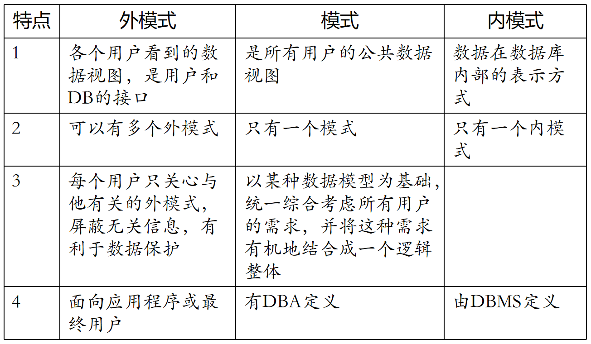
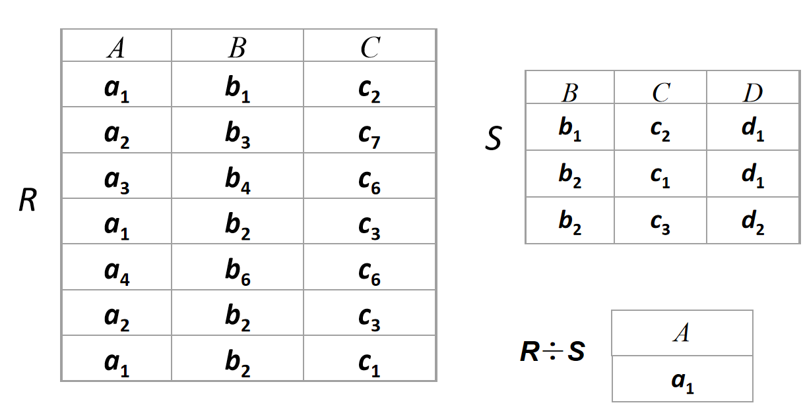
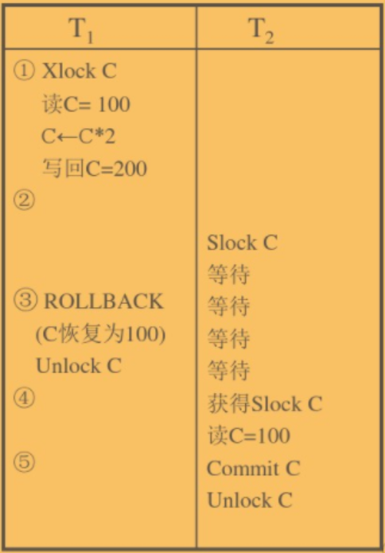
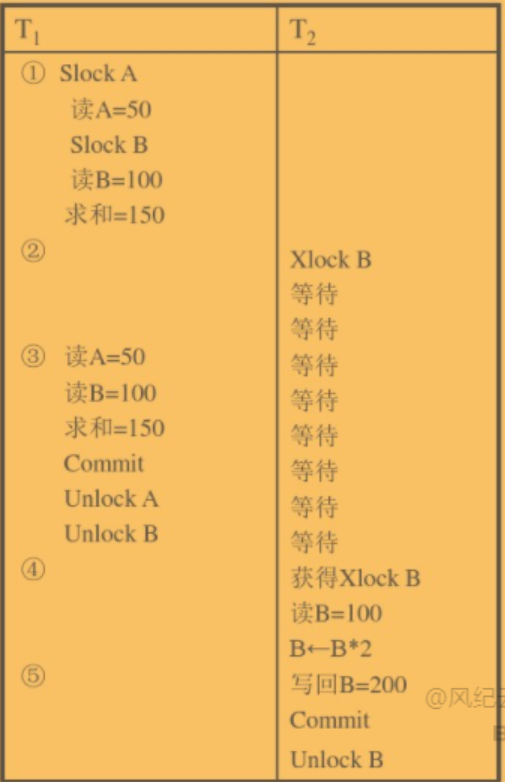
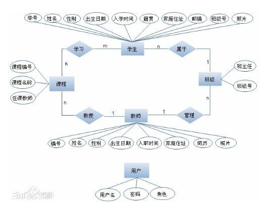

# 概述

## 基本概念

- 数据：描述事物的符号记录
- 数据库：储存在计算机上的**有组织的**数据集合
- 数据库管理系统：用于控制数据储存、获取、维护的系统

- 数据库系统：由数据库、数据库管理系统、应用程序、数据库管理员组合成的整体

## 数据库特点

- 数据结构化：数据的结构和联系由数据库自动维护
- 共享性高：避免重复的数据产生多个副本
- 易扩充：能适应需求的变动
- 独立性高：数据不受物理结构改变影响；应用程序不受数据结构改变影响
- 由数据库管理系统管理控制

## 数据模型

### 概念模型（信息模型）

- 现实事物抽象到信息世界的结果
- 用于设计，用自然语言、图表等描述
- 包含实体、属性、码、实体型、实体集、联系

### 数据模型（逻辑模型）

- 概念模型抽象到机器世界的结果
- 用于开发，用计算机语言描述
- 由三个部分组成：
  - **数据结构**(静态特性)：数据的类型、内容、**抽象关系**（如树中父子节点的关系）
  - **数据操作**(动态特性)：各种操作的含义、规则、实现方式
  - **数据完整性约束条件**：**完整性规则**（如一些数据的值决定/约束另一些数据的值）的集合


## 物理模型

- 数据在系统内部/磁盘上的存储方式和存取方法

### 数据模型分类

| 类型       | 特点                                                         | 优点                                       | 缺点             |
| ---------- | ------------------------------------------------------------ | ------------------------------------------ | ---------------- |
| 层次模型   | 类似树，根节点唯一；若A与B是父子关系，则A持有B的引用；查询只能自根向下进行 | 结构清晰，查询路径明确                     | 无法充分反映现实 |
| 网状模型   | 类似无向图，若A与B有关，则A、B相互持有对方的引用             | 更好反映现实                               | 需要控制查询路径 |
| 关系模型   | 类似表格，若A与B有关，则B的一个属性体现了关系（如外码）      | 严密数学基础，概念统一，不需要关心物理结构 | 需要优化查询操作 |
| 非关系模型 | 泛指各种与关系模型不同的模型                                 |                                            |                  |

**假设有两类相互关联的实体A、B，数据模型的类型取决于实现A与B的关系的方式**（如A是学院，B是学生）

## 数据库系统

### 数据库系统模式



- 模式（schema）：对（某种）数据的**逻辑结构**（各项数据的类型、关联、限制、安全性和完整性要求等）的规定，满足一种模式且具有具体值的数据集合称为该模式的实例
- 模式（逻辑模式）：（数据库中所有）数据的逻辑结构，数据的安全性、完整性要求
- 外模式：数据库用户（包括应用程序员和最终用户）使用的**局部数据**的逻辑结构和特征的描述
- 内模式：数据的物理结构和储存方式（查找、加密、压缩方式等）
- 一个数据库系统有一个模式、一个内模式、若干外模式；每个外模式适用于若干应用，**每个应用只能使用一个外模式**
- 外模式/模式映像：模式到外模式的“映射”，模式变化时，修改此“映射”使外模式保持不变，以实现逻辑独立性
- 模式/内模式映像：同上，实现物理独立性

### 数据库系统组成

- 硬件平台
- 数据库
- 软件
  - 数据库管理系统
  - 操作系统
  - 高级语言及编译器
  - 开发工具（维护数据库）
  - 数据库应用程序（利用数据库）
- 人员
  - 管理员：决定信息内容和结构、存储结构和策略， 定义数据的安全性要求和完整性约束条件、监控数据库的使用和运行，改进重组数据库
  - 系统分析员：需求分析，规范说明，与用户及DBA协商，确定系统的硬软件配置，参与数据库系统的概要设计
  - 数据库设计人员：参加用户需求调查和系统分析，确定数据库中的数据，设计数据库各级模式
  - 应用程序开发者：设计和编写应用系统的程序模块，进行调试和安装
  - 用户

# 关系数据库

- 不同于层次数据库和网状数据库，关系不是实体间的关联，而是属性的关联。多个属性因为某种原因（比如都属于某个实体，比如各自所属的实体有关系）关联在一起形成一条记录，关系是记录的集合


## 关系

- 属性：具有特定数据类型的一类数据
- 域：某一属性的可能值的集合，集合中的元素个数为基数
- 元组：多个属性的各一个值组成的多维值
- 笛卡尔积：**若干个域**的乘积，以元组为元素的集合，基数是各域的基数的乘积
  - 不满足交换律、结合律；对交、并运算满足分配律

- 关系：笛卡尔积的子集，即元组的集合（所有可能的元组中，只有部分是现实存在的）。其中元组的维数称为关系的**目**或**度**
- 候选码：**恰好**（任何一个子集都不能）能作为**元组的标识符**的**属性组**。如果候选码包含了所有属性，则称为**全码**。**候选码可能有多个**
- 主码：实际采用为元组的标识符的**属性组 **（不需要“恰好”）
- 主属性：**候选码**中的属性
- 非主属性/非码属性：不存在于任何一个候选码中的属性
- 外码：关系R的属性组与某个关系（**可以依然是关系R**）中的主码（**完整的主码才算**）有对应关系，则该属性为R的外码（**一个关系中可以存在多个外码**）

$$
R(D1,D2,...) \subseteq D1 \times D2 \times... \quad R:关系(不是关系模式) \quad D_i:域\\
$$

## 关系模式

$$
R(U,D,DOM,F) \\
R:关系名 \\
U:属性名集合 \\
D:域 \\
F:关系内各属性的依赖关系\\ 
DOM:属性到域的映射，如DOM(手机号)=某些11位数字 \\
关系模式简写(不是关系):R(U) = R(A_1,A_2,...) \quad A_i:属性名
$$

## 关系操作

$$
选择: \sigma \ 投影:\prod \ 连接:\bowtie
$$



- 关系操作都是查询操作。而更新操作包括插入、修改、删除
- 包括选择、连接、投影、除、并、差、交等。关系操作的输入和输出都是关系
- 选择、投影、并、差、笛卡尔积是五种基本操作
- 选择：保留关系中满足条件的元组
- 投影：保留关系中的部分属性（会改变关系模式）
- 笛卡尔积：从两个关系中各取一个元组，所有可能的组合为笛卡尔积（会改变关系模式）
- 连接：从两个关系中各取一个元组，所有满足条件的组合为选择（连接比先笛卡尔积再选择占用更小，不过现代数据库会优化查询语句）  
  - 自然连接：先连接，后选择，条件为两个元组的“同名”属性的值相等，然后投影，同名属性仅保留一个（只需要在条件里写相等，不需要写投影操作）
  - 左/右连接：从结果看，在自然连接的基础上，再加入左/右关系中原本被筛选掉的元组（缺少的值置空）
  - 外连接：左连接+右连接

- 像集：给定关系R(X,Z)（X,Z为属性组且互为补集，下同），属性组X的特定值x。从结果看，先选择，条件为属性组X的值等于x，然后投影，仅保留Z
- 除：给定关系R(X,Y),S(Y,Z)（X不能为空，两个Y可以是不同属性集，域相同即可，Z可以为空）。先连接，后选择，条件为R.Y和S.Y的值相等，然后投影，仅保留X                                                                                                                                                                                                                                                                                                                                                                                                                                                                                                                                                                                                                                                                                                                                                                                                                                                                                                                                                                                                                                                                                                                                                                                                                                                                                                                                                                                                                                                                                                                                                                                                                                                                                                                                                                                                                                                                                                                                                                                                                                                                                                                                               

# SQL

## 特征

- 综合统一：能独立完成数据库生命周期的所有活动，且用于各种功能的语句风格统一
- 高度非过程化：自动选择存取路径
- 面向集合的操作方式：各种操作的对象可以是记录的集合（而不是只能操作记录）

## 概念

- SQL：Structured Query Language
- DBA：Database Author，具有所有对象的所有权限
- 用户：具有自己创建的数据表的所有权限，或他人授予的权限.
- DBMS：Database Management System
- **模式(Schema)：基本表的集合**（基本表也有“模式”，指对基本表的定义）
- **外模式：视图的集合**
- 基本表
- 视图：可以通过基本表或视图创建视图。只有**单一基本表的行列子集视图**可以更新
- 索引：加在属性(组)上的数据，为了提高访问属性(组)的效率
  - DBMS可以自动控制是否添加索引，要查找的元组在表中比例较低时，适合使用索引
  - 使用散列/B+/向量空间来支持索引
  - UNIQUE索引：确保每个索引值只对应一个元组
  - CLUSTER索引：聚簇索引，确保这一列的值相等的元组占用连续的一块储存空间。每个表只能有一个聚簇索引

## 模式

```sql
CREATE SCHEMA [<模式名>] AUTHORIZATION <用户名>;	#如果没有指定模式名，默认与用户名一致
DROP SCHEMA <模式名> <CASCADE|RESTRICT>;
```

## 基本表

```sql
CREATE TABLE [模式名.]<表名> 	#创建表时，可以不指定所属的模式名
(
    <列>
    <列>,
    ...,
    [<表级完整性约束条件>]
);
<列>:<列名> <数据类型> <列级完整性约束条件>
<表级完整性约束条件(主键)>:FOREIGN KEY(<外键的属性组>) PREFERENCES <外部表名>(<主键的属性组>)

DROP TABLE <表名> <CASCADE|RESTRICT>;

ALTER TABLE <表名>
[ADD COLUMN <列>]
[ADD <表级完整性约束条件>]
[DROP COLUMN <列名> <CASCADE|RESTRICT>]
[ALTER COLUMN <列名> <数据类型>];		#列名必须是现有的某个列名
```

| 数据类型            | 含义                                            |
| ------------------- | ----------------------------------------------- |
| CHAR(5)/VARCHAR(5)  | 定长字符串（空余的用空格填充）/变长字符串       |
| SMALLINT/INT/BIGINT | 短整数（2Byte）/长整数（4Byte）/大整数（8Byte） |
| DECIMAL(10,2)       | 定点数，数字共10位，其中小数点后有2位           |
| FLOAT(5)            | 浮点数，精度至少为 5位                          |
| DATE/TIME           | 日期（不含时间）/时间                           |

| 列级完整性约束 | 含义                  |
| -------------- | --------------------- |
| PRIMARY KEY    | 组成主键的唯一属性[1] |
| NOT NULL       | 非空                  |
| UNIQUE         | 唯一                  |

[1]：主键有多个属性则必须在列级定义

| 表级完整性约束   | 含义             |
| ---------------- | ---------------- |
| PRIMARY KEY(A,B) | 组成主键的属性组 |

## 索引

```sql
CREATE [<UNIQUE|CLUSTER>] INDEX <索引名>	
ON <表名>(<列索引>,<列索引>,...);	#一个索引可以包含多列，即使它们并不相关

<列索引>:<列名>[<DESC|ASC>]

DROP INDEX <索引名>;

ALTER INDEX <旧索引名> RENAME TO <新索引名>;
```

## 数据查询

```sql
SELECT [ALL|DISTINCT] <查询目标>[,<查询目标>...]
FROM <类表结构>[,<类表结构>...]
[WHERE <条件表达式>]
[GROUP BY <列名> [HAVING<条件表达式>]]	
[ORDER BY <列名> [ASC|DESC]];
#GROUP BY单用仅影响结果的排序;与聚集函数连用，会使聚集函数分别以每组为目标，而不是以整个表为目标
#WHERE的目标永远是每个元组，所以不能使用聚集函数
#HAVING中聚集函数的目标和分组一致，可以筛选出符合条件的组

<类表结构>:<表名> [别名]|<视图名> [别名]|(<子查询>) [别名]
<查询目标>:<列名>|<聚集函数>
<聚集函数>:<函数名>([ALL|DISTINCT] <列名>)

#查询平均成绩大于90的学生的学号和平均成绩
SELECT Sno,AVG(Grade)
FROM SC
GROUP BY Sno
HAVING AVG(Grade)>90;

#Cno表示课程编号,Cpno表示先修课的课程编号,查询每门课的先修课的先修课的课程编号(如果有)
SELECT A.Cno,B.Cpno
FROM Course A,Course B #A和B为Course的别名
WHERE A.Cpno=B.Cno; 

#合并学生的选课情况和具体信息，保留Student中不符合条件的元组(缺失的数据置空)
SELECT * 
FROM Student LEFT OUT JOIN SC USING(Sno);	#含JOIN的语句用USING表示连接条件

#查询与A在同一个系学习的学生(可以翻译成:查询学生,其所在系为X,X为A所在的系)
SELECT Sno,Sname,Sdept
FROM Student
WHERE Sdept IN
	(SELECT Sdept
     FROM Student
     WHERE Sname ='A'
	);

#查询选修了1号课程的学生的姓名(可以翻译成:对于任意一个学生A,如果存在一个元组,同时有A和1号课程,那么A满足查询条件)
SELECT Sname
FROM Student
WHERE EXISTS
	(SELECT *
     FROM SC
     WHERE Sno=Student.Sno AND Cno='1'	#子查询与父查询相关
    );
#通常,其他简单的条件表达式无法表达时,才会使用EXISTS;EXISTS中通常会引用父查询中的表,这样可以对每个元组进行更复杂的条件判断
```

| 条件表达式              | 备注                                                         |
| ----------------------- | ------------------------------------------------------------ |
| =,>,<,>=,<=,!=,<>,!>,!< | 任意值与NULL比较会返回UNKNOWN                                |
| BETWEEN 20 AND 23       |                                                              |
| AND,OR,NOT              | UNKOWN表示不确定，如 ：1×U=U，1+U=1                          |
| ANY                     | 跟在比较符号右侧，修饰值的集合（比如子查询结果），下同；表示集合中任意一个元素满足条件即可 |
| ALL                     | 表示集合中所有元素都满足条件才可以                           |
| IS NULL,IS NOT NULL     | 不要写成NOT IS NULL                                          |
| IN                      |                                                              |
| LIKE                    | %匹配任意字符串,_匹配任意字符,\%表示%本身                    |
| EXSITS                  | 修饰子查询结果，测试子查询结果是否不为空（所以子查询中不需要投影） |

| 聚集函数        | 备注                                         |
| --------------- | -------------------------------------------- |
| COUNT           | 如果不用DISTINCT或GROUP BY，直接COUNT(*)即可 |
| SUM,AVG,MAX,MIN |                                              |

| 集合运算  | 备注                                                       |
| --------- | ---------------------------------------------------------- |
| UNION     | 并，连接两个子查询结果，子查询结果不需要用括号括起来，下同 |
| INTERSECT | 交                                                         |
| EXCEPT    | 差                                                         |

## 更新数据

```sql
INSERT INTO <表名|视图名>[(<属性组>)]	#不注明属性组表示要给出所有属性的值
VALUES (<一组值>)|<子查询>;

#按系分组统计平均年龄,存入Dept_Age表中
INSERT INTO Dept_age(Sdept,Avg_age)
SELECT Sdept,AVG(Sage)
FROM Student
GROUP BY Sdept;

UPDATE <表名|视图名>
SET <修改项>[,<修改项>...]
[WHERE <条件表达式>];

<修改项>:<列名>=<表达式>

DELETE FROM <表名|视图名>
[WHERE <条件表达式>];
```

## 视图

```sql
CREATE VIEW <视图名> <属性组>
AS <子查询>
[WITH CHECK OPTION];  #表示之后增改元素时,也要满足子查询中的条件

DROP VIEW <视图名>;	#默认CASCADE,且不能设为RESTRICT;CASCADE指的是删除从此视图导出其他视图,与原本的表无关
```

## 权限

```sql
GRANT <权限>[,<权限>]... 
ON <TABLE|VIEW> <表名|视图名>
TO <用户>[,<用户>]...
[WITH GRANT OPTION];	#表示该用户可以继续将该权限授予其他用户

REVOKE <权限>[,<权限>]... 
ON <对象类型> <对象名>
FROM <用户>[,<用户>]...[CASCADE|RESTRICT];

CREATE  USER  <用户名>
[WITH] [DBA|RESOURCE|CONNECT];

#把用户U4修改学生学号的权限收回
REVOKE UPDATE(Sno)
ON TABLE Student
FROM U4;
```

| 权限           | 含义           |
| -------------- | -------------- |
| ALL PRIVILEGES | 所有权限       |
| INDEX          | 增删改索引     |
| CREATE         | 创建表         |
| ALTER          | 增删改表的属性 |
| DROP           | 删除表         |
| SELECT         | 读数据         |
| INSERT         | 插入数据       |
| UPDATE         | 修改数据       |
| DELETE         | 删除数据       |

# 数据库安全性

核心要求：只有有合法权限的用户能访问其权限规定的数据

## 不安全因素

- 非授权用户恶意操作
- 敏感数据泄露
- 安全环境脆弱：包括硬件、操作系统、网络等

## 安全性控制

### 鉴别用户

- 静态口令：输入固定的内容
- 动态口令：每次验证时输入新内容（如短信验证）
- 生物特征
- 智能卡

### 权限控制

- 定义用户权限：存在类似字典的数据结构中
- 权限检查
- 自主存取控制(DAC)：C2安全级。简单地根据授权控制用户的行为
- 强制存取控制(MAC)：B1安全级。在DAC基础上，再加一层控制。对数据库中的各种对象（用户，表，索引等）定义**密级**（绝密>机密>可信>公开）。用户密级>=对象密级时，可读取；用户密级<=对象密级时，可修改（用户可以增加新的对象，并将其密级设为高于自己，而原本高于自身的密级的对象，因为无法读取，自然也无法修改；也避免用户密级高的用户将高密级对象写入低密级对象造成泄露）
- 数据库角色（ROLE）：一系列权限的集合。将用户定义为某种角色即授予其一组权限 

### 视图机制

- 视图源于一或多个基本表（或视图），可以在视图上定义存取权限，以实现用户只能存取**部分**记录
- 如果系统支持存取谓词的用户权限定义，可以不依赖视图（如：规定，A用户只能存取B表上“学科”属性为“计算机系”的记录）

### 审计

- 记录用户的操作，存入审计日志
- 审计员利用日志监视、恢复数据、找出非法操作

#### 审计事件

- 服务器事件：数据服务器启动、停止、配置文件变化
- 系统权限：访问系统中的结构或模式对象等涉及系统权限的行为
- 语句事件：对SQL语句和DCL语句的审计
- 模式对象事件：对模式对象（可以设定关注哪些模式对象）的SELECT操作和DML(Data Manipulation Language)的操作
  - 模式对象：表，视图，存储过程，函数等
  - 非模式对象：索引，约束，触发器，分区表等

#### 审计功能

- 查阅审计
- 设定审计规则
- 审计分析和报表
- 审计的专门视图

### 数据加密 

- 存储加密：储存加密的数据，读取时解密
  - 透明加密：加密过程对用户透明（完全由用户可见的对象，如密钥组成）
  - 非透明加密：加密过程对用户不透明（完全由不可见的加密函数组成）
- 传输加密：发送加密的数据，读取时解密
  - 链路加密：在链路层加密，报头报文均加密
  - 端到端加密：在发送端加密，仅加密报文

### 其他

- 推理控制：避免用户通过函数、列依赖关系等推理出更高密级的数据
- 隐蔽信道：隐蔽信道是未解决的问题。用户能够通过存取限制跨密级传递信息，比如，unique约束列不能包含相同数据，而不同的等级的用户可以向该列插入数据并获得反馈
- 数据隐私

# 数据库完整性

- 数据库完整性指数据的**正确性**和**相容性**
- **实体完整性**和**参照完整性**是所有**关系型数据库**固有的要求，此外还有用户定义完整性要求

## 目标

- 能**定义完整性约束**
- 能检查完整性
- 能进行违约处理

## 实体完整性

- 关系的主码中的所有属性非空且不重复（**但未被选为主码的候选码中的属性可以为空**）	

## 参照完整性

- **参照表**的外码必须依赖**被参照表**，只能从被参照表的主码中取值（或取空值）
- 对参照表插入元组/修改外码值，违约时，拒绝操作
- 对被参照表删除元素/修改被参照的主码值，违约时，可以选择拒绝操作/级联删除/外码置空

## 用户定义完整性

- 属性约束条件：非空，唯一，满足表达式等
- 元组约束条件：不同属性值间的约束

## 断言

- 形式更灵活的约束（CONSTRAINT只能在一张表内定义，而断言可以使用SELECT子句）
- 开销极大

## 触发器

- 发生事件，满足某种条件时，执行某些动作

# 关系数据理论

## 函数依赖

- 函数依赖：有属性组X,Y。若**不可能**（不仅是现在没有，之后也不可能有）出现“X的值相等而Y的值不相等”的情况，则Y依赖X，或X决定Y；其中X称为左部
  - 完全函数依赖：若X中的所有属性共同决定Y
  - 部分函数依赖：若X中的部分属性即决定Y
  - 平凡函数依赖：Y依赖X，但Y是X的子集
  - 传递函数依赖：Z**非平凡**依赖Y，Y**非平凡**依赖X（**且X不依赖Y**），则Z传递依赖X
- 主码、候选码、主属性、非主属性：见关系
  
- 多值依赖：有属性组X,Y,Z，其中Z=U-X-Y。若不论Z如何改变，X的值总是决定了一组Y的值（比如，“课程”的值决定“授课老师”的值，且“授课老师”的值有多个），则Y多值依赖X
  - 平凡多值依赖：Z为空；即整个元组完全由X和Y组成，且Y多值依赖X


## 范式

- 范式有多个等级，每个等级在低一等级的基础上添加限制
- 规范化总体上使表的数量变多，每个表的内容变少，用(查询)时间换空间，导致语义损失
- 1NF：每个属性不可再分
- 2NF：任何非主属性组**完全**依赖至少一个候选码（元组必然完全依赖候选码，但某些属性未必）
- 3NF：**不存在**非主属性组对候选码的**传递函数依赖**
- BCNF：所有**非平凡函数依赖**中，左部必然**包含至少一个候选码中的全部属性**（候选码的子集不是候选码）
- 4NF：不存在**非平凡多值依赖**
- 5NF：不存在**连接依赖**

## 数据依赖的公理系统

- 函数依赖集的闭包：函数依赖集中的函数以及它们能推导出的所有函数构成的新函数依赖集
- 属性集在函数依赖集上的闭包：某属性**利用函数依赖集中的函数决定的所有属性**构成的属性集
- 极小函数依赖集（最小覆盖）：所有函数依赖集都有与其等价的最小覆盖（**不一定唯一**）

$$
有关系模式R<U,F>U,U为所有属性组,F为函数依赖集\\
自反律:Y \subseteq X \Rightarrow X \rightarrow Y \\
增广律:X \rightarrow Y \Rightarrow XZ \rightarrow YZ \quad XZ表示 X和Z合并成的新属性组,下同\\
传递律:X \rightarrow Y,Y \rightarrow Z \Rightarrow X \rightarrow Z \\
合并/分解规则:X \rightarrow Y,X \rightarrow Z \Leftrightarrow X \rightarrow YZ \\
伪传递规则:X \rightarrow Y,YW \rightarrow Z \Rightarrow XW \rightarrow Z \\
\\
若F^+ =\{f|f能通过F中的依赖推出\},F^+是F的闭包 \\
F\subseteq G^+,G \subseteq F^+ \Leftrightarrow F^+ = G^+ (F覆盖G,G覆盖F,F与G等价)\\
若X_F^+ = \{A|X\rightarrow A能由F中的函数推出\},X_F^+是属性集X关于函数依赖集F的闭包\\
$$

## 模式分解(垂直分解)

- 关系模式的分解：将关系模式分解成多个关系模式（称为投影），称原关系是其投影的连接
- 分解前后的模式**等价**有三种不同等级的规定：
  - 满足无损连接性
  - 保持函数依赖
  - 同时满足上面两种条件

- 无损连接性：通过自然连接可以还原出原关系
- 保持函数依赖：分解前后的函数依赖等价
- 若要求保持函数依赖（不论是否保持无损连接），总可以达到3NF；若只要求无损连接性，总可以达到4NF

$$
关系R<U,F>的分解:\rho = \{R_1 <U_1,F_1>,...R_n<U_n,F_n>\}\\
其中U=\bigcup_{i=1}^{n}U_i,\forall i \ne j,\neg \exist U_i \subseteq U_j \\
其中F_i是F在U_i上的投影,F_i=\{X\rightarrow Y|X\rightarrow Y \in F^+,XY\} \\
$$

## 水平分解

- 将数据库的元组划分成几组，每组构成子关系。不破坏关系模式，所以不是模式分解
- 将较常访问的数据划分出来可以提高查询效率

# 关系处理和查询优化

## 查询

### 查询过程

1. 查询分析：对语句进行扫描、词法分析、语法分析
2. 查询检查：进行语义检查（静态的、与实际数据无关的检查）。通过检查后生成关系代数表达式，用查询树（语法分析树）表示
3. 查询优化：进行代数优化（优化关系代数表达式）和物理优化（优化存取路径和底层操作算法的选择）。优化是基于规则的（人为规定的不变的规则），基于代价的（视情况选择策略）或基于语义的
4. 查询执行：由优化后的查询计划通过代码生成器生成代码并执行

### 查询代价

- 代价=IO代价+CPU代价+内存代价+通信代价（对于分布式数据库）
- IO代价的数量级远高于其他代价
- 查询时每次回从硬盘中读取若干数据到内存中，大小受可用内存大小限制，也受硬盘每块大小影响

### SELECT算法

- 全表扫描算法：按顺序每次读取多块数据到内存中，遍历内存中的所有元组。重复直到遍历所有元组
- 索引扫描算法：索引的数据结构中储存了元组的引用。根据要查找的数据满足的条件找到对应的索引，然后由元组引用获取元组

### JOIN算法

- 通常，FROM A,B子句中右边的表是外表（即每次从中取出一个元组，与另一个表所有元组连接的表）
- 嵌套循环算法：每次读取一块左操作表元组和多块右操作表元组到内存中，然后每次从内存中取出左操作表中的一个元组，与内存中右操作表中的每个元素比较，判断是否满足连接条件
- 排序-合并算法：（用于自然连接）对左操作表和右操作表排序。用两个指针指向两表的开头，当一方指向的数较小（或较大时），向后移动。如果两边相等，输出到结果，两边指针向后移动。直至一边遍历完
- 索引连接算法：（用于自然连接）每次取出左操作表中的一个元组，在右操作表中使用索引查找用于连接的属性的值相等的元组
- 哈希连接算法：创建一个散列（hash值由用于连接的属性得出），将两表的元组引用置入散列中。后对于散列的每一列，逐个判断其中的元组是否满足连接条件

## 代数优化

- 优先执行选择操作
- **投影和选择可以同时进行**
- 尽量将投影同其前后的**双目**运算符（如连接）结合起来
- 尽量将同样的投影操作提取出来（每次投影都会扫描关系）
- 避免重复计算公共子表达式

## 物理优化

### 选择操作启发式规则

- 对于小关系（如能一次性读入内存的关系），总是使用全表扫描
- 对于大关系，估算选择率，选择率低时优先使用索引，否则优先使用全表扫描
  - 条件为主码等于特定值时，选择率必然低，且这种情况下，可能会自动建立主码索引
  - 如果有AND连接的条件，优先使用组合索引，其次使用单个属性的索引，否则使用全表扫描
  - 对于OR连接的条件，使用全表扫描

### 连接操作启发式规则

按优先级：

1. 若两表均已排序，使用排序-合并算法

2. 若任何一表有索引，使用索引连接算法

3. 若其中一表较小，使用哈希连接算法
4. 最后选择循环嵌套算法，令较小的表为外表（I/O次数更少）

### 表统计信息

- 基本表：元组总数，元组长度，占用块数，占用溢出块数
- 基本表的列：不同值个数，最大值，最小值，索引类型
- 索引（B+树）：层数，索引值个数，索引的选择基数（有多少个元组具有某个索引值），索引叶节点数

### 代价估算

- 通过数学方法推断操作的平均/最坏代价

# 数据库事务

## 事务

- 事务是用户定义的（也能由程序自动将操作序列划分成若干事务）操作序列，不可分割
- SQL中事务由BEGIN TRANSACTION开始，由COMMIT或ROLLBACK结束（日志中仅有BENGIN TRANSACTION记录表明事务尚未完成）
- 特性：
  - 原子性(Atomicity)：不能只执行事物一部分
  - 一致性(Consistency)：数据库的状态必须符合事务的结果
  - 隔离性(Isolation)：并发的事务互不干扰
  - 持续性(Durability)：事务对数据库的改变应当是永久性的

## 故障

- 事务内部的故障：事务中发生的故障。若操作无法达到预期，进行回滚，分为可预期故障和不可预期故障
- 系统故障：软件层面造成系统停止运转的事件。恢复后要撤销未完成的事务，重做已完成但之前未写入数据库的事务
- 介质故障：硬件层面的故障
- 计算机病毒

## 恢复

- 故障导致数据损失或错误，而数据库存储数据有冗余，利用冗余数据恢复数据

### 数据转储

- 定期保存数据库的备份
- 恢复使数据库恢复到某一时刻的状态，要重做该时刻到目前的事务。故建立日志文件记录事务
- 静态转储：系统无事务运行时转储
- 动态转储：事务运行时同时转储
- 海量转储：重新转储整个数据库
- 增量转储：只转储更新的数据

### 日志文件

记录事务对数据库的修改

#### 内容

- 事务开始标记、结束标记、每个更新操作均对应一条日志记录
- 每条记录内容包括：事务标识，操作类型，操作对象，更新前的值，更新后的值

#### 登记

- 必须按时间顺序登记
- 必须先写日志文件，后写数据库

### 恢复策略

- 事务故障：反向扫描日志文件，找出故障的事务的更新操作，逐个进行逆操作，直到找到该事务的开始标记
- 系统故障：正向扫描日志文件，**对于已提交但未写入数据库的**，加入重做队列；**对于未提交但写入数据库的**，加入撤销队列。反向扫描撤销队列以撤销；正向扫描重做队列以重做
- 介质故障：装入最近的数据库副本，装入最近一次备份直至现在的日志文件，执行其中的所有操作（如果在动态转储过程中发生了故障，像处理系统故障那样处理这故障发生时的事务）
- 做题时，会给出一份日志，一份初始状态，以及故障发生的事件。**计算系统恢复后的状态时，从初始状态开始算**

| 故障时事务状态 | 恢复时操作 | 对恢复后状态的贡献 |
| -------------- | ---------- | ------------------ |
| 未开始         | 无         | 无                 |
| 已提交         | 重做       | 有                 |
| 已回滚         | 无         | 无                 |
| 已开始未提交   | 回滚       | 无                 |
| 已开始未回滚   | 回滚       | 无                 |

## 带检查点的恢复技术

- 检查点记录：检查点时刻正在执行的记录，以及该时刻之前最晚一条记录的地址。位于日志文件中，
- 重新开始文件：各个检查点记录在日志文件中的位置。独立于日志文件的文件

- 每次创建检查点时，相当于创建了一个备份，但区别是，重新开始文件可以快速定位检查点记录，检查点记录可以快速定位检查点时到现在的事务记录，**不必扫描整个日志**

## 数据库镜像

- 一直同步另一个数据库的所有操作，保持相同的状态

# 并发控制

- 事务是并发控制的基本单位

## 错误类型

- 丢失修改：两事务**同时修改一个数据**，导致其中一个修改失效
- 读脏数据：某事务执行过程中，修改了一个数据后，另一个事务读取该数据，但之前的事务被**撤销**，导致读取了错误的值
- 不可重复读：某个会**读取某种数据多次**的事务执行过程中，读取的数据被其他事务修改，导致相同的读取操作带来不同的结果

## 封锁

- 锁是属于事务的，而不是属于数据对象的

### 锁类型

- 排他锁(写锁,X锁)：除了锁所属的事务，其他事务不能读写数据。不能与X/S锁共存
- 共享锁(读锁,S锁)：除了锁所属的事务，其他事务不能写数据，可以读数据。不能与X锁共存，能与S锁共存

### 封锁协议

- **如果要写某个数据，仅对该数据上X锁（如果同时又要读，上X锁时间应当在所有读写操作之前）；如果仅要读某个数据，对该数据上S锁。遵守封锁协议的条件下，一个数据上不可能同时存在来自一个事务的两种锁**

| 协议等级 | 上X锁             | 上S锁          | 释放X锁    | 释放S锁          |
| -------- | ----------------- | -------------- | ---------- | ---------------- |
| 一级     | (最晚)读/写数据前 | 不需要         | 事务结束时 | 不需要           |
| 二级     | (最晚)读/写数据前 | (最晚)读数据前 | 事务结束时 | (最早)读完数据后 |
| 三级     | (最晚)读/写数据前 | (最晚)读数据前 | 事务结束时 | 事务结束时       |

| 协议等级 | 避免丢失修改 | 避免读脏数据 | 确保可重复读 |
| -------- | ------------ | ------------ | ------------ |
| 一级     | √            |              |              |
| 二级     | √            | √            |              |
| 三级     | √            | √            | √            |



## 活锁

- 许多事务请求对某数据上锁时，可能有一个事务一直等待，即活锁
- 先请求先服务即可消除活锁

## 死锁

- 如果遵守封锁协议（或只使用X锁），至少两个事务同时依赖至少两个数据时可能出现死锁
- 如果不遵守封锁协议且使用两种锁，两个事务同时依赖一个数据时，即可能出现死锁

### 避免死锁

- 一次封锁法：要求程序在已开始就封锁所有需要封锁的数据。不是所有程序都能事先确定要封锁的数据，且一次封锁会使性能下降
- 顺序封锁法：对数据对象按某种方式排序，要求封锁数据时必须符合顺序。不是所有程序都能事先确定要封锁的数据，且维护大量数据的排序开销极大

### 诊断死锁

- 超时法：事务等待时间过长表明发生死锁
- 等待图法：确定事务的等待关系，判断等待图上是否有环

### 消除死锁

- 从引发死锁的事物中，选择一部分撤销，待其他事物执行完再执行

## 并发调度的可串行性

- 如果一种并发的事务调度产生的结果与某种串行调度产生的结果等价（**只看结果**），称其具有可串行性，称这种调度为**可串行化调度**
- 只有串行调度和可串行化调度是正确的调度

### 冲突操作

- 对同一数据的一个写操作加上另一个读/写操作是冲突操作（但任意两个读操作不是冲突操作）
- 要确保结果符合预期，**对同一数据的**冲突操作的**相对顺序**不能改变
- 对于一个调度，结果不变的前提下，按任意方式调整其中的非冲突操作的顺序，如果能得到一种**串行调度**，称这个调度为**冲突可串行化调度**
- 冲突可串行化调度必然是可串行化调度，反之不然

### 两段锁协议

- 每个事物被分成两个阶段：扩展阶段和收缩阶段。扩展阶段只能获得锁，第二阶段只能释放锁
- 遵守两段锁协议是可串行化调度的**充分条件**
- 一次封锁法是两段锁协议的特殊情况，两段锁协议不一定能避免死锁
- 强两段锁协议：所有锁必须在事务提交后释放

## 封锁的粒度

- 封锁粒度：被封锁对象的大小
- 封锁粒度越大，并发性越低，系统开销越小

### 多粒度封锁

- 多粒度封锁：同时支持多种封锁粒度
- 多粒度树：从树的根节点到叶节点，粒度逐渐降低，如：数据库→数据分区→关系→元组
- 显式封锁：由事务直接指定的数据对象上的锁
- 隐式封锁：上级节点上的锁导致数据对象被封锁，考虑锁的冲突时也要考虑隐式封锁

### 意向锁

- 如果要对某节点加锁，其所有上层节点必须有意向锁（如果节点加了X锁，那么其及其子节点不能加任何其他锁）
- IS锁：有IS锁的节点的子节点可以加S锁
- IX锁：有IX锁的节点的字节点可以加X锁
- SIX锁：相当于同时加S锁和IX锁

列表示已有的锁，行表示试图添加的锁（**对同一节点和子节点都如下**）：

|      | IS   | IX   | SIX  |
| ---- | ---- | ---- | ---- |
| IS   | √    | √    | √    |
| IX   | √    | √    |      |
| SIX  | √    |      |      |

# 数据库设计

## 步骤

1. 需求分析
2. 概念结构设计：编写数据字典，形成**概念模型**
3. 逻辑结构设计：将概念模型转化为**数据模型**，并优化数据模型
4. 物理结构设计：确定**物理结构**，并评价
5. 数据库实施：加入数据，测试运行
6. 数据库运行和维护

## 需求分析

### 任务

- 确定信息要求：需要从数据库中获取的数据
- 确定处理要求：需要支持的处理操作以及性能要求
- 确定安全性与完整性要求

### 方法

- 调查用户需求，然后分析和表达这些需求
  1. 调查组织结构情况
  2. 调查各部门的业务活动情况
  3. 协助用户明确对新系统的各种要求
  4. 确定新系统的边界
- 分析需求时，常用结构化分析(Structed Analysis)方法

## 数据字典

- 对数据库中数据的描述（数据的元数据，不是具体数据，也不是表的元数据）
- 通常包括：
  - 数据项：基本信息，类型，范围，与其他数据的关联
  - 数据结构：基本信息，具体结构
  - 数据流：基本信息，来源，去向，数据结构，流量
  - 数据存储：基本信息，输入/输出数据流，数据结构，存取频度，存取方式
  - 处理过程：基本信息，输入/输出数据流，处理内容

## 概念结构设计

- 可以用E-R图，UML等方式表述

### E-R图



- 假设A,B两个实体经中间的联系C连接。在动作C中（**不是指一次动作中，而是所有可能的动作中**），**一个A可能和几个B有关，就在B连出的线上写几**，对另一方亦然
- 选择性画属性，优先画码

## 逻辑结构设计

- E-R图转数据模型
- 数据模型的优化：适当的选择规范化程度
- 设计用户子模式

## 物理结构设计

### 存取方法选择

*默认情况下，没有特殊的存取手段，下面都是可选的特殊存取手段*

#### B+树索引

- 能用在属性组上的索引（此时称为组合索引）
- 适用于查询中经常访问（查询条件，聚集函数，连接条件等）的**属性(组)**
- 维护索引有代价，尤其是更改频繁时

#### hash索引

- 适合用于经常出现在**等值条件**中的**属性**
- 适用于大小固定的关系，如果数据库管理系统提供动态hash存取方法，也可以用于大小变化的关系

#### 聚簇索引

- 有聚簇索引的属性被称为**聚簇码**，不应该频繁修改聚簇码
- 确保一个属性上的值相同的元组相邻排列（所以还是逐元组存储，单个属性没有直接相邻），**可以跨多个关系，使多个关系的具有此属性且值相同得元组相邻排列**
- 一个关系上只能有一个聚簇索引
- 适用于经常出现重复值的属性，不适用于经常更新的关系
- 连接、查询效率大幅提高，更新效率大幅降低

### 存取结构选择

- 确定存放位置：表与索引分开存、表分多块存都有利于提高访问效率
- 确定系统配置

