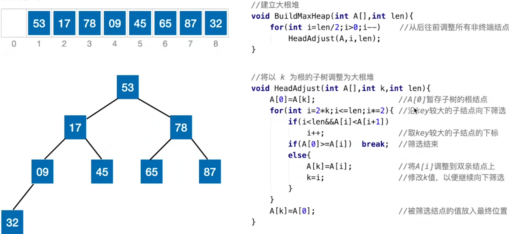
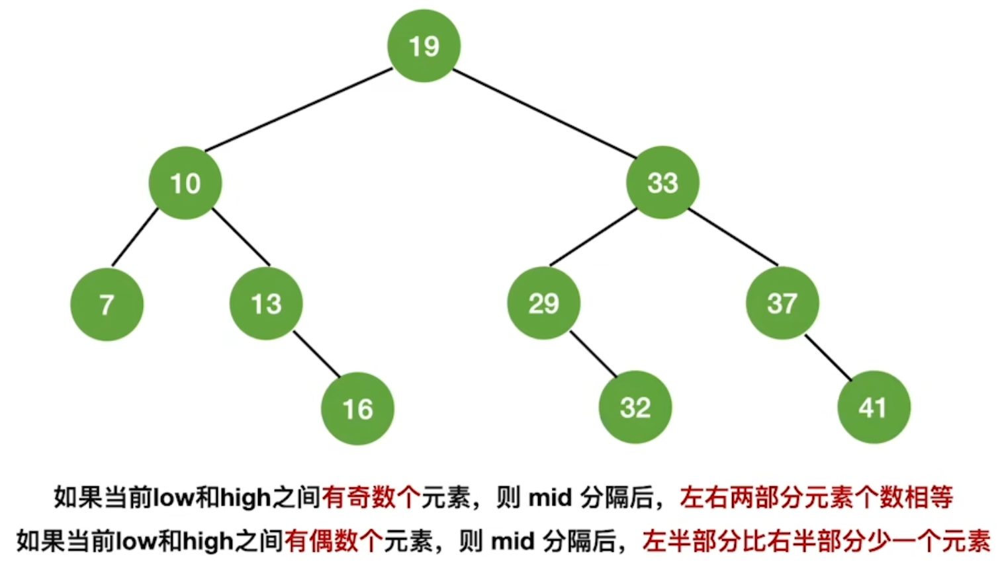
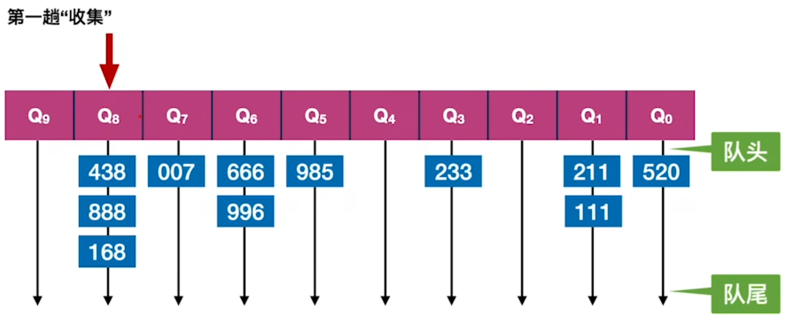

# 	绪论

## 数据

- 数据元素：数据的基本单位，通常被作为整体考虑和处理（如类实例）
- 数据项：构成数据元素的不可分割的最小单位（如字段）
- 数据对象：具有相同性质的数据元素的集合（如“整数集”）
- 数据类型：值的集合以及可以对此集合中的元素进行的操作（如,int是类型,对int类型的数据可以进行加法）
  - 原子类型：值不可再分
  - 结构类型：值可以再分
  - 抽象数据类型（ADT）：包括数据的逻辑结构和以及相关操作
- 数据结构：有特定关系的**数据元素**的集合。数据间的关系体现在**逻辑结构**、**存储结构**和**数据运算**
  - 逻辑结构：数据元素间的逻辑关系（**当一个词仅指定了逻辑结构，而没有指定存储结构时，才能说这个词是逻辑结构**）
    - **线性结构**：线性表（一般线性表，栈，队列，串，数组，哈希表）
    - **非线性结构**：集合（一般集合，树，图）
  - 存储结构：数据结构在计算机中的表示
    - **顺序存储**：所有元素存储在连续的一块空间中，**元素的物理位置体现逻辑关系（包括数组二叉树、静态链表，不包括散列）**
    - **链式存储**：结点（数据元素+指针）之间未必连续，每个结点记录下一个节点的地址
    - **索引存储**：使用索引表记录数据的地址
    - **散列存储**：根据数据内容直接计算出地址
  - 数据运算：数据运算的定义只与逻辑结构有关，数据运算的实现直接取决于存储结构

| 数据结构名  | 逻辑结构                         | 存储结构                   |
| ----------- | -------------------------------- | -------------------------- |
| 线性表      | 若干同种元素构成的序列           |                            |
| 栈/队列     | 操作受限的线性表                 |                            |
| 数组        |                                  | 顺序存储                   |
| 循环队列    | 同队列                           | 空间循环使用，故为顺序存储 |
| 哈希表/散列 | 同线性表                         | 散列存储                   |
| 顺序表      | 同线性表                         | 顺序存储                   |
| 有序表      | 元素的排序符合特定规律的线性表   |                            |
| 链表        | 同线性表                         | 链式存储                   |
| 静态链表    | 同链表                           | 顺序存储                   |
| 集合        | 没有”序列“的概念                 |                            |
| 图/树       | 集合的一种，元素间通过边关联起来 |                            |

## 算法

- 算法：是**对求解特定问题的步骤的描述**，由**有限指令序列**组成（不局限于计算机指令）
- 五特性：有穷性，确定性（输入确定时输出也确定），可行性，输入（可以无输入），输出

- 目标：正确性，可读性，健壮性，高效率和低存储需求

- 时间复杂度：一个函数，自变量为问题规模，因变量为算法中所有语句执行次数的数量级
- 空间复杂度：一个函数，自变量为问题规模，因变量为算法占用存储空间的数量级（除了主动分配的存储空间，还包括本身的指令、常数等占用的空间，只是它们不影响数量级）

## 时间/空间复杂度

### 记号

$$
O(n^2):某个上界是n^2 \\
\Omega(n^2):某个下界是n^2 \\
\Theta(n^2):n^2既是上界又是下界 \\
o(n^2):以n^2为上界但不以n^2为下界 \\
\omega(n^2):以n^2为下界但不以n^2为上界 \\
$$

### 检索型数据结构

| 数据结构           | 构造         | 查找         | 插入                  | 删除    | 其他                 |
| ------------------ | ------------ | ------------ | --------------------- | ------- | -------------------- |
| 数组               | O(N)         | O(N)         | 平均O(N)              | O(N)    |                      |
| 有序数组           | O(NlogN)     | O(logN)      | 平均O(N)              | O(N)    |                      |
| 可变长数组         | O(N)         | O(N)         | 平均O(N)              | O(N)    |                      |
| 堆栈               | O(N)         | 禁止         | O(1)                  | O(1)    |                      |
| 队列               | O(N)         | 禁止         | O(1)                  | O(1)    |                      |
| 链表               | O(N)         | O(N)         | O(1)                  | O(1)    |                      |
| 散列（拉链）       | O(N)         | 最坏O(N)     | O(1)                  | O(1)    |                      |
| 散列（开放定址）   | O(NlogN)     | 接近O(1)     | 接近O(1)              | 禁止    |                      |
| 哈希集             | O(N)         | O(1)         | O(1)                  | O(1)    | 合并O(N)             |
| 字典/映射          | O(N)         | 接近O(1)     | 接近O(1)              | O(1)    | 按值查找O(N)         |
| AVL树[1]           | **O(NlogN)** | O(logN)      | O(logN)               | O(logN) |                      |
| 红黑树             | **O(NlogN)** | O(logN)      | O(logN)               | O(logN) |                      |
| 二叉堆             | **O(N)**     | O(N)         | O(logN)               | O(logN) | 合并O(N)             |
| 左式堆             | O(NlogN)     | O(N)         | O(logN)               | O(logN) | 合并O(logN)          |
| 二项队列           | O(N)         | O(N)         | 最坏O(logN)  平均O(1) | O(logN) | 合并O(logN)          |
| 并查集             | 最坏O(N^2)   | 最坏O(N)     | 未定义                | 未定义  | 最坏指合并“方向”最坏 |
| 并查集（合并优化） | O(NlogN)     | 最坏O(logN)  | 未定义                | 未定义  |                      |
| 并查集（两种优化） | O(NlogN)     | 逐渐趋于O(1) | 未定义                | 未定义  |                      |

- 现代计算机中，缓存命中率对算法运行时间的影响很大，有时会超过算法本身复杂度的影响（如链表容易造成缓存未命中）

### 图

| 操作                        | 邻接矩阵              | 邻接表（无向图） | 邻接表（有向图）      |
| --------------------------- | --------------------- | ---------------- | --------------------- |
| 判断边是否存在              | O(1)                  | 平均O(N)         | 平均O(N)              |
| 获取/修改指定边的权值       | O(1)                  | 平均O(N)         | 平均O(N)              |
| 添加孤立顶点[2]             | O(1)                  | O(1)             | O(1)                  |
| 删除顶点[3]                 | 最坏O(N^2) 懒删除O(V) | 最坏O(E)         | 最坏O(V+E)            |
| 增加边[4]                   | O(1)                  | O(1)             | O(1)                  |
| 删除边                      | O(1)                  | O(N)             | 出边O(N)              |
| 查找某顶点的第一条邻接边[5] | 最坏O(V)              | O(1)             | 出边O(1) 入边最坏O(E) |
| 查找某顶点的所有邻接边      | O(V)                  | O(N)             | 出边O(N)  入边O(E)    |
| 广度优先搜索[6]             | O(V^2)                | **O(V+E)**       | O(V+E)                |
| 深度优先搜索，拓扑排序[7]   | O(V^2)                | **O(V+E)**       | O(V+E)                |

注1：下表中，V表示总顶点数，E表示总边数，N表示一个顶点的度/入度/出度（N $\le$ E）

注2：对于邻接矩阵，其顶点数量可变且有限，初始就分配好了一定大小的二维数组，顶点数表明了要使用这个数组的多大部分

注3：邻接矩阵中，删除一个顶点后，该顶点之后的行列要上移，填补空白（也可以懒删除法）

注4：邻接表中，增加边时使用头插法

注5：查找第一条邻接边，也意味着查找第一个邻接点

注6：空间复杂度为O(V)

注7：空间复杂度最坏为O(V)（递归可能产生多层函数调用栈，申请成倍的空间）

| 操作         | 时间复杂度                                   |
| ------------ | -------------------------------------------- |
| Prim算法     | O(V^2)                                       |
| Kruskal算法  | O(ElogE)                                     |
| Dijstra算法  | 基于堆O((V+E)logV)  基于斐波那契堆O(E+VlogV) |
| Floyd算法[1] | O(V^3)                                       |

注1：空间复杂度为O(V^2)

### 串

| 操作             | 时间复杂度                  |
| ---------------- | --------------------------- |
| 模式匹配         | 朴素匹配O(MN) KMP算法O(N+M) |
| 计算最小编辑距离 | O(MN)                       |

### 排序

| 方法         | 额外空间                                | 时间                        | 是否稳定 |
| ------------ | --------------------------------------- | --------------------------- | -------- |
| 冒泡排序     | O(1)                                    | O(N^2)                      | 是       |
| 简单选择排序 | O(1)                                    | O(N^2)                      | **否**   |
| 插入排序     | O(N)                                    | 最好O(N) 平均O(N^2)         | 是       |
| 希尔排序     | O(1)                                    | 最好大约O(N^1.3) 最坏O(N^2) | **否**   |
| 快速排序[1]  | 非递归O(1) 递归最坏O(N) 递归最好O(logN) | 最坏O(N^2)  平均O(NlogN)    | **否**   |
| 归并排序     | 非递归O(N)                              | O(NlogN)                    | 是       |
| 堆排序       | O(N)                                    | O(NlogN)                    | **否**   |
| 基数排序[2]  | O(M+N)                                  | O(K(M+N))                   | 是       |

注1：默认快速排序是非递归的，额外空间不是O(1)

注2：M为桶个数，K为所需的桶排序次数；N远大于M时，时间复杂度可以改为O(KN)

# 线性表

- 线性表：具有**相同数据类型**的若干元素组成的**有限序列**
- 顺序表：顺序存储的线性表
- 链表：链式存储的线性表
- 堆栈：只能在一端（栈顶）插入或删除元素的线性表
- 队列：只能在一端（队首）删除元素，另一端插入元素（队尾）
- 数组：数组描述的是存储结构而不是逻辑结构
- 散列(哈希表)：**元素的关键字与其地址相关的线性表，存储结构只能是散列存储**

## 堆栈

- 共享栈：两个堆栈占用同一块内存空间，分别从空间的高地址和低地址端开始增长
- 堆栈不是实现递归的唯一手段；递归程序通常比非递归程序慢，原因是执行了重复的运算

$$
记堆栈的输入队列为abcdefg,输出序列为x_1x_2\cdots x_7,入栈操作中可以插入出栈操作: \hfill \\
p=\mathrm C_{2n}^n \quad p:所有可能的输出序列数 \hfill \\
若x_4=d,那么对于abc中的任意几个,当它们出现在x_5\sim x_7时,必然是逆序的,而出现在x_1\sim x_3时,顺序未必能确定 \hfill \\
输出序列中,最长逆序连续子序列的长度是堆栈的最大元素数 \hfill \\
$$

## 队列 

- front和rear的定义不唯一，“队尾指针”即表示rear指向队尾元素
- 如果不引入变量记录队列元素个数，必须**空出一个元素来实现队列满判断**（否则会和队列空混淆）
- 用链表实现队列，要实现在常数时间内入队出队，至少需要有头尾指针的单链表，或有尾指针的循环单链表
- 双端队列：两端都可以插入/删除元素的队列

**假设head指向队首元素，元素下标范围为0~n-1，第一个元素存放在下标为0处：**

| 状态     | rear指向队尾元素        | rear指向队尾后一个元素  |
| -------- | ----------------------- | ----------------------- |
| 初始状态 | **head=0，rear=n-1**    | **head=0，rear=0**      |
| 空队列   | **head=(rear+1) mod n** | **head=rear**           |
| 满队列   | **head=(rear+2) mod n** | **head=(rear+1) mod n** |

**插入操作仅影响rear的值**（可由此判断初始状态下rear和head的值）

## 链表

- 单链表：单向链表（定位尾结点需要遍历链表；即使有尾指针，删除尾结点后依然需要遍历链表来确定新的尾指针）
- 双链表：双项链表
- 循环链表：末尾结点的后继结点为头节点，头结点的前驱结点为尾结点的链表（可用于实现队列）
- 静态链表：占用连续的一块存储空间，每个元素不使用指针指向下一个元素，而是用一个整数表示下一个元素的数组下标
- 头结点：链表中开头的、无数据的、永远存在的结点（不计入总结点数）；可以简化算法实现，无需特殊处理空链表

## 散列(哈希表)

- 散列函数(哈希函数)：将关键字映射到哈希值的函数
- 哈希值：影响元素地址的主要因素；不同关键字的哈希值可能相同，就需要处理地址冲突
- 拉链法：同一哈希值的元素存放在一个链表中，用一个数组存放所有链表的表头
- 开放定址法：直接用数组存放元素，一个哈希值对应一个地址下标；如果要存的位置已经有别的元素，按某种规则偏移
  - 查找：首先查找哈希值对应的下标，如果没找到，按规则查找偏移后的位置，**直到遇到目标值，空位或循环回到初始位置**
  - 删除：通常只能使用懒删除法（需要定期重构散列，清除删除标记）

$$
H_i=(H(key)+d_i)\mod m \hfill \\
H_i:第i次偏移后的地址 \quad H:哈希函数 \quad key:关键字 \quad d_i:第i次偏移时的偏移量 \hfill \\
$$

- 线性探测法：偏移量依次为1,2,3...
- 平方探测法：偏移量依次为1,-1,4,-4,9,-9
- 伪随机探测法：事先获取一个随机数序列，任何位置发生冲突时，均使用该序列作为偏移量

## 矩阵存储

$$
数组下标从0开始,矩阵中的数字对应数组下标: \hfill \\
上三角矩阵,列优先:
\begin{bmatrix}
0 & 1 & 3 & 6 \hfill \\
& 2 & 4 & 7 \hfill \\
& & 5 & 8 \hfill \\
& & & 9 \hfill \\
\end{bmatrix} 
\quad 三对角矩阵:
\begin{bmatrix}
0 & 1 && \hfill \\
2 & 3 & 4 & \hfill \\
& 5 & 6 & 7 \hfill \\
& & 8 & 9 \hfill \\
\end{bmatrix}
$$

- 稀疏矩阵可以用三元组集合或十字链表存储

# 字符串

- 串是一种特殊的线性表

## 存储结构

- 顺序存储：用一个足够长的数组存放（有多余空间），需要记录串的长度，有多种方式可以表示
- 链式存储：用一个链表存放，每个结点存放**一个或多个**字符

## 模式匹配

- 模式匹配：在**主串**中，找出所有与**模式串**匹配的**子串的起始位置**

### KMP算法

*上图的代码，没有查找所有匹配的子串，而是找到了第一个就返回*

- KMP核心思想是，每次不是从头开始匹配，而是**直接跳过之前已经确定了无法匹配的部分**
- 使用一个next数组，表示如果模式串中的某个元素发生不匹配，那么模式串指针要移动到哪一位

- KMP算法执行过程（规定**下标从1开始**）：
  1. 事先计算出next数组
  2. 初始时，令i=j=0
  3. 比较i与j指向的元素，如果匹配，i和j自增；否则，根据next，修改j的值，i不变
  4. 如果j越界，意味着匹配成功，则返回结果；如果i越界，意味着匹配失败，返回0；如果均为越界，回到2
- 求next数组的方法（规定**下标从1开始**，模式串记为**S**；如果下标从0开始，所有元素-1）：
  1. 特别地，恒有**next[1]=0**
  2. 给定一个不匹配的下标，记为i(i≠1），将S.Substring(1,i-1)记为**L**
  3. 取L的前缀和后缀，长度均为n，在确保**前缀=后缀**且**n<L.Length**的前提下，使n尽可能大，令**next[i]=n+1**
  4. 此时，如果**S[i]=S[next[i]]**，那么令next[i]--，重复这一步骤，直到S[i]!=S[next[i]]或next[j]=0（**优化，不是必须的**）

# 树

## 一般树

### 概念

- 根节点没有前驱，除根节点以外的结点有且只有一个前驱，所有结点有任意数量的后继，有向无环图的子集
- 度：一个结点的**后继结点数**为该结点的度，树的度为树中所有结点的度的最大值
- 度为0的结点称为叶结点，度不为0的结点称为非叶节点
- **深度(路径长)：根节点深度为1，向下逐层增大；树的深度为所有结点深度的最大值**
- **高度：叶节点高度为1，向上逐层增大（有多个叶节点时，在高度更大的叶节点的基础上继续增大）**
  - **树的高度=根节点高度=树的深度=最深叶节点深度**

- 有序树：对于任何一个子节点，其叶节点不能互换的树
- 路径：两个结点间的边（树中，只有从上往下的路径）

### 存储结构

- **双亲表示法**：数组按层序存储每个节点，对于每个节点，用一个整数表示父节点在数组中的位置（用负数表示无父节点）
- **孩子表示法**：对于每个节点，用链表存储其所有子节点
- **孩子兄弟表示法**：对于每个节点，用指针存储其子节点和右兄弟节点
- **对于同一颗树，三种表示法可以相互转换**

## 二叉树

### 概念

- 不存在度大于2的结点的**有序**树
- **完全二叉树(堆)**：所有的结点按**层序**不留空位地存在于树中，这样的树为完全二叉树
- **满二叉树**：每一层都没有空位的完全二叉树
- 非空二叉树满足$n_0=n_2+1$，如果是完全二叉树，还有$n_1=0或1$

### 遍历

- 先序遍历：对于任何一个结点，总是按照本节点、左子节点、右子节点的顺序访问（只是顺序要求，不是说三者一定被连续访问）
- 层序遍历：逐层，每层从左到右访问节点，
- **中序+先序/后序**或中序+**层序**的结果能还原出二叉树（**通过划定结点所属的子树，递归地还原二叉树**）
- 每种遍历方式中，叶节点的相对顺序总是相同
- 层序遍历需要借助队列，先序遍历、后序遍历、中序遍历可以简单地通过递归实现

**等价关系：先先先，后后中**

| 森林         | 树           | 二叉树       |
| ------------ | ------------ | ------------ |
| **先序遍历** | **先根遍历** | **先序遍历** |
| **后序遍历** | **后根遍历** | **中序遍历** |

### 线索二叉树

- 对于二叉树每个有结点，**如果没有左/右儿子，则改为存储前驱/后继结点**，即得到线索二叉树
  - 增加两个字段，rtag和ltag；**如rtag=0表示rchild存放后继结点，rtag=1表示rchild存放右儿子节点**
  - 线索即存放前驱/后继结点而不是左/右儿子的指针（包括空指针）；**n个结点的二叉树总是有n-1个子结点指针和n+1个线索**
- 线索二叉树能一定程度上使查找前驱后继结点方便，但某些情况下依然需要遍历
- 线索二叉树是一种**存储结构**

### 存储结构

- 链式存储：每个结点有两个指针，分别指向左右儿子
- 数组存储：按照层序存放二叉树，且数组的每个位置与**完全二叉树**的结点一一对应；如果二叉树有空位，数组中也应当留空（通常用于存储堆）

### 二叉排序树(二叉查找树,BST)

- 对于所有结点，均满足左子节点值<本节点值<右子结点值
- **中序遍历**BST能得到有序序列
  - **前驱结点**：从小到大排序，排在指定结点前一个的结点，即中序遍历的前驱
  - **后继结点**：从小到大排序，排在指定结点后一个的结点，即中序遍历的后继

- 插入：插入到叶节点，插入位置可以唯一确定
- 删除：没有子节点时直接删除；只有一个子节点时，让子节点取代被删结点；有两个子节点时，用前驱结点/后继结点取代被删结点（**按大小排序后，序列中不会出现连续多非叶节点，即非叶结点的前驱结点/后继结点一定是叶结点**）

### 平衡二叉树(AVL)

- 平衡：对于一个结点，如果其左子树和右子树的高度（或者说深度）之差不超过1，则称其是平衡的
- **”旋转A节点“，实际上是指”以A为中心旋转“，A、A的一个子节点（位于不平衡那一侧的）应当被视为独立结点，它们的子树视为一个整体，将这些子树视为高度未知的子树能避免错误判断**；以左旋为例：
  1. 将A的父节点变为A的左子节点
  2. 将A原本的左子树变为原本A的父节点的右子树
- 平衡过程：
  1. 从被插入节点开始向上回溯，直到找到一个不平衡的节点；如果直到根节点都平衡，则结束
  2. 判断**插入结点与不平衡节点**的位置关系，执行相应的平衡方法：
     - **LL：右旋转不平衡节点**
     - **RR：左旋转不平衡节点**
     - **LR：左旋转不平衡节点的左儿子，然后右旋转不平衡节点**
     - **RL：右旋转不平衡节点的右儿子，然后左旋转不平衡节点**
- 删除过程：
  1. 按照和BST一样的方式删除结点
  2. 向上回溯，直到找到一个不平衡的节点；如果直到根节点都平衡，则结束
  3. 如果找到了一个不平衡结点，记为**A**，首先在该结点的**子节点**和**孙节点**中，分别找到高度最高的，记为**B、C**
  4. 根据**C与A**的位置关系，执行相应的平衡方法：
     - LL：右旋转B
     - RR：左旋转B
     - LR：左旋转C，然后右旋转B
     - RL：右旋转C，然后左旋转B
  5. 回到2，从之前找到的不平衡结点继续向上回溯（**删除结点后，只平衡一次可能无法让整棵树平衡**）

### 红黑树

- AVL中，平衡、维护平衡因子操作较慢；相比于AVL，红黑树插入、删除的效率更高（不过时间复杂度依然是同一量级）
- 满足以下条件的BST树称为红黑树：
  - 每个结点不是红色就是黑色，**根节点永远保持黑色（如果因为某些原因，根节点成为了反色的对象，直接忽略根节点，照常进行其他节点的反色即可）**
  - **红节点的子节点不能是红节点**
  - 对于任意一个非叶节点，**该结点到子孙中各个叶节点的路径中，黑节点的数量相同**
- 插入过程：
  1. 按照和BST一样的方式插入结点，设为红色
  2. 如果插入结点后，依然符合红黑树定义，则结束（**插入节点只可能破坏”红节点的子节点不能是红节点“**）
  3. 如果插入的结点破坏红黑树定义，首先获取插入结点的**叔节点(父节点的兄弟节点)**
  4. 如果叔结点是红节点，叔结点、父节点、爷节点反色，将爷节点看作新加入的节点，递归地回到1
  5. 如果叔结点是黑节点，根据**插入结点和爷节点**的关系，执行相应调整：
     - LL：父节点、爷节点反色，右旋转父节点
     - RR：父节点、爷节点反色，左旋转父节点
     - LR：插入节点、爷节点反色，左旋转插入节点，然后右旋转父节点
     - RL：插入节点、爷节点反色，右旋转插入节点，然后左旋转父节点
- 删除过程：
  1. 按照和BST一样的方式删除结点
  2. 调整结点（略）

**注：红黑树中的失败结点通常被称为叶节点，但上文中没有这样称呼**

### 优先队列(最小堆/最大堆)

*上图中，A[0]不存放数据，而是用作交换两数的中转站*

- 属于堆，即**完全二叉树**，用**数组存储**
- 构造过程（最大堆）：
  1. 将线性表直接视为一个堆（如果线性表不是数组存储，就转存为数组）
  2. **从后往前遍历非叶节点（而不是叶节点）**，对于每个结点，**向下不断调整元素顺序**，直至无需调整
- 弹出过程（最大堆）：
  1. 弹出堆顶结点，**将末尾结点移到堆顶（而不是逐层上浮）**
  2. 如果有大于该结点的子节点，则将其与子节点中较大的交换，如此重复，**下沉**到正确的位置
- 插入过程（最大堆）：
  1. **在堆的最后（数组末尾）插入一个结点**
  2. 如果该结点大于父节点，则将其与父节点交换，如此重复，**上滤**到合适的位置

## B树

- N叉查找树：每个结点至多有N-1个关键字和N个分叉（即N个指针）
- **前驱关键字**：从小到大排序，排在指定关键字前一个的关键字
- **后继关键字**：从小到大排序，排在指定关键字后一个的关键字
- 满足以下条件的查找树称为**N阶B树**：
  - **分叉数范围：$\lceil N/2 \rceil～ N$**（分叉数比关键字多1，根节点关键字数量可以更少）
  - 所有叶节点的深度相同（所有结点的平衡因子为0）
- B树的性质：
  - 高度、分叉数、结点数满足：$\log_N(n+1) \le h \le \log_{\lceil N/2 \rceil}(\frac{n+1}{2})+1 $
  - 第h层至少有$2\lceil N/2 \rceil^{h-2} $个结点，至多有$ N^{h-1} $个结点
- 插入过程：
  1. 按正常方式插入一个关键字
  2. 如果插入后，所在结点的关键字不超过N-1，结束
  3. 如果关键字数超过N-1，**使中间（偏左）的关键字上移，**其余关键字分裂成两个结点
  4. 回到2，对上移到的结点递归地执行此过程

**注：B树中的失败结点通常被称为叶节点，原本的叶节点称为终端结点，但上文中没有这样称呼**

## B+树

- 满足以下条件的树称为**N阶B+树**：
  - **分叉数范围：$\lceil N/2 \rceil～ N$**（分叉数即关键字数，根节点关键字数量可以更少）
  - **所有叶节点的深度相同**（所有结点的平衡因子为0）
  - **非叶关键字仅作为分界符，不表示数据；该关键字等于子节点中最大的关键字**
  - 每个叶结点对应一条记录，叶节点不直接存放记录，而是通过指针指向记录
  - **叶节点构成链表**（B+树特有的）
- 可以**顺序查找**，也可以**分块查找**；分块查找时，即使在非叶节点找到了关键字，也不意味着查找结束；而如果要找的关键字大于当前结点的最大关键字，意味着找不到 
- B+树通常用于外部排序，B+树及其指向的记录均位于磁盘上；**B+树将排序所需的数据提取出来，使得排序时不需要读取其他无关数据，减少I/O次数**

## 树林

- 包含多个树的树林
- 多个树的树根采用线性表存储

### 转换

- **树→二叉树**：树改为孩子兄弟表示法，所有节点**将右兄弟视为另一个儿子**即变为二叉树（反之亦可）
- **树林→树**：树林中的树改为孩子兄弟表示法，依次**将后一颗树的树根设为前一棵树的树根的右兄弟**（反之亦可）
- **树林→二叉树**：结合以上两步

## 哈夫曼树

- **树的带权路径长度(WPL)=所有叶结点带权路径长度之和**
  - **结点带权路径长度=结点深度×结点的权值**
- 哈夫曼树属于二叉树，每个结点有**权值**
- 给定若干个带有权值的结点，满足以下条件的二叉树才能称为**哈夫曼树**：
  1. 给定的结点必须全部是二叉树的叶节点
  2. 可以填充任意数量、任意结构的其他结点，作为非叶节点（非叶结点不影响WPL）
  3. 在所有可能的构造方式中，此二叉树的WPL必须最小
- 对于给定的若干个结点，哈夫曼树不唯一，但哈夫曼树的WPL唯一
- 构造哈夫曼树过程：
  1. 输入N个结点及其权值，将它们视为N个树的**根节点**
  2. 选择**权值最小**的两个根节点，将其合并成一棵树，**新根节点**的权值设为这两个结点的权值之和
  3. 如果只剩下一棵树，过程结束；否则，回到2

### 哈夫曼编码

- 哈夫曼编码：一种用于字符文件的可变长编码，能够使字符文件占用的总空间最小（未考虑译码器占用的空间）
- 编码过程：
  1. 统计文件中各种字符出现的次数
  2. 将每个字符视为一个结点，其出现次数即为权值
  3. 以上述结点为叶节点构造哈夫曼树
  4. 按上图所示方式编码

## 并查集

- 逻辑上，一个并查集包含**若干个**集合，这些集合可以随意合并
- 本质上是树林，每个树用双亲表示法表示（多个树对应的数组中的元素可能无序混合，见上图）
  - 特别地，在并查集中，**根节点的值设为集合中元素数量的相反数**，而不是-1

- 支持合并（集合合并），查找（查找包含某个元素的集合，用根节点的索引表示）
  - 合并：将一个集合的根节点设为另一个集合根节点的子节点
  - 查找：顺序遍历，找到要找的元素，然后回溯根节点
- **查找优化(压缩路径)**：先按正常方式查找一遍，找到根节点；然后**重新查找一遍**，将**所有途径的结点的父节点设为根节点**
- 合并优化：合并时，比较两集合的元素个数，**元素个数较少（结点数量较少）的树设为子树**，而不是随意合并

# 图

## 概念

- **简单图**：不存在重复边、不存在顶点到自身的边的图；
  - **多重图**：即非简单图（数据结构中只考虑简单图）
- **完全图**：所有可能的边均存在的简单图
- 子图：从图中去掉任意数量的结点以及与这些结点相连的边得到的图
- 连通：无向图中，两结点可达则称为连通；有向图中，两点仅单向可达则称为弱连通，双向可达则称为强连通
- **连通图**：任意两结点连通的**无向**图
  - **连通分量**：**无向图**的**极大连通子图**；连通图的极大连通分量就是其本身
  - **生成树**：**连通图**的包含全部顶点的**极小连通子图**（确保连通的前提下，尽可能去掉边，不唯一）
- **强连通图**：任意两结点强连通的有向图
- **弱连通图**：任意两结点弱连通或强连通，但不全是强连通的有向图
- **路径**：一个顶点到另一个顶点，途中经过的顶点和边的序列
  - **简单路径**：不包含重复顶点的路径
  - 回路：起点和终点相同的路径
  - **简单回路**：除了起点和终点，不包含重复顶点的路径
- 路径长度：路径上边的数量（=路径顶点数量-1）
- 两点间举例：两点间最短路径长度（如果没有路径，长度记为$-\infty$）
- 带权图：边带有权值的图，也称为**网**
- 结点的度：无向图中，与该结点相连的边的总数；有向图中，结点的入度和出度之和
- 结点的入度/出度：有向图中，以该结点为起点/终点的结点总数

## 存储结构

### 邻接矩阵法

- 除了表示邻接的矩阵，还可能包括顶点数量、边的数量、记录顶点信息（如名称）的数组

- 若一个图的邻接矩阵为$A$，那么$A^{n}(矩阵乘法)$的每个元素表示两点间**所有包含n条边的路径**的**长度之和**
  - 元素为0则表示某一长度的路径不存在
  - 无权图视为每条边长度均为1的图

- 主要问题是占用空间太大，仅适用于存储**稠密图**

### 邻接表法

- 对于有向图，每个链表中仅存放每个顶点的出边，**确定入边困难**；对于无向图，存在**数据冗余**，且删除边、删除结点麻烦

### 十字链表

- 仅用于有向图
- 所有起点相同的边结点，连同点结点在同一行，所有终点相同的结点在同一列
  - 同一行从左往右有指针，同一列从上往下有指针
  - 还要增加一种指针，从点结点指向以该顶点为终点的边结点中最上面的一个
- 从顶点结点出发，找到第一个该顶点的入边，然后从上往下遍历即可确定所有入边

### 邻接多重表

- 仅用于无向图
- 和十字链表不同，**同一个图的邻接多重表不唯一**（边结点的i和j可以交换，随意交换后，再按规则连接即可）

### 广度优先遍历

- 需要一个数组，记录每个顶点是否被访问过
- 需要使用一个辅助队列
- 需要两个函数，分别用于查找与某顶点的第一个邻接顶点，以及**下一个邻接顶点** 
  - 对于邻接矩阵，查找下一个邻接顶点就是在二维数组中向右移动，直到找到一个非0元素
  - 对于邻接表，查找下一个邻接顶点就是访问链表的下一个结点
- 遍历过程：
  1. **选择一个顶点，访问并入队**
  2. **出队一个顶点**
  3. **遍历该顶点的所有邻接顶点，如果未被访问过，则访问并入队**
  4. **如果队列中已经没有顶点，结束；否则，回到2**
- 如果是**非连通图（非强连通图）**，遍历过程进行以下改动：
  1. 选中第一个顶点
  2. 如果选中的顶点尚未被访问，对其执行广度优先遍历
  3. 如果已经没有下一个顶点，结束；否则选中下一个顶点，回到2
- **广度优先生成树**：对于连通图（强连通图），在广度优先遍历的过程中，记录每个结点的“父节点”（访问一个结点时，当前出队的结点就是父节点），即得到广度优先生成树

- 对于给定图和给定起点，邻接矩阵的广度优先遍历结果唯一；邻接表不唯一（因为链表中边的顺序可变）

### 深度优先遍历

- 同样需要一个数组，记录每个顶点是否被访问过
- 同样需要两个函数，分别用于查找与某顶点的第一个邻接顶点，以及下一个邻接顶点
- 遍历过程：
  1. **选择一个顶点，访问并入队**
  2. **遍历该顶点的所有邻接顶点，如果未被访问过，递归地访问该顶点**
- 如果是**非连通图（非强连通图）**，遍历过程进行以下改动：
  1. 选中一个尚未被访问的顶点
  2. 对选中的顶点执行深度优先遍历（同上文）
  3. 如果已经没有下一个顶点，结束；否则回到1
- **深度优先生成树**：对于连通图（强连通图），在深度优先遍历的过程中，记录每个结点的“父节点”（访问一个结点时，当时函数调用栈栈顶的结点就是父节点），即得到深度优先生成树
- 对于给定图和给定起点，邻接矩阵的深度优先遍历结果唯一；邻接表不唯一（因为链表中边的顺序可变）

### 最小生成树

- 给定一个**带权连通无向图**，该连通图的所有生成树中所有边权值之和最小的树即为最小生成树（可能不唯一）

#### Prim算法（最近有效结点）

- 使用一个bool数组，记录各个顶点是否已加入结果；使用一个int/float数组，记录将各个结点加入结果的最小代价
- 执行过程：
  1. 初始时，选择任意一点，记录该点到其他各点的直接代价
  2. 选择代价最小的一个结点，将其加入结果
  3. 根据新加入结点，更新其余结点的代价（即发现更短的路径）
  4. 如果所有点都已加入结果，结束；否则，回到2

#### Kruskal算法（最短有效边）

- 使用一个数组，记录每个结点所属的集合（数值相同表示属于同一集合）；使用一个数组，记录每条边的信息（边是包含多个字段的元素）
- 执行过程：
  1. 初始时，每个结点属于不同的集合（数值可以简单递增）；将每条边存入数组中，然后**按权值升序排序**
  2. 访问数组中的下一条边，如果其两端结点属于不同集合，将这条边加入结果，合并两点所属的集合；否则，抛弃这条边
  3. 如果结果中已经包含足够数量的边，抛弃剩余的边，结束；否则，回到2

注：也可以使用并查集，但效率不如上述算法高

## 最短路径

### Dijstra算法

- Dijstra算法用于求解**单源最短路径**问题，**不能用于带有负权值的图**
- 使用一个数组，记录某个节点是否已经**被选中**过；使用一个最小堆，称为**open**，记录所有**待选中**的结点，按**GCost**排序；使用一个数组，记录每个节点的**前驱节点**
- Dijstra算法的本质是HCost系数恒为0的A*算法

### Floyd算法

​	

- Floyd算法用于求任意两点间的最短路径，要求图用**邻接带权矩阵**表示
- 利用动态规划的思想，$d_{ij}^k$表示，从节点i到节点j，经过**不超过**k个中间节点的所有路径中，最短的路径长
- 使用两个矩阵，一个用于计算最短路径长，另一个用来记录中转点（如，path[v2,v1]=0表示v2到v1应当经过v0，path[v0,v1]=-1表示v0到v1应当直达）

## 有向无环图描述表达式

*上图是第三步后第四步前的状态*

- 有向无环图也称为**DAG图**
- DAG描述表达式：表达式中可能有重复的局部，体现在表达式树中就是多个重复的子树；对于原本重复的子树（**包括仅由一个变量结点构成的子树**），只保留一个，令原本指向同样子树的结点指向同一个子树，即形成DAG图

## 拓扑排序

- 拓扑排序未必唯一，只要确保，如果B依赖A，那么A在B之前出现即可（有环图不存在拓扑排序）
- 有向无环图可以用于表示任务的**依赖关系**，结点表示一个子任务，边表示任务先后关系；这种用途的图也被称为**AOV网**
  - 进入一个结点前，必须先进入其所有前置结点

### 基于入度

- 使用一个数组，记录所有结点的入度
- 执行过程：
  1. 初始化所有结点的入度
  2. 遍历数组，将所有入度为0的结点入队（顺序无要求）
  3. 出队一个结点，将其加入到结果中，使所有它通向的点的入度-1
  4. 如果队列为空，结束；否则，回到2

### 基于DFS

- 基于DFS的拓扑排序中加入简单判断后，可以避免在处理有环图时陷入无限循环
- 执行过程：
  1. 计算所有结点的入度，将入度为0的结点入队
  2. 出队一个结点，对其执行DFS，将DFS的结果加到拓扑排序结果中
  3. 如果队列为空，结束；否则，回到2

**注：DFS中，访问一个结点分为三步——①将结点标记为以访问②结果中增加该结点③递归地访问未访问的后续结点；如果交换②③，得到的顺序就和拓扑排序的顺序相反，即逆向拓扑排序**

## 关键路径

- **带权有向无环图**也可以表示任务的**时间特点**，顶点表示状态，边的权值表示状态转移开销；这种用途的图也称为**AOE网**
  - AOE网中，必须有一个入度为0的结点，和一个出度为0的结点，表示**初始态/结束态**
  - 多个活动可以并行
  - **执行从某个结点出发的事件前，必须确保所有前置结点通往该结点的事件均完成**
- **活动开始时间**：从某点出发，沿某条边前进的时间点
  - 事件最早发生时间：在没有任何拖延的前提下，到达某状态的时间
  - 事件最迟发生事件：在到达结束态的时间仍然是最短时间的前提下，到达某个状态的时间
  - 活动最早开始时间=起点的事件最早发生时间
  - 活动最迟开始时间=终点的事件最迟发生时间-活动执行时间
  - 时间余量=活动最迟开始时间-活动最早开始时间
- **关键活动**：一旦能够执行，必须立刻执行的活动；如果一个活动时间余量为0，那么它必须立刻执行（如上图中，打鸡蛋不是关键活动，其他是关键活动）
- **关键路径**：从起点到终点，只包含关键活动的一条路径（可能不唯一）
  - 缩短关键活动的时间，可能导致原本的关键路径变为非关键路径
  - 缩短关键路径上活动的时间，才有可能缩短到达结束态的时间
- 确定关键活动的过程：
  1. 进行拓扑排序，按顺序计算每个结点的最早发生时间
  2. 进行逆向拓扑排序，将终点的时间最迟发生时间设为和最早发生时间相同，然后按顺序计算其他结点的最迟发生时间
  3. 计算各个活动的时间余量

# 查找

- 查找表(查找结构)：用于查找的数据结构
- 关键字：能够唯一确定一个要查找的元素的标识符（在算法中，关键字通常就是数值）
- **查找长度**：查找过程中， **对关键字进行比较**的次数
  - **平均成功查找长度**：假设要可能要查找的关键字均存在于查找表中，且查找每个关键字的概率相等；经常也将平均成功查找长度视为ASL
  - **平均失败查找长度**：假设要查找的关键字均不存在于查找表中（分布依然不确定）；假设有N个关键字，那么它们将数轴划分为N+1段，假设要找的关键字出现在这N+1段上的可能性相等
- **对于一切查找表（包括顺序表、树等），如果其元素个数为N，那么失败结点必然有N+1个**

$$
ASL=\sum_{i=1}^nP_iC_i \hfill \\
ASL:\textbf{平均查找长度} \quad P_i:以某个关键字进行查找的概率 \quad C_i:以某个关键字进程查找的查找长度 \hfill \\
$$

## 顺序查找

- “哨兵”：对顺序查找的一种优化
  - 查找表的0号位置称为“哨兵”，不存放数据
  - 查找从后往前进行，每次查找时，将”哨兵“设为和要找的关键字相同
  - 不需要进行越界判断，节约性能（如果数组中没有要找的元素，那么总是会在查找到”哨兵“后返回0）
- 有序表顺序查找：可以提前判断能否找到某关键字，降低平均失败查找长度

## 二分查找

- **二分查找的划分方式不唯一，对于任意结点，左右子树结点数相差不超过1（且总是某一边多）**
- **二叉排序树的高度即表明了查找需要的最多次数，可以得出$h=\lceil \log_2(n+1) \rceil$**
  - **最大成功查找次数=最大失败查找次数=最大元素比较次数=h**

## 分块查找(索引顺序查找)

- 仅用于**分块存储**（逻辑上，数据分多块，**块间有序，块内无序**，有**索引表**用于确定关键字所属的块及其地址）的查找表
- 首先根据索引表确定分块，在一个分块内，问题变为在顺序表中查找

$$
假设分b块,每块内均有s个元素: \hfill \\
ASL=L_I+L_S \quad 若索引表中使用顺序查找,L_I=\frac{b+1}{2} \quad 若分区内使用顺序查找,L_s=\frac{s+1}{2} \hfill \\
L_i:查找分区时间 \quad L_s:分区内查找时间 \hfill \\
若总元素数固定为n,那么s=b时,AVL_{min}=\sqrt{n}+1 \hfill \\
$$

# 排序

## 插入排序

- 逐个取出无序序列中的元素，插入有序序列；每次插入时，**从后往前比较**，同时**使有序队列中的部分元素逐个后移**

- “哨兵”：对插入排序的一种优化

  - 查找表的0号位置称为“哨兵”，不存放数据

  - 每次插入时，将”哨兵“设为和要插入的关键字相同

  - 不需要进行越界判断，节约性能（如果要插入到1号位置，那么总是会在查到”哨兵“后停止）

- 折半插入排序：通过二分查找找到插入位置（注意，如果找到了等于关键字的元素，要继续向后查找，直到找到不等元素，以确保排序稳定性），然后插入（依然需要整体后移，所以时间复杂度不变）

## 希尔排序

- 定义步长d，把**顺序表**中的元素分为d个**子表**（见上图）
- 排序过程：
  1. 初始时，令d=n/2
  2. 根据d，在每个子表内部进行**插入排序**
  3. 若d=1，结束；否则，缩小d，回到1（通常，令d=d/2）

## 冒泡排序

- 每轮对线性表中无序部分的元素两两比较并交换，使有序序列扩大
- 如果一轮冒泡中没有发生交换，表示交换完成

## 快速排序

- 每次从线性表中选择一个元素作为**枢轴**，将比该元素小的元素放到左边，其余元素放到右边，对左右两边执行相同的排序
- 快速排序的**一趟**是指**对每个区间排序一次**
- 一个排序区间较小时，可以改用插入排序
- 枢轴元素应当尽量平均地划分左右两边，选择枢轴的方式会影响算法效率：
  - 总是选择第一个元素作为枢轴：效率不稳定，容易遇到极端情况
  - 随机选择一个元素作为枢轴：相对稳定
  - 选中头、尾、中三个元素，然后选择其中的中位数：较稳定

## 简单选择排序

- 每次选择无序序列中的最小/最大元素，加入有序序列
- 时间复杂度固定不变

## 堆排序

- 选择排序的一种
- 通过线性表构建最小堆/最大堆，每次弹出堆顶元素，构成有序序列

## 归并排序

- 对线性表多次归并，最终构成有序序列
- 与希尔排序有相似之处，因为归并操作比插入操作快，所以归并排序比希尔排序快
- 定义分组大小d，每d个相邻元素构成一组
- 排序过程（以二路归并为例）：
  1. 初始时，d=1
  2. 对每两个相邻的组进行归并
  3. d=d×2，如果有d$\ge$n，结束；否则，回到2

## 基数排序

- 通过多次桶排序完成对线性表的排序
- 适用于**数量大**且**取值范围有限**的**整数**序列
- 排序过程（以基数10为例）：
  1. 选中所有数的个位
  2. 只看选中的一位，对所有元素严格按顺序进行桶排序
  3. 将桶排序结果严格按顺序恢复为序列（**直接将多根链表前后相连**，而不是逐个取出元素，相连的时间复杂度等于基数）
  4. 选中所有数的左边一位，如果已经超出了所有数的范围，结束；否则，回到2

## 外部排序

- **对占若干个磁盘块的数据进行排序，而每次只能读写一个磁盘块**
- **基础的外部排序类似平衡K路归并；使用K个输入缓冲区和1个输出缓冲区，缓冲区大小等于磁盘块，能确保完成归并**
  - 要合并的每个归并段，分别使用一个输入缓冲区
  - 每当输入缓冲区为空，就从相应的归并段中读入一块数据（除非已读完），并重置“归并指针”的位置
  - 每当输出缓冲区满，就将一块数据写回磁盘（需要额外空间暂存结果）

$$
C=2N+2Nm \hfill \\
C:I/O操作次数 \quad N:磁盘总块数 \quad m:归并趟数 \hfill \\
基本k路归并中,m=\log_k\lceil R \rceil \quad R=N/2 \hfill \\
R:初始归并段数量 \hfill \\
$$

### 败者树

- K路归并中，经常需要从K个数中取出一个最小/最大的数，使用败者树能减少这一操作的开销
- 败者树总是**完全二叉树**（如果参赛者的个数为2的正整数次幂，败者树才是满二叉树），通常用数组表示（数组容量为非叶节点的数量，**最上方的额外结点和叶节点不需要存储**）
- 维护败者树的规则：
  - 叶节点表示一个参赛者，每个叶节点仅接收来自一个归并段的参赛者
  - 非叶节点表示一次比赛的失败者（记录归并段号，不记录具体数据）
  - 当某个归并段产生了一个新的胜利者后，就从该归并段中取出一个新参赛者（空参赛者可以视为一个总是会输的新参赛者）
  - 产生了新的参赛者后，**以新参赛者为中心重新比赛，与该参赛者无关的比赛不用重新进行**
  - 找出K个数中的最大/最小值，原本需要比较K次，而使用败者树后，只需要比较$\lceil \log_2K \rceil$次

### 置换-选择排序

- 基础的外部排序中，需要一次性读入若干个磁盘块，并在内存中对其进行排序，构成初始归并段，这一方法受到**内存工作区**大小限制
- 置换-选择排序能使用更小的内存工作区构造更大的初始归并段，而之后的排序过程与一般外部排序无异
- 置换选择排序使用一个较小的工作区，此外，使用一个变量minimax，**能插入当前归并段的数必须大于minimax**
- 构造归并段过程：
  1. 初始时，从待排序文件中读入数据，直到填满工作区
  2. 将minimax设为无穷小（工作区不动），开始构建一个新的归并段
  3. 从工作区中选择大于等于minimax的最小数据，将其加入当前归并段，然后读入下一个数据填补空位
  4. 如果工作区中，所有的元素都已小于minimax，终止当前归并段构造，回到2；否则，回到3

### 最佳归并树

- 将归并段归并的过程可以看作一个带权树，每个结点的权值为归并段中包含的元素的数量
- 对于任何归并树，有 **归并树的WPL=读磁盘次数=写磁盘次数**，所以要使I/O次数最少，就要使WPL最小；采用二路归并时，WPL最小的归并树就是**哈夫曼树**；采用多路归并时，依然可以使用类似的方法构造
- 可以证明，如果采用K路归并，那么总结点数量必须恰好是**N(K-1)+1(N为正整数)**才能恰好完成归并；如果不能恰好完成归并，可以增加一些“虚段”（不包含任何数据，权值为0）参与归并

