# 引论

## 全过程

需预处理的源程序→（经预处理程序）源程序→（经编译程序）汇编语言程序→（经汇编程序）目标程序→（经装配/连接程序，加上可再装配机器程序）机器代码

## 编译过程

指源程序经**编译程序**得到汇编语言程序这一步

1. 词法分析：输入为源程序，输出为各语句中的各个单词（通常用二元组表示——单词类型和具体内容）
2. 语法分析：确定单词序列中的语句及推导方式（通常用语法树表示）
3. 语义分析：确定语句的语义（通常用带有属性的语法树表示，所以经常与语义分析一起完成）
4. 中间代码生成：输入为确定了语义的语句，输出为中间代码（这一步之前要创建符号表）
5. 代码优化：输入为中间代码，对中间代码进行调整
6. 目标代码生成：输入为中间代码，输出为目标代码

- 除上述步骤外，表格管理程序和错误处理程序贯穿始终
- 编译程序前端：与目标语言有关，与目标机无关的部分（1~5）
- 编译程序后端：与前端相反

## 编译程序

- 将源程序编译成汇编语言的程序

- 编译阶段：源程序缓冲区，名字表，目标代码缓冲区，中间表示等
- 运行阶段：目标代码区，数据区

## 解释程序

- 不把源程序编译成汇编语言，而是在运行时直接转换成汇编指令并执行。这意味着修改程序后不需要重新编译
- 运行阶段： 解释系统，源程序，工作单元，名字表，标号表，输入输出缓冲区，栈区

# 文法和语言

## 概念

- 符号：组成语言的最小单位
- 字母表：所有可用符号的集合
- 符号串：符号组成的序列（可为空）
  - 头/尾：取出序列的前/后若干个符号（可为空）
  - 固有头/固有尾：不等于原符号串的头/尾
  - 连接：合并符号序列
  - 方幂：与自身连接若干次
- 规则：左部→右部，左部、右部均为符号串
  - 有害规则：左部与右部相同的规则
  - 不可达规则：左部无法经由开始符推出的规则
  - 不可终止规则：右部无法完全推导成终结符串的规则
  - 空规则：左部是开始符，右部是空串的规则

- 终结符：无法继续推导的符号
- 非终结符
- 开始符/标识符
- 符号串集合：以符号串为元素的集合。若符号串集合A的所有元素都是字母表X上的符号串，则A是X上的符号串集合
  - 连接：从两个符号串集合中各取一个符号串，将两者连接，得到的所有可能的符号串构成的集合为结果
  - 方幂：与自身相乘任意次
  - 闭包：符号串中的符号，按任意顺序连接任意次，得到的所有符号串构成的集合
- 推导：将符号串的一部分（可以是全部）按照某条规则替换为另一个符号串
- 规约：推导的逆过程
- 句型：由某个文法的开始符经若干步推导出的符号串
- 句子：完全由非终结符组成的句型
- 语言：语法能推出的所有句子的集合

$$
符号串的连接:x=ab,y=cd,xy=abcd\\
符号串的方幂:x=abc,x^2=abcabc\\
符号串集合的连接:A=\{a,b\},B=\{c,d\},AB=\{ac,ad,bc,bd\}\\
符号串集合的方幂:A=\{0,1\},A^0=\{\varepsilon\},A^2=\{00,01,10,11\}\\
符号串集合的闭包:A^*=A^0 \cup A^1 \cup A^2 \cup...\\
符号串集合的正闭包:A^+=A^1 \cup A^2 \cup...
$$

$$
G = (V_N,V_T,P,S) \\
V = V_T \cup V_N\\
P的元素:\alpha \rightarrow \beta \quad \alpha,\beta \in V^* \quad \forall \alpha,\exists x \in \alpha,s.t. \ x \in V_N\\
\exists \alpha \rightarrow \beta \in P,s.t. \ \alpha = S \\
G:文法,V_N:非终结符集,V_T:终结符集,P:规则集,S:开始符/标识符,V:字母表\\
G[S]:以S为开始符的文法G
$$

$$
若\alpha \rightarrow \beta \in P,v = \gamma \alpha \delta,w = \gamma \beta \delta,v \Rightarrow w \\
若v \Rightarrow ... \Rightarrow w(一次及以上),v \overset{+}{\Rightarrow} w \\
若v \overset{+}{\Rightarrow} w 或v = w, v \overset{*}{\Rightarrow} w \\
设G[S]为文法,若S \overset{*}{\Rightarrow} x,x是G[S]的句型,若还有x \in V_T^*,x是G[S]的句子 \\
L(G):\{\alpha|S \overset{*}{\Rightarrow}\alpha,\alpha \in V_T^{*}\} \quad L(G)是G产生的语言\\
L(G)=L(G') \Leftrightarrow G = G'
$$

## 文法类型

0型（短语）文法： 左部至少包含一个非终结符

1型（上下文有关）文法：左部至少包含一个非终结符，右部长度不小于左部（空规则除外，下同）

2型（上下文无关）文法：左部都是单个非终结符

3型（正规）文法：左部都是单个非终结符，右部都形如 **终结符+非终结符(终结符、非终结符都可以替换成空字符)** 
$$
1型文法:\forall \alpha \rightarrow \beta,|\beta| \ge|\alpha| \\
2型文法:\forall \alpha \rightarrow \beta,|\alpha| = 1 \\
3型文法:\forall \alpha \rightarrow \beta,|\alpha| = 1,\beta = \gamma \delta,\gamma \in V_T \or \gamma = \varepsilon,\gamma \in V_N \or \gamma = \varepsilon
$$

## 句型分析

- 句子二义性：一个句子能构造出多种语法树（如运算符运算顺序的歧义）
  - 若句子无二义性，其最左/最右推导唯一
  - 若句子存在多个**最左推导**或多个**最右推导**，句子有二义性（证明无二义性困难）
- 文法二义性：若所有文法产生的所有句子无二义性，文法无二义性
- 最左推导：推导符号串的所有非终结符中，最左边的一个
- **最右（规范）推导：推导符号串的所有非终结符中，最右边的一个**
- 左句型：从开始符起，只使用最左推导得到的句型
- 右句型：从开始符起，只使用最右推导得到的句型                                                                                                                                                                                                                                                                                                                                                                                                                                                                                                                                                                                                                                                                                                                                                                                                                                                                                                                                                                                                                                                                                                                                                                                                                                                                                                                                                                                                                                                                                                                                                                                                                                                                                                                                                                                                                                                                                                                                                                                                                                                                                                                                                                                                                                                                                                                                                                                                                                                                                                                                                                                                                       
- **规范规约：规范推导的逆过程（规范推导是一个过程，规范推导进行到哪个位置，就从那个位置开始从左往右规约）**
- 短语：推导结果中，如果某个符号串是**由单个非终结符A经若干步推导出**的，那么称该符号串是A的短语
- 直接短语：推导结果中，如果某个符号串是**由单个非终结符A经一步推导出**的，那么称该符号串是A的直接短语
- 最左/右短语：句型的所有短语中，位于最左/右侧的一个（**对于一个推导过程而言，有多个短语，而对于无歧义的符号串而言，有唯一的短语**）
- 句柄：**右句型的最左短语**（必然是最后一次最右推导推导出的东西）

# 词法分析

## 单词类型

- 关键字（保留字）
- 标识符：常量符，变量符，过程名等
- 常量（直接量）
- 运算符
- 界符

## 单词的形式化描述

- 如果一个**正规文法**的右部完全由终结符组成，称此右部为**单词**

### 正规式(正则表达式)

- **正规文法**的一种表达方式。给出若干个正规式，并规定字母表，即唯一确定了正规文法和语言。正规式可以转换成规则，**所有正规式的正规集的并集即为语言**
- 正规式：遵循某种格式，可以用来描述文法的**符号串**。左部是非终结符（因为正规文法的左部只能是单个非终结符），右部是可能含有**辅助字母**的符号串，**中间用等号**
- 辅助字母表：辅助字母的集合
- 正规集：每个正规式对应一个集合，其元素表示正规式可推出的符号串

$$
辅助字母表总是\Sigma'=\{\varnothing,\varepsilon,|,·,*,(,)\}\\
运算顺序为 * \quad . \quad | \\
*表示闭包(注意闭包包含空元素);·表示连接,可以不写(规则中也有连接,只是省略不写);|表示或\\ 
\\
\varepsilon 的正规集为\{\varepsilon\},\varnothing 的正规集为\varnothing \\
\forall a \in \Sigma(a为终结符,\Sigma 为字母表),a是正规式,正规集为\{a\} \\
\\
若e_1,e_2为正规式,其正规集为L(e_1),L(e_2): \\
e_1|e_2为正规式,其正规集为L(e_1) \cup L(e_2) \\
e_1·e_2为正规式,其正规集为L(e_1)·L(e_2) \quad (符号串连接和符号串集合的连接) \\
e_1^*为正规式,其正规集为L(e_1)^*
$$

#### 正规式转正规文法

$$
希腊字母等表示可能含有辅助字母的符号串,大写字母表示非终结符,小写字母表示不含辅助字母的符号串 \\
A = \alpha\beta \Leftrightarrow A = \alpha B,B = \beta\\
A = \alpha^*\beta \Leftrightarrow A = \alpha B|\beta,B=\alpha B|\beta (\beta 可以为\varepsilon)\\
A = \alpha | \beta \Leftrightarrow A = \alpha,A = \beta \\
A = \alpha A|\beta \Rightarrow A = \alpha^*\beta (注意单向性)\\
$$

### 有穷自动机

- 状态和输入有限的自动机
- 初态：自动机刚开始运行时的状态，确定有穷自动机只有唯一的初态
- 终态：若一个状态在任何输入下都只能转换到自身，则此状态为终态
- 识别：如果从初态开始，沿某条路径转换到终态，路径上的输入连接起来得到某个符号串，则该自动机能识别该符号串
- 运行：自动机能识别符号串的前提下，沿路径前进一步的过程称为运行

#### 确定有穷自动机(DFA)

- 输入总是单个字符（**不包含空字符**）
- 接收一个输入只有一种转移结果
- 只有一个初态


$$
M = (K,\Sigma,f,S,Z)\\
K:状态的集合\\
\Sigma:输入的集合\\
f:转换函数,定义域为K \times \Sigma(二元组),值域为\Sigma \\
S:初态\\
Z:终态的集合\\
$$

$$
转换函数:f(k,a) \quad k \in K,a \in \Sigma \\
识别函数:g(k,\alpha) \quad k \in K,\alpha \in \Sigma^* \\
运行过程:g(S,a_1a_2...a_n) = g(f(S,a_1),a_2...a_n) = g(k_1,a_2...a_n) = ... = g(Q,a_n) = Q \quad \\
\\
假设有确定有穷自动机M = (K,\Sigma,f,S,Z),\alpha \in \Sigma^*:\\
M识别符号串\alpha \Leftrightarrow g(S,\alpha) \in Z\\
L(M)=\{\alpha|M识别\alpha\}\\
\\
对于V \subseteq \Sigma^*:\\
存在 \Sigma上的正规文法G使L(G) = V \Leftrightarrow 存在 \Sigma上的确定有穷自动机M使L(M) = V\\
$$

#### 不确定有穷自动机(NFA)

- 输入总是单个字符（**包含空字符**）
- 接收一个输入可能有多种转移结果 
- 有若干初态

$$
M = (K,\Sigma,f,S,Z)\\
K:状态的集合\\
\Sigma:输入的集合\\
f:转换函数,定义域为K \times \Sigma,值域为2^K(K的幂集,表示同一输入的多种转换结果) \\
S:初态的集合\\
Z:终态的集合\\
$$

#### NFA转DFA

- 转移函数：状态集中的所有状态接收**一次某种字符**并执行转换函数**能到达的所有状态的集合**
- 闭包：状态集执行若干次(含零次，即结果为状态集自身)输入为**空字符**的转换函数**能到达的所有状态的集合**
- 状态构造函数：通过状态集合构造新状态，构造出的状态可以任意命名，相当于用之前的状态集作为新构造出状态的标识符

$$
假设有不确定有穷自动机M = (K,\Sigma,f,S,Z),状态集I \subseteq K:\\
闭包:\varepsilon-closure(I) = \{k|\exist i \in I,使i经过任意数量的\varepsilon转换到达k\}\\
转移函数:move(I,a) = \{k|\exist i \in I,使k \in f(i,a) \}\\
\\
状态构造函数:k = C(I) \quad I:状态集,k:构造出的状态\\
\\
假设不确定有穷自动机M = (K,\Sigma,f,S,Z) \Leftrightarrow 确定有穷自动机 M' = (K',\Sigma',f',S',Z'):\\
\Sigma' = \Sigma \\
S' = C(\varepsilon-closure(S))\\
f'(C(I),a) = C(\varepsilon-closure(move(I,a))) \\
$$

- 转换过程:
  1. 计算S'，作为K‘的第一个元素
  2. 对于加入K'的状态A，取得A对应的状态集（通过状态构造函数的逆函数），求出**原状态集接收一次各种输入后得到的新状态集**，进而计算该状态集的空闭包（**如果接收某输入后能到达的状态集为空，直接忽略**）
  3. 对于每个空闭包，查找K'中是否已有对应的状态。若没有，状态加入K'并回到2；若全部有，表明转换完成
  4. 如果DFA中的一个状态是由原本NFA中的至少一个终态产生的，那么此状态为DFA的终态（？）

#### 化简确定有穷状态机                                                                                                                                                                                                                                                                                                                                                                                                                                                                                                          

- 最简有穷状态集：不存在一对等价的状态，不存在多余状态
- 多余状态：初态无法到达的状态，或无法到达终态的状态
- 等价状态：满足一致性条件和蔓延性条件的状态
  - 一致性条件：两个状态要么都是终态，要么都是非终态
  - 蔓延性条件：两个状态接收输入后转换到**等价的状态（未必是同一状态）**中

# 语法分析

- **和单词一样，每条语句有对应的正规式（或若干条规则），由一个正规式可以推出若干条（可能是无数条语句）**
- **一个语法的所有规则里，有些是句子到单词的规则，有的是单词到字符的规则，语法分析和词法分析并没有本质上的区别，只是分成两步符合人的思维习惯，也有利于简化问题**
- **语法分析不是只考虑单词的类型，对于某些类型的单词（这也和分类标准有关），也需要知道其具体符号串**
- **语法分析前，在符号串的末尾添加特殊符号#（#被看作终结符）**

## 自顶向下语法分析

### 概念

- 自顶向下：从开始符逐步选择规则，直至推导出句子。通过语法树记录
- FIRST集：某符号串能推导出的所有符号串中，**开头的终结符构成的集合**（如果符号串开头就是终结符，FIRST集就是该符号串的首字母）
- FOLLOW集：文法的所有句型中，**跟在某个非终结符之后的终结符构成的集合**
- SELECT集：对于一条规则（左部是非终结符），若右部经任意次推导不会推出空串，SELECT集即右部的FIRST集；若会推出空串，其SELECT集为右部的FIRST集去掉空串，并上左部的FOLLOW集
- LL(1)：从左到右扫描输入串，从左往右推导，查看1个符号串
- LL(1)文法：能使用自顶向下分析的文法，推导过程中不会出现多种（局部）可行的选择

$$
若G=\{V_T,V_N,P,S\}是上下文无关文法:\\
FIRST(\alpha)=\{a|\alpha \overset{*}{\Rightarrow} a\beta,a \in V_T,\beta,\alpha \in V^* \},特别地,如果\alpha \overset{*}{\Rightarrow} \varepsilon,\varepsilon \in FIRST(\alpha)\\
FOLLOW(A)=\{{a|S \overset{*}{\Rightarrow}...Aa...,a \in V_T}\}\\
SELECT(A \rightarrow \alpha) =
\begin{cases}
FIRST(\alpha),\neg \alpha \overset{*}{\Rightarrow} \varepsilon\\
(FIRST(\alpha) - \{\varepsilon\}) \cup FOLLOW(A),\alpha\overset{*}{\Rightarrow} \varepsilon\\
\end{cases}\\
G是LL(1)文法 \Leftrightarrow \forall A \rightarrow \alpha,A \rightarrow \beta,\exists SELECT(A \rightarrow \alpha) \cap SELECT(A \rightarrow \beta) = \varnothing
$$

### LL(1)文法判别

1. 添加一条规则，S'→S#
2. 对于每个非终结符，判断它们能否经若干次推导推出空，并记录
3. 求所有单字符符号串的FIRST集（**注意空符号，它会使之后的符号也可能成为FIRST集的元素**）
4. 根据单字符符号串的FIRST集求所有规则右部的符号串的FIRST集
5. 求所有非终结符的FOLLOW集（**注意末尾的#**）
6. 对于**有相同左部的**规则，求它们的SELECT集，判断其交集是否为空

### 到LL(1)文法的等价转换

- 不是所有文法都能等价转换成LL(1)文法。下面的方法能对文法的转换都是等价转换，但未必会使文法变为LL(1)文法
- **只有右部的首字符是非终结符且等于左部时，才算左递归。只要不是首字符，对非终结符的位置和数量没有要求（注意首字符可能推导出空串，这会使首字符改变）**
- 如果是非终结符导致的SELECT集重合，可能是间接左公因子，应考虑代入后提取左公因子

$$
小写字母:终结符 \quad 大写字母:非终结符 \quad 希腊字母:符号串 \quad\\
提取左公因子:\\
\{A \rightarrow a\alpha | a\beta\} \Leftrightarrow \{A\rightarrow aB,B \rightarrow \alpha|\beta\}\\
消除左递归:\\
\{A\rightarrow A\alpha|\beta\} \Leftrightarrow \{A\rightarrow \alpha A',A' \rightarrow \beta A'|\varepsilon\}\\
$$

```c#
//消除间接左递归
A[] = 按任意顺序获取所有非终结符;
for(int i=0;i<A.Length;i++)
{
    for(int j=0;j<i;j++)
    {
        将A[j]代入A[i];
    }
    消除A[i]的左递归;
}
删除无用规则;
```

### 递归程序LL(1)分析

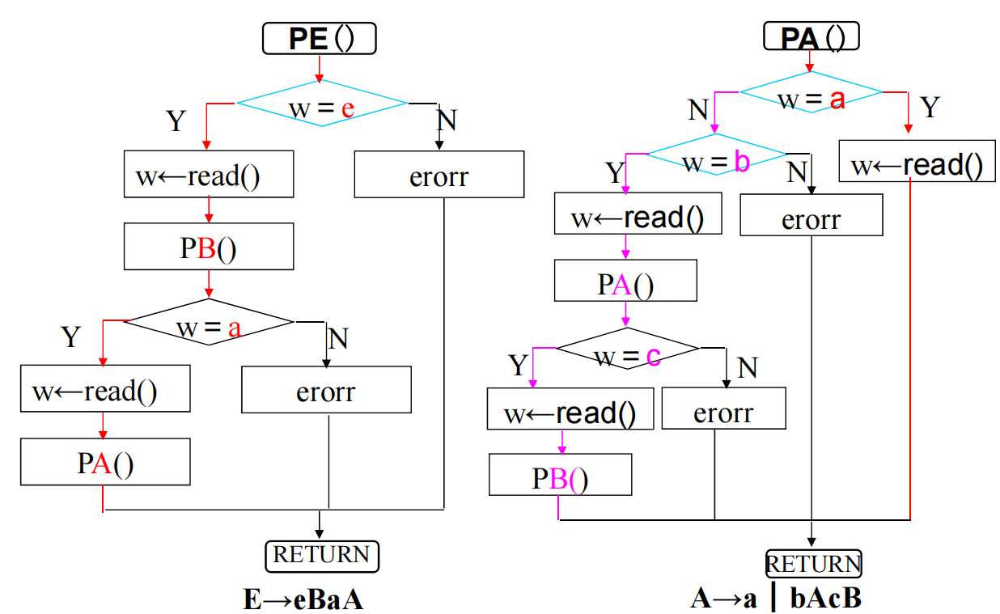

- 假设每条规则对应一个识别函数，利用函数和试探法对语法分析的结果（看作符号串）进行语法分析
- 规则的右部包含其他规则的左部时，嵌套调用其他规则

### 表驱动LL(1)分析

- 使用输入栈和分析栈，输入栈存放词法分析输入的结果，分析栈存放中间结果
- 预测分析表可直接由SELECT集转化而来：

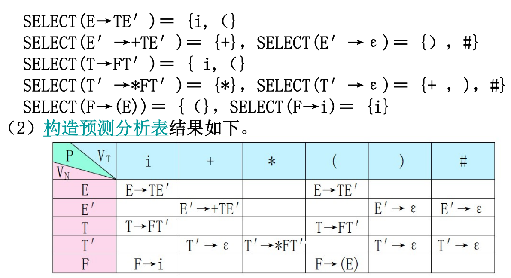

## LR分析

- 比LL(1)分析限制更少，但实现更困难
- LR(0)：从左到右扫描输入串，最右推导的逆过程，查看0个符号串

### 可归前缀及活前缀

| 推导过程 | 句柄 | 可归前缀 |
| -------- | ---- | -------- |
| S'       |      |          |
| S        | S    | S        |
| AB       | AB   | AB       |
| ACB      | CB   | ACB      |
| ACb      | b    | ACb      |
| Acb      | c    | Ac       |
| acb      | a    | a        |

- 可归前缀：拓广文法的每步规范推导过程中，会得到一个句柄，该**句柄连同左边的符号串构成可归前缀**（如果是某个特定符号串的可归前缀，那么只有一个，即最后一步推导的可归前缀）
- 活前缀：可归前缀的所有前缀都是活前缀（ε是任何符号串的活前缀）
- LC(A)：所有可能的规范推导过程中，可能出现在A左侧的符号串的集合（每个元素都是可归前缀去掉句柄得到的符号串）。可以用正则式表示

$$
在原文法中添加一条规则S' \rightarrow S,即得到拓广文法 \\
\\
假设有G=\{V_T,V_N,P,S\}的拓广文法G':\\
若S' \xRightarrow[R]{*} \alpha A \omega \xRightarrow[R]{} \alpha \beta \omega(规范推导),且 \gamma 是 \alpha \beta 的前缀,则 \gamma 是G的活前缀\\
LC(A)=\{\alpha|S' \xRightarrow[R]{*} \alpha A \omega\},LC(S)=LC(S')=\{\varepsilon\}\\
LC(A) = \bigcup (LC(X)·\{\alpha\}|X \rightarrow \alpha A \beta)\\
LR(0)C(A\rightarrow \beta)=LC(A)·\{\beta\}
$$

- 识别可归前缀的自动机：输入一个符号串，如果该自动机接收，那么该符号串是可归前缀（可归前缀和自动机是对于一个推导过程而言的）

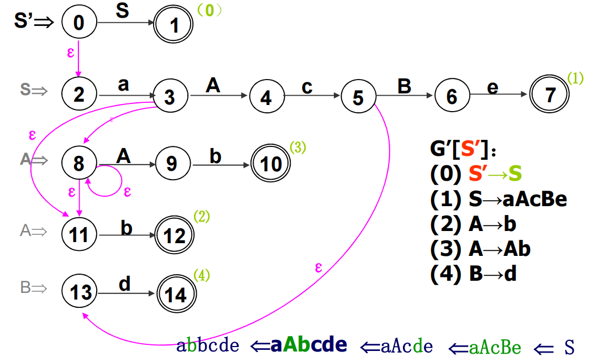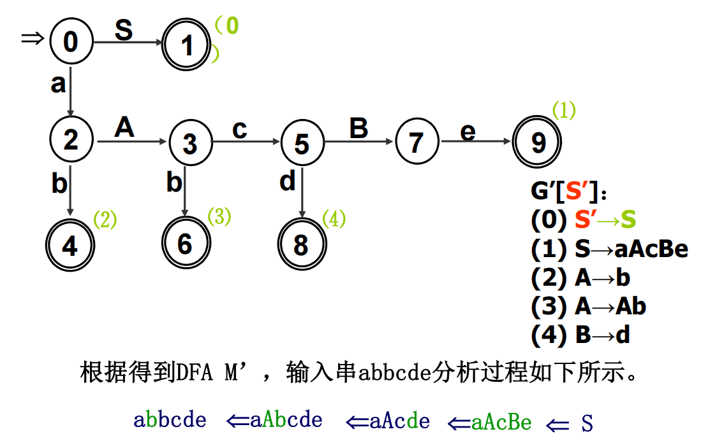

- 构造识别可归前缀的状态机：
  1. 对于拓广文法的每条规则，构造一个单行简单状态机（每行的末尾是终态，1号状态是识别态）
  2. 将每条规则的左部记在状态机的左边（下面称为状态机的左部）
  3. 如果一个自动机的左部是A，那么该状态机的初态与所有接收A的态等价，然后合并等价状态
  4. 化简合并后的状态机
- 构造识别可归前缀的状态机的一般方法：
  1. 计算每个非终结符的LC集(利用规则确定LC集间的关系)
  2. 计算每条规则的LR(0)C
  3. 由每个可归前缀构造状态机

### LR(0)项目集规范族

- 项目：在规则右部的某个位置插入特殊符号·，形成项目。一条规则对应的项目数等于其右部的长度+1。特别地，右部为空串时，对应的项目只有一个，即将空串符号改为·
- 项目集：构造LR(0)分析器的过程中，会生成一个DFA，该DFA的每个状态对应了若干个项目，即为一个项目集。所有项目集构成项目集规范族

#### 项目分类

- 移进项目：对应移进状态。如果有项目A，**其左部与B的左部相同，且其·右边的符号移到左边得到项目B**，称A**移进到**B
- 待约项目：·右边是非终结符。如果有项目A，**其·右边的非终结符是项目B的左部，且项目B的·左边没有符号**，称A**待约**B
- 规约项目：对应规约状态，必定为终态，**·右边没有符号**，表明已形成句柄
- 接收项目：对应接受状态，必定为终态，属于规约项目，且项目左部是S'，表明规约进行到最后一步

#### 构造项目集规范族

1. 列出文法的所有项目，每个对应一种状态
2. 通过项目构造NFA
   - **S'→·S**为初态，所有**末尾符号是·**的状态为识别态
   - 如果A**待约**B，A状态接收空串转到B
   - 如果A**移进到**B，A状态接收被移动的符号转到B
3. NFA确定化为DFA
   - 使用子集法构造DFA
   - 假如DFA某状态对应的NFA状态集为{1,2,4}，那么该状态中就包含第1、2、4个项目
   - DFA的每个状态即为一个项目集

#### 构造LR(0)分析表

*注：到这一步，才开始考虑加在符号串末尾的#。从规则中可以看出，#一列只可能有规约状态和接收状态，接收状态必然出现在#一列*
$$
1.构造出的项目集规范族记为C=\{I_1,I_2,...,I_n\}(下标为DFA的状态名) \hfill \\
2.逐个遍历每个项目集I_k: \hfill \\
\quad (1)如果有移进项目:A \rightarrow ? \cdot a ?,且A \rightarrow ? a \cdot ? \in I_j(a必须为终结符),则ACTION[k,a]=S_j \hfill \\
\quad (2)如果有规约项目:A \rightarrow \alpha \cdot,则ACTION[k,任意终结符]=r_j,j为文法中A \rightarrow \alpha这条规则的序号 \hfill \\
\quad (3)如果有接受规则S' \rightarrow S \cdot,则ACTION[k,\#]=acc \hfill \\
\quad (4)如果move(I_k,A) = I_j(A必须是非终结符),则GOTO(k,A)=j \hfill \\
$$

### LR(0)分析器组成

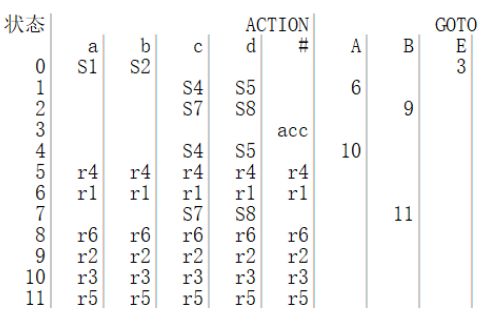

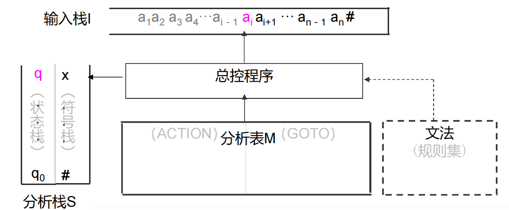

- 总控程序：对于任何LR分析器，总控程序都相同
- 分析表/分析函数：可以分成ACTION表和GOTO表，均可用二维数组表示
  - ACTION表：表示栈顶为某状态和某个终结符时的行为
    - 移进动作：表示接收输入串的下一个符号。通常记为S1,S2...
    - 规约动作：表示符号栈顶的若干个字符发生规约。通常记为r1,r2...
    - 接收动作：表示能接收输入串。通常记为acc
    - 报错动作：表示不能接收输入串
  - GOTO表：表示发生规约后，转移到的状态
- 分析栈：包括文法符号栈及对应的状态栈
  - 状态栈：存放状态串。状态通常记为0,1,2...
  - 符号栈：存放符号串

### 执行过程

1. 给所有规则按顺序递增编号
2. 构造ACTION表和GOTO表
3. 状态栈初值为0，符号栈初值为#
4. 以**状态栈栈顶元素**和**输入栈栈顶元素**为参数，执行ACTION表中的对应动作，不断循环
   - 移进动作：若动作为Si，输入串下一个元素**移入**符号栈，状态栈**入栈i**
   - 规约动作：若动作为ri，找到**第i条规则**，对符号栈顶的若干个元素应用该规则规约（事先复制一份输入串，对其进行同样的规约，以记录分析过程），**被规约的符号出栈，规约结果入栈，状态栈栈顶n个元素出栈（n为被规约的符号个数）**。然后以此时**状态栈栈顶元素**和**符号栈栈顶元素（此时为非终结符）**为参数，**获取GOTO表中对应的状态，使其入栈**
   - 接收动作：结束执行
   - 报错动作：报错

### LR(0)文法判断

- 计算文法的项目集规范族，对于每个项目集，如果其满足下列两个条件之一，那么该文法不是LR(0)文法
  - 移进项目和规约项目同时存在
  - 规约项目和规约项目同时存在

# 语义分析

## 基于属性文法的语义计算

- 基于属性文法的语义计算并不要求文法是规范文法
- **基于属性文法的语义计算是指，给每条规则附加动作，在确定了推导方式后，按顺序执行动作，通过动作产生的结果确定语义，并判断是否符合语义规定（语义规定不属于语法，能通过语法分析就说明符合语法。语法与语义规定没有严格的界限，一些定义在两者中都可以体现）**

### 属性文法

- 属性文法：由文法、文法符号属性集、语义规则集组成的三元组
- 文法符号属性：终结符可以看作类，文法符号属性可以看作类的属性；而推导过程中的终结符可以看作类的实例（规则两边的同名节点也是不同的实例，比如规则B→bB，为了区别，改成B→bB1），它们的属性间存在关联
  - 综合属性：表示子类的信息传给父类。对于规则A→？，如果其动作形如A.b=?，那么b是一个综合属性
  - 继承属性：表示父类的信息传给子类。对于规则？→？B？，如果其动作形如B.b=?，那么b是一个继承属性
- 语义规则：包含若干赋值语句、条件谓词、语义函数
  - 语义函数：以属性为参数的属性，可以执行一些动作
  - 条件谓词：每次执行动作时，执行的判断语句


### 语义计算

1. 构造语法树
2. 构造依赖图
   1. 对于规则中出现的每个A1.b（实例.属性），在A1对应的节点
   2. 根据动作确定依赖关系（比如，对于节点A，如果动作中包含A.a:=B.b，B肯定是子节点，那么A.a依赖B.b）
   3. **按照依赖关系调用赋值语句（动作中可能包含若干赋值语句，它们不是必须一起调用的）**。只保留虚节点和依赖关系的箭头，得到一个有向图，如果该图无环，那么可以生成拓扑排序，按拓扑排序调用

### S-属性文法

- 所有规则的左部是综合属性
- 如果S-属性文法可以用LR分析，那么，在LR分析的过程中，每当执行规约动作时，调用相应的动作
- 如果已有语法树，从下往上计算即可（同一层顺序无要求）

### L-属性文法

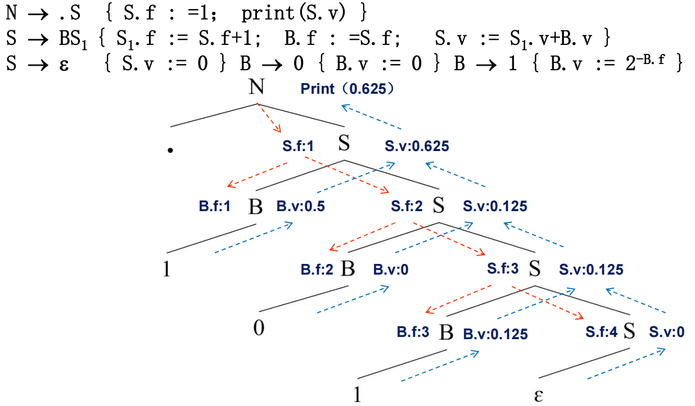

- 对于文法的任意一个规则，其动作中的每个赋值语句必须满足以下条件之一，这样的属性为L-属性文法：
  - 规则左部是综合属性
  - 规则左部是继承属性（记为B.b，记右部的属性是X1.x1,X2.x2,...，记当前节点为A），**X1,...,X2要么是B左边的节点（向左的依赖），要么就是A且A的父节点的动作的左部含有A（向上且直达根节点的依赖）**
- 如果已有语法树，先从上往下计算继承属性，再从下往上计算综合属性

## 基于翻译模式的语义计算

- 形式上类似属性文法，但语义规则可以插入到产生的任何位置，以此表达产生式的执行顺序
- S-翻译模式：对S-属性文法的翻译
- L-翻译模式：对L-属性文法的翻译

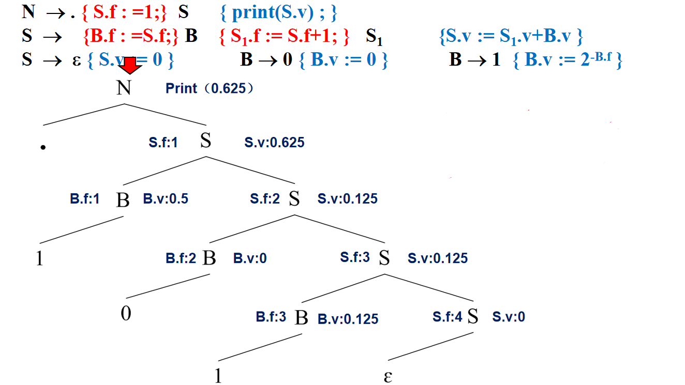

## 静态语义分析

### 符号表

#### 概念

- 符号表是存放**标识符（而不是关键字、运算符等）**信息的表
- 用于语义分析和中间代码生成阶段

#### 常见属性

- 符号名称
- 符号类型：常量名，变量名，函数名，类名等
- 数据类型：整数，浮点数等（如果对象是变量，数据类型就是其类型；如果是函数，数据类型就是其返回值类型）
- 存储类别：为其分配的内存区域
- 存储分配信息：存储单元大小，地址（表示为偏移地址，即某个内存区域内部的地址）
- 作用域
- 可见性

#### 常用操作

- 创建：**进入新的作用域**时（每个作用域对应一张符号表。编译开始时，会进入最大的作用域）
- 插入：出现新的标识符时（必然会先查询）
- 查询：出现标识符时
- 修改：修改符号的某个属性
- 删除：符号**不再可见**或不再需要时
- 释放：**离开作用域**时
- 层数：嵌套的作用域共用一张符号表时，需要使用此属性。每深入一层嵌套，层数+1。可能会同时存在多个同名而层数不同的符号

#### 常用数据结构

- 线性表（含有序表）
- 二叉搜索树
- Hash表

#### 作用域和可见性

- 作用域要么嵌套，要么不相交
- 开（闭）作用域：（不）包含当前位置的所有作用域
- 只有开作用域中的符号是可见的，如果多个作用域中包含同名符号，取最小开作用域中的符号

## 静态与动态语义

- 静态语义：静态的、与运行时情况无关的语义。能检查出诸如类型不匹配、语法不正确的错误
- 动态语义：运行过程中的语义。能检查出诸如数组越界、除数为零的错误

## 主要任务

- 类型检查
- 名字作用域分析：通过作用域确定哪些名字表示同一个符号
- 唯一性检查：包括不重复定义，枚举常量不重复等
- 名字的上下文相关性检查

# 中间代码生成

## 通用中间代码表示

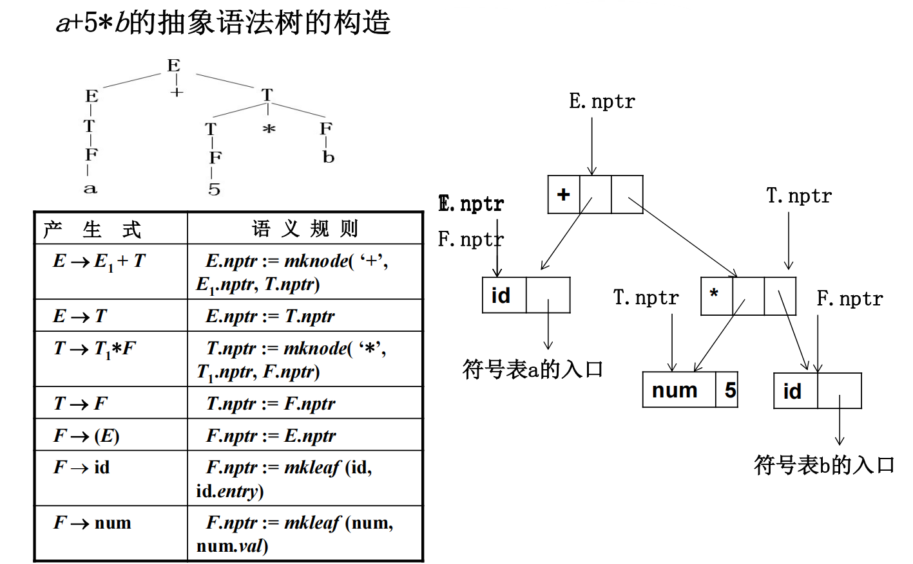

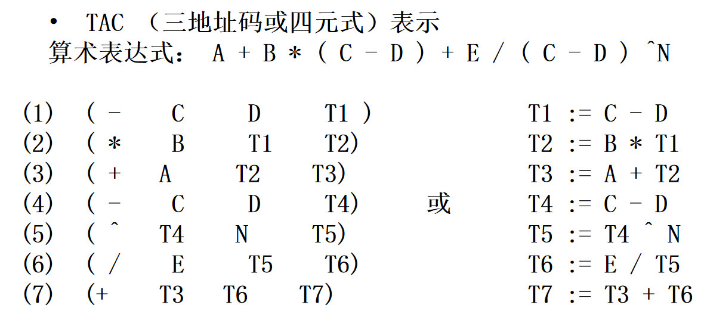

- 抽象语法树（AST）
- 四元式/三地址码（TAC）

## 构建抽象语法树

- 可以通过属性语法实现
- 这一步的语法树中，节点不再是简单的（非）终结符名，而是**抽象语法树节点**
- **抽象语法树节点需要人为定义。由于文法和语义的不同，抽象语法树节点的属性也不同。语法树节点可以包含各种不同含义的节点需要的属性，每个节点可能只使用一小部分属性**

# 运行时存储组织

## 主要任务

- 数据对象的表示：确定数据存储方式
- 表达式计算：确定表达式计算方式（与函数同理）
- 存储分配策略：控制不同作用域对象的分配和释放
- 过程实现：确定过程调用和参数传递

## 存储空间布局

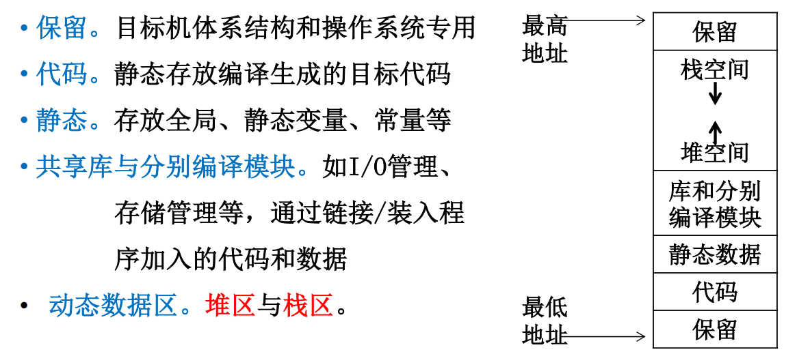

## 存储分配策略

### 静态存储分配

- 编译阶段即确定所有对象的存储空间
- 要求变量的数目、顺序、占用空间完全确定（可理解为只有全局静态变量）。不能实现递归调用、动态内存分配等
- 只需要静态数据区

## 动态存储分配

- 堆式内存分配：自由地分配、释放空间
- 栈式内存分配：必须按与分配顺序相反的顺序释放，通常用于本地变量这种生命周期固定的

# 代码优化

## 基本块

- 基本块：只有一个入口和一个出口的语句块。基本块的入口语句和出口语句必然是块内的第一个和最后一个语句
- 入口语句：语句块A的第一条语句，或者语句块A**之内**的外部能跳转进来的语句，是A的入口语句
- 出口语句：语句块A的最后一条语句，或者语句块A**之内**的能离开语句块A的语句，是A的出口语句
- 入口语句和出口语句可能重合，即只有一条语句的语句块

## 基本块划分

1. 确定所有的**基本块入口语句**：
   - 整个程序的第一条语句
   - 转移语句的**目的地语句**
   - **条件**转移语句之后的第一条语句
2. 从每个基本块入口开始往后遍历，直到遇到以下情况之一，将其记为出口语句：
   - 转移语句本身
   - 停止语句（结束程序的语句）
   - **基本块入口语句**之前的一条语句（**一定要先找出所有入口语句，不然会忽视这种情况**）
3. 确定基本块后，删除不属于基本块的语句

## 流图

- 用节点表示基本块，有向边表示跳转的图
- 循环：满足下面两个条件的**子图**，用**节点的集合**表示
  - 是强连通子图（任意两节点间双向可达）
  - 入口节点唯一（从循环外部进入循环时，只能从唯一的一个节点进入）

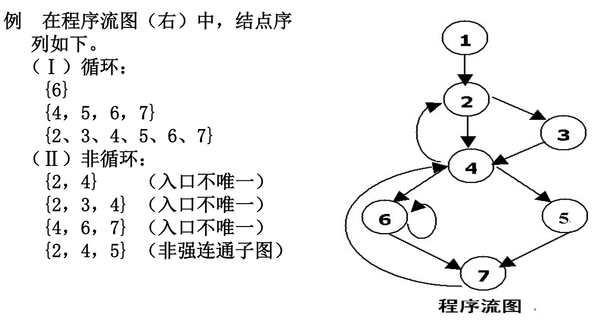

## 确定循环

$$
若存在从A到B的有向边，则记为A \rightarrow B \\
支撑节点:若从首节点到n节点必定经过m，则记为m \ DOM \ n\\
前驱节点集:P(n)=\{i|i \rightarrow n\}\\
必经节点集:D(n)=\{i|i \ DOM \ n \}\\
D(n)=\{n\} \cup (\bigcap D(t)|t \in P(n)) \quad\\
回边:若B \rightarrow A且A \ DOM \ B,B \rightarrow A是回边,每条回边对应且仅对应一个循环\\
\\

确定循环的过程: \hfill \\
1.对于任意节点i,令D(i)={i} \hfill \\
2.重复调用D(n)=\{n\} \cup (\bigcap D(f)|f \rightarrow n),直到结果不再变化 \hfill \\
3.找出所有的回边 \hfill \\
4.对于任意一条回边(记为B \rightarrow A),按下面的步骤计算其循环(记为L): \hfill \\
5.令L=\{A,B\},S=\{B\} \hfill \\
6.S=(\bigcup P(t)|t \in S)-L \hfill \\
7.L=L \cup S \hfill \\
8.重复6、7,直到L不再变化 \hfill \\
$$


