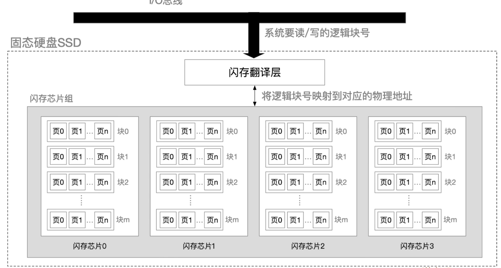
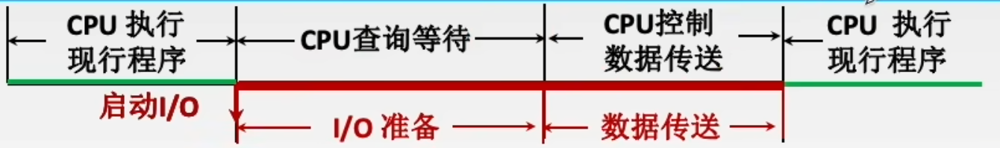

# 概述

## 计算机组成

- 计算机由软件和硬件组成，此外，固化在硬件上的软件也被称为固件
  - 硬件：存储器、运算器、控制器、输入设备、输出设备、连接部分
  - 软件：操作系统、程序设计语言及处理程序、数据库管理系统、应用程序等
    - 系统软件：操作系统，**数据库管理系统**，语言处理程序等基础软件
    - 应用软件：工程设计软件，**数据库系统**，浏览器等服务于某些特定用途的软件
- 软件和硬件在逻辑功能上是等价的
- **兼容性**：软件/硬件能够在**同一系列的不同型号**的计算机上通用
- **可移植性**：软件能够在各种**不同型号**的计算机上通用
- 计算机层次结构：高级语言层→汇编语言层→操作系统层→机器语言层→微指令层→逻辑门层

### 冯·诺伊曼计算机


- **指令和数据地位同等**，存放在存储器中，可按地址访问（计算机通过指令执行的不同周期确定取出的是否是指令）
- 指令用二进制表示，由操作码和地址码组成
- **以运算器为中心（数据传输需要使用运算器）**

### 现代计算机


- **以存储器为中心（数据传输不需要使用运算器）**

- **辅存（如硬盘）属于外部设备**

## 计算机发展史

| 时间      | 逻辑元件                 | 内存           | 外存       | 备注                       |
| --------- | ------------------------ | -------------- | ---------- | -------------------------- |
| 1946-1957 | 电子管                   | 汞延迟线，磁鼓 | 穿孔卡片   | 只识别机器语言             |
| 1958-1964 | 晶体管                   | 磁芯存储器     | 磁带       | 出现编程语言和操作系统雏形 |
| 1964-1971 | 中小规模集成电路         | 半导体存储器   | 磁带，磁盘 | 出现分时操作系统           |
| 1972-今   | 大规模、超大规模集成电路 | 半导体存储器   |            | 出现微型计算机、个人计算机 |

## 性能指标

- 响应时间：是指计算机完成一个任务所花费的全部时间
- 吞吐量：是指计算机系统在单位时间内完成的**请求（含义不固定）**数量
- 数据通路带宽（字长）：数据总线一次能并行传输的数据位数（决定寄存器位数等）
- 时钟周期（Clock Cycle）：计算机基本时间单位（即CPU主频的倒数）
- CPI（Clock Cycle Per Instruction）：执行一条指令（平均）需要的时钟周期数
- **CPU时间：等于 CPI×指令数×时钟周期**
- IPC（Instruction Per Cycle）：每个时钟周期执行的指令数（多核计算机可以大于1）
- MIPS（Million Instructions Per Second）：每秒执行的百万条指令数
- MFLOPS（Million Floating-Point Operations Per Second）：每秒执行的百万浮点运算数
- 现阶段提高计算机运行效率的最主要手段是**并行**

**计算性能时，时刻注意K、M的含义**

## 高级语言到机器指令

- 以C为例：

  1. 编写源程序(.c)

  2. 预处理器(cpp)进行预处理（主要是处理#include），生成修改后的源程序(.i)

  3. 编译器(ccl)对处理后的源程序进行**编译**，生成汇编程序(.s)

  4. 汇编器(as)对汇编程序进行**汇编**，生成可重定位目标文件(.o)（这一步已经生成机器指令）

  5. 链接器(ld)对可重定位目标文件进行连接（主要是处理标准库函数调用），生成可执行文件(.exe)

- 把编译型高级语言程序、解释型高级语言程序、汇编程序翻译称机器指令的程序分别称为**编译程序、解释程序、汇编程序**

# 数据的信息表示

- 机器数：数字在计算机中的二进制表示形式

- 模：某种码能表示的数据个数

## 定点数！！！

- 定点数：**小数点前没有数（定点小数）或小数点后没有数的数（定点整数）**。其小数点不需要存储
- 定点数能表示的数均匀分布在大和最小值之间
- **有符号定点数**才有原码、反码、补码的概念；**有符号整数**才有移码的概念
- **符号位仅取决于数的正负，原码/反码/补码均为正0负1，移码恰好相反**（下面不再重复）
- 正数：原码、反码、补码相同（符号位取0）
- **负数**：原码、反码、补码不同
  - 原码：符号位取1

  - 反码：原码按位取反（**原码取反后，小数部分末尾可能有0，这些0不能省略，码的位数是固定的**）

  - 补码：反码+1;补码-1再按位取反即得原码
- 移码：相当于无符号数，由**补码符号位取反**得到（**只能表示整数**），便于计算机比较大小

**以8位带符号定点整数为例：**

| 真值 | 原码         | 反码         | 补码         | 移码         |
| ---- | ------------ | ------------ | ------------ | ------------ |
| -128 | **不能表示** | **不能表示** | **10000000** | **00000000** |
| -127 | 11111111     | 10000000     | 10000001     | 00000001     |
| -1   | 10000001     | 11111110     | 11111111     | 01111111     |
| -0   | **10000000** | **11111111** | **不能表示** | **不能表示** |
| 0    | 00000000     | 01111111     | 00000000     | 10000000     |
| 127  | 11111111     | 11111111     | 11111111     | 11111111     |
| 128  | **不能表示** | **不能表示** | **不能表示** | **不能表示** |

**注意：对于负数补码和反码，右7位从0000000开始增大**

**以8位带符号定点小数为例：**

| 真值   | 原码         | 反码         | 补码         |
| ------ | ------------ | ------------ | ------------ |
| -1     | **不能表示** | **不能表示** | **10000000** |
| -1+2^n | 11111111     | 10000000     | 10000001     |
| -0     | **10000000** | **11111111** | **不能表示** |
| 0      | 00000000     | 01111111     | 00000000     |
| 1-2^n  | 11111111     | 11111111     | 11111111     |
| 1      | **不能表示** | **不能表示** | **不能表示** |

## 浮点数


- 浮点数：小数点位置不固定的数

- 浮点数能表示的数分布不均匀，绝对值越小，密度越大
- 是否规范化只看尾数，与阶码无关，与是否溢出无关
- 浮点数的**基数**指进制数（通常为2）；增大基数，使表示的数范围增大，精度降低

$$
规范化的浮点数:N = 2^E \times M \quad (\frac{1}{2}\le|M|\lt 1) \hfill \\
E:阶码,\textbf{有符号定点整数} \quad M:尾数,\textbf{有符号定点小数} \hfill \\
注:上面给出的M的范围并不严格,严格范围与M的正负、用补码还是原码表示、M的位数都有关 \hfill \\
$$

### IEEE754-32位浮点数标准！！！

- 为了充分利用存储空间且便于计算，引入符号位，且阶码和尾数的含义发生了变化
- **注意隐含的“1”**；因为隐含“1”，不用关心是否规范化

$$
IEEE754码:\overline{SEM}(共32位) \hfill \\
S:符号位 \quad E:阶码(\textbf{8位无符号定点整数}) \quad M:尾数(\textbf{23位无符号定点小数,不是补码}) \hfill \\
表示的浮点数:N =(-1)^S \times 2^{E-127} \times 1.M \hfill \\
\\
特殊规定: \hfill \\
E=255,M \ne 0:NaN(Not \ a \ Number) \hfill \\
E=255,M=0:\infty \hfill \\
E=0,M \ne 0:表示的浮点数变为N =(-1)^S \times 2^{-126} \times 0.M (这些数也被称为\textbf{非规格化浮点数}) \hfill \\
\\
极端情况: \hfill \\
E=1,M=0:\textbf{规格化浮点数中}绝对值最小的数(\pm1.0\times 2^{-126}) \hfill \\
E=254,M=\overline{11...1}_2:绝对值最大的数(\pm \overline{1.11...1}_2 \times 2^{127}=2^{128}-2^{104}) \hfill \\
$$

## 数值类型转换（C语言）

**默认所有的数值都用补码存储**，默认系统为64位

| 数据类型               | 字节数 | 取值范围          |
| ---------------------- | ------ | ----------------- |
| short                  | 2      | -2^15～2^15-1     |
| unsigned short         | 2      | 0～2^16-1         |
| int/long               | 4      | -2^31 ～ 2^31 − 1 |
| unsigned/unsigned long | 4      | 0～ 2^32-1        |
| float                  | 32     | 8位阶码+23位尾数  |
| double                 | 64     | 11位阶码+52位尾数 |

- 有符号/无符号整数转换：不改变数据二进制位，**只改变解释方式**
- 低转高：char→int→long→double，float→double，**必然不会**丢失信息；反之，则**有可能**丢失信息
- float和int相互转换时，均**有可能**丢失信息
- **机器数**指的就是数在内存/外存中的二进制表示，即补码

## 数据储存和排列

- **大端方式（和人的习惯一致）**：数字的高字节在前（规定将内存中较小的地址称为“前”）
- 小端方式（便于机器处理）：数据的低字节在前（并不是简单地把大端方式倒过来）
- 内存对齐：内存被分为若干等大的“块”（抽象概念，一块的大小就是**数据总线宽度**，或是**数据字长**）
  - **大小不超过一块的数据类型不能横跨两个块**，出现这种情况时，填充前一块尚未使用的字节
  - 类和结构体中的变量按照声明顺序分配内存**（不可交换顺序）**，在占用的内存不增大的前提下，**尽可能使每个成员的地址的最大公因数更大**

## 特殊编码

- 为了某些特殊目的，在数据中加入冗余信息形成的码

### BCD码

- BCD(Binary-Coded Decimal)：用二进制码表示十进制（BCD码是一种特殊的十进制转二进制的方法；而反码、补码等，均采用默认的十进制转二进制的方法，然后再转换成其他形式）。所有BCD码均遵循，**四位二进制码对应一位十进制码（因为这样便于转换）**
- 8421码：四位二进制数分别表示8，4，2，1
- 余3码：将8421码+3即得到余3码
- 2421码：四位二进制数分别表示2，4，2，1（0~4的首位固定为0，5~9的首位固定为1）

### 校验码

- 码距：两个码之间不同位的个数
- (编码方式的)码距：某种编码方式中，合法的、表示不同含义的两个码之间的最小码距（**无校验功能的码码距一般为1，码距大于1即意味着冗余信息，可利用冗余信息校验**）
- 码距为d时，可以发现至多(d-1)个错误，纠正至多(d-1)/2个错误

#### 奇偶校验码

- 奇校验：末尾添加校验位，使码中1的个数为奇数
- 仅当错误的个数为奇数时，能发现错误

#### 海明码


$$
2^r>=k+r+1 \hfill \\
k:原数据长度 \quad r:冗余位总长度 \quad  \hfill \\
f(i)=\{x|1 \le x \le k+r, x \ or \ i \ne 0 (按位或)\} \hfill \\
f:求某个冗余位所在的组的映射,自变量为冗余位的序号,因变量为一个集合,表示该组中所有位的序号 \hfill
$$

- 原数据中插入若干冗余位得到海明码，**插入的数位于1、2、4、8……这些位置上(从1开始计数)**
- **每个冗余位按特定规则与若干位原数据位构成一组，每组均使用偶校验码**
- 检错时，对于每个冗余位，分别求出它们所属的组，并进行偶校验，不符合则表明出错（一组出错，可能是该组中的某一位出错；结合多组的错误，才能定位到底哪一位出错；但无法辨别错误多于一个的情况）
- 原数据仅错误一位时，能够检出在哪一位并校正

#### CRC码

$$
2^r>=k+r+1 \hfill \\
k:原数据长度 \quad r:冗余码长度 \quad  \hfill \\
M<<r \mod(模2除取余) G = R \quad N=M～R(二进制数拼接) \hfill \\
若N’ \mod(模2除取余) G \ne 0,N' 有差错 \hfill \\
M:原数据 \quad G:生成码 \quad R:冗余码 \quad N:CRC码 \quad N':接收方受到的码
$$

- 原数据末尾添加若干位得到CRC码
- **模2除法：二进制竖式除法，其中的减法为模2减法。直到余数位数小于除数，即为最终余数**
  - **模2加/减法：每一位进行异或运算，不进位/借位**
- **为了使冗余码为r位，生成码必须是r+1位，最高位和最低位必须为1**
- 生成码可以用多项式形式表示，所以也被称为生成多项式（如，10011可表示为x^4+x^1+x^0）
- 原数据发生**奇数**个错误时，能发现错误。如果使用的生成码合适，还能检测出一些其他错误

# 运算方法与运算器

## 定点数运算！！！

| 码   | 运算 | 实现方式                                             |
| ---- | ---- | ---------------------------------------------------- |
| 原码 | 加法 | 直接相加（**符号位不参与运算，忽略到符号位的进位**） |
| 原码 | 减法 | **被减数不带符号位取反，+1**，然后减法改为加法       |
| 补码 | 加法 | 直接相加（**符号位参与运算**）                       |
| 补码 | 减法 | **被减数带符号位取反，+1**，然后减法改为加法         |

### 溢出/进位/借位判断！！！

- 加减法溢出判断：真值落在码能表示的范围外即为溢出（范围与有无符号有关）
  - 对于有符号运算，有且仅有以下情况溢出：**正数+正数=负数，负数+负数=正数，正数-负数=负数，负数-正数=正数**
  - **计算机判断溢出的方式：加法的两个操作数符号相同，且结果与操作数符号不同**（减法会被转化成加法）
  - 对于**无符号运算**，**有进位或借位即意味着溢出**
- **模2补码**：定点小数的默认补码（将整个补码视为一个数，+2后数不变）
- **模4补码**：定点小数的特殊补码（将整个补码视为一个数，+4后数不变）
  - **运算时**将符号位复制，变为两位，然后参与运算（对存储无影响）
  - **对于加减运算，如果运算结果的符号位中出现01或10，分别表示正溢出、负溢出**
- 乘法溢出判断：真值落在码能表示的范围外即为溢出（范围与有无符号有关）
- **进位/借位判断：即无符号数运算的溢出判断（有符号数直接转成无符号数）**
- **所有比较转移指令都是将两数相减，通过标志位判断是否满足条件**

| 寄存器               | 0                | 1              |
| -------------------- | ---------------- | -------------- |
| CF                   | 无符号运算未溢出 | 无符号运算溢出 |
| ZF                   | 结果为0          | 结果非0        |
| OF（仅限有符号运算） | 未溢出           | 溢出           |
| SF（仅限有符号运算） | 结果正           | 结果负         |

### 移位！！！

- 逻辑移位：**单纯地移动二进制位，空位补0**
- 循环移位：单纯地移动二进制位，将移走的数补到空位
- 带进位位的循环移位：把**进位位(CF)**连接到计算结果的左边，然后整体进行循环移位
- 算术移位：**不考虑信息丢失，左移和右移分别使真值×2/÷2，符号不变**
  - 原码算术移位：始终补0（右移时，真值的绝对值向下取整）
  - 反码算术移位：符号位是什么就补什么（右移时，真值向下取整）
  - 补码算术移位：**算术左移始终补0，算术右移符号位是什么就补什么（右移时，真值向下取整）**
- 如果没有特殊说明，移位默认指算术移位
- 算术移位中，**补位本身不会导致丢失精度或溢出**；要判断左移/右移是否导致信息丢失，只要**再次右移/左移回去，看数是否发生变化即可**

## 运算器

### 组成

- 算术逻辑单元(ALU)：执行算术和逻辑运算，还包含一些标志位，是**组合逻辑电路**
- 通用寄存器组
- 控制电路（运算器整体依然是时序逻辑电路）
- 内部总线

### 全加器

- 电路中用FA表示。由两个半加器组成


$$
S = x \oplus y \oplus z \hfill \\
C = z(x\oplus y)+xy \hfill \\
z:上一位进位,S:本位结果,C:本位进位 \hfill \\
$$

### 补码加减法器


- 可用于有符号定点数和无符号定点数相加减

$$
Cout=C_8 \quad ZF= (SI==0) \hfill \\
g_i=X_iY_i \quad p_i=X_i \oplus Y_i \hfill \\
g_i:\textbf{进位信号} \quad p_i:\textbf{进位传递信号} \hfill \\ 
OF= C_8 \oplus C_7 \quad SF= S_8 \quad CF=C_8\oplus sub \hfill \\
ZF:运算结果是否为0 \quad OF:是否溢出 \quad SF:运算结果是否为负 \quad CF:是否发生了进位或借位 \hfill \\
$$

### 四位先行进位加法器


- **Ci（第i位的进位）仅仅和Xi、Yi、C0有关**


### 原码一位乘法

- 一位乘法指一位一位进行的乘法
- X、ACC、MQ位数与乘数、被乘数、结果位数相同（定点小数相乘忽略低位）


$$
MQ的每一位从左往右依次记为MQ_0,MQ_1,...MQ_n \hfill \\
ACC的每一位从左往右依次记为ACC_0,ACC_1,...ACC_n \hfill \\
\\
x = \overline{x_0x_1...x_n},y=\overline{y_0y_1...y_n},P=xy=\overline{p_0p_1...p_{2n}} \quad (x_0,y_0,z_0为符号位): \hfill \\
1.p_0=x_0 \oplus y_0 \hfill \\
2.令X=\overline{0x_1...x_n}(\textbf{符号位不参与运算}),MQ=\overline{0y_1...y_n},ACC=0 \hfill \\
3.ACC= 
\begin{cases}
ACC+x \quad MQ_n=1 \\
ACC	\quad MQ_n=0 \\
\end{cases} \hfill \\
4.ACC和MQ\textbf{整体逻辑右移} \hfill \\
5.如果MQ_n已经是乘数的符号位,跳到6;否则回到3 \hfill \\
6.将ACC和MQ连接,舍去MQ_n,并令ACC_0=p_0,即得到最终结果 \hfill \\
$$

### 补码一位乘法

- **实际上，X、ACC、MQ位数比乘数、被乘数、结果多一位（但ACC和X多出来的一位没有任何意义，只是MQ需要多一位辅助位）**
- 至多需要n次移位和n+1次加法

$$
MQ的每一位从左往右依次记为MQ_0,MQ_1,...MQ_n,辅助位记为T \hfill \\
ACC的每一位从左往右依次记为ACC_0,ACC_1,...ACC_n(忽略多余的位) \hfill \\
\\
x = \overline{x_0x_1...x_n},y=\overline{y_0y_1...y_n},P=xy=\overline{p_0p_1...p_m} \quad (x_0,y_0,z_0为符号位): \hfill \\
1.求-x(\textbf{依然用补码表示}) \hfill \\
2.令X=\overline{x_0x_1...x_n}(\textbf{双符号位}),MQ=\overline{y_0y_1...y_n0}(\textbf{辅助位置}),ACC=0 \hfill \\
3.令S=MQ_{n+1}-MQ_{n},ACC= 
\begin{cases}
ACC+x \quad S=1 \\
ACC	\quad S=0 \\
ACC+(-x) \quad S=-1 \\
\end{cases} \hfill \\
4.将ACC和MQ\textbf{整体算术右移}(ACC_0被视为符号位) \hfill \\
5.如果MQ_n已经是乘数的符号位,跳到6;否则回到3 \hfill \\
6.将ACC和MQ连接,舍去MQ_n,即得到最终结果(不需要专门求符号位) \hfill \\
$$

### 补码不恢复余数除法

- 仅当最后一步不够减时，才恢复一次余数
- 同号相除时，够减商1，不够商0；异号相除则相反

## 浮点运算

- 通常只对浮点数的真值进行运算，不考虑编码、不考虑浮点数标准
- 浮点运算中，下溢和上溢指阶数超出允许范围**(-126~127，或-1022~1023)**

### 加减法

1. 对阶：统一两个浮点数的阶数，以阶数较大的一个为准（只可能发生尾数右移，阶码增加）

2. 尾数相加或相减
3. 规格化（使尾数绝对值落在**[1/2,1)**之内）
   - 左归：尾数形如0.0···01···时，使尾数**算术左移(补0)**1位，阶码-1，重复若干次
   - 右归：尾数形如1.···时，使尾数**算术右移(补符号位)**1位（暂时保留移出的1位）。阶码+1

4. 舍入（只有规格化过程中进行了一次右归，才需要对移出的1位舍入；0舍1入或恒置1）
5. 溢出判断

# 存储器

- 存储系统包括主存，外存，缓存；但讨论总容量时，不能认为是三者容量的简单相加（主存和缓存同时存在时，以主存容量为总容量）

## 分类

### 按介质

| 存储器       | 举例     |
| ------------ | -------- |
| 磁存储器     | 机械硬盘 |
| 半导体存储器 | 固态硬盘 |
| 光存储器     | 光盘     |

### 按存取方式

| 存储器              | 存取方式                                   | 举例               |
| ------------------- | ------------------------------------------ | ------------------ |
| **随机存储器(RAM)** | 直接访问某地址                             | 主存，**固态硬盘** |
| **顺序存储器(SAM)** | 顺序搜索整个存储器                         | 磁带               |
| **直接存储器(DAM)** | 直接访问某地址所属的存储区域，然后顺序搜索 | **机械硬盘**       |

### 按可写性

| 存储器              | 举例                     |
| ------------------- | ------------------------ |
| 读写存储器          | **主存，缓存，机械硬盘** |
| **只读存储器(ROM)** | **U盘，固态硬盘**        |

### 按可保存性

| 存储器             | 说明                                           | 举例         |
| ------------------ | ---------------------------------------------- | ------------ |
| 易失性存储器       | 断电后数据会丢失                               | **所有RAM**  |
| 非易失性存储器     | 断电后数据可以长时间保存                       | **所有ROM**  |
| 破坏性读出存储器   | 读取信息会导致原本存储的信息破坏，需要重新写入 | **所有DRAM** |
| 非破坏性读出存储器 | 读取信息不会导致原本存储的信息破坏             | **所有SRAM** |

## 随机存储器(RAM)

### 静态MOS随机存储器(SRAM)！！！

- 以**双稳态触发器**为存储单元，两种稳态分别表示0/1
  - 能读写信息，（仅在通电时）能长期保存信息
  - 读取信息不会导致原本存储的信息破坏

- 成本高，速度快，能耗高，集成度低，**用于缓存**

### 动态MOS随机存储器(DRAM)！！！

- 以**栅极电容**为存储单元
  - 使用的MOS管较少，存储密度高
  - 电信号微弱，读数据时需要放大
  - 读取信息会导致原本存储的信息破坏，需要重新写入
  - 电荷容易泄露，需要定期刷新避免数据丢失，刷新时不能进行读写（所有存储单元都在刷新的时间段称为“死区”）

- 成本低，速度慢，能耗低，集成度高，**用于主存**

#### 刷新！！！

- **讨论刷新时，默认存储器采用双译码器，行译码器的位数决定了一行的大小**
- 最大刷新间隔（即**刷新周期**，**一个刷新周期内必须将每一行刷新一次，剩余时间用于读写**）通常设为2、4、8ms
- 刷新由刷新地址计数器控制，而不是CPU
- **每次刷新一行**，刷新一行**固定占用一个存取周期**
- 刷新方式（以256行存储器为例，刷新计数器有8位）：
  - 集中刷新方式：刷新周期的最后256个读写周期中依次刷新所有行（这段时间内整个芯片都无法读写）
  - 分散刷新方式：刷新周期固定为512个读写周期，奇数周期用于读写，偶数周期用于刷新（刷新按固定顺序进行，与读写无关）
  - 异步刷新方式：将刷新周期均分成256段，每段的最后一个读写周期刷新一行


## 只读存储器(ROM)

- 结构简单，存储密度高，可靠性高

- 掩模式只读存储器(MROM)：生产过程中即确定存储的数据，严格不可修改

- 可编程只读存储器(PROM)：在MROM的基础上，每个存储单元可改写一次，改写时会不可逆地击穿存储单元的二极管

- 可擦除可编程只读存储器(EPROM)：使用某种手段擦除数据，可以多次改写
  - 紫外线可擦除可编程只读存储器(UVPROM)：使用紫外线信号擦除
  - 电可擦除可编程只读存储器(EEPROM)：使用电信号擦除
  - 闪存(Flash Memory)：可快速擦除和重写。每次写之前擦除，故写相较读更慢（如U盘，固态硬盘）


*注：所有闪存都属于EEPROM*

## 主存储器

- **主存包含若干个存储芯片(DRAM)，控制电路，以及BIOS(ROM)**
  - 开机时，存储芯片中没有数据，先执行BIOS中的数据

  - 存储芯片和BIOS通常**统一编址**（内存地址的范围也包含BIOS）

### 存储芯片


- 存储单元：由若干个存储元构成（存储元能表示一个高低电平，存储元数量即存储字长）
- 译码器：输入为地址，有多个输出线，每个输出线与一个储存单元相连。同一时刻只有一个输出线会输出1，表示要访问的地址位于该存储单元中
  - **双译码器：使用行译码器和列译码器，通过行列地址索引存储单元，能有效减少输出线的数量**
  - **地址线复用技术**：双译码器需要两组地址，可以复用一组地址线，先后传入行地址和列地址（**这可以使芯片引脚数量减半**）
  - **行缓冲**：采用双译码器的芯片中的缓存区，大小等于一行的容量
  - 如果对芯片容量的描述形如“a × b × c位”，说明使用了双译码器和地址线复用技术，共a行b列
- 驱动器：控制译码器发出电信号
- 片选线：表示此芯片当前是否被访问
- 读/写控制线：表示当前是否在读/写，可以使用两根读写线，也可以只使用一根（高电平读，低电平写）
- 控制电路：通过电路实现读/写控制、片选、译码逻辑

### 芯片引脚数目

- 地址线、数据线、片选线、读/写控制线从外观看就是芯片的引脚
  - 读/写控制线、片选线，默认情况下固定三根
  - 数据线数等于一次输入/输出数据的位数
  - 地址线数取决于地址范围
- **如果使用地址线复用技术，地址线数量减半(向上取整），片选线改为行选通线+列选通线(多1根）**

### 主存与CPU！！！


- 主存通过地址总线、数据总线、控制总线与CPU相连
- **寻址方式（编址方式）：决定了数据字长，包括按字节/字/半字/双字寻址**
- **数据字长（机器字长，字，数据宽度）：计算机每次处理数据的长度（如读写数据）**
- **存储字长：每个存储单元的数据容量大小，每一位地址对应的数据长度，MDR的位数**
  - **存储器容量=存储单元数×存储字长（如8k×8位表示有8k个存储单元，存储字长1字节）**
  - **地址码长度（即MAR位数）由地址空间范围唯一决定，与存储器容量无关**
  - **可访问数据容量=2^地址码长度×存储字长**
- **指令字长：指令的长度**
- **存取周期：一次存取开始，到彻底完成存取的时间间隔。存取周期=存取时间+恢复时间**
  - **存取时间：存储器进行一次读/写操作花费的（平均）时间**
  - **数据传输率（主存带宽）=数据宽度÷存取周期**（计算主存带宽时，要考虑缓存命中率）

注：表示容量时，1K=1024；表示速率时，1K=1000

### 存储器扩展

- 涉及存储器扩展时，多个存储芯片构成一个抽象存储器，该存储器的存储字长是一个抽象概念，且通常与

#### 概念

- 单片存储芯片可能不满足数据总线位数和存储容量的要求，而它们组合而成的存储器能满足要求
- A线：地址线。芯片A线宽度不足时，使用字拓展
- R/W线：读写控制线。对每组芯片输入相同的信号
- D线：数据线。芯片D线宽度不足时，使用位拓展
- CS线：时钟信号线

- **分组：某些情况下，需要使多个芯片构成”一组“，下文中，”一组“特指共同构成输出的若干张芯片，有时还需要多组芯片**
  - 一组中的所有芯片必须同时工作，其容量、频率、时序必须完全一致；多组芯片不需要同时工作，只需要频率一致

#### 位拓展

- **一组，每组N个**
- **组内所有芯片收到的地址相同**
  - 一个地址对应的数据分散在多个芯片中
  - 每个芯片有预设好偏移量，收到地址后，将地址的低若干位替换为自身的偏移量


#### 字拓展

- **M组，每组1个**
- **对地址译码，使每块芯片控制的地址范围不同**
  - 例如，将地址高3位用于译码器输入时，片选线输出端口必定有8个，称为3：8译码器
  - 译码器的输入也被称为**片选地址（即完整地址的高若干位）**，如3：8译码器中的片选地址可能取000~111
  - 译码器的输入与输出之间的映射并不唯一，这也会决定每块芯片的地址范围


#### 字位拓展

- **M组，每组N个**
- **每组芯片控制的地址范围不同；组内每块芯片收到的地址相同**


#### 数量关系

- 芯片的存储单元是一个具体概念，而主存的”存储单元“是一个抽像概念，可能由多个具体的存储单元构成

|                            | 主存（A×D位） | 单个存储芯片（a×d位） |
| -------------------------- | ------------- | --------------------- |
| **存储单元数**             | A             | a                     |
| **单个存储单元容量(位数)** | D             | d                     |
| **容量(bit)**              | C=A×2^D       | c=a×2^d               |
| **芯片总个数**             | C/c           |                       |
| **芯片组数**               | 2^(A-a)       |                       |
| **每组芯片个数**           | D/d           |                       |

### 并行主存系统

#### 双端口存储器


- 用于有多核CPU的计算机，一个内存条通过两个端口同时与两个CPU相连
- 允许同时读一个地址；而一方在写某个地址，另一方试图访问时，引发冲突，将后者的操作延迟

#### 多体并行存储器


- 与位拓展类似，整个地址空间被划分为若干组，每组都可以独立产生输出
- 和位拓展的主要区别在于，要访问的多个地址**来自不同组**时，可以像流水线一样并发访问，提高效率
- 流水线式访问内存时，一次存取开始到下一次存取开始的最小时间间隔不再是**存取周期**，而是**存取时间（总线传输时间）**
- 根据地址划分范围不同，多体并行存储器被分为**高位多体交叉存储器（左上图）**和**低位多体交叉存储器（右上图）**

注：存储器中，交叉编址指低位多体交叉

$$
T = \tau+ \zeta \hfill \\
T:存取周期 \quad \tau:存取时间 \quad \zeta:恢复时间 \hfill \\
\\
存/取m个地址上的数据花费的时间: \hfill \\
不使用多体并行存储器,或一直冲突时,t=mT \hfill \\
不发生冲突且\textbf{组数充足}时,t=T+(m-1)\tau \hfill \\
为了在不冲突时,流水线能够持续不间断,应当满足:组数 \ge \frac{T}{\tau} \hfill \\
$$

注：如果没有说明存取时间和恢复时间，给定一个地址序列，只有相邻的两个地址间有可能发生冲突

## 机械硬盘（磁盘存储器）

### 结构


- 整个磁盘存储器通常包含多个磁盘，每个磁盘由磁盘驱动器（磁头、转轴等）、磁盘控制器（控制信息交换）、盘片组成
- 磁道：某个磁盘面上的一个圆环区域，每个磁盘面的磁道分布相同
- 柱面：所有磁盘面上半径相同的磁盘面共同构成一个柱面
- 磁头数：等于磁盘面（也叫记录面）的数量
- 柱面数：等于一个磁盘面上的磁道数。每个磁道有柱面号
- 扇区数：指一个磁道上的扇区数（而不是总扇区数）。每个扇区有扇区号

### 工作原理

- **磁盘与主存交换数据总是以扇区为单位**
- 要访问磁盘时，提供逻辑块号，逻辑块号会被转换为磁盘地址，**磁盘地址=驱动器号～柱面（磁道）号～盘面号～扇区号**
- 假设扇区号占3位，盘面号占3位，每个扇区存放1字节数据，按字节寻址：
  - 地址0~8对应一个盘面上的一个磁道
  - **地址0~64对应8个盘面上磁道号相同的磁道**，而不是一个盘面上的8个磁道（**连续访存时，磁头不需要移动**）


### 性能指标！！！

- 容量：可存储的数据量
  - 非格式化容量：磁盘上所有存储单元的容量之和
  - 格式化容量：磁盘上经过格式化的、可供用户使用的存储单元的容量之和
- **道密度=磁盘面的磁道数÷半径方向上有磁道部分的长度**
- **位密度=磁道容量÷磁道长度**（扇区也一样）
- **面密度=磁道容量÷磁道面积**（扇区也一样）
  - **面密度=道密度×位密度**；计算扇区面积时，直接用内圈（或外圈）半径乘磁道宽度即可
  - 一个磁盘中，**所有磁道的容量总是相等**，故越靠内的磁道，其位密度越高
- **存取时间=寻道时间+旋转时间+传输时间**（**存取数据以扇区为单位，而不是特定地址**）
  - 寻道时间(寻找时间)：**启动磁头臂（如果尚未启动）**，移动磁头，使磁头对准要找的扇区所属的**磁道**花费的时间
  - 旋转时间(延迟时间)：**从开始旋转，到准备扫描最后一个要访问的扇区**花费的时间（**通常平均值为旋转半圈的时间**）
  - 传输时间：**最后一个要访问的扇区的数据传输时间**（因为对于之前的扇区，数据传输和旋转可以并行；**理想情况下等于扫描过一个扇区的时间，不能忽略**）

$$
T=T_s+T_r+T_t \hfill \\
T_s:寻道时间 \quad T_r:旋转时间 \quad T_t:传输时间 \hfill \\
\\
尚未启动时:T_s=s+m\times n  \quad 启动后:T_s=m \times n \hfill \\
s:启动时间 \quad m:跨过一个磁道需要的时间 \quad n:要跨过的磁道数量 \\
只需访问一个扇区时:\overline{T_r}=\frac{1}{2r} \hfill \\
r:转速,单位时间内转过的圈数 \hfill \\
$$

### 磁盘调度算法

- 多个进程等待访问磁盘时，合理安排I/O顺序可以降低**磁头跨过的磁道数**，减少**寻道时间**
- **最内/最外目标磁道**：多个进程的寻道任务同时存在，它们要访问的磁道不同，其中最靠内/最靠外的磁道称为最内/最外目标磁道

#### 先来先服务(FCFS)

-  按进程请求的顺序访问磁道
-  **对于随机存取的磁盘，不需要考虑寻道时间，使用FCFS算法即可**
- 逻辑简单，效率一般

#### 最短寻找时间优先(SSTF)

- 每次选择现有寻道任务中，寻道时间最短的一个
- 效率高，但会导致**饥饿**

#### 电梯扫描算法(SCAN)

- 磁头轮流向内/向外移动，移动到**最内/最外目标磁道**时切换方向，移动过程中处理任务
- 效率较高，不会导致饥饿，响应速度不平均、波动大

#### 循环扫描算法(C-SCAN)

- 磁头总是先从最内侧内向外移动，移动过程中处理任务；**移动到最外目标磁道后，快速移回最内目标磁道，不处理任何任务**
- 效率比扫描算法更低，但响应速度平均

**注意：如果没有特殊说明，LOOK和SCAN算法都是移到最内/最外目标磁道就返回**

### 扇区编号

- 磁盘的编号方式是不固定的，**编号方式会影响物理地址与磁盘物理位置的关系，也会影响访问磁盘的效率**

- 每次访问磁盘时，可能需要读多个扇区的数据，而**数据传输以扇区为单位**

  - **要访问的扇区地址连续，可能会跨越多个盘面（但一般不会跨越多个磁道），而且不一定位于连续的多个扇区上**

  - **由于传输需要时间，访问完一个扇区后，需要等待数据传输一段时间（等磁头再转过一个扇区即可），然后才能继续访问下一个扇区，所以可能需要转动多圈**

#### 交替编号


- 地址连续的扇区物理位置上相隔一个扇区
- 访问一个盘面的一个磁道上的所有扇区只需要旋转两圈

#### 错位编号


- 在交替编号的基础上，进一步将两个相邻盘面的编号也错开
- 要访问的地址跨越多个盘面时，错位编号能进一步降低旋转时间

### 磁盘阵列

- RAID：廉价冗余磁盘阵列，一种**存储策略**，多个物理磁盘组成一个逻辑磁盘，数据分割存储到多个物理磁盘上，**需要并行访问**。能提高磁盘的读写性能、安全性、可靠性
- RAID中具体存储策略包括**磁盘镜像，海明码纠错，奇偶校验**等

## 固态硬盘

### 结构



- 类似主存（使用了字拓展），闪存由多个芯片组成，每个芯片包含若干块，每块包含若干页

### 读写数据

- 磁盘与主存交换数据总是以**页**为单位
- 要访问磁盘时，提供逻辑块号，逻辑块号会被转换为固态硬盘地址，**固态硬盘地址=芯片号+块号+页号**
- 闪存翻译层中的映射关系是可变的（如迁移部分数据后）

### 磨损均衡技术

- 反复擦除会导致硬盘的使用寿命变短，所以需要平衡擦除操作。考虑磨损均衡时以块为单位
- 动态磨损均衡：写入数据时，优先选择擦除次数较少的块
- 静态磨损均衡：检测并迁移数据，使擦除次数较少的块更容易被访问

### 特点（相比于机械硬盘）

- 读速度快（可以说写速度较慢）
- 噪音小、抗物理冲击、能耗低
- 成本高
- 尽管反复擦除会导致寿命下降，但目前的固态硬盘理论寿命已经相当长

## 高速缓冲寄存器

- 缓存使用SRAM实现，成本更高，速度更快
- 现代计算机的缓存集成在CPU上

### 程序局部性

- 程序大部分情况下是顺序执行的

- 时间局部性：执行某条指令后，在短时间内可能再次执行该条指令
- 空间局部性：访问某个内存地址后，在短时间内可能再次访问该地址或与其相邻的地址

### 运行过程

**注意：缓存未命中包含两种情况，一是缓存对应位置没有数据，二是对应位置的数据与当前地址不匹配，需要进行替换**

#### 读

```C#
CPU输入地址;
if(命中)
{
    缓存中数据输出到CPU;
}
else if(未命中)
{
    将主存中的数据写入缓存;
    if(发生替换 && 回写式)
        将被替换的数据写入主存;
	缓存中数据输出到CPU;
}
```

#### 写

- 写分配：缓存**未命中时**，先将主存中数据调入缓存（**即使要写的数据不足一块，也要调出一块**），然后将数据写入缓存、主存。写数据时多花时间，但会提高命中率
- 非写分配：缓存**未命中时**，仅将数据写入主存
- 透写式（全写法）：缓存**命中时**，将数据写入缓存，然后写入主存，一行数据被替换时不需要额外操作
- 回写式（写回法）：缓存**命中时**，仅将数据写入缓存，一行数据被替换时再写入主存。一开始节约时间，但之后会频繁将内存中的数据写入主存。运行结束后，也需要花额外时间将缓存中的数据写入主存。需要额外的**修改位**
- 缓存和主存间通常采用**写分配+回写式**，各级缓存之间通常采用**非写分配+透写式**

```c#
CPU输入地址和数据;
if(命中)
{
    if(透写式)
    {
        将数据写入缓存;
        将数据写入主存;
    }
    else if(回写式)
    {
    	将数据写入缓存;
    }
}
else if(未命中)
{
    if(写分配)
    { 
        从主存中的数据写入缓存;
        if(发生替换 && 回写式)
        	将被替换的数据写入主存;
        将数据写入缓存;
        将数据写入主存;
    }
    else if(非写分配)
    {
    	将数据写入主存;
    }
}
```

#### 写缓冲

- 仅用于回写式缓存的优化策略
- 增加一个写缓冲区，每当缓存**未命中时**，也会向写缓冲区中写入数据
- 由独立于缓存的电路控制，在合适的时机将写缓冲区中的数据写入主存，因此发生替换时不再需要将数据写入主存

### 相联存储器(CAM)

- 类似于字典，采用**内容指定方式**和**地址指定方式**
- 查找速度快，成本高昂，用于缓存、段表、页表等

- 全相联：任何主存块都可以映射到缓存的任何一行


- 直接相联：各主存映射到固定的一块缓存


- 组相联：各主存映射到固定的一组，从中选择某一行


#### 组相联映射！！！


- 缓存分**S = 2^s**组，每组缓存分**E**行，每行有1bit有效位，**t**bit标记，**B = 2^b**Byte数据
- **每组有E行时，组相联映射称为E-路组相联映射**
- 地址 = 标记位(t位)+组索引(s位)+块内偏移(b位)
  - 通过组索引确定相应序号的组，通过比对标记位确定是否已存在于缓存中（**每组**使用一个**比较器**，能够并行地比对组内每一行的标志位）
  - 原地址和缓存中的地址的低s+b位总是相同
  - 如果没有说明编址方式，默认按字节编址；从缓存地址长度可以反过来确定编址方式

- **缓存总容量=地址映射表容量(有效位+标记位)+数据容量=行数×(t+B+1)**
  - **采用回写式时，每行还会多一位修改位**
  - **考虑替换算法时，可能还需要一些额外的控制位**


#### 全相联映射

- 相当于只有一组的组相联
- 地址=主存块地址(即标记位)+块内偏移
- 缓存利用率高，但查找效率低

#### 直接相联映射

- 相当于每组只有一行的组相联
- 地址=区地址(相当于标记位)+行索引(即组索引)+块内偏移
- 查找效率高，但缓存利用率低

### 缓存效率

- 访问内存前，总是要先访问缓存；通常简单地认为**不论缓存是否命中，花费在访问缓存上的时间不变**
- 指令种类的不同决定了访存次数可能不同；这种情况下，依然简单地认为**只要缓存命中一次，就不用访存(不论多少次)**
- 对于直接保存在寄存器中的变量，计算命中率时不参与

$$
h = \frac{N_c}{N_c+N_m} \quad \overline{t} = t_c+(1-h)t_m \quad e=\frac{t_c}{\overline{t}} \hfill  \\
N_c:缓存存取次数 \quad N_m:内存存取次数  \quad t_c:缓存存取时间 \quad t_m:主存存取时间 \hfill \\
h:命中率 \quad \overline{t}:平均存取时间 \quad e:效率\hfill \\
$$

- **注：`a=a+4`这样的表达式访问了变量a两次，第一次可能未命中，第二次则必然命中**

### 替换算法

#### 随机替换

- 额外开销最低，缓存命中率最低

#### 先进先出(FIFO)

- 替换掉最早写入的块
- 额外开销小，缓存命中率不高

#### 最不经常使用(LFU)

- 记录每行被访问次数，替换掉累积使用次数最少的块
- 额外开销小，缓存命中率不高

#### 最久未使用(LRU)

- 替换掉离上次使用时间间隔最长的块
- 每行使用一个计数器
  - 若缓存命中，**计数小于该行的所有行**计数器+1，该行置0
  - 若缓存未命中，且有空行，随机选择空行，**所有非空行**计数器+1
  - 若缓存未命中，且无空行，替换掉**计数最大的一行**，**所有行**计数器+1（因为此时没有空行）

- 额外开销高，缓存命中率高（如果每组只有两行，则额外开销低）

## 页式虚拟存储器

- 见操作系统原理

# 指令系统

## 概述

### 指令类型

- 各种指令最终翻译成机器指令并被计算机执行
- 高级语言指令：一条指令对应若干条机器指令
- 汇编语言指令：（除伪指令）一条指令对应对应一条机器指令
- 微指令：由硬件发出，若干条指令实现一条机器指令

### 目标

- 完备性：能实现各种功能
- 规整性：功能均匀、对称
- 有效性：高效地实现功能
- 兼容性
- 可拓展性

## 指令格式

- **指令=操作码(OP)+寻址方式码(M，可选的，可能有多个)+地址码(A，可能有多个)**
- **操作码位数取决于所有可选操作的种类数**

- 指令字长：指令长度（**半字长指令**指，长度为**数据字长**一半的指令）
  - **定长指令**：实现简单，但冗余较多，不容易扩展
  - **变长指令**：与定长指令相反。必须等待上一条指令翻译完才能确定下一条指令


### 指令地址码

- 多个地址码按顺序排列，记为A1，A2，……，不同地址数的指令含义如下：
  - 三地址指令：A3 = (A1)OP(A2)
  - 双地址指令：A1=(A1)OP(A2)
  - 单地址指令：A1=OP(A1)
  - 无地址指令：地址码未指定操作数（操作码可能暗含了操作数）
- **地址码多于一个时，寻址方式码也可能有多个**

### 扩展操作码！！！

- 可变长的操作码也被称为扩展操作码
- 可变长会带来歧义，为了消除歧义，必须遵循：**优先分配多地址指令，短操作码不能与任何长操作码的前缀相同**
- **单个地址长度为n时，每条k+1地址指令相当于$2^n$条k地址指令**
- 使用频率较高的指令应当尽可能使用短的操作码（在地址码位数充足的前提下）


### 寻址方式！！！

- 采用不同寻址方式的目的是缩短指令字长，扩大寻址空间提高编程灵活性

#### 指令寻址方式

- **顺序寻址**：要访问的指令的地址是上一条指令地址的下一个地址（除了跳转指令，其他情况默认使用顺序寻址）
- **跳跃寻址**：要访问的指令的地址是指定的某个地址
- 两类寻址方式均需要访存一次
- 所有比较两数的条件转移指令都令式两数相减，然后通过标志位判断是否转移

#### 操作数寻址方式

| 寻址方式       | 地址                                       | 地址表示    | 访存次数 | 寻址范围(位数)   |
| -------------- | ------------------------------------------ | ----------- | -------- | ---------------- |
| 立即寻址       | （无地址）                                 |             | 0        | （不使用地址）   |
| 寄存器寻址     | （无地址）                                 |             | 0        | （不使用地址）   |
| 隐含寻址       | （不显示指定地址，暗含在操作中）           |             | 0        | （与操作有关）   |
| 直接寻址       | 立即数                                     | (0)         | 1        | **地址码位数**   |
| 间接寻址       | 指定地址上的数据                           | @0          | 2        | **数据字长**     |
| 变址间接寻址   | 基址寄存器的内容+立即数，该地址上的数据    |             | 2        | **数据字长**     |
| 寄存器间接寻址 | 指定寄存器的内容                           | (Rx)        | 1        | 寄存器位数       |
| 基址/变址寻址  | 基址/变址寄存器的内容+立即数               | (BX/IX)+5   | 1        | 寄存器位数       |
| 基址加变址寻址 | 基址寄存器的内容+变址寄存器的内容+立即数   | (BX)+(IX)+5 | 1        | 寄存器位数       |
| 相对寻址       | **PC**的地址(**下一条指令**)加上一个立即数 | (PC)+4+5*4  | 1        | **只考虑PC位数** |
| 堆栈寻址       | **SP**的地址(**栈顶空位**)加上一个立即数   | (SP)+5      | 1        | SP位数           |

- 各种需要显式指定寄存器的指令中，由**寄存器编号**指定寄存器，占指令的位数取决于通用寄存器数量（汇编指令中使用寄存器名称，汇编后转换为寄存器编号，**不应认为寄存器隐含在操作码中**）
- **转移指令使用相对寻址，$PC \leftarrow (PC)+k+OFFSET $，其中k为转移指令本身占用的地址数**

## 复杂指令集计算机(CISC)

- 简单和相对复杂的基本功能均通过一条指令完成
- 举例：x86架构（个人计算机）

## 精简指令计算机(RISC)

- 最基本的功能通过一条指令完成，其余相对复杂的基本功能通过多条指令实现
- 举例：arm架构（手机）


## 汇编指令(x86)

### 寄存器


```assembly
#DWORD:双字 WORD:字(2Byte) NYTE:字节
MOV EAX,DWORD PTR[AF996H],5 	#将地址从AF996起的双字的数据传入EAX
```

### 算术运算指令

- **操作数D特指目的操作数，计算结果存放在D中，D不能是立即数**
- **双操作数指令的两个操作数不能同时为内存单元**

| 指令格式     | 功能                    | 备注                         |
| ------------ | ----------------------- | ---------------------------- |
| ADD D,S      | D=D+S                   | 减法同理                     |
| NEG T        | T = -T                  | 本质上是通过按位取反+1实现的 |
| **IMUL D,S** | D=D×S                   |  |
| MUL D,S      | D=D×S，均视为无符号数 |  |
| **IDIV S**   | EAX:EDX ÷S=EAX...EDX |         |
| DIV S        | EAX:EDX ÷S=EAX...EDX，均视为无符号数 |  |
| INC D | D=D+1 |  |
| DEC D | D=D-1 |  |

### 访存指令

```assembly
LOAD D,123(S)		#D为目的寄存器,S为基址寄存器,偏移量为123
LOAD D,[(S)+123]	#同上
STORE S,123(D)		#S存放要写入的数据,D为基址寄存器,偏移量为123
STORE S,[(D)+123]	#同上
```

### 跳转指令

```assembly
CMP A,B 	#比较两数,仅影响标志位
JGE L1		#由于指令地址难以确定，通常使用标号
......
L1:
MOV EAX,EBX
......
```

| 指令格式 | 跳转条件    | 备注         |
| -------- | ----------- | ------------ |
| JE/JZ    | $A=B$       |              |
| JNE      | $A \neq B$  |              |
| JG       | $A>B$       |              |
| JGE      | $A \ge B$   |              |
| JL       | $A<B$       |              |
| JLE      | $A\le B$    |              |
| LOOP     | $ECX \ne 0$ | 先执行DEC CX |

### AT&T格式

- 常见于Linux和Unix中的汇编语言格式


## 栈帧&函数调用


*上图中，高地址在上，低地址在下，地址增加表示向上移动*

- **栈帧：当前所处的函数在栈区中占用的空间（不是指代码空间，是指变量的空间）**
  - **栈区就是内存中的一块区域，所以EBP、ESP的值本质上就是内存地址**
  - 需要维护EBP、ESP，使之指向当前栈帧的底端和顶端（**PUSH、POP、CALL、LEAVE等指令均会影响ESP**）
  - 可以使用PUSH、POP指令访问栈帧，也可以利用EBP、ESP，结合MOV等指令访问栈帧
  - 如果一个函数会修改寄存器的值，需要**保护现场**和**恢复现场**
  - **函数有返回值时，通常简单地利用EAX来返回**
  - **函数有参数时，总是从上一个栈帧顶端获取参数**（见上图），所以参数必须按顺序放在规定好的位置


*上中、上右图分别为执行完call、leave指令之后的栈帧情况*

- **调用函数过程：**
  1. 调用call指令
  2. 调用enter指令
  3. 保护现场（如果需要）
  4. 调用函数内部语句
  5. 恢复现场（如果需要）
  6. 调用leave指令
  7. 调用ret指令

```assembly
#call指令相当于:
PUSH PC		#将旧栈帧的最后一帧设为返回地址
JMP ?		#跳转到要调用的函数
#enter指令相当于:
PUSH EBP	#旧栈帧的基址入栈
MOV EBP,ESP #更新EBP,使得旧栈帧基址成为新栈帧的第一个元素
#leave指令相当于:
MOV ESP,EBP
POP EBP		#这一步后EBP指向原本的栈底,ESP指向原本的栈顶
#ret指令相当于:
POP R		#需要一个寄存器暂存要继续执行的指令的地址,用R表示		
JMP R
```

# 中央处理器

## 指令周期


- **指令周期**：**完整地**执行一条**机器指令**的时间（指令流水线中，两个指令间的间隔可以小于此时间）
  - 由于指令的不同，其机器周期数不一定相同，指令周期可以定长或变长
  - 极端情况下，指令周期最短可以仅一个时钟周期（无操作指令，专用总线数据通路中高度并行的指令）
  - **执行完一条指令时（不能说指令周期结束时）**，会检测外部中断；如果有外部中断，才会增加一个**中断周期**
- **机器周期**：指令周期可以按特定的规则分为若干阶段，每个阶段的时间均为机器周期
  - 由于每个阶段的功能不同，机器周期的长度不一定相同（**机器周期是时钟周期的整数倍**）
- 时钟周期：CPU中的最小时间单位，恒定不变
  - **时钟信号(节拍信号)**：周期为时钟周期的信号。尽管信号周期固定，仍可能同时存在多个相位不同的信号

| 指令（从高层到底层） | 花费时间             | 举例           |
| -------------------- | -------------------- | -------------- |
| 汇编语言指令         | 大于等于一个指令周期 | LOOP           |
| 机器指令（微程序）   | 一个**指令周期**     | ADD AX,BX      |
| 机器指令的一个阶段   | 一个**机器周期**     | 取指令周期     |
| 微指令               | 一个**时钟周期**     | 访存指令       |
| 微命令（微操作）     | 小于等于一个时钟周期 | 寄存器传送指令 |

## 周期长度

- 单指令周期：指令周期等长，效率受到最慢的指令限制（通常，最慢的指令是访存指令）
- 多指令周期：指令周期不等长
- 串行方案：指令串行
- 流水线方案：见指令流水线

## 主要部件


*第一张图为单总线结构（与乘除法有关的计时器被省略了），第二张为专用通路结构*

- CPU中的部件可分为运算器和控制器
  - **运算器**：进行运算、存放运算结果的部件（包括通用寄存器，**程序状态字寄存器**）
  - **控制器**：与取指令、取地址、时序控制有关的部件
- **单总线结构**中，总线同一时刻只能处理一个数据传输任务，所以需要设计许多**暂存寄存器**

### **寄存器**

| 缩写           | 名称             | 长度       | 内容/功能                                                    |
| -------------- | ---------------- | ---------- | ------------------------------------------------------------ |
| PC/IP*         | 指令地址寄存器   | 地址码长度 | 指令地址                                                     |
| IR             | 指令寄存器       | 指令字长   | 存放指令内容（通常包括操作码和地址码）                       |
| ID             | 指令译码器       |            | 确定指令的操作和取址方式，确定**微程序入口**并输出到**OC**   |
| MAR            | 主存地址寄存器   | 地址码长度 | 要进行读取/写入操作的主存地址                                |
| MDR            | 主存数据寄存器   | 存储字长   | 从主存中读取出的数据，或要存入主存的数据                     |
| PSW/PSR*       | 程序状态字寄存器 |            | 标志位(OF,CF等)                                              |
| $\mathrm{R_i}$ | 通用寄存器组     | 机器字长   |                                                              |
| CU             | 控制单元         |            | 包含TG和OC等（**描述数据通路时，笼统地用CU表示，不要用TG、OC**） |
| TG             | 时序产生器       |            | 控制OC产生信号的时机和顺序（分为**硬布线控制器**和**微程序控制器**） |
| OC             | 微操作信号发生器 |            | 根据译码信息、时序信号、标志位，形成微操作控制信号序列（即**控制流**） |
| ACC/AC*        | 累加器           | 机器字长   | ALU的一个操作数，连续进行多次运算时，存放中间结果            |
| Y/X            | 暂存寄存器       | 机器字长   | ALU的一个操作数                                              |
| SR             | 移位寄存器       | 机器字长   | 暂存ALU的输出，可能参与移位运算                              |
| MQ             | 乘商寄存器       | 机器字长   | 暂存乘除法的某些运算结果                                     |
| SP/ESP*        | 栈顶指针         | 地址码长度 | 当前栈帧的顶部（低地址）                                     |
| BP/EBP*        | 栈底指针         | 地址码长度 | 当前栈帧的底部（高地址）                                     |

*星号标注的寄存器为编程人员可访问的寄存器；“透明”的意思是不可见；注意指令寄存器透明，指令地址寄存器可见*

- 计算机中可能有**浮点寄存器**，即存放浮点数的寄存器（乘商寄存器也是整数寄存器），位数未必等于机器字长
- 移位寄存器和数据总线间还有一个**三态门**，控制移位寄存器和数据总线的连接与断开
- PC的自增也要使用ALU，所以ALU的B端口可能会添加一个**二路选择器(MUX)**，在原本通往B端口的输入和一个常数（即PC的增量）中作选择
- **CU**产生各种控制信号，而决定CU输出的是**IR和PSW**

### 其他

| 缩写  | 名称             | 内容/功能                                                    |
| ----- | ---------------- | ------------------------------------------------------------ |
| Bus   | 总线             |                                                              |
| ID    | 指令译码器       | 确定指令的操作和取址方式，确定**微程序入口**并输出到**OC**   |
| CU    | 控制单元         | 包含TG和OC等（**描述数据通路时，笼统地用CU表示，不要用TG、OC**） |
| TG    | 时序产生器       | 控制OC产生信号的时机和顺序（分为**硬布线控制器**和**微程序控制器**） |
| OC    | 微操作信号发生器 | 根据译码信息、时序信号、标志位，形成微操作控制信号序列（即**控制流**） |
| Bus   | 总线             |                                                              |
| R     | 读信号           | 读信号变为高电平时，读数据；即**R←1**之后必然有**MDR←M[MAR]** |
| W     | 写信号           | 写信号变为高电平时，写数据；即**W←1**之后必然有**M[MAR]←MDR** |
| FE/IF |                  | 仅**取指令周期**内，FE=1                                     |
| IND   |                  | 仅**间址周期**内，IND=1                                      |
| EX    |                  | 仅**执行周期**内，EX=1                                       |
| INT   |                  | 仅**中断周期**内，INT=1                                      |

## 数据通路！！！

- 数据通路：数据在CPU各功能部件之间传送的路径
- **单总线结构**：CPU内部各部分（不是指部件，是按功能划分的几个特定部分）间均通过**总线**连接
- **专用通路结构**：CPU内部各部分的连接都**直接相连**，避免总线冲突，并行性强

### 寄存器传送语言

$$
M[addr]:主存的某个地址(这是地址,不是数组,没有取内容的意思) \hfill \\
R[i]:第i个通用寄存器 \hfill \\
(?):取?地址上的内容 \hfill \\
注:\textbf{寄存器的名称相当于一个地址,取内容要加括号;特别地,ALU、X的括号可以省略,根据上下文自动确定是内容还是地址;} \hfill \\
\textbf{另外,表示取地址的括号与方括号相邻时,也可以省略,如M[(MAR)]简写为M[MAR]} \hfill \\
\\
A \leftarrow B:赋值语句(\textbf{语句左边是地址，右边是内容}) \hfill \\
X_{y:z}或X[y-z]:寄存器X的第y位到第z位 \hfill \\
\mathrm{SignExt}(X):扩展X(到32位) \hfill \\
\{X,Y\}:X和Y的二进制表示连接起来 \hfill \\
\\
AD(IR):取出指令的地址码 \quad OP(IR):取出指令的操作码 \hfill \\
$$

### 微操作序列

| 操作         | 单总线结构   | 专用通路结构 |
| ------------ | ------------ | ------------ |
| 寄存器间传送 | MAR←Bus←(PC) | MAR←(PC)     |
| 数学运算     | Z←(ACC)+(Y)  | Z←(ACC)+(Y)  |
| 读主存       | MDR←M[MAR]   | MDR←M[MAR]   |

- 以下微操作均适用于专用通路结构，如果是单总线结构，**必要时**补上数据经过Bus的过程即可（不是所有数据传输都要经过Bus）

#### 取指令周期

- **PC的自增可以简写，但其他数学运算不能简写**
- 取指令周期的微指令总是固定的

```assembly
MAR ←(PC)	#指令地址写入MAR,准备读指令
MDR ←M[MAR]	#取出指令,暂存在MDR中
IR ←(MDR)	#将指令传入IR
PC ←(PC)+1

#取指令简写为:
IR ^PC
```

#### 加减运算

- **ACC存放第一个操作数，Y存放第二个操作数，Z存放直接结果（注意这些寄存器的名称并不固定）**
- **如果本次运算完毕，Z中的数存入指定寄存器（或主存/硬盘）**
- **如果本次运算结果要继续参与之后的运算，Z中的数存入ACC**
- 内存中的数据不能直接参与运算，要先取到寄存器中

```assembly
#以c=a+b为例,从取第一条指令开始,到写回数据结束(取指令采用简写)变量名实际上代表了一个地址
#以下过程将语句分为三条访存,每条指令进行一次访存,实际上可以将多次访存合并为一条指令

#取a:
IR ^PC		
CU ←OP(IR)	
MAR ←AD(IR) 
MDR ←M[MAR]
ACC ←(MDR)

#Z=a+b:
IR ^PC
CU ←OP(IR)	
MAR ←AD(IR) 
MDR ←M[MAR]	
Y ←(MDR)
Z ←(ACC)+(Y)

#c=(Z)
IR^PC		
CU ←OP(IR)	
MAR ←AD(IR) 
MDR ←(Z)
M[MAR] ←(MDR)	
```

#### 间址周期

- 将指令的寻址模式从间接寻址变为直接寻址，这一过程称为间址周期

**间接寻址：**

```assembly
MAR ←AD(IR)		
MDR ←M[MAR]
MAR←MDR
```

**寄存器间接寻址：**

```assembly
MAR ←R1		
MDR ←M[MAR]
MAR ←MDR
```

#### 中断周期

- 因为各种原因导致当前执行的指令需要暂停时（如函数调用、中断），进入中断周期
- 中断周期之后紧接着中断服务程序

```assembly
SP  ←(SP)-1 	#栈顶指针地址减小表示即将入栈一个元素
MAR ←(SP)		#此时MAR指向栈区的新元素
MDR ←(PC)	
M[MAR] ←MDR		#将断点的地址写入栈区中新元素的位置
PC ←V 			#V表示中断向量,本质上是要执行的中断服务程序的首地址
```

## 控制器


*上图中，指令即一条机器指令*

- 控制器：发出微指令的功能模块，其核心部件为**控制单元(CU)**
- 微指令：**在一个时钟周期内执行的指令**（并没有严格的划分标准，只与执行时间有关，与功能无关）
- 微程序：实现一条**机器指令**所需的所有微指令
  - **多条微指令构成微程序，一个微程序实现一条机器指令，若干条机器指令对应一条汇编指令**
- 微命令：控制部件通过控制线向**执行部件**发出的**控制信号**（**所有控制信号共同构成一个微命令**）
- 微操作：发出微命令后，最终在**物理层面实现的操作**
  - **微指令对应一或多个微操作，微命令与微操作一一对应**


| 微指令                                      | 微命令                                                 | 微操作            |
| ------------------------------------------- | ------------------------------------------------------ | ----------------- |
| $\mathrm{C_1}:\mathrm{MAR \leftarrow (PC)}$ | $\mathrm{PC_{out} \leftarrow 1,MAR_{in} \leftarrow 1}$ | 将PC的数据传入MAR |

### 控制方式

- 以下控制方式中，机器周期依然是固定的最小时间单位；指令指的是MIPS指令这种层次的指令，而不是机器指令或一条代码
- 同步控制方式：CPU中只存在唯一一个固定时钟信号
  - 所有指令周期具有相同的机器周期数，所有机器周期具有相同的时钟周期数（少于规定的周期数就等待）
  - 指令周期长度固定，机器周期长度不固定，不过大部分时间较短的机器动作具有同样长度的机器周期
  - 机器周期与时钟周期均可变，不过大部分时间较短的指令具有同样长度的指令周期

- 异步控制方式：没有统一的时钟信号（即有多个相位不同的节拍信号），指令周期和机器周期长度也不固定
- 联合控制方式

### 硬布线控制器


- 运行时根据指令操作码、时钟信号、状态信息，通过**电路**计算出所有输出电平，以实现**微操作**
- **执行速度较块，可扩展性差，常用于RISC CPU**

### 微程序控制器


| 缩写     | 名称                 | 内容/功能                         |
| -------- | -------------------- | --------------------------------- |
| CM       | 控制存储器           | 所有微指令（构成所有微程序）      |
| CMAR/μAR | 微地址寄存器         | 要读取的微指令地址，相当于CM的MAR |
| CMDR     | 控制存储器地址寄存器 | 取出的微指令，相当于CM的MDR       |

- **执行速度较慢，可扩展性强，常用于CISC CPU**
- 用存储器存储所有机器指令对应的微程序，执行机器指令时根据**指令操作码**调用相应的微程序（**IR输入到微地址形成部件，不再使用ID**）
- **取指令周期、间址周期、中断周期包含的微指令是不变的，多个微程序会共用这些微指令**
  - 取指令周期之类不完整的微指令序列不能单独称为微程序
  - 所有使用微程序控制器的CPU，其CM中必然有取指令周期，间址周期和中断周期则不一定有
  - 对于有N个机器指令的机器，其CM中至少包含N个微程序加上1个取指令周期
- **下地址**：一般情况下，当前指令的下地址会被设为下一条指令的地址；**满足某些条件时（如微程序执行完毕）**，用其他方式确定地址

注：注意区分**微地址形成部件**和**微操作命令形成部件**；出现后者不代表使用了微程序控制器

#### 微指令格式


- 将多个微操作写在一条微指令中才能并行，所以垂直型微指令只能串行，效率低

#### 微指令编码（水平型微指令）！！！


- **直接编码法方式**：每一位表示一个微命令（或者说微操作）
  - 要发出微命令，则对应位为1
  - 多位为1表示多个微操作并行
  - 简单直观，执行速度快，并行自由度高，但微指令长度长（操作控制字段的长度取决于微命令种类数）


- **字段直接编码方式**：将几个互斥（不能同时执行）的微命令编成一组（称为**互斥类**），多组共同构成操作控制部分
  - 如，某组占3位，（至多）有7个互斥微命令，001～111分别表示发出其中一个微命令，**000表示不发出任何微命令**
  - 有多组的值非0表示多个微操作并行
  - 微指令长度短，但需要译码，导致执行速度慢
- **字段间接编码方式**
  - 字段直接编码方式中，每组表示微操作的“多选一”，而字段间接编码方式中，若干组的组合才能表示微操作的“多选一”
  - 相当于对字段直接编码方式的拆分、组合（能提高复用度）
  - 通常只用作字段直接编码方式的辅助手段
  - 微指令长度更短，但移码更复杂、并发受限，导致执行速度更慢

#### 微指令取址方式

- 取上一条微指令的**下地址字段**（被称为**断定方式**）
- CAMR的地址自增（被称为**增量计数器法**）
- 一般机器指令中的操作码经微地址形成部件处理后确定地址
- 转移指令中的目标地址

### 设计微程序控制单元

- 本质上就是分析机器指令中的微操作，确定微指令的具体内容
- **分析微操作时，微命令不用写（唯独R←1和W←1是例外，需要写出）**
- 微程序控制器与硬布线控制器的**微操作序列**的不同之处：
  - 微程序控制器中，不存在**指令译码器(ID)**，取而代之的是**微地址形成部件**
  - 有额外的**取微指令地址的微操作**

- 步骤：
  1. 分析微操作序列
  2. 安排微操作，形成微指令
  3. 添加**取微指令地址的微操作**
  4. 确定微指令格式和编码方式
  5. 编写微指令码点（即微指令的哪些部分对应哪些微操作）

#### 安排微操作


*左上图：原始微操作序列；右上图：安排后硬布线控制器的微操作序列；左下图：安排后微程序控制器的微操作序列*

- 微操作并非简单地按顺序执行，一定范围内可以打乱顺序并行
  - 在**一个时钟周期内**串行或并行的所有微操作，即构成一个**微指令**

- 安排微操作的原则：
  - **不涉及相同部件、没有先后关系的操作可以并行**
  - **非访存操作较快，多个非访存操作可在一个时钟周期内串行**（依然优先考虑并行）
  - **访存操作较慢，不能与其他指令在一个时钟周期内串行**（依然优先考虑并行）

#### 取微指令地址的微操作

**有两种取址方式，分别对应以下微操作：**

```assembly
CMAR ←AD(CMDR)		#将上一条微指令的下地址设为下一条微指令的地址
CMAR ←微地址形成部件 ←OP(IR)	#一般机器指令中的操作码经微地址形成部件处理后确定地址
```

- **先将微操作序列划分为若干个微指令，每个微指令之后都必须插入一个取址微操作**
- **取指令阶段的最后一个微指令(IR←MDR)之后，采用第二种取址方式；其他情况下，采用第一种取址方式**

#### 确定微指令格式和编码方式

- 默认采用**水平型微指令**
- 微命令种类较少时，宜采用**直接编码方式**，否则采用**字段直接编码方式**
  - 直接编码方式中，**控制字段位数等于微命令种类数**
  - 字段直接编码方式中，要先将微命令分成互斥组，**分别计算每个互斥组的位数（不执行一组中任何指令也是一种可能的情况）**
- 下地址字段的位数取决于**微指令**种类数（由计算机自动确定，不需要填写）

# 指令流水线

## 概念

- 微操作的并行存在于**微指令**的内部，而指令流水线是更高层次的**机器指令**并行
- 指令执行过程可以被分为多个**阶段**（有多种分法，阶段数也不固定）
- **并行：两个工作同时执行**
- **并发：两个工作同时处于已开始状态，来回切换执行**

## 指令执行方式


- 顺序执行方式：所有指令串行（不使用流水线）

- N次重叠执行方式：两个并行指令的重叠部分固定为N个阶段

## 指标

- 吞吐率(TP)：单位时间内完成的任务数
- 加速比(S)：不使用流水线所用的时间与使用流水线所用的时间之比
- 效率(E)：设备忙碌的时间占总时间的比值（每个阶段使用不同的一些设备，计算时，通常简单地认为所有设备的效率相同）

$$
假设指令分k段,取执行n指令的时间计算,简单认为每段的时间均为t,采用k-1次重叠执行方式 \\
TP=\frac{n}{(k+n-1)t} \rightarrow \frac{1}{t} \hfill \\
S=\frac{kn}{k+n-1} \rightarrow k \hfill \\
E=\frac{n}{k+n-1} \rightarrow 1 \hfill \\
$$

## 影响流水线的因素！！！

- 流水线中的潜在的冲突类似并发冲突，会影响指令阶段的划分，以及流水线的运行
- 发生流水线冲突时，需要将冲突指令中的若干个延后，延后方法分为**硬件阻塞(stall)**和**插入空指令(NOP)**两种方法；结果都是**使指令的某个周期延后一或多个时钟周期**
- 按以下规则检验是否存在冒险：
  1. 画出指令**执行过程图**，假设流水线完全不阻塞地运行指令序列
  2. 逐条检查指令，将其与上方的所有指令（时间轴不重合则不用考虑）按顺序比对，如果存在冲突，则说明这对指令间存在冒险，将当前指令（连同之后的指令）延后，直到冲突消失

### 结构冒险

- 某些指令会占用同一个**设备资源**，这些指令并发会引发结构冒险
- 某些共用的设备可以配置多套以减少冲突（**如多套寄存器，多体交叉存储器**）
- 如果某个指令要访问的设备正在被其他指令占用，延后此指令
- **结构冒险广泛地存在，如只有一套设备时，同名阶段（IF,ID,EX,Mem,WB）总是不能重合**

### 数据冒险

- 某些指令可能依赖其他指令的**执行结果**，这些指令并发会引发数据冒险
- 一个指令被延后可能导致该指令以及之后的指令中原本存在的冲突消失
- **数据冒险总是发生在EX阶段，需要等待前面的计算完成，即延后到某条指令的Mem或Web之后（具体看等待的数来自主存还是寄存器）**
- **旁路转发技术有时可以避免延后指令（如果下一条指令需要当前指令的计算结果，则通过旁路提前将运算结果传给下一条指令）**

### 控制冒险

- 某些指令可能会改变PC的值，导致预测无法进行，这些指令会引发控制冒险
- **控制冒险总是发生在EX阶段，如果条件变量没有计算出来，需要等待前面的计算完成，即延后到某条指令的Mem或Web之后（具体看等待的数来自主存还是寄存器）**
- **特别地，控制冒险还会导致之后要执行的指令的地址无法确定，即IF阶段延后（其他两种冒险并不会导致IF或ID延后）**
- 现代计算机中，遇到分支指令时，会预测程序走向，继续提前读取尚未执行的指令，保持流水线运行
  - 预测错误时，需要进行相应的处理
  - 某些策略可以提高预测的准确率
  - 可以直接提前取出各个分支上的后续指令
  - 可以提前计算条件码
  - 调整指令执行顺序，在分支指令附近插入空操作可以减少控制冒险

## 流水线分类

### 按层级

- 部件级流水线：比通常意义的指令流水线更底层。如，将浮点加法分为四步
- 处理机级流水线：通常意义的指令流水线中，处理机就是CPU，上面提到的指令流水线就属于处理机级流水线
- 处理机间流水线：比通常意义的指令流水线更高层，多个处理机分别完成一种任务

### 按功能种类

- 单功能流水线：永远只能实现一种功能的流水线
- 多功能流水线

### 按功能是否可变

- 静态流水线：同一时刻，只能执行一种工作的流水线
- 动态流水线：同一时刻，可以执行多种工作的流水线（流水线上混有多种功能不同的指令）

### 按单向性

- 线性流水线：总是按顺序逐个执行指令的各个阶段
- 非线性流水线：存在反馈回路，指令的某些阶段可以反复执行（如执行递归运算）

## 流水线多发技术

- 流水线的**度**：每个时钟周期内**启动**的指令数

### 超标量技术


### 超流水技术


### 超长指令字


## 五段式指令流水线


- 机器指令分为**取指令-译码-执行-访存-写回**五个阶段
  - 取指令(IF)
  - 译码(ID)：译码，确定操作数所在的寄存器（**计算机结构不唯一，某些情况下可以从内存中取操作数**）
  - 执行(EX)：取操作数，执行各类运算
  - 访存(M)：从内存中读一个数据，或向内存中写一个数据（**除了LOAD和STORE，其他指令没有访存阶段**）
  - 写回(WB)：将内存中取出的数或者是运算结果写回寄存器（**修改PC不属于此阶段，即跳转指令无写回阶段**）
- 每个阶段的末尾，都有锁存器存放这一步的结果（上图所有竖线处），多条指令并发时，要注意避免**锁存器冲突**
- 最基础的划分方式，最早出现于MIPS指令架构
- 采用**定长机器周期**（取址周期是最慢的）
- 由于结构固定、机器周期固定，能实现的机器指令有限，只能用于RISC

## 并行

- 数据级并行：同时处理多组数据
- 指令级并行：单个CPU中多个机器指令并行（如上面的指令流水线，和流水线多发技术）
- 线程级并行：多个CPU中多个线程并行

### 计算机架构

- **单指令单数据流(SISD)**：每次执行一个指令，处理一组（0～2个）数据（原始的CPU结构）
  - 不支持并行
  - 可以使用指令流水线，但与通常意义的指令流水线不同，依然只能并发
- **单指令多数据流(SIMD)**：每次执行一个指令，该指令同时处理多组数据（有多套运算器、寄存器等）
  - 实现数据级并行
  - 用于执行大量相同运算的场合，如早期显卡中
  - 向量处理机：由SIMD发展而来，基本数据不再是单个数值，而是向量
- **多指令多数据流(MIMD)**：同时执行多个指令，每个指令独立地处理各自的数据
  - 实现指令级并行；现代计算机均采用此架构，并且实现了线程级并行
  - 多处理器系统：多核计算机，共用主存，利用主存交换数据
  - 多计算机系统：多台计算机，利用网络交换数据

### 硬件多线程

- 多线程不等于线程并行，可能只是线程并发
- 计算机架构与硬件多线程有密切的关联

|              | 细粒度多线程                     | 粗粒度多线程                     | 同时多线程               |
| ------------ | -------------------------------- | -------------------------------- | ------------------------ |
| 指令执行     | 不断切换，轮流执行每个线程的指令 | 持续执行一个线程的指令，直到阻塞 | 同时执行多个线程中的指令 |
| 线程切换     | 每个时钟周期切换                 | 当前线程阻塞时切换               | 不切换                   |
| 线程切换代价 | 低                               | 高                               | 无                       |
| 指令级并行   | 是                               | 是                               | 是                       |
| 线程级并行   | 否                               | 否                               | 是                       |

### 多核处理器

- CPU的**核**：CPU的处理单元；个人计算机只有一个CPU，而一个CPU上可以有多个处理单元
- 每个核心的频率必须相同，但结构不一定完全相同（大小核）
- 在同等性能的前提下，多核相比于单核，功耗更低

# 总线

- 总线由若干根信号线构成，每根传输一位电信号
  - 总线与多个部件相连，同一时刻，只能有一个部件发送信息，其余部件可以接收信息
  - 现代计算机的总线刻在主板上
- 比起部件分散连接，使用总线连接使得替换部件更加容易

## 特性

- 机械特性：尺寸、形状、管脚、排列
- 电气特性：传输方向、高低电平范围
- 功能特性：总线的功能（传输地址、数据还是控制信号）
- 时间特性：信号的时序关系

## 分类

### 按传输格式

- 串行总线：只有一根**信号线**（1bit），数据按二进制位顺序传输
- 并行总线：有多根**信号线**，数据按特定大小划分传输
- 相比于串行总线，并行总线成本高，占空间大，抗干扰能力差（总线间电信号干扰），但**相同总线频率下**传输速度快
- 尽管同频率下，并行总线传输速度快，但受限于电信号干扰，并行总线的频率有上限

### 按连接的部件

- **系统总线**：连接计算机各**主要功能部件（CPU、主存、某些外设）**的总线，包括**数据总线**、**地址总线**和**控制总线**
  - 现代计算机的总线刻在主板上
  - **CPU、主存、总线**传输数据的速率高，**其他外部设备**传输数据的速率低
- **片内总线**：**芯片内部**的总线。如单总线结构CPU中的总线
- **通信总线（外部总线）**：计算机与其他计算机或其他类型的设备传递信息的总线
- **局部总线**：计算机内部，只连接与某种特定功能有关的部件的总线

## 总线标准

- **ISA**(工业标准体系结构)：最早的系统总线标准
- **VESA**(视频电子标准协会)：与传输图像有关的局部总线标准
- **PCI**(外部设备互联)：与外部设备有关的高性能**串行**局部总线标准
- **AGP**(加速图形接口)：主存和GPU间总线的标准
- **RS-232C**：一种串行总线标准
- **USB**(通用串行总线)：连接外部设备与**I/O接口**，属于**通信总线**，优点是即插即用
- **PCMCIA**：常见于笔记本上的接口标准
- **IDE/ATA**(集成设备电路)
- **SCSI**(小型计算机独立接口)
- **SATA**(串行高级技术附件)：主存和硬盘间的接口标准

## 总线结构

### 单总线结构

- 计算机所有主要功能部件均连接在**一组**（三类系统总线各一根）系统总线上
- 结构简单，成本低，部件容易替换；但传输速率低，不支持并发

### 双总线结构


- **通道**：统一管理I/O设备，控制信息交换
- 速度快的设备通过主存总线连接，其余速度慢的设备通过I/O总线连接
- 支持**突发传送**：**CPU发出一个地址后，内存可以传回占多个连续地址的数据**
- 将低速的I/O设备与主存总线分离，提高系统效率（两个总线独立工作）

### 三总线结构


- CPU、内存、外设两两之间均有总线相连
- I/O设备的**响应速度更快**，且**吞吐量更高**

### 四总线结构


- 多种总线如果要相连，必须经由**桥接器**
- 桥接器：具有缓冲、数据转换等功能

## 性能指标！！！

- **总线周期(传输周期)**：一次完整**总线操作**所需的时间
  - 长度可变，总是**总线时钟周期**的整数倍或0.5倍（因为一次时钟信号中有上升沿和下降沿）
  - **如果没有特殊说明，总线时钟周期=总线时钟频率=时钟周期**
- 总线时钟周期：可能等于时钟周期（总线与CPU使用同一个信号），也可能由**桥接器**控制
- 总线宽度：一次同时传输的数据量
- 总线带宽：**最大**数据传输速率；总线带宽=总线宽度/总线时钟周期（注意单位）
  - 如果是**n-通道存储器**，总线带宽是单通道带宽的n倍
  - 如果支持**全双工通信**，总线带宽是单工通信的2倍

- 信号线数：地址总线、数据总线、控制总线中，**信号线的根数（1bit记作一根）之和**
- 分时复用：一根总线在不同的时间段用作不同的功能（如地址/数据总线复用）
  - 节约空间和成本，但抢占总线会导致系统效率变差
  - 功能切换也需要额外的时间

## 总线操作

- **总线操作(总线事务)**：总线传输一次数据的完整过程，包括、寻址阶段、传输阶段、结束阶段
- 主设备：总线操作的发起者
- 从设备：总线操作的响应者

- 从设备角度，总线操作分为以下阶段：
  1. 申请阶段：主设备向总线发出申请，**总线仲裁机构**决定下一个总线时钟周期内总线的使用者
  2. 寻址阶段：主设备向总线发送**请求信号**，包括**地址**（包括要访问哪个设备）和**命令**（读/写），这会被发给所有其他设备，匹配的的设备即为从设备
  3. 传输阶段：主从设备间交换数据（实际上，寻址阶段和传输阶段之间，从设备还需要一段时间做准备）
  4. 结束阶段：总线的电信号复原，让出总线的使用权
- 从时间角度，总线操作通常分为以下阶段（以读主存为例）：
  1. 传输地址和指令（通常为1个**总线周期**）
  2. 存储器准备数据（等于1个**存取周期**）
  3. 传送数据

- 通过总线传输数据时，**数据传输总时间=（平均）总线事务时间×次数**
- **突发传送**：发出一次指令后，连续传输数倍于总线宽度的数据（**传输指令和准备数据的时间只需要计1次**）

## 总线定时

- 总线定时：总线传输的过程中，主从设备的行为需要在时间上配合

### 同步通信


- 由**统一的时钟信号**控制，使双方同步
- 总线周期固定为时钟周期的若干倍；每个**总线周期**内，主设备和从设备均可以进行**一次**数据传输
- 双方总是在时钟信号**上升沿**发送信息，总是在时钟信号**下降沿**判断、识别信息
  - 从设备需要在很短的一段时间内做好准备，然后传输数据

- 传输速度快，逻辑简单；但无法处理检测和处理错误，可靠性较差
- 适用于总线长度短，且双方读写数据的速率接近的两个设备之间（不是强制要求）

### 异步通信

- 采用**应答方式**，双方不同步
  - 如果总线空闲，主设备获得了总线使用权后，发出请求信号
  - 从设备收到请求信号并做好准备后，如果此时总线依然空闲，发送**应答信号**
  - 请求信号和应答信号的本质是在一段时间内改变总线的电平，使总线处于占用状态；撤销信号的本质是将总线的电平复位，使之不再占用总线（**多个请求信号之间互斥，回答信号则不与请求信号互斥**）


- 因为不同步，多组设备同时访问总线时会带来总线冲突，发生冲突时，需要撤销请求或应答信号，撤销请求的规则分为三种：
  - 不互锁方式：请求信号在发送后**经固定时间**自动撤销（不论是否收到应答）；应答信号同理
  - 半互锁方式：主设备**收到应答信号后**才会撤销请求信号；应答信号**经固定时间**自动撤销
  - 全互锁方式：主设备**收到应答信号后**才会撤销请求信号；从设备确认了**请求信号已结束**后才会撤销回答信号
- 不互锁方式效率最高，可靠性最差；全互锁方式效率最低，可靠性最好

### 半同步通信

- 和同步通信一样，依然有统一的时钟信号控制双方行为
- 增加一个**等待响应信号**（依然受统一时钟信号控制），信号发出期间主设备等待，从设备可以有更长的准备时间
- 使得速度差异较大的设备也可以用统一时钟信号控制

### 分离式通信

- 主设备发送完请求信号后便立刻让出总线使用权，等到从设备准备好，再次占用总线使用权（不同于前三种一直占用）
- 在这种通信方式中，从设备也获得了向总线申请使用权的能力
- 依然属于同步通信，有统一的时钟信号
- 提高总线利用率

# 输入输出系统

## I/O系统组成


- I/O系统由**I/O硬件**和**I/O软件**组成
- I/O硬件：包括外部设备、I/O接口、I/O总线等
  - **I/O接口**：计算机中，控制外部设备与内部设备数据交换的部件
- I/O软件：包括驱动程序、用户程序、管理程序等
  - CPU使用I/O指令和通道指令（仅通道方式中）控制计算机和I/O设备的信息交换
- I/O数据流：外部设备→I/O接口中的寄存器→数据总线→CPU中的中转寄存器→主存（不适用于通道方式和DMA方式）
- 指令翻译过程：系统调用→设备操作命令→设备内部信号；两次翻译分别由操作系统、驱动程序完成（设备操作命令是硬件无关的）

## I/O接口(I/O控制器)


- 现代计算机中，I/O接口通常是一块芯片，安装在主板上，连接CPU与外部设备
- I/O接口包括各种**设备适配器、网络控制器、中断控制器**
- 每个I/O接口管理**若干个**外部设备

### 功能

- 通信：最基本的功能
- 数据缓冲：缓存来自主机或外部设备的数据，使双方的速度匹配
- 错误监测：监测传递的数据中存在的错误，CPU可从I/O接口查询错误信息
- 控制定时：接收控制总线的信号，并根据信号控制外部设备
- 数据格式转换：主要指串-并，并-串转换（系统总线通常为并行，外部连接线则不一定）

### 分类

- 按数据传送方式：并行接口，串行接口（这里指的是外部连接线的类型）
- 按I/O控制方式：程序查询接口，中断接口，DMA接口（一台计算机上，不同I/O控制方式的接口可以共存）
- 按功能灵活性：可编程接口，不可编程接口

### 组成


- I/O接口通过**I/O总线**与计算机相连，I/O总线通常分三条：
  - **数据线：输入和输出数据（包括中断类型号），输入控制字，输出状态字**
  - **地址线：输入输出地址**
  - **控制线：输入访问设备请求信号，输出中断请求信号**

- **I/O端口：I/O接口内部的可被CPU访问的寄存器**
- I/O设备中常见的三种寄存器也被称为**数据端口**、**状态端口(对CPU只读)**、**控制端口(对CPU只写)**：
  - 数据缓冲寄存器：存放外设要输入到CPU的数据；或存放CPU要输出到外设的数据
  - 状态寄存器：I/O接口实时更新外部设备的状态，存放在控制寄存器中，供CPU访问
  - 命令寄存器：接收来自CPU的**命令字**，解析后执行相应的操作

- 状态寄存器和控制寄存器可以共用，先接收CPU发来的命令字，之后用来存放状态 

## I/O控制方式

- 调用并执行I/O指令的过程（下文中不再重复）：
  1. CPU调用一条I/O指令
  2. 形成**命令字（对应I/O指令中的操作码部分）**、地址、数据（如果有）
  3. 命令字被送至控制寄存器中，地址沿地址线传入，数据（如果有）被送至数据缓冲寄存器中
- 常见I/O指令：
  - **控制指令**：地址为控制寄存器的地址，无数据
  - **状态查询指令**：地址为数据缓冲寄存器的地址，无数据
  - **输入指令**：地址为数据缓冲寄存器的地址，有数据（**数据来自外部设备，先写入数据缓冲寄存器，然后被CPU读取**）
  - **输出指令**：地址为数据缓冲寄存器的地址，有数据（**数据先写入数据缓冲寄存器，然后输出**）
  - **输入主存指令**：有主存地址和I/O端口地址两个地址（**需要DMA控制器，结构与一般的I/O接口不同**），无数据
  - **主存输出指令**：有主存地址和I/O端口地址两个地址（**需要DMA控制器**），有数据
- 实际传输数据时，通常还包含数据以外的信息，如起始位、停止位、校验位（如果提到了额外信息，但没提到起始位，默认起始位占1位）

**注：I/O接口中有多个端口，只要确定其中任何一个的地址，便可以确定其他。所以，只需要提供其中一个的地址即可**

### 程序查询方式



工作过程：

```c#
发出控制指令,I/O设备开始准备;
外设状态=unready;
while(true)
{
    发出状态查询指令,读取外设状态;
    if(外设状态==ready)
    {
        发出指令,执行一次数据传输;
        if(传送完毕)
            break;
        更新要发送的指令;
    }
}
外设状态=finished;
```

- 查询方式分为两种：
  - 独占查询：访问一个外设时，CPU将所有时间用于查询，此期间CPU会被阻塞
  - 定时查询：CPU以特定规则，将部分时间用于查询，不会被阻塞
- 每次查询，如果外设做好准备，也**只能传输一个字的数据**，大量数据需要连续查询多次，不适用于传输速率大的外设
- 接口设计简单；但传输速度慢，CPU等待时间长

### 中断方式！！！


- CPU和外设并行工作，效率提高
- 以读数据为例：
  1. CPU发出访问外设的请求（进程调用访问外设的**系统调用**，然后进入**阻塞态**）
  2. 外设准备下一个数据（如磁盘）或接受下一个数据（如键盘）
  3. 接收到一定量的数据，或数据写满缓冲区后，**外设发出中断信号**
  4. CPU执行**中断服务程序**
  5. 外设执行**驱动程序，将数据输入CPU中**；如果已经读完数据，外设停止工作，否则外设回到2
  6. CPU接收到数据（进程回到**就绪态**，然后**系统调用结束**）
  
- **外设准备数据的时间不能小于中断服务程序的时间**（否则，缓冲区数据未读完时，便写入新的数据）
- 设备较多时中断频繁，也会带来开销
- 每次中断数据交换量小（几个字节），适用于低速设备（如键盘）

### DMA方式(单总线结构)！！！


*上图中，没有画出用于存放设备地址的设备地址寄存器(DAR)*

- **DMA方式的主要特征是，CPU对数据传输的参与度很低**
- **DMA方式不要求一定要采用三总线结构，只有部分设备使用DMA控制器**
- 工作过程（以写入主存为例）：
  1. CPU向DMA发出指令，包含数据传输方向、数据长度，主存地址，设备地址，分别送入对应的寄存器中，I/O设备启动
  2. DMAC向设备发出读写控制信号，将数据传入数据缓冲寄存器，存满后（**容量为一个字**），**设备向DMAC发出DMA请求（不是中断）**
  3. DMA触发器收到DMA请求后，控制状态/控制逻辑电路向CPU发送**总线请求（不是中断）**
  4. DMAC获得总线控制权后，**通过总线将一个字的数据写入主存**，并更新地址寄存器、传送长度寄存器
  5. 如果传送长度计数器未溢出，回到2
  6. 传送长度计数器溢出后，**DMAC向CPU发送DMA中断请求**
  7. CPU执行**中断服务程序**，释放DMAC对总线的控制，并做**结束处理**
- **DMA传送方式**：CPU和DMA控制器都要通过总线访问主存，二者占用主存的方式称为DMA传送方式
  - **申请方式**：DMA需要占用总线时，便向CPU申请，CPU优先将总线让给DMAC使用；占用总线期间，CPU不能使用总线
  - **交替方式**：以固定的周期，由DMA和CPU轮流访问主存，不需要申请/归还总线
  - **周期挪用方式**：与申请方式类似；区别在于，如果总线被占用，CPU不会立即让出总线，而是等当前**存取周期**结束后让出总线
- DMA优先占用总线是因为**数据传输必须按时完成，否则DMAC缓存区中的数据会丢失**
- CPU响应DMA中断请求的周期也被称为**DMA周期**，DMA周期可能发生在任何一个机器周期结束后


- DMA传送方式中，I/O设备的响应时间短，传输速率高，但是I/O设备会占用总线，影响系统其他功能的运行效率
- 适用于磁盘这样的高速设备

### 通道方式(双总线结构)

- CPU不需要参与I/O管理，负担大幅降低
- CPU执行I/O指令后，由通道从主存中取出**通道程序**并执行，以实现数据传输
- 通道执行完通道程序，即完成了输入输出，然后产生中断通知CPU
- 适用于连接外设数量多的中心计算机

### 编址


- I/O接口和I/O端口需要编址，CPU访问时需要指明地址

  - 统一编址(存储器映射方式)：程序灵活，简化CPU电路；外设寻址时间长（因为地址位数多）

  - 独立编址(I/O映射方式)：易于编程（因为有专用指令，且地址从0开始）；I/O指令类型少，CPU需要额外的处理电路

## I/O设备

- 所有I/O设备的启动/关闭都是**操作系统**控制的；所有设备的初始化、运行是**驱动程序**控制的

### 分类

- 按信息交换单位：	
  - **块设备**：以“块”为单位交换数据
  - **字符设备**：以字符为单位交换数据（如键盘、鼠标）
- 按功能：
  - 存储设备
  - 网络通信设备
  - 人机交互

### 显示器

- 按发光设备分：
  - **阴极射线(CRT)显示器**：体积大。常见于老式电视
  - **液晶(LCD)显示器**：体积小，质量轻，能耗低
  - **发光二极管(LED)显示器**：能耗更低，亮度高，功耗更低，刷新速率更快
- 按显示内容分：
  - 字符显示器：通过点阵显示字符，点总数较少
  - 图形显示器：通过矢量方式绘制图形，难以绘制复杂图形
  - 图像显示器：通过像素绘制图像，像素数较多
- **显示存储器(VRAM，刷新存储器)**：每次存储**一帧图像**信息，不断刷新
  - **显存理论最小值=分辨率×每像素大小**。现代计算机的现存还需要存放大量其他数据，实际远大于该值
  - **显存理论最小带宽=现存理论最小值×显示器刷新率**

### 打印机

- 按工作原理分：
  - 击打式打印机：使印字机构、色带、纸相撞实现打印，如针式打印机
  - 非击打式打印机：使用各类非击打手段实现打印，如喷墨打印机、激光打印机、静电打印机
  - 击打式打印机相对来说成本低，质量好；但噪声大，速度慢
