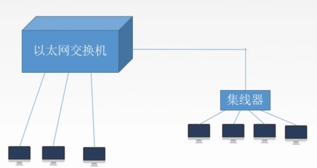
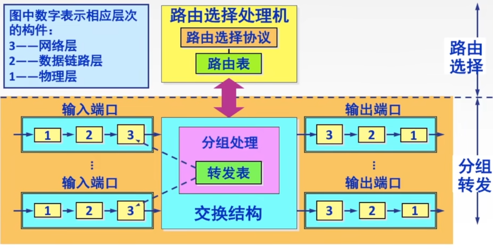
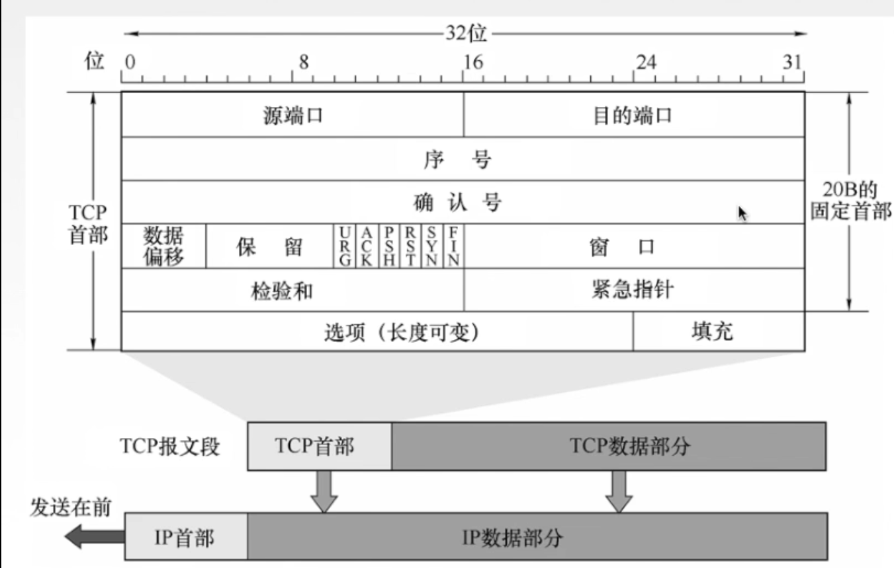
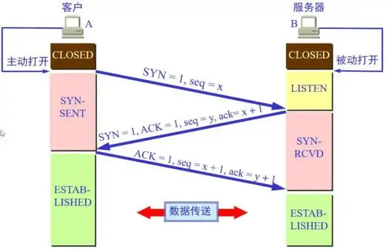
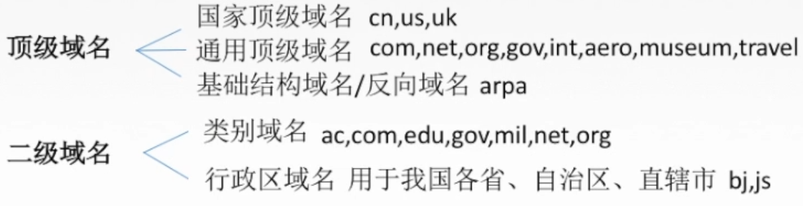
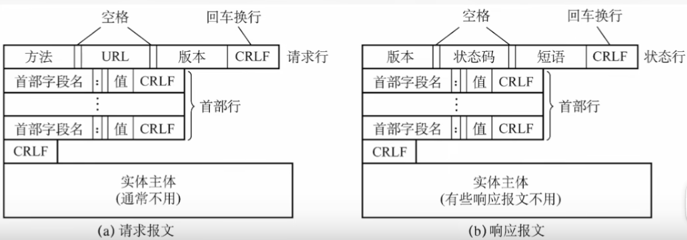

# 计算机网络体系结构

## 概念

- 计算机网络：互联起来的计算机系统的集合
  - 功能：数据通信（**最基本的功能**），资源共享，分布式处理，提高可靠性，负载均衡
  - 组成单元：独立的计算机系统
  - 规则：网络协议
  - 资源：计算机网络中的几乎一切要素，包括硬件、软件、数据

## 组成

- **基本组成**：通信子网（传输设备，通信介质，网络协议），资源子网（实现资源共享的设备，提供资源的服务）
- 硬件，软件（包括系统软件和应用程序），协议（传输数据时的规范）
- 边缘部分（用于通信和资源共享，≈客户端），核心部分（用于提供连通性和交换服务，≈服务器）

## 业务

- 可分为实时性业务和非实时性业务
- 业务服务质量（QoS）:通信主体间对信息传输质量的约定
- 业务服务质量的指标包括峰值速率(Vp)，平均速率(Vm)。将峰值速率与平均速率的比值称为突发(**β=Vp/Vm**)

## 分类

- 按范围：广域网（WAN），城域网（MAN），局域网（LAN），个人局域网（PAN，如热点）
- **按传输技术：广播式网络（计算机共享信道，如局域网、无线通信、卫星通信），点对点网络（如广域网）**
- 按使用者：公用网，专用网
- 按传输介质：有线，无线（蓝牙，微波，无线电波）
- 按拓扑结构（**拓扑结构指物理结构，在同一物理结构上使用不同的数据传输方式，会形成不同的逻辑结构**）

| 分类   | 描述                                                         | 优点       | 缺点                           |
| ------ | ------------------------------------------------------------ | ---------- | ------------------------------ |
| 总线型 | 单根总线连接所有计算机（**属于广播式网络，不能一对一传输信息**） | 效率高     | 负载压力大，对故障敏感         |
| 星型   | 所有计算机与中央设备（如路由器）连接                         | 效率高     | 对故障敏感                     |
| 环形   | 所有计算机连成环形，环中信号单向传递（可以使用方向相反的双环） |            | 对故障敏感，扩展不便，效率较差 |
| 树状   | 相当于将多个星型网络中央设备相连得到的网络                   | 传输距离远 | 对故障敏感                     |
| 网状   | 每个计算机至少与其他两个计算机连接                           | 可靠       | 线路成本高                     |

- 按交换技术

| 分类             | 描述                                                    |
| ---------------- | ------------------------------------------------------- |
| **电路交换网络** | 直接用通过物理线路将数据传至目的地                      |
| **报文交换网络** | 数据封装成报文，经多个结点存储-转发到达目的地           |
| **分组交换网络** | 将报文拆分成固定大小的数据块（分组），依然采用存储-转发 |

## 性能指标！！！

- 信道：信号传输的通道，既包括有线，也包括无线
- 速率：单位时间内**传输**的数据量（**注意1k=10^3而不是2^10；如无特殊说明，冗余数据也参与计算**）
  - **有效数据传输速率**：单位时间内传输的**有效数据**量
  - **有效数据**：**对于不同的层，有效数据的含义不同**。如帧中，数据报是有效数据；数据报中，报文段是有效数据

- 带宽(Bandwidth)：信道的**速率范围**
  - 数字设备中，带宽与速率的单位一致。数据发送速率可以是0到最大速率之间的任意值，所以带宽指信道的**最大信息传输速率**
  - 模拟设备中，带宽通以Hz为单位。实际设备可传播的信号速率既有上界又有下界，**两者频率之差为带宽**
  - 带宽只是一个理论值，实际运行时，速率可能超过带宽规定的范围

- 吞吐量：单位时间内通过某个网络/信道/端口的数据量（不超过带宽）
- 时延(Delay)：数据传输的某个过程花费的时间。**总时延=连接时延+发送时延+传播时延+排队时延+处理时延**
  - 总时延：从开始发送第一个数据，到发送完最后一个数据的时延
  - 发送时延（**传输时延**）：从发送第一个数据到发送最后一个数据的时间
  - **传播时延**：数据在信道内的传播时间，等于信道长/电磁波速
  - 排队时延：等待信道可用花费的时间（数据的不同部分、一块数据在路径的不同路段上都要不同的排队时延）
  - 处理时延：信道处理数据花费的时间（比如存储-转发，路由，检错）

- 时延带宽积：**信道中**流动的数据量（**只有传播阶段才算作在信道中**）。**时延带宽积=传播时延*带宽**
- 往返时延(Round-Trip Time)：**发送端发出信息到发送端接收到接收端的确认信息的总时延**。计算RTT时，默认接收方受到第一个数据后便会立刻返回确认信息，故**RTT=发送传播时延+接收端处理时间+返回传播时延**
- 信道利用率：有数据通过的时间占总时间的比例。利用率越高，平均排队时间越长

$$
t_{电路\_发送}=\frac{d}{S} \hfill \\
t_{报文\_发送}=k\frac{d+e}{S} \approx k\frac{d}{S} \hfill \\
t_{分组\_发送}=\frac{d}{p}\frac{p+h}{S}+(k-1)\frac{p+h}{S} \approx \frac{d}{S}+(k-1)\frac{p+h}{S}\hfill \\
d:总数据量 \quad S:带宽 \quad e:报文额外部分大小 \quad p:分组数据部分大小 \quad h:分组额外部分大小 \quad k:链路总段数 \hfill \\
$$

- **存储-转发相当于，一块数据经过每个中间节点时，都被额外发送了一次，这些时间算在发送时延中**
  - **分组交换默认采用流水线方式，即发送完一个数据后马上发送下一个数据；因此经过结点时，分组交换相当于多放送一遍分组，而报文交换相当于多发送一遍报文**

**注意：计算时，一定要仔细考虑每个分组的情况，即使出现了很大的数字，也不能忽略小量；一定要注意单位，尤其是Byte**

## 分层结构

- 按功能分层，每层间相对独立，某一层使用低一层的服务，实现自身的功能，并为高一层提供服务（第1层为最低层，称为物理层）；不同机器上的同一层称为对等层
- **高层无法访问仅存在于低层的内容（如网络层无法访问MAC地址），低层可能不会访问高层的一部分内容（如数据链路层不会访问IP地址）**
  - **XX层不等于XX层设备，后者可以覆盖XX层以及更低层**
  - **如果某一层有处理错误的能力，那么该层可以处理本层以及更低层的错误，高层即使出错也无法访问（理论上，应用层可以处理所有错误）**

- 实体：在第n层活动的对象称为n层实体；在同一层内活动的的对象称为对等实体
- 服务数据单元(SDU):某一层为了**实现本层功能**所使用的数据
- 协议控制信息(PCI):协议中定义的，用于控制某一层行为的数据
- 协议数据单元(PDU):**在对等层间传输**的数据。并不是指PDU在对等层之间之间直接传送，而是指，某一台机器某一层的PDU，经过多层传输，到达另一个机器的对等层时，仍然为同样的PDU
- n-SDU+n-PCI=n-PDU=(n-1)SDU。服务是与具体情况无关的一个功能模块，越高层的服务越不具体。低一层在高一层的基础上，考虑更多的一些具体情况，并将其视为更具体的服务。属于服务的数据即SDU，不属于服务的数据即PCI，二者相加得到具体情况下一层需要的所有数据，即PDU，并作为下一层的SDU。而数据发送到目的地后，不再需要每一次的PCI，所以逐层剥离PCI，得到最终的SDU。以邮寄为例：

| 层         | PCI                  | SDU                             | 服务         |
| ---------- | -------------------- | ------------------------------- | ------------ |
| 发送者     | 发送者、接收者、地址 | 要送的东西                      |              |
| 发出地邮局 | 运输方式、运输包装   | 要送的东西+发送者、接收者、地址 | 处理邮寄请求 |
| 运输       |                      |                                 |              |
| 接收地邮局 | 运输方式、运输包装   | 要送的东西+发送者、接收者、地址 | 处理邮寄请求 |
| 接收者     | 发送者、接收者、地址 | 要送的东西                      |              |

## 协议、接口、服务

- 协议：定义在**对等层**间的一系列规则，由语法、语义、同步三部分组成
  - 语法：定义数据的格式（包括发送速率？）
  - 语义：定义本层实现的功能（发送数据的内容，发送信息采用的操作——控制信息，应答方式）
  - 同步：定义各种操作的条件和时序
- **接口**：相邻两层间交换信息的连接点。一种典型的接口是**服务访问点(SAP)**
- **服务**：下层为上层提供的功能调用。一层的所有功能中，只有能被上层访问的被称为服务
- **交换服务原语**：上层使用下层服务时，两者间交换的信息（原语被分为多类，一次功能调用会先后发送若干类原语）

| 原语类型           | 方向   | 内容           |
| ------------------ | ------ | -------------- |
| 请求(Request)      | 高到低 | 请求完成的工作 |
| 指示(Indication)   | 低到高 | 指示完成的工作 |
| 验证(Confirmation) | 低到高 | 对请求的验证   |
| 响应(Response)     | 高到低 | 对指示的响应   |

| 服务类型     | 特点                                                         | 举例         |
| ------------ | ------------------------------------------------------------ | ------------ |
| 面向连接服务 | 通信双方必须先建立连接，预先分配好资源，传输结束后释放连接，能保证传输正常进行 | TCP          |
| 无连接服务   | 直接发送数据，由系统临时控制传输，不能保证传输正常进行       | UDP,IP       |
| 可靠服务     | 有流量控制、差错控制等机制                                   | TCP          |
| 不可靠服务   | **发现错误时直接丢弃，不能保证正确传输**                     | UDP          |
| 有应答服务   | **传输系统（不是接收方）**会在接收到信息后自动应答           | 文件传输服务 |
| 无应答服务   | **传输系统**不会自动应答                                     | WWW服务      |

- **事先建立好连接的通信实时性最强（电路交换）；无法事先建立连接时，无连接服务比面向连接服务的实时性更强**
- **如果信道本身相对不可靠，更倾向于使用可靠服务**

## OSI参考模型！！！


- 分7层，高三层为资源子网，低3层为通信子网
- 高四层的信息是从一个端口传到另一个端口，不关注通信子网，所以高四层的信息传输被称为端到端传输；低三层的数据会经过若干个网络结点，所以被称为点到点传输
- 数据从一台机器的应用层出发，传递到另一台机器的应用层。中间可能经过若干中继网络，这些网络通常仅由通信子网组成，利用通信子网的三层结构实现存储-转发

| 网络层     | 传输单位                 | 服务/功能                                    |
| ---------- | ------------------------ | -------------------------------------------- |
| 应用层     | **报文**                 | 为应用程序提供访问网络的接口                 |
| 表示层     |                          | 处理信息的表示方式，以便顺利通信             |
| 会话层     |                          | 通过会话机制处理错误                         |
| 传输层     | **报文段**               | 实现端到端传输                               |
| 网络层     | **数据报（划分为分组）** | 实现通信子网结点间数据传输                   |
| 数据链路层 | **帧**                   | 实现链路结点间数据透明传输                   |
| 物理层     | 比特                     | 定义传输媒介的特性，以实现传输媒介中数据传输 |

## TCP/IP参考模型


- 不同于OSI模型，TCP/IP充分考虑异构网互联问题（异构网无法建立连接），所以要求网络层只能使用无连接服务，并允许传输层使用无连接服务。**从总体来看，TCP/IP协议提供无连接、不可靠的数据报服务**（TCP协议仅确保了局部的可靠性）

# 网络设备

## 概念

- **硬件地址(MAC)：能够唯一确定一台设备的地址，生产时即确定，无法改变。共6Byte，前24位表示厂家（由IEEE规定），后24位由厂家分配（各种类型的设备都有硬件地址）**
  - 尽管MAC地址与物理设备一一对应，但不能用于在世界范围内定位设备，因为链路层以上的层都不会访问MAC地址

- **（软件）端口：设备通过网络通讯的出口，每台计算机有有干个端口，每个端口对应了一项网络服务（协议）。共16位，最多能表示65536个端口号**
- **（设备）端口：设备的物理端口，通过端口与其他设备连接**
- **XX层设备：功能仅仅与XX层（以及比它更低的层）有关的设备**

### 冲突域与广播域！！！

| 设备          | 能分割冲突域 | 能分割广播域 |
| ------------- | ------------ | ------------ |
| 中继器/集线器 | 否           | 否           |
| 网桥/交换机   | 是           | 否           |
| 路由器        | 是           | 是           |

- **广播域：能够收到某一设备发出的广播帧的一组设备的集合**
- 广播：发送给一个广播域/子网中的所有设备（特别地，**如果发送者也是该广播域内的设备，那么发送者不会收到广播**）
- **冲突域：同时发送数据帧且会引发冲突的一组设备的集合**
- 计算广播域与冲突域时，先将所有设备看成一整个广播域/冲突域，然后逐个考虑设备分割


$$
上图中,从左往右将计算机编号为1～7 \hfill \\
冲突域为:\{1\},\{2\},\{3\},\{4,5,6,7\} \hfill \\
广播域为:\{1,2,3,4,5,6,7\} \hfill \\
$$


- 上图中，每个区域均为一个广播域（讨论广播域和冲突域时，不计入绿色区域）

## 传输介质

- 传输媒体（传输介质）：通信过程中，发送设备和接收设备间地物理通路（既可以指物理介质，也可以指在物理介质中传播的波）
- 传输媒体不属于物理层。仅传输信号，没有其他功能

### 导向性传输介质

- 介质是有向的，如各种传输线


| 介质     | 特点                                                 | 举例       |
| -------- | ---------------------------------------------------- | ---------- |
| 双绞线   | 成本低，传输距离短                                   | 网线       |
| 同轴电缆 | 成本高，传输距离长，带宽大（因为屏蔽性好）           | 电视信号线 |
| 光纤     | 带宽极大，传输距离长，体积小，保密性好，抗干扰能力强 |            |

| 介质     | 含义                                         | 光源       | 特点                 |
| -------- | -------------------------------------------- | ---------- | -------------------- |
| 单模光纤 | 传播光的模式是单一的横向模式（光纤直径极小） | 激光二极管 | 损耗小，传播距离较长 |
| 多模光纤 | 传播光的模式有多种                           | 发光二极管 | 损耗大，传播距离较短 |

- 双绞线**分屏蔽双绞线(STP)**和**非屏蔽双绞线(UTP)**，非屏蔽双绞线的有效传输距离仅100m
- 同轴电缆主要分为50Ω和75Ω，分别传送基带信号和宽带信号

### 非导向性传输介质

- 介质是无向的，如空气

| 载体     | 方向 | 特点                   | 举例                       |
| -------- | ---- | ---------------------- | -------------------------- |
| 无线电波 | 全向 | 穿透能力强             | 电话、电视、互联网         |
| 微波     | 单向 | 带宽大                 | 地面微波接力通信，卫星通信 |
| 红外线   | 单向 | 电信号需要转换为红外线 |                            |
| 激光     | 单向 | 电信号需要转换为激光   |                            |

- 卫星通信特点：带宽大，距离远，覆盖广，可广播通信；成本高，时延大，受气候影响，误码率高

## 物理层设备

### 中继器(Repeater)

- 功能：修复数字信号的损耗（依靠再生信号），放大信号，延长传播距离
- 没有纠错、存储转发功能
- **两端只能是网段而不是子网，两端网络种类和传输速率必须完全相同，但可以有不同的链路层协议（低层服务不关心高层使用哪种协议）**
- 中继器处理信号需要时间，不能使用过多中继器
- 5-4-3规则：10BASET以太网有规定，最多有5个网段、4个中继器、3个连接计算机的网段

### 集线器(Hub)

- 功能：延长传播距离，发送广播
- 实质上是有多个接口的中继器，**所有接口的设备平分带宽**
- 任何一个接口的设备可以发送信号，经过放大后广播给其他接口的设备**（没有转发功能）**
- 一个集线器上的多个设备同时发送数据会导致冲突
- 还可以用集线器将多个集线器连接起来（这样的集线器被称为**中央集线器**），中央集线器上，更容易发生冲突

## 链路层设备

### 网络适配器(Network Interface Controller)

- 功能：连接计算机与**局域网**（个人计算机通常属于某个局域网）
- 通常为一块网络接口卡，即网卡，其中存有MAC地址

### 网桥(Bridge)

- 功能：延长传输距离，不同规格网络间通信，过滤与转发 
- 分为透明网桥源路由网桥
  - 透明网桥：不给网桥提供关于设备的信息。网桥自主完成路由选择
  - 源路由网桥：给网桥提供最佳路由信息（即应当如何选择链路）。发送帧时，帧首部中会插入最佳路由信息
- 只有两个端口，分别连接一个子网（**网段**），**两端网络的规格可以不同**（物理层不同/MAC子层不同/速率不同）
  - 网段：包含了若干规格相同、可以直接通信的计算机的子网
- 使用转发表（原理见交换机）

### 交换机(Switch)！！！


- 功能：延长传输距离，不同规格网络间通信，过滤与转发
- **交换机不同端口连接的多个设备可以同时通信；交换机不会将收到的数据单纯地广播给所有与之连接的设备**
- **总带宽等于各个端口带宽之和**；半双工通信相比全双工通信，带宽为一半半
- 使用**转发表(MAC表)**，储存**MAC地址**和端口的对应关系
  - 收到一帧时，根据MAC地址发送给特定子网的特定设备（或丢弃）
  - **如果转发表中没有匹配项，交换机发送广播，等待MAC地址匹配的设备发送确认帧，以更新转发表**
  - 转发表由容量有限，通常使用先进先出算法
- 分为直通式交换机和存储转发式交换机
  - **直通式交换机**：收到帧后，**仅仅确认目的地址(6Byte)**便立即转发。转发延迟小，不可靠，无法用于不同规格网络
  - **存储转发式交换机**：缓存收到的帧，检验无误才转发。延迟较长，较可靠，可用于不同规格的网络
- 相比于网桥，端口数量更多，传输速率更高

## 网络层设备

### 路由器(Router)



- 功能：转发，分组，排队管理
- 可以分为**路由选择处理器**和**交换结构**；有多个输入端口和输出端口（固定的，不会改变，与同一个子网相连的输入输出端口通常被画成一条线）
- 使用路由表、转发表、ARP缓存
- 路由器可以连接**异构网络**，可以支持多种不同的网络协议

### 远程控制器

- 功能：与多个路由器通信，统一计算它们的路由表和转发表
- 仅用于SDN方法中

## 高层设备

- 涉及传输层及以上的设备只有计算机

# 物理层

## 功能

- 传输数据

- 定义传输媒体的特性
  - 物理特性（线路接口，引脚等）
  
  - 电气特性（线路电压范围，传输距离，速率，阻抗等）
  
  - 功能特性（线路用途，电平的含义等）
  
  - 规程特性（各线路的工作规程、时序）
  
- 定义通信方式（单工/半双工/双工）

- 定义传输方式（串行/并行，同步/异步）

## 数据通信基础


- 信道：信息的传输媒介，通常是有方向的概念，一条通信线路上通常包含发送信道和接收信道

  - 有线/无线信道
- 数字/模拟信道：传递数字/模拟信号（基带/宽带信号）的信道
  - **基带信号：即数字信号。方波，直接用高低电平或高低电平的变化表示不同含义的数据，仅有这类信号属于基带信号。如电脑内部线路传输的信号**
- **宽带信号：即模拟信号**
- 信号：以电/磁的形式表示的数据
- 码元：信号的最小单位**时间单位**。1码元对应的时间称为**码元宽度**
  - **有2种状态的码元携带1bit信息，有2^n种状态的码元携带n bit信息**
- 码元传输速率：速率的一种表述方式。**单位时间内传输的码元量（即码元宽度的倒数）**，以**B(Baud,波特)**为单位
- 信息传输速率：速率的一种表述方式。单位时间内传输的数据比特数（即二进制码元的个数；1个2^n进制码元相当于n个二进制码元），以bit/s为单位
- **采样定理：采样频率大于等于信号最高频率（最高频率≠带宽）的两倍时，得到的信号是不失真的**
- **求发送混合信号（多种频率的信号共存）带宽时，简单地用最高频率减去最低频率即可**

## 通信方式

| 通信方式   | 信息传播方向                     | 举例   |
| ---------- | -------------------------------- | ------ |
| 单工通信   | 单向（且方向不会改变）           | 广播   |
| 半双工通信 | 双向（但一方不能同时发送和接收） | 对讲机 |
| 双工通信   | 双向                             | 电话   |

## 传输方式

*以下传输方式，并不是指某个特定层的传输方式，分类时不考虑每一层的特点，而是考虑其他与层无关的特点*

| 传输方式 | 描述                         | 适用场合   | 举例     |
| -------- | ---------------------------- | ---------- | -------- |
| 串行传输 | 沿单条信道，逐比特传输       | 远距离传输 | 无线网络 |
| 并行传输 | 沿多条信道，同时传输多个比特 | 近距离传输 | 数据总线 |

| 传输方式 | 描述                                                         |      |
| -------- | ------------------------------------------------------------ | ---- |
| 基带传输 | 用数字信道直接传输基带信号                                   |      |
| 频带传输 | 将基带信号调制后通过模拟信道传输                             |      |
| 宽带传输 | 将信道分为多个频段，每个频段分别使用频带传输，传输不同的信号 |      |

| 传输方式 | 传输单位 | 描述                                         | 额外数据量 | 效率 | 举例     |
| -------- | -------- | -------------------------------------------- | ---------- | ---- | -------- |
| 异步传输 | 小组     | 少量字符加上起始位、结束位构成小组           | 较大       | 较低 | 键盘输入 |
| 同步传输 | 帧       | 大量字符加上若干个同步字符（位于开头）构成帧 | 较小       | 较高 | 邮件传输 |

- 异步传输：随时可能发送少量数据，接收方需要立刻反应；**有起始位和结束位（1bit）**，起始位能给接收方反应空间，结束位标志接收结束；**发送方与接收方的时钟不需要统一**
- 同步传输：发送方以相对恒定的速率持续发送数据；**开头有同步字符（若干Byte）**，接收方收到后准备好接收数据；**发送发与接收方的时钟统一（双方以相同的节奏发送、接收数据）**

## 数据交换方式

- 数据交换：通过交换设备集中控制数据转发传输。有利于减少信道
- 交换设备：接收来自各方的数据以及关于数据传输的额外数据，交换设备根据额外数据执行**路由选择算法**，控制数据传输的下一个结点

| 特点           | 电路交换                 | 报文交换         | 分组交换（数据报方式） | 分组交换（虚电路方式） |
| -------------- | ------------------------ | ---------------- | ---------------------- | ---------------------- |
| 需要连接       | 是                       | 否               | 否                     | 是                     |
| 需要路由选择   | 否                       | 是               | 是                     | 否                     |
| 传输和发送时延 | 短                       | 长               | 相对短                 | 相对短                 |
| 存储-转发机制  | 无                       | 有               | 有                     | 有                     |
| 可靠性控制     | 无                       | 仅差错控制       | 仅差错控制             | 差错控制，流量控制     |
| 失序和重复问题 | 无                       | 无               | 有                     | 无                     |
| 信道利用率     | 低                       | 高               | 高                     | 高                     |
| 应对故障能力   | 差                       | 好               | 好                     | 好                     |
| 冗余信息       | 无                       | 相对少           | 多                     | 相对少                 |
| 其他优点       | 控制简单                 | 提供多目标服务   | 同左，降低出错重发成本 | 同左                   |
| 其他缺点       | 无法用于不同规格设备     | 无法用于模拟信号 | 同左                   | 同左                   |
| 适用范围       | 实时性要求高，不介意错误 | 无               | 通用，尤其错误率较高时 | 通用                   |

### 电路交换

- 信源和信宿之间有一条物理线路传输数据（中间可能经过若干交换设备），要求采用双工通信
- 分为三阶段：
  1. 建立连接：信源沿路径发送呼叫请求，信宿受到呼叫请求后沿路径返回呼叫应答
  2. 通信：信源受到呼叫应答后开始发送信息
  3. 释放连接：信源沿路径发送释放请求，信宿受到呼叫请求后沿路径返回释放应答，在返回途中按顺序断开连接
- 电路交换过程中路径上的线路会被独占

### 报文交换

- 报文：报文交换中数据传输的单元（**不同于应用层的报文**），一次发送的、传输过程中不可分的数据块。长度不固定
- 传送过程中，采用储存-转发方式，交换设备可以暂存报文（交换设备有缓冲区，为了能够存储更多报文，还会用硬盘存储报文，进一步延长存储-转发时延）
- 报文交换过程中线路不会被独占。仍然会发生拥堵，由交换设备处理，避免某些报文等待过久

### 分组交换（数据报方式）

- 分组：分组交换中数据传输的单位（**不同于网络层的分组**），分组大小固定，独立地执行路由选择和纠错
- 对报文交换的改进（**网络越不可靠，越倾向于分为更小的组，逐个检错**）
- **每个分组携带源地址和目的地址**
- **现代网络几乎都使用分组交换，根据有连接和无连接分为数据报方式和虚电路方式**

### 分组交换（虚电路方式）

- 仍然对报文进行分组
- 形式与电路交换相同，只是介质和交换设备不同。需要建立连接和释放连接，所有分组沿连接路径传输；**仅在建立连接时需要路由选择，不需要预分配带宽**
- **不像电路交换那样独占线路，一条物理线路可以同时被多个虚电路使用**
- **每个分组携带虚电路号(VCID)**
- 分为**临时型虚电路（临时创建和释放连接）**和**永久型虚电路**两类
- 连接发生故障或错误时，可以切换路径以重新建立连接；但重新建立连接代价较高，相对来说，不适用于经常出现故障或错误的环境

## 失真！！！

- 失真：信号传输过程中，因各种原因，导致波形发生改变
- 引发因素：传输快，传输距离远，噪声干扰，媒体质量差
- 码间串扰：信号失真导致接收端接收到信号后无法某些分辨码元的状态

| 信噪比(无单位) | 信噪比(分贝) |
| -------------- | ------------ |
| 10             | 10           |
| 100            | 20           |
| 1000           | 30           |

$$
信噪比: \eta=\frac{S}{N},无单位转分贝: x \rightarrow 10\log_{10}x \mathrm{dB},分贝转无单位: x \mathrm{dB} \rightarrow 10^{x/10} \hfill  \\
S:信息平均功率 \quad N:噪声平均功率 \hfill \\
奈氏定理:理想低通信道中,为了不发生码间串扰,R = 2W,其中C= R\log_2M=2W\log_2 M \hfill \\
香农定理:考虑噪声的低通信道中,为了不发生码间串扰,C= W \log_2(1+\eta) \hfill \\
综合考虑两种定理:C= W \cdot \log_{2}(\min\{M^2,1+\eta\}) \hfill \\
R:极限码元传输速率 \quad C:极限信息传输速率 \quad W:带宽 \quad M:码元状态数 \hfill \\
$$

- 奈氏定理针对发送速率过快导致的码间串扰，香农定理针对噪声导致的码间串扰。实际传输速率需要同时小于两个定理规定的传输速率（**注意，计算“最大”速率时，才需要使用两种定理**）

## 编码

- 编码：通过**数据**生成**数字信号**的过程

### 数字数据编码

- 理想情况下，接收设备以与码元宽度严格相等的间隔接收信号，实际中未必能实现时钟同步，接收的信号未必准确
- **信号的跳变可以看作时钟信号，有利于时钟同步；曼彻斯特编码、归零编码、差分码的信号中既包含数据，也包含时钟信号**
- **对于两个电平表示1bit信号的编码时，把一个电平看成是一个码元；数据传输速率=码元传输速率/2（如以太网）**

| 编码方式         | 1的表示   | 0的表示   | 特点                                   |
| ---------------- | --------- | --------- | -------------------------------------- |
| 非归0编码(NRZ)   | 高        | 低        | 难以同步                               |
| 归零编码(RZ)     | 高-低     | 低-低     | 没有充分利用冗余，同步能力不够好       |
| **曼彻斯特编码** | **高-低** | **低-高** | **容易同步**                           |
| 4B/5B            |           |           | 保证一定同步能力的前提下，编码效率较高 |

| 编码方式               | 可能波形     | 1的表示          | 0的表示          | 特点                            |
| ---------------------- | ------------ | ---------------- | ---------------- | ------------------------------- |
| 反向非归零编码(NRZI)   | 高，低       | 与上一个波形相同 | 与上一个波形相反 | 仅当信号中0的数量多时有同步能力 |
| 差分曼彻斯特编码(NRZI) | 高-低，低-高 | 与上一个波形相反 | 与上一个波形相同 | 抗干扰能力更强                  |

- 两种差分码均遵循：**首比特1为高，0跳变**


### 模拟数据编码

- 主要包括抽样、量化、编码三步：
  1. 对模拟信号周期性采样，得到离散的信号（**需要遵循采样定理，数字信号最大频率是模拟信号的两倍**）
  2. 按照一定标准，将连续的物理量转化为离散的数值
  3. 把量化的结果按某种规则二进制编码
- **脉冲编码调制(PCM)：符合上述规则的、普通编码方式（名为“调制”，但依然属于编码）**

## 调制

- 调制：通过**数据**生成**模拟信号**的过程

### 数字数据调制

- 调幅：不同的振幅表示不同的信息
- 调频：不同的频率表示不同的信息
- 调相：同一波形加上不同相位的偏移表示不同的信息
- 常用正交振幅调制(**QAM**)方式。此方式中，**码元可能状态数=可选振幅数*可选相位数**。使用QAM且具有m种状态的码元的信号被称为**m-QAM**信号

### 模拟数据调制

- 对模拟信源产生的模拟基带信号进行处理，以适配传输的要求（比如提高频率以实现频分复用）

# 数据链路层

- 链路层结点：网络中的**某些**物理设备（除了用户直接使用的计算机，体现了中继、转发等功能的物理设备被也视为链路层结点）
- **链路**：链路层结点间的物理通路，即物理层的传输介质
- **数据链路**：结点间的逻辑通道，由**链路**以及控制数据传输的**协议**组合而成
- 数据链路层不能为网络层提供无确认的面向连接服务（其他三种可以）
- 考虑链路层时，通常不关心链路层与物理层、网络层间的反复转换，而是假想两个设备的链路层间由虚拟的数据链路直接相连

## 功能

- 控制数据在各链路层结点间的传输（单位为帧）
- 封装成帧（定义帧的长度、格式）
- 透明传输
- 访问介质控制
- 可靠传输（差错控制，流量控制）

## 封装成帧


- 帧长：帧开始到帧结束的长度（由数据量衡量），帧长度可变，但有上限
  - **最大传送单元(MTU)：帧的数据部分（即数据报）的最大长度。由协议规定的固定值**
- 帧定界：由帧定界符定义边界。传输过程中，**大量帧连续地传输**，所以需要划分边界
  - 帧同步：接收方应当能通过定界符确定帧的开始和结束

## 透明传输

- 透明传输：强调链路层能够传输任何内容的数据报。主要关注的是，数据报的内容可能和帧定界符冲突，必须对此处理

| 成帧方式    | 帧定界符                                        | 数据部分处理（发送端）         | 数据部分处理（接收端，确定边界之后）                  |
| ----------- | ----------------------------------------------- | ------------------------------ | ----------------------------------------------------- |
| 字符计数法  | SOH为计数字段，表明整个帧(含首尾)的字符(Byte)数 | 无需处理                       | 无需处理                                              |
| 字符填充法  | SOH和EOT为协议定义的两个常量                    | 一旦出现EOT/SOH/ESC，前面添ESC | 一旦出现ESC，去掉该字符，且后一个字符固定视为普通字符 |
| 0比特填充法 | SOH和EOT为01111110                              | 一旦出现11111，后面添0         | 一旦出现11111，去掉之后的0                            |
| 违规编码法  | 将违规编码用作SOH和EOT                          | 无需处理                       | 无需处理                                              |

- SOH：帧首部的第一个字段(1Byte)
- EOT：帧尾部的最后一个字段(1Byte)
- ESC：转义字符（1Byte）
- 违规编码：不可能出现的码元（**仅1bit**）。如，曼彻斯特编码中，高-高和低-低是违规编码

## 可靠传输

- 差错完全是由各种噪声引起的
  - 全局噪声：线路本身的物理特性带来的固有噪声
  - 局部噪声：偶发事件带来的噪声

- 位错：帧的某一bit错误，由编码技术应对
- 帧错：帧丢失/重复/失序，由流量控制技术应对

- 链路层为网络层提高的服务类型需要按情况选择
  - 无确认无连接服务：通信质量好的有线链路
  - 有确认无连接服务/有确认面向连接服务：通信质量差的无线链路

### 差错控制

- 依靠编码检测错误，发现错误后的处理通常为丢弃重发

- 链路层的编码是指，在原有二进制数据的基础上处理，形成具有检错纠错能力的码

- 常用编码方式：奇偶校验码，循环冗余码，海明码

#### 差错类型

- **帧错**：帧整体的差错，包括丢失、重复、失序等；消除帧错是流量控制的任务
- **位错**：帧内部的局部差错；通过某种校验码发现和消除错误
  - 随机差错：由独立的随机噪声引发的差错（影响1位数据）；降低信噪比能够减少随机噪声
  - 突发差错：由突发的一系列连续错误引发的差错（影响连续的几位数据）；需要特殊的处理手段
  - 干扰差错：由外部干扰源引发的差错（影响大量数据）；需要抗干扰技术

#### 奇偶校验

- 奇校验：末尾添加校验位，使码中1的个数为奇数
- 仅当错误的个数为奇数时，能发现错误

#### 海明码


$$
2^r \ge k+r+1 \hfill \\
k:原数据长度 \quad r:冗余位总长度 \quad  \hfill \\
f(i)=\{x|1 \le x \le k+r, x \ and \ i \ne 0 (按位与)\} \hfill \\
f:求某个冗余位所在的组的映射,自变量为冗余位的序号,因变量为一个集合,表示该组中所有位的序号 \hfill
$$

- 原数据中插入若干冗余位得到海明码，**插入的数位于1、2、4、8……这些位置上(从1开始计数)**
- **每个冗余位按特定规则（如上式）与若干位原数据位构成一组，每组均使用偶校验码**
- 检错时，对于每个冗余位，分别求出它们所属的组，并进行偶校验，不符合则表明出错（一组出错，可能是该组中的某一位出错；结合多组的错误，才能定位到底哪一位出错）
- **原数据仅错误一位时，能够检出在哪一位并校正**

#### CRC码

$$
2^r>=k+r+1 \hfill \\
k:原数据长度 \quad r:冗余码长度 \quad  \hfill \\
M<<r \mod G = R(模2除的余数) \quad N=M～R(二进制数拼接) \hfill \\
若N’ \mod G \ne 0,N' 有差错 \hfill \\
M:原数据 \quad G:生成码 \quad R:冗余码 \quad N:CRC码 \quad N':接收方受到的码
$$

- 原数据末尾添加若干位得到CRC码
- 模2除法：二进制竖式除法，其中的减法为**模2减法**
  - 模2加/减法：每一位进行异或运算，不进位/借位
- 为了使冗余码为r位，生成码必须是r+1位，最高位和最低位必须为1（这是最基本的要求）
- 生成码可以用多项式形式表示，所以也被称为生成多项式（如，10011可表示为x^4+x^1+x^0）
- 检错能力：
  - 错误的位数为奇数时，总是能检出
  - 能检出离散的2位随机差错
  - 能检出不超过r位的突发差错
  - 有一定概率检出r+1位的突发差错


### 流量控制！！！

- 含义：控制发送速率，确保发送方发送与接收方接收的帧保持一致，宏观上看发送和接收的速率一致
- 许多层中均可以进行流量控制（不需要同时进行），并且有着相似的协议

#### 停止-等待协议

- 数据帧和确认帧均有编号，自然递增
- 丢包可能导致数据帧或确认帧丢失
- 发送方行为（记正在等待确认的帧的编号为a）：
  - 传输开始时，发送第1帧，然后等待，并启动计时器
  - 等待时，若收到编号为a的确认帧（也被称为ACK帧），则发送第a+1帧，并重启计时器，然后重新等待；若收到编号不为a的确认帧，则丢弃
  - 等待时，若计时器超时，则停止计时器，重新发送第a帧，然后等待，并重启计时器
- 接收方行为（记正在等待接收的帧的编号为a）：
  - 若收到编号为a的数据帧，发送确认帧，更新a；若收到编号不为a的数据帧，丢弃，**依然发送编号为a-1的确认帧**
- 缺点：信道利用率低
- 停止-等待协议中确认帧、计时器、重传的做法体现在许多其他协议中，可以概括为**超时重传**，不同协议中，确定**重传延时**的算法可能不同

#### 滑动窗口协议

- 多种协议的统称，包括后退N帧协议，选择重传协议等
- 帧的编号不是简单递增，而是在0~N中循环（**N为序号范围，也称为窗口大小**，协议定义的常量；例如，序号字段为3比特，则N=8，GBN协议中发送窗口大小不超过7）
- **发送窗口：发送方已经发送而未被确认、或能发送但尚未发送的帧构成的集合**
- **接收窗口：发送方已经接收而尚未提交、或能接收但尚未接收的帧构成的集合**
- 发送方于接收方分别维护发送窗口和接收窗口
- 所有滑动窗口协议均满足：**发送窗口和滑动窗口的长度之和不超过N**

#### 后退N帧协议(GBN)


- **发送窗口大小不超过N-1**，实质上是一个循环队列；接收窗口大小为1
- 发送方行为（下个尚未发送的帧的序号为b）：
  - 队列有空位时，将上层要发送的帧入队
  - 时机合适时（？），若还有未发送的帧，便发送，将b更新为下一帧，并重启计时器
  - 收到序号为a的确认帧时，从队首开始遍历，出列所有序号小于等于a的帧（**完全以序号为依据，与逻辑上的先后和队列中的先后无关**）
  - 计时器超时后，停止计时器，将b重置为队首（**即之后重新发送窗口中的所有帧**）
- 接收方行为（记正在等待接收的帧的编号为a）：
  - 若收到编号为a的数据帧，可能会发送确认帧（仅当收到的帧编号为N时，必须发送确认帧），更新a；若收到编号不为a的数据帧，丢弃，再次发送**之前最后接收的一帧**的确认帧
  - 每接收到一帧便交给上层
  - 发送确认帧时，采用**累积确认**：从第一个尚未确认的帧开始向后遍历，直到遇到一个尚未接收到的帧（记编号为Y）。那么，便发送编号为Y-1的确认帧（Y之后的帧，即使接收到也会被忽略）
- 停止-等待协议相当于发送窗口和接收窗口均仅1帧的后退N帧协议
- 优点：信道利用率提高
- 缺点：出现帧错时，重发的代价更大

#### 选择重传协议(SR)


- **发送窗口和接收窗口大小均小于N/2，通常相等**，实质上是循环队列
- 发送方行为（下个尚未发送的帧的序号为b）：
  - 队列有空间时，将上层要发送的帧入队
  - 时机合适时（？），若还有未发送的帧，便发送，将b更新为下一帧，并重启计时器
  - 收到确认帧时，更新相应序号的帧的状态，如果队首帧已确认，从队首开始出列，直到遇到一个未确认的帧
  - **每个序号有独立的计时器**，计时器超时后，重新发送对应序号的帧，并重启计时器（**注意不包括已发送未超时未确定的帧**）
- 接收方行为：
  - 若收到属于窗口的帧，将其缓存，更新状态，发送确认帧，如果队首帧以收到，从队首开始出列并交给上层，直到遇到一个未收到的帧；若收到不属于窗口的数据帧，丢弃，如果该帧的序号小于队首元素的序号，再次发送**队首的前一帧**的确认帧
- 优点：重发的代价更小

#### 信道利用率

$$
\eta = \frac{T_c}{T},T_c=\frac{L}{C} \quad \overline{C}=\eta C \hfill \\
\eta:信道利用率 \quad T_c:发送所有数据的时延 \quad T:总时间 \quad L:发送数据量 \quad C:带宽 \quad \overline{C}:平均数据传输速率 \hfill \\
\\
停止-等待协议:\eta=\frac{T_0}{T_0+T_1+RTT} \quad 后退N帧协议和选择重传协议:\eta =  \frac{nT_0}{T_0+T_1+RTT} \hfill \\
T_0:数据帧发送时延 \quad T_1:确认帧发送时延 \quad n:发送窗口的大小 \hfill \\
$$

- 如果没有明确提及确认帧的发送时延，则忽略确认帧发送时延
- 考虑利用率时，将**刚开始发送第k帧到收到第k+n帧的确认帧**为一个周期
- **最大发送窗口大小（信道利用率）：GBN>SR>停等**

## 介质访问控制

- 点对点链路：相邻两个**结点**间的链路，不与第三方结点相连，两个设备独占通信介质
- 广播式链路：将多个结点连接在一起的链路（如总线型和星型网络），所有设备共享通信介质
- 介质访问控制(Multiple Access Control)：控制传输过程中，各种结点如何访问传输介质，以避免多对结点间的通信产生干扰

### 信道划分介质访问控制

- 基于**多路复用(Multiplexing)技术**，使用共享信道，共享信道接收来自多个结点的输入，传输后在分发给多个结点。共享信道上的多个信号需要“隔离”开（包括时域、频域等方面的隔离）
- 发送方和接收方不是固定的，例如总线型网络

#### 频分多路复用(FDM)

- 将信道的频段（即带宽）分成多段供不同的用户使用
- 一次传输过程中，分给特定用户的频段不会改变；传输结束后，分段可以调整
- 实现简单，信道利用率高；广泛地应用于模拟信号传输，但**无法用于数字信号传输**

#### 时分多路复用(TDM)

- 将使用信道的时间划分为**等大的时间片（以数据传输速率最大的设备为标准）**，称为**TDM帧**，信道的多个设备轮流占用时间片
- **总数据传输率=最大平均数据传输率（足够长的时间内，数据传输速率的平均值，默认题目给的是这个值）×设备数**
- 实现简单，**信道利用率低**（轮到某个设备时，该设备不一定恰好要发送数据）

#### 统计时分复用(STDM)

- 使用**集中器**，集中器有缓存，收到多个设备的数据后，先缓存
- 将缓存中允许存放的最多数据称为**STDM帧**，1STDM帧中能储存相当于若干TDM帧的内容，STDM帧满后，便发送
- **STDM帧的长度是动态变化的**，STDM帧能容纳的TDM帧数应当小于信道设备数
- 信道利用率比TDM更高（TDM中，时间按固定方式分割，每个用户占用固定比例的时间；STDM中，带宽动态分配，信道空闲时能占用更多时间）

#### 波分多路复用(WDM)

- 实质上与频分多路复用相同，只是，使用光传播信号时，习惯上称之为波分多路复用

#### 码分多路复用(CDM)

$$
\mathbf S = \sum f(x) \cdot \mathbf c_i \quad
f(b_i)=
\begin{cases}
1 \quad x=1 \\
-1 \quad x=0 \\
0 \quad x不存在 \\
\end{cases} \hfill \\
\mathbf S:发送出的向量 \quad b_i:第i个发送设备发送的比特 \quad \mathbf c_i:第i个发送/接收设备的芯片序列对应的向量 \hfill \\
\\
b'_i= f^{-1}(\mathbf c_i \cdot \mathbf S')\quad
f^{-1}(x)=
\begin{cases}
1 \quad x>0 \\
0 \quad x<0 \\
不存在 \quad x=0 \\
\end{cases} \hfill \\
\mathbf S:接收到的向量 \quad b_i:第i个接收设备接收的比特 \quad \mathbf c_i:第i个发送/接收设备的芯片序列对应的向量 \hfill \\
$$

- 对于使用信道的每个设备，为其分配一个**芯片序列**（用二进制数表示）
- 芯片序列与向量一一对应（1仍为1，0视为-1，所以向量完全由+1/-1组成），所有向量必须两两**正交**，任意一个向量可以用基向量组的线性相加表示。为了区分多个设备的信号，向量的维数必须大于设备数
- 某设备要发送0时，对应基向量的系数取-1；某设备要发送1时，系数取1；不发送比特时，系数取0。所以，每当所有设备发送1比特（或跳过此比特不发送），共享信道中便生成一个向量（即所有基向量的线性和），然后将其转化为二进制数发送
- 接收到信号后，将其转化为向量，然后分解到各个基向量上，进而还原出每个设备发送过的比特
- 实现较复杂，使用并不广泛

### 随机访问介质访问控制

- 不存在多路复用，每个用户在特定的时间段内能够独占信道。**结点一有信息要发送，便试图独占信道，需要一种算法解决冲突**
- 信道无法阻止自身被多个结点占用，出现多个结点同时占用信道时，传输的信息会出错（发送信息有时延(发送时延+传播时延)，**任意两段信息的发送时延在时间轴上有任意一部分重合，这两段信息都会出错**）
- **介质访问控制协议与流量控制协议并不冲突，两者同时存在。介质访问控制协议控制结点如何占有信道，流量控制协议控制结点在占有信道的期间如何正确地发送信息**
- **冲突的本质是多个发送方同时占用信道；如果发生冲突，会导致涉及的数据出现错误，接收方收到第一个字节的错误数据后，才能检测到冲突**

#### ALOHA协议


- 发送方无条件地发送数据帧
- 检测到错误则延时重传（延后时间随机）
- 冲突开销大导致信道利用率低

#### 时隙ALOHA协议

- 将时间划分为若干等大的时间片，每个时间片内足够发送一帧
- 发送方在**一个时间片刚开始时**无条件地发送数据帧
- 检测到错误则延时重传（延后时间随机），**且到时间后不会立刻发送，而是等到下一个时间片开始时**
- **按时间片对齐**能减少冲突，一定程度上提高信道利用率

#### 载波监听多路访问(CSMA)协议！！！

- 每个结点试图发送数据帧时，**先检测链路上是否有其他结点在发送信息**
- 检测是基于链路的电压特征，不完全准确，无法完全避免冲突；造成不准确的主要原因是，信号有传播时延
- 对于线路忙和线路空闲时的行为，不同的子协议有不同的策略
- 检测到错误则延时重传（延后时间随机）

##### 1-坚持CSMA

- 监听到链路空闲时立即发送
- 链路忙时，持续监听，**一旦空闲立即发送**
- 多个设备同时监听时，一旦进入空闲状态，便会立即同时发送，必然带来冲突（这被称为**隐蔽站**问题）

##### 非坚持CSMA

- 监听到链路空闲时立即发送
- 监听到链路忙后，**等待随机一段时间后再重新开始监听**
- 随机等待时长能够降低冲突发生率，但可能出现多个结点同时等待的情况

##### p-坚持CSMA

- p=1时，与1-坚持CSMA等价。p不能过小
- 将时间划分为若干等大的时间槽，每个时间槽足够发送一帧
- 一个时间槽开始时，若链路空闲，**有p的概率立即发送**；否则，跳过这个时间槽
- **到时间后不会立刻发送，而是等到下一个时间槽开始时**
- 既能减少冲突，又能减少同时等待的情况

#### 有冲突检测的载波监听多路访问(CSMA/CD)协议！！！


*对于主机A，发送数据后，有可能检测到冲突的时间范围是$(\tau,2\tau)$*

- **CSMA/CD协议只能用于逻辑结构为总线型的网络（任何一个结点发送数据时，一定会被传输给所有其他结点），这是CSMA/CD的重要特征**。常用于有线以太网；在一般无线网中，CSMA/CD无法进行全面的冲突检测
- 发送方行为：
  - 检测到信道空闲，则发送数据，**仅在发送数据的过程中进行冲突检测**
  - 如果检测到冲突，立即停止当前正进行的发送（如果有），并且延时重传（**二进制指数退避算法**）


$$
二进制指数退避算法(此算法并不局限于此协议,重传次数上限也不固定):\hfill\\
s \le 16时,r=\min\{\mathrm{rand}[0,2^s-1],1023\} \quad t = 2r\tau \hfill \\
s \gt 16时,不再重传,丢弃此帧并向上层报错 \hfill \\
s:累积已重传的次数 \quad \tau:传输时延 \quad t:下次重传的时延 \hfill \\
$$

- 为了确保及时检测冲突，必须确保发送时延大于等于**争议期**（**从开始发送数据起，到发生冲突时的最长时间间隔**）
  - **争议期(争用时间片)=2×最大传输时延(最远两设备间的传输时延)**
  - 对于设备A，A发送数据后，如果B立即发送数据，A最早在经过$\tau$后检测到冲突；如果B在A的数据即将送达时发送数据，A最晚在$2\tau$后检测到冲突
- 无法避免冲突，无法解决隐蔽站问题
- 在总线型网络中，此协议能够更快更准地检测和处理冲突（因为争议期短），信道利用率较高

#### 有冲突避免的载波监听多路访问(CSMA/CA)协议

- CSMA/CA常用于无线局域网
- 不同于CSMA协议的电压检测，CSMA/CA的检测信道是否空闲方式包括能量检测、载波检测、能量载波混合检测
- **使用一个发送计时器，该计时器的初始时间为充分长的固定时间，且只有信道处于空闲状态时才会计时**
- 监听到链路空闲时，**重启计时器**；计时器变为0时，发送数据（发送过程中不检测冲突）
- 接收方收到数据后，**发送确认帧**；接收方接收到确认帧时，才能发送下一帧，未收到则**超时重传**
- 为了解决隐蔽站问题，进行以下改变：**计时器变为0时，先发送RTS(request to send)**，接收端收到RTS后，**广播CTS(clear to send)以预约信道**；**发送方收到RTS后，立即发送数据帧**
- 减少冲突，信道利用率较高

### 轮询访问介质访问控制

- 不存在多路复用，每个用户在特定的时间段内能够独占信道。使用某种算法使**结点轮流请求从属结点发送数据**

#### 令牌传递协议

- 令牌：特殊格式的控制帧
- 令牌传递协议要求网络的**逻辑结构为环形**。实际上，**物理结构为星型**（此类网络被称为**令牌环网**）。有种类似的**令牌总线网**，其物理结构为**总线型/树型**（但并不属于令牌传递协议）
- 令牌持续不断地在各个结点间轮转，每个结点收到令牌后，短暂持有一段时间（协议规定的固定时间）。有时，令牌会”附带“数据帧一起传播（令牌每次附带/被取走数据帧时，其本身的控制信息也会改变，各结点是通过控制信息判断是否附带数据帧的）
- 一个结点要发送数据帧且收到令牌时时，如果令牌不附带数据帧，便把数据帧附带到令牌上；否则不发送
- 虽然完全避免了冲突，但带来了令牌传递的开销，更适合负载高的网络

## 局域网(Local Area Network)


- 局域网：在**某一区域**内由多台计算机组成的，使用**广播信道**的计算机组
- **任何一个设备发送信息，局域网内的所有设备都能收到信息；各设备处理信息，判断自身是否为接收方**
- 城域网(MAN)：**将多个局域网连接起来得到的覆盖更大区域的网络，依然属于局域网，采用广播信道（无线通信）**
- IEEE-802局域网标准：
  - 涉及OSI参考模型的数据链路层和物理层，将数据链路层重新划分为逻辑链路层(LLC)和介质访问控制(MAC)子层
  - **LLC层：实现差错控制，处理网络层调用（形成LLC报头），给帧编号**
  - **MAC层：实现封装成帧，可靠传输，介质访问控制**


### 特点

- 只涉及物理层和链路层，可以认为局域网没有网络层
- 使用导向性传输介质连接多台设备，拓扑结构可能有多种
- 延迟短，误码率低，传输速率高；但大量广播使局域网整体效率低下
- 各计算机平等，共享信道，采用分布式控制和广播式通信

### 分类

| 类型             | 描述                                 | 逻辑结构 | 拓扑结构       |
| ---------------- | ------------------------------------ | -------- | -------------- |
| 以太网           | 最常见的局域网，使用CSMA/CD          | 总线型   | 星型/拓展星型  |
| 令牌环网         | 已不再常用，使用令牌传递协议         | 环形     |                |
| FDDI网           | 与令牌环网类似，但传输效率更高       | 环形     | 环形（双向环） |
| ATM网            | 采用新型交换技术                     |          |                |
| 无线局域网(WLAN) | 特殊的，使用非导向性传输介质的局域网 |          |                |

### 以太网！！！

- **使用CSMA/CD的，逻辑结构为总线型的局域网**
- **固定使用曼彻斯特编码**
- **无连接**，**不可靠**（链路层中，只进行差错控制，不进行流量控制，靠上层处理帧错），使用CRC校验码
- 结构简单，成本低，使用广泛

#### 以太网MAC帧


- 目的地址：用目标主机的MAC地址表示（以太网中，MAC地址也被称为以太网地址/局域网硬件地址）
  - 特别地，地址0xFFFFFFFFFFFF表示广播
  - 两个物理设备使用同样的MAC地址是不允许的，这两个设备均无法正常通信

- 类型：协议类型
- FCS：CRC校验码的冗余部分
- **最小帧长为64字节（故IP数据报最小为46字节），MTU为1500字节（故不含前导码的最大帧长为1518字节）**

#### 分类

- 发送速率达到100Mb/s的以太网被称为高速以太网
- 后缀T表示传输介质为双绞线，F表示传输介质为光纤

| 类型      | 介质         | 发送速率 | 通信方式      |
| --------- | ------------ | -------- | ------------- |
| 10BASE-T  | 无屏蔽双绞线 | 10Mb/s   | 全双工/半双工 |
| 100BASE-T | 双绞线       | 100Mb/s  | 全双工/半双工 |
| G-bit     | 光纤或双绞线 | 1Gb/s    | 全双工/半双工 |
| 10G-bit   | 光纤         | 10Gb/s   | 全双工        |

### 无线局域网


- 接入点(AP)：**能够发送网络信号的设备**（如路由器，基站，开启热点的手机），其他设备通过接入点连接到网络。各类接入点也有MAC地址
- 服务集(SS)：无线局域网中，一个或一组拥有相同服务、能够相互通信的网络。服务集由**服务集标识符(SSID)**来区分（如，WIFI的名称即为服务集标识符）
  - 基本服务集(BSS)：服务集的基本单位。可以由一个接入点和若干个设备组成；也可以仅由若干设备组成，其中一个作为中心设备
    - 独立基本服务集(IBSS)：由少数设备构成的暂时性网络，每个设备间可以之间通信，通信距离较短
  - 拓展服务集(ESS)：由若干基本服务集和分配系统(DS)组成的复杂网络

#### 802.11MAC帧


| 无线局域网功能          | 帧控制  | 地址1    | 地址2    | 地址3  | 地址4 |
| ----------------------- | ------- | -------- | -------- | ------ | ----- |
| 独立基本服务集(IBSS)    | 0/0     | DA       | SA       | BSSID  |       |
| **发送至接入点(To AP)** | **1/0** | **APID** | **SA**   | **DA** |       |
| **接入点发送(From AP)** | **0/1** | **DA**   | **APID** | **SA** |       |
| 无线分布式系统(WDS)     | 1/1     | RA       | TA       | DA     | SA    |

- 帧控制的两个两个字段分别表示，目标设备/源设备是否为接入点
- 源地址(SA)/目的地址(DA)：源设备/目标设备的MAC地址
- 接收端地址(RA)/发送端地址(TA)：与源设备/目标设备直接通信的**基站**的MAC地址
- **From AP：某设备以AP为中介访问另一个设备**
- **To AP：某设备以AP为中介访问互联网**


### 虚拟局域网(VLAN)


- 将**同一个局域网**中的设备按逻辑划分成组（称为VLAN），与物理位置无关；设备之间不直接相连，一个交换机上连有多个主机（**一个交换机上的各个主机可能属于不同的VLAN，一个VLAN中的各个主机可能分别连在不同的交换机上**）
- 不再将整个网络中任何一个主机发送的信息无条件地广播给其他所有设备，**基于MAC地址或端口实现一对一通信**，**不同VLAN中的设备无法通信**

- 通过路由器和交换机实现通信，交换机通过转发表和VLAN表确定各个计算机属于哪个子网（VLAN表分为两种，可以存储端口，也可以存储MAC地址）

- **虚拟局域网允许通过软件管理逻辑分组，简化了网络管理**

#### 802.1Q帧


- 802.11MAC帧插入4字节形成802.1Q帧，前两个字节表明这是一个802.1Q帧，然后空4位，后12位为VLAN的ID(VID)
- 与发送方相连的交换机接收到802.11MAC帧后，根据转发表和VLAN表确定插入的VLAN标记，形成802.1Q帧；送达与接收方相连的交换机后，交换机再去除VLAN标记，还原为802.11MAC帧，对其他服务无影响

## 广域网(Wide Area Network)

- 广域网：在**大范围**内由多台计算机组成的，进行**点对点通信**的计算机组

### 特点


- 主要使用**分组交换**技术
- 传播速率较快，但由于距离长，传播延迟较大

### 点对点协议(PPP)

- 仅实现封装成帧，透明传输，差错检测（错误则丢弃），**不实现流量控制和可靠传输**
- 具有压缩数据的功能
- 需要上层提供网络层地址（因为广域网涉及网络层）
- 适用范围广，能够给多种网络层协议提供服务，能够适应多种链路（串行/并行，同步/异步，电/光）

#### 组成

- 封装成帧的方法
- **链路控制协议(LCP)**：建立和维护链路连接（被称为LCP链路）（含身份验证）
- **网络控制协议(NCP)**：为网络层建立和配置逻辑连接（被称为NCP链路）。PPP协议中包含多种NCP，用于给不同的网络层协议提供服务

#### 工作过程


1. 收到网络层的调用
2. 建立物理链路
3. 由LCP配置协商，构造LCP链路；如果协商失败，断开物理链路，返回2
4. 鉴别LCP链路；如果鉴别失败，断开LCP链路和物理链路，返回2
5. 根据网络协议，由NCP配置协商，构造NCP链路；如果失败，断开所有链路，返回2

#### PPP帧


- F：帧定界符，PPP协议采用**字符填充法**实现透明传输
- FCS：CRC校验码的冗余部分

# 网络层

## 功能

- 实现源端到目标端的数据传输（逻辑上，数据传输的单位为数据报；物理上，可能直接传输数据报，也可能分片后传输）
- 路由选择与分组转发
- 异构网络（网络层及更低层可以不同）互联
- 拥塞控制

## 概念


- 转发：将沿输入链路到达路由器的数据沿另一条输出链路发送。由硬件实现
- 路由选择：选择从源端向目标端传输信息的路径。由软件实现
- 数据平面：一个抽象实体，它控制如何转发
- 控制平面：一个抽象实体，它控制如何进行路由选择
- 传统方法：路由选择算法运行在每个路由器中。**路由器间相互通信，进而计算出各自的路由表**
- 软件定义网络(SDN)方法：路由选择算法仅运行在远程控制器中。**路由器与远程控制器通信，远程控制器统一计算各个路由器的路由表，然后分发给各个路由器**

| 方法         | 数据平面 | 控制平面                   |
| ------------ | -------- | -------------------------- |
| 传统方法     | 交换结构 | 路由选择处理器             |
| 路由选择方法 | 交换结构 | 路由选择处理器，远程控制器 |

### SDN控制平面


- SDN控制器：抽象概念，维护网络信息。这些信息可能来自于多个服务器，它们共同构成SDN控制器
  - 网络控制应用程序接口：允许**网络控制应用程序**读取网络状态，发出控制操作
  - 网络范围状态管理层：维护各设备、各链路的信息。路由选择算法在此层中实现
  - 通信层：允许设备和SDN控制器通信
- 网络控制应用程序：通过SDN控制器提供的数据和方法控制网络设备


## 路由选择

- 路由：确定**间接转发**路径的过程
- 距离：路由路径段数（**路由器到自身的距离为0，到自身任何一个端口连接的网络或路由器的距离为1**）
- **静态路由算法**：人为规定路由路由表，转发表等。适用于规模不大、变化不大的网络
- **动态路由算法**：路由器间交换信息，并结合当前网络状态，动态更新路由表和转发表
  - **全局性路由算法**：所有路由器可获取完整的网络拓扑和链路费用信息
  - **分散性路由算法**：所有路由器仅获取与之相邻的路由器及其链路费用信息（仅和相邻的路由器通信）
- **分层次路由选择协议**：将整个网络划分为若干个**自治系统(AS)**
  - 自治系统划分路由协议生效范围，提高路由效率
  - 每个自治系统内部使用同种**内部网关协议(IGP)**
  - 有专门的**外部网关协议(EGP)**处理跨自治系统的路由
- **路由收敛**：网络拓扑结构发生变化时，网络中各路由器的路由表内容更新，与拓扑结构保持一致的过程

### 路由表

| 协议     | 路由表格式                                                   |
| -------- | ------------------------------------------------------------ |
| RIP协议  | Key=目的IP地址，Value={**下一步的IP地址**，输出端口号，距离} |
| OSPF协议 | Key=目的IP地址，Value={**下一步的IP地址**，输出端口号}       |

- **下一步的IP地址只可能是路由器端口地址：**
  - **下一步就是目标网络时，“下一步的IP地址”字段空置**
  - **到下一个路由器的链路上如果存在非目标网络，直接忽略**

- **如果路由表中要记录到互联网的路由，那么目的IP地址和子网掩码必然均为0.0.0.0**
- **路由聚合技术**：**如果几个子网地址可以合成为一个超网地址（见CIDR），并且它们对应的输出端口号都相同，那么路由表中相应的几项合为一项，合成项的IP地址即超网地址**

## 分组转发

- **直接转发(直接交付)**：**目标主机和路由器某端口属于同一个网络时**，路由器将数据报**转发给目标主机**
- **间接转发(间接交付)**：**目标网络和路由器某端口不属于同一个网络时**，路由器选择一条经过若干路由器的路径，**到达目标网络**
- 转发过程：
  1. 收到数据报
  2. 确定IP地址的类型，从IP地址中求出网络地址
  3. 在转发表中查找与网络地址匹配的端口，有匹配项则转发
  4. 没有匹配项则转发给下一个路由器（**默认路由**）；如果一直没有匹配项，会在TTL=0后被丢弃
- **转发表格式：Key=MAC地址，Value=输出端口号**

### 路由信息协议(RIP)

- 属于IGP，基于**距离向量协议**，属于分散性路由算法，基于**UDP协议（不容易出错，不需要建立连接）**，属于**应用层**
- 要求所有路由器维护**自身到目标网络的最短距离**
- **一条路由路径中最多包含15个路由器，距离为16表示不可达**
- 构造路由表的过程：
  1. 每个路由器每隔一段时间（30s）向相邻路由器发送自身的路由表（**封装到报文中发送**）
  2. 每个路由器根据收到的路由表更新自身的路由表（假设收到了**IP地址为X**的网络发来的路由表）：
     1. 将收到路由表中的所有表项加入自身的路由表。对于所有新添加的字段，将**”下一步的IP地址“改为X**，将**”距离”+1**
     2. 对于所有新添加的表项进行判断（**目的IP地址记为Y**）。如果原本没有目的IP地址为Y的表项，则保留新表项；否则，保留目的IP地址相同的两个表项中，距离较短的一项（距离相同则丢弃新添加的一项）
  3. 如果超过180s没有更新数据，认为构造完成
- 网络结构发生变化，而路由表没有及时更新时，可能导致路由回路等问题
- 适用于规模小的网络

### 开放式最短路径优先(OSPF)协议


- 属于IGP，基于**链路状态协议**，使用迪杰斯特拉算法，属于全局性路由算法，基于**IP协议（为了不过度封装，以减小交换的数据量）**，属于**网络层**
- 链路状态包括费用，时延，距离，带宽等等。实际使用时，选择一个作为链路**成本度量(metric)**的依据（而不是简单地将任意两个路由器间的链路的代价视为相同）
- **OSPF将自治系统划分为若干区域**
  - 区域有层次之分；高层区域也被称为主干区域，负责连通低层区域
  - **洪泛法的边界即当前区域，路由器仅知道所属区域内的网络拓扑结构**

- 构造路由表的过程：
  1. 某条**链路状态改变**时（**每个路由器每隔30s检测一次状态**），所属的路由器向每个邻居发送**问候(HELLO)分组**，通过回答保持与邻居的链接，并动态更新到每个邻居的**成本度量(metric)**
  2. 根据上面的信息更新自身链路状态数据库，构造**数据描述(DD)分组（只是链路状态数据库的摘要，不是完整信息）**，发送给邻居
     - 每个路由器收到数据描述分组后，根据摘要判断，如果自身路由表需要跟新，则发送**链路请求(LSR)分组**（仅请求需要更新的部分）
     - 每个路由器收到LSR后，回答**链路状态更新(LSU)分组**，包含所请求链路的具体状态信息
     - 每个路由器收到LSU后，更新自身链路状态数据库，更新完毕后再向发送者发送**链路状态确认(LSAck)分组**。然后再递归地将LSU发送给与自身相邻的节点（洪泛法）
  3. 所有路由器更新完毕后，根据迪杰斯特拉算法确定自身到所有目标网络的最短路径
- 适用于规模稍大的网络
- 由于更新检测机制的存在，即使互联网规模较大，链路状态更新的次数也较少

### BGP协议


- 属于EGP，基于**路径向量协议**，使用迪杰斯特拉算法，属于全局性路由算法，基于**TCP协议**（为了确保在复杂的网络环境内可靠传输），属于**应用层**
- 存在多个自治系统时，每个自治系统需要确定至少一个路由器，作为**发言人**
- 多个自治系统间同样构成图的结构（发言人计算路由时，将结构处理为树，以免路径中出现环）
- 每个发言人与邻居交换报文（包含**路径向量**，即某个自治系统到另一个自治系统的路径），然后确定自身到其他各个自治系统的路由（仅提供相对好的路由路径，**不确保是最佳路径**）
  - 由于基于TCP协议，交换报文前，需要先建立BGP会话
  - 一开始，所有发言人与邻居交换完整的信息；之后，仅当网络结构发生变化时，与邻居交换变化部分的信息

#### BGP报文


| 分类                   | 含义                                                 |
| ---------------------- | ---------------------------------------------------- |
| 打开(OPEN)报文         | 与目标发言人建立连接                                 |
| 更新(UPDATE)报文       | 通告路径的改变                                       |
| 保活(KEEPALIVE)报文    | 长期无UPDATE时，周期性地验证连通性；也用作OPEN的确认 |
| 通知(NOTIFICATION)报文 | 报告其他报文中的错误；也用作关闭与目标发言人的连接   |

## IP协议


- 功能：提高网络可拓展性，使异构网络间可以互通
- 提供**无连接、不可靠**服务

### 数据报

#### IPv4数据报


- **首部的固定部分固定长20字节；可变部分长度可变（以4Byte为单位，不足则填充），可能有0~40Byte**
- **数据部分即报文段，除了最后一个分块的长度以1Byte为单位，其他分块的数据部分以8Byte为单位**

| 字段名        | 长度(bit) | 含义                                                         |
| ------------- | --------- | ------------------------------------------------------------ |
| 版本          | 4         | 使用IPv4还是IPv6                                             |
| 首部长度      | 4         | 首部的长度（**以4Byte为单位**），取值范围5H~15H              |
| 区分服务      | 8         | 希望获得哪种类型的服务                                       |
| 总长度        | 16        | 数据报长度（**以1Byte为单位**）                              |
| 标识          | 16        | 数据报的标识符。来自同一数据报的多个分片使用相同的标识       |
| 标志          | 3         | **最高位无效；中间位DF，0/1表示允许/不允许分片；最低位MF，0/1表示是/不是最后的一块分片** |
| 片偏移        | 13        | 分片数据部分在原数据报数据部分中的相对位置（**以8Byte为单位**） |
| 生存时间(TTL) | 8         | 每经过一个**路由器**，此字段-1，为0则丢弃。避免数据报无限地路由 |
| 协议          | 8         | 使用哪种传输层协议。**TCP为6，UDP为17**                      |
| 首部检验和    | 16        | 用于检测首部是否出错的冗余码                                 |

#### IPv6数据报


- 基本首部固定长40字节；有效载荷由扩展首部（**扩展首部的长度以8Byte为单位**）和数据部分构成，最多65535字节
- 相比于IPv4数据报，不再使用校验和来进行首部校验，通常也不检查扩展首部，大幅提高路由器处理速度

| 字段名       | 长度(bit) | 含义                                                         |
| ------------ | --------- | ------------------------------------------------------------ |
| 版本         | 4         | 使用IPv4还是IPv6                                             |
| 流标签       | 20        | **在一段时间内，从特定源点向特定终点持续发送的一系列数据被称为流**，一个流中的所有数据拥有相同的流标签 |
| 有效载荷长度 | 16        | 有效载荷部分的长度（以Byte为单位）                           |
| 下一个首部   | 8         | 下一个首部（基本首部的下一个首部为第一个扩展首部）在整个数据报中的位置 |
| 跳数限制     | 8         | 即TTL                                                        |

#### 数据报分片

- 数据报的长度受到MTU限制（如，以太网规定数据报最大长度为1500Byte），超出限制时需要分片
- 分片：将原数据报划分为分片，分片依然是数据报，它们的大小符合要求（每次划分时，都会尽量根据MTU的要求，生成最长的分片）
- IPv4可以由源主机或路由器分片，IPv6地址只能由源主机分片

### 组播

- 单播：发送给单个特定主机
- 组播：发送给多个目标主机。**一开始仅发送一个数据报，数据报尽可能地接近目标主机后，才会被复制、分发（如果要使用单播向多个主机发送数据报，需要进行同等次数的单播，效率很差）**
- 广播：发送给局域网中的所有主机（IPv6中，不区分广播与组播）
- 任播：发送给多个目标主机中，距离源主机“最近“的一个（源主机不知道”最近“的目标主机是哪一个）。IPv6特有的发送方式

- 每种传播方式都有对应的地址。**源地址只可能是单播地址；组播、广播、任播只能用于目的地址**
- 组播基于UDP协议，不可靠，出错后不发送ICMP差错报文
- 实现组播需要有组播功能的路由器

#### 组播地址


- 若干主机（不一定属于同一个网络）构成一个**组播组**，一个组播组内的设备具有相同的**组播IP地址**。组播地址使用**某些D类地址**表示
- **每个主机至多只能参与一个组播组**
- 组播IP地址都有对应的MAC地址，**高25位固定，低23位取自IP地址的低23位**（所以有32个IP地址被映射到1个组播地址上）

#### 网际组管理协议(IGMP)

- 功能：确定与一个路由器相连的主机中有哪些主机参与某个组播组
- 属于网络层，IGMP报文最终会被封装成数据报发送
- 运行在组播路由器上，组播路由器会维护哪些主机参与组播组
- 分为v1，v2，v3三个版本
- IGMPv1运行过程：
  - **本地**组播路由器维护的组播组更新时（？），向其他组播组发送报文来同步信息
  - 普遍组查询和响应机制：
    1. **本地**组播路由器周期性地向**所有本地主机**发送普遍组查询报文
    2. 主机收到报文后，如果正参与组播组，启动计时器（**时间随机**），超时后**组播**发送报告报文（**正参与组播组的主机会收到报文**）
    3. 主机如果收到报告报文，停止计时器（这样能减少通信量）
    4. 如果组播路由器没有收到任何报告报文，累计达到一定时间，则不再认为这一组中的任何主机参与主播组（**要退出组播组，只能等所有本地组播组一起退出**）
  - 新组成员加入机制；
    1. 某主机要参与某组播组时，直接主动发送报告报文
    2. 组播路由器收到报告报文时，如果之前不认为该主机属于某组播组，则将其加入该组播组

#### 组播路由协议


- 功能：确定**组播转发树**，尽量减少组播过程中的复制转发次数
- 运行在组播路由器上（多个组播路由器共同完成工作）
- 常用组播方式包括**距离矢量组播路由选择协议 (DVMRP)**，**组播开放式最短路径优先(MOSPF)协议**，**协议无关组播(PIM)**

## IP地址

- IP地址：网络给**网络中的**计算机和路由器分配的地址，通过IP地址能在一个网络中定位计算机（**未联网设备没有IP地址**）

  - 全球IP地址：全球唯一的、在互联网上通信时使用的地址。向**网络服务提供商(ISP)**申请可以得到网络地址（即属于该网络地址的所有可用主机地址）或特定主机地址

  - 私有IP地址：专用网中使用的地址（专用网不等于子网或局域网，一个专用网可能只有一个全球IP地址）。全球IP地址经**网络地址转换(NAT)**得到若干个私有IP地址
- **某些路由器**将整个网络划分为若干网络（即使两个路由器之间的连接部分仅仅为一条链路，也被视为一个网络）；计算机和路由器的端口总是属于某个网络
- **设备的IP地址是可变的，一台设备可以同时拥有多个IP地址**
  - 同一时刻，不能有多个设备共用一个IP地址
  - 有多个IP地址，意味着设备同时属于多个不同的网络/子网（网络号/子网号不同）
  - **一般路由器不会进行IP地址转换，只会不断更新MAC地址（见代理ARP）；但NAT路由器会进行IP地址转换（见NAT）**

- 网络、路由器的端口、计算机均有IP地址

### IPv4地址！！！


- 长度为32bit，由网络号-主机号组成（网络号占几位并不固定）
- **某些路由器**将整个网络划分为若干网络（即使两个路由器之间的连接部分仅仅为一条链路，也被视为一个网络）；计算机和路由器的端口总是属于某个网络
- IPv4地址满足以下规则：
  - 网络地址：每个网络有各自的网络号，**主机号为0**（任何设备的IP地址都不会是网络地址，但可以获取网络IP地址）
  - 计算机地址：网络号与所在网络一致，有各自不同的主机号
  - 路由器端口地址：和计算机地址的地位相同
- 网段个数：可以分配的网络号的数量
- **同一个路由器多个端口的全球IP地址不一定不同**
  - **普通家用路由器：路由器的每个端口和所有设备具有相同的全球IP地址，和不同的私有IP地址**
  - **连接多个网络的路由器：每个端口有不同的全球IP地址，且网络号与所属的网络保持一致**


#### 分类


- IPv4地址中首字节的值决定了它属于哪一类地址（见括号）

| 类型 | 最大网络数 | 首网络号 | 末网络号    | 最大主机数 |
| ---- | ---------- | -------- | ----------- | ---------- |
| A    | 2^7-2      | 1        | 126         | 2^24-2     |
| B    | 2^14-1     | 128.1    | 191.255     | 2^16-2     |
| C    | 2^21-1     | 192.0.1  | 223.255.255 | 2^8-2      |

#### 私有IP地址

- 只能用于专用网内部，路由器对私有IP地址不进行转发

| 类型 | 地址范围                    | 网段个数 |
| ---- | --------------------------- | -------- |
| A类  | 10.0.0.0~10.255.255.255     | 1        |
| B类  | 172.16.0.0~172.31.255.255   | 16       |
| C类  | 192.168.0.0~192.168.255.255 | 256      |

#### 特殊IPv4地址

- **以下地址都不可能表示主机的真实地址**

| 网络号                | 主机号    | 用作源地址 | 用作目的地址 | 含义                                                 |
| --------------------- | --------- | ---------- | ------------ | ---------------------------------------------------- |
| **特定值**            | **全1**   | **不可**   | **可**       | **特定网络广播地址（发送给特定网络中的所有计算机）** |
| **特定值**            | **全0**   | **不可**   | **不可**     | **网络地址**                                         |
| **全0(子网掩码32位)** | **无**    | **可**     | **不可**     | **表示默认路由，或不可用地址**                       |
| 全1                   | 全1       | 不可       | 可           | 广播地址（发送给所有网络中的所有计算机）             |
| 全0                   | 特定值    | 可         | 不可         | **当前网络**中的特定主机                             |
| 127(子网掩码8位)      | 非全0/全1 | 可         | 可           | 用于环回测试的地址                                   |

#### 网络地址转换(NAT)


**以H2发送到Web服务器为例：**

| 过程       | 源IP地址       | 目的IP地址     |
| ---------- | -------------- | -------------- |
| 从H2发出   | 192.168.1.2    | **203.10.2.2** |
| 经过R3转发 | **203.10.2.6** | **203.10.2.2** |
| 经过R2转发 | **203.10.2.6** | 192.168.1.2    |

- NAT软件借助NAT转换表实现NAT。能够将**不同私有地址**的多个端口号转换为**同一全球地址**的多个端口号
- IP地址的选择：
  - 当前专用网的源地址或目的地址：设备地址
  - 来自外部的源IP地址：**源设备所在专用网的外端口IP地址**（NAT路由器上，与外部网络连接的端口）
  - 去往外部目的IP地址：**目标设备所在专用网的外端口地址**
  - **离开专用网时，仅改变源IP地址；进入专用网时，仅改变目的IP地址；在公共网中转发时，地址不变**
- **要表示当前专用网中的设备，始终使用私有IP地址；要表示非当前专用网的设备，始终使用全球IP地址**
- NAT路由器进行转发时，**源端口号和源IP地址必须同时与转换表项匹配**，否则丢弃分组
- 某设备向另一个专用网中的设备传输数据时，尽管不知道对方的私有地址，但对方的NAT路由器依然能正确地转换IP地址，实现一对一传输

#### 子网划分与子网掩码

- 子网划分能够在不申请新网络号的前提下充分利用现有IP地址的空间
- **IP地址=网络号（取决于IP地址种类）+子网号（长度不固定）+主机号（注意全0/全1）**
- **子网掩码**：32位，用于表示含子网的网络号在IPv4地址中占哪些位（如，255.255.128.0的子网掩码表示前17位是子网号）
  - 如果IP地址与子网号匹配，说明IP地址属于该子网；子网掩码和IP地址按位与得到网络地址
  - 每个子网有各自的子网掩码，生成路由表时即包含子网掩码
- **默认网关(设备)**：指连接子网与外部网络的设备，通常是一个路由器
- **默认网关(地址)**：**主机的默认网关是与主机相连的“最近的”路由器端口的地址（如果主机的默认网关被错误地设为了其他值，那么该主机将无法经由该路由器通信）**
- 如果路由器连接了使用子网划分的网络，子网掩码会事先存在于路由表中，用于计算正确的转发表
- 有一种特殊的、位于两个路由器间，不包含任何设备，仅包含两个路由器端口的子网。**两个端口的子网掩码和子网地址必然相同**

#### 无分类编址(CIDR)

- 由网络前缀和主机号组成，网络前缀相当于可变长的网络号。在IPv4地址之后加一个数字表示前缀的位数（如128.14.32.0/20）
- 所有前缀相同的CIDR被称为CIDR地址块
- 超网：将多个网络合并起来，视为一个新的网络
  - 用超网合并网络是使用无分类编址的主要目的
  - 多个网络前缀的**最长共同前缀**即为超网的前缀（如，206.1.0.0/17和206.1.128.0/17合并成的超网的网络地址为206.1.0.0/16）
- CIDR也可用于子网划分：
  - 子网掩码由前缀位数表示
  - **通过CIDR划分子网时，各个子网的前缀位数不需要相同（其可分配地址个数也不同），合并子网时亦然**
  - 分配子网地址时，尽量避免前缀重叠（即一个网络地址与多个网络前缀匹配）；如果意外出现一个IP地址与多个子网地址匹配的情况，选择匹配长度最长的一个


### IPv6地址

- 共128位，通常用32位16进制数表示，每4个一组
  - 压缩形式：每组开头有0时，舍去不写（4个全0时要写1个0）
  - 零压缩形式：地址的中间存在连续的若干个全为零分组时，改用一对冒号表示（对每个地址只能使用一次）

| 形式       | 表示                                    |
| ---------- | --------------------------------------- |
| 一般形式   | 4BF5:0000:0000:0000:0000:0085:0000:2170 |
| 压缩形式   | 4BF5:0:0:0:0:85:0:2170                  |
| 零压缩形式 | 4BF5::85:0:2170                         |

- 直接支持即插即用互联，不需要DHCP协议

### 配置IP地址

- 静态配置：事先人为分配好各个设备的IP地址（以及子网掩码、默认网关等）。适用于设备不发生变化的情况
- 动态配置：动态分配IP地址（以及子网掩码、默认网关等）

### IPv4/IPv6共存

- 双栈技术：同一台设备上同时拥有IPv4协议栈和IPv6协议栈。这种情况下，设备会同时拥有IPv4和IPv6地址
- 隧道技术：发送过程中，对数据报反复封装/解封装，使之在IPv4数据报和IPv6数据报间转换

## 地址解析协议(ARP)！！！

- 功能：**提供IP地址到MAC地址的映射**，用于之后封装成帧
- **ARP协议按OSI模型应当属于链路层，但是TCP/IP模型中属于网络层**
- **ARP协议运行在每个计算机和路由器中，每个计算机和路由器有独立的ARP表**

- 工作过程：
  1. 某设备要发送数据帧，转发表缺少表项，无法确定目的MAC地址，向交换机发出查询请求
  2. 交换机在子网范围内**广播ARP请求分组**（包含源IP地址、目的IP地址、源MAC地址等信息及其他数据，**目的MAC地址为全F**）
  3. 所有设备收到广播后判断，如果目标IP地址自身一致，则将**ARP响应分组**（包含目的IP地址、目的MAC地址等信息及其他数据）发送给发送端
  4. 发送端收到ARP响应分组后，获取目的MAC地址，然后**封装成MAC帧**，并更新ARP缓存（实际上是每隔很短的一段时间更新一次）


- **ARP响应分组的传回是一个过程，过程中会经过若干个设备，这些设备都能一同更新转发表（而不只是发出请求的设备）**
- **广播ARP请求分组之前，交换机会更新请求发出设备的MAC地址；广播ARP分组请求时，所有收到广播的设备会更新交换机的MAC地址**

### 代理ARP

- **如果两个设备间没有路由器分隔，目的IP地址直接映射到目的MAC地址，只使用ARP协议一次**
- **如果两个设备间有路由器分隔，那么当前设备的ARP缓存中不可能有目的设备的MAC地址，也不可能通过ARP广播查询到目的设备的MAC地址；只能根据IP地址先确定下一步要转发到哪个路由器，接下来要传输数据，封装成帧时封装的是下一个路由器的MAC地址（传输过程中MAC地址会不断更新，而IP地址始终不变）；两个设备间隔N个路由器时，使用ARP协议N+1次**
- 如果路由器启用了代理ARP功能，主机A向主机C发送信息，中途经过路由器B：
  1. B收到来自A的ARP请求分组
  2. B向A发送响应分组，分组里的地址为B与A相连的那个端口的网络地址
  3. B上与C相连的端口向C发送ARP请求分组
  4. C向B上与C相连的端口发送响应分组

## 动态主机配置协议(DHCP)


- **动态分配IP地址**，实现即插即用联网
- **按OSI模型属于应用层，**基于UDP
- 仅用于IPv4地址

### 工作过程

1. 主机接入网络时，**广播DHCP发现报文**
2. **每个DHCP服务器**收到DHCP发现报文后，如果IP池中有可用的IP地址，则分配一个IP地址，**广播DHCP提供报文**
3. 主机收到第一个DHCP提供报文后，使用该报文提供的地址（忽略之后收到的DHCP请求报文），然后**广播DHCP请求报文**
4. **每个**DHCP服务器收到DHCP请求报文后判断，如果请求报文中的地址不是自身分配的地址，则收回自身分配的地址；否则，**广播DHCP确认报文**
5. 主机收到DHCP确认报文后，正式使用该地址

## 网际控制报文协议(ICMP)

- 功能：提高传输可靠性，包括差错报告和网络探询
- **介于应用层和网络层之间**
- ICMP协议帮助IP协议发现问题，但依然为不可靠服务

### ICMP报文


- 分为差错报告报文和询问报文
- 含义可变部分：校验和之后的4字节，内容与ICMP报文的类型有关
- 数据部分：差错报告报文和询问报文的内容及长度不同

#### 差错报告报文

- 数据部分：直接截取出错的数据报的首部以及之后的8字节得到，长度取决于出错数据报首部的长度 
- 对于包含差错报文的分组，不产生差错报文；对于组播分组，不产生差错报文

| 报文类型   | 含义                                                         |
| ---------- | ------------------------------------------------------------ |
| 终点不可达 | 某路由器或目标主机**无法交付数据报（无法将数据报交给上层）** |
| 源点抑制   | 某路由器**因为拥塞丢弃数据报**（已经不再使用）               |
| 时间超过   | 数据报**因为生命周期归零被丢弃**（比如traceroute命令）       |
| 参数问题   | 数据报的**首部**有错误                                       |
| 改变路由   | 数据报的传输路径有更好的选择                                 |
| 分组过大   | **数据报长度过长且无法分片**（用于IPv6数据报）               |

- 差错报告报文都是由发现错误的设备创建，封装成数据报后发送给源主机

- 工作过程：
  1. 源主机发送数据报
  2. 某路由器或主机收到数据报后发现了错误。某些错误的数据报会被忽略，直接丢弃，不再发送差错报告报文：
     - 数据部分是**ICMP报文**的数据报
     - 分为多个分组，且**之前已经发现错误分组**的数据报
     - 目的地址为**组播地址**的数据报
     - 目的地址或源地址为**特殊地址**的数据报
  3. 根据错误类型和出错的数据报构造错误报告报文
  4. 将错误报告报文发送给源主机
- traceroute命令：用于确定一个分组从源点到终点路径。发送一个数据报，设定好源点和终点，TTL设置为N，则会沿路径前进N个节点，然后源设备会收到**时间超过差错报告报文**，该报文中会包含前进N步后到达的节点的地址。依次发送TTL为1,2,3,...的数据报，便可以逐个确定路径上的节点

#### 询问报文

| 报文类型       | 含义                                                         |
| -------------- | ------------------------------------------------------------ |
| 回送请求       | 单纯地请求目标主机回复，以测试是否可达，了解网络状态（比如ping命令） |
| 时间戳请求     | 请求目标主机回答当前日期和时间，用于时钟同步等目的           |
| 掩码地址请求   | 已不再使用                                                   |
| 路由器询问报文 | 以不再使用                                                   |

- 主机和路由器均可以发送询问报文，各类询问报文都有相应的回答报文

# 传输层

## 功能

- 实现**进程**之间（端到端）的通信
- **连接管理**
- 分用复用
- 对报文进行差错检测

## 分用复用

- **分用：传输层收到报文段后，将报文其分发给目标进程**
- 复用：一台主机上的多个进程共用一个传输层发送报文
- **套接字(Socket)：即”(主机IP地址，端口号)“。套接字能够在一个网络中确定特定主机的特定进程。在一台主机的范围内，进程和端口号一一对应（一个应用程序通常使用若干进程）**
- **进程可以占用与特定服务绑定的端口号，然后使用该服务；也可以申请尚未分配服务的端口号，该端口号会临时与所需的服务绑定**
- 服务端使用的端口号：0~49151
  - 熟知端口号：0~1023。这些端口号与特定的服务（协议）绑定
  - 登记端口号：1024~49151。无法使用熟知端口号时，临时分配这些端口号给应用程序
- 客户端使用的端口号：46152~65535。完全是临时分配的

## UDP协议

- 无连接服务，不可靠传输（可靠性依靠**应用层**控制）
- 实时性强，适用于通话和小文件传输等

- 是面向报文的，**不对报文进行任何处理，直接封装到报文段中**

### UDP报文段


- **首部固定长8Byte**
- **数据部分即报文，长度以字节为单位**
- 源端口号：可以不使用（全0）。如果希望接收方回复，则填入自身端口号
- UDP长度：**整个报文段（不含伪首部）的长度**

### UDP校验


- **校验和的校验对象为伪首部+首部+数据(报文)**
- 生成校验码/进行校验前，需要添加伪首部、填充（使数据部分长度暂时变为4Byte整数倍），完成后删除（仅存在于校验期间，不参与传输）

## TCP协议

- 有连接服务，可靠传输；能实现**流量控制、有序传输**
- **一对一服务**（不提供广播/多播），全双工通信；一对进程之间只能建立一个连接，试图重复建立连接会失败
- 额外开销大，时延大，适用于大文件传输
- 有发送缓存和接收缓存（通信的两方都同时有发送/接收缓存）

### TCP报文段！！！



- **首部的固定部分长20字节；可变部分长度可变（必须为4字节的倍数，不足则填充）**
- **数据部分即报文，长度以Byte为单位；源字节流分为多段发送**
- **最大报文段长度(MSS)：**数据部分的最大长度，由TCP协议规定（说成“最大报文长度”更准确）
- **IP数据报中，IP首部紧随其后的就是TCP首部（注意IP首部的长度）**，TCB首部属于IP数据报的数据部分
- 注意字段名大小写，确认号(ack)和确认标志位(ACK)是不同的

| 字段名      | 长度(bit) | 含义                                                         |
| ----------- | --------- | ------------------------------------------------------------ |
| 序号(seq)   | 32        | **当前报文的第一个字节在源字节流中的位置（以Byte位单位）**   |
| 确认号(ack) | 32        | **表明下次希望接收到的数据从源字节流的第X Byte开始，即0~X-1 Byte都已收到（累积确认）** |
| 数据偏移    | 4         | **数据部分在报文段中的偏移量，即首部长度（以4Byte为单位）**  |
| URG         | 1         | **发送方是否要优先发送（不在缓冲中排队）**                   |
| ACK         | 1         | **连接是否已建立**                                           |
| PUSH        | 1         | **接收方是否要立即上交（不等待缓冲满）**                     |
| RST         | 1         | **是否出现严重差错，需要断开重连**                           |
| SYN         | 1         | **是否是用于建立连接的报文段**                               |
| FIN         | 1         | **是否用于释放连接**                                         |
| 窗口(rwnd)  | 16        | **发送这个报文的一方目前能接收多少Byte的数据（另一方会根据确认号和窗口确定要发送的数据）** |
| 检验和      | 16        | **计算校验和的方式同UDP一致**                                |
| 紧急指针    | 16        | **数据部分中，紧急数据的长度（紧急数据总是位于数据部分的开头）** |

### 连接管理！！！

- 连接采用客户-服务器方式，主动发起连接的一方被称为客户；双方都可以主动释放连接

#### 建立连接



- 建立过程（三次握手）：
  1. 客户端发送**连接请求报文段**
  2. 如果服务器允许建立连接，则分配所需的缓冲，并向客户发送确认报文段，此时连接处于挂起状态（半连接）
  3. 客户端分配所需的缓冲，并发送确认报文段，如果有需要发送的数据，可以直接通过这一报文发送 

| 握手次数 | SYN  | ACK  | 序号(seq)       | 确认号(ack) |
| -------- | ---- | ---- | --------------- | ----------- |
| 1        | 1    | 0    | **x(随机分配)** | 不使用      |
| 2        | 1    | 1    | **y(随机分配)** | **x+1**     |
| 3        | 0    | 1    | **x+1**         | **y+1**     |

- 1、2次握手时，并不发送实际数据，**随机设定序号是为了辅助确定对方是否正确地接收到报文段**
- 进行完第1、2次握手后，如果客户端不进行第3次握手，连接会持续处于挂起状态，服务器会不断重复第2次握手。**SYN洪泛攻击**便利用这个原理，多次进行第1次握手而不进行第3次握手，导致服务器的资源被占用

#### 释放连接


- 释放过程（四次挥手）：
  1. 客户端发送**连接释放报文段**
  2. 服务器发送确认报文段，同时通知应用程序，等待应用程序来断开连接，此时连接处于半关闭状态
  3. 服务器应用程序断开连接后，服务器释放缓冲，并发送**连接释放报文段**
  4. 客户端发送确认报文段，等待**2×MSL(最长报文段寿命)**后，然后释放缓冲，连接彻底关闭
- 理想情况下，**忽略服务器释放缓冲的时间，2、3次挥手合为一次**，双方进入CLOSE状态的时间最短（分别为**RTT+2MSL，1.5RTT**）

| 挥手次数 | FIN  | ACK  | 序号(seq)       | 确认号(ack) |
| -------- | ---- | ---- | --------------- | ----------- |
| 1        | 1    | 0    | **u(随机分配)** | 不使用      |
| 2        | 0    | 1    | **v(随机分配)** | **u+1**     |
| 3        | 1    | 1    | **w(随机分配)** | **v+1**     |
| 4        | 0    | 1    | **u+1**         | **w+1**     |

### 可靠传输

#### 差错控制

- 校验方式与UDP协议完全一致
- 发现错误后不仅仅丢弃，还会重传

#### 序号-确认-重传！！！

- **确认号表示，下次希望对方从此序号的数据开始发送**
- 发送方行为（下个尚未发送的数据的序号为b）：
  - 缓冲有空间时，将上层要发送的数据加入
  - 时机合适时（？），若还有未发送的帧，便发送，将b更新为下一帧，并重启计时器
  - 收到序号为a的确认帧时，清除缓存中所有序号小于a的数据
  - 选择以下重传方式之一使用：
    - 计时器超时后，停止计时器，将b重置为缓冲区现存数据中，最小的序号（**即超时全部重传**）
    - 发送方累积收到**3个相同序号的冗余确认**后，重传相应的数据报（这通常比计时器超时重传更快，也被称为**快速重传**）
    - 选择重传（确认帧需要包含更复杂的信息，考试中不考虑）
- 接收方行为（记正在等待接收的数据的序号为a）：
  - 若收到**序号a~c的一段连续数据**，发送确认帧，更新a；若收到开始序号不为a的数据帧，若缓冲区有空间，将其加入缓冲区，再次发送确认帧，**确认号仍为a**（TCP协议中，这被称为**冗余确认**）
  - 若重复收到了某些序号的数据，将新收到的丢弃
  - 缓冲区满、有紧急数据、或时机合适时（？）将数据交给上层
  - **发送确认帧时，采用累积确认**
- TCP协议的超时重传时间是自适应的。由**加权平均往返时间(RTTs)**决定。发送第一个报文段时，RTTs置为默认值。发送第N个报文段时，RTTs为**此数据流的**前N-1个报文段的RTT的加权平均值（权值的确定方式与不同的标准有关）

#### 流量控制！！！


*上图中，发送方初始rwnd=400*

- **属于滑动窗口协议（发送窗口和接收窗口的定义见数据链路层的流量控制）**
- **窗口大小的单位是MSS(最大报文段长度)**
- 发送窗口和接收窗口的长度是**动态变化的**。接收方发送确认数据报，其中的**ack**即表示，**发送方缓冲区**中的哪些数据可以清除；**rwnd**即表示，**发送方缓冲区**的大小不能超过这个值（rwnd通常等于**接收方空闲缓冲区大小**，受接收方清空缓冲区的时机影响）
- 发送缓冲区的大小为0是一个特殊的状态，发送方需要主动解除这种状态。发送方有一个计时器（等对方完成接收），一但收到rwnd=0的确认报文段便启动，超时后发送**零窗口探测报文段**，接收方收到后会返报文段，rwnd设为现在可接收的数据长度（如果依然为0，计时器重置）

#### 拥塞控制

- 拥塞控制是控制多个发送方根据拥塞程度，而不是控制一对一的发送速率。**发送方根据拥塞情况，调控拥塞窗口值cwnd，发送方缓冲区的大小不能超过这个值**


- 每个连接有一个**门限值(ssthresh)**，初始为16
- 对于单个连接，其cwnd按特定方式变化（每次收到接收方的确认时触发一次）：

```c#
 for(;;)
 {
     if(发生拥塞)
     {
         ssthresh=cwnd/2;
         cwnd=1;
     }
     else if(触发快速重传)
     {
         ssthresh=cwnd/2;
         cwnd=ssthresh;
     }
     else
     {
         if(cwnd<ssthresh)
             cwnd=Min(ssthresh,cwnd*2);
         else
             cwnd+=1;
     }
     yield return null;	//等待下次收到接收方的确认
 }
```

- **实际上，发送数据时发送方要分多个报文段发送，接收方可以对每帧进行一次确认（默认情况下简单地将多次发送看成一次）**
- **在慢启动阶段，cwnd实质上不是瞬间翻倍，而是每发送一帧就+1，恰好实现每个RTT内翻倍**


# 应用层

- 域名：特定网页的网址
- 网页：网络中的一个页面，具有特定域名
- 网站：若干相关网页构成的整体

## 功能

- 为应用程序（**通信单位是进程，应用程序包含若干进程**）提供网络通信服务（文件传输/访问/管理，电子邮件，虚拟终端等）
- 定义应用程序交换的报文类型，定义报文的语法、语义、操作规则

## 客户-服务器模型

- 服务器：提供服务的设备，不间断地工作，拥有永久性IP地址（以及域名）
- 客户：请求服务的主机，间歇性接入网络，拥有动态IP地址
- 客户之间不能直接通信，必须经由服务器

## P2P模型

- 没有永久性服务器
- 每个主机既可以提供服务，也可以请求服务；任意两个主机间可以直接通信；每个主机间歇性接入网络，拥有动态IP地址
- 相比于客户-服务器模型拥有更好的可拓展性和可靠性

## 域名解析系统(DNS)

- DNS基于**UDP协议**，占用服务器熟知端口号的**59**号
- DNS和HTTP同等地位（而不是附属），**进行域名解析时，使用DNS、UDP协议**（而不是HTTP、TCP协议）

### 域名




- 访问网站时，本质上是与另一个设备（通常是服务器）通信，访问网络设备需要知道该设备的IP地址。域名解析系统能将域名解析为IP地址，所以用户只需要输入域名（搜索引擎能进一步方便用户访问网站）
- 域名由点、标号组成，标号中只能包含字母、数字、横线，不区分大小写，不超过63字符
- 域名中的多个标号，从右往左，依次称为顶级域名、二级域名（通常不与顶级域名相同）、三级域名等（各种标识“身份”的标号，如bilibili）

### 域名解析！！！


- DNS服务器能够将域名解析为IP地址，**多个IP地址可以映射到一个域名（反过来不行）**
- DNS服务器是一个抽象的概念，实际上域名服务器分为多级，呈树状，整体构成DNS服务器
- 查询方式：
  - 递归查询：本地服务器访问根服务器，然后查询任务逐级交给下一级，直到到某级服务器解析出IP地址，然后逐级返回
  - 迭代查询：本地服务器从根服务器开始依次访问，如果无法解析，则获取下一级相应服务器的地址，然后本地服务器访问下一级服务器，直到解析出IP地址

- 计算机只需要知道本地域名服务器的地址，向其发出请求即可；本地域名服务器具有缓存，储存最近查询过的域名到域名服务器的映射，即哪个服务器最终解析了该域名（仅用于迭代查询）。如果缓存命中，直接访问该域名服务器
- 对于一个网址（不含文件路径），去掉开头固定的部分（http，www等），如果剩余N个标号，那么至多需要查询N+1个服务器来得到地址

## FTP协议


- 采用客户-服务器，**依赖TCP协议**，占用服务器熟知端口号中的**20和21**号
  - **控制连接是持久连接，而数据连接是非持久连接（每次传送文件，重新建立/释放连接）**

- 实现不同类型系统间的文件传输
- 有专用的FTP服务器，FTP服务器有一个主进程和若干从属进程，主进程处理所有客户的请求，分配从属进程，从属进程实际上实现客户的请求
- 此协议要求登录，但也可以匿名登录，能否匿名取决于服务器
- 客户与FTP服务器会**先后建立控制连接和数据连接，释放顺序相反**
- 传输模式分为ASCII模式（传输文本序列）和二进制模式（传输二进制序列）

## 电子邮件


- 邮件由信封（通常为收件人网址），首部（双方网址，日期，标题），主体组成
- **SMTP协议用于发送邮件、在服务器间传输邮件，POP3或IMAP协议用于接收邮件；也可以直接使用HTTP协议发送/接收邮件**

### 简单邮件传输协议(SMTP)

- 采用客户-服务器，依赖TCP协议，占用服务器熟知端口号中的**25**号
- 规定两个**SMTP进程**间如何交换信息
- **仅支持7位ASCII码传输，无法传输二进制流、非英语国家文字**
- SMTP协议使用一些具有特定内容和特定含义的报文
  - 一类属于响应报文，它们都有对应的编号，如“220 Service ready”表示同意建立连接
  - 另一类属于请求报文，如MAIL命令告知发件人网址，RCMT告知收件人网址，DATA表示即将传输邮件内容
- 工作过程（每一步均需要确认，下略）：
  1. 建立连接
  2. 邮件发送
     1. 发送MAIL命令
     2. 发送RCPT命令（有多个收件人时，发送多个RCPT命令）
     3. 发送DATA命令
     4. 正式传输邮件内容
     5. 发送QUIT命令
  3. 关闭连接
- **通用因特网邮件扩充(MIME)**：对SMTP的扩充，能够将各种非ASCII码内容与ASCII码相互转换

### 邮局协议(POP3)

- 采用客户-服务器模式，占用服务器熟知端口号中的**110**号
- 工作过程（粗略）：
  1. 服务器中的SMTP进程收到邮件，然后交给POP3进程
  2. 将收到的邮件保存在本地
  3. 接收方能够接收邮件时，从服务器接收邮件，然后服务器从本地删除该邮件

### 网际报文存取协议(IMAP)

- 采用客户-服务器模式，占用服务器熟知端口号中的**143**号
- 允许**部分传输邮件**。接收方能接收邮件时，一开始只传输首部；用户打开邮件时，才传输正文；用户打开附件时，才传输附件

## 万维网(World Wide Web)

- 万维网是大量网页的集合，包含大量的资源，资源属于网页，网页属于服务器
- 统一资源定位符(URL)：在万维网中唯一标识某个特定资源的标识符。格式为 <协议>://<主机>:<端口>/<路径>（如果不包含<端口>/<路径>，则索引到网页）
  - 协议：HTTP/HTTPS/FTP等
  - 主机：域名，或直接填IP地址
  - 端口（可选的）：服务器上对应网页使用的端口号
  - 路径（可选的）：资源在网页中的路径

### HTTP协议

- 采用客户-服务器模式，依赖TCP协议，占用服务器熟知端口号中的**443**号
- 定义浏览器进程如何与万维网通信
- 仅支持文本传输，故报文内容为文本（ASCII码）
- 工作过程：
  1. 客户输入URL
  2. DNS解析出IP地址
  3. 找到服务器，并建立连接
  4. 通信
  5. 释放连接
- HTTP协议本身不要求客户发送关于其本身的状态信息。一些网站希望获取用户信息，则要求用户发送**Cookie**（Cookie会被附在报文中发送）
- **HTTP本身是无连接的**。在建立起TCP连接之前，客户与服务器间就会交换一些报文，不需要为此专门建立连接

#### 连接方式！！！


- **建立连接之前，必须先获知对方的IP地址（域名解析会带来额外的延迟）**
- 非持久连接：建立连接（第三次握手时顺便发送请求报文），发送**一个文件**后便断开连接
- 持久连接：建立连接（第三次握手时顺便发送请求报文），之后不断开连接，可直接发送请求报文
  - 非流水线式：信道中，不能同时有多个请求/多个文件在传输
  - 流水线式：信道中，可以同时有多个请求/多个文件在传输
- **数据传输时间：**
  - **网页中包含若干文件，纯文本网页也包含最少一个文件**
  - **非持久连接中，请求一个文件至少需要2RTT**
  - **持久连接中，首次请求一个文件至少需要2RTT，之后至少需要RTT**
  - **发送大量的数据时，要考虑传输层流量控制（在非持久连接中，每次传输完一个文件，流量控制重置；在持久连接中，整个传输过程是整个流量控制过程）**

- **HTTP/1.0仅支持非持久连接；HTTP/1.1支持两种连接，默认使用持久连接**

#### HTTP报文



- 方法：所请求的操作（GET:请求获取信息；HEAD:请求响应）
- 版本：HTTP协议版本
- 状态码：类似于错误码
- 首部：包含多个字段，如服务器地址，连接类型（CLOSE：非持续连接，KEEPALIVE：持续连接），Cookie
