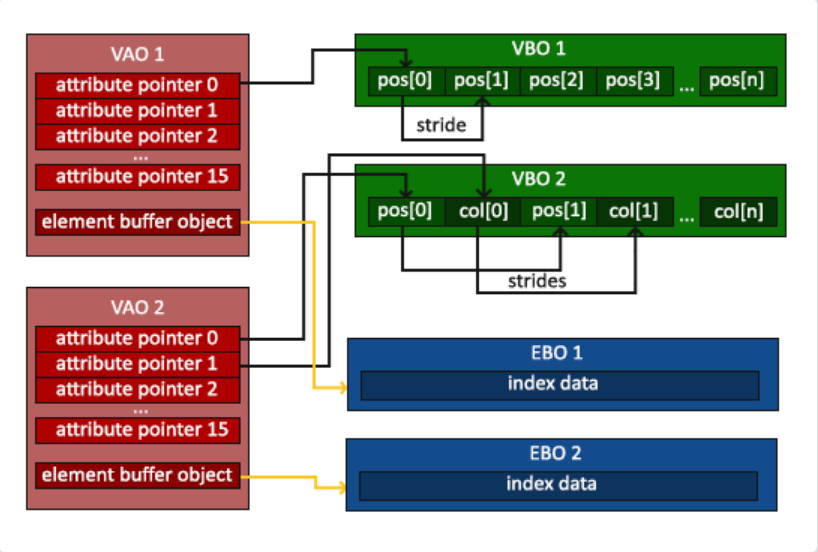

# OpenGL

- **规定了一系列图形API的一套标准**（实际实现API的代码存放在显卡驱动中）

## 概念

### 上下文

- OpenGL程序是一个状态机，要实现一个功能，通常需要先设置好**上下文(Context)**中一系列的参数，而不是单纯地调用一个API
- **上下文(Context)**：持有**当前**渲染所需的VBO、VAO、渲染程序等对象
- 将某个对象**绑定**到上下文意味着接下来此对象将被用作渲染数据（直到**解除绑定**）
- 基础的设置上下文顺序（如无特殊说明，则顺序可交换）：
  1. 创建并绑定VAO
  2. 创建并绑定VBO，设置VBO的数据
  3. 设置顶点属性指针（必须在VAO和VBO绑定的状态下进行）
  4. 创建并绑定IBO，设置IBO的数据（必须在VAO绑定的状态下进行）
  5. 根据上下文绘制图形

### 缓冲区



- **缓冲区：**OpenGL中有多种**不同类型**的缓冲区，对于每种类型的缓冲区，同一时刻只能有一个绑定到上下文
- **顶点数组对象(VAO)**：**显存**中的一个区域，持有指向某个VBO中各个属性的指针，及描述这些属性的信息，及指向IBO的指针等
  - **将VBO绑定到上下文，本质上是绑定到当前上下文的VAO上（VAO离开上下文后，VB与之的绑定关系仍会保留）**
  - **绘制时，不关心上下文中的VBO，只需要切换VAO和IBO**
- **顶点缓冲对象(VBO)**：**显存**中的一个数组，每个元素对应一个顶点，包含**单个顶点的所有属性（的具体值）**
- **索引缓冲对象(IBO)**：**显存**中的一个数组，每个元素为顶点索引（**必须使用无符号数**），每三个元素一组，表示构成一个三角形的顶点顺序
- **绘制缓冲区(Draw Buffer)**：存放片元着色器渲染结果的缓冲区

### 着色器程序

- 一个**着色器程序**包含若干个**着色器**
- **着色器编译后，不应该修改上下文，否则着色器需要重新编译**
  - 绑定新的缓冲区、启用新的顶点属性等行为是修改上下文
  - 修改某个缓冲区中特定数据的值不是修改上下文


#### 变量

- 生命周期（持有者）是**单个着色器**

#### uniform变量

- 在着色器代码中以`uniform`前缀修饰的变量，在单个着色器程序中有**location**作为标识符（和`layout(location = ?) in `不是一个location）
- 生命周期（持有者）是整个**着色器程序**，可避免给多个着色器传递重复数据；在各个着色器代码中**禁止修改**
- 可通过`glGetUniformLocation`，`glUniform1f`等API便捷地访问shader中的数据，是定义**外部可调参数**的通用做法

### 纹理

- GPU中有若干个纹理**插槽**，每个插槽存放一个纹理
- 类似于缓冲区，OpenGL中有多种**不同类型**的纹理，对于每种类型的纹理，同一时刻只能有一个绑定到上下文

### 混合

- 混合在**绘制缓冲区**中进行；绘制缓冲区有若干个，可以分别设置不同的混合函数

$$
\mathbf {c_d'}=\mathbf {f_s} \cdot \mathbf {c_s}+\mathbf {f_d} \cdot \mathbf {c_d} \quad
(均为四维列向量) \hfill \\
\mathbf {c_d'}:混合后缓冲区中颜色 \quad \mathbf {c_d}:混合前缓冲中颜色  \quad \mathbf {c_s}:待混合颜色 
\quad \mathbf {f_s}:源系数向量 \quad \mathbf {f_d}:目标系数向量\hfill \\
\\
最常见的透明混合方式:\mathbf {c_d'}=\begin{bmatrix} \alpha \\ \alpha \\ \alpha \\ \alpha \end{bmatrix}  
\cdot \mathbf {c_s}+
\begin{bmatrix} 1-\alpha \\ 1-\alpha \\ 1-\alpha \\ 1-\alpha \end{bmatrix}  \cdot \mathbf {c_d} \hfill \\
\alpha:待混合颜色的透明度 \hfill \\
$$

- 规定混合函数，本质上就是规定$\mathbf {f_s},\mathbf {f_d}$

### 后处理

- OpenGL中，后处理不是一个独立的模块，而是采用和常规渲染管线相同的流程（把待处理的图像重新视为纹理，配合自定义的用于后处理的顶点和片元着色器完成后处理）

## API

### Buffer

`glGenBuffer`可用于生成**部分类型**的缓冲区:

| glGenBuffer的target参数  | 缓冲区用途                            |
| ------------------------ | ------------------------------------- |
| GL_ARRAY_BUFFER          | 存放顶点属性（VAO）                   |
| GL_ELEMENT_ARRAY_BUFFER  | 存放顶点索引（IBO）                   |
| GL_PIXEL_PACK_BUFFER     | 存放打包后的像素数据[1]               |
| GL_PIXEL_UNPACK_BUFFER   | 存放未打包的像素数据[2]               |
| GL_COPY_READ_BUFFER      | 临时存放从某个缓冲区复制出来的数据[3] |
| GL_COPY_WRITE_BUFFER     | 临时存放从要赋值到某个缓冲区的数据[3] |
| GL_UNIFORM_BUFFER        | 专门用于存放uniform变量的缓冲区       |
| GL_SHADER_STORAGE_BUFFER | 着色器可以直接读写的缓冲区            |
| GL_TEXTURE_BUFFER        | 存放纹理数据的缓冲区                  |

[1]：将显存中的数据读到内存中（如`glReadPixels`）的过程称为打包，读出来的数据称为打包后数据

[2]：将主存中的数据读到显存中的（如`glTexImage2D`）过程称为解包，读出来的数据称为解包后数据

[3]：`glCopyBufferData`实现缓冲区数据的复制，如果需要临时存放数据，可以使用`GL_COPY_READ_BUFFER`和`GL_COPY_WRITE_BUFFER`

```C++
void glGenBuffers( 		//为若干个缓冲区分配id
    GLsizei n,
	GLuint * buffers);	//接受结果的首地址

void glBindBuffer( 	//将指定缓冲区id绑定到上下文
    GLenum target,	//缓冲区类型
	GLuint buffer);	//id(0表示解除当前绑定)

void glBufferData(			//为上下文指定类型的缓冲区分配显存,并复制数据
    GLenum target,			//缓冲区类型
	GLsizeiptr size,		//缓冲区大小
	const GLvoid * data,	//数据起始地址
	GLenum usage);			//访问数据的模式
```

### VAO

- 只有被**启用**的属性，才会被传递给着色器

```c++
void glGenVertexArrays(	//生成若干个顶点数组
    GLsizei n,
	GLuint *arrays);	//接受结果的首地址

void glBindVertexArray( //将指定VAO绑定到上下文
    GLuint array);		//顶点数组的标识符(0表示解除当前绑定)

void glEnableVertexAttribArray( //启用上下文中VBO的某个属性
    GLuint index);

void glDisableVertexAttribArray( //禁用上下文中VBO的某个属性
    GLuint index);

void glVertexAttribPointer( //指明VBO中某个属性的布局
    GLuint index,			//属性索引号(与顶点着色器代码相匹配)
	GLint size,				//该属性的分量数目(例如,位置、颜色通常有三个分量)
	GLenum type,			//该属性分量的变量类型
	GLboolean normalized,	//是否自动对该属性执行标准化
	GLsizei stride,			//某一个此属性到下一个此属性的间距(通常总是等于单个顶点占用的空间,否则可能有特殊用途)
	const GLvoid* pointer);	//第一个该属性的地址(如果已有VBO绑定,含义变为第一个该属性的地址相对于已绑定VBO首地址的偏移量)
```

### ShaderProgram

- 一个**着色器程序**由若干个**着色器连接**而成
- 一个着色器绑定到着色器程序后，如果不再需要绑定到其他着色器程序，便可以删除

```c++
GLuint glCreateProgram();//为一个着色器程序分配id

void glUseProgram( 	//将指定着色器程序绑定到上下文
    GLuint program);


GLuint glCreateShader( 	//创建着色器,返回索引号
    GLenum shaderType);	//着色器类型

void glShaderSource( 		//设置指定着色器的源码
    GLuint shader,			
	GLsizei count,			//源代码的字符串段数
	const GLchar**string,	//数组首地址,数组元素为各个字符串的起始地址
	const GLint *length);	//数组首地址,数组元素为各个字符串的长度(若为nullptr,根据结束符自动确定字符串长度)

void glCompileShader(	//编译指定着色器 	
    GLuint shader);

void glAttachShader( //将指定着色器绑定到指定着色器程序
    GLuint program,
	GLuint shader);

void glLinkProgram( //将绑定到指定着色器程序的所有着色器连接,生成完整的着色器程序
    GLuint program);

GLint glGetUniformLocation( //获取指定着色器程序中的uniform变量
    GLuint program,
	const GLchar *name);

void glUniform1f( 	//修改当前上下文中,指定location对应的uniform变量的值
    GLint location,
	GLfloat v0);
```

### Texture

```c++
void glGenTextures( 	//为若干个纹理分配id
    GLsizei n,
	GLuint * textures);

void glActiveTexture( 	//规定接下来要修改的插槽
    GLenum texture);

void glBindTexture( 	//将指定纹理绑定到上下文,占用当前上下文所规定的插槽
    GLenum target,		//纹理类型
	GLuint texture);

void glTexParameterf( 	//设置当前上下文中的纹理参数
    GLenum target,		//纹理类型
	GLenum pname,
	GLfloat param);

void glTexImage2D( 			//为指定纹理分配内存,并写入来自二维图片的数据
    GLenum target,			//纹理类型
	GLint level,			//LOD等级(从0开始,每增加1,相当于在mipmap上深入一层)
	GLint internalFormat,	//图片格式
	GLsizei width,
	GLsizei height,
	GLint border,
	GLenum format,
	GLenum type,
	const GLvoid * data);
```

### Draw

```c++
void glDrawArrays( 	//按照数组中的数据绘制图形(不人为给出IBO)
	GLenum mode,	//绘制模式,本质上是规定如何自动确定顶点索引顺序
	GLint first,	//从数组的第几个元素开始绘制
	GLsizei count);	//索引总数

void glDrawElements( 		//根据IBO绘制图形
    GLenum mode,			//绘制模式,本质上是规定如何使用IBO
	GLsizei count,			//索引总数
	GLenum type,			//IBO的元素类型
	const GLvoid * indices);//IBO的地址(如果已有IBO绑定,含义变为相对于已绑定IBO首地址的偏移量)
```

## Blend

```c++
glEnable(GL_BLEND);		//启用混合

void glBlendFunc( 		//设置所有绘制缓冲区的混合函数
    GLenum sfactor,		
	GLenum dfactor);

void glBlendFunci(		//设置指定绘制缓冲区的混合函数 	
    GLuint buf,			//颜色缓冲id
	GLenum sfactor,
	GLenum dfactor);
```


### Query

- `glBeginQuery`和`glEndQuery`总是成对使用（类似`#if`和`#end if`的配对方式）

```c++
void glGenQueries( 	//生成若干个缓冲区存放查询结果
    GLsizei n,
	GLuint * ids);

void glBeginQuery( 	//为指定id分配显存，存放查询结果
    GLenum target,	//要查询的项目
	GLuint id);		

void glEndQuery( 	//结束查询，写入结果
    GLenum target);
```

### Others

```c++
void glClear(			//清除上下文指定类型缓冲区的内容
    GLbitfield mask);	//缓冲区掩码(可用或运算连接)
```

# GLFW

- 主要用于绘制窗口、接受输入的第三方库（可用于OpenGL、Vulkan、OpenGL ES）

## 概念

- **GLFWContext**：绘制窗口所需的数据和设置，每个GLFWwindow拥有一个
  - calling thread：调用线程，指当前正在运行的线程，当前线程中执行的GLFW API会作用于**当前活跃的GLFWContext**
  - GLFWContext会修改OpenGL上下文，但并不持有OpenGL上下文
- GLFWwindow默认启用**双缓冲**（OpenGL本身并不实现双缓冲）
  - 前缓冲：当前绑定到OpenGL上下文的缓冲区，决定了窗口显示的内容
  - 后缓冲：当前未绑定到OpenGL上下文的缓冲区，常用于渲染计算
  - **两个缓冲区会通过绑定操作轮流成为前缓冲区（仅交换身份，并不交换数据）**


## 示例

```c++
#include "glfw3.h"

int main(void)
{
    GLFWwindow* window;
    if (!glfwInit())
        return -1;

    window = glfwCreateWindow(640, 480, "Window", NULL, NULL);
    if (!window)
    {
        glfwTerminate();
        return -1;
    }

    glfwMakeContextCurrent(window);

    while (!glfwWindowShouldClose(window))
    {
        glClear(GL_COLOR_BUFFER_BIT);
        //Render here
        glfwSwapBuffers(window);
        glfwPollEvents();
    }

    glfwTerminate();
    return 0;
}
```

## API

```c++
glfwMakeContextCurrent(GLFWwindow* handle):将当前活跃的上下文设为指定窗口的上下文
    handle:窗口指针(如果为nullptr,则使当前活跃的上下文不再活跃)

void glfwSwapBuffers(GLFWwindow *window):将当前窗口的后缓冲区绑定到OpenGL上下文,使前后缓冲区的身份交换
    window:窗口指针
```
