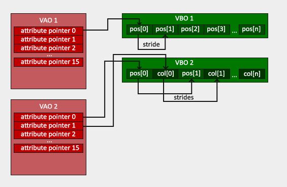

# OpenGL

- **规定了一系列图形API的一套标准**（实际实现API的代码存放在显卡驱动中）

## 概念

### 上下文

- OpenGL程序是一种“状态机”，要实现一个功能，通常需要先设置好一系列的参数（Context），而不是单纯地调用一个API
- **上下文(Context)**：**当前**渲染所需的数据和渲染设置等
- 将某个对象**绑定**到上下文意味着接下来此对象将被用作渲染数据（直到**解除绑定**）

### VBO



- **顶点缓冲区对象(VBO)**：（GPU内存中）一个数组，每个元素对应一个顶点，包含**单个顶点的所有属性（的具体值）**
  
- **顶点数组对象(VAO)**：（GPU内存中的）一个数组每个元素对应一个属性，包含**描述每个属性信息的数据（编号，数据类型，分量数目，偏移量等）**

## API

```C++
glClear(GLbitfield mask):清除上下文中指定类型的缓冲区
    mask:缓冲区类型编码(可以用按位或连接,以清除多个缓冲区)
        
glGenBuffers(int count,int* ret):生成若干个缓冲区
	count:数量
    ret:接收结果(ret会被视为数组首地址,其中存放生成的所有缓冲区的标识符)

glBindBuffer(int target,int buffer):将指定缓冲区绑定到上下文
    target:缓冲区类型
    buffer:缓冲区的标识符(0表示将绑定到上下文的指定类型的缓冲区解除)

glBufferData(int target,int size,void* data,int usage):把一块数据复制到当前绑定的缓冲区
    target:缓冲区类型
    size:缓冲区大小
    data:数据首地址
    usage:用途编码	//STATIC:仅修改一次 DYNAMIC:可能被修改多次 STREAM:每次绘制都会改变

glGenVertexArrays(int count,int* ret):生成若干个顶点数组
    count:数量
    ret:接收结果(ret会被视为数组首地址,其中存放生成的所有顶点数组的标识符)

glBindVertexArray(int array):将指定顶点数组绑定到当前上下文
    array:顶点数组的标识符(0表示将绑定到上下文的顶点数组解除)

glVertexAttribPointer(int index, int count, int type, int normalized, int stride, void* offset):
指明VBO中某种属性的分布,本质上是在修改VAO
	index:顶点属性编号(与顶点着色器代码有关,如默认顶点着色器会把编号为0的属性当作位置)
    count:该属性的分量数目(例如,位置、颜色通常有三个分量)
    type:该属性各分量的变量类型		//GL_FLOAT GL_INT GL_UNSIGNED_BYTE
    normalized:是否自动对该属性执行标准化
    stride:一个此属性到下一个此属性的间距(通常总是等于单个顶点占用的空间,否则可能有特殊用途)
    offset:该属性相对于顶点初始地址的偏移量
	        
glEnableVertexAttribArray(int index):启用指定编号的顶点属性
    index:顶点属性编号

glShaderSource(int index,int count,char* string,int length):设定着色器的源代码
    index:着色器的标识符
    count:源代码的段数(字符串可以分多段)
    string:源代码字符串首地址
    length:字符串长度(如果设为NULL,自动根据字符串中的结束符确定长度)
```

# GLFW

- 主要用于绘制窗口、接受输入的第三方库（可用于OpenGL、Vulkan、OpenGL ES）

## 概念

- **GLFWContext**：绘制窗口所需的数据和设置，每个GLFWwindow拥有一个
  - calling thread：调用线程，指当前正在运行的线程，当前线程中执行的GLFW API会作用于**当前活跃的GLFWContext**
  - GLFWContext会修改OpenGL上下文，但并不持有OpenGL上下文
- GLFWwindow默认启用**双缓冲**（OpenGL本身并不实现双缓冲）
  - 前缓冲：当前绑定到OpenGL上下文的缓冲区，决定了窗口显示的内容
  - 后缓冲：当前未绑定到OpenGL上下文的缓冲区，常用于渲染计算
  - **两个缓冲区会通过绑定操作轮流成为前缓冲区（仅交换身份，并不交换数据）**


## 示例

```c++
#include "glfw3.h"

int main(void)
{
    GLFWwindow* window;
    if (!glfwInit())
        return -1;

    window = glfwCreateWindow(640, 480, "Window", NULL, NULL);
    if (!window)
    {
        glfwTerminate();
        return -1;
    }

    glfwMakeContextCurrent(window);

    while (!glfwWindowShouldClose(window))
    {
        glClear(GL_COLOR_BUFFER_BIT);
        //Render here
        glfwSwapBuffers(window);
        glfwPollEvents();
    }

    glfwTerminate();
    return 0;
}
```

## API

```c++
glfwMakeContextCurrent(GLFWwindow* handle):将当前活跃的上下文设为指定窗口的上下文
    handle:窗口指针(如果为nullptr,则使当前活跃的上下文不再活跃)

void glfwSwapBuffers(GLFWwindow *window):将当前窗口的后缓冲区绑定到OpenGL上下文,使前后缓冲区的身份交换
    window:窗口指针
```

# GLAD

- 用于访问OpenGL API的第三方库
