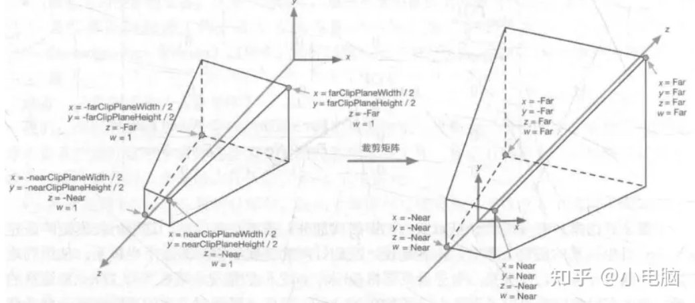
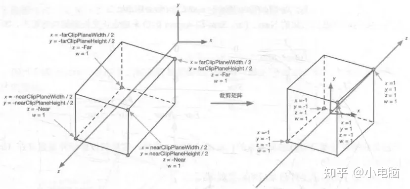
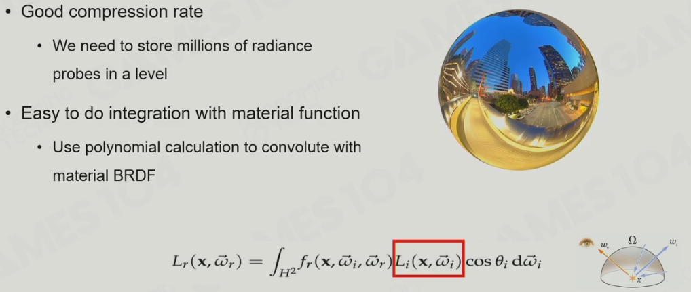
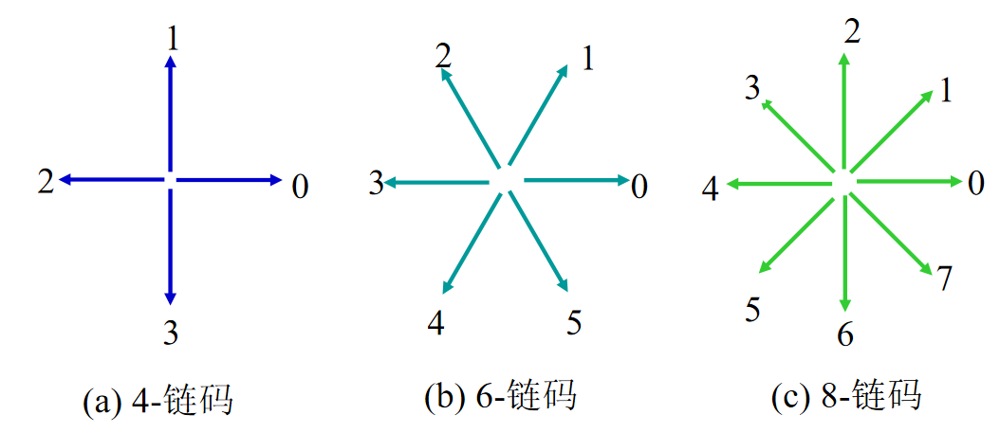
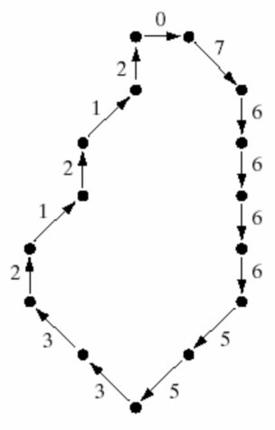
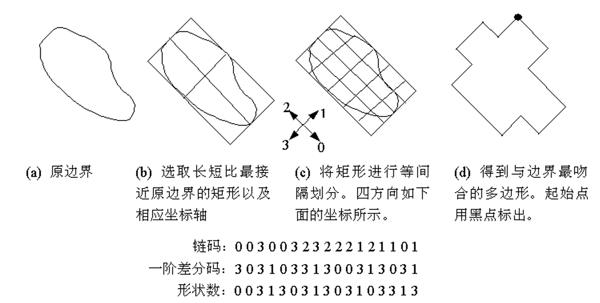

# GPU

- GPU和CPU运算不同步，即游戏逻辑和渲染不同步，所以如果游戏逻辑依赖于显卡数据，会出现延迟，尽量不要读取显卡数据，使数据单向传输
- GPU广泛存在着批处理。使用同样材质的游戏物体的一部分数据可以批量赋值，在同样材质的游戏物体中，具有同样submesh（submesh是什么？）的游戏物体还可以进一步批量绘制
- GPU与CPU的主要区别是，包含大量运算单元，高度支持**单指令多数据集(SIMD)**
  - 同种类型，参数不同的指令可以并发执行
  - 分支和循环指令会拖慢GPU

# 辐射度量学

## 基本公式

注：下表中，”辐射“均可以替换为”光“/”光照“

| 符号   | 英文               | 中文      | 含义                                   | 单位    |
| ------ | ------------------ | --------- | -------------------------------------- | ------- |
| $\Phi$ |                    | 辐射通量  | 单位时间内释放、反射、投射或吸收的能量 | $W$     |
| $I$    | Radiant Intensity  | 辐射强度  | 单位立体角内的辐射通量                 | $W$     |
| $E$    | Irradiance         | 辐照度    | 单位面积内的辐射通量                   | $W/m^2$ |
| $L$    | Radiance/Luminance | 辐射,亮度 | 单位面积、单位立体角内的辐射通量       | $W/m^2$ |

- 从某个方向观察某一点时，无数光线照射在该点，产生反射，其中一道反射光线进入人眼，决定了人眼看该点的颜色；所以，亮度是从某个方向观察某一点时看到的颜色的直接决定因素

$$
\omega = \frac{A}{r^2} \quad \omega:立体角(无量纲,整个球面的立体角为4\pi;r=1m,A=1m^2时,\omega=1) \hfill \\
$$

$$
\mathrm d\omega = \frac{r \sin \theta \cdot \mathrm d\phi \cdot r \mathrm d\theta }{r^2} = \sin \theta \mathrm d\theta \mathrm d\phi \hfill \\
$$

$$
\mathrm dL = \frac{\mathrm dI}{\mathrm dA_{\bot} } = \frac{\mathrm d\frac{\mathrm d\Phi}{\mathrm dA}}{\mathrm d\omega \cos \theta} \quad \mathrm dE = L \cos \theta \mathrm d\omega \quad E = \int_{H^2} L\cos \theta \mathrm d\omega \hfill \\
$$

## 渲染方程

$$
L(\mathbf p,\mathbf v) = L_e(\mathbf p,\mathbf v) +L_r(\mathbf p,\mathbf v) \hfill \\
其中L_i(\mathbf p,\mathbf l)=L_o(r(\mathbf p,\mathbf l),-\mathbf l) \quad L_r(\mathbf p,\mathbf v)= \iint_\Omega L_i(\mathbf p,\mathbf l) \ \mathbf l \cdot \mathbf n \ f(\mathbf p,\mathbf l,\mathbf v,\mathbf n) \mathrm d\mathbf l \hfill \\
L_e(\mathbf p,\mathbf v):从\mathbf p沿\mathbf v方向的自发光亮度 \hfill \\
\Omega:半球面(故\mathbf l \cdot \mathbf n \ge 0) \hfill \\
L_i(\mathbf p,\mathbf l) :\mathbf 沿-\mathbf l射到\mathbf p的光线的亮度(注意:\mathbf l的方向是从被观察点指向光源或反射源) \hfill \\
L_o(r(\mathbf p,\mathbf l),-\mathbf l):从光源或前一个反射点射向当前被观察点的光线的亮度 \hfill \\
f(\mathbf p,\mathbf l,\mathbf v,\mathbf n):\mathbf p处的双向反射分布函数(\mathbf{BRDF}) \hfill \\
$$

### 直接求解

$$
L_r(\mathbf p,\mathbf v) 
=\iint_\Omega L_i(\mathbf p,\mathbf l) \ \mathbf l \cdot \mathbf n \ f(\mathbf p,\mathbf l,\mathbf v,\mathbf n) \mathrm d\mathbf l \hfill \\
=\int_0^{2\pi} \mathrm d \theta \int_0^\frac{\pi}{2} L_i(\mathbf p,\mathbf l) \ \mathbf l \cdot \mathbf nf(\mathbf p,\mathbf l,\mathbf v,\mathbf n)\sin \phi \mathrm d\phi \hfill \\
其中,\mathbf l=\{\cos \theta\sin \phi,\sin \theta \sin \phi,\cos \phi\} \hfill \\
$$

- 渲染方程是**二重积分**（渲染方程的常规写法看起来是第二型曲面积分，但实际上是不符合数学的写法）

# 几何

## 变换

## 几何体表示

### 直线

#### 数值微分法(Digital Differential Analyzer)

#### Bresenham算法

### 区域

#### X-扫描线算法

#### 边标志算法

#### 种子填充算法

### 实体

#### 多边形网格

#### CSG树

#### 空间划分表示

#### 过程生成

## 裁剪

#### Cohen-Sutherland线裁剪算法

- 要保留的区域有四条边，将其延长为直线，将空间划分为9个区域
- 对于每一个点，分配一个**区域码(4bit)**。4位分别表示，该点是否位于**l1上侧/l2下侧/l3右侧/l4左侧**
- 算法过程：
  1. 输入线段两个端点的位置，计算两个端点的区域码
  2. 两个区域码进行**按位与**，若结果不是**0000**，舍弃线段，结束
  3. 若两点均为0000，保留线段，结束
  4. 对于不为0000的一点，找到**最低位的**1，将**该位对应的直**线与线段求交，用交点代替原本的点，回到2
- 两点区域码的值并不完全决定算法的结果，如区域码分别为0101和1000时，线段仍可能完全位于裁剪窗口外

#### LiangBarskey裁剪算法

$$
l:\mathbf r = \mathbf r_0 + u\mathbf (\mathbf r_1 -\mathbf r_0) \hfill \\
\mathbf r_0,\mathbf r_1:线段两个端点的坐标
$$

- 要保留的区域有四条边，将其延长为直线，将待裁剪线段用参数方程表示，其端点分别对应$u=0,u=1$处
- 算法过程：
  1. 输入线段两个端点的位置，确定参数方程
  2. 求出带裁剪线段延长线与四条直线的四个交点，连同两个端点**分为出、入两组**
     - 入组：P1和P2中u较小的一个，与l1、l2的两个交点中$u$较小的一个，与l3、l4的两个交点中$u$较小的一个
     - 出组：P1和P2中u较大的一个，与l1、l2的两个交点中$u$较大的一个，与l3、l4的两个交点中$u$较大的一个
  3. 输出入组中$u$的最大值($u1$)、出组中$u$的最小值($u2$)，若$u1<u2$，则保留其对应的线段，否则不保留
- 如果进一步优化算法，可以提前判断两点是否均在裁剪窗口外，而不必计算四个交点

# 渲染

## 基本概念

- 管线(pipeline)：流程

- **片元(fragment)**：由图元生成的一格二维图像，包括颜色、深度

- 像素：最终显示在屏幕上的一格二维图像

- 纹理：一张正方形图片

- 纹素(texel)：纹理中的像素

- 纹理坐标：也叫UV坐标，表示纹理上的一点，范围为(0,0)->(1,1)

- 顶点数据：顶点局部坐标、顶点对应纹理坐标、顶点法线方向、顶点颜色
- 图元数据：点、线、三角面的数据，由顶点的索引表示

## 渲染管线

1. 应用阶段：
   1. 加载数据到显存：输入纹理、顶点、图元、光源、取景器等数据
   2. 设置渲染状态：确定每个网格调用哪些着色器，及一些其他设置
   3. 发出Draw Call
2. 几何阶段
   1. **顶点着色器(vertex shader)**：对顶点进行MVP变换（模型变换、视口变换，模型空间->世界空间->观察空间）
   2. 曲面细分(tessellation)着色器：可选的，用镶嵌化技术增加三角形面及顶点的数量，计算新顶点的各坐标
   3. 几何着色器(geometry shader)：可选的，对输入的图元进行变换、修改（以特殊的规律修改图元可实现特殊的效果）
   4. 投影：进行投影变换（观察空间->裁剪空间）和齐次除法（裁剪空间->NDC）
   5. 裁剪：根据NDC坐标，剔除屏幕外的图元，剔除不透明物体背面的图元
   6. 屏幕映射：进行视口变换（NDC->屏幕），计算图元的屏幕坐标
3. **光栅化(resterization)**阶段：
   1. 对纹理滤波（可选的）
   2. 片元着色器：以图元为单位，对于一个图元覆盖的每个片元，计算纹理颜色、光照、深度等
   3. 测试混合：每个像素包含若干片元，以像素为单位先后进行模板测试、深度测试、混合，得到最终显示在屏幕上的颜色
4. 像素后处理(pixel processing)阶段：可选的，如FXAA

## 应用阶段

### Draw Call

- Draw Call由CPU向GPU发出，每个/每批Draw Call指定了一个要渲染的对象列表
- 为了提高效率，CPU与GPU流水线式并行（渲染命令存在命令缓冲区中，Draw Call就是一种渲染命令），CPU不必等到GPU完成一个渲染命令才发送下一个渲染命令
- 为了进一步提高效率，应通过批处理（batch）尽量减少Draw Call的数量

## 顶点着色器

- 输入定点数据，对于每个顶点，调用一次顶点着色器

### 模型空间

- 以模型的指定点为原点，一般（模型的）前方为z轴，右方为x轴，上方为y轴
- 坐标有xyzw分量。为了进行变换运算，加入额外的w分量（表示坐标的向量，其w为1；表示矢量的向量，其w为0）

### 世界空间

$$
\mathbf{M}_{model} =
\begin{bmatrix}
1 & 0 & 0 & \mathbf{P}.x\\
0 & 1 & 0 & \mathbf{P}.y\\
0 & 0 & 1 & \mathbf{P}.z\\
0 & 0 & 0 & 1\\
\end{bmatrix}
\begin{bmatrix}
\mathbf{R} & 0\\
0 & 1\\
\end{bmatrix}
\begin{bmatrix}
\mathbf{S}.x & 0 & 0 & 0\\
0 & \mathbf{S}.y & 0 & 0\\
0 & 0 & \mathbf{S}.z & 0\\
0 & 0 & 0 & 1\\
\end{bmatrix}
\quad \mathbf{P}_{world}=\mathbf{M}_{model}\mathbf{P}_{model} \hfill \\
\mathbf{P}:物体坐标 \quad \mathbf{R}:3×3旋转矩阵 \quad \mathbf S:物体缩放 \hfill \\
$$

- 由引擎预设好的原点和xyz轴定义
- 通过引擎物体的transform来确定模型矩阵，模型坐标左乘模型矩阵得到世界坐标

### 观察空间

$$
\mathbf{M}_{view} =
\begin{bmatrix}
\mathbf{S}.x & 0 & 0 & 0\\
0 & \mathbf{S}.y & 0 & 0\\
0 & 0 & \mathbf{S}.z & 0\\
0 & 0 & 0 & 1\\
\end{bmatrix}
\begin{bmatrix}
\mathbf{R} & 0\\
0 & 1\\
\end{bmatrix}
\begin{bmatrix}
1 & 0 & 0 & \mathbf{P}.x\\
0 & 1 & 0 & \mathbf{P}.y\\
0 & 0 & 1 & \mathbf{P}.z\\
0 & 0 & 0 & 1\\
\end{bmatrix}
\quad \mathbf{P}_{view}=\mathbf{M}_{view}\mathbf{P}_{world}\\
\mathbf{P}:相机坐标 \quad \mathbf{R}:3×3旋转矩阵 \quad \mathbf S:相机缩放 \hfill \\
$$

- 以相机为原点，相机的**后方**为z轴正方向（所以视野内的物体，观察空间坐标均z分量为负数），右方为x轴，上方为y轴
- 通过相机的transform确定观察矩阵，世界坐标左乘观察矩阵得到观察空间坐标（矩阵可能因为坐标系的左右手系定义不同而不同）

### 裁剪空间

$$
透视投影:
\mathbf{M}_{frustum}=
\begin{bmatrix}
\frac{\cot\frac{FOV}{2}}{Aspect} & 0 & 0 & 0\\
0 & \cot\frac{FOV}{2} & 0 & 0\\
0 & 0 & -\frac{Far+Near}{Far-Near} & -\frac{2 \cdot Near \cdot Far}{Far-Near}\\
0 & 0 & -1 & 0\\
\end{bmatrix}
\quad \mathbf{P}_{clip} = \mathbf{M}_{frustum} \mathbf{P}_{view} \hfill \\
正交投影:
\mathbf{M}_{ortho}=
\begin{bmatrix}
\frac{1}{Aspect*Size} & 0 & 0 & 0\\
0 & \frac{1}{Size} & 0 & 0\\
0 & 0 & -\frac{Far+Near}{Far-Near} & -\frac{Far+Near}{Far-Near}\\
0 & 0 & 0 & 1\\
\end{bmatrix}
\quad \mathbf{P}_{clip} = \mathbf{M}_{ortho} \mathbf{P}_{view} \hfill \\
Aspect:相机宽高比 \quad Near:相机近平面距离 \quad Far:相机远平面距离 \quad FOV:视锥体角度 \quad Size:相机高度 \hfill \\
$$

- 对观察空间进行变换得到的空间（**z轴的方向和裁剪空间相反，且z轴方向上发生了缩放**）
  - 对于透视相机该变换满足：观察空间中的视野（平截头体）经变换在裁剪空间中变为另一个平截头体（如上图，Near和Far即事先设定的相机的拍摄范围）
  - 对于正交相机该变换满足：观察空间中的视野（长方体）经变换在裁剪空间中变为另一个长方体（如上图）
- 由相机的Near、Far、Size/FOV确定投影矩阵，观察空间坐标左乘投影矩阵得到裁剪空间坐标
- 裁剪空间的存在是为了便于判断物体是否需要被裁剪
- **坐标的w分量等于该点到相机的距离，可以用于判断点是否在相机范围内部**

## 屏幕投影

### 归一化设备坐标(NDC)

- 裁剪空间坐标的x,y,z,w均除以w得到NDC，所以必然是边长为2的立方体

### 裁剪

- 裁剪发生在NDC中
- 裁剪时，遍历mesh中的每个三角形，对每个三角形进行裁剪，得到若干个三角形

### 屏幕空间

- NDC投影到屏幕上得到的空间，仅有xy轴，大小等于屏幕分辨率
- **z和w分量与裁剪空间的z和w设为相同**，用于之后的计算

### 视口空间

- 屏幕坐标的xy分别除以分辨率得到，所以视口空间必然是边长为1的正方形
- 裁剪空间到视口空间的一系列变换称为**视口变换**

## 滤波

- 滤波是可选的，且有多种方式，用于不同的目的和不同的图像

- 平滑图像：均值滤波，中值滤波，高斯滤波，低通滤波
- 锐化图像：高通滤波

## 片元着色器

- 输入图元信息，遍历每个图元，对于每个图元在屏幕空间中包含的每个片元，调用片元着色器
- 通常，片元着色器被调用的次数远多于其他着色器

### 采样

- 采样时进行纹理映射，将一个片元的中心映射到纹理上一点，计算片元信息

- **超采样(SuperSampling)**：改在片元内多个点采样计算片元信息，结果取平均
- **多重采样(MultipleSampling)**：与超采样类似，对于每个片元，仅在一点进行完整采样，其他点只进行覆盖判断（最终颜色=采样颜色×覆盖率）
- 时间采样：采样点的位置随时间变化而变化，结果取加权平均（只有同一物体同一个区域对应的片元的多个采样结果才能平均）
- 重叠过取样
- 区域取样

#### 纹理映射

理想情况下，进行纹理映射时时，输入一个像素在纹理上对应的范围，该像素的颜色为该范围内纹素颜色的平均值

- **最近点(Nearest)**:取最近的纹素的颜色

- **双线性插值(Bilinear)**:取最近的四个纹素，求双线性插值

- **三线性插值(Trilinear)**:求出一个像素边长对应的纹理边长(算法如下图所示)，计算该边长属于哪两层**mipmap**之间，在那两层分别做双线性插值，对两个结果再做线性插值(根据边长更偏向于哪一层)

- **各向异性过滤（Anisotropic Filtering）:**类似三线性插值，会生成类似于mipmap的纹理（姑且叫**各向异性纹理**），在其中选择四个图进行双线性插值，然后将四个值再进行一次插值

- **mipmap：**原图的边长为2^n，生成边长2^i（0<=i<=n-1)的所有贴图。占用显存变为133%

- **各向异性纹理：**原图的边长为2^n，生成长、宽分别为2^i（n-k<=i<=n-1)、2^J（n-k<=j<=n-1)的所有贴图，2^（k-1）为**各向异性倍率**（1x，2x，4x……）。倍率趋于正无穷时，占用显存变为400%（开1x时，占用显存变为225%）

- **摩尔纹**：对细致而有规律（如织物，液晶屏）的图案采样，原图空间频率大体是采样空间频率的几倍时，原图的像素被有规律地忽略，形成新的纹路

### 着色方式

- **Flat Shading：**每个面计算一次光照（任意两边的叉积），该面的所有片元使用同一个光照

- **Gouraud Shading：**每个顶点计算一次光照，每个片元的光照由其所在的面的顶点的光照插值得出（顶点与面内的点的光照未必符合插值的规律，所以通过这种方法计算出的亮度是不合理的）

- **Phong Shading：**每个片元计算一次光照（每个片元所在位置的发现可能是由插值计算出的，但即使这样结果依然与Gouraud Shading不同）

#### 切线空间

- 由表面位置和方向确定的空间（坐标系），随表面旋转而改变

#### 法线贴图

- 直接规定每个纹素的法线，不再通过顶点插值计算，而是直接查询（仍然可使用双线性插值等）。法线是三维方向向量，正好可以用RGB记录，所以可以记录在一张图片中，故称为法线贴图

#### 位移贴图

- 直接规定每个纹素相对于模型的位移量。仅影响渲染，不影响模型乃至物理系统

### 光照

#### Blinn-Phong模型

- 将光照分为环境光、漫反射光、高光。用来计算漫反射和高光，不包括环境光的计算
- 难以表现出各种不同的材质，塑料感强
- 现实中，物体在不同波长下的反射率不同，即$k_d$随波长改变，但游戏引擎简化了这一机制

$$
\mathbf l, \mathbf n, \mathbf v均为单位向量 \hfill \\
L(光照) = L_a(环境光)+L_d(漫反射)+L_s(高光) \hfill \\
L_d = k_d L_i \cos\theta \quad \cos\theta = \mathbf l \cdot \mathbf n \hfill \\
L_i:入射光亮度 \hfill \\
L_s = k_s  L_i \cos^p\alpha \quad \cos \alpha = \mathbf l \cdot \mathbf h \hfill \\
\mathbf h =\frac{ \mathbf l + \mathbf v}{|\mathbf l+\mathbf v|} \quad p:p越大,高光越集中 \hfill \\ 
对应到渲染方程中,f(\mathbf v,\mathbf l) = k_d + k_s \ \frac{\mathbf l \cdot (\mathbf l + \mathbf v)}{\mathbf l \cdot \mathbf n} \hfill \\
$$

#### Macrofacet模型

- 也将光照分为环境光、漫反射光、高光。用来计算漫反射和高光，不包括环境光的计算
- 能比较好地表现各种材质

物体的表面从微观的角度看，是凹凸不平的。该模型认为，物体表面的法线越趋近于同一个方向，看起来越光滑；法线越分散，看起来越粗糙
$$
L_d = k_d L_i \cos \theta \hfill \\
L_s = k_s L_i \cos \theta \frac{DFG}{4 \ (\mathbf l \cdot \mathbf n)(\mathbf v \cdot \mathbf n)} \hfill \\
D = \frac{\alpha^2}{\pi((\mathbf n \cdot \mathbf h)^2(\alpha^2-1)+1)^2} \hfill \\
F = F_0 + (1-F_0)(1 - (\mathbf v \cdot \mathbf h))^5 \hfill \\
G = g(\mathbf l)g(\mathbf v) \quad g(\mathbf x) = \frac{\mathbf n \cdot \mathbf x}{(1-k)\mathbf n \cdot \mathbf x + k} \quad k = \frac{(\alpha + 1)^2}{8} \hfill \\
D:描述法线的分散程度,越小高光越集中 \quad
F:描述菲涅尔现象的强度 \quad \hfill \\
G:描述光在物体凹凸不平的表面上反射时被吸收的量,越大越暗 \quad
\alpha:表面的粗糙度,无量纲,范围0-1 \quad \hfill \\
F_0:菲涅尔反射率,金属较高,非金属较低,介于两者之间的值看起来不真实(半导体也介于其中) \hfill \\
$$

#### PBR材质

PBR材质基于Macrofacet模型。物体表面上的每个点都有各自的材质，所以适合用图来表达。需要三张图，分别表示D（RGB图）、F（RGB图）、G（灰度图）

- Diffuse图：RGB，因为对不同波长的光的吸收/反射不同
- Spectacular图：RGB，因为对不同波长的光的吸收/反射不同
- Glossiness：灰度，因为这里的吸收指的是几何意义上的光无法射出，仅仅和表面的粗糙度有关，只需要规定alpha值一格参数

#### Metalic PBR 

PBR中最容易出现问题的是Spectacular图。Metalic PBR对PBR进行了简化和包装

- Base Color图：RGB，单纯表示颜色
- Roughness图：灰度，表示粗糙程度
- Metalic图：灰度，表示金属度
- 自发光图（可选）：灰度，仅影响物体本身的外观，不被看作光源

#### NPR

- 非真实渲染，以卡通渲染为例，显著的特点是连续的大色块

#### 全局光照

##### Light Probe

不考虑场景的变化，在场景中的某个位置放置一个“球”（就是Probe），该球会记录各个方向的光照（包括颜色）。只使用一个probe时，计算物体表面某点的光照时，访问probe，遍历半球面内所有的光线并积分；使用多个probe时，访问附近的几个probe，进行相同的运算并求插值。Light Probe的精度通常不高，很难实现精细的光照

##### 球谐函数

用于计算球面上的积分的工具

### 阴影

#### Shadow Map

- **对于每个光源，分配一个长方形网格（就像屏幕空间），对着该网格”拍摄“一个区域**，对于每一格，从光源发出一条射线，记录该射线射中的第一点到光源的距离，可以用一张灰度图来记录，即Shadow Map
- 运行时，每帧都生产若干Shadow Map（可能因为多级阴影生产多个不同精度的Shadow Map）
- **每个片元，对每个光源计算一次光照**，根据各个光源的ShadowMap来判断是否直射。具体来说，计算该片元到光源的距离，并将其映射到Shadow Map上的一格，与Shadow Map比对得出是否被光源直射。对于上图，P1无阴影，P2有阴影但是被剔除，P3有阴影
- 表面有凹凸的情况很常见，但屏幕空间和Shadow Map精度有限，采样率不同，位置角度不同，导致同一个位置在屏幕空间和Shadow Map的位置不同，错误地产生阴影（如某片元到光源的距离稍小于Shadow Map，但二者实际上是同一个位置）。为此，算出片元到光源的距离后，应当将其适当减小，这被称为**阴影偏移(Shadow Bias)**
- 由于计算的近似性，Shadow Map仅适用于以漫反射为主的材质（亮度平滑变化的材质）

#### Cascade Shadow

- 将光源照射区域按照到相机的距离分为几个阶段，每个阶段内的光源，采用不同的Shadow Map精度
- 每个阶段分别进行裁剪
- 开销较大

#### VSSM

#### PCF

- 利用Shadow Mapping能够计算某光源在某片元的光照是否被遮挡，计算的结果只有被遮挡、不被遮挡两种，因此阴影很“硬”
- PCF是**对遮蔽计算的结果进行滤波**（最简单的是均值滤波），使阴影“软化”
- 现实中，通常离光源越远的位置，阴影越“软”，为此，可以**在更远的位置使用更大的卷积核**，以取得更明显的滤波效果，这种做法被称为PCSS

### 通道

渲染时会向多种缓存（透明度、颜色、深度、游戏物体的标识符（可选的）等）中写入数据，计算一种数据的过程称为一个通道

### 测试混合

- **深度：到相机的距离（正数，负数表示在相机背后）**

- **在此阶段前，同一个位置上有多个片元；此阶段将多个片元混合，且各种缓冲在每个位置上都只有一份，在同一个位置渲染的多个片元混合起来后被视为一个等效的片元**

- **通常情况下，先后进行模板测试、深度测试、混合**

#### 缓冲

*透明度缓冲和模板缓冲是可选的*

- 深度缓冲：每个像素上，所有已渲染的像素里最浅的深度

- 颜色缓冲：每个像素上，所有已渲染像素混合后的结果

- 透明度缓冲：每个像素上，所有已渲染像素混合后的透明度

- 模板（stencil）缓冲：用途很多，其中一个是控制一个图形的渲染区域

- 包含模板缓冲的深度缓冲被称为depth-stencil buffer

#### 模板测试

- 如果开启了模板测试，比较当前片元参考值和模板缓冲中的模板值，如果不通过则舍弃片元，通过则更新模板缓冲

#### 深度测试

- 如果开启了深度测试，比较当前片元和深度缓冲中的深度，如果不通过则舍弃片元，通过则更新深度缓冲

#### 混合

- 最常见的混合方式是 新背景色 = alpha × 前景色 + （1 - alpha）× 背景色

#### 渲染大量透明物体

- 透明物体意味着背后的面无法剔除，意味着overdraw，为了避免渲染大量透明物体（如云雾）开销过大，可以将透明物体单独取出来，渲染到分辨率更低的缓冲上；即透明物体和不透明物体有各自的一套缓冲区，将两者的颜色缓冲依据深度缓冲按特定规则混合

## 后处理

### Ambient Occlusion

- 粗略地计算物体间相互遮蔽导致的光照减弱
- 在屏幕空间进行，得到的渲染结果中，保留了每个像素的深度，通过每个像素的深度，可以还原出一幅**立体图**（就像用许多小立方体堆起来的积木。实际上不会真的还原，只是用高度图表示）。不考虑光照方向，假设**立体图**的光从各个方向（半球面）均匀地照射

#### SSAO+

1. 输入一个像素
2. 在立体图中找到该像素对应的点，在以该点为圆心的半球面取若干采样点，计算它们位于“积木”的内部还是外部
3. 原像素的亮度调整为原本的一定比例，比例等于在“积木”外部的点的比例

#### HBAO

- 以某种方法粗略地计算半球面射入的光被周围的“积木”遮住的比例

### FXAA

- 通过某种方法在渲染结果中找到“锯齿”，并去除（颜色渐变）

### Tone Mapping

- 两个自然光的亮度是线性叠加的，但亮度与人感知到的颜色（最终渲染到屏幕上的颜色）不是线性关系
- 亮度在线性空间中混合，混合完毕后进行Gamma校正

| 亮度空间 | 最大亮度 | 亮度与颜色         |
| -------- | -------- | ------------------ |
| LDR      | 1        | 由Gamma校正调节    |
| SDR      | 略大于1  | 同上               |
| HDR      | 不限制   | 由Tone Mapping调节 |

## 地形渲染

### Height Map

#### 原理

- 记录大量均匀分布（俯视角下均匀）的顶点的高度，通过它生成mesh

#### 数据结构

- 巨大的地图被分成若干大小相同的block，每个block通常采用四叉树的结构存储。block中还包含纹理、法线贴图等数据

#### 剔除

- 巨大的地形必然需要剔除和动态加载，地形以block形式存储，只需要以block为单位剔除即可

#### LOD

- 理论上，一块地形**在屏幕空间的大小**决定了LOD精度更合理（而不是由到相机的距离决定）。如望远镜，原理是让相机的FOV变窄，使屏幕中的物体变大，但到相机的距离没有变

- 主流的实现方法是，游戏运行时，由GPU根据精度动态地细分mesh

### 纹理混合

- 纹理混合常见于地形渲染中（如过渡区域）。对于两个纹理重合的区域，直接将颜色混合效果很不真实。如果使用heightmap，正确的方法是，**只渲染每个位置上高度较高的纹理**。过渡区域可以**依据权重调节高度**，以实现平滑的过渡

### 虚拟纹理

- 类似虚拟内存，很适合用于分块加载的地形

# 数字图像

## 概念

- 图像：二维函数f(x,y)（返回值类型因图像不同有多种可能）

- 数字图像：参数、返回值均离散的图像

- 空间分辨率：图像最小可辨细节的测度
- 采样分辨率：图像的最小采样间隔
- 灰度分辨率：图像灰度级中可分辨的最小变化
- 灰度级：数字图像灰度(离散的)的可能取值的个数，通常为2的正整数次幂
  - k比特图像：灰度级为2^k的图像
- 动态范围：统计图像中所有像素的灰度，其中最小最大灰度构成的范围即动态范围

## 颜色

*上图中，两种不同的SPD对应同一种颜色（白色）*

- 颜色取决于光的**SPD(光谱功率分布)**，并且SPD与颜色之间不是单射
- 光线的SPD和物体的吸收率、反射率等性质共同决定反射光线的颜色
- 游戏引擎中，物体有颜色、金属度等参数，光源有颜色、亮度等参数，并通过这些参数计算最终显示的颜色，但这并不能反映真实的光吸收、反射的物理规律

### 人眼成像

- 人眼中，一般有三种视锥细胞(S-Cone,M-Cone,L-Cone)，它们对不同波长的光敏感度不同，三种细胞感应到的强度(通过对波长的积分得出S,M,L)决定了人感知的颜色

### 饱和度

- 0饱和度为白色，满饱和度为原色

- 0亮度为黑色，随亮度增大不断趋向白色

### 颜色混合

- 多色光混合得到白光。物质反射而不吸收什么颜色的光，就呈现什么颜色。颜料混合后吸收所有颜色的光，呈黑色

### 安全色

- 在任何计算机上都可以正确显示的颜色，在R、G、B分量上六等分，共216种颜色

### 颜色空间

- 颜色空间是在计算机中表示颜色的方式，坐标与颜色构成单射

#### RGB空间

$$
R=\int_{380}^{780}s(\lambda)r(\lambda) \mathrm d \lambda \quad 
G=\int_{380}^{780}s(\lambda)g(\lambda) \mathrm d \lambda \quad 
B=\int_{380}^{780}s(\lambda)b(\lambda) \mathrm d \lambda \quad
$$

- 定义三原色光，给定一个颜色，将其SPD分别与三原色光的SPD作加权积分，得到的三个结果即RGB（可能还需要规范化）

- 三原色光现实中不存在（因为有负功率）；对于某些波长的可见光，RGB中的某个分量可能小于0

$$
简单公式:Gray = (R+G+B)/3 \hfill \\
经验公式:Gray = 0.299R + 0.857G + 0.114B \hfill \\
$$

#### XYZ空间

$$
X=\int_{380}^{780}s(\lambda)\overline{x}(\lambda) \mathrm d \lambda \quad Y=\int_{380}^{780}s(\lambda)\overline{y}(\lambda) \mathrm d \lambda \quad 
Z=\int_{380}^{780}s(\lambda)\overline{z}(\lambda) \mathrm d \lambda \quad
\\
\begin{bmatrix}
X \\ Y \\ Z \\
\end{bmatrix}
=
\begin{bmatrix}
2.769 & 1.752 & 1.130 \\
1 & 4.591 & 0.060 \\
0 & 0.056 & 5.594 \\
\end{bmatrix}
\begin{bmatrix}
R \\ G \\ B \\
\end{bmatrix}
$$

- 定义三原色光，给定一个颜色，将其SPD分别与三原色光的SPD作加权积分，得到的三个结果即XYZ
- 不包含负功率、负系数（实际上，如果允许负系数，颜色范围更大，但不需要表示更大范围的颜色）
- XYZ和RGB可以相互用对方的线性组合表示

- (X,Y,Z)是三维空间中的坐标，取X+Y+Z=1，然后将该平面投影到XY平面，即得到**CIE色度图**（图中并不包含所有颜色；所有颜色的“数量级”是三维的，而平面是二维的，只包含某些特定“亮度”的颜色）
  - sRGB中，R,G,B的取值范围均为(0,1)，故无法表示所有可见光
  - Adobe RGB中，R,G,B的取值范围仍为(0,1)，但对三原色的SPD进行调整，与RGB空间的不同

#### CMY空间

- 便于计算自然光照射下，颜料混合的效果

$$
(C,M,Y) = (1,1,1) - (R,G,B) \hfill \\
C:青色 \quad M:深红色 \quad Y:黄色 \hfill \\
$$

#### CMYK空间

- 黑色颜料成本最低，尽量使用黑色颜料代替部分其他颜料

$$
(C_0,M_0,Y_0) = (1,1,1) - (R,G,B) \hfill \\
K = \min\{C_0,M_0,Y_0\} \hfill \\
C = \frac{C_0-K}{1-K} \quad M = \frac{M_0-K}{1-K} \quad Y = \frac{Y_0-K}{1-K} \hfill \\
$$

#### HSI空间

- 体现光的物理特性， 某些运算在HSI空间上执行能得到更好的结果

$$
H = 
\begin{cases}
\theta \quad \quad \quad \quad ,B \leq G \\
360° - \theta \quad ,B>G
\end{cases} 
\quad \theta = \arccos{\frac{\frac{1}{2}[(R-G)+(R-B)]}{[(R-G)^2+(R-B)(G-B)]^{1/2}}} \hfill \\
S = 1 - 3\frac{\mathrm{min}\{R,G,B\}}{R+G+B} \quad
I = \frac{R+G+B}{3} \hfill \\
H:色调 \quad S:饱和度 \quad I:亮度 \hfill \\
$$

## 图像处理

- 点运算：对每个像素施加同样的运算
- 代数运算：两个图像点对点运算
- 几何运算：涉及像素空间位置的运算
- 灰度运算：将一系列灰度映射到另一系列灰度上的运算

### 直方图处理

#### 概念

- 灰度直方图：统计每一灰度的像素数量的直方图
- 累积直方图：统计小于等于每一灰度的像素数量的直方图
- 直方图规定化：构造一组灰度到灰度的映射，对原直方图应用映射，使之接近期望的形状
  - 直方图均衡化：映射函数是增函数的前提下，使图像直方图尽量均衡

### 线性系统

- 线性系统：各个输入信号的加权和的响应等于各个输入信号响应的加权和
- 线性移不变系统：如果输入序列进行移位，则输出序列进行相应的移位

$$
对于线性系统T:T[x_1]+T[x_2] = T[x_1+x_2] \quad T[ax_1+bx_2] = aT[x_1] + bT[x_2] \hfill \\
对于线性移不变系统T:y(i,j) = T[x(i,j)] \Rightarrow y(i-m.j-n) = T[x(i-m,j-n)] \hfill \\
$$

#### 卷积

$$
g(t) = h * f = \int_{-\infin}^{\infin}h(t-\tau)f(\tau)\mathrm d \tau \hfill \\
g(x,y) = h * f = \int_{-\infin}^{\infin} \int_{-\infin}^{\infin} h(x-u,y-v)f(u,v) \mathrm d u \mathrm d v \hfill \\
$$

### 空间域滤波

- 均值滤波：对于每个待处理的像素，规定一个模板，用该像素及周围周围像素的颜色的加权平均代替该像素的颜色，模板规定了周围像素的区域，以及每个像素的权值
- 中值滤波：对于每个待处理的像素，规定一个模板，用该像素及周围周围像素的中位数代替该像素的颜色，模板规定了像素的区域
- 自适应滤波：？
- 改进的α均值滤波：？
- 微分锐化
  - Roberts锐化算法：对原图像应用两个模板，两个结果的和为锐化结果
  - Sobel锐化算法：对原图像应用两个模板，两个结果的平方和的平方根为结果
  - Priwitt锐化算法：过程同上

### 频率域滤波

#### 二维傅里叶变换

- 将图像函数拆分成无数二维正弦波（见下图）的组合，二维正弦波除了具有频率、幅度、相位，还具有方向
- 相位谱：输入频率和方向，返回相位
- 振幅谱：输入频率和方向，返回振幅
- 用图像表示F(u,v)，**越靠近中心，低频信号占比越高**

$$
二维离散傅里叶变换: F(u,v) = \sum_{x=0}^{M-1} \sum_{y=0}^{N-1} f(x,y) e^{-2j\pi(\frac{ux}{M} + \frac{vy}{N})}\hfill \\
逆变换:f(x,y) = \frac{1}{MN} \sum_{u=0}^{M-1} \sum_{v=0}^{N-1} F(u,v) e^{2j\pi(\frac{ux}{M} +\frac{vy}{N})}\hfill \\
谱:|F(u,v)| = \sqrt{R(u,v)^2+I(u,v)^2} \hfill \\
频率:w = \sqrt{u^2+v^2} \quad 方向:\mathbf v = (u,v) \hfill \\
相位谱:\phi(u,v) = \arctan[\frac{I(u,v)}{R(u,v)}] \hfill \\
功率谱:P(u,v) = |F(u,v)|^2 \hfill \\
$$

#### 步骤

1. 预处理图像
2. 进行二维离散傅里叶变换
3. 变换得到的函数乘上过滤器函数
4. 进行二维离散逆傅里叶变换
5. 后处理

#### 低通滤波(Low-pass Filter)

$$
ILPF:H(u,v) =
\begin{cases}
1,w \le w_0 \\
0,w \gt w_0 \\
\end{cases} \hfill \\
BLPF:H(u,v) = \frac{1}{1+(w/w_0)^{2n}} \quad n \rightarrow \infin时,BLPF \Leftrightarrow ILPF \hfill \\
ELPF:H(u,v) =  (\frac{e}{\sqrt{2}})^{(\frac{w}{w_0})^n} \hfill \\
TLPF:H(u,v) = 
\begin{cases}
1,w \lt w_0 \\
\frac{w-w_1}{w_0-w_1},w_0 \le w \le w_1 \\
0,w \gt w_1 \\
\end{cases} \hfill \\
$$

#### 高通滤波(High-pass Filter)

$$
IHPF:H(u,v) =
\begin{cases}
0,w \le w_0 \\
1,w \gt w_0 \\
\end{cases} \hfill \\
BHPF:H(u,v) = \frac{1}{1+(\sqrt{2}-1)(w_0/w)^{2n}} \quad n \rightarrow \infin时,BHPF \Leftrightarrow IHPF \\
EHPF:H(u,v) =  (\frac{1}{e})^{(\frac{w_0}{w})^n} \hfill \\
THPF:H(u,v) = 
\begin{cases}
0,w \lt w_1 \\
\frac{w-w_1}{w_0-w_1},w_1 \le w \le w_0 \\
1,w \gt w_0 \\
\end{cases} \hfill \\
$$

### 图像退化与复原

#### 噪声

- 统计各噪点的灰度，可以得到噪点在灰度上的概率密度函数，进而对噪声分类
- 高斯噪声：（灰度图上，下同）柱状区向两侧扩散，形状类似高斯分布函数
- 瑞利噪声：柱状区向两侧扩散，相比高斯噪声，左侧更高更窄
- 伽马噪声：柱状区向两侧扩散，相比瑞利噪声，左侧更高更窄
- 指数噪声：柱状区向右扩散，形状类似指数函数
- 均匀噪声：柱状区向两侧扩散，顶部凹凸不平
- 椒盐噪声：多出几个凸起的柱状区

#### 空间滤波复原

- 算术均值滤波
- 几何均值滤波
- 谐波均值滤波
- 逆谐波均值滤波

#### 频率域滤波复原

- 陷波滤波

#### 运动模糊

- 多个时间的图像偏移、叠加而成
- 逆滤波
- 维纳滤波

### 形态学图像处理

- 膨胀：白色区域外扩
- 腐蚀：白色区域内缩
- 开运算：去除白点
- 闭运算：填充黑点
- 边缘提取：膨胀图像减腐蚀图像

### 图像分割

- 点检测：使用模板处理原图像，得到的矩阵中，绝对值大于阈值的像素为孤立点
- 线检测：与点检测类似，检测不同方向的线使用不同颜色的模板

- 边缘检测：利用函数的一、二阶导数。离散环境下，求函数的梯度/导数，简化为对矩阵应用模板
  - 梯度算子：分别对原图应用两个模板，将两个结果合成（Roberts算子为相加，Priwitt算子和Sobel算子为平方和的平方根），得到的即为边缘检测的结果。原理是两个一阶导数（方向导数）运算
  - 拉普拉斯算子：对原图应用一个模板，得到的即为边缘检测的结果。原理是二阶导数计算

- 门限值分割：以门限值为界，对图像二值化
  - 基本全局门限：对所有像素应用同一个门限值
  - 自动全局门限：设定一个初始门限值T和一个参数T0。用T分割图像，计算两个区域的平均灰度值u1,u2。T'=(u1+u2)/2，若|T'-T|<T0，使用T作为最终门限值，否则，，令T=T'重复上述过程
  - 自适应门限值：不再全局使用同一个门限值，而是对每个像素使用自适应的门限值。可以在周围区域内计算自动门限，也可以划分图片，在所属的区域内计算自动门限
- 区域分割与合并：如四叉树

### 图像表示与描述

- 链码：设定一些向量作为基向量，将图像边缘用基向量的连接来表示。因为是描述形状，所以形状（或者说链码的基底）可以任意旋转，得到的链码也可以“旋转”（**链码应当被看作环**）
- 形状数：使用原图形的包围盒求链码，使链码“最小”。逐个用链码的一位减下一位（**不够减补4/6/8，取决于使用的链码种类**），得到与链码等长的一阶差分码。”旋转“一阶差分码，使之表示的数最小（首位可以是0），即得到唯一的形状数

- 边界分段
- 多边形近似
- 标记图：相当于极坐标表示
