# GPU

- GPU和CPU运算不同步，即游戏逻辑和渲染不同步，所以如果游戏逻辑依赖于显卡数据，会出现延迟，尽量不要读取显卡数据，使数据单向传输
- GPU广泛存在着批处理。使用同样材质的游戏物体的一部分数据可以批量赋值，在同样材质的游戏物体中，具有同样submesh（submesh是什么？）的游戏物体还可以进一步批量绘制
- GPU与CPU的主要区别是，包含大量运算单元，高度支持**单指令多数据集(SIMD)**
  - 同种类型，参数不同的指令可以并发执行
  - 分支和循环指令会拖慢GPU

# 辐射度量学

## 基本公式

注：下表中，”辐射“均可以替换为”光“/”光照“

| 符号   | 英文               | 中文      | 含义                                   | 单位    |
| ------ | ------------------ | --------- | -------------------------------------- | ------- |
| $\Phi$ |                    | 辐射通量  | 单位时间内释放、反射、投射或吸收的能量 | $W$     |
| $I$    | Radiant Intensity  | 辐射强度  | 单位立体角内的辐射通量                 | $W$     |
| $E$    | Irradiance         | 辐照度    | 单位面积内的辐射通量                   | $W/m^2$ |
| $L$    | Radiance/Luminance | 辐射,亮度 | 单位面积、单位立体角内的辐射通量       | $W/m^2$ |

- 从某个方向观察某一点时，无数光线照射在该点，产生反射，其中一道反射光线进入人眼，决定了人眼看该点的颜色；所以，亮度是从某个方向观察某一点时看到的颜色的直接决定因素

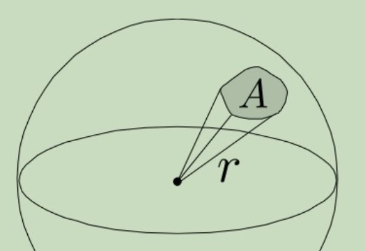
$$
\omega = \frac{A}{r^2} \quad \omega:立体角(无量纲,整个球面的立体角为4\pi;r=1m,A=1m^2时,\omega=1) \hfill \\
$$
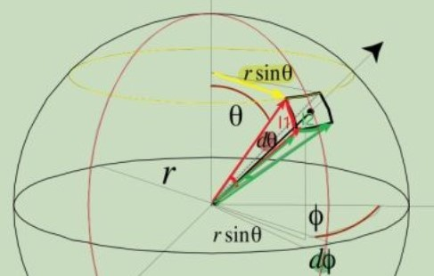
$$
\mathrm d\omega = \frac{r \sin \theta \cdot \mathrm d\phi \cdot r \mathrm d\theta }{r^2} = \sin \theta \mathrm d\theta \mathrm d\phi \hfill \\
$$

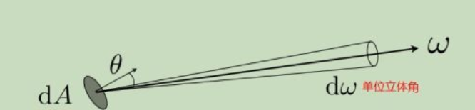
$$
\mathrm dL = \frac{\mathrm dI}{\mathrm dA_{\bot} } = \frac{\mathrm d\frac{\mathrm d\Phi}{\mathrm dA}}{\mathrm d\omega \cos \theta} \quad \mathrm dE = L \cos \theta \mathrm d\omega \quad E = \int_{H^2} L\cos \theta \mathrm d\omega \hfill \\
$$

## 渲染方程

$$
L_o(\mathbf p,\mathbf v) = L_e(\mathbf p,\mathbf v) +L_r(\mathbf p,\mathbf v) \hfill \\
L_r(\mathbf p,\mathbf v)= \iint_\Omega L_i(\mathbf p,\mathbf l) (\mathbf l \cdot \mathbf n) f(\mathbf p,\mathbf l,\mathbf v,\mathbf n) \mathrm d\mathbf l \hfill \\
注意到\mathbf l \cdot \mathbf n=\cos\langle \mathbf l,\mathbf n \rangle \quad (兰伯特余弦定理) \hfill \\
\\
\mathbf p:被观察点位置 \quad \mathbf v:由\mathbf p指向观察者位置的单位向量 \quad
\mathbf l:由\mathbf p指向光源(或反射源)的单位向量 \hfill \\
\mathbf n:\mathbf p处的单位法向量 \quad \Omega:以\mathbf p为中心,以\mathbf n为朝向的半球面(理论上总有\mathbf l \cdot \mathbf n \ge 0) \hfill \\
\\
L_o(\mathbf p,\mathbf v):从\mathbf p沿\mathbf v方向发出和反射光线的总亮度 \hfill \\
L_e(\mathbf p,\mathbf v):从\mathbf p沿\mathbf v方向的自发光亮度 \hfill \\
L_i(\mathbf p,\mathbf l) :\mathbf 沿-\mathbf l射到\mathbf p的光线的亮度\hfill \\
f(\mathbf p,\mathbf l,\mathbf v,\mathbf n):\mathbf p处的双向反射分布函数(\mathbf{BRDF}) \hfill \\
\\
直接求解:L_r(\mathbf p,\mathbf v) 
=\iint_\Omega L_i(\mathbf p,\mathbf l) (\mathbf l \cdot \mathbf n) f(\mathbf p,\mathbf l,\mathbf v,\mathbf n) \mathrm d\mathbf l \hfill \\
=\int_0^{2\pi} \mathrm d \theta \int_0^\frac{\pi}{2} L_i(\mathbf p,\mathbf l) \ \mathbf l \cdot \mathbf nf(\mathbf p,\mathbf l,\mathbf v,\mathbf n)\sin \phi \mathrm d\phi \hfill \\
其中,\mathbf l=\{\cos \theta\sin \phi,\sin \theta \sin \phi,\cos \phi\} \hfill \\
\\
对于均匀发光的点光源,L_i(\mathbf p,\mathbf l)=\frac{I}{r^2} \hfill \\
I:光源的辐射强度 \quad r:光源到\mathbf p的距离 \hfill \\
$$

- 渲染方程是**二重积分**

# 几何

## 向量与矩阵

$$
m\times n矩阵:\mathbf A=
\begin{bmatrix}
a_{11} & a_{12} & \cdots & a_{1n} \\
a_{21} & a_{22} & \cdots & a_{2n} \\
\vdots & \vdots & \ddots & \vdots \\
a_{m1} & a_{m2} & \cdots & a_{mn} \\
\end{bmatrix}
=[a_{ij}]_{m\times n}=
\begin{bmatrix}
\mathbf A^1 & \mathbf A^2 & \cdots & \mathbf A^n \\
\end{bmatrix}
=
\begin{bmatrix}
\mathbf A_1 \\ 
\mathbf A_2 \\ 
\cdots \\ 
\mathbf A_m \\
\end{bmatrix}
\hfill \\
\\
矩阵乘法:\mathbf A_{m\times p}+\mathbf B_{p\times n}=\mathbf C_{m\times n} \quad (\textbf{行m-列p-行p-列n}) \quad ,其中c_{ij}=\mathbf A_i \cdot \mathbf B^j \quad (点积)\hfill \\
\\
向量:\mathbf a=\begin{bmatrix} x_a \\ y_a \\ z_a \end{bmatrix},
\mathbf a^T=\begin{bmatrix} x_a & y_a & z_a \end{bmatrix}\hfill \\
点积:\mathbf a \cdot \mathbf b=\mathbf a^T\mathbf b=\Sigma a_ib_i \hfill \\
叉积:\mathbf a \times \mathbf b = 
\begin{bmatrix}
0 & -z_a & y_a \\
z_a & 0 & -x_a \\
-y_a & x_a & 0 \\
\end{bmatrix}
\begin{bmatrix}
x_b \\
y_b \\
z_b \\
\end{bmatrix}
=\begin{bmatrix}
y_az_b-y_bz_a \\
x_az_b-x_bz_a \\
x_ay_b-x_by_a \\
\end{bmatrix}
\hfill \\
投影:\mathbf a \bullet \mathbf b= \frac{\mathbf a\cdot\mathbf b}{|\mathbf b|} \frac{\mathbf b}{|\mathbf b|} \quad 若\mathbf b为单位向量,则\mathbf a \bullet \mathbf b=(\mathbf a \cdot \mathbf b)\mathbf b \hfill \\
长度:|\mathbf a|=\sqrt{\mathbf a \cdot \mathbf a} \hfill \\
夹角:\cos\langle\mathbf a,\mathbf b\rangle= \frac{\mathbf a \cdot \mathbf b}{|\mathbf a||\mathbf b|} \hfill \\
$$

## 四元数

$$
四元数:\mathbf q = q_0+\mathbf v_q =q_0+q_1\mathbf i+q_2\mathbf j+q_3\mathbf k(q_0,q_1,q_2,q_3为实数) \quad 共轭四元数:\mathbf q^* = q_0-\mathbf v_q \hfill \\
四元数的二范数:|\mathbf q|= (q_0^2+|\mathbf v_q|^2)^{\frac{1}{2}} = \sqrt{q^2_0+q_1^2+q_2^2+q_3^2}\hfill \\
\mathbf p \cdot \mathbf q= q_0p_0+q_1p_1+q_2p_2+q_3p_3 \quad (类似向量点乘) \hfill  \\
\mathbf p \times \mathbf q= \mathbf v_p \times \mathbf v_q = (p_2q_3-p_3q_2)\mathbf i+(p_3q_1-p_1q_3)\mathbf j+(p_1q_2-p_2q_1) \mathbf k \quad (类似向量叉乘) \hfill \\
\mathbf p \mathbf q = (p_0q_0 - \mathbf v_1 \cdot \mathbf v_2) +(p_0 \mathbf v_2 + q_0 \mathbf v_1 + \mathbf v_1 \times \mathbf v_2) \quad (默认乘法) \hfill \\
\mathbf q^{-1} =\frac{\mathbf q^*}{|\mathbf q|^2}, \mathbf q_1 \mathbf q_2 = \mathbf q_3 \Leftrightarrow \mathbf q_2 = \mathbf q_1^{-1} \mathbf q_3 \hfill \\
四元数表示旋转:\mathbf q = (\cos \frac{\theta}{2},\sin\frac{\theta}{2}\mathbf v_q) \quad 其中\theta为旋转角,\mathbf v的三个分量即表示转轴的(x,y,z).且满足|\mathbf q|=1 \hfill  \\
$$

- 四元数叉乘、默认乘法不满足交换律

## 变换

- **变换：函数，自变量和因变量均为n维向量**
- **线性变换：具有线性性质的变换（包括缩放、旋转、切变等；不包括平移）**
  - **线性变换和平移统称为仿射变换**

- **齐次坐标：用于表示n维向量及其各类变换的n+1维坐标**

$$
n维空间中有变换\mathbf A,若\forall向量 \mathbf a,\mathbf b,实数k,有:
\begin{cases}
\mathbf A(\mathbf a+\mathbf b)=\mathbf A(\mathbf a)+\mathbf A(\mathbf b) \\
\mathbf A(k\mathbf a)=k\mathbf A(\mathbf a) \\
\end{cases},
则\mathbf A为\textbf{线性变换} \hfill \\
n维空间中的线性变换总是可以表示为\mathbf b=\mathbf L_{n\times n}\mathbf a \hfill \\
一切仿射变换可以表示为\mathbf b=\mathbf L_{n\times n}\mathbf a+\mathbf t \hfill \\
引入齐次坐标后,\mathbf b=\mathbf L_{n\times n}\mathbf a+\mathbf t可以表示为\mathbf b'=\mathbf M_{(n+1)\times (n+1)}\mathbf a', 
其中\mathbf b'=\begin{bmatrix} \mathbf b \\ 1 \end{bmatrix},
\mathbf a'=\begin{bmatrix} \mathbf a \\ 1 \end{bmatrix},
\mathbf M=\begin{bmatrix}\mathbf L & \mathbf t \\ 0 & 1 \end{bmatrix} \hfill \\
$$

### 二维

$$
缩放(x,y)倍:
\mathbf L =
\begin{bmatrix}
x & 0 \\
0 & y \\
\end{bmatrix} \hfill \\
切变:
\mathbf L_x =
\begin{bmatrix}
1 & s \\
0 & 1 \\
\end{bmatrix},
\mathbf L_y =
\begin{bmatrix}
1 & 0 \\\
s & 1 \\
\end{bmatrix}
\hfill \\
绕原点逆时针旋转\theta:
\mathbf L =
\begin{bmatrix}
\cos \theta & -\sin \theta \\
\sin \theta & \cos \theta \\
\end{bmatrix} \hfill \\
$$

### 三维

- 规定$\mathbf i \times \mathbf j = -\mathbf k$（**左手系**，同Unity世界坐标系相同）；在此前提下，绕轴旋转均表示，从该轴的**负半轴看向正半轴**，在看到的平面内**逆时针旋转**

$$
缩放(x,y,z)倍:
\mathbf L =
\begin{bmatrix}
x & 0 & 0\\
0 & y & 0\\
0 & 0 & z\\
\end{bmatrix} \hfill \\
切变:
\mathbf L_{xy} =
\begin{bmatrix}
1 & 0 & 0 \\
0 & 1 & 0 \\
s & t & 1 \\
\end{bmatrix},
\mathbf L_{xz} =
\begin{bmatrix}
1 & 0 & 0 \\
s & 1 & t \\
0 & 0 & 1 \\
\end{bmatrix},
\mathbf L_{yz} =
\begin{bmatrix}
1 & s & t \\
0 & 1 & 0 \\
0 & 0 & 1 \\
\end{bmatrix}\hfill \\
绕坐标轴旋转\theta:
\mathbf L_x =
\begin{bmatrix}
1 & 0 & 0 \\
0 & \cos \theta & -\sin \theta \\
0 & \sin \theta & \cos \theta \\
\end{bmatrix},
\mathbf L_y =
\begin{bmatrix}
\cos \theta & 0 & \sin \theta \\
0 & 1 & 0 \\
-\sin \theta & 0 & \cos \theta \\
\end{bmatrix},
\mathbf L_z =
\begin{bmatrix}
\cos \theta & -\sin \theta & 0 \\
\sin \theta & \cos \theta & 0 \\
0 & 0 & 1 \\
\end{bmatrix}\hfill \\
绕单位向量\mathbf w=\begin{bmatrix} x \\ y \\z \end{bmatrix}旋转\theta:
\mathbf L=\mathbf I+\sin \theta \mathbf J+(1-\cos\theta)\mathbf J^2,其中
\mathbf J=
\begin{bmatrix}
0 & -z & y \\
z & 0 & -x \\
-y & x & 0 \\
\end{bmatrix}
\hfill \\
$$

### 有符号面积

$$
有符号面积:S1 = \frac{1}{2}(\mathbf {CP} \times\mathbf {BP}) \cdot \mathbf n 
\quad \mathbf n = \frac{\mathbf{CA} \times \mathbf{BA}}{|\mathbf{CA}| |\mathbf{BA}|} \hfill \\
P在三角形ABC内 \Leftrightarrow S1,S2,S3>0 \hfill \\
重心坐标:(\alpha,\beta,\gamma) = (\frac{S1}{S},\frac{S2}{S},\frac{S3}{S}) \Leftrightarrow \mathbf P = \alpha \mathbf A + \beta \mathbf B + \gamma \mathbf C  \hfill \\
$$

- 边的方向会影响法向量方向，因此计算有符号面积时点的顺序必须统一（如以上公式）

## 直线表示

### 数值微分法(Digital Differential Analyzer)

### Bresenham算法

## 曲线表示

### Bezier曲线

- 给定至少三个控制点，再给定参数t，可以确定曲线上的一个点；点足够多后，可以近似地绘制出曲线
- 曲线段的起点和终点必然是第一个和最后一个控制点

$$
B^n表示有n个点的点集,\mathbf b^n_i表示点集中的第i个点 \hfill \\
有函数F:B^{n-1}=F(B^n,t),其中\mathbf b^{n-1}_i=(1-t)\mathbf b^n_i+t\mathbf b^n_{i+1} \hfill \\
\Rightarrow B^0=F^n(B^n,t) \Rightarrow \mathbf b^0_0=\sum_{i=0}^n \mathbf b^n_i(1-t)^{n-i}t^i \quad (\mathbf b^0_0为最终要求的点) \hfill\\
$$

## 多边形表示

### X-扫描线算法

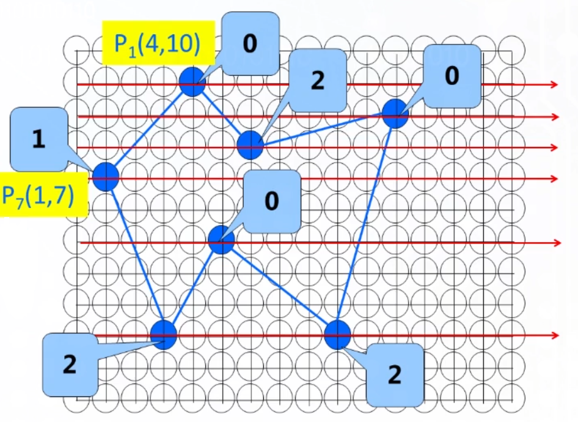

- 输入：用顶点序列表示的多边形，颜色缓冲
  - **顶点坐标必须是离散化的，否则无法解决误差问题**
  - **顶点序列必须表示正常的多边形，可以利用极角排序生成符合要求的顶点序列**
- 输出：修改颜色缓冲，将多边形内部的区域**填色**
- 算法步骤：
  1. 输入顶点序列，确定所有顶点的y的范围
  2. 对于范围内的每个y的值，用一条直线与多边形求交，得到若干个交点
     - 如果交点与顶点重合，则考虑该顶点的两条边，**边必须位于扫描线上方（不含平行）才会记为一个交点**（下闭上开）
     - 可以证明，每条扫描线与多边形的交点数必然是偶数
  3. 将交点按照某种方式排序，然后两两配对，每对交点之间的点便是需要填色的区域
     - 求出交点后，将其**离散化（必须统一采用四舍五入，而不是四舍六入五留双）**，确定区间；之后必须采用左闭右开或右闭左开的规则
- 主要开销来自求交和排序，需要使用**有向边，有向边表，活性边表**来加速
- 有向边：以y较小的端点为起点，y较大的端点为终点的边（**若某条边两端点的y值离散化后相等，直接忽略**）
  - x：表示与当前扫描线的交点的x分量；一开始设为起点的x分量，随扫描线上移而改变
  - yMax：终点的y分量离散化后**-1（-1实现上闭下开）**；扫描线**大于（-1则此处不取等）**此值后，将此有向边从活性边表中移除
  - deltaX：y增加1时x的改变量
- 有向边表：包含所有有向边的集合
  - 用散列或字典来存放所有有向边
- 活性边表：与当前扫描线有交点的有向边构成的集合
  - 扫描线上移的过程中，根据有向边的yMax和有向边表的索引不断更新活性边表；活性边表为空时，算法结束
  - **每当新的边加入表（已有边的顺序不会发生变化），按照各有向边当时的x排序，若x相同，则按照deltaX排序**
  - 每当更新交点后，直接按表中边的顺序两两配对交点

### 边标志算法

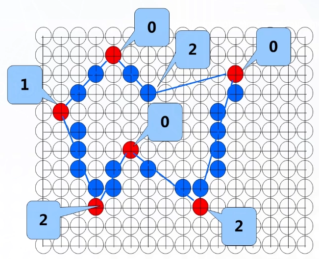

- 输入输出与X-扫描线算法相同
  
- 算法步骤：
  1.  输入顶点序列，确定包含所有顶点的AABB
  2. 对每条边进行扫描转换（**若某条边两端点的y值相等，直接忽略**），得到若干离散化的点，**以特殊颜色标记这些点**
     - 类似X扫描线算法，**每条边的终点被忽略**（下闭上开）
     - **离散化每条边时，每次令y+1然后计算x的值**，这和X扫描线算法类似，和一般的直线扫描转换不同
     - 扫描转换某条边得到某个离散化的点时，**如果该点已标记为特殊颜色，则重置为默认颜色**
  3. 从下往上遍历AABB的每一行，每一行内从左往右遍历每个像素，逐像素判断是否进行填色
     - 用一个bool变量表示当前点是否需要填色，一开始为false，向左遍历时，每当遇到特殊颜色的点，则取反
     - 保持true的点，以及由false变为true的点要填色，而由true变为false的点不填色（左闭右开）
     - 算法结束后，仍为特殊颜色的点重置为默认颜色 

## 实体表示

### 点云

- 用足够多的点直接记录物体表面的点的位置
- 数据结构简单，但需要的点的数量极多
- 常见于实体扫描的结果，之后通常转换成mesh再用于渲染

### 多边形网格

- 以若干多边形拼合来表示物体表面
- 最常见的表示方式，多边形网格中又以纯三角形网格最为常见
- 对于纯三角形面，使用一个顶点数组（各顶点位置），三角形数组（各顶点按怎样的顺序组成各个三角形面）即可表示

### CSG树

### 空间划分表示

### 过程生成

- 由函数描述生成几何体的过程
- 除了生成基本几何体的函数，更关键的是函数间的递归式调用

## 裁剪

- **输入带裁剪线段和裁剪窗口范围，输出裁剪后保留的线段**

### Cohen-Sutherland算法

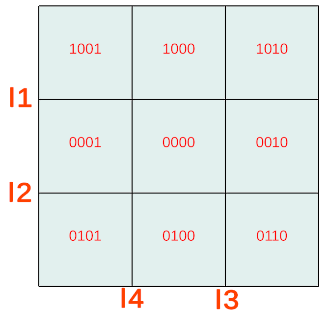

- 要保留的区域有四条边，将其延长为直线，将空间划分为9个区域
- 对于每一个点，分配一个**区域码(4bit)**。4位分别表示，该点是否位于**l1上侧/l2下侧/l3右侧/l4左侧**
- 算法过程：
  1. 输入线段两个端点的位置，计算两个端点的区域码
  2. 两个区域码进行**按位与**，若结果不是**0000**，舍弃线段，结束
  3. 若两点均为0000，保留线段，结束
  4. 对于不为0000的一点，找到**最低位的**1，将**该位对应的直线**与线段求交，用交点代替原本的点，回到2
- 区域码的初始值并不完全决定算法的结果，如区域码分别为0101和1000时，无法确定线段是否完全位于裁剪窗口外

### LiangBarskey算法

$$
l:\mathbf r = \mathbf r_0 + u\mathbf (\mathbf r_1 -\mathbf r_0) \hfill \\
\mathbf r_0,\mathbf r_1:线段两个端点的坐标
$$

- 要保留的区域有四条边，将其延长为直线，将待裁剪线段用参数方程表示（因此是**有向的**），其端点分别对应$u=0,u=1$处
- 根据带裁剪线段的**方向**，直线与窗口的至多四个交点加上起点、终点，可以分为两组：
  - **入组：有向直线从窗口外部进入窗口的点，及线段起点**
  - **出组：有向直线从窗口内部离开窗口的点，及线段终点**
  - **如果有要保留的线段，那么只可能是入组中$u$最大的点（记为$uIn$），及出组中$u$最小的点为端点的线段（记为$uOut$），且必须满足$uIn<uOut$**

- 算法过程：
  1. 输入线段两个端点的位置，确定参数方程
  2. 令$uIn=0,uOut=1$（即起点和终点）
  3. 求直线与裁剪窗口左边界的交点
     - 如果交点属于入组，则更新$uIn$，若已经有$uIn>uOut$，结束
     - 如果交点属于出组，则更新$uOut$，若已经有$uIn>uOut$，结束
     - 如没有交点（与左边界平行），且直线位于左边界的左侧，结束
  4. 类似3，如果没有结束，继续依次求与右、下、上边界的交点
  5. 根据$uIn,uOut$计算要返回的两个端点
- 直线与窗口左右边界的两个交点，必然分别属于入组、出组（上下同理），由此可以减少判断入组/出组的次数

# 渲染管线

## 概念

- **通道：**渲染时会向**多种缓存**（透明度、颜色、深度、自定义标签等）中写入数据，每个缓存上的计算过程称为一个通道
- 切线空间：由表面位置和方向确定的空间（坐标系），随表面旋转而改变，只有在切线空间下，才能在物体旋转时正确地计算光照
- 图元：点、线、三角形面等基本图形；在传统的渲染管线中，渲染以三角形为单位

## 整体过程

1. 应用阶段：
   1. 加载数据到显存：输入纹理、顶点、图元、光源、相机等数据
   2. 设置渲染状态
   3. 发出Draw Call
2. 几何阶段
   1. **顶点(Vertex)着色器**：对顶点进行**模型变换**（模型空间→世界空间），**观察变换**（世界空间→观察空间），**投影变换**（观察空间→裁剪空间）（合称**MVP变换**）
   2. 图元组装：根据变换后的顶点组装图元（通常为生成三角形数据），剔除**裁剪空间外**的图元，这一步可能进行**背面剔除**
   3. 几何(Geometry)着色器：可选的，对输入的图元信息（以特定的规则）进行变换、修改
   4. 曲面细分(Tessellation)着色器：可选的，用镶嵌化技术增加三角形面及顶点的数量
   5. 屏幕投影：进行和**齐次除法**（裁剪空间→NDC）
   6. 裁剪：剔除**NDC外**的图元，这一步可能进行**遮挡剔除**
   7. 屏幕映射：进行**视口变换**（NDC→屏幕）
3. **光栅化(Resterization)**阶段：
   1. 片元着色器：对于每个三角形，进行**覆盖计算、着色计算、深度计算**等，输出到**片元缓冲**中
   2. 测试混合：根据片元缓冲进行**测试混合**，更新**深度缓冲、颜色缓冲、透明度缓冲**等，得到最终颜色
4. 像素后处理(pixel processing)阶段：可选的，如FXAA

## 应用阶段

### Draw Call

- **Draw Call**是由CPU向GPU发出一条**渲染指令**，每条指令通常渲染一个基本图形（如三角形）
- **条件允许时**，批处理（batch）可以减少CPU与GPU的通信次数，以降低开销
- CPU与GPU**流水线式并行**，Draw Call存放在GPU缓冲区中，CPU不必等到GPU完成一个渲染命令才发送下一个渲染命令
- 一条Draw Call通常包含以下数据：
  - **顶点缓冲区**：**模型空间中**各顶点的**位置、法线方向**，及**纹理坐标**等
  - **索引缓冲区**：规定各个顶点按照怎样的顺序组成三角形
  - **变换矩阵**：由**世界空间中**物体、相机的几何信息等计算而得的变换矩阵
  - **材质**：可能包含纹理贴图、纹理映射方式、法线贴图、PBR材质等数据
  - **着色器程序**：顶点着色器，片元着色器，及其他可选着色器
  - 其他设置：深度测试，混合模式，剔除模式等

## 几何阶段

- **输入：顶点缓冲区、索引缓冲区，顶点着色器程序等**
- **输出：将顶点缓冲区的位置修改为变换后位置；一些三角形可能被剔除**
- 以下所有空间中，均假定使用**左手系**

### 顶点着色器

#### 模型空间

- 以模型的指定点为原点，模型的右方为x轴，上方为y轴，前方为z轴
- 坐标有xyzw分量。为了进行变换运算，加入额外的w分量（表示坐标的向量，其w为1；表示矢量的向量，其w为0）

#### 世界空间

$$
\mathbf{P}_{world}=\mathbf{M}_{model}\mathbf{P}_{model} 
\quad \mathbf{M}_{model} = \mathbf T \mathbf R \mathbf S \hfill \\
\mathbf S=
\begin{bmatrix}
r & 0 & 0 & 0 \\
0 & s & 0 & 0 \\
0 & 0 & t & 0 \\
0 & 0 & 0 & 1 \\
\end{bmatrix} \hfill \\

\mathbf R =
\begin{bmatrix}
1 & 0 & 0 & 0 \\
0 & \cos \alpha & -\sin \alpha & 0 \\
0 & \sin \alpha & \cos \alpha & 0 \\
0 & 0 & 0 & 1 \\
\end{bmatrix}
\begin{bmatrix}
\cos \beta & 0 & -\sin \beta & 0 \\
0 & 1 & 0 & 0 \\
\sin \beta & 0 & \cos \beta & 0 \\
0 & 0 & 0 & 1 \\
\end{bmatrix}
\begin{bmatrix}
\cos \gamma & -\sin \gamma & 0 & 0\\
\sin \gamma & \cos \gamma & 0 & 0\\
0 & 0 & 1 & 0\\
0 & 0 & 0 & 1 \\
\end{bmatrix} \hfill \\

\mathbf T = \begin{bmatrix}
1 & 0 & 0 & x \\
0 & 1 & 0 & y \\
0 & 0 & 1 & z \\
0 & 0 & 0 & 1 \\
\end{bmatrix}
\hfill \\
(x,y,z):物体坐标 \quad (\alpha,\beta,\gamma):物体欧拉角 \quad (r,s,t):物体缩放 \hfill \\
$$

- 由模型空间经**模型变换**而得，引擎预设好原点，右方为x轴，上方为y轴，前方为z轴
- **缩放→绕模型自身的坐标轴旋转→平移**

#### 观察空间

$$
\mathbf{P}_{view}=\mathbf{M}_{view}\mathbf{P}_{world} 
\quad \mathbf{M}_{view} = \mathbf R \mathbf T \hfill \\

\mathbf R =
\begin{bmatrix}
1 & 0 & 0 & 0 \\
0 & \cos \alpha & \sin \alpha & 0 \\
0 & -\sin \alpha & \cos \alpha & 0 \\
0 & 0 & 0 & 1 \\
\end{bmatrix}
\begin{bmatrix}
\cos \beta & 0 & \sin \beta & 0 \\
0 & 1 & 0 & 0 \\
-\sin \beta & 0 & \cos \beta & 0 \\
0 & 0 & 0 & 1 \\
\end{bmatrix}
\begin{bmatrix}
\cos \gamma & \sin \gamma & 0 & 0\\
-\sin \gamma & \cos \gamma & 0 & 0\\
0 & 0 & 1 & 0\\
0 & 0 & 0 & 1 \\
\end{bmatrix} \hfill \\

\mathbf T = \begin{bmatrix}
1 & 0 & 0 & -x \\
0 & 1 & 0 & -y \\
0 & 0 & 1 & -z \\
0 & 0 & 0 & 1 \\
\end{bmatrix} \hfill \\

(x,y,z):物体坐标 \quad (\alpha,\beta,\gamma):相机欧拉角 \hfill \\
$$

- 由世界空间经**观察变换**而得，相机的右方为x轴，上方为y轴，前方为z轴（Unity中，唯独观察空间是右手系）
- **平移→绕相机的坐标轴旋转**

#### 裁剪空间

- 由观察空间经**投影变换**而得，各个点的坐标的w分量表示该点到相机的距离
- 模型变换、观察变换、投影变换统称为**MVP变换**

### 图元组装

- 根据变换后的顶点组装图元（通常为生成三角形数据），剔除**裁剪空间外**的图元，这一步可能进行**背面剔除**

### 屏幕投影

#### 归一化设备坐标(NDC)

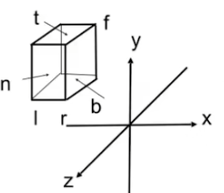
$$
正交投影:\mathbf{P}_{ndc}=\mathbf{M}_{ortho}\mathbf{P}_{view}
\quad \mathbf M_{ortho}=\mathbf S \mathbf T \\
\mathbf T = \begin{bmatrix}
1 & 0 & 0 & -\frac{r+2}{2} \\
0 & 1 & 0 & -\frac{t+b}{2} \\
0 & 0 & 1 & -\frac{n+f}{2} \\
0 & 0 & 0 & 1 \\
\end{bmatrix} \hfill \\
\mathbf S=\begin{bmatrix}
\frac{2}{r-l} & 0 & 0 & 0 \\
0 & \frac{2}{t-b} & 0 & 0 \\
0 & 0 & \frac{2}{n-f} & 0 \\
0 & 0 & 0 & 1 \\
\end{bmatrix} \hfill \\
$$
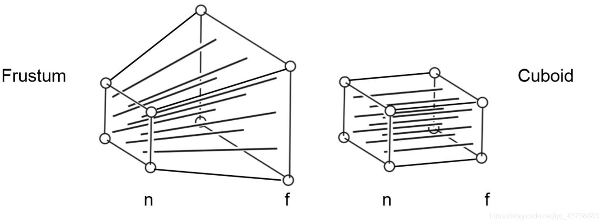
$$
透视投影:\mathbf{P}_{ndc}=\mathbf{M}_{persp}\mathbf{P}_{view} 
\quad \mathbf M_{persp} = \mathbf M_{ortho}\mathbf M_{squish}\\
\mathbf M_{squish}=
\begin{bmatrix}
n & 0 & 0 & 0 \\
0 & n & 0 & 0 \\
0 & 0 & n+f & -nf \\
0 & 0 & 1 & 0 \\
\end{bmatrix} \hfill \\
\mathbf M_{ortho}同正交变换 \hfill \\
$$
*上面给出直接由观察空间变换到NDC的矩阵，跳过了裁剪空间，是投影变换和齐次除法合起来的结果*

- 裁剪空间中各点经过**齐次除法**（每个点除以自身的w分量）得到NDC，因此NDC中的点必然位于边长为2的立方体中
- 透视投影可视为两次变换的叠加，第一次先将平截头体“压缩”为长方体，之后的步骤和正交投影相同

### 裁剪

- 剔除**NDC外**的图元，这一步可能进行**遮挡剔除**

### 屏幕映射

#### 屏幕空间

$$
\mathbf{P}_{screen}=\mathbf{M}_{viewport}\mathbf{P}_{ndc} \hfill \\
\mathbf{M}_{viewport} =
\begin{bmatrix}
\frac{w}{2} & 0 & 0 & \frac{w}{2} \\
0 & \frac{h}{2} & 0 & \frac{h}{2} \\
0 & 0 & 1 & 0\\
0 & 0 & 0 & 1\\
\end{bmatrix} \hfill \\
w:屏幕宽度 \quad h:屏幕高度 \hfill \\
$$

- 由NDC经**视口变换**而得，屏幕左下角为原点，区域大小等于屏幕分辨率

## 光栅化阶段

- **输入：(剔除和变换后的)顶点缓冲区、索引缓冲区，片元着色器程序，材质，其他渲染设置等**
- **输出：修改片元缓冲的内容**
- **片元(Fragment)缓冲：存放各个像素上的若干个片元的缓冲区**

### 片元着色器

- 对于输入的每个三角形，计算器覆盖的片元，逐片元调用片元着色器
- 片元着色器被调用的次数远多于其他着色器

- 理论上，从片元着色器开始，开始发生走样（几何阶段仅存在浮点误差）

#### 覆盖计算

- 计算输入的各个三角形覆盖的片元范围
- 通常使用采样的方式进行覆盖计算；先确定三角形的**AABB**，然后**逐片元采样**，判断其是否位于三角形内部（如果使用此方式，则覆盖计算与着色可以合并）
- 也可以使用**多边形扫描转换**算法等方式

#### 着色计算

- 进行纹理映射，确定“基础颜色”；进行光照计算，其结果与“基础颜色”运算得到该片元的颜色

### 测试混合

- **输入：片元缓冲**
- **输出：所有像素**
- **深度缓冲(Z-Buffer)：每个像素上，当前已渲染的片元的最小深度（深度即到相机的距离，能拍到的范围内深度总是为正）**

- **颜色缓冲：当前已处理片元混合后的结果**

- **透明度缓冲：当前已处理片元混合后的透明度**

- **模板(Stencil)缓冲：常见用途是计算哪些像素需要渲染**
- **帧(Frame)缓冲：测试混合阶段各个缓冲区构成的整体**
- 此阶段利用各个缓冲将同一位置的若干个片元混合为一个像素；各缓冲记录**每个像素位置上的仅一个数据（不同于片元缓冲）**

#### 模板测试

- 如果开启了模板测试，比较当前片元参考值和模板缓冲中的模板值，如果不通过则舍弃片元，通过则更新模板缓冲

#### 深度测试

- 如果开启了深度测试，比较当前片元和深度缓冲中的深度，如果不通过则舍弃片元，通过则更新深度缓冲

#### 混合

- 最常见的混合方式是 新背景色 = alpha × 前景色 + （1 - alpha）× 背景色

## 后处理

- ？

# 模型

## 多层次细节(LOD)

# 采样

## 走样

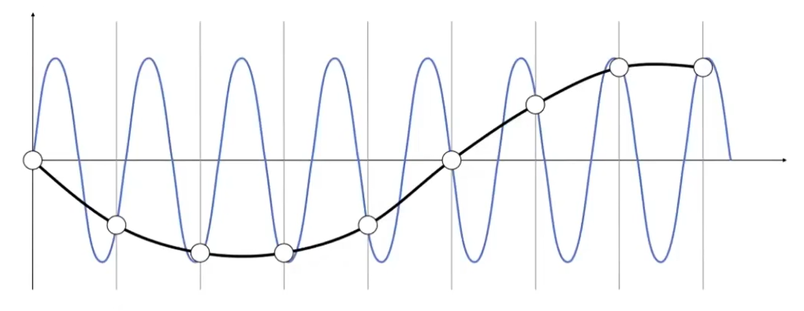

- 采样定理：对模拟信号（连续信号）采样时，采样频率至少要到达模拟信号最高频率的两倍，才能还原出原始信号
- 渲染过程中，“模拟信号”对应纹理（纹理仍然是离散的），“离散信号”对应渲染得到的图像
- **走样来源于采样频率（时间频率/空间频率）不足**
- 走样可能导致**锯齿、摩尔纹、视错觉**等现象

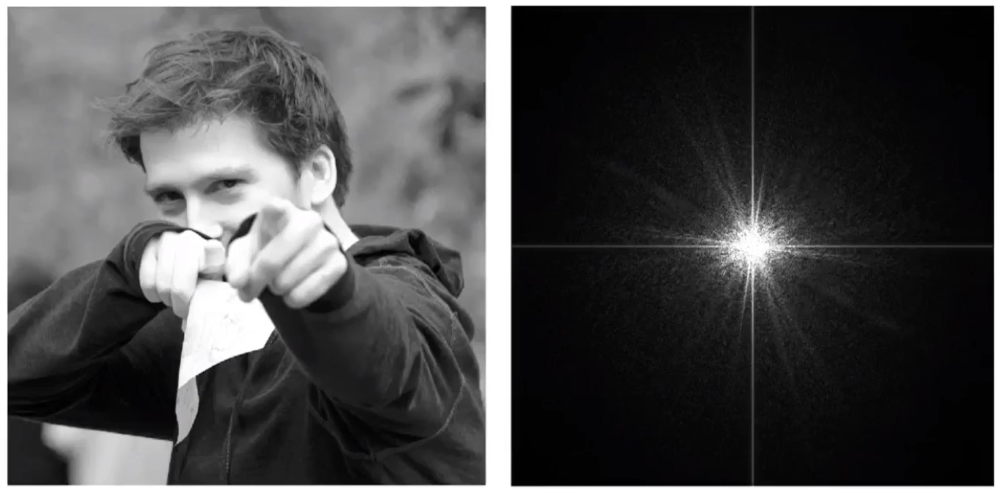

*上面右图中，从中心点发出一条射线，该射线上的所有点表示原图中该方向上的一维信号；某点离中心越近，表示的频率越高；某点越亮，则表示一维信号中该频率的成分多*

- 图像是二维的，因此在平面内的各个方向上，都存在着一维信号
- 对图像应用傅里叶变换，就是把空间域的信号转化为频率域的信号
  - 计算时，假设原图被复制无限多份并拼接起来，在平面内无限延申（本质上是延拓图像信号的定义域）
  - 原图如果不是自拼接的，那么连接处一定会存在高频信号（因此傅里叶变换的结果图中水平和竖直线较亮）

## 滤波

- 滤波：对图片进行傅里叶变换，对结果图进行某种处理后，再逆傅里叶变换，得到处理后的原图

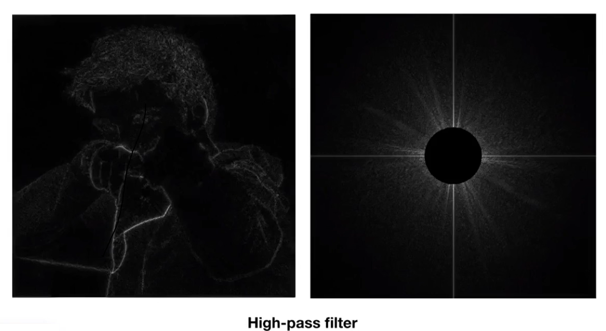

- 高通滤波：去除低频信号；效果大体为保留边缘，去除色块

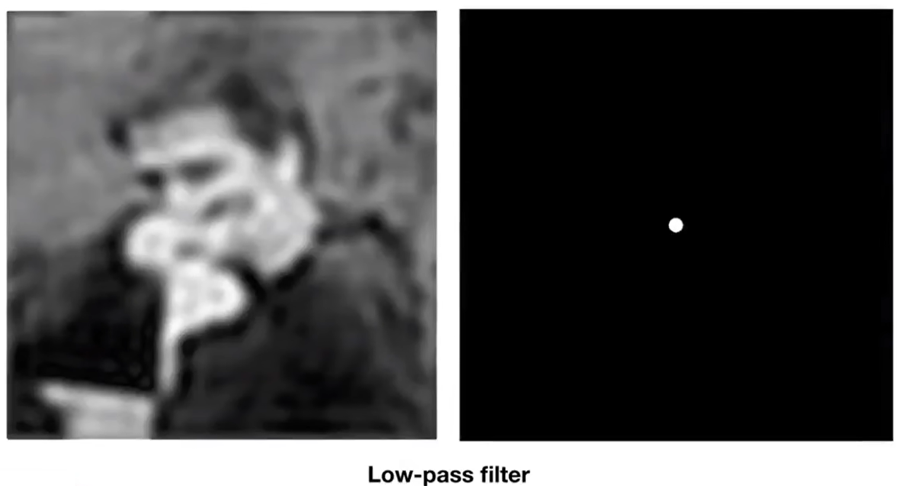

- 低通滤波：去除高频信号；效果大体为图像变得模糊

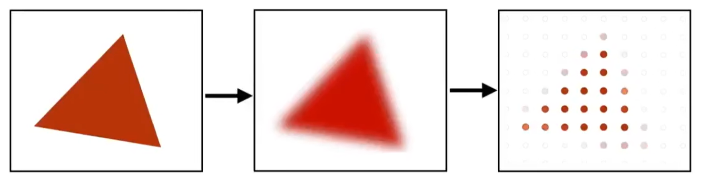

- 采样频率不足时，在采样前使用低通滤波能够缓解走样；最常见的低通滤波是均值滤波

## 反走样

- 默认片元采样方式：对于每个片元，使用一个**采样点**，直接取**当时**的采样结果为输出结果

### 超采样(Super Sampling)

- 每个片元使用**多个采样点**，分别计算采样结果，对其**加权平均**得到输出结果
- 采样的开销成倍增加

### 多重采样(Multiple Sampling)

- 如果一个片元靠近所属三角形**边缘**，则使用多个采样点，仅在一个采样点进行纹理映射、光照计算，其他采样点只进行**覆盖计算**，**输出结果=颜色计算结果×覆盖比例**；如果一个片元远离所属三角形边缘，仍使用一个采样点

- 效果与超采样相近，而开销显著降低

### 时间采样(Temporal Sampling)

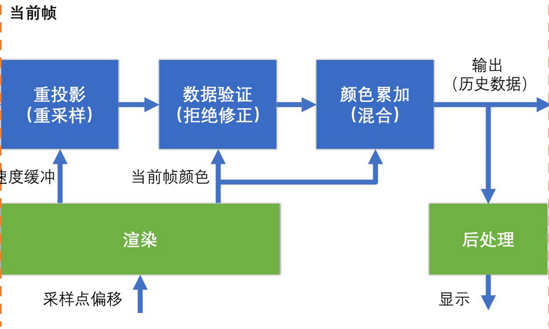

- 用于片元着色器中反走样
- 每个片元使用**当前采样点**，以及**前若干帧内“相同位置”的片元的采样结果**，对其**加权平均**得到输出结果
  - 采样点（相对于片元中心）的位置不必固定，可以随时间按一定规律变动
  - 每个片元中心会映射到某物体的某个纹理上的某个位置，（近似）映射到**同一物体的同一纹理的同一纹理坐标**的两个片元中心，称其为“相同位置”的片元
  - **重投影**：使用**速度缓冲**，来确定上一帧的某个片元与下一帧的哪个片元“位置相同”，
  - **数据验证**：使用某种规则来对前后采样结果对比检查，确定是否可能发生物体抖动、遮挡关系变化、光照变化等特殊情况，视情况考虑是否放弃前若干帧的采样结果
- 不增加总采样次数，开销较低

# 着色

- **计算各片元的颜色**，待之后测试混合得到像素颜色，通常涉及以下值：
  - **原始颜色**：由**纹理映射**确定计算方式
  - **直接光照亮度**：由**光照模型**确定计算方式（计算直接光照亮度时不考虑遮蔽）
  - **遮蔽值**：计算**阴影**的本质是计算遮蔽值（直接光照亮度和遮蔽值分别独立地计算）
  - **间接光照亮度**：**全局光照**中包含若干种计算间接光照的方法

## 着色方式

- **Flat Shading：**每个面着色一次（法线方向为任意两边的叉积），该面的所有片元颜色相同

- **Gouraud Shading：**每个顶点着色一次，每个片元的颜色根据所属三角形顶点的颜色，利用重心坐标插值而得（直接对颜色插值完全不符合光学规律）

- **Phong Shading：**每个片元着色一次

## 法线计算

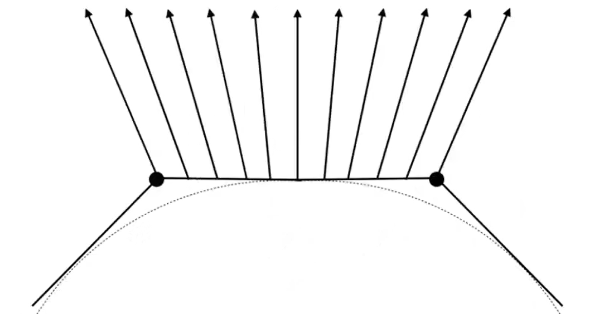

- **面法线**：该面任意两边的叉积
- **顶点法线**：由包含该顶点的所有面的法线方向平均而得（简单平均，或根据各个面的面积加权平均）
- **片元法线**：根据所属面各顶点的法线，利用重心坐标插值而得
  - 理论上，一个面内的所有片元应当具有相同的法线方向；但现实中的物体由无数多的三角形面构成，模型无法精确模拟
  - 多数情况下，改用插值计算片元法线，能够使着色过渡更平滑，看起来反而更真实，因此这是默认的计算方式
  - 如果确实要表现一个较大的平整面，可以利用法线贴图

### 法线贴图

- 直接规定每个纹素的法线，不再通过顶点插值计算，而是直接查询（仍然可使用双线性插值等）。法线是三维方向向量，正好可以用RGB记录，所以可以记录在一张图片中，故称为法线贴图

### 位移贴图（凹凸贴图）

- 直接规定每个纹素相对于模型的位移量（自然会影响法线方向）
- 仅影响渲染，不影响模型乃至物理系统

## 纹理映射

- 纹理不仅包括颜色纹理，还包括法线贴图、粗糙度纹理、金属度纹理等

- 纹理空间：纹理左下角为原点，纹理右上角为(1,1)（如果纹理坐标超出此范围，则需要考虑纹理的延展方式）
  - 若纹理分辨率为N×N，则纹素在纹理空间内是边长为1/N的正方形
  - 片元在屏幕空间内是边长为1的正方形，映射到纹理空间后，其形状和大小均不确定

- 理想情况下，进行纹理映射时，**计算其在纹理空间中对应的区域，结果为该区域中所有纹素的平均值**

- **顶点纹理坐标**：为模型设定纹理时，每个顶点的纹理坐标便已确定，存放在顶点缓冲区中

- **片元纹理坐标**：根据所属面各顶点的纹理坐标，利用重心坐标插值而得

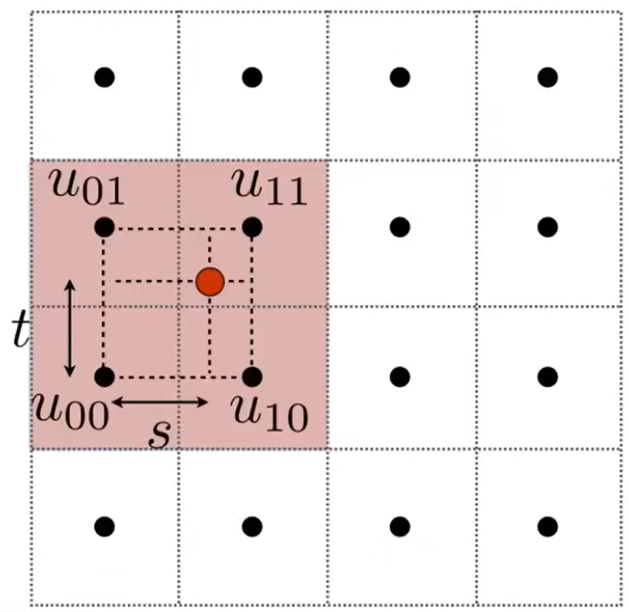

- **最近点(Nearest)**：取最接近片远纹理坐标的单个纹素，直接取其纹理值

- **双线性插值(Bilinear)**：取最接近片远纹理坐标的四个纹素，求其纹理值的双线性插值

### Mipmap

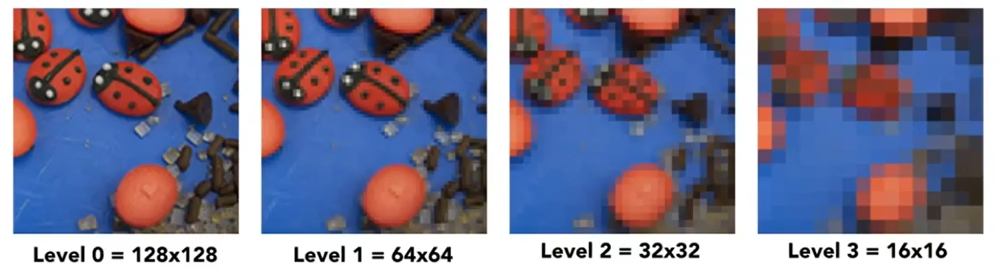

- **Mipmap**：基于原纹理额外生成的若干个纹理；每次将前一次的纹理长和宽压缩为1/2
  - 原纹理每四个纹素（2×2）一组，其平均值存放在一个纹理中，以此方式压缩
  - 占用的总显存为原纹理的133%

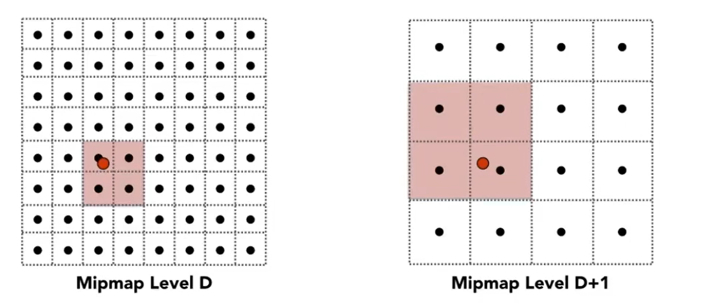

*上左图中，每个纹素的尺寸为1/16，上右图中，每个纹素的尺寸为1/8；尺寸介于这两个值之间片元会被映射到这两个mipmap上*

- **三线性插值(Trilinear)**：求出纹理空间内某片元的尺寸，映射到**尺寸最接近的两张mipmap上**，两张mipmap中分求双线性插值，其结果再求线性插值

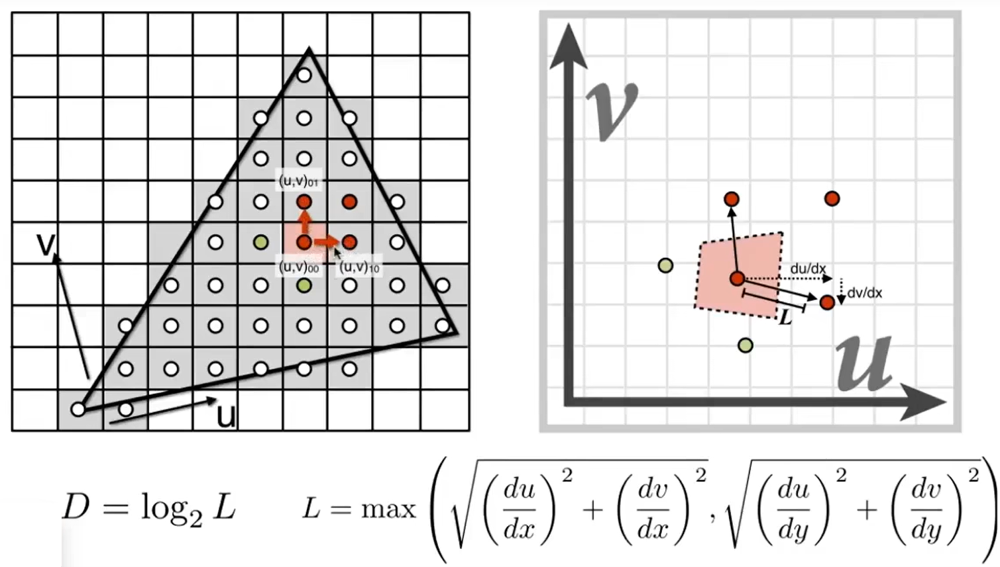

- **片元尺寸**：一个片元与其相邻片元的纹理坐标的差值可以近似表示该片元在纹理空间内的尺寸

### 各项异性过滤

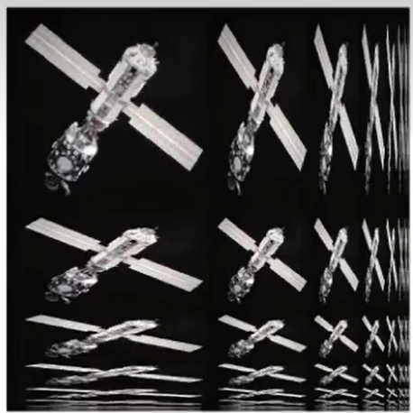

- **Ripmap**：基于原纹理额外生成的若干个纹理；每次将前一次的纹理长或宽压缩为1/2
  - 原纹理每两个纹素（1×2或2×1）一组，其平均值存放在一个纹理中，以此方式压缩
  - 可以设置**各项异性倍率**，如16×表示长和宽最多压缩到1/16
  - 各向异性倍率为2×时，占用总显存为原纹理的225%；为无穷大时，则占用的总显存近似为400%

- **各向异性过滤(Anisotropic Filtering):**求出纹理空间内某片元的长宽，映射到**长宽最接近的四张ripmap上**，四张ripmap中分求双线性插值，其结果再求双线性插值

## 直接光照

### Blinn-Phong模型

- 认为**反射光=环境光(Ambient)+漫反射(Diffuse Reflection)光+镜面反射光(Specular Reflection)**
- 规定了漫反射和镜面反射的计算方式（只考虑直接光照，间接光照的结果统称为环境光）
- 越光滑的物体，其镜面反射越强，即反射光越集中于与入射光对称的方向上（因此高光区域随光源和观察点变化而变化）
- 难以表现出各种不同的材质，塑料感强

$$
渲染方程:L_r(\mathbf p,\mathbf v)= \iint_\Omega L_i(\mathbf p,\mathbf l) (\mathbf l \cdot \mathbf n) f(\mathbf p,\mathbf l,\mathbf v,\mathbf n) \mathrm d\mathbf l \hfill \\

规定f(\mathbf v,\mathbf l) = k_d + k_s (\mathbf l \cdot \mathbf h)^\alpha,并忽略间接光照 \hfill \\
\Rightarrow L_r(\mathbf p,\mathbf v)=L_d(\mathbf p,\mathbf v)+L_s(\mathbf p,\mathbf v) \hfill \\
\Rightarrow L_r(\mathbf p,\mathbf v)=\sum_i [k_dL_i(\mathbf p)(\mathbf l \cdot \mathbf n) + k_s (\mathbf l \cdot \mathbf h)^p L_i(\mathbf o,\mathbf l)(\mathbf l \cdot \mathbf n)] \hfill \\
其中\mathbf h =\frac{ \mathbf l + \mathbf v}{|\mathbf l+\mathbf v|} \hfill \\
\\
L_i(\mathbf p):某个光源直射\mathbf p处的亮度 \hfill \\
L_d(\mathbf p,\mathbf v):\mathbf p处沿\mathbf v方向的漫反射光亮度 \hfill \\
L_s(\mathbf p,\mathbf v):\mathbf p处沿\mathbf v方向的镜面反射光亮度 \hfill \\
k_d:漫反射系数 \quad k_s:镜面反射系数 \quad p:描述高光集中程度,p越大越集中 \hfill \\
$$

### Macrofacet模型

- 基于微表面模型对Blinn-Phong模型的改进

- 物体的表面从微观的角度看，是凹凸不平的；物体表面的法线越趋近于同一个方向，看起来越光滑；法线越分散，看起来越粗糙
- 能比较好地表现各种材质

$$
渲染方程:L_r(\mathbf p,\mathbf v)= \iint_\Omega L_i(\mathbf p,\mathbf l) (\mathbf l \cdot \mathbf n) f(\mathbf p,\mathbf l,\mathbf v,\mathbf n) \mathrm d\mathbf l \hfill \\
规定f(\mathbf v,\mathbf l) = k_d + k_s \frac{DFG}{4 \ (\mathbf l \cdot \mathbf n)(\mathbf v \cdot \mathbf n)},并忽略间接光照 \hfill \\
\Rightarrow L_r(\mathbf p,\mathbf v)=L_d(\mathbf p,\mathbf v)+L_s(\mathbf p,\mathbf v) \hfill \\
D = \frac{\alpha^2}{\pi((\mathbf n \cdot \mathbf h)^2(\alpha^2-1)+1)^2} \quad 其中\mathbf h =\frac{ \mathbf l + \mathbf v}{|\mathbf l+\mathbf v|} \hfill \\
F = F_0 + (1-F_0)(1 - (\mathbf v \cdot \mathbf h))^5 \hfill \\
G = g(\mathbf l)g(\mathbf v) \quad 其中 g(\mathbf x) = \frac{\mathbf n \cdot \mathbf x}{(1-k)\mathbf n \cdot \mathbf x + k} \quad k = \frac{(\alpha + 1)^2}{8} \hfill \\
\\
D:描述法线的分散程度 \quad F:描述菲涅尔现象的强度 \quad G:描述表面凹凸带来的吸光能力 \quad \hfill \\
\\
\alpha:物体材质的粗糙度(决定法线分散程度和表明凹凸程度,无量纲,范围0-1) \quad \hfill \\
F_0:菲涅尔反射率,金属较高,非金属较低,介于两者之间的值看起来不真实(如半导体) \hfill \\
$$

#### PBR材质

- 基于Macrofacet模型设计材质。物体表面上的每个点都有各自的材质，所以适合用图来表达。需要三张图，分别表示D（RGB图）、F（RGB图）、G（灰度图）

- Diffuse图：RGB，因为对不同波长的光的吸收/反射不同
- Spectacular图：RGB，因为对不同波长的光的吸收/反射不同
- Glossiness：灰度，因为这里的吸收指的是几何意义上的光无法射出，仅仅和表面的粗糙度有关，只需要规定alpha值一格参数

#### Metalic PBR 

- PBR中最容易出现问题的是Spectacular图。Metalic PBR对PBR进行了简化和包装

- Base Color图：RGB，单纯表示颜色
- Roughness图：灰度，表示粗糙程度
- Metalic图：灰度，表示金属度
- 自发光图（可选）：灰度，仅影响物体本身的外观，不被看作光源

## 阴影

### Shadow Map

*对于上图，P1无阴影，P2有阴影但是被剔除，P3有阴影*

- **将光源视为摄像机**，“拍摄”一个区域；用灰度图记录结果，即**Shadow Map**（类似屏幕空间）
  - 本质上是从光源发出若干射线（均匀分布于“视锥”中），每条线与（不透明）物体求交，“片元”中记录第一个交点的距离
  - Shadow Map在运行时动态更新，每帧更新若干次
  - 每个光源有独立的Shadow Map，独立地进行遮蔽计算
  - **屏幕空间和Shadow Map采样率不同、方位不同，导致屏幕空间的片元和Shadow Map中的“像素”并不一一对应**
- 将片元某个位置到光源的距离记为**A**，ShadowMap中对应位置值记为**B**：
  - A=B：表示光源可直射该片元
  - A>B：表示该片元与光源之间有物体遮挡
  - A<B：理论上不会发生

- 然而实际上计算A，B时必然产生误差：
  - A=B：完全相等的可能性几乎为0
  - A>B：理论上A=B的位置，有可能因误差进入这种情况，进而导致错误地认为该位置被遮蔽
  - A<B：理论上A=B的位置，有可能因误差进入这种情况，因此这种情况下也认为光源可直射该片元
- 为避免错误，计算出A后，将其适当地减小一个值，该值被称为**阴影偏移(Shadow Bias)**
  - 设置阴影偏移会导致一些“原本存在”的阴影“消失”，尤其是细小凹凸处

- 由于精度有限，Shadow Map仅适用于以漫反射为主的材质（因为亮度变化平滑）

### 级联阴影(Cascade Shadow)

- 将光源照射区域按照到相机的距离分为几个阶段，对于不同阶段内的**光源**，采用不同的Shadow Map精度
- 每个阶段分别进行裁剪
- 开销较大

### PCF

- 利用Shadow Mapping能够计算某光源在某片元的光照是否被遮挡，计算的结果只有被遮挡、不被遮挡两种，因此阴影很“硬”
- PCF是对**遮蔽计算**这一步的结果进行滤波（最简单的是均值滤波），使阴影“软化”
- 现实中，通常离光源越远的位置，阴影越“软”，为此，可以**在更远的位置使用更大的卷积核**，以取得更明显的滤波效果，这种做法被称为PCSS

### VSSM

## 全局光照

- 全局光照指直接光照和间接光照（环境光），重点在于如何计算间接光照
- 最简单的做法是，将环境光设为常量

### 环境光遮蔽(Ambient Occlusion)

- 在**片元着色器**阶段，计算光照强度时，计算环境光遮蔽
- 粗略地计算间接光照，对于每个片元，令默认环境光乘以**“未遮蔽比例”**，得到该片元处的环境光强度
- 粗略地认为每个片元对应地位置上，光均匀地从半球面射入，然后根据**深度缓冲**信息，估算这些光的未遮蔽比例

#### SSAO+

- 在以片元对应位置为圆心的半球面中随机地取若干采样点，依据深度缓冲粗略判断这些点是否位于物体内部
- 未遮蔽比例等于在物体外部的点的比例

#### HBAO

- 从片元位置，垂直于该点法线的平面内，发射若干条射线，根据深度缓冲，粗略地估算该方向上的”遮蔽角度“
- 由各方向的遮蔽角度计算未遮蔽比例，再取平均得到最终的遮蔽比例

## 环境映射

- 预计算一些全局光照所需的数据

### 环境光贴图

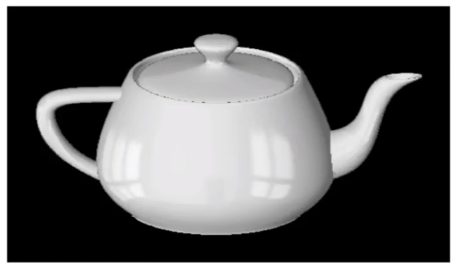

- 假设场景中的各物体和光源不变，那么任意物体上的渲染结果是固定的，可以预先渲染好这一结果
- 由于是预渲染，允许计算多次反射的结果，因此能够较好地反映环境中许多物体反射到某物体上的光线
- 只有光照不变，且物体不动时，才适合直接使用环境光贴图（？）

### Light Probe

- 假想在场景中放置一个球，预计算该球面的环境贴图，实际上就是记录了该位置的环境光照，这样的球被称为Light Probe
- 也可以考虑用立方体表面记录环境光照

# 后处理

## FXAA

## Tone Mapping

- 两个自然光的亮度是线性叠加的，但亮度与人感知到的颜色（最终渲染到屏幕上的颜色）不是线性关系
- 亮度在线性空间中混合，混合完毕后进行Gamma校正

| 亮度空间 | 最大亮度 | 亮度与颜色                                |
| -------- | -------- | ----------------------------------------- |
| LDR      | 1        | 由Gamma校正调节，计算出最终屏幕显示的颜色 |
| SDR      | 略大于1  | 同上                                      |
| HDR      | 不限制   | 由Tone Mapping调节，转换到SDR             |

# 其他渲染技术

## 透明物体渲染

- 透明物体意味着背后的面无法剔除，意味着overdraw，为了避免渲染大量透明物体（如云雾）开销过大，可以将透明物体单独取出来，渲染到分辨率更低的缓冲上；即透明物体和不透明物体有各自的一套缓冲区，将两者的颜色缓冲依据深度缓冲按特定规则混合

## 地形渲染

### Height Map

#### 原理

- 记录大量均匀分布（俯视角下均匀）的顶点的高度，通过它生成mesh

#### 数据结构

- 巨大的地图被分成若干大小相同的block，每个block通常采用四叉树的结构存储。block中还包含纹理、法线贴图等数据

#### 剔除

- 巨大的地形必然需要剔除和动态加载，地形以block形式存储，只需要以block为单位剔除即可

### 纹理混合

- 纹理混合常见于地形渲染中（如过渡区域）
- 使用heightmap，**只渲染每个位置上高度较高的纹理**。过渡区域可以**依据权重调节高度**，以实现平滑的过渡

### 虚拟纹理

- 类似虚拟内存，适合用于分块加载的地形

# 数字图像

## 概念

- 图像：二维函数f(x,y)（返回值类型因图像不同有多种可能）

- 数字图像：参数、返回值均离散的图像

- 空间分辨率：图像最小可辨细节的测度
- 采样分辨率：图像的最小采样间隔
- 灰度分辨率：图像灰度级中可分辨的最小变化
- 灰度级：数字图像灰度(离散的)的可能取值的个数，通常为2的正整数次幂
  - k比特图像：灰度级为2^k的图像
- 动态范围：统计图像中所有像素的灰度，其中最小最大灰度构成的范围即动态范围

## 颜色

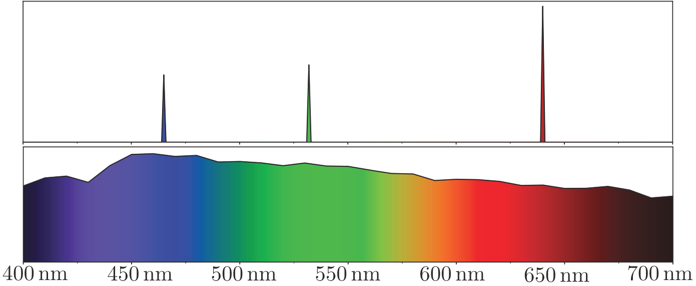

*上图中，两种不同的SPD对应同一种颜色（白色）*

- 颜色取决于光的**SPD(光谱功率分布)**，并且SPD与颜色之间不是单射
- 光线的SPD和物体的吸收率、反射率等性质共同决定反射光线的颜色
- 游戏引擎中，物体有颜色、金属度等参数，光源有颜色、亮度等参数，并通过这些参数计算最终显示的颜色，但这并不能反映真实的光吸收、反射的物理规律

### 人眼成像

- 人眼中，一般有三种视锥细胞(S-Cone,M-Cone,L-Cone)，它们对不同波长的光敏感度不同，三种细胞感应到的强度(通过对波长的积分得出S,M,L)决定了人感知的颜色

### 饱和度

- 0饱和度为白色，满饱和度为原色

- 0亮度为黑色，随亮度增大不断趋向白色

### 颜色混合

- 多色光混合得到白光。物质反射而不吸收什么颜色的光，就呈现什么颜色。颜料混合后吸收所有颜色的光，呈黑色

### 安全色

- 在任何计算机上都可以正确显示的颜色，在R、G、B分量上六等分，共216种颜色

### 颜色空间

- 颜色空间是在计算机中表示颜色的方式，坐标与颜色构成单射

#### RGB空间

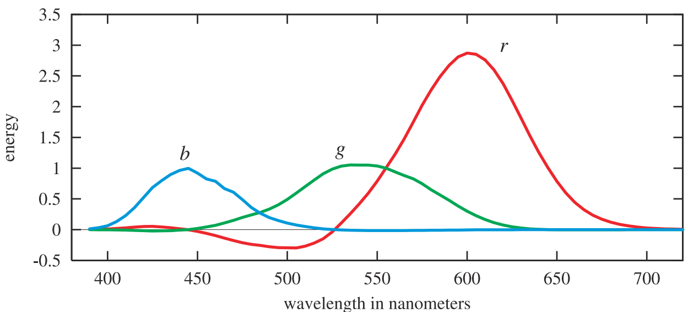
$$
R=\int_{380}^{780}s(\lambda)r(\lambda) \mathrm d \lambda \quad 
G=\int_{380}^{780}s(\lambda)g(\lambda) \mathrm d \lambda \quad 
B=\int_{380}^{780}s(\lambda)b(\lambda) \mathrm d \lambda \quad
$$

- 定义三原色光，给定一个颜色，将其SPD分别与三原色光的SPD作加权积分，得到的三个结果即RGB（可能还需要规范化）

- 三原色光现实中不存在（因为有负功率）；对于某些波长的可见光，RGB中的某个分量可能小于0

$$
简单公式:Gray = (R+G+B)/3 \hfill \\
经验公式:Gray = 0.299R + 0.857G + 0.114B \hfill \\
$$

#### XYZ空间

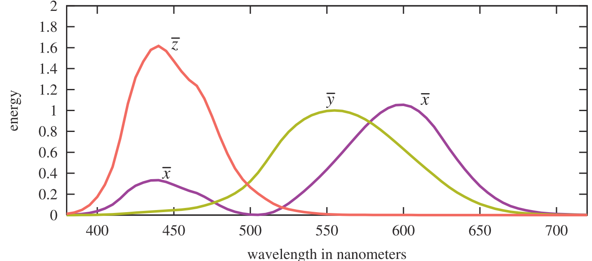
$$
X=\int_{380}^{780}s(\lambda)\overline{x}(\lambda) \mathrm d \lambda \quad Y=\int_{380}^{780}s(\lambda)\overline{y}(\lambda) \mathrm d \lambda \quad 
Z=\int_{380}^{780}s(\lambda)\overline{z}(\lambda) \mathrm d \lambda \quad
\\
\begin{bmatrix}
X \\ Y \\ Z \\
\end{bmatrix}
=
\begin{bmatrix}
2.769 & 1.752 & 1.130 \\
1 & 4.591 & 0.060 \\
0 & 0.056 & 5.594 \\
\end{bmatrix}
\begin{bmatrix}
R \\ G \\ B \\
\end{bmatrix}
$$

- 定义三原色光，给定一个颜色，将其SPD分别与三原色光的SPD作加权积分，得到的三个结果即XYZ
- 不包含负功率、负系数（实际上，如果允许负系数，颜色范围更大，但不需要表示更大范围的颜色）
- XYZ和RGB可以相互用对方的线性组合表示

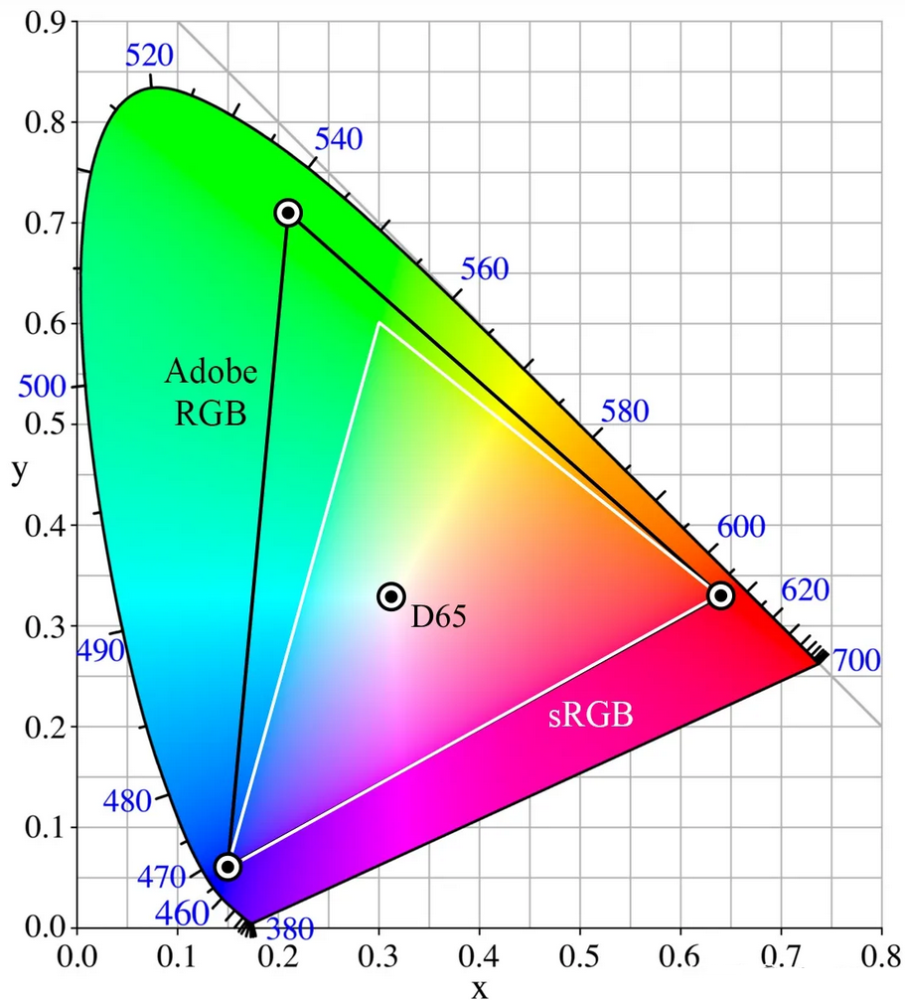

- (X,Y,Z)是三维空间中的坐标，取X+Y+Z=1，然后将该平面投影到XY平面，即得到**CIE色度图**（图中并不包含所有颜色；所有颜色的“数量级”是三维的，而平面是二维的，只包含某些特定“亮度”的颜色）
  - sRGB中，R,G,B的取值范围均为(0,1)，故无法表示所有可见光
  - Adobe RGB中，R,G,B的取值范围仍为(0,1)，但对三原色的SPD进行调整，与RGB空间的不同

#### CMY空间

- 便于计算自然光照射下，颜料混合的效果

$$
(C,M,Y) = (1,1,1) - (R,G,B) \hfill \\
C:青色 \quad M:深红色 \quad Y:黄色 \hfill \\
$$

#### CMYK空间

- 黑色颜料成本最低，尽量使用黑色颜料代替部分其他颜料

$$
(C_0,M_0,Y_0) = (1,1,1) - (R,G,B) \hfill \\
K = \min\{C_0,M_0,Y_0\} \hfill \\
C = \frac{C_0-K}{1-K} \quad M = \frac{M_0-K}{1-K} \quad Y = \frac{Y_0-K}{1-K} \hfill \\
$$

#### HSI空间

- 体现光的物理特性， 某些运算在HSI空间上执行能得到更好的结果

$$
H = 
\begin{cases}
\theta \quad \quad \quad \quad ,B \leq G \\
360° - \theta \quad ,B>G
\end{cases} 
\quad \theta = \arccos{\frac{\frac{1}{2}[(R-G)+(R-B)]}{[(R-G)^2+(R-B)(G-B)]^{1/2}}} \hfill \\
S = 1 - 3\frac{\mathrm{min}\{R,G,B\}}{R+G+B} \quad
I = \frac{R+G+B}{3} \hfill \\
H:色调 \quad S:饱和度 \quad I:亮度 \hfill \\
$$

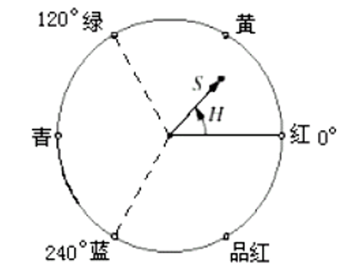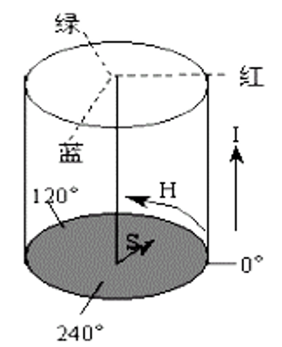

## 图像处理

- 点运算：对每个像素施加同样的运算
- 代数运算：两个图像点对点运算
- 几何运算：涉及像素空间位置的运算
- 灰度运算：将一系列灰度映射到另一系列灰度上的运算

### 直方图处理

#### 概念

- 灰度直方图：统计每一灰度的像素数量的直方图
- 累积直方图：统计小于等于每一灰度的像素数量的直方图
- 直方图规定化：构造一组灰度到灰度的映射，对原直方图应用映射，使之接近期望的形状
  - 直方图均衡化：映射函数是增函数的前提下，使图像直方图尽量均衡

### 线性系统

- 线性系统：各个输入信号的加权和的响应等于各个输入信号响应的加权和
- 线性移不变系统：如果输入序列进行移位，则输出序列进行相应的移位

$$
对于线性系统T:T[x_1]+T[x_2] = T[x_1+x_2] \quad T[ax_1+bx_2] = aT[x_1] + bT[x_2] \hfill \\
对于线性移不变系统T:y(i,j) = T[x(i,j)] \Rightarrow y(i-m.j-n) = T[x(i-m,j-n)] \hfill \\
$$

#### 卷积

$$
g(t) = h * f = \int_{-\infin}^{\infin}h(t-\tau)f(\tau)\mathrm d \tau \hfill \\
g(x,y) = h * f = \int_{-\infin}^{\infin} \int_{-\infin}^{\infin} h(x-u,y-v)f(u,v) \mathrm d u \mathrm d v \hfill \\
$$

### 空间域滤波

- 均值滤波：对于每个待处理的像素，规定一个模板，用该像素及周围周围像素的颜色的加权平均代替该像素的颜色，模板规定了周围像素的区域，以及每个像素的权值
- 中值滤波：对于每个待处理的像素，规定一个模板，用该像素及周围周围像素的中位数代替该像素的颜色，模板规定了像素的区域
- 自适应滤波：？
- 改进的α均值滤波：？
- 微分锐化
  - Roberts锐化算法：对原图像应用两个模板，两个结果的和为锐化结果
  - Sobel锐化算法：对原图像应用两个模板，两个结果的平方和的平方根为结果
  - Priwitt锐化算法：过程同上

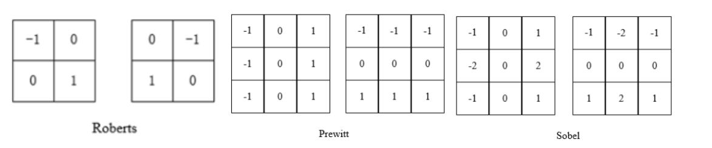

### 频率域滤波

#### 二维傅里叶变换

- 将图像函数拆分成无数二维正弦波（见下图）的组合，二维正弦波除了具有频率、幅度、相位，还具有方向
- 相位谱：输入频率和方向，返回相位
- 振幅谱：输入频率和方向，返回振幅
- 用图像表示F(u,v)，**越靠近中心，低频信号占比越高**

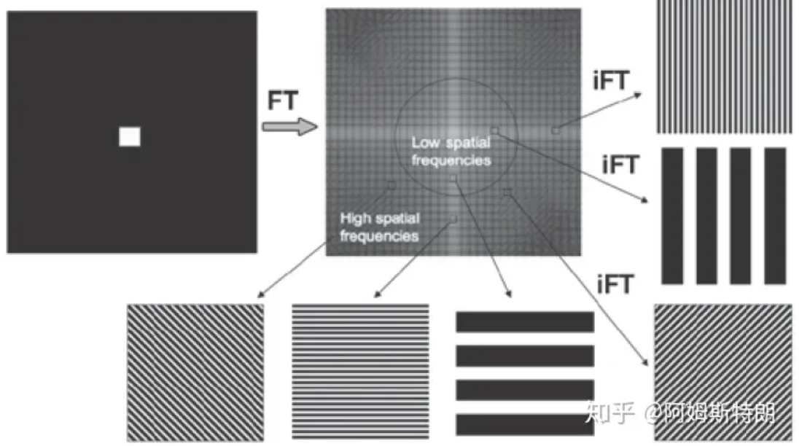
$$
二维离散傅里叶变换: F(u,v) = \sum_{x=0}^{M-1} \sum_{y=0}^{N-1} f(x,y) e^{-2j\pi(\frac{ux}{M} + \frac{vy}{N})}\hfill \\
逆变换:f(x,y) = \frac{1}{MN} \sum_{u=0}^{M-1} \sum_{v=0}^{N-1} F(u,v) e^{2j\pi(\frac{ux}{M} +\frac{vy}{N})}\hfill \\
谱:|F(u,v)| = \sqrt{R(u,v)^2+I(u,v)^2} \hfill \\
频率:w = \sqrt{u^2+v^2} \quad 方向:\mathbf v = (u,v) \hfill \\
相位谱:\phi(u,v) = \arctan[\frac{I(u,v)}{R(u,v)}] \hfill \\
功率谱:P(u,v) = |F(u,v)|^2 \hfill \\
$$

#### 步骤

1. 预处理图像
2. 进行二维离散傅里叶变换
3. 变换得到的函数乘上过滤器函数
4. 进行二维离散逆傅里叶变换
5. 后处理

#### 低通滤波(Low-pass Filter)

$$
ILPF:H(u,v) =
\begin{cases}
1,w \le w_0 \\
0,w \gt w_0 \\
\end{cases} \hfill \\
BLPF:H(u,v) = \frac{1}{1+(w/w_0)^{2n}} \quad n \rightarrow \infin时,BLPF \Leftrightarrow ILPF \hfill \\
ELPF:H(u,v) =  (\frac{e}{\sqrt{2}})^{(\frac{w}{w_0})^n} \hfill \\
TLPF:H(u,v) = 
\begin{cases}
1,w \lt w_0 \\
\frac{w-w_1}{w_0-w_1},w_0 \le w \le w_1 \\
0,w \gt w_1 \\
\end{cases} \hfill \\
$$

#### 高通滤波(High-pass Filter)

$$
IHPF:H(u,v) =
\begin{cases}
0,w \le w_0 \\
1,w \gt w_0 \\
\end{cases} \hfill \\
BHPF:H(u,v) = \frac{1}{1+(\sqrt{2}-1)(w_0/w)^{2n}} \quad n \rightarrow \infin时,BHPF \Leftrightarrow IHPF \\
EHPF:H(u,v) =  (\frac{1}{e})^{(\frac{w_0}{w})^n} \hfill \\
THPF:H(u,v) = 
\begin{cases}
0,w \lt w_1 \\
\frac{w-w_1}{w_0-w_1},w_1 \le w \le w_0 \\
1,w \gt w_0 \\
\end{cases} \hfill \\
$$

### 图像退化与复原

#### 噪声

- 统计各噪点的灰度，可以得到噪点在灰度上的概率密度函数，进而对噪声分类
- 高斯噪声：（灰度图上，下同）柱状区向两侧扩散，形状类似高斯分布函数
- 瑞利噪声：柱状区向两侧扩散，相比高斯噪声，左侧更高更窄
- 伽马噪声：柱状区向两侧扩散，相比瑞利噪声，左侧更高更窄
- 指数噪声：柱状区向右扩散，形状类似指数函数
- 均匀噪声：柱状区向两侧扩散，顶部凹凸不平
- 椒盐噪声：多出几个凸起的柱状区

#### 空间滤波复原

- 算术均值滤波
- 几何均值滤波
- 谐波均值滤波
- 逆谐波均值滤波

#### 频率域滤波复原

- 陷波滤波

#### 运动模糊

- 多个时间的图像偏移、叠加而成
- 逆滤波
- 维纳滤波

### 形态学图像处理

- 膨胀：白色区域外扩
- 腐蚀：白色区域内缩
- 开运算：去除白点
- 闭运算：填充黑点
- 边缘提取：膨胀图像减腐蚀图像

### 图像分割

- 点检测：使用模板处理原图像，得到的矩阵中，绝对值大于阈值的像素为孤立点
- 线检测：与点检测类似，检测不同方向的线使用不同颜色的模板

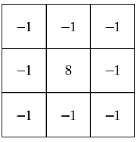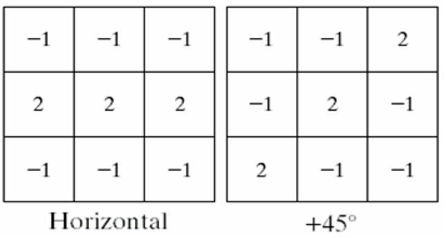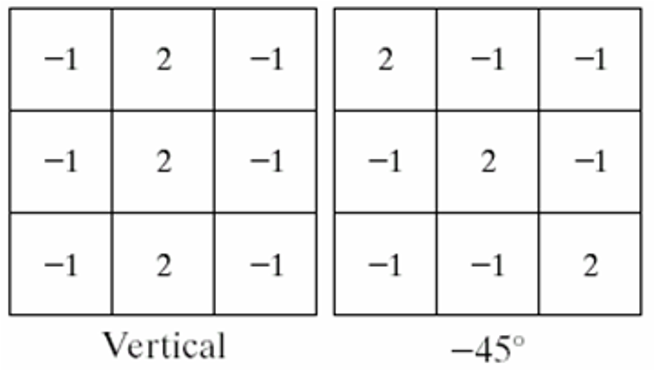

- 边缘检测：利用函数的一、二阶导数。离散环境下，求函数的梯度/导数，简化为对矩阵应用模板
  - 梯度算子：分别对原图应用两个模板，将两个结果合成（Roberts算子为相加，Priwitt算子和Sobel算子为平方和的平方根），得到的即为边缘检测的结果。原理是两个一阶导数（方向导数）运算
  - 拉普拉斯算子：对原图应用一个模板，得到的即为边缘检测的结果。原理是二阶导数计算

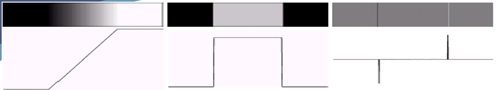

- 门限值分割：以门限值为界，对图像二值化
  - 基本全局门限：对所有像素应用同一个门限值
  - 自动全局门限：设定一个初始门限值T和一个参数T0。用T分割图像，计算两个区域的平均灰度值u1,u2。T'=(u1+u2)/2，若|T'-T|<T0，使用T作为最终门限值，否则，，令T=T'重复上述过程
  - 自适应门限值：不再全局使用同一个门限值，而是对每个像素使用自适应的门限值。可以在周围区域内计算自动门限，也可以划分图片，在所属的区域内计算自动门限
- 区域分割与合并：如四叉树
