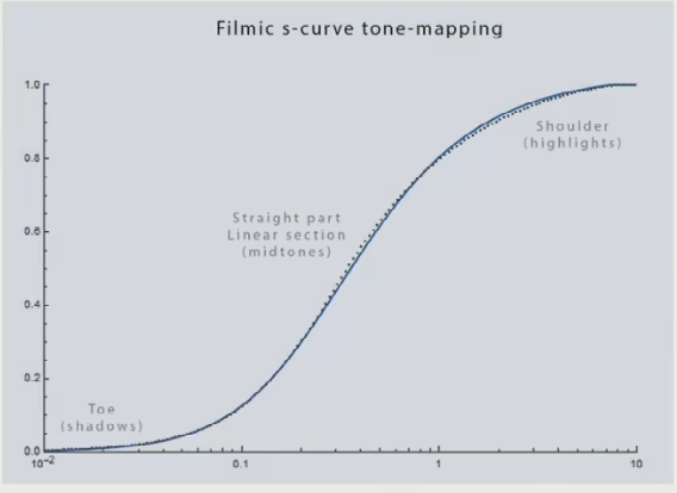

## 辐射度量学

$$
I = \frac{\Phi}{\omega} \quad \omega = \frac{A}{r^2} \quad \omega:立体角\hfill \\
\mathrm d\omega = \frac{r \sin \theta \cdot \mathrm d\phi \cdot r \mathrm d\theta }{r^2} = \sin \theta \mathrm d\theta \mathrm d\phi \hfill \\
球面立体角:\omega = \iint_{S^2} \mathrm d\omega = \int_0^{2\pi} \mathrm d\phi \int_0^\pi \sin \theta \mathrm d\theta = 4 \pi \hfill \\
$$

- 立体角的单位为**球面度($sr$)，无量纲**

| 符号   | 名称                        | 含义                           | 单位                  |
| ------ | --------------------------- | ------------------------------ | --------------------- |
| $\Phi$ | 辐射通量(Radiant Flux)      | 单位时间内发出/吸收的能量      | $\mathrm{lm=W}$       |
| E      | 辐照度(Irradiance)          | 单位面积的辐射通量             | $\mathrm{lux=W/m^2}$  |
| I      | 辐射强度(Radiant Intensity) | **单位立体角**的辐射通量       | $\mathrm{cd=W/sr}$    |
| L      | 亮度(Radiance)              | 单位**投影面积**的**辐射强度** | $\mathrm{nit=cd/m^2}$ |

$$
L(\mathbf p,\mathbf l)=\frac{\mathrm d^2 \Phi(\mathbf  p,\mathbf l)}{\mathrm d\omega \mathrm d A \cos \theta}
$$

- 假设光源为均匀发光、未被遮挡的点光源：
  - 在光源的不同方位、不同距离处，辐射强度均相同
  - 其他条件不变时，离光源越近的表面，辐照度越高；被直射的表面，比被斜射的表面辐照度高
- 可以将**一条光线**视为**从某个无穷小表面射出（或射入某个无穷小表面），占据无限小立体角**的事物

## 渲染方程

$$
L_o(\mathbf p,\mathbf v,\mathbf n) = L_e(\mathbf p,\mathbf v) +L_r(\mathbf p,\mathbf v,\mathbf n) \hfill \\
L_r(\mathbf p,\mathbf v,\mathbf n)= \iint_\Omega L_i(\mathbf p,\mathbf l,\mathbf v,\mathbf n) (\mathbf l \cdot \mathbf n) f(\mathbf p,\mathbf l,\mathbf v,\mathbf n) \mathrm d\omega \hfill \\
\\
\mathbf p:被观察点位置 \quad \mathbf v:由\mathbf p指向观察者位置的单位向量 \quad
\mathbf l:由\mathbf p指向光源(或反射源)的单位向量 \hfill \\
\mathbf n:\mathbf p处的单位法向量 \quad \Omega:以\mathbf p为中心,以\mathbf n为朝向的半球面(理论上总有\mathbf l \cdot \mathbf n \ge 0) \hfill \\
\\
L_o(\mathbf p,\mathbf v,\mathbf n):从\mathbf p沿\mathbf v方向发出和反射光线的总亮度 \hfill \\
L_e(\mathbf p,\mathbf v):从\mathbf p沿\mathbf v方向的自发光亮度 \hfill \\
L_i(\mathbf p,\mathbf l) :\mathbf 沿-\mathbf l射到\mathbf p的光线的亮度\hfill \\
L_r(\mathbf p,\mathbf v,\mathbf n) :从\mathbf p沿\mathbf v方向的反射光亮度 \hfill \\
f(\mathbf p,\mathbf l,\mathbf v,\mathbf n):\mathbf p处的双向反射分布函数(\mathbf{BRDF}) \hfill \\
$$

## 颜色概念

- **颜色①：人眼感知光线后，产生的某种信号**
- **颜色②：计算机中，用于描述图像的，与颜色①有间接关系的一种数据**；数据影响显示器的发光元件，控制其发出光线的**SPD(光谱功率分布)**，再被人看到，形成颜色①
- **亮度①(Radiance)：单位投影面积的辐射强度**
- **亮度②(Brightness)：人眼感知光线后，产生的某种信号的强度**
- **灰度(Grayscale)：计算机中，用于描述图像的，与亮度②有关的一种数据**；数据最终影响显示器的发光元件，控制其发出光线的**SPD(光谱功率分布)**，再被人看到，形成亮度②
- **色度(Chromaticity)：颜色②中，与亮度②无关的部分**

## Spectral Power Distribution

*上图中，两种不同的SPD在某个人看来可能是同一种颜色（白色）；其他人看来则可能略有区别*

- **SPD是连续函数在一定定义域内的所有函数值，可以看成一个无穷维向量**
- 光有**单色光**和**混合色光**之分。对于一个特定的人，某些混合色光可能与某些单色光有相同的颜色①，某些则不可能（比如单色光不可能是白色）
- **亮度①与颜色①的关系不能用任何单一映射描述**，前者仅与能量总量有关，后者则与功率在不同波长的分布有关

## 人眼成像

- 人眼中，一般有三种视锥细胞，它们对不同波长的光敏感度不同，**三种细胞受到的刺激强度决定了颜色①**
- 不同人三种视锥细胞的数量不同（甚至种类不同/功能异常），导致不同人看相同SPD的光感知到的颜色不同
  - 对于一般人，**颜色①可以看成三维向量**（每个分量上可分辨约100个值，总共能分辨约$100^3$种颜色①）
  - 对于四色视觉者，颜色①可以看成四维向量（总共能分辨约$100^4$种颜色①）
  - 对于任何人，**SPD到颜色①不可能是单射**

## 颜色空间

- **出于颜色①通常是三维向量的考虑，颜色空间也是三维的，颜色空间坐标与颜色②是双射**
- **SPD可以看成无穷维向量，因此SPD到颜色空间中的坐标不可能是单射，因此不可能通过颜色空间中的坐标确定SPD**

### 线性颜色空间

$$
有\mathrm{SPD}到颜色空间坐标的映射\mathbf{T},满足\mathbf{T}(\mathbf a+\mathbf b)=\mathbf{T}(\mathbf a)+\mathbf{T}(\mathbf b)的颜色空间是\textbf{线性颜色空间} \hfill \\
$$

- **可见光各波长处功率密度翻倍，则颜色空间中对应的坐标分量也翻倍，满足这样条件的颜色空间称为线性空间**
- **线性空间中坐标分量相加，可以反映功率相加，符合物理规律**

#### 线性RGB空间

$$
L=\int_0^\infty s(\lambda) \mathrm d\lambda \quad L'=\int_{380}^{780}s(\lambda) \mathrm d \lambda \hfill \\
R=\int_{380}^{780}s(\lambda)r(\lambda) \mathrm d \lambda \quad 
G=\int_{380}^{780}s(\lambda)g(\lambda) \mathrm d \lambda \quad 
B=\int_{380}^{780}s(\lambda)b(\lambda) \mathrm d \lambda \quad \hfill \\
L:亮度 \quad L':可见光亮度 \quad s(\lambda):波长为\lambda处的功率密度 \hfill \\
$$

- 对于给定的SPD，将其与三个函数分别相乘，对波长积分，得到的三个值即RGB分量
- 不同波长而功率相同的光线，对RGB三分量的贡献不同，因此RGB分量的值不能代表一定量的功率

#### 线性XYZ空间

$$
X=\int_{380}^{780}s(\lambda)\overline{x}(\lambda) \mathrm d \lambda \quad Y=\int_{380}^{780}s(\lambda)\overline{y}(\lambda) \mathrm d \lambda \quad 
Z=\int_{380}^{780}s(\lambda)\overline{z}(\lambda) \mathrm d \lambda \quad \hfill \\
$$

- XYZ的计算方式与RGB类似，xyz曲线与rgb曲线不同
- 显然，用RGB计算XYZ（或反过来）是不符合数学的
- xyz曲线的特殊性，使得**色度仅由XY决定**

$$
x=\frac{X}{X+Y+Z} \quad y=\frac{Y}{X+Y+Z}\hfill \\
注意到,有一系列不同的(X,Y,Z)映射到同一个(x,y)上 \hfill \\
$$

- 限定$X+Y+Z=1$，这一条件下每个$(x,y)$只对应一个颜色②，将这些颜色②按照$(x,y)$绘制到一幅图像中，即得到**CIE色度图**（仅凭$(x,y)$即可确定色度）

### Gamma颜色空间

$$
用于图像的反\mathrm{Gamma}校正:(R,G,B)=(R_g^\gamma,G_g^\gamma,B_g^\gamma) \quad (\gamma:通常取2.2) \hfill \\
(R,G,B):线性空间颜色坐标 \quad (R_g,G_g,B_g):\mathrm{Gamma}空间颜色坐标 \hfill \\
$$

- 线性空间坐标各分量取$1/\gamma$次幂，得到**Gamma空间坐标**，此过程称为**Gamma校正**，逆过程称为**反Gamma校正**
- **Gamma空间中坐标分量不可直接相加，不可直接计算灰度**
- **绘制/存储各种素材时，均使用Gamma空间颜色②**，因为Gamma空间坐标均匀增大时，颜色①变化较为均匀
- **显示器成像前，也会用到Gamma校正和逆Gamma校正**，这与图像、显示器的**动态范围、最大亮度**有关

### 动态范围

- **动态范围**：（某时刻）可变信号的最大值和最小值的比值；图形学中，可变信号通常指**亮度**或**线性空间坐标分量**
- 着色计算得到的颜色②变化范围可能很大，而发光元件器的最大亮度有限，未必能显示计算出的颜色②
- **高动态范围(HDR)**：指**着色计算结果**或**显示器亮度**的动态范围大；与**标准动态范围(SDR)**相对

### Gamma校正

- inverse EOTF：将渲染结果重新编码的函数；目前实际采用的输入输出是线性空间颜色②和Gamma空间颜色②，所以编码过程包含Gamma校正
- EOTF：将编码值转换为光学值（发光亮度）的函数，与显示设备硬件特性有关；目前实际采用的输入是Gamma空间颜色②，因此EOTF包含类似逆Gamma校正的计算过程
- OETF：将光学值（外部光线亮度）转换为编码值的函数，与拍摄设备的硬件特性有关，和inverse EOTF不是一种东西
- **变化过程：**
  1. 对纹理颜色②进行**反Gamma校正**
  2. 得到的线性空间颜色②参与着色计算（线性空间颜色②与亮度成正比，但比例系数不确定，仅仅是相对量）
  3. 对计算结果进行**Tone Mapping，将颜色分量限制在一定范围内（最大值通常稍大于1）**
  4. 计算结果经由**inverse EOTF**转换为Gamma空间颜色②，输出到帧缓冲中
  5. 帧缓冲中的颜色②经**EOTF**转换为发光亮度

### Tone Mapping

*工程中，用多项式函数拟合理想Tone Mapping曲线，以确保快速计算*

- **Tone Mapping：通过函数将整个非负数范围内的颜色值映射到一定范围内**
- Tone Mapping在线性颜色空间中进行，不改变颜色空间，但映射后颜色空间坐标已经不能反映真实功率
- 如果不使用Tone Mapping，会强行截断超出范围的颜色值；平均亮度更高，但动态范围（对比度）更小