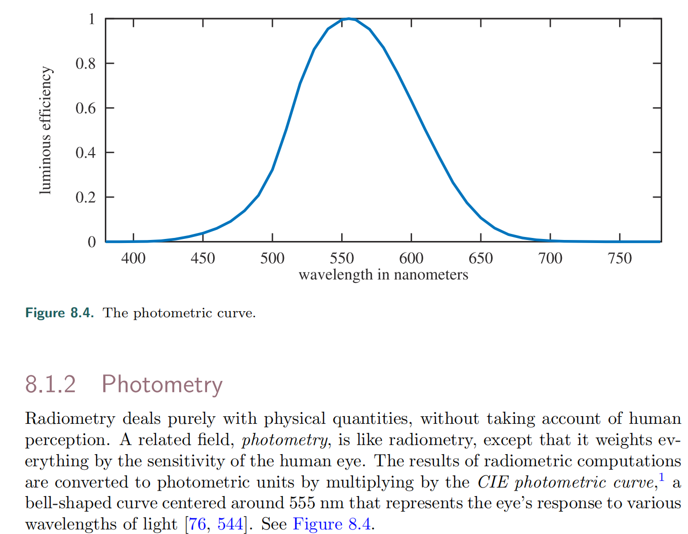
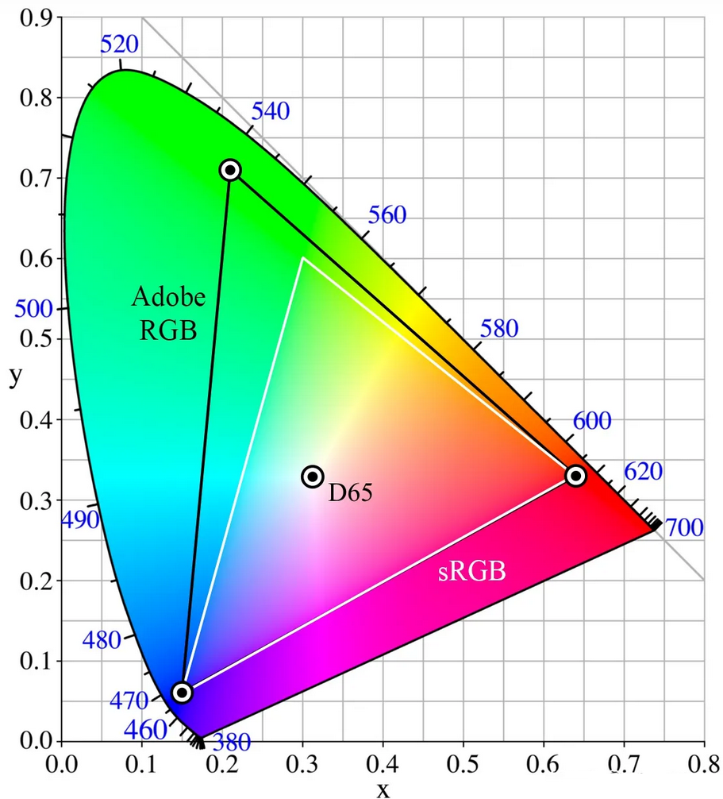
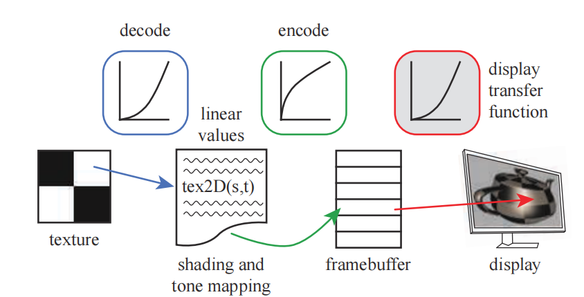
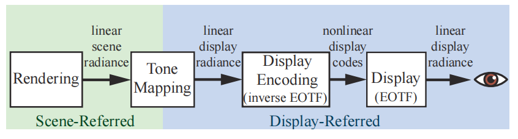
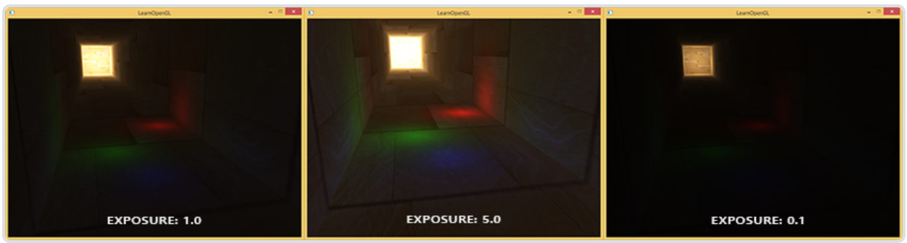

# 辐射度量学(Radiometry)

## 立体角

$$
I = \frac{\Phi}{\omega} \quad \omega = \frac{A}{r^2} \quad \omega:立体角\hfill \\
\mathrm d\omega = \frac{r \sin \theta \cdot \mathrm d\phi \cdot r \mathrm d\theta }{r^2} = \sin \theta \mathrm d\theta \mathrm d\phi \hfill \\
球面立体角:\omega = \iint_{S^2} \mathrm d\omega = \int_0^{2\pi} \mathrm d\phi \int_0^\pi \sin \theta \mathrm d\theta = 4 \pi \hfill \\
$$

- 立体角的单位为**球面度($sr$)，无量纲**

## 物理量

| 符号   | 名称                         | 含义                           | 单位              |
| ------ | ---------------------------- | ------------------------------ | ----------------- |
| $\Phi$ | 辐射通量(radiant flux)       | 单位时间内发出/吸收的能量      | $\mathrm{W}$      |
| $E$    | 辐照度(irradiance)           | 单位面积的辐射通量             | $\mathrm{W/m^2}$  |
| $I$    | 辐射强度(radiant iIntensity) | 单位立体角的辐射通量           | $\mathrm{W/sr}$   |
| $L$    | 辐射(radiance)               | 单位**投影面积**的**辐射强度** | $\mathrm{cd/m^2}$ |

## Spectral Power Distribution

- **SPD可以视为一个连续函数，或视为一个无穷维向量**

# 光度学(Photometry)

## 与辐射度量学的关系

$$
P=\frac{\int_0^\infty s(\lambda)k(\lambda) \mathrm d\lambda}{\int_0^\infty s(\lambda) \mathrm d\lambda}R \hfill \\
P:\mathrm{Photometry}中的某个物理量 \quad R:\mathrm{Radiometry}中与之对应的物理量 \hfill \\
s(\lambda):\mathrm{SPD}函数 \quad k(\lambda):\mathrm{Photometry \ Curve}函数 \hfill \\
$$

## 物理量

| 名称                         | 单位                       | 举例[1]                                                      |
| ---------------------------- | -------------------------- | ------------------------------------------------------------ |
| 光通量(luminous flux)        | $\mathrm{lm[=cd\cdot sr]}$ | 在任意包围光源的曲面上，通过光线的总亮度为$4\pi \ \mathrm{lm}$ |
| 光照度(illuminance)          | $\mathrm{lux[=lm/m^2]}$    | 距离光源0.1$\mathrm{m}$ ，法线与光线夹角为60°的微小平面上，辐照度为 $50 \mathrm{lux}$ |
| 光强强度(luminous intensity) | $\mathrm{cd}$              | 在空间中的任意位置，辐射强度为$1 \mathrm{cd}$                |
| 亮度(luminance)              | $\mathrm{nit[=cd/m^2]}$    | 距离光源$0.1\mathrm{m}$ 处观察光源时，亮度为$ 100 \mathrm{nit}$ |

[1]：假设光源为均匀发光的点光源，空间中没有其他物体（不用考虑折射、反射）

- $\mathrm{cd}$：**基本单位**之一；假设有一个光源，在某个方向上发出$540\times 10^{12} \mathrm{Hz}(556\mathrm{nm})$的单色辐射，且辐射强度为$\frac{1}{683} \mathrm{W/sr}$，则该方向上的光强度为$1 \mathrm{cd}$

*平面方向改变导致总光通量减小，所以平均光照度就等于总光通量除以总面积（不是除以投影面积）*

$$
L(\mathbf p,\mathbf l)=\frac{\mathrm d^2 \Phi(\mathbf  p,\mathbf l)}{\mathrm d\omega \mathrm d A \cos \theta}
$$

- 假设光源为均匀发光、未被遮挡的点光源：
  - 在光源的不同方位、不同距离处，辐射强度均相同
  - 其他条件不变时，离光源越近的表面，辐照度越高；被直射的表面，比被斜射的表面辐照度高
- 可以将**一条光线**视为**从某一点射出，或射入某一点（即无限小表面），始终占据无限小立体角**的事物

## 亮度与感知亮度

- **亮度(luminance)：单位投影面积的辐射强度经Photometry Curve转换而得的物理量**
- **感知亮度(brightness)：人眼感知光线后，产生的某种信号的强度**

## 渲染方程

$$
L_o(\mathbf p,\mathbf v,\mathbf n) = L_e(\mathbf p,\mathbf v) +L_r(\mathbf p,\mathbf v,\mathbf n) \hfill \\
L_r(\mathbf p,\mathbf v,\mathbf n)= \iint_\Omega L_i(\mathbf p,\mathbf l) (\mathbf l \cdot \mathbf n) f(\mathbf p,\mathbf l,\mathbf v,\mathbf n) \mathrm d\omega \hfill \\
注意到\mathbf l \cdot \mathbf n=\cos\langle \mathbf l,\mathbf n \rangle \quad (兰伯特余弦定理) \hfill \\
\\
\mathbf p:被观察点位置 \quad \mathbf v:由\mathbf p指向观察者位置的单位向量 \quad
\mathbf l:由\mathbf p指向光源(或反射源)的单位向量 \hfill \\
\mathbf n:\mathbf p处的单位法向量 \quad \Omega:以\mathbf p为中心,以\mathbf n为朝向的半球面(理论上总有\mathbf l \cdot \mathbf n \ge 0) \hfill \\
\\
L_o(\mathbf p,\mathbf v,\mathbf n):从\mathbf p沿\mathbf v方向发出和反射光线的总亮度 \hfill \\
L_e(\mathbf p,\mathbf v):从\mathbf p沿\mathbf v方向的自发光亮度 \hfill \\
L_i(\mathbf p,\mathbf l) :\mathbf 沿-\mathbf l射到\mathbf p的光线的亮度\hfill \\
L_r(\mathbf p,\mathbf v,\mathbf n) :从\mathbf p沿\mathbf v方向的反射光亮度 \hfill \\
f(\mathbf p,\mathbf l,\mathbf v,\mathbf n):\mathbf p处的双向反射分布函数(\mathbf{BRDF}) \hfill \\
\\
直接求解:L_r(\mathbf p,\mathbf l,\mathbf v,\mathbf n) 
=\iint_\Omega L_i(\mathbf p,\mathbf l,\mathbf v,\mathbf n) (\mathbf l \cdot \mathbf n) f(\mathbf p,\mathbf l,\mathbf v,\mathbf n) \mathrm d\omega \hfill \\
=\int_0^{2\pi} \mathrm d \theta \int_0^\frac{\pi}{2} L_i(\mathbf p,\mathbf l,\mathbf v,\mathbf n) (\mathbf l \cdot \mathbf n)f(\mathbf p,\mathbf l,\mathbf v,\mathbf n)\sin \phi \mathrm d\phi \hfill \\
其中,\mathbf l=\{\cos \theta\sin \phi,\sin \theta \sin \phi,\cos \phi\} \hfill \\
\\
对于均匀发光的点光源:I \equiv \frac{\Phi}{4\pi \ \mathrm{sr}} \quad L_i(\mathbf p) \equiv \frac{I}{r(\mathbf p)^2} \quad \hfill \\
\Phi:光源总功率 \quad I:光强度 \quad r(\mathbf p):光源到\mathbf p的距离 \hfill \\
$$

- 渲染方程是**二重积分**
- **渲染方程不涉及颜色，要将其用于着色，首先忽略不可见光，然后考虑可见光范围内的SPD；而SPD过于复杂，将其转换为线性颜色空间中的坐标，然后亮度相加变为线性颜色空间中的颜色相加**

# 色度学(Colorimetry)

- **颜色：人眼感知光线后，产生的某种信号**（注意与“颜色数据”、“颜色分量”、“颜色空间坐标”区分）
- **灰度(Grayscale)：用于描述亮度的一种数据**
- **色度(Chromaticity)：表示颜色的数据，可以分为亮度和色度；色度可以再分为色调和饱和度**

## 颜色与SPD

*上图中，两种不同的SPD在某个人看来可能是同种颜色（白色）；其他人看来则可能略有区别*

- （对于一个特定的人）**颜色根本上是由可见光范围内的SPD决定的**

## 人眼成像

- 人眼中，一般有三种视锥细胞，它们对不同波长的光敏感度不同，**三种细胞受到的刺激强度决定了颜色①**
- 不同人三种视锥细胞的数量不同（甚至种类不同/功能异常），导致不同人看相同SPD的光感知到的颜色不同
  - 对于三色视觉者，颜色①可以看成三维向量（每个分量上可分辨约100个值，总共能分辨约$100^3$种颜色①）
  - 对于四色视觉者，颜色①可以看成四维向量（总共能分辨约$100^4$种颜色①）
  - 对于任何人，**SPD到颜色①不可能是单射**

## 颜色空间

- **出于颜色①通常是三维向量的考虑，颜色空间也是三维的，颜色空间坐标与颜色②是双射**
- **SPD到颜色空间坐标不可能是单射（有严重信息损失）**

### 线性颜色空间

$$
有\mathrm{SPD}到颜色空间坐标的映射\mathbf{T},满足\mathbf{T}(\mathbf a+\mathbf b)=\mathbf{T}(\mathbf a)+\mathbf{T}(\mathbf b)的颜色空间是\textbf{线性颜色空间} \hfill \\
$$

- **可见光各波长处功率密度翻倍，则颜色空间中对应的坐标分量也翻倍，满足这样条件的颜色空间称为线性空间**
- **光线叠加的本质是SPD相加；在线性空间中，转换为坐标分量直接相加**

#### 线性RGB空间

$$
L=\int_0^\infty s(\lambda) \mathrm d\lambda \quad L'=\int_{380}^{780}s(\lambda) \mathrm d \lambda \hfill \\
R=\int_{380}^{780}s(\lambda)r(\lambda) \mathrm d \lambda \quad 
G=\int_{380}^{780}s(\lambda)g(\lambda) \mathrm d \lambda \quad 
B=\int_{380}^{780}s(\lambda)b(\lambda) \mathrm d \lambda \quad \hfill \\
L:亮度 \quad L':可见光亮度 \quad s(\lambda):\mathrm{SPD}函数 \hfill \\
$$

- 对于给定的SPD，将其与三个函数分别相乘，对波长积分，得到的三个值即RGB分量
- 某些SPD转换为RGB后得到的R分量可能为负数；换句话说，RGB被限定为正数时，无法表示所有（三色视觉者）可见颜色

#### 线性XYZ空间

$$
X=\int_{380}^{780}s(\lambda)\overline{x}(\lambda) \mathrm d \lambda \quad Y=\int_{380}^{780}s(\lambda)\overline{y}(\lambda) \mathrm d \lambda \quad 
Z=\int_{380}^{780}s(\lambda)\overline{z}(\lambda) \mathrm d \lambda \quad \hfill \\
$$

- **y曲线与Photometry Curve相同，因此亮度（或灰度）仅由Y分量决定**
- 显然，用RGB与XYZ坐标间的转换是不符合数学的，只存在经验公式

$$
x=\frac{X}{X+Y+Z} \quad y=\frac{Y}{X+Y+Z}\hfill \\
注意到,有一系列不同的(X,Y,Z)映射到同一个(x,y)上 \hfill \\
$$

- 限定$X+Y+Z=1$，则每个$(x,y)$对应一个颜色空间坐标，将这些坐标对应的颜色绘制到平面上，即得到**色度图**

### Gamma颜色空间

$$
常见的\mathrm{Gamma}校正公式:y=x^{1/\gamma} \quad (\gamma通常取2.2) \hfill \\
x:线性空间颜色分量 \quad y:\mathrm{Gamma}空间颜色分量 \hfill \\
$$

- 线性颜色空间坐标转换到Gamme颜色空间坐标的过程称为**Gamma校正**，逆过程称为**反Gamma校正**
- 最早的显示器使用**阴极射线管(CRT)**，其输出亮度近似和输入电压的2.2次幂成正比；**为了确保计算机最终输出的颜色分量和正确的输入电压成正比，渲染过程最终输出的颜色分量要进行Gamma校正**
- 人眼感知颜色的特性和CRT的特性有相似之处；**为了确保颜色分量均匀变化时，感知到的颜色也均匀变化，用户在各类软件中直接接触的颜色空间基本都是Gamma空间**
- **Gamma空间中坐标分量不可直接相加，不可用于计算灰度**

# 渲染过程中的颜色

## Spectral Rendering

- **依据SPD进行渲染**
- 理论上符合物理，但实际计算时的精度/计算量依然有限；用于电影、工业设计软件等精度要求高的场合
- 并不直接使用渲染方程，而是分别在各个波长上计算不同材质的反射等过程
- 可以规定光源发出光线的SPD
- 可以规定各种材质对不同波长的光线的反射率等信息

## RGB Rendering

- **依据RGB颜色分量进行渲染**

- 理论上并不符合物理，但很多场合已经能取得令人满意的渲染结果；常见于各类交互式应用
- 并不直接使用渲染方程，而是将渲染方程中的亮度改为颜色分量
- 光源的RGB和强度粗略反映了发出光线的SPD
- 纹理的RGB粗略反映了各种材质对不同波长的光线的反射率等信息

## 颜色数据处理

- inverse EOTF：将渲染结果重新编码的函数；目前实际采用的输入输出是线性空间颜色②和Gamma空间颜色②，所以编码过程包含Gamma校正
- EOTF：将编码值转换为光学值的函数，与显示设备硬件特性有关；目前实际采用的输入是Gamma空间颜色②，因此EOTF包含类似逆Gamma校正的计算过程
- OETF：将光学值转换为编码值的函数，与拍摄设备的硬件特性有关，和inverse EOTF不是一个事物
- **处理过程：**
  1. 对纹理颜色数据进行**反Gamma校正**
  2. 得到的线性空间颜色分量参与着色计算
  3. 对计算结果进行**Tone Mapping，将结果映射到LDR颜色分量范围内**
  4. 计算结果经由**inverse EOTF**转换为Gamma空间颜色分量，输出到帧缓冲中
  5. 帧缓冲中的颜色分量经**EOTF**转换为显示器发光元件的功率

- 现代游戏引擎中，还会使用**颜色分级(Color Grading)**，**白平衡(White Balance)**等技术进一步改善图像色彩

## 动态范围

- **动态范围**：（某时刻某个范围内）可变信号的最大值和最小非零值的比值
- 着色计算得到的颜色分量的动态范围可能很大，而发光元件的功率有限，未必能显示计算得到的颜色分量
- 图形学中，常讨论**渲染过程中颜色分量的动态范围**，或**显示器显示图像的动态范围**

| 动态范围 | 线性空间的颜色分量最大值 | 说明                    |
| -------- | ------------------------ | ----------------------- |
| HDR      | 不限制                   | 经Tone Mapping转换到LDR |
| LDR      | 1.0                      | 之后可以进行Gamma校正   |

## Tone Mapping

- **Tone Mapping：通过某种函数将整个非负数范围内的颜色值映射到一定范围内**
- Tone Mapping在线性颜色空间中进行，不改变颜色空间，但映射后线性颜色空间坐标已不能反映真实亮度

*上图中使用了一种较为简单的映射函数；更好地区分高亮度区域和更好地区分低亮度区域难以兼顾*

- 和强行截断超出范围的颜色分量相比，Tone Mapping使整幅图像颜色分量的平均值变低，而**平均对比度变高**

# 参考

《Real-Time Rendering 4th Edition》Chapter 8

GAMES104第七节： https://www.bilibili.com/video/BV1kY411P7QM/?spm_id_from=333.337&vd_source=bf10d44bb096091e7b1c2644e33ae726

LearnOpenGL：https://learnopengl-cn.github.io/