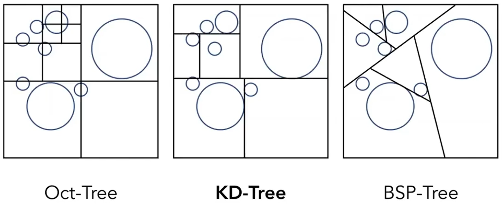
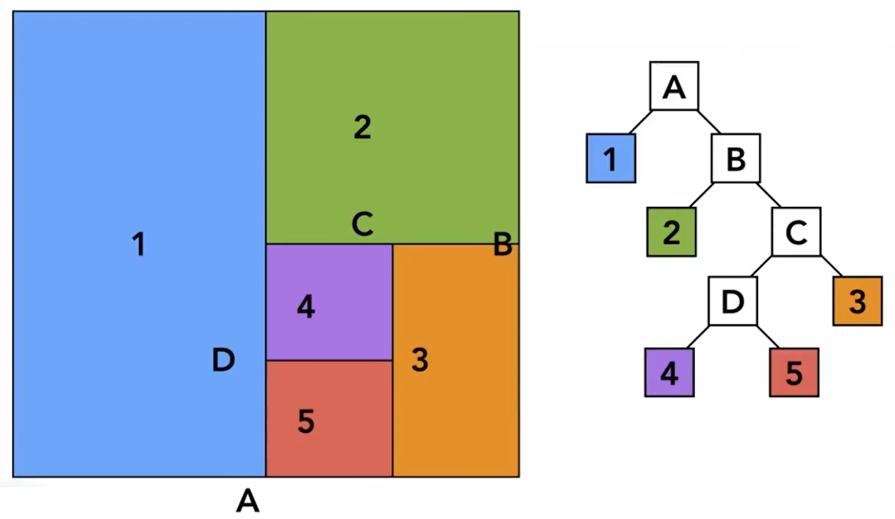
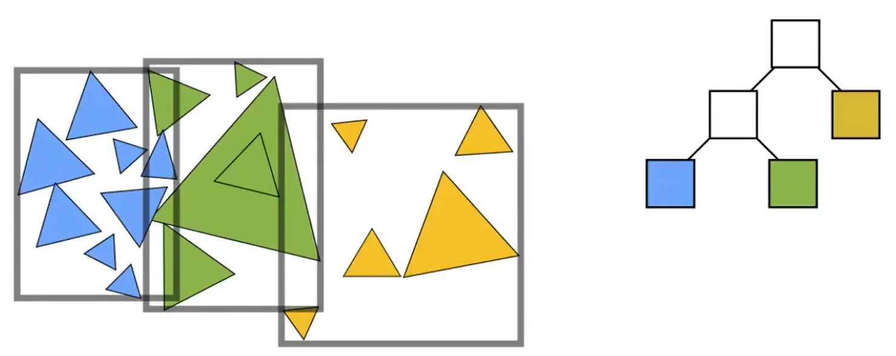
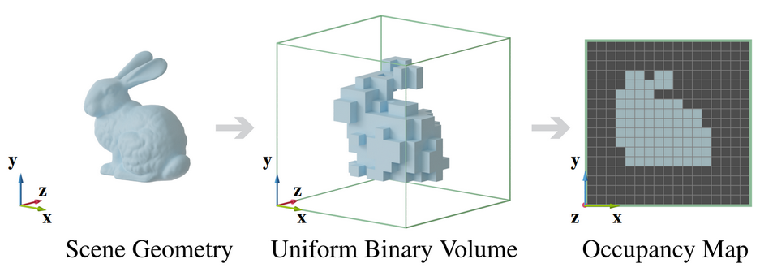
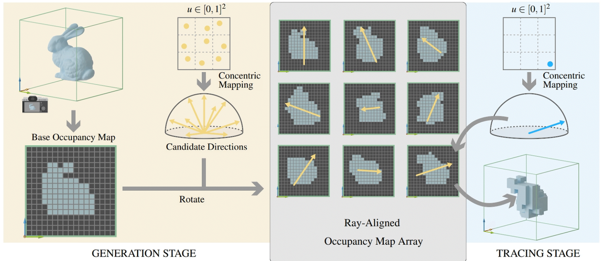
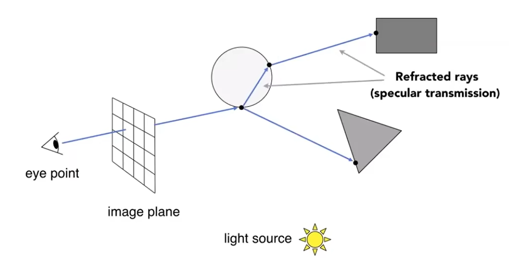

# 射线求交

- 在光线追踪中发挥重要作用，也用于射线检测等

## 与曲线方程

$$
以参数方程表示射线:\mathbf p = \mathbf o + t \mathbf d \quad (t>0) \hfill \\以曲面方程表示曲面:f(\mathbf p) = 0 \hfill \\
则交点满足:f(\mathbf o + t \mathbf d) = 0,解方程得到交点 \hfill \\
$$

- 没有通用的解法

## 与轴对齐长方体

- **等同于裁剪问题**

## 与网格

- **未使用任何场景划分时**，通常先判断射线与网格的**轴对齐包围盒**是否有交点；有交点再逐个与三角形面求交

**先与三角形所在平面求交，再判断是否位于三角形内:**
$$
以参数方程表示射线:\mathbf p = \mathbf o + t \mathbf d \quad (t>0) \hfill \\
以点法式表示平面:(\mathbf p -\mathbf p_0) \cdot \mathbf n = 0 \quad \mathbf p_0:平面内任意一点 \quad \mathbf n:单位法线 \hfill \\
则交点满足:(\mathbf o + t \mathbf d-\mathbf p_0)\cdot \mathbf n = 0 \Rightarrow t = \frac{(\mathbf  p'-\mathbf o)\cdot \mathbf n}{\mathbf b\cdot \mathbf n} \hfill \\
若t>0,求对应点\mathbf p_t,判断\mathbf p_t是否位于三角形内 \hfill \\
$$
**利用重心坐标判断是否有交点：**
$$
假设射线上一点在三角形P_0P_1P_2内部:\mathbf o+t\mathbf d=(1-b_1-b_2)\mathbf P_0+b_1\mathbf P_1 +b_2\mathbf P_2 \hfill \\
\Rightarrow 
\begin{bmatrix} t \\ b_1 \\ b_2 \end{bmatrix}
=\frac{1}{\mathbf s_1 \cdot \mathbf{P_1P_0}} 
\begin{bmatrix} 
\mathbf s_2 \cdot \mathbf{P_0P_2} \\ 
\mathbf s_1 \cdot \mathbf{P_0O} \\
\mathbf s_2 \cdot \mathbf d
\end{bmatrix} \quad 其中\mathbf s_1=\mathbf d \times \mathbf{P_0P_2},\mathbf s_2 = \mathbf{P_0O} \times \mathbf{P_0P_1} \hfill \\
若t>0,b_1>0,b_2>0,b_1+b_2 < 1,则射线与三角形有交点 \hfill \\	
$$

# 场景划分

- **进行射线求交等计算时，通常先快速粗略地判断哪些物体需要计算，然后再逐个进行精确计算**

## 空间划分(Spatial Partitions)

- **将整个空间划分为若干个不相容的区域，形成某种数据结构**
- **物体可能同时属于若干个区域，需要某种方式避免重复求交计算**

### 均匀(Uniform)空间划分

- 将空间划分为大小相同的网格，**每个网格记录哪些物体占用了自身**
- 空间划分过程：
  1. 统计物体总数，以及各个物体的空间范围，进而确定整个空间的范围
  2. 将空间划分为**数量合适**（习惯上，网格总数=30×物体总数）的网格
  3. 遍历每个物体，计算其占用的网格，更新网格数据
- 射线求交过程：
  1. 将射线“离散化”，计算其经过的网格
  2. 获取每个经过网格中记录的的物体，逐个与之求交
- 时间和空间开销较大，主要是因为物体分布不均匀

### K-Dimensional-Tree

- 逐步划分空间，形成树状结构
- 不论是否为叶节点，其对应区域必然为**轴对齐长方体**
- **仅叶节点记录哪些物体占用了自身对应的区域**
- 空间划分过程：？
- 射线求交过程：
  1. 使用一个队列记录节点，一开始令根节点入队
  2. 如果队列中没有节点，结束；如果队列中有节点，出队一个节点，计算射线是否经过该区域
  3. 如果经过，且当前节点为叶节点，令射线与该节点记录的所有物体求交；如果为非叶节点，令其子节点入队。回到2

### Occupancy Map

## 物体划分(Object Partitions)

- **以每个物体为最小单元，划分到某种数据结构中**
- **数据结构中的各个（"同级"）元素，其占用的区域可能有所重合，但其包含的物体不会重合**

### Bounding Volume Hierarchy(BVH)

- 逐步划分物体，形成树状结构
- **每个叶节点直接与单个物体的包围盒一一对应；每个非叶节点则记录了包围其所有子物体的包围盒**
- 物体划分原则：
  - 一开始，所有物体属于同一个根节点
  - 对节点逐层划分，直到得到的叶节点仅包含一个物体
  - 划分一个节点时，总是选择一个坐标轴（例如，某结点包围盒**x轴方向最长**，则选择x轴），其中物体**按照其位置的x分量排序**，前半和后半分别分入一个子节点
- 射线求交过程：
  1. 使用一个队列记录节点，一开始令根节点入队
  2. 如果队列中没有节点，结束；如果队列中有节点，出队一个节点，计算射线是经过该包围盒
  3. 如果经过，且当前节点为叶节点，令射线与该节点对应的物体求交；如果为非叶节点，令其子节点入队。回到2
- 不会出现同一物体属于多个节点，以及划分不均匀的问题
- **光线追踪中使用的划分方式（划分的单位不是物体，而是三角形面）**

### Occupancy Map

- 将场景离散化为均匀网格，用体素记录场景中所有（遮光）物体的几何，用于之后的光线求交运算
  - Occupancy Map不必是立方体，注意世界空间坐标到网格坐标的变换即可
- 目标是用于实时渲染，因此分辨率不能过高（以下以128^3为例）
  - 用分辨率128^2的纹理即可表示（Z方向128格的数据可以被压缩到一个16Byte颜色值中，相当于掩码）
  - 相比之下，Distance Field的生成慢得多
- 用一个包围场景的正交相机，然后从该相机出发渲染场景
  - 相机范围即Occupancy Map的范围，二者的分辨率不必相同（相机的分辨率越高，小物体越有可能写入OM）
  - 光栅化时，结果不输出到屏幕，而是修改OM（OM的每个像素位置上，各个深度的片元会修改该像素记录的掩码）
- 光线求交时，换算到Occupancy Map坐标系
  - 光线与Occupancy Map坐标系Z轴不重合，求交时只能小幅度步进，效率低
  - 由于分辨率有限，结果十分粗糙

### Ray-aligned Occupancy Map Array

- **在上半球面**内均匀地选择一些方向，在所有这些方向上生成Occupancy Map
- 着色时，选择一个**Z轴方向**与片元**法线方向**最接近的Occupancy Map来采样
  - 与Z轴正方向还是反方向接近都可以（注意坐标变换），正因此只需要在上半球面内而非球面内选择方向

# 光线追踪

- **光线追踪通常被用于光栅化的着色这一步中，计算间接光照，而不是整个取代光栅化渲染管线**
- 光线追踪中对光的假设：
  - 总是沿直线传播
  - 一切光线互不干涉
  - 光路总是可逆的
- 光线在物体表面发生反射和折射时，均会发生分散，不再完全集中为一条直线。反射的分散称为**漫反射**，折射的分散称为**散射**

## Ray Casting

- 原始的光线追踪，仅计算**直接光照**
- 渲染过程：
  1. 对于每个像素，**从相机向该片元发出射线**
  2. 计算射线与场景中物体的第一个交点
  3. 根据交点坐标，获取材质信息（包含光线反射率）
  4. **连接交点与光源**，计算入射光亮度，进而计算反射入成像点的光线亮度

## Whitted-Style Ray Tracing

- 渲染过程：
  1. 类似Ray Casting，计算第一个交点
  2. 计算交点的**镜面反射**和**折射(不考虑散射)**光路，进而计算交点；不断递归的（有次数上限）
  3. 对于递归树上的叶节点，考虑光源直射该点，然后反射到上一级节点的光亮度；逐级递归，最终汇总到第一个交点
- **物体表面材质各不相同，总是可以分成反射、折射、漫反射的部分，漫反射的部分的计算方式和光栅化渲染管线相同（只考虑光源直射后的漫反射）**
- 由于未考虑散射，渲染结果不真实

## Monte Carlo Path Tracing

$$
蒙特卡洛积分: \hfill \\
有函数g(\mathbf x),\mathbf x \in D,随机变量\mathbf X满足\int_{D}f_X(\mathbf x)\mathrm d\mathbf x=1 ,且f_X(\mathbf x)>0\hfill \\
则\int_{D}g(\mathbf x)\mathrm d\mathbf x = \int_{D}\frac{g(\mathbf x)}{f_X(\mathbf x)}f_X(\mathbf x) \mathrm d\mathbf x =E\left[\frac{g(\mathbf x)}{f_X(\mathbf x)}\right] \approx \frac{1}{N}\sum_{i=1}^N \frac{g(\mathbf X_i)}{f_X(\mathbf X_i)} \hfill \\
\\
蒙特卡洛积分计算渲染方程: \hfill \\
L_r(\mathbf p,\mathbf v)= \int_{\Omega^{+}} L_i(\mathbf p,\mathbf l) (\mathbf l \cdot \mathbf n) f(\mathbf p,\mathbf l,\mathbf v) \mathrm d\omega 
\approx \frac{1}{N}\sum_{i=1}^n \frac{L_i(\mathbf p,\mathbf l_i) (\mathbf l_i \cdot \mathbf n) f(\mathbf p,\mathbf l_i,\mathbf v)}{f_{\Omega}(\omega_i)} \hfill \\
若进行均匀采样,f_{\Omega}(\omega_i)=\frac{1}{2\pi} \hfill \\
$$

- 渲染过程：
  1. 类似Ray Casting，计算交点
  2. 在交点处半球面（如果要计算折射，改为球面）范围内进行**"随机"采样**，计算随机方向上的反射光路（递归的，通常会设置次数上限）
  3. 对于递归过程中计算出的每个交点，获取材质信息（包含光线反射率、折射率），并计算入射光亮度
  4. 根据各交点的入射光亮度，逐级回溯（每次折射、反射均损失部分亮度），以**蒙特卡洛积分法**得到射入成像点的光线总亮度
- 本质上，蒙特卡洛积分是用离散点的平均值代表整个积分范围内函数的平均值
  - 均匀采样时，每个点的值对积分的贡献相同；故意在某个范围内高频采样时，这些点的值对积分的贡献应当削弱
  - 采样方向不够多时，如果采样方向固定不变则可能导致物体表面明暗相间（空间噪声），采样方向改变可能导致同一个位置忽明忽暗（时间噪声）
