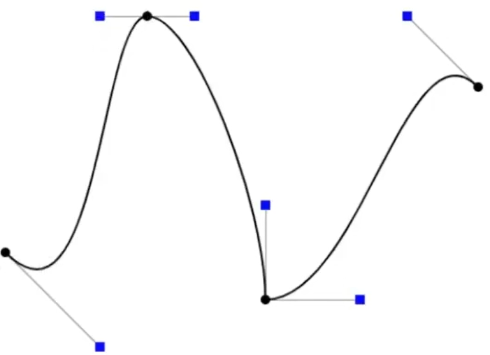
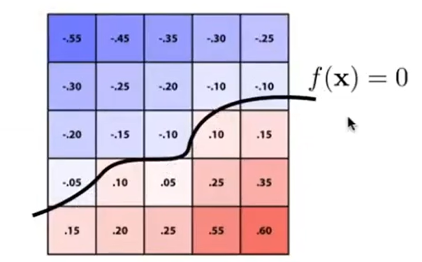
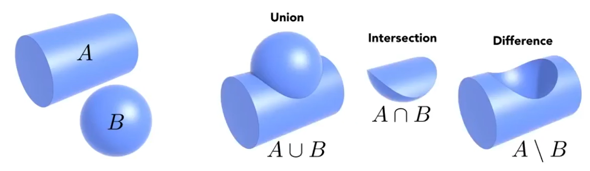
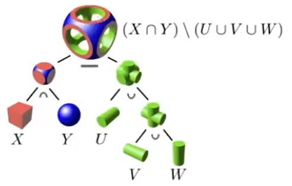

# 渲染管线

## 概念

- **通道(Pass)**：利用各种数据进行计算，最终渲染到某个缓冲区的过程（如OpenGL中glDrawArrays等API**可能**标志着一个通道完成）
  - 输入包括参数、纹理、其他缓冲区的渲染结果、着色器等
  - 渲染到各种缓冲区的过程都可以称为通道，如：颜色通道，光照通道，阴影通道，深度通道，后处理通道，透明通道等
  - 通道并不固定，可以为了实现某种渲染效果专门增加通道，如：法线通道，Bloom通道，环境光遮蔽通道，抗锯齿通道等
  - 没有明确划分方式，如颜色通道、光照通道、阴影通道、深度通道等通道都是片元着色通道的一部分
  - 多个通道间可能是并行关系，也可能是先后关系
- **顶点缓冲区(Vertex Buffer)**：**显存**中的一个区域（注意与缓存区分），逐个储存顶点数据
  - **顶点数组(Vertex Array)**：记录某个顶点缓冲区中的数据布局（仅一份数据，而不是与顶点数量成正比）
- **索引缓冲区(Index Buffer)**：**显存**中的一个区域，逐个储存构成图元的顶点索引的缓冲区（**图元类型**规定了索引怎样组合、组合成哪种图元）
- **帧缓冲区(Frame Buffer)**：**显存**中的一个区域，记录当前帧的渲染结果
  - **帧缓冲附件(Attachment)**：渲染结果由多个缓冲区（颜色，深度，模板，……）组成，每个缓冲区称为一个附件
- **渲染目标(Render Targets)**：帧缓冲附件的别称，可以根据数据类型的不同分类
  - Multiple Boolean：参与逻辑运算的布尔型缓冲区，用于遮罩等功能

  - Floating Point：浮点数缓冲区，用于存储深度、粗糙度、金属度等

  - Vector-Type：矢量型缓冲区，用于存储颜色、法线等
- **视图(View)**：呈现出某种功能的访问对象，一个缓冲区可以在不同时机扮演不同的视图（类似数据库和视图的关系）
  - **Shader Resource View**：用作着色器输入的缓冲区，**只读**
  - **Render Target View**：用于接收输出的缓冲区，**只写（无法读取已经写入的值，因此一个纹素无法分多次写入）**
  - **Unordered Access View**：可**随机读写**（着色器能够写任意位置，而非与片元一一对应）的缓冲区，常用于计算着色器
- **图元(Primitive)**：各种平面图形，其中点、线、三角形面是**基础图元**
  - **逻辑概念，并不是独立的数据结构**
- **前向(Forward)**：与延迟(Deferred)相对的概念，指某种过程能够流水线式并行，一份数据在一条流水线上连续地被处理，无需等待上一步处理完所有数据

## 典型前向渲染管线

1. 应用阶段：
   1. 进行**初步剔除**（遮挡剔除，层级剔除，视锥剔除）
   2. CPU向GPU发送数据：顶点（位置、法线、颜色）、变换、纹理、光源、材质（着色器、参数）等数据
   3. CPU发出Draw Call
2. 几何阶段：将三维数据映射到屏幕空间
   1. **顶点(Vertex)着色**：根据顶点着色器对顶点进行**模型变换**（模型空间→世界空间），**观察变换**（世界空间→观察空间），**投影变换**（观察空间→裁剪空间）（合称**MVP变换**）
   2. 曲面细分(Tessellation)：可选的，增加三角形面及顶点的数量
   3. 几何(Geometry)着色：可选的，对输入的图元以给定的规则进行变换、修改
   4. 流输出：可选的，将裁剪空间下的顶点数据直接输出到某些缓冲区中
   5. 图元装配：根据顶点索引数组及图元类型，将处理后的顶点数据分组传给后续步骤
   6. 背面剔除：剔除法线方向不朝向屏幕的图元
   7. 齐次裁剪：由硬件自动进行**齐次除法**（裁剪空间→NDC），并裁剪范围外的图元
   8. 屏幕映射：进行**视口变换**（NDC→屏幕）
3. **光栅化(Rasterization)**阶段：将图元离散成片元，
   1. 片元生成：对于每个图元，将其离散化为片元，更新**深度缓冲**，传给片元着色器（不透明物体着色时启用**Early-Z**）
   2. 片元着色：根据片元着色器进行**着色计算**
   3. 测试混合：（仅半透明物体着色时）对各像素位置上的若干个片元进行**测试混合**，更新**透明度缓冲、颜色缓冲**等
4. 像素后处理(pixel processing)阶段

- **典型的前向渲染管线可以分为三个通道：不透明物体通道，透明物体通道，后处理通道**
  - 每个通道内部，每个步骤均**流水线式并行**，中间数据均存在缓存中，不同通道间串行

## 延迟渲染(Deferred Rendering)

- 延迟渲染中使用的多组缓冲区统称为**Geometry Buffer(G-Buffer)**
  - 输入输出并不是单向的，某些缓冲区可能会被多轮查询、多轮更新
  - 多组缓冲区可以看成多张贴图，每张存储不同信息，如深度、法线、纹理颜色、粗糙度、金属度、漫反射颜色、镜面反射颜色等
  - 每个像素位置上始终只维护一套信息
- 延迟渲染本身无法处理半透明物体，因为**深度、法线等数据只能覆盖，不能混合**；半透明物体只能用前向渲染管线
- 典型延迟渲染管线：
  1. 应用阶段、几何阶段与前向渲染管线一致
  2. 由图元生成片元，不断更新G-Buffer（同样使用Early-Z，**一定程度上避免各种输入数据的Overdraw**）
  3. 等G-Buffer第一轮彻底更新完毕，再计算各个光源产生的光照（**完全消除光照计算的Overdraw**）
  4. 后处理
- **光照计算量=像素数×光源数×Overdraw程度**，前向渲染引入Early-Z消除部分Overdraw，延迟渲染则消除的更彻底
  - 代价是**降低并行度，显存带宽占用大，着色算法灵活性受限**
  - 要缓解光源数量增加导致的计算量增大，可以**分块（而不是逐像素）计算是否被光源照射**，即**分块延迟渲染**
- 为了降低带宽占用，可以改为存储ID而非具体数据，这种情况下缓冲区统称为**Visibility Buffer(V-Buffer)**
  - 通过**图元ID**获取图元，计算各顶点在各空间的位置
  - 根据图元顶点的屏幕坐标和片元屏幕坐标能够计算出纹理坐标（也可以仍然直接存）
  - 通过**材质ID**获取材质，再通过纹理坐标计算出每个片元的材质参数（各种贴图类似）

## 应用阶段

### 初步剔除

- **初步剔除的单位是物体（网格/模型），而不是顶点**
- 通常由CPU完成，也可以提前由GPU完成

#### 遮挡剔除

- 剔除被前面的物体**完全**遮挡的物体

#### 视锥剔除

- 剔除**完全**处于视锥外的物体

#### 层级剔除

- 根据开发者设置的参数直接剔除某些物体（如Unity中的Culling Musk）

### Draw Call

- **Draw Call**是由CPU向GPU发出的一条**绘制指令**，每条指令渲染若干个图形（如`glDrawElements`）
- **批量渲染(Batch)**可以减少CPU与GPU的通信次数，以降低开销；常见的做法是把多个对象使用的缓冲区分别合成，一次性发送
  - 类似于SIMD，数据各不相同，但计算过程（着色器）必须相同
- CPU与GPU**流水线式并行**，Draw Call存放在GPU缓冲区中，CPU不必等到GPU完成一个渲染命令才发送下一个渲染命令

## 几何阶段

- **输入：顶点缓冲区、索引缓冲区，顶点着色器等**
- **输出：处理过的顶点数据、索引（暂存在缓存中）**
- 以下所有空间中，均假定使用**左手系**，即$\mathbf y \times \mathbf x = \mathbf z$（Unity和Unreal使用左手系，而OpenGL使用右手系）

### 顶点着色

- **输入：顶点数据（VBO逐步读取到缓存中，然后逐顶点传递给顶点着色器）**
- **输出：空间变换后的顶点数据（逐顶点地输出，暂存在缓存中）**
- 顶点着色器的基本是处理坐标变换，输出**裁剪空间**坐标
  - 如有法线数据，通常会被变换到**世界空间**
  - 颜色等空间无关的数据通常会原样传递下去
  - 如有需要，输出可以附带变换过程中的其他坐标

- **并行调用顶点着色器的过程中，空间变换后的顶点数据在缓存中不再保持顺序，需要用标识符来索引；需要用一系列的标记位来记录各个顶点是否处理完成，以便尽早开始下一步，以确保并行性（后续的步骤中也类似）**

#### 模型空间

- 以模型的指定点为原点，模型的右方为x轴，上方为y轴，前方为z轴
- 坐标有xyzw分量。为了进行变换运算，加入额外的w分量（表示坐标的向量，其w为1；表示矢量的向量，其w为0）

#### 世界空间

$$
\mathbf{P}_{world}=\mathbf{M}_{model}\mathbf{P}_{model} 
\quad \mathbf{M}_{model} = \mathbf T \mathbf R \mathbf S \hfill \\
\mathbf S=
\begin{bmatrix}
r & 0 & 0 & 0 \\
0 & s & 0 & 0 \\
0 & 0 & t & 0 \\
0 & 0 & 0 & 1 \\
\end{bmatrix} \hfill \\

\mathbf R =
\begin{bmatrix}
1 & 0 & 0 & 0 \\
0 & \cos \alpha & -\sin \alpha & 0 \\
0 & \sin \alpha & \cos \alpha & 0 \\
0 & 0 & 0 & 1 \\
\end{bmatrix}
\begin{bmatrix}
\cos \beta & 0 & -\sin \beta & 0 \\
0 & 1 & 0 & 0 \\
\sin \beta & 0 & \cos \beta & 0 \\
0 & 0 & 0 & 1 \\
\end{bmatrix}
\begin{bmatrix}
\cos \gamma & -\sin \gamma & 0 & 0\\
\sin \gamma & \cos \gamma & 0 & 0\\
0 & 0 & 1 & 0\\
0 & 0 & 0 & 1 \\
\end{bmatrix} \hfill \\

\mathbf T = \begin{bmatrix}
1 & 0 & 0 & x \\
0 & 1 & 0 & y \\
0 & 0 & 1 & z \\
0 & 0 & 0 & 1 \\
\end{bmatrix}
\hfill \\
(x,y,z):物体坐标 \quad (\alpha,\beta,\gamma):物体欧拉角 \quad (r,s,t):物体缩放 \hfill \\
$$

- **旋转矩阵的顺序不可交换，默认情况下按照zyx的顺序应用旋转（符合上面公式）**
- 由模型空间经**模型变换**而得，引擎预设好原点，右方为x轴，上方为y轴，前方为z轴
- **缩放→绕模型自身的坐标轴旋转→平移**

#### 观察空间

$$
\mathbf{P}_{view}=\mathbf{M}_{view}\mathbf{P}_{world} 
\quad \mathbf{M}_{view} = \mathbf R \mathbf T \hfill \\

\mathbf R =
\begin{bmatrix}
1 & 0 & 0 & 0 \\
0 & \cos \alpha & \sin \alpha & 0 \\
0 & -\sin \alpha & \cos \alpha & 0 \\
0 & 0 & 0 & 1 \\
\end{bmatrix}
\begin{bmatrix}
\cos \beta & 0 & \sin \beta & 0 \\
0 & 1 & 0 & 0 \\
-\sin \beta & 0 & \cos \beta & 0 \\
0 & 0 & 0 & 1 \\
\end{bmatrix}
\begin{bmatrix}
\cos \gamma & \sin \gamma & 0 & 0\\
-\sin \gamma & \cos \gamma & 0 & 0\\
0 & 0 & 1 & 0\\
0 & 0 & 0 & 1 \\
\end{bmatrix} \hfill \\

\mathbf T = \begin{bmatrix}
1 & 0 & 0 & -x \\
0 & 1 & 0 & -y \\
0 & 0 & 1 & -z \\
0 & 0 & 0 & 1 \\
\end{bmatrix} \hfill \\

(x,y,z):相机坐标 \quad (\alpha,\beta,\gamma):相机欧拉角 \hfill \\
$$

- 由世界空间经**观察变换**而得，常以相机的右方为x轴，上方为y轴，前方为z轴
- **平移→绕相机的坐标轴旋转**

#### 裁剪空间

$$
\mathbf{P}_{clip}=\mathbf{M}_{proj}\mathbf{P}_{view}
$$
*以上矩阵中已经包含了齐次除法，所以从观察空间坐标变换到了NDC*

- 由观察空间经**投影变换**而得，相机拍摄的范围被压缩成**长方体**
  - w的值被修改，为齐次除法作准备
- 正交投影和透视投影的矩阵统称为**投影矩阵**；模型变换、观察变换、投影变换合称**MVP变换**
  - 透视投影可视为两次变换的叠加，第一次先将平截头体“压缩”为长方体，之后的步骤和正交投影相同

- **片元着色器的输出就是裁剪空间坐标**

### 曲面细分

- **输入：顶点数据（VB和EB读到缓存中）**
- **输出：细分后的顶点数据**
- 在这一步已经出现图元的概念，需要根据顶点索引查找顶点数据
- 增加三角形面及顶点的数量，在一定程度上改变表面形状

### 几何着色

- **输入：顶点数据**
- **输出：修改后的顶点数据**
- 以给定的规则对输入的图元进行变换、修改

### 图元装配

*右上图中，没有体现图元装配这一步（位于Geometry Program和Interpolation之间）*

- **输入：处理过的顶点数据**
- **输出：结合好的顶点数据**
- 根据缓存中的**顶点数据、顶点索引**及**图元类型**（如上图），每次将**一组顶点数据**传给后续步骤
  - 非基本图元会被拆分成**基本图元**，一组顶点即一个基本图元中的若干个顶点
  - GPU程序访问标志位，判断一组顶点是否都已处理完成，一旦完成便可开始图元装配
  - 设置图元类型根本上是在设置后续步骤中处理图元的程序（如是否启用曲面细分，采用哪种光栅化方式）
  - 图元类型的设置由Draw Call完成，现代图形API支持**图元重启**（在一次Draw Call内切换图元类型）
  - 图元在后续的步骤中会连续地传递下去，直到调用片元着色器（相当于一连串嵌套的函数调用，因此后续步骤不需要再确认顶点连接）

### 背面剔除

- 如果一个三角形图元的法线不朝向屏幕，将其剔除，这一组顶点数据不再向下传递
- 曲面细分和几何着色可能新增不同朝向的三角形面，因此背面剔除必须在其之后进行

### 齐次裁剪(NDC)

$$
\mathbf{P}_{ndc}=\frac{1}{w_{clip}}\mathbf{P}_{clip} \hfill \\
\\
w_{clip}未知的情况下,由\mathbf{P}_{ndc}计算\mathbf{P}_{view}: \hfill \\
\mathbf{P}_{ndc}=\frac{1}{w_{clip}}\mathbf{M}_{proj}\mathbf{P}_{view} \hfill \\
\Rightarrow \mathbf{M}_{proj}^{-1}\mathbf{P}_{ndc} = w_{clip}\mathbf{P}_{view} \quad \hfill \\
记左边向量的的w分量为w_0,则w_0=w_{view}w_{clip}=w_{clip} \quad (w_{view} \equiv 1) \hfill \\
\Rightarrow \mathbf{P}_{view} = \frac{1}{w_0}\mathbf{M}_{proj}^{-1}\mathbf{P}_{ndc} \hfill \\
$$

- **输入：顶点数据（每次处理一组）**
- **输出：裁剪过的顶点数据（每次输出若干组）**
- 裁剪空间中各点经过**齐次除法（每个点除以自身的w分量）**得到**归一化设备坐标(Normalized Device Coordinates,NDC)**
  - **齐次除法中，每个顶点的w不同，这导致每个顶点的整体变换矩阵不同**
- 相机的拍摄范围被压缩为**长方体（最小点$[-1,-1,-1]$，最大点$[1,1,1]$，有些图形API中Z的取值范围是$[0,1]$）**，此范围外的图元被**裁剪**，裁剪时可能产生新图元

### 屏幕映射

$$
\mathbf{P}_{screen}=\mathbf{M}_{viewport}\mathbf{P}_{ndc} \hfill \\
\mathbf{M}_{viewport} =
\begin{bmatrix}
\frac{w}{2} & 0 & 0 & \frac{w}{2} \\
0 & \frac{h}{2} & 0 & \frac{h}{2} \\
0 & 0 & 1 & 0\\
0 & 0 & 0 & 1\\
\end{bmatrix} \hfill \\
w:屏幕宽度 \quad h:屏幕高度 \hfill \\
$$

- **输入：顶点数据（每次处理一组）**
- **输出：裁剪过的顶点数据（每次输出若干组）**
- NDC经**视口变换**得到**屏幕空间坐标**，相机拍摄区域被压缩为长方形
- 屏幕不一定是最终输出的窗口，也可能是中途的FBO，其分辨率不确定
- **片元着色器的输入的其中一部分就是屏幕空间坐标**

## 光栅化阶段

- **输入：图元，材质，片元着色器等**
- **输出：更新帧缓冲（包括颜色缓冲，深度缓冲等）**
- **深度缓冲(Z-Buffer)：每个像素上，当前已渲染的片元的最小深度**
  - **深度：正数，到相机越近，值越小；深度是NDC坐标Z分量的一次函数**
  - **深度测试：比当前像素位置记录的深度小的片元才能通过测试，并更新深度值（半透明片元不更新）**
- **模板(Stencil)缓冲：可选的，常用于实现遮罩等功能**
  - **模板测试：人为定义通过模板测试的规则，符合此规则的片元才会被保留，并按照人为定义的规则更新模板缓冲**
- **帧(Frame)缓冲：颜色、深度、模板等缓冲构成的整体**

### 片元生成

- 计算**基础图元（不只有三角形）**覆盖的区域，离散化为片元，更新**深度缓冲**，并调用片元着色器
- 现代GPU支持**Early-Z**，即在这一步直接舍弃深度测试不通过的片元
  - Early-Z只能用在不透明物体渲染上，因此要分成两个通道，仅不透明通道启用Early-Z
  - 深度测试和片元着色流水线式并行，因此不会彻底消除Overdraw
- 现代GPU中，会**对屏幕分块，分多轮处理新生成的图元，每轮中按顺序对每块进行光栅化**
  - 每当几何阶段生成出一个**图元**，便可**立即光栅化**，这样并行度最高，但对显存的访问非常随机，缓存命中率很低
  - 可以等待所有图元生成完，再**按顺序**在**每个像素位置**上进行若干次光栅化，这样缓存命中率最高，但并行度最低
  - 块的形状是正方形，因为这样能降低图元跨越多个块的概率，显存中**每块内数据连续**（而不是每行或每列）
- 默认情况下，**每个片元中心有一个采样点，图元覆盖该点则视为覆盖片元**
  - **启用MSAA时，片元内部有多个采样点，要计算“覆盖值”**（“覆盖值”会影响**测试混合**，但**每个片元依然只着色一次**）
  - **启用保守光栅化时，只要三角形与片元有交集，即视为覆盖片元**
  - **延迟渲染需要生成多个纹理，保守光栅化或MSAA的开销过大**
- 总体过程：
  1. 当生成图元进行到一定程度（通过数量、时间、硬件状态等依据来判断），开始处理本轮生成的图元
  2. 遍历所有图元，根据其AABB获取可能与之相交的块，然后逐块判断；记录每块分别与哪些图元相交（不与任何图元相交的块后续直接忽略）
  3. 对于每一块，利用**逐像素算法**和**SIMD**计算出图元覆盖区域的**掩码**（每个与这一块相交的图元分别计算出一个掩码）
  4. 对于每个掩码，获取其覆盖的片元，更新深度缓冲
  5. 对于通过深度缓冲的片元，**分组**调用片元着色器（深度缓冲更新和片元着色同步进行，因此没有彻底消除Overdraw）
- GPU会确保**来自同一个图元且相邻的2x2个片元**一同调用片元着色器，以支持求导（`ddx`和`ddy`）
  - 对于不足2x2的部分，会额外发出Helper Invocation，这些调用执行相同的代码，但不写入任何缓冲
  - Helper Invocation会直接根据调用位置确定重心坐标，因此**图元小于片元时，求导算结果仍能反映各个变量的空间变化率，但不能反映图元大小**

- **片元着色器的输入和顶点着色器的输出数据结构相同，但片元和顶点并非一一对应；生成片元时，获取其所在图元的个顶点的输出值，自动根据重心坐标计算插值，作为片元着色器的输入**
  - **即使启用了MSAA，也依然用片元的中心点计算重心坐标**
- 理论上，从片元生成开始，开始发生走样（几何阶段仅存在浮点误差）

### 片元着色

- **（并行地）逐片元**调用片元着色器，片元着色器被调用的次数通常远多于其他着色器

- 进行**纹理映射**，确定着色所需的所有材质参数
- 进行**光照计算**，根据光源颜色、光照强度、物体和光源的几何关系计算**光照颜色**
  - 理论上光源有SPD，经过积分得到RGB分量；而实际上光源颜色和光照强度直接规定了初始光照颜色
  - 光照通常分为**直接光照**、**环境光照**、**间接光照**，以不同方式分别计算其颜色，然后相加得到光照颜色
  - **阴影计算**得到可见度值，通常用于与直接光照颜色相乘，某些方法中，也要考虑环境光照、间接光照的可见性

### 测试混合

- 执行**深度测试、模板测试**，通过测试的片元进行**混合**

  - 启用Early-Z的情况下，仅透明物体不需要执行深度测试；这一步中深度缓冲是只读的

- **透明度缓冲：当前已处理片元混合后的透明度**
  - **透明片元必须按深度由大到小排序，按顺序渲染**

- 最常见的混合方式：新前景色 = alpha × 前景色 + （1 - alpha）× 背景色

## 后处理阶段

- 对颜色缓冲中的像素进行额外处理，通常使用额外的通道来完成

# 几何体表示

- 不论显示还是隐式表示，描述几何体时可能使用不同种类的**对象**：
  - **顶点**：网格
  - **内点**：曲线/曲面方程，Bezier曲线
  - **离散点**：点云
  - **立方体**：体素
  - **基本几何体**：CSG，过程生成

## 曲线连续性

- **函数连续点：左极限、右极限、函数值均存在且相等；任意阶导数（若存在）也都是不同的函数**
- 讨论连续性时，通常用**参数方程**表示曲线，将一组参数方程视为一个函数，**该函数的值和任意阶导数(若存在)均为向量**

$$
有参数方程表示的曲线\mathbf v(t):\hfill \\
\mathbf v_{+}(t_0)=\mathbf v_{-}(t_0) \Rightarrow \mathbf v(t)在t_0处连续(\mathrm{C}^0连续性) \hfill \\
\mathbf v^{(n)}_{+}(t_0)=\mathbf v^{(n)}_{-}(t_0) \Rightarrow \mathbf v(t)在t_0处具有\mathrm{C}^n \textbf{连续性} \hfill \\
$$

## 显式表示

- **直接或间接的给出几何体中某种对象的信息（数量、位置、顺序等）**
- **能直接或间接地获取几何体种某种对象的信息，但不容易判断某对象是否位于几何体内部**

### 点云

- 用足够多的点直接记录物体表面的点的位置
- 数据结构简单，但需要的点的数量极多
- 常见于实体扫描的结果，之后通常转换成Mesh再用于渲染

### 体素

- 体素：均匀分割三维空间得到的最小空间单元
- 对于体素表示的物体，容易进行体积计算、自动生成（细胞自动机）、模型变化（增减体素）等操作
- 除了位置信息，体素还可以包含各类材质信息
- 直接存储所有体素需要极大的空间（空间复杂度为$O(n^3)$）
- 实际应用中经常出现大量相邻体素相同（或都为空）的情况；因此可通过八叉树储存降低开销（当一个八叉树节点中包含不同类型的体素时，才继续细分）；这种数据结构也被称为**SVO(Sparse Volumetric Objects)**

### 网格(Mesh)

- 以若干多边形拼合来表示物体表面
- 最常见的表示方式，其中又以纯三角形网格最常见

#### 网格细分(Subdivision)

- 增加三角面的个数，增加更多的形状细节
- 细分不依赖于"实际物体"信息，因此需要某种算法**"猜测实际细节"**

#### 网格简化(Simplification)

- 尽可能保持网格形状不变，尽可能减少三角形面

#### 网格规则化(Regularization)

- 尽可能保持网格形状不变，尽可能使各个三角面形状接近正三角形且大小接近

### 参数映射(Parameter Mapping)

*上图中，没有关于左侧几何体的信息，无法确定其是否为显式表示*

- 对于一个显式表示的几何体，在其基础上经过映射，间接给出新的几何体的对象信息

### Bezier Curve

- 给定n个控制点，再给定参数t，可以确定曲线上的一个点；点足够多后，可以近似地绘制出曲线

$$
B^n表示有n个点的点集,\mathbf b^n_i表示点集中的第i个点 \hfill \\
有函数F:B^{n-1}=F(B^n,t),其中\mathbf b^{n-1}_i=(1-t)\mathbf b^n_i+t\mathbf b^n_{i+1} \hfill \\
\Rightarrow B^1=F^{n-1}(B^n,t) \Rightarrow \mathbf b^1_1=\sum_{i=1}^n \mathbf b^n_i(1-t)^{n-i}t^i \quad (\mathbf b^1_1为最终要求的点) \hfill\\
$$

- 曲线段的起点和终点必然是第一个和最后一个控制点
- 对所有控制点进行**仿射变换**，曲线的**形状不变**（投影变换可能改变形状）
- ($0\le t \le 1$时)曲线总是位于所有**控制点构成的凸包(≠连成的多边形)内部**

*上图中，黑色点为相邻两条贝塞尔曲线的控制点，蓝色点为一条贝塞尔曲线的控制点*

- 绘制较为复杂的曲线时，需要使用多个控制点，每个控制点对曲线的控制力较低
- 可以**逐段绘制**贝塞尔曲线（习惯上，每段使用四个控制点）
- 单段贝塞尔曲线内部总有$\mathrm{C}^1$连续性；一个黑色控制点与相邻的两个蓝色控制点（见上图）共线时，能确保黑色控制点处有$\mathrm{C}^1$连续性

### Bicubic Bezier Surface

- 给定m条**投影后平行且间隔均匀**的贝塞尔曲线（见上图），给定参数u,v，可以确定曲面上的一个点；点足够多后，可以近似地绘制出曲面
- 计算过程：
  1. 在每条贝塞尔曲线上，根据u，求曲线上的点
  2. 将曲线上的各点视为新的控制点，根据v，求新的曲线上的点，即为曲面上一点

## 隐式表示

- **不给出几何体中某种对象的信息，而是描述几何体中的对象满足的条件**
- **能直接判断某种对象是否位于几何体内部，但不容易（离散化地）获取几何体的某种对象**

### 曲面方程&有向距离场

$$
f(\mathbf p)=\underset{s\in S}{\min}\{ \mathrm{sd}(\mathbf s,\mathbf p) \} \quad 令f(\mathbf p)=0,即得到\textbf{曲面方程} \hfill \\
\mathrm{sd}(\mathbf s,\mathbf p) :\mathbf p到\mathbf s的\textbf{有向距离} (\mathbf p在S内部时函数值为负数)\hfill \\
\\
更一般地,记f_i(\mathbf p)=\underset{s\in S_i}{\min}\{ \mathrm{sd}(\mathbf s,\mathbf p) \},f(\mathbf p)=\min\{f_i(p)\} \\
则f(\mathbf p)在空间中的所有取值构成\textbf{有向距离场} \hfill \\
$$

- **表示有向距离场的函数难以用解析式来表示，通常是用近似方法计算出一系列离散的函数取值，存放在表(纹理)中**
- **有向距离场的分辨率确定后， 场景中物体数量增加不会导致数据量增大，但生成有向距离场的开销较大**

*上图中，$\mathrm{SDF}$表示原始图像变为有向距离场的过程，$\mathrm{SDF}^{-1}$表示其逆过程；对有向距离场插值可以模拟图像的运动（直接对图像插值则不行）*

- 引入max/min/lerp等非基本运算，则可以用有向距离场描述更复杂的曲面（如组合而成的曲面）

### Constructive Solid Geometry

- 在一些基本图形的基础上，通过“集合”运算表示复杂图形

- 用表达式表示一系列的运算，而表达式又可以表示为树，称为**CSG树**

### 过程生成

- 用**函数**描述（从基本几何体开始）生成几何体的过程
- **分形（Fractals）**：强调函数可以**递归调用**，生成自相似图形（和CSG树的主要不同点）

## 多边形扫描转换

### X-扫描线算法

- 输入：用顶点序列表示的多边形，颜色缓冲
  - **顶点坐标必须是离散化的，否则无法解决误差问题**
  - **顶点序列必须表示正常的多边形，可以利用极角排序生成符合要求的顶点序列**
- 输出：修改颜色缓冲，将多边形内部的区域**填色**
- 算法步骤：
  1. 输入顶点序列，确定所有顶点的y的范围
  2. 对于范围内的每个y的值，用一条直线与多边形求交，得到若干个交点
     - 如果交点与顶点重合，则考虑该顶点的两条边，**边必须位于扫描线上方（不含平行）才会记为一个交点**（下闭上开）
     - 可以证明，每条扫描线与多边形的交点数必然是偶数
  3. 将交点按照某种方式排序，然后两两配对，每对交点之间的点便是需要填色的区域
     - 求出交点后，将其**离散化（必须统一采用四舍五入，而不是四舍六入五留双）**，确定区间；之后必须采用左闭右开或右闭左开的规则
- 主要开销来自求交和排序，需要使用**有向边，有向边表，活性边表**来加速
- 有向边：以y较小的端点为起点，y较大的端点为终点的边（**若某条边两端点的y值离散化后相等，直接忽略**）
  - x：表示与当前扫描线的交点的x分量；一开始设为起点的x分量，随扫描线上移而改变
  - yMax：终点的y分量离散化后**-1（以此实现下闭上开）**；扫描线**大于（前面-1所以此处不取等）**此值后，将此有向边从活性边表中移除
  - deltaX：y增加1时x的改变量
- 有向边表：包含所有有向边的集合
  - 用散列或字典来存放所有有向边
- 活性边表：与当前扫描线有交点的有向边构成的集合
  - 扫描线上移的过程中，根据有向边的yMax和有向边表的索引不断更新活性边表；活性边表为空时，算法结束
  - **每当新的边加入表（已有边的顺序不会发生变化），按照各有向边当时的x排序，若x相同，则按照deltaX排序**
  - 每当更新交点后，直接按表中边的顺序两两配对交点
- 不使用数据结构，直接记录所有交点（按行分组），然后逐行填充效率更高

### 边标志算法

- 输入输出与X-扫描线算法相同

- 算法步骤：
  1.  输入顶点序列，确定包含所有顶点的AABB
  2.  对每条边进行扫描转换（**若某条边两端点的y值相等，直接忽略**），得到若干离散化的点，**以特殊颜色标记这些点**
      - 类似X扫描线算法，**每条边较高的顶点被忽略**（下闭上开）
      - **离散化每条边时，每次令y+1然后计算x的值**，这和X扫描线算法类似，和一般的直线扫描转换不同
      - 扫描转换某条边得到某个离散化的点时，**如果该点已标记为特殊颜色，则重置为默认颜色**
  3.  从下往上遍历AABB的每一行，每一行内从左往右遍历每个像素，逐像素判断是否进行填色
      - 用一个bool变量表示当前点是否需要填色，一开始为false，向右遍历时，每当遇到特殊颜色的点，则取反
      - 保持true的点，以及由false变为true的点要填色，而由true变为false的点不填色（左闭右开）
      - 算法结束后，仍为特殊颜色的点重置为默认颜色

### 逐像素算法

$$
规定XY屏幕内的多边形法线朝上,从上往下看,各顶点按逆时针顺序记为\{\mathbf A_0,\mathbf A_2,\cdots,\mathbf A_n\} \hfill \\
有XY平面内一点P,记\mathbf a_i=\mathbf A_i \mathbf P \times \mathbf A_{i+1}  \hfill \\
则P在多边形内 \Leftrightarrow \forall i \in [1,n-1],\mathbf a_i^z >0  \hfill \\
$$

- 对每个像素以相同的方式判断是否位于多边形内部
- 能充分利用**SIMD**进行批量计算，因此是现代GPU中使用的方法；计算结果称为**掩码**，一个掩码表示一系列像素是否被某个图元覆盖

# 剔除

## 遮挡剔除

### 预计算可见性

- 将相机活动范围划分为若干Cell，对于每个Cell，预计算该位置（360°内，因为相机随时可能旋转）**静态物体**的**可见信息**
- UE中可选的剔除方式

### Portal-Culling

- 将场景有物体的区域划分为若干Cell，对于每个Cell，预计算其**与相邻Cell的连通性**（中间没有物体遮挡则连通）
- 划分时考虑场景特征，如墙是天然的不连通边界，而门则是连通性动态变化的边界
- Unity中默认的剔除方式

### 软光栅

- 人为标记一些物体，作为遮挡物；对于每个物体，在CPU上分别计算其是否被各个遮挡物遮挡
- 通常只标记较大的物体作为遮挡物
- 对于遮挡物，通常使用最高LoD级别模型计算，用于计算的模型不能明显超出模型的实际空间范围
- 对于被遮挡物，可以使用包围盒计算
- 无需关注物体是否可动；开销较大
- UE中可选的剔除方式

### 遮挡查询

- 利用GPU，进行一次深度通道的渲染；对于每个物体，根据深度缓冲的结果计算在CPU上计算其是否被遮挡
- GPU上的计算很快，因此不需要特意简化遮挡物
- 对于被遮挡物，可以使用包围盒计算
- CPU上的计算量相比于软光栅小；从GPU读数据很慢，因此当前帧的深度缓冲只能用于下一帧的遮挡查询
- UE中默认的剔除方式

### Hierarchical Z-buffer

- 对遮挡查询的一种优化，生成**多层级的深度缓冲**（类似mipmap）
- 物体进行遮挡计算时，越大的物体选择越高层级（粗粒度）的深度缓冲计算，以此降低CPU计算开销
- UE中使用遮挡查询时的可选项

# 裁剪

- **输入带裁剪线段和裁剪窗口范围，输出裁剪后保留的线段**

## Cohen-Sutherland算法

- 要保留的区域有四条边，将其延长为直线，将空间划分为9个区域
- 对于每一个点，分配一个**区域码(4bit)**。4位分别表示，该点是否位于**l1上侧/l2下侧/l3右侧/l4左侧**
- 算法过程：
  1. 输入线段两个端点的位置，计算两个端点的区域码
  2. 两个区域码进行**按位与**，若结果不是**0000**，舍弃线段，结束
  3. 若两点均为0000，保留线段，结束
  4. 对于不为0000的一点，找到**最低位的**1，将**该位对应的直线**与线段求交，用交点代替原本的点，回到2
- 区域码的初始值并不完全决定算法的结果，如区域码分别为0101和1000时，无法确定线段是否完全位于裁剪窗口外

## LiangBarsky算法

$$
l:\mathbf r = \mathbf r_0 + u\mathbf (\mathbf r_1 -\mathbf r_0) \hfill \\
\mathbf r_0,\mathbf r_1:线段两个端点的坐标
$$

- 要保留的区域有四条边，将其延长为直线，将待裁剪线段用参数方程表示（因此是**有向的**），其端点分别对应$u=0,u=1$处
- 根据带裁剪线段的**方向**，直线与窗口的至多四个交点加上起点、终点，可以分为两组：
  - **入组：有向直线从窗口外部进入窗口的点，及线段起点**
  - **出组：有向直线从窗口内部离开窗口的点，及线段终点**
  - **如果有要保留的线段，那么只可能是入组中$u$最大的点（记为$uIn$），及出组中$u$最小的点为端点的线段（记为$uOut$），且必须满足$uIn<uOut$**

- 算法过程：
  1. 输入线段两个端点的位置，确定参数方程
  2. 令$uIn=0,uOut=1$（即起点和终点）
  3. 求直线与裁剪窗口左边界的交点
     - 如果交点属于入组，则更新$uIn$，若已经有$uIn>uOut$，结束
     - 如果交点属于出组，则更新$uOut$，若已经有$uIn>uOut$，结束
     - 如没有交点（与左边界平行），且直线位于左边界的左侧，结束
  4. 类似3，如果没有结束，继续依次求与右、下、上边界的交点
  5. 根据$uIn,uOut$计算要返回的两个端点
- 直线与窗口左右边界的两个交点，必然分别属于入组、出组（上下同理），由此可以减少判断入组/出组的次数

# Image Based Rendering

- 利用预计算/拍摄的一组图片（以及这些图片的方位信息）来进行渲染，而非3D模型
- 如果没有充分考虑几何关系，容易造成各种失真

## Reshadable Impostors with Level-of-Detail

- **记录的是用于渲染的数据，而非渲染结果（颜色纹理），不是简单地对颜色插值**
- **方法总体流程**（此方法以物体为单位，以下为渲染**单个物体**的流程）：
  1. **Proxy Gen**：用**正交相机**从多个视角拍摄物体（恰好覆盖物体），**预生成一系列Impostor**，包括深度、法线、透明度、uv、纹理ID，并分别**生成Mipmap**
     - 对于深度纹理，取2X2个纹素的最小深度
     - 对于透明度纹理，取2X2个纹素的平均值
     - 对于法线纹理，基于von Mises-Fisher分布滤波
     - 对于uv纹理，取2X2个纹素的平均值
     - 对于材质ID纹理，只有原始纹理记录实际ID，高层纹理是**计数器**（因为是单个物体，认为材质数量不超过8个）
     - **透明度纹理用于表示各个位置是否有物体，始终直接混合；其他纹理计算权重时应当乘以透明度**
  2. **Forward Mapping**：**利用预生成的Impostor重建用于第四步的G-Buffer**
     - 写入冲突时，基本策略是**保留当前视角下深度更小的纹素**（类似Early-Z）
     - 生成G-Buffer与第四步使用的相机相同，因此这一步之后不必再生成Mipmap
     - **根据物体在屏幕中的占比，计算LoD等级，选择第一步中合适的两层Mipmap（涉及纹理值混合），重建出G-Buffer**
       - **世界空间下不连续的纹素间深度不可混合，否则渲染结果中会产生位置错误的像素**
       - **其他纹理值混合会产生失真，不明显**
     - 物体没有明显凹陷、中空时，一般不会有未被覆盖的纹素，但不同方向纹理重建结合后仍会失真
       - 把斜对着相机的区域重建成正对着相机的区域时，容易遗漏一些像素，导致暴露出背面的像素，"超采样"可缓解
       - 由于同时写问题，当前视角下有“多层”结构的位置，写入的值容易出现波动，加锁可缓解
  3. **Hole Filling**：先利用**联合双边滤波(Joint Bilateral Filling)**，填补G-Buffer中的空洞；再通过类似**FSR2**的技术推测并复原细小物体数据
  4. **Reshading**：根据G-Buffer，结合当前光源、材质参数进行着色（**类似延迟渲染**）

# 其他渲染技术

## 细节层次(Level of Detail)

- 场景/物体/材质可能精度极高，而输出分辨率是有限的，当无法在有限的像素内准确渲染出物体的细节时，便可降低精度
- 常见的LoD是同一个模型的不同精度，从高到低的**模型精度**可以依次称为LoD0，LoD1，……
  - 一个模型越不重要，在屏幕中占据的区域越小，越倾向于使用低精度模型
  - 计算每个物体的LoD等级前，先**剔除**不必渲染的物体
- Mipmap也属于LoD，主要是为了实现范围查询，在反向映射渲染管线中对降低渲染开销没有帮助

### Discrete LoD

- 事先制作好若干个精度不同的模型，根据条件直接在不同的模型间切换
- 最激进的简化是**公告牌(Billboard)**，即面朝相机的带纹理平面
  - 远离相机时，观察角不会快速改变，因此使用**多面公告牌(Multi-card Billboards)**并根据方向切换便能满足要求
- 实现简单，但过渡不平滑

### Continuous LoD

- 基于高精度模型，运行时动态简化网格

### Hierarchical LoD

- 对于远离相机的大量小物体，进一步考虑将其模型分块合并
- 不仅减少图元数量，还能有效减少Draw Call
- 物体数量极多的开放世界游戏中必要的技术

## 半透明物体渲染

- 半透明物体很多情况下无法剔除，意味着overdraw
- 云、雾、粒子是数据量很大的半透明物体

- 半透明物体不直接渲染到最终的帧缓冲上，而是先渲染到独立的、分辨率更低的帧缓冲上；后将二个帧缓冲中的颜色缓冲**依据深度缓冲**混合

## 地形渲染

### Height Map

- 记录大量均匀分布（俯视角下均匀）的顶点的高度，通过它生成mesh

- 巨大的地图被分成若干大小相同的block，通常采用四叉树的结构存储所有block
  - block中还包含纹理、法线贴图等数据

- 巨大的地形必然需要剔除和动态加载，均以block为单位

### 纹理混合

- 纹理混合指**对一个片元使用多个纹理混合进行渲染**，常见于地形渲染中
- 对于**每种材质**，除了颜色纹理和各种贴图以外，再使用一张**高度贴图**
  - 依据高度贴图对多个颜色纹理进行混合，**适用于地形渲染的混合方式是，单纯取高度最高的颜色纹理**
