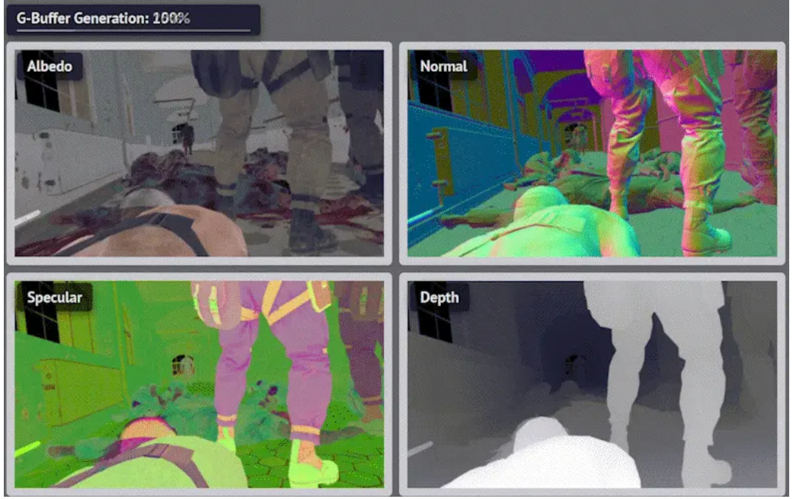
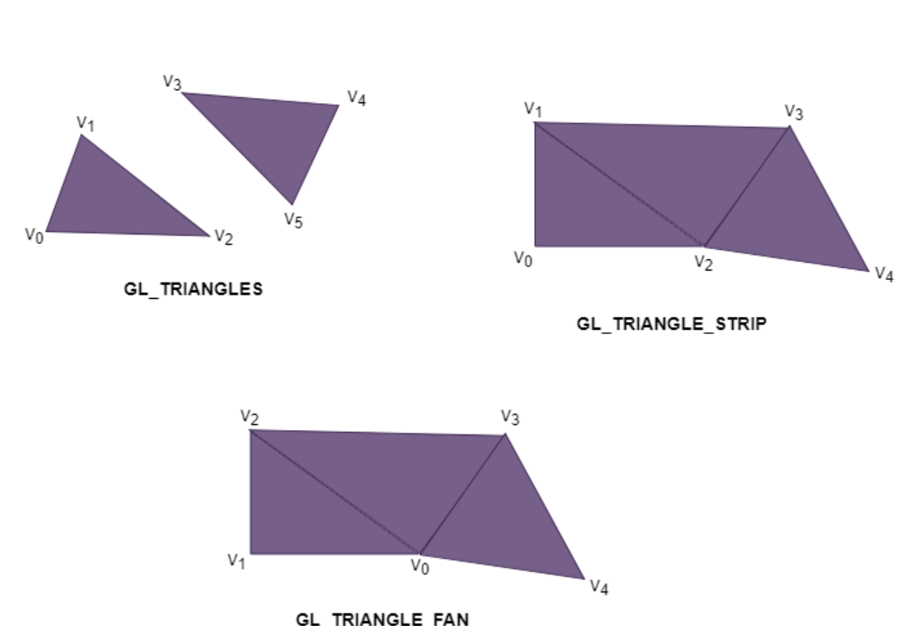
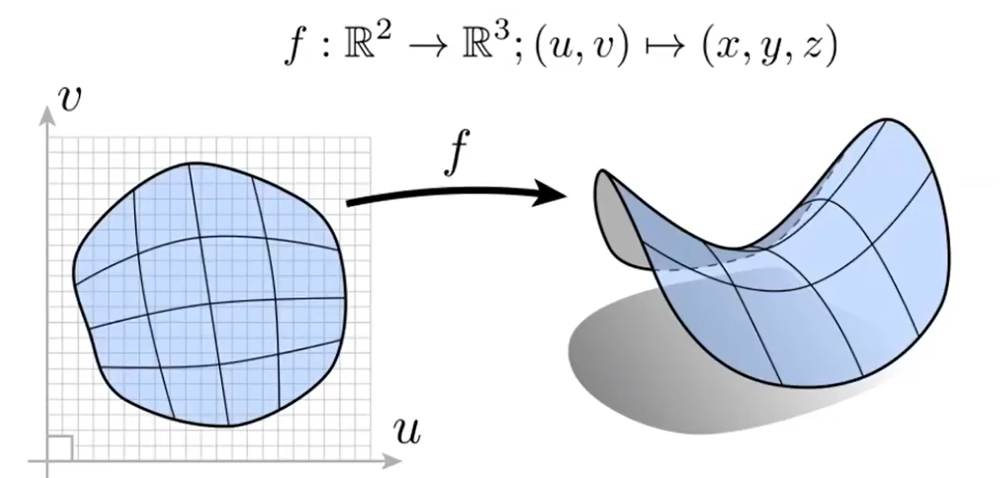
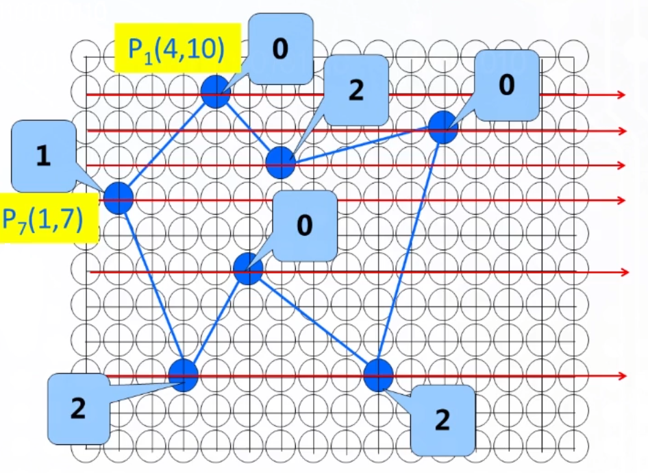

# 线性代数

## 向量与矩阵

$$
m\times n矩阵:\mathbf A=
\begin{bmatrix}
a_{11} & a_{12} & \cdots & a_{1n} \\
a_{21} & a_{22} & \cdots & a_{2n} \\
\vdots & \vdots & \ddots & \vdots \\
a_{m1} & a_{m2} & \cdots & a_{mn} \\
\end{bmatrix}
=[a_{ij}]_{m\times n}=
\begin{bmatrix}
\mathbf A^1 & \mathbf A^2 & \cdots & \mathbf A^n \\
\end{bmatrix}
=
\begin{bmatrix}
\mathbf A_1 \\ 
\mathbf A_2 \\ 
\cdots \\ 
\mathbf A_m \\
\end{bmatrix}
\hfill \\
\\
矩阵乘法:\mathbf A_{m\times p}\mathbf B_{p\times n}=\mathbf C_{m\times n} \quad (\textbf{行m-列p-行p-列n}) \quad ,其中c_{ij}=\mathbf A_i \cdot \mathbf B^j \quad (点积)\hfill \\
\\
向量:\mathbf a=\begin{bmatrix} x_a \\ y_a \\ z_a \end{bmatrix},
\mathbf a^T=\begin{bmatrix} x_a & y_a & z_a \end{bmatrix}\hfill \\
点积:\mathbf a \cdot \mathbf b=\mathbf a^T\mathbf b=\Sigma a_ib_i \hfill \\
叉积:\mathbf a \times \mathbf b = 
\begin{bmatrix}
0 & -z_a & y_a \\
z_a & 0 & -x_a \\
-y_a & x_a & 0 \\
\end{bmatrix}
\begin{bmatrix}
x_b \\
y_b \\
z_b \\
\end{bmatrix}
=\begin{bmatrix}
y_az_b-y_bz_a \\
x_az_b-x_bz_a \\
x_ay_b-x_by_a \\
\end{bmatrix}
\hfill \\
投影:\mathbf a \bullet \mathbf b= \frac{\mathbf a\cdot\mathbf b}{|\mathbf b|} \frac{\mathbf b}{|\mathbf b|} \quad 若\mathbf b为单位向量,则\mathbf a \bullet \mathbf b=(\mathbf a \cdot \mathbf b)\mathbf b \hfill \\
长度:|\mathbf a|=\sqrt{\mathbf a \cdot \mathbf a} \hfill \\
夹角:\cos\langle\mathbf a,\mathbf b\rangle= \frac{\mathbf a \cdot \mathbf b}{|\mathbf a||\mathbf b|} \hfill \\
$$

## 四元数

$$
四元数:\mathbf q = q_0+\mathbf v_q =q_0+q_1\mathbf i+q_2\mathbf j+q_3\mathbf k(q_0,q_1,q_2,q_3为实数) \quad 共轭四元数:\mathbf q^* = q_0-\mathbf v_q \hfill \\
四元数的二范数:|\mathbf q|= (q_0^2+|\mathbf v_q|^2)^{\frac{1}{2}} = \sqrt{q^2_0+q_1^2+q_2^2+q_3^2}\hfill \\
\mathbf p \cdot \mathbf q= q_0p_0+q_1p_1+q_2p_2+q_3p_3 \quad (类似向量点乘) \hfill  \\
\mathbf p \times \mathbf q= \mathbf v_p \times \mathbf v_q = (p_2q_3-p_3q_2)\mathbf i+(p_3q_1-p_1q_3)\mathbf j+(p_1q_2-p_2q_1) \mathbf k \quad (类似向量叉乘) \hfill \\
\mathbf p \mathbf q = (p_0q_0 - \mathbf v_1 \cdot \mathbf v_2) +(p_0 \mathbf v_2 + q_0 \mathbf v_1 + \mathbf v_1 \times \mathbf v_2) \quad (默认乘法) \hfill \\
\mathbf q^{-1} =\frac{\mathbf q^*}{|\mathbf q|^2}, \mathbf q_1 \mathbf q_2 = \mathbf q_3 \Leftrightarrow \mathbf q_2 = \mathbf q_1^{-1} \mathbf q_3 \hfill \\
\\
四元数表示旋转: \hfill \\ 
\mathbf q = \cos \frac{\theta}{2}+\sin\frac{\theta}{2}\mathbf v_q (|\mathbf v_q|=1 \Rightarrow |\mathbf q|=1)
\quad \mathbf p=\mathbf v_p \quad 
\mathbf r = \mathbf q\mathbf p\mathbf q^{-1} \hfill \\
\mathbf q:表示旋转的四元数,\theta为旋转角,\mathbf v_q为转轴(必须是归一化的) \hfill \\ 
\mathbf p:表示初始坐标的四元数(实部为0,虚部系数即坐标) \hfill \\
\mathbf r:表示旋转后坐标的四元数(结果中虚部系数即坐标) \hfill \\
$$

- 四元数叉乘、默认乘法不满足交换律

## 变换

- **变换：函数，自变量和因变量均为n维向量**
- **线性变换：具有线性性质的变换（包括缩放、旋转、切变等；不包括平移）**
  - **线性变换和平移统称为仿射变换**

- **齐次坐标：用于表示n维向量及其各类变换的n+1维坐标**

$$
n维空间中有变换\mathbf A,若\forall向量 \mathbf a,\mathbf b,实数k,有:
\begin{cases}
\mathbf A(\mathbf a+\mathbf b)=\mathbf A(\mathbf a)+\mathbf A(\mathbf b) \\
\mathbf A(k\mathbf a)=k\mathbf A(\mathbf a) \\
\end{cases},
则\mathbf A为\textbf{线性变换} \hfill \\
n维空间中的线性变换总是可以表示为\mathbf b=\mathbf L_{n\times n}\mathbf a \hfill \\
一切仿射变换可以表示为\mathbf b=\mathbf L_{n\times n}\mathbf a+\mathbf t \hfill \\
引入齐次坐标后,\mathbf b=\mathbf L_{n\times n}\mathbf a+\mathbf t可以表示为\mathbf b'=\mathbf M_{(n+1)\times (n+1)}\mathbf a', 
其中\mathbf b'=\begin{bmatrix} \mathbf b \\ 1 \end{bmatrix},
\mathbf a'=\begin{bmatrix} \mathbf a \\ 1 \end{bmatrix},
\mathbf M=\begin{bmatrix}\mathbf L & \mathbf t \\ 0 & 1 \end{bmatrix} \hfill \\
$$

### 二维

$$
缩放(x,y)倍:
\mathbf L =
\begin{bmatrix}
x & 0 \\
0 & y \\
\end{bmatrix} \hfill \\
切变:
\mathbf L_x =
\begin{bmatrix}
1 & s \\
0 & 1 \\
\end{bmatrix},
\mathbf L_y =
\begin{bmatrix}
1 & 0 \\\
s & 1 \\
\end{bmatrix}
\hfill \\
绕原点逆时针旋转\theta:
\mathbf L =
\begin{bmatrix}
\cos \theta & -\sin \theta \\
\sin \theta & \cos \theta \\
\end{bmatrix} \hfill \\
$$

### 三维

- 规定$\mathbf i \times \mathbf j = -\mathbf k$（**左手系**，同Unity世界坐标系相同）；在此前提下，绕轴旋转均表示，从该轴的**负半轴看向正半轴**，在看到的平面内**逆时针旋转**

$$
缩放(x,y,z)倍:
\mathbf L =
\begin{bmatrix}
x & 0 & 0\\
0 & y & 0\\
0 & 0 & z\\
\end{bmatrix} \hfill \\
切变:
\mathbf L_{xy} =
\begin{bmatrix}
1 & 0 & 0 \\
0 & 1 & 0 \\
s & t & 1 \\
\end{bmatrix},
\mathbf L_{xz} =
\begin{bmatrix}
1 & 0 & 0 \\
s & 1 & t \\
0 & 0 & 1 \\
\end{bmatrix},
\mathbf L_{yz} =
\begin{bmatrix}
1 & s & t \\
0 & 1 & 0 \\
0 & 0 & 1 \\
\end{bmatrix}\hfill \\
绕坐标轴旋转\theta:
\mathbf L_x =
\begin{bmatrix}
1 & 0 & 0 \\
0 & \cos \theta & -\sin \theta \\
0 & \sin \theta & \cos \theta \\
\end{bmatrix},
\mathbf L_y =
\begin{bmatrix}
\cos \theta & 0 & \sin \theta \\
0 & 1 & 0 \\
-\sin \theta & 0 & \cos \theta \\
\end{bmatrix},
\mathbf L_z =
\begin{bmatrix}
\cos \theta & -\sin \theta & 0 \\
\sin \theta & \cos \theta & 0 \\
0 & 0 & 1 \\
\end{bmatrix}\hfill \\
绕单位向量\mathbf w=\begin{bmatrix} x \\ y \\z \end{bmatrix}旋转\theta:
\mathbf L=\mathbf I+\sin \theta \mathbf J+(1-\cos\theta)\mathbf J^2,其中
\mathbf J=
\begin{bmatrix}
0 & -z & y \\
z & 0 & -x \\
-y & x & 0 \\
\end{bmatrix}
\hfill \\
$$

### 有符号面积

$$
有符号面积:S1 = \frac{1}{2}(\mathbf {CP} \times\mathbf {BP}) \cdot \mathbf n 
\quad \mathbf n = \frac{\mathbf{CA} \times \mathbf{BA}}{|\mathbf{CA}| |\mathbf{BA}|} \hfill \\
重心坐标:(\alpha,\beta,\gamma) = (\frac{S1}{S},\frac{S2}{S},\frac{S3}{S}) \Leftrightarrow \mathbf P = \alpha \mathbf A + \beta \mathbf B + \gamma \mathbf C  \hfill \\
\\
P在三角形ABC内 \Leftrightarrow S1,S2,S3>0 \hfill \\
记\mathbf a=\mathbf {CP} \times\mathbf {BP},注意到必然有\mathbf a \parallel \mathbf n(同向/反向/\mathbf a = \mathbf 0) \hfill \\
因此 S1 > 0 \Leftrightarrow \mathbf c.x \times \mathbf n.x > 0 \quad (只求符号,不必求面积) \hfill \\
$$

- 边的方向会影响法向量方向，因此计算有符号面积时点的顺序必须统一（如以上公式）

# 渲染管线

## 概念

- **通道(Pass)**：利用各种数据进行计算，最终渲染到某个缓冲区的过程（如OpenGL中glDrawArrays等API**可能**标志着一个通道完成）
  - 输入包括参数、纹理、其他缓冲区的渲染结果、着色器等
  - 渲染到各种缓冲区的过程都可以称为通道，如：颜色通道，光照通道，阴影通道，深度通道，后处理通道，透明通道等
  - 通道并不固定，可以为了实现某种渲染效果专门增加通道，如：法线通道，Bloom通道，环境光遮蔽通道，抗锯齿通道等
  - 没有明确划分方式，如颜色通道、光照通道、阴影通道、深度通道等通道都是片元着色通道的一部分
  - 多个通道间可能是并行关系，也可能是先后关系
- **渲染目标(Render Targets)**：通常指作为通道输出的缓冲区，可以根据数据类型的不同分类
  - Multiple Boolean：参与逻辑运算的布尔型缓冲区，用于遮罩等功能
  
  - Floating Point：浮点数缓冲区，用于存储深度、粗糙度、金属度等
  
  - Vector-Type：矢量型缓冲区，用于存储颜色、法线等
- 切线空间：由**表面某点的位置和表面朝向**确定的空间（坐标系），随表面旋转而改变
  - 在切线空间下才能方便地在物体旋转时正确地计算光照
- **图元(Primitive)**：各种平面图形，其中点、线、三角形面是**基础图元**
  - **不是单纯的几何表示，还包含渲染所需的各种顶点数据**

## 典型前向渲染管线

1. 应用阶段：
   1. 进行**初步剔除**（遮挡剔除，层级剔除，视锥剔除）
   2. CPU向GPU发送数据：顶点（位置、法线、颜色）、变换、纹理、光源、材质（着色器、参数）等数据
   3. CPU发出Draw Call
2. 几何阶段
   1. **顶点(Vertex)着色**：根据顶点着色器对顶点进行**模型变换**（模型空间→世界空间），**观察变换**（世界空间→观察空间），**投影变换**（观察空间→裁剪空间）（合称**MVP变换**）
   2. 图元装配：根据顶点索引数组及图元类型，按照指定的方式连接顶点，生成**基础图元**，这一步可能进行**背面剔除**
   3. 几何(Geometry)着色器：可选的，对输入的图元（以给定的规则）进行变换、修改
   4. 曲面细分(Tessellation)着色器：可选的，用镶嵌化技术增加三角形面及顶点的数量
   5. 齐次裁剪：由硬件自动进行**齐次除法**（裁剪空间→NDC），并裁剪范围外的图元，这一步可能进行**遮挡剔除**
   7. 屏幕映射：进行**视口变换**（NDC→屏幕）
3. **光栅化(Rasterization)**阶段：
   1. 片元生成：对于每个图元，将其离散化为片元，传给片元着色器
   2. 片元着色：根据片元着色器进行**着色计算**
   3. 测试混合：根据片元缓冲进行**测试混合**，更新**深度缓冲、颜色缓冲、透明度缓冲**等，得到最终颜色
4. 像素后处理(pixel processing)阶段

- **典型的前向渲染管线可以分为两个通道：片元着色通道，后处理通道**
  - 片元着色通道内部，几何阶段和光栅化阶段**流水线式并行**（生成图元的中途，已生成的图元可以直接光栅化），过程中不断更新颜色缓冲、深度缓冲等
  - 后处理通道必须等待片元着色通道完成，之后各像素的处理完全独立，理论上可以完全并行

## 延迟渲染(Deffered Rendering)

- 延迟渲染中使用的多组缓冲区统称为**Geometry Buffer(G-Buffer)**
  - 输入输出并不是单向的，某些缓冲区可能会被多轮查询、多轮更新
  - 多组缓冲区可以看成多张贴图，每张存储不同信息，如深度、法线、纹理颜色、粗糙度、金属度、漫反射颜色、镜面反射颜色等
  - 每个像素位置上始终只维护一套信息（不会像片元缓冲那样出现overdraw现象）

- 缓冲区可以改为存储ID而非具体数据，这些缓冲区统称为**Visibility Buffer(B-Buffer)**
  - 图元、材质

- 延迟渲染与前向渲染的区别在**光栅化**阶段：
  1. 生成片元后，**直接进行深度测试**，如果小于当前该位置深度则**覆盖所有G-Buffer**中相应位置的数据
  2. 初步处理完所有片元后，根据G-buffer在每个片元位置进行**仅一次片元着色**
- 屏幕范围内，被不透明物体遮挡的部分无需渲染是理所应当的，这是使用延迟渲染的根本原因
  - 延迟渲染无法处理半透明物体，因为**深度、法线等数据只能覆盖，不能混合**
  - 对于半透明物体，需要额外的Pass渲染（如依然利用前向渲染管线） 
- 原本前向渲染的计算量越大，使用延迟渲染越有必要
  - 计算量过大的常见原因是光源数量过多；正因如此，一些前向渲染管线会限制场景中的光源总数
  - 延迟渲染解决的是overdraw问题
  - 如果要解决光源数量增加导致的计算量增大，可以对相机拍摄的范围分块（每个光源仅影响部分区块），即**分块延迟渲染**
- 延迟渲染的缺点：
  - 显存**带宽**占用大，需要尽可能压缩G-Buffer空间
  - **着色算法灵活性**受限（G-Buffer存储的是数据，不同着色算法的不同行为及其不同参数难以存储）

## 应用阶段

### 初步剔除

- **初步剔除的单位是物体（网格/模型），而不是顶点**
- 通常由CPU完成，也可以提前由GPU完成

#### 遮挡剔除

- 剔除被前面的物体**完全**遮挡的物体

#### 视锥剔除

- 剔除**完全**处于视锥外的物体

#### 层级剔除

- 根据开发者设置的参数直接剔除某些物体（如Unity中的Culling Musk）

### Draw Call

- **Draw Call**是由CPU向GPU发出的一条**绘制指令**，每条指令渲染若干个图形（如`glDrawElements`）
- **批量渲染(Batch)**可以减少CPU与GPU的通信次数，以降低开销；常见的做法是把多个对象使用的多种缓冲区分别合成（每种类型的缓冲区合称为一个）
- CPU与GPU**流水线式并行**，Draw Call存放在GPU缓冲区中，CPU不必等到GPU完成一个渲染命令才发送下一个渲染命令
- 一条Draw Call通常要访问以下数据（OpenGL中，这些数据在上下文中，需要在发出DrawCall前设置好）：
  - **顶点缓冲区**：各顶点的**位置、法线方向**，及**纹理坐标**等
  - **索引缓冲区**：规定各个顶点按照怎样的顺序组成三角形
  - **材质**：可能包含纹理贴图、纹理映射方式、法线贴图、PBR材质等数据
  - **着色器程序**：顶点着色器，片元着色器，及其他可选着色器；包括各着色器中的参数（uniform变量）
  - 其他设置：深度测试，混合模式，剔除模式等

## 几何阶段

- **输入：顶点缓冲区、索引缓冲区，顶点着色器程序等**
- **输出：图元（顶点缓冲区、索引缓冲区变换后的结果，最关键的是，新计算出了纹理坐标）**
- 以下所有空间中，均假定使用**左手系**

### 顶点着色

- 对于输入的所有顶点，**（并行地）逐顶点**调用顶点着色器
- 变换过程可以在CPU中进行（顶点缓冲区中**动态更新**变换后数据），也可以在着色器中进行（顶点缓冲区设置好变换前数据，并**动态更新**用于变换的着色器参数）
- （以glsl为例）顶点着色器至少要给`gl_Position`这个out参数赋值，此参数为**裁剪空间坐标**，之后会自动对此参数进行**齐次除法**，再经过插值后，传给片元着色器

#### 模型空间

- 以模型的指定点为原点，模型的右方为x轴，上方为y轴，前方为z轴
- 坐标有xyzw分量。为了进行变换运算，加入额外的w分量（表示坐标的向量，其w为1；表示矢量的向量，其w为0）

#### 世界空间

$$
\mathbf{P}_{world}=\mathbf{M}_{model}\mathbf{P}_{model} 
\quad \mathbf{M}_{model} = \mathbf T \mathbf R \mathbf S \hfill \\
\mathbf S=
\begin{bmatrix}
r & 0 & 0 & 0 \\
0 & s & 0 & 0 \\
0 & 0 & t & 0 \\
0 & 0 & 0 & 1 \\
\end{bmatrix} \hfill \\

\mathbf R =
\begin{bmatrix}
1 & 0 & 0 & 0 \\
0 & \cos \alpha & -\sin \alpha & 0 \\
0 & \sin \alpha & \cos \alpha & 0 \\
0 & 0 & 0 & 1 \\
\end{bmatrix}
\begin{bmatrix}
\cos \beta & 0 & -\sin \beta & 0 \\
0 & 1 & 0 & 0 \\
\sin \beta & 0 & \cos \beta & 0 \\
0 & 0 & 0 & 1 \\
\end{bmatrix}
\begin{bmatrix}
\cos \gamma & -\sin \gamma & 0 & 0\\
\sin \gamma & \cos \gamma & 0 & 0\\
0 & 0 & 1 & 0\\
0 & 0 & 0 & 1 \\
\end{bmatrix} \hfill \\

\mathbf T = \begin{bmatrix}
1 & 0 & 0 & x \\
0 & 1 & 0 & y \\
0 & 0 & 1 & z \\
0 & 0 & 0 & 1 \\
\end{bmatrix}
\hfill \\
(x,y,z):物体坐标 \quad (\alpha,\beta,\gamma):物体欧拉角 \quad (r,s,t):物体缩放 \hfill \\
$$

- **旋转矩阵的顺序不可交换，默认情况下按照zyx的顺序应用旋转（符合上面公式）**
- 由模型空间经**模型变换**而得，引擎预设好原点，右方为x轴，上方为y轴，前方为z轴
- **缩放→绕模型自身的坐标轴旋转→平移**

#### 观察空间

$$
\mathbf{P}_{view}=\mathbf{M}_{view}\mathbf{P}_{world} 
\quad \mathbf{M}_{view} = \mathbf R \mathbf T \hfill \\

\mathbf R =
\begin{bmatrix}
1 & 0 & 0 & 0 \\
0 & \cos \alpha & \sin \alpha & 0 \\
0 & -\sin \alpha & \cos \alpha & 0 \\
0 & 0 & 0 & 1 \\
\end{bmatrix}
\begin{bmatrix}
\cos \beta & 0 & \sin \beta & 0 \\
0 & 1 & 0 & 0 \\
-\sin \beta & 0 & \cos \beta & 0 \\
0 & 0 & 0 & 1 \\
\end{bmatrix}
\begin{bmatrix}
\cos \gamma & \sin \gamma & 0 & 0\\
-\sin \gamma & \cos \gamma & 0 & 0\\
0 & 0 & 1 & 0\\
0 & 0 & 0 & 1 \\
\end{bmatrix} \hfill \\

\mathbf T = \begin{bmatrix}
1 & 0 & 0 & -x \\
0 & 1 & 0 & -y \\
0 & 0 & 1 & -z \\
0 & 0 & 0 & 1 \\
\end{bmatrix} \hfill \\

(x,y,z):相机坐标 \quad (\alpha,\beta,\gamma):相机欧拉角 \hfill \\
$$

- 由世界空间经**观察变换**而得，常以相机的右方为x轴，上方为y轴，前方为z轴
- **平移→绕相机的坐标轴旋转**

#### 裁剪空间

*相机不一定要有“中心点”的概念，只是游戏引擎通常这样处理*
$$
正交投影:\mathbf{P}_{ndc}=\mathbf{M}_{ortho}\mathbf{P}_{view}
\quad \mathbf M_{ortho}=\mathbf S \mathbf T \\
\mathbf T = \begin{bmatrix}
1 & 0 & 0 & -\frac{r+l}{2} \\
0 & 1 & 0 & -\frac{t+b}{2} \\
0 & 0 & 1 & -\frac{n+f}{2} \\
0 & 0 & 0 & 1 \\
\end{bmatrix} \hfill \\
\mathbf S=\begin{bmatrix}
\frac{2}{r-l} & 0 & 0 & 0 \\
0 & \frac{2}{t-b} & 0 & 0 \\
0 & 0 & \frac{2}{n-f} & 0 \\
0 & 0 & 0 & 1 \\
\end{bmatrix} \hfill \\
l,r,b,t,n,f:观察空间坐标分量(而不是世界空间) \hfill \\
$$

$$
透视投影:\mathbf{P}_{ndc}=\mathbf{M}_{persp}\mathbf{P}_{view} 
\quad \mathbf M_{persp} = \mathbf M_{ortho}\mathbf M_{squish}\\
\mathbf M_{squish}=
\begin{bmatrix}
n & 0 & 0 & 0 \\
0 & n & 0 & 0 \\
0 & 0 & n+f & -nf \\
0 & 0 & 1 & 0 \\
\end{bmatrix} \hfill \\
\mathbf M_{ortho}同正交投影 \hfill \\
$$

- 由观察空间经**投影变换**而得，相机拍摄的范围被压缩成长方体（不在相机范围内的顶点尚未被裁剪）
- 正交投影和透视投影的矩阵统称为**投影矩阵**；模型变换、观察变换、投影变换合称**MVP变换**
  - 透视投影可视为两次变换的叠加，第一次先将平截头体“压缩”为长方体，之后的步骤和正交投影相同

- **片元着色器的输出就是裁剪空间坐标**

### 图元装配

- 根据**顶点索引数组**及**图元类型**（如上图），连接顶点，计算出所有要渲染的**基础图元**

- 这一步可能进行**背面剔除**，即剔除法线方向与相机正方向夹角小于等于90°的三角形面（？）

### 齐次裁剪

- 裁剪空间中各点经过**齐次除法（每个点除以自身的w分量）**得到**归一化设备坐标(Normalized Device Coordinates,NDC)**
  - 裁剪由GPU自动完成，顶点着色器能做的是预先设定w的值

- 相机的拍摄范围被压缩为**以原点为中心，边长为2的正方体外的图元**，此范围外的图元被**裁剪**，裁剪时可能产生新图元

- 这一步可能进行**遮挡剔除**（？）

### 屏幕映射

$$
\mathbf{P}_{screen}=\mathbf{M}_{viewport}\mathbf{P}_{ndc} \hfill \\
\mathbf{M}_{viewport} =
\begin{bmatrix}
\frac{w}{2} & 0 & 0 & \frac{w}{2} \\
0 & \frac{h}{2} & 0 & \frac{h}{2} \\
0 & 0 & 1 & 0\\
0 & 0 & 0 & 1\\
\end{bmatrix} \hfill \\
w:屏幕宽度 \quad h:屏幕高度 \hfill \\
$$

- NDC经**视口变换**得到**屏幕空间坐标**，相机拍摄区域被压缩为长方形
- 屏幕不一定是最终输出的窗口，也可能是中途的FBO，其分辨率不确定
- **片元着色器的输入的其中一部分就是屏幕空间坐标**

## 光栅化阶段

- **输入：图元，材质，片元着色器等**
- **输出：更新帧缓冲（包括颜色缓冲，深度缓冲等）**

### 片元生成

- 计算**基础图元（不只有三角形）**覆盖的区域，离散化为片元，进而调用片元着色器
- 现代GPU中，会对屏幕**分块**，分多轮处理新生成的图元，每轮中按顺序对每块进行光栅化
- 每当几何阶段生成出一个**图元**，便可**立即光栅化**，这样并行度最高，但对显存的访问非常随机，缓存命中率很低
- 可以等待所有图元生成完，再**按顺序**在**每个像素位置**上进行若干次光栅化，这样缓存命中率最高，但并行度最低
- **片元着色器的输入就是顶点着色器的输出，而片元和顶点并非一一对应；生成片元时，获取其所在图元的个顶点的输出值，自动根据重心坐标计算插值，作为片元着色器的输入**
- 如果开启了深度测试，片元深度也会自动计算（用于深度测试，不是用于片元着色器）
- 理论上，从片元生成开始，开始发生走样（几何阶段仅存在浮点误差）

### 片元着色

- **（并行地）逐片元**调用片元着色器，片元着色器被调用的次数通常远多于其他着色器

#### 着色计算

**以下涉及颜色的计算，均在线性空间中进行**

- 进行**纹理映射**，确定**基础颜色**
  - 基础颜色实际上是粗略地模拟物体对不同波长的光的吸收率（**不代表功率，而是无量纲数**）

- 进行**光照计算**，根据光源颜色、光照强度、物体和光源的几何关系计算**光照颜色**
  - 理论上光源有SPD，经过积分得到RGB分量；而实际上光源颜色和光照强度直接规定了初始光照颜色
  - 光照通常分为**直接光照**、**间接光照**，以不同方式分别计算其颜色，然后相加得到光照颜色
  - **阴影计算**得到可见度值，通常用于与直接光照颜色相乘（不影响间接光照）

- **片元颜色=基础颜色×光照颜色**

### 测试混合

- **不是等所有片元着色完毕后一同混合，而是每当着色完一个片元，就立刻对该片元测试混合**
- **半透明片元必须在不透明片元之后渲染**

- **累积缓冲：当前已处理片元混合后的透明度**

- **模板(Stencil)缓冲：可选的，常用于实现遮罩等功能**

  - **模板测试：人为定义通过模板测试的规则，符合此规则的片元才会被保留，并按照人为定义的规则更新模板缓冲**

- **深度缓冲(Z-Buffer)：每个像素上，当前已渲染的片元的最小深度**
  - **深度：正数，到相机越近，值越小；深度是NDC坐标Z分量的一次函数**
  - **深度测试：比当前像素位置记录的深度小的片元才能通过测试，并更新深度值（半透明片元不更新）**
  
- **帧(Frame)缓冲：颜色、深度、模板等缓冲构成的整体**

#### 不透明片元渲染

- 不透明片元的渲染顺序不影响结果，只略微影响性能
- 进行**模板测试**和**深度测试**，片元通过测试则直接**覆盖**该位置的颜色缓冲

#### 半透明片元渲染

- **透明片元必须按深度由大到小排序，按顺序渲染**
- 进行**模板测试**和**深度测试**，片元通过测试则与该位置的颜色缓冲**混合**

- 最常见的混合方式：新前景色 = alpha × 前景色 + （1 - alpha）× 背景色

## 后处理阶段

- ？

# 几何体表示

- 不论显示还是隐式表示，描述几何体时可能使用不同种类的**对象**：
  - **顶点**：网格
  - **内点**：曲线/曲面方程，Bezier曲线
  - **离散点**：点云
  - **立方体**：体素
  - **基本几何体**：CSG，过程生成

## 曲线连续性

- **函数连续点：左极限、右极限、函数值均存在且相等；任意阶导数（若存在）也都是不同的函数**
- 讨论连续性时，通常用**参数方程**表示曲线，将一组参数方程视为一个函数，**该函数的值和任意阶导数(若存在)均为向量**

$$
有参数方程表示的曲线\mathbf v(t):\hfill \\
\mathbf v_{+}(t_0)=\mathbf v_{-}(t_0) \Rightarrow \mathbf v(t)在t_0处连续(\mathrm{C}^0连续性) \hfill \\
\mathbf v^{(n)}_{+}(t_0)=\mathbf v^{(n)}_{-}(t_0) \Rightarrow \mathbf v(t)在t_0处具有\mathrm{C}^n \textbf{连续性} \hfill \\
$$

## 显式表示

- **直接或间接的给出几何体中某种对象的信息（数量、位置、顺序等）**
- **能直接或间接地获取几何体种某种对象的信息，但不容易判断某对象是否位于几何体内部**

### 点云

- 用足够多的点直接记录物体表面的点的位置
- 数据结构简单，但需要的点的数量极多
- 常见于实体扫描的结果，之后通常转换成Mesh再用于渲染

### 体素

- 体素：均匀分割三维空间得到的最小空间单元
- 对于体素表示的物体，容易进行体积计算、自动生成（细胞自动机）、模型变化（增减体素）等操作
- 除了位置信息，体素还可以包含各类材质信息
- 直接存储所有体素需要极大的空间（空间复杂度为$O(n^3)$）
- 实际应用中经常出现大量相邻体素相同（或都为空）的情况；因此可通过八叉树储存降低开销（当一个八叉树节点中包含不同类型的体素时，才继续细分）；这种数据结构也被称为**SVO(Sparse Volumetric Objects)**

### 网格(Mesh)

- 以若干多边形拼合来表示物体表面
- 最常见的表示方式，其中又以纯三角形网格最常见

#### 网格细分(Subdivision)

- 增加三角面的个数，增加更多的形状细节
- 细分不依赖于"实际物体"信息，因此需要某种算法**"猜测实际细节"**

#### 网格简化(Simplification)

- 尽可能保持网格形状不变，尽可能减少三角形面

#### 网格规则化(Regularization)

- 尽可能保持网格形状不变，尽可能使各个三角面形状接近正三角形且大小接近

### 参数映射(Parameter Mapping)

*上图中，没有关于左侧几何体的信息，无法确定其是否为显式表示*

- 对于一个显式表示的几何体，在其基础上经过映射，间接给出新的几何体的对象信息

### Bezier Curve

- 给定n个控制点，再给定参数t，可以确定曲线上的一个点；点足够多后，可以近似地绘制出曲线

$$
B^n表示有n个点的点集,\mathbf b^n_i表示点集中的第i个点 \hfill \\
有函数F:B^{n-1}=F(B^n,t),其中\mathbf b^{n-1}_i=(1-t)\mathbf b^n_i+t\mathbf b^n_{i+1} \hfill \\
\Rightarrow B^1=F^{n-1}(B^n,t) \Rightarrow \mathbf b^1_1=\sum_{i=1}^n \mathbf b^n_i(1-t)^{n-i}t^i \quad (\mathbf b^1_1为最终要求的点) \hfill\\
$$

- 曲线段的起点和终点必然是第一个和最后一个控制点
- 对所有控制点进行**仿射变换**，曲线的**形状不变**（投影变换可能改变形状）
- ($0\le t \le 1$时)曲线总是位于所有**控制点构成的凸包(≠连成的多边形)内部**

*上图中，黑色点为相邻两条贝塞尔曲线的控制点，蓝色点为一条贝塞尔曲线的控制点*

- 绘制较为复杂的曲线时，需要使用多个控制点，每个控制点对曲线的控制力较低
- 可以**逐段绘制**贝塞尔曲线（习惯上，每段使用四个控制点）
- 单段贝塞尔曲线内部总有$\mathrm{C}^1$连续性；一个黑色控制点与相邻的两个蓝色控制点（见上图）共线时，能确保黑色控制点处有$\mathrm{C}^1$连续性

### Bicubic Bezier Surface

- 给定m条**投影后平行且间隔均匀**的贝塞尔曲线（见上图），给定参数u,v，可以确定曲面上的一个点；点足够多后，可以近似地绘制出曲面
- 计算过程：
  1. 在每条贝塞尔曲线上，根据u，求曲线上的点
  2. 将曲线上的各点视为新的控制点，根据v，求新的曲线上的点，即为曲面上一点

## 隐式表示

- **不给出几何体中某种对象的信息，而是描述几何体中的对象满足的条件**
- **能直接判断某种对象是否位于几何体内部，但不容易（离散化地）获取几何体的某种对象**

### 曲面方程&有向距离场

$$
f(\mathbf p)=\underset{s\in S}{\min}\{ \mathrm{sd}(\mathbf s,\mathbf p) \} \quad 令f(\mathbf p)=0,即得到\textbf{曲面方程} \hfill \\
\mathrm{sd}(\mathbf s,\mathbf p) :\mathbf p到\mathbf s的\textbf{有向距离} (\mathbf p在S内部时函数值为负数)\hfill \\
\\
更一般地,记f_i(\mathbf p)=\underset{s\in S_i}{\min}\{ \mathrm{sd}(\mathbf s,\mathbf p) \},f(\mathbf p)=\min\{f_i(p)\} \\
则f(\mathbf p)在空间中的所有取值构成\textbf{有向距离场} \hfill \\
$$

- **表示有向距离场的函数难以用解析式来表示，通常是用近似方法计算出一系列离散的函数取值，存放在表(纹理)中**
- **有向距离场的分辨率确定后， 场景中物体数量增加不会导致数据量增大，但生成有向距离场的开销较大**

*上图中，$\mathrm{SDF}$表示原始图像变为有向距离场的过程，$\mathrm{SDF}^{-1}$表示其逆过程；对有向距离场插值可以模拟图像的运动（直接对图像插值则不行）*

- 引入max/min/lerp等非基本运算，则可以用有向距离场描述更复杂的曲面（如组合而成的曲面）

### Constructive Solid Geometry

- 在一些基本图形的基础上，通过“集合”运算表示复杂图形

- 用表达式表示一系列的运算，而表达式又可以表示为树，称为**CSG树**

### 过程生成

- 用**函数**描述（从基本几何体开始）生成几何体的过程
- **分形（Fractals）**：强调函数可以**递归调用**，生成自相似图形（和CSG树的主要不同点）

## 多边形扫描转换

### X-扫描线算法

- 输入：用顶点序列表示的多边形，颜色缓冲
  - **顶点坐标必须是离散化的，否则无法解决误差问题**
  - **顶点序列必须表示正常的多边形，可以利用极角排序生成符合要求的顶点序列**
- 输出：修改颜色缓冲，将多边形内部的区域**填色**
- 算法步骤：
  1. 输入顶点序列，确定所有顶点的y的范围
  2. 对于范围内的每个y的值，用一条直线与多边形求交，得到若干个交点
     - 如果交点与顶点重合，则考虑该顶点的两条边，**边必须位于扫描线上方（不含平行）才会记为一个交点**（下闭上开）
     - 可以证明，每条扫描线与多边形的交点数必然是偶数
  3. 将交点按照某种方式排序，然后两两配对，每对交点之间的点便是需要填色的区域
     - 求出交点后，将其**离散化（必须统一采用四舍五入，而不是四舍六入五留双）**，确定区间；之后必须采用左闭右开或右闭左开的规则
- 主要开销来自求交和排序，需要使用**有向边，有向边表，活性边表**来加速
- 有向边：以y较小的端点为起点，y较大的端点为终点的边（**若某条边两端点的y值离散化后相等，直接忽略**）
  - x：表示与当前扫描线的交点的x分量；一开始设为起点的x分量，随扫描线上移而改变
  - yMax：终点的y分量离散化后**-1（以此实现下闭上开）**；扫描线**大于（前面-1所以此处不取等）**此值后，将此有向边从活性边表中移除
  - deltaX：y增加1时x的改变量
- 有向边表：包含所有有向边的集合
  - 用散列或字典来存放所有有向边
- 活性边表：与当前扫描线有交点的有向边构成的集合
  - 扫描线上移的过程中，根据有向边的yMax和有向边表的索引不断更新活性边表；活性边表为空时，算法结束
  - **每当新的边加入表（已有边的顺序不会发生变化），按照各有向边当时的x排序，若x相同，则按照deltaX排序**
  - 每当更新交点后，直接按表中边的顺序两两配对交点
- 不使用数据结构，直接记录所有交点（按行分组），然后逐行填充效率更高

### 边标志算法

- 输入输出与X-扫描线算法相同

- 算法步骤：
  1.  输入顶点序列，确定包含所有顶点的AABB
  2.  对每条边进行扫描转换（**若某条边两端点的y值相等，直接忽略**），得到若干离散化的点，**以特殊颜色标记这些点**
      - 类似X扫描线算法，**每条边较高的顶点被忽略**（下闭上开）
      - **离散化每条边时，每次令y+1然后计算x的值**，这和X扫描线算法类似，和一般的直线扫描转换不同
      - 扫描转换某条边得到某个离散化的点时，**如果该点已标记为特殊颜色，则重置为默认颜色**
  3.  从下往上遍历AABB的每一行，每一行内从左往右遍历每个像素，逐像素判断是否进行填色
      - 用一个bool变量表示当前点是否需要填色，一开始为false，向右遍历时，每当遇到特殊颜色的点，则取反
      - 保持true的点，以及由false变为true的点要填色，而由true变为false的点不填色（左闭右开）
      - 算法结束后，仍为特殊颜色的点重置为默认颜色

# 剔除

## 遮挡剔除

### 预计算可见性

- 将相机活动范围划分为若干Cell，对于每个Cell，预计算该位置（360°内，因为相机随时可能旋转）**静态物体**的**可见信息**
- UE中可选的剔除方式

### Portal-Culling

- 将场景有物体的区域划分为若干Cell，对于每个Cell，预计算其**与相邻Cell的连通性**（中间没有物体遮挡则连通）
- 划分时考虑场景特征，如墙是天然的不连通边界，而门则是连通性动态变化的边界
- Unity中默认的剔除方式

### 软光栅

- 人为标记一些物体，作为遮挡物；对于每个物体，在CPU上分别计算其是否被各个遮挡物遮挡
- 通常只标记较大的物体作为遮挡物
- 对于遮挡物，通常使用最高LOD级别模型计算，用于计算的模型不能明显超出模型的实际空间范围
- 对于被遮挡物，可以使用包围盒计算
- 无需关注物体是否可动；开销较大
- UE中可选的剔除方式

### 遮挡查询

- 利用GPU，进行一次深度通道的渲染；对于每个物体，根据深度缓冲的结果计算在CPU上计算其是否被遮挡
- GPU上的计算很快，因此不需要特意简化遮挡物
- 对于被遮挡物，可以使用包围盒计算
- CPU上的计算量相比于软光栅小；从GPU读数据很慢，因此当前帧的深度缓冲只能用于下一帧的遮挡查询
- UE中默认的剔除方式

### Hierarchical Z-buffer

- 对遮挡查询的一种优化，生成**多层级的深度缓冲**（类似mipmap）
- 物体进行遮挡计算时，越大的物体选择越高层级（粗粒度）的深度缓冲计算，以此降低CPU计算开销
- UE中使用遮挡查询时的可选项

# 裁剪

- **输入带裁剪线段和裁剪窗口范围，输出裁剪后保留的线段**

## Cohen-Sutherland算法

- 要保留的区域有四条边，将其延长为直线，将空间划分为9个区域
- 对于每一个点，分配一个**区域码(4bit)**。4位分别表示，该点是否位于**l1上侧/l2下侧/l3右侧/l4左侧**
- 算法过程：
  1. 输入线段两个端点的位置，计算两个端点的区域码
  2. 两个区域码进行**按位与**，若结果不是**0000**，舍弃线段，结束
  3. 若两点均为0000，保留线段，结束
  4. 对于不为0000的一点，找到**最低位的**1，将**该位对应的直线**与线段求交，用交点代替原本的点，回到2
- 区域码的初始值并不完全决定算法的结果，如区域码分别为0101和1000时，无法确定线段是否完全位于裁剪窗口外

## LiangBarsky算法

$$
l:\mathbf r = \mathbf r_0 + u\mathbf (\mathbf r_1 -\mathbf r_0) \hfill \\
\mathbf r_0,\mathbf r_1:线段两个端点的坐标
$$

- 要保留的区域有四条边，将其延长为直线，将待裁剪线段用参数方程表示（因此是**有向的**），其端点分别对应$u=0,u=1$处
- 根据带裁剪线段的**方向**，直线与窗口的至多四个交点加上起点、终点，可以分为两组：
  - **入组：有向直线从窗口外部进入窗口的点，及线段起点**
  - **出组：有向直线从窗口内部离开窗口的点，及线段终点**
  - **如果有要保留的线段，那么只可能是入组中$u$最大的点（记为$uIn$），及出组中$u$最小的点为端点的线段（记为$uOut$），且必须满足$uIn<uOut$**

- 算法过程：
  1. 输入线段两个端点的位置，确定参数方程
  2. 令$uIn=0,uOut=1$（即起点和终点）
  3. 求直线与裁剪窗口左边界的交点
     - 如果交点属于入组，则更新$uIn$，若已经有$uIn>uOut$，结束
     - 如果交点属于出组，则更新$uOut$，若已经有$uIn>uOut$，结束
     - 如没有交点（与左边界平行），且直线位于左边界的左侧，结束
  4. 类似3，如果没有结束，继续依次求与右、下、上边界的交点
  5. 根据$uIn,uOut$计算要返回的两个端点
- 直线与窗口左右边界的两个交点，必然分别属于入组、出组（上下同理），由此可以减少判断入组/出组的次数

# 其他渲染技术

## 半透明物体渲染

- 半透明物体很多情况下无法剔除，意味着overdraw
- 云、雾、粒子是数据量很大的半透明物体

### 半透明通道

- 半透明物体不直接渲染到最终的帧缓冲上，而是先渲染到独立的、分辨率更低的帧缓冲上；后将二个帧缓冲中的颜色缓冲**依据深度缓冲**混合

## 地形渲染

### Height Map

- 记录大量均匀分布（俯视角下均匀）的顶点的高度，通过它生成mesh

- 巨大的地图被分成若干大小相同的block，通常采用四叉树的结构存储所有block
  - block中还包含纹理、法线贴图等数据

- 巨大的地形必然需要剔除和动态加载，均以block为单位

### 纹理混合

- 纹理混合指**对一个片元使用多个纹理混合进行渲染**，常见于地形渲染中
- 对于每种材质，除了颜色纹理和各种贴图以外，再使用一张**高度贴图**
- 依据高度贴图对多个颜色纹理进行混合，**适用于地形渲染的混合方式是，单纯取高度最高的颜色纹理**

## 虚拟纹理

- 类似虚拟内存，适合用于分块加载的地形
