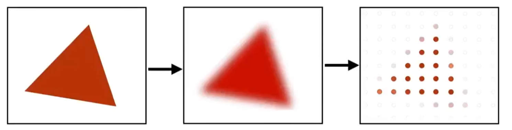
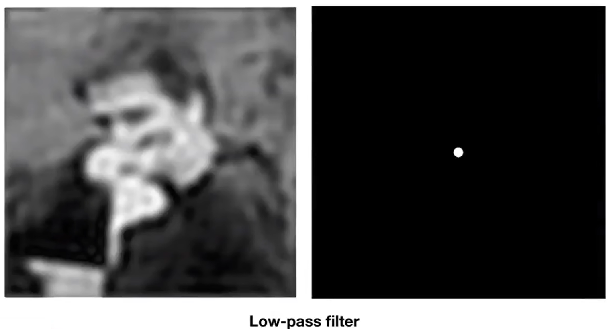
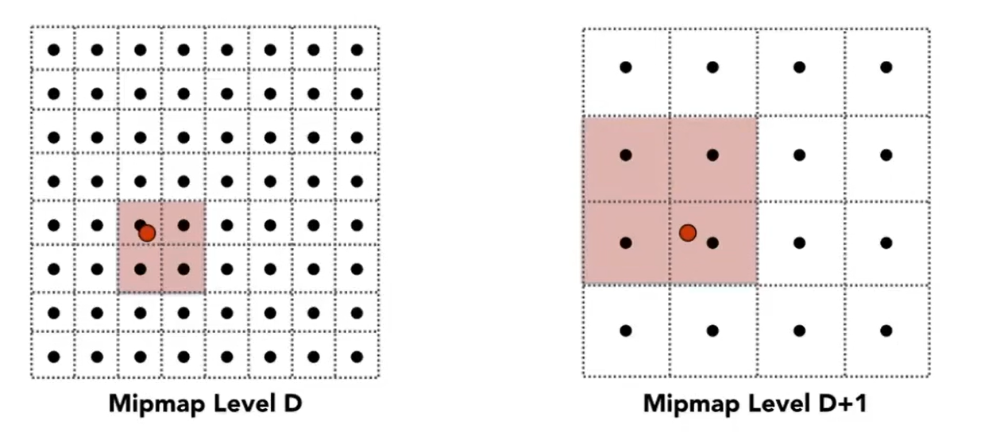
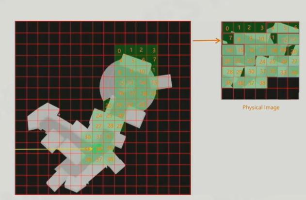
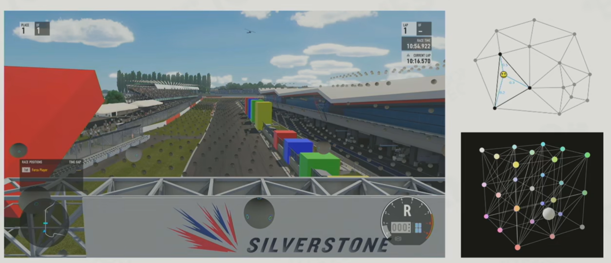
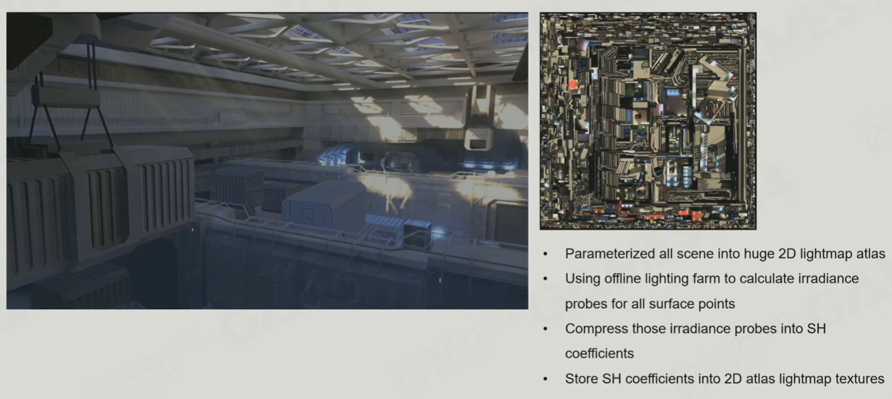

# 图像信号

## 二维傅里叶变换


$$
二维离散傅里叶变换: F(u,v) = \sum_{x=0}^{M-1} \sum_{y=0}^{N-1} f(x,y) e^{-2j\pi(\frac{ux}{M} + \frac{vy}{N})}\hfill \\
逆变换:f(x,y) = \frac{1}{MN} \sum_{u=0}^{M-1} \sum_{v=0}^{N-1} F(u,v) e^{2j\pi(\frac{ux}{M} +\frac{vy}{N})}\hfill \\

F(u,v):变换结果(复变函数) \quad R(u,v):实部 \quad I(u,v):虚部的实系数 \hfill \\
\\
对于变换结果的任意一点(u_0,v_0): \hfill \\
A=|F|=\sqrt{R^2+I^2} \quad w = \sqrt{u^2+v^2} \quad \mathbf v = (u,v) \quad \phi = \arctan[\frac{I}{R}] \hfill \\
A:振幅 \quad w:频率 \quad \mathbf v:方向 \quad \phi:相位 \hfill \\
$$

- 图像可以分解为无数二维正弦波的叠加，二维正弦波除了具有频率、幅度、相位，还具有方向


*右上图像为左上图像的振幅谱*

- 图像的**谱**：包括**振幅/相位谱**，均为灰度图，以u/v为横纵坐标，图像中心点为原点，各点的**灰度**为该点对应波的**振幅/相位**
  - 谱中，一点到中心点的距离表示信号频率，一点相对于中心点的方向表示信号的方向
- 处理时可能会将原图复制若干份拼接起来，再计算中间一份的信号（本质上是延拓图像信号的定义域）
  - 原图如果不是自拼接的，那么连接处一定会存在高频信号（因此傅里叶变换的结果图中出明亮的水平和竖直线）

## 采样


- 采样定理：对模拟信号（连续信号）采样时，采样频率至少要到达模拟信号最高频率的两倍，才能还原出原始信号
- **走样来源于采样频率（时间频率/空间频率）不足**
  - 走样可能导致**锯齿、摩尔纹、视错觉**等现象
  - 在采样前使用**低通滤波或均值滤波**能够缓解走样

- 上采样(Upsampling)：提高采样频率，通常通过空间插值或时间插值来生成额外的采样数据
- 降采样(Downsampling)：降低采样频率，通常是为了得到分辨率更低的图像



### 重要性采样

$$
蒙特卡洛积分法: \hfill \\
有函数g(\mathbf x),\mathbf x \in D,随机变量\mathbf X满足\int_{D}f_X(\mathbf x)\mathrm d\mathbf x=1 ,且\forall \mathbf x \in D,f_X(\mathbf x)>0\hfill \\
则\int_{D}g(\mathbf x)\mathrm d\mathbf x = \int_{D}\frac{g(\mathbf x)}{f_X(\mathbf x)}f_X(\mathbf x) \mathrm d\mathbf x =E\left[\frac{g(\mathbf x)}{f_X(\mathbf x)}\right] \approx \frac{1}{N}\sum_{i=1}^N \frac{g(\mathbf X_i)}{f_X(\mathbf X_i)} \hfill \\
其中X_i为符合f_X(\mathbf x)所规定分布的样本 \hfill \\
\\
若X符合均匀分布,则表示均匀采样,\int_{D}g(\mathbf x)\mathrm d\mathbf x \approx \frac{V(D)}{N}\sum_{i=1}^N g(\mathbf X_i),否则表示重要性采样 \hfill \\
$$

## 反走样(Anti Aliasing)


- 默认片元采样方式：对于每个片元，使用一个**采样点**，直接取**当时**的采样结果为输出结果

### 超采样(Super Sampling)

- 每个片元使用**多个采样点**，分别计算采样结果，对其**加权平均**得到输出结果
- 采样的开销成倍增加

### 多重采样(Multiple Sampling)

- 如果一个片元靠近所属图元**边缘**，则使用多个采样点，仅在一个（图元内部的）采样点进行着色计算，其他采样点只进行**覆盖计算**，**输出结果=颜色计算结果×覆盖比例**；如果一个片元远离所属三角形边缘，仍使用一个采样点

- 效果与超采样相近，而开销显著降低

### 时间采样(Temporal Sampling)


- 用于片元着色器中反走样
- 每个片元使用**当前采样点**，以及**前若干帧内“相同位置”的片元的采样结果**，对其**加权平均**得到输出结果
  - 采样点（相对于片元中心）的位置不必固定，可以随时间按一定规律变动
  - 每个片元中心会映射到某物体的某个纹理上的某个位置，（近似）映射到**同一物体的同一纹理的同一纹理坐标**的两个片元中心，称其为“相同位置”的片元
  - **重投影**：使用**速度缓冲**，来确定上一帧的某个片元与当前帧的哪个片元“位置相同”，
  - **数据验证**：使用某种规则来对前后采样结果对比检查，确定是否可能发生物体抖动、遮挡关系变化、光照变化等特殊情况，视情况考虑是否放弃前若干帧的采样结果
- 不增加总采样次数，开销较低

## 滤波(Filter)

- 滤波泛指各种输入图像并输出新图像的过程，新图像是对原图像信息的提取、变换、整合

### 空间域滤波

$$
一元函数卷积:g(t) = h * f = \int_{-\infin}^{\infin}h(t-\tau)f(\tau)\mathrm d \tau \hfill \\
二元函数卷积:g(x,y) = h * f = \int_{-\infin}^{\infin} \int_{-\infin}^{\infin} h(x-u,y-v)f(u,v) \mathrm d u \mathrm d v \hfill \\
$$

- 将图像视为二元函数，空间域滤波的本质是**卷积**运算
  - 图像是离散的，所以典型的卷积实现方式是在图像上**应用"模板"**，模板在一个位置与原图“点乘”后到一个像素的结果

  - **对图像应用空间域滤波，然后每次采样单点，等价于不滤波，然后每次采样多点加权平均**

- 均值滤波：即典型的空间域滤波
- 中值滤波：不是取周围若干个像素的平均值，而是取中位数


上图为边缘提取常用的三对算子

- 边缘提取：利用卷积，生成一张突出原图边缘信息的新图
  - 通常要做两次卷积，结果相加得到新图
  - 利用新图处理旧图，能实现锐化


- 双边滤波：没有固定的卷积核，权重还与被处理图本身像素的颜色有关
  - 处理某像素时，令颜色相近的像素拥有更高的权重，则可以在缓解噪声/锯齿的同时保留一定的边界
- 联合双边滤波(Joint Bilateral Filter)：没有固定的卷积核，引入一张额外的图，权重还与额外图上对应位置的像素的颜色有关
  - 通过额外图，可以实现让原图的某些区域变得模糊，某些区域基本不变

### 频率域滤波

- 将图像视为二元函数，频率域滤波的过程是固定的：
  1. 预处理
  2. 对图像进行离散二维傅里叶变换（空间域→频率域）
  3. 对变换结果进行某种处理
  4. 对图像进行离散二维逆傅里叶变换（频率域→空间域）
  5. 后处理

### 高通滤波


- 去除低频信号；效果大体为保留边缘，去除色块

### 低通滤波



- 低通滤波：去除高频信号；效果大体为图像变得模糊
- **低通滤波+单点采样≈不滤波+多点采样取平均**

### 纹理滤波方式

- 对纹理滤波，通常指输入原纹理，生成Mipmap；通常是每2X2个像素为一组，计算其**混合值**

- 对于不同类型的纹理，计算混合值的方式不同（以下仅列出最基本的方法）：
  - 颜色：取平均值
  - 深度：取最小值
  - 材质ID：取众数（每一级都在第0级的基础上计算更准确）
  - 法线：取平均值后归一化
  - 纹理坐标：取平均值

### 法线混合


*上半部分为四个待混合纹素，左下为理想结果，中下为没有修正粗糙度导致的错误结果，右下为相对正确的结果*

- 每个纹素对应的一小块区域内，法线分布有无数种可能，难以精确描述，因此简单地认为法线总是符合**von Mises-Fisher分布**
  - von Mesh Fisher分布即三维空间的球面正态分布，可以用一个波瓣来表示（波瓣上某点到原点距离表示该方向上的概率密度）
  - 表面法线方向即反映**均值向量**，Microfacet模型中的粗糙度即反映**标准差**
- **4个纹素混合后，新纹素的真实粗糙度必然比四个纹素的平均粗糙度更高（除非4个纹素的法线方向完全相同）**
  - **应当额外存储混合引起的粗糙度提高，并在计算光照时应用调整值**

# 着色(Shading)

## Physically-based Rendering

- 指渲染中的一切过程都基于物理来模拟（发光，光线传输，折射反射，成像等）
- 实时渲染中的PBR通常局限于材质，且材质的种类有限

## 着色方式

- **Flat Shading：**每个面着色一次（法线方向为任意两边的叉积），该面的所有片元颜色相同

- **Gouraud Shading：**每个顶点着色一次，每个片元的颜色根据所属三角形顶点的颜色，利用重心坐标插值而得（直接对颜色插值完全不符合光学规律）

- **Phong Shading：**每个片元着色一次

## 法线计算


- **面法线**：该面任意两边的叉积
- **顶点法线**：通常由包含该顶点的所有面的法线方向平均而得（简单平均，或根据各个面的面积加权平均）
  - 顶点法线方向是建模时就确定好的，如果自动计算的结果不合适，可以人为修改顶点法线

- **片元法线**：根据所属面各顶点的法线，利用重心坐标插值而得
  - 理论上，一个面内的所有片元应当具有相同的法线方向；但现实中的物体由无数多的三角形面构成，模型无法精确模拟
  - 多数情况下，改用插值计算片元法线，能够使各个面过渡更平滑，看起来反而更真实，因此这是默认的计算方式
  - 如果确实要表现边缘锐利的平面，可以人为增加一些位置相同，法线不同的顶点，使每个面各顶点法线相同

### 法线贴图(Normal Map)


$$
编码:\mathbf c=\frac{\mathbf n+\mathbf i}{2} \hfill \\
解码:\mathbf n= 2\mathbf c-\mathbf i \hfill \\
\mathbf c:\mathrm{RGB}颜色 \quad \mathbf i:(1,1,1) \quad \mathbf n:法线 \hfill \\
\\
编码:\mathbf p=\frac{(n_x,n_y)}{|n_x|+|n_y|+|n_z|} \quad 
\mathbf p'=\begin{cases}
\mathbf p \quad n_z \ge 0 \\
(1-|p_y|,1-|p_x|)*(\mathrm{sign}\{x\},\mathrm{sign}\{y\}) \quad n_z<0
\end{cases}
\quad \mathbf c = \frac{\mathbf p'+\mathbf i}{2} \hfill \\
解码:\mathbf p'=2\mathbf c-\mathbf i \quad z=1-|p'_x|-|p'_y|\quad 
\mathbf n=\begin{cases}
(p'_x,p'_y,z) \quad z \ge 0 \\
(1-|p'_y|,1-|p'_x|,z) * (\mathrm{sign}\{x\},\mathrm{sign}\{y\},1) \quad z<0
\end{cases} \hfill \\
\mathbf c:\mathrm{RG}颜色 \hfill \\
$$

```glsl
float2 normalToOctoUV(float3 n)
{
    float2 p = n.xy / dot(1, abs(n));
    if (n.z < 0)
        p = (1.0 - abs(p.yx)) * sign(p.xy);
    return p * 0.5 + 0.5;
}

float3 octoUVToNormal(float2 uv)
{
    float2 p = uv * 2 - 1;
    float3 n = float3(p, 1 - dot(1, abs(p)));
    if (n.z < 0)
    {
        n.xy = (1 - abs(n.yx)) * sign(n.xy);
    }
    return normalize(n);
}
```

- 直接规定每个**纹素**的法线方向可以用**RGB图**或**RG图**记录
  - 不能直接简单地保留xy，因为z有正负；应当使用**八面体映射**

- 法线贴图是**切线空间**下的数据（**默认表面朝向Z轴正方向**），实际使用时要变换到**观察空间**
- 每个片元不再通过顶点插值计算法线方向，而是通过纹理映射计算
- 仅改变法线方向只能呈现出部分凹凸效果


### 位移贴图(Displacement Map)

- 直接规定每个**纹素**相对于所属模型平面的凹凸量（规定凹下或凸起的方向总是垂直于平面，所以可以用**灰度图**记录）
- 位移贴图在几何阶段就会发挥作用，会改变若干顶点的位置，乃至增加新的顶点和三角面（利用**动态曲面细分**技术）
- 每个片元不再通过顶点插值计算法线方向，而是映射到位移贴图，根据该点附近纹素的凹凸量直接计算出法线
- 位移贴图不仅改变法线方向，影响直接光照计算；还改变几何数据，影响阴影计算等（不影响渲染以外的系统）

## 纹理映射

- 纹理不仅包括颜色纹理，还包括法线纹理、材质参数纹理、材质ID纹理、UV纹理等
- 纹理空间：纹理左下角为原点，纹理右上角为(1,1)（如果纹理坐标超出此范围，则需要考虑纹理的延展方式）
  - 若纹理分辨率为N×N，则纹素在纹理空间内是边长为1/N的正方形
  - 片元在屏幕空间内是边长为1的正方形，映射到纹理空间后为形状和大小不确定的四边形


- **顶点纹理坐标**：为模型设定纹理时，每个顶点的纹理坐标便已确定，存放在顶点缓冲区中
  
- **片元纹理坐标**：根据所属面各顶点的纹理坐标，利用重心坐标插值而得


- **最近点(Nearest)**：取最接近片远纹理坐标的单个纹素，直接取其纹理值

- **双线性插值(Bilinear)**：取最接近片元纹理坐标的四个纹素，求其纹理值的双线性插值

### Mipmap


- **Mipmap**：基于原纹理额外生成的若干个纹理；每次将前一次的纹理长和宽压缩为1/2
  - 原纹理每四个纹素（2×2）一组，其混合值存放在一个纹理中（见**纹理滤波方式**），以此方式有损压缩
  - 占用的总显存为原纹理的133%
  - 生成Mipmap也是一种**滤波**过程



*上左图中，每个纹素的尺寸为1/16，上右图中，每个纹素的尺寸为1/8；尺寸介于这两个值之间片元会被映射到这两个mipmap上*

- **三线性插值(Trilinear)**：求出纹理空间内某片元的尺寸，映射到**尺寸最接近的两张mipmap上**，两张mipmap中分求双线性插值，其结果再求线性插值


- **片元尺寸**：一个片元与其相邻片元的纹理坐标的差值可以近似表示该片元在纹理空间内的尺寸
- 计算Mipmap等级最合适的方法是利用着色器中的`ddx`和`ddy`函数（GPU执行着色器时每次处理2x2个像素，以支持这对函数）

### 各项异性过滤


- **Ripmap**：基于原纹理额外生成的若干个纹理；每次将前一次的纹理长或宽压缩为1/2
  - 原纹理每两个纹素（1×2或2×1）一组，其混合值存放在一个纹理中，以此方式压缩
  - 可以设置**各项异性倍率**，如16×表示长和宽最多压缩到1/16
  - 各向异性倍率为2×时，占用总显存为原纹理的225%；为无穷大时，则占用的总显存近似为400%

- **各向异性过滤(Anisotropic Filtering):**求出纹理空间内某片元的长宽，映射到**长宽最接近的四张ripmap上**，四张ripmap中分求双线性插值，其结果再求双线性插值

## 渲染方程

$$
L(\mathbf p,\mathbf v) = L_e(\mathbf p,\mathbf v) +L_r(\mathbf p,\mathbf v) \hfill \\
L_r(\mathbf p,\mathbf v)= \int_{\Omega^{+}} L(-\mathbf l,\mathbf p) (\mathbf l \cdot \mathbf n) f(\mathbf p,\mathbf l,\mathbf v) \mathrm d\omega \hfill \\
注意到\mathbf l \cdot \mathbf n=\cos\langle \mathbf l,\mathbf n \rangle \quad (兰伯特余弦定理) \quad \mathbf n由\mathbf p决定,故自变量不列出\mathbf n \hfill \\
\\
\mathbf p:被观察点位置 \quad \mathbf v:由\mathbf p指向观察者位置的单位向量 \quad
\mathbf l:由\mathbf p指向光源(或反射源)的单位向量 \hfill \\
\mathbf n:\mathbf p处的单位法向量 \quad \Omega:以\mathbf p为中心,以\mathbf n为朝向的半球面(理论上总有\mathbf l \cdot \mathbf n \ge 0) \hfill \\
\\
L(\mathbf p,\mathbf v):从\mathbf p沿\mathbf v方向发出和反射光线的总亮度 \hfill \\
L_e(\mathbf p,\mathbf v):从\mathbf p沿\mathbf v方向的自发光亮度 \hfill \\
L(-\mathbf l,\mathbf p) :所有沿-\mathbf l射到\mathbf p的光线的总亮度\hfill \\
L_r(\mathbf p,\mathbf v) :从\mathbf p沿\mathbf v方向的反射光亮度 \hfill \\
\\
直接求解:L_r(\mathbf p,\mathbf v) 
=\int_{\Omega^{+}} L(-\mathbf l,\mathbf p) (\mathbf l \cdot \mathbf n) f(\mathbf p,\mathbf l,\mathbf v) \mathrm d\omega \hfill \\
=\int_0^{2\pi} \mathrm d \theta \int_0^\frac{\pi}{2} L(-\mathbf l,\mathbf p) (\mathbf l \cdot \mathbf n)f(\mathbf p,\mathbf l,\mathbf v)\sin \phi \mathrm d\phi \hfill \\
其中,\mathbf l=\{\cos \theta\sin \phi,\sin \theta \sin \phi,\cos \phi\} \hfill \\
\\
对于单一光源直射某点的情况,L_r(\mathbf p,\mathbf v)= E(\mathbf o\rightarrow \mathbf p)  f(\mathbf p,\mathbf l,\mathbf v) \hfill \\
E(\mathbf o\rightarrow \mathbf p):光源\mathbf o照射\mathbf p产生的光照度(考虑照射角衰减);如理想点光源直射时,E(\mathbf o\rightarrow \mathbf p)=\frac{\Phi}{4\pi(\mathbf o-\mathbf p)^2} \hfill \\
\\
如果物体没有镜面反射: \hfill \\
L_r(\mathbf p,\mathbf v)= \int_{\Omega^{+}} L(-\mathbf l,\mathbf p) (\mathbf l \cdot \mathbf n) \frac{\rho}{\pi} \mathrm d\omega=\frac{\rho}{\pi}E_i(\rightarrow\mathbf p) \hfill \\
E(\rightarrow\mathbf p):所有光源,反射源在\mathbf p产生的光照度(考虑照射角衰减) \quad \rho:\mathbf p点处的\textbf{兰伯特反射率} \hfill \\
假设只有一个方向有光入射(如果任意方向入射光反射后能量守恒,那么可以推广到一般情况): \hfill \\
E(\mathbf p\rightarrow)=\int_{\Omega^{+}} \frac{\rho}{\pi}E(\rightarrow\mathbf p) \cos\phi \mathrm d\omega_o=E(\rightarrow\mathbf p) \rho \hfill \\
\rho = 1时,E(\mathbf p\rightarrow)=E(\rightarrow\mathbf p),总能量不变 \hfill \\ 
注意:\int_{\Omega^{+}} \mathrm d\omega=2\pi,\int_{\Omega^{+}} \cos\phi \mathrm d\omega=\pi \quad \cos\phi \mathrm d\omega表示立体角投影,其积分即表示半球面投影而得的圆的面积\hfill \\
$$

- 渲染方程是**二重积分**
- **渲染方程不涉及颜色，要将其用于着色，需考虑可见光范围内的SPD；而SPD过于复杂，将其转换为线性颜色空间中的坐标，然后亮度运算变为线性颜色空间内的颜色值运算**
- 在仅考虑反射的光照模型中，$ f(\mathbf p,\mathbf l,\mathbf v)$即双向**反射分布函数(BRDF)**；如果还考虑透射，那么此函数中额外包含**双向透射分布函数(BTDF)**，二者合称**双向散射(BSDF)分布函数**（反射+透射=散射≠次表面散射）
  - **此函数的量纲是$\frac{1}{\omega}$，单位为$\mathrm{sr}^{-1}$，与光照度相乘得到亮度**
- 对于给定的$\mathbf p$，BRDF是一个四维函数，给定$\mathbf l$或$\mathbf v$后，变为定义在球面上的二维函数，因此可以用波瓣表示
  - 给定$\mathbf l$时，波瓣表示各个方向上反射光的相对强度
  - 给定$\mathbf v$时，波瓣表示各个方向入射光对出射光的相对贡献大小


### Split Integral

$$
\int_a^b f(x)g(x) \mathrm dx \approx \frac{\int_a^b f(x) \mathrm dx}{\mathrm dx}\int_a^b g(x) \mathrm dx \hfill \\
f(x)或g(x)任意一个在[a,b]内的取值变化较小时,此近似较为准确;此式可推广到曲线/曲面积分 \hfill \\
$$

- 积分计算成本过高可以通过预计算解决，但如果积分中的变量过多，需要用高维数据结构存储，其空间成本无法接受
- 环境映射和全局光照都需要处理来自所有方向的光照，其中的许多方法都体现了Split Integral的思想

## 光照模型

### Blinn-Phong模型

- 认为**反射光=环境光(Ambient)+漫反射(Diffuse Reflection)光+镜面反射光(Specular Reflection)**
- 规定了漫反射和镜面反射的计算方式（只考虑直接光照）


$$
给定物体表面一点\mathbf p,考虑单一光源,规定f(\mathbf l,\mathbf v,\mathbf n) = k_d + k_s\frac{(\mathbf n \cdot \mathbf h)^p}{(\mathbf l \cdot \mathbf n)}: \hfill \\
L_{r}(\mathbf p,\mathbf v)= E(-\mathbf l,\mathbf p) [k_d(\mathbf l \cdot \mathbf n) + k_s(\mathbf n \cdot \mathbf h)^g] \quad 其中\mathbf h =\frac{ \mathbf l + \mathbf v}{|\mathbf l+\mathbf v|} \hfill \\
k_d:\mathbf p处的漫反射系数 \quad k_s:\mathbf p处的镜面反射系数 \quad g:可调参数,g越大高光越集中 \hfill \\
注意:k_d和k_s的量纲是\frac{1}{\omega},与光照度相乘后,得到亮度 \hfill \\
\\
经验公式:g=\frac{2}{\alpha^2}-2 \quad \alpha:微表面模型中的粗糙度 \hfill \\
$$

- **实际用于着色时，对RGB三个分量的反射率不同（由贴图规定），自然体现出物体的颜色**
- 越光滑的物体，其镜面反射越强，即反射光越集中于与入射光对称的方向上（因此高光区域随光源和观察点变化而变化）
- 难以表现出各种不同的材质，塑料感强

### Microfacet BRDF


*上图中，从球体中心移动到边缘的过程中观察角不断增大，镜面反射越来越明显，到极大值点后迅速衰减*


*F项与法线夹角的关系（假定入射光线和观察方向关于法线对称），左上图为绝缘体，右上图为导体*
$$
\mathrm{Cook-Torrance}模型:f(\mathbf p,\mathbf l,\mathbf v) = (1-F(\mathbf p,\mathbf l,\mathbf v))\frac{\rho}{\pi} + \frac{D(\mathbf p,\mathbf l,\mathbf v)F(\mathbf p,\mathbf l,\mathbf v)G(\mathbf p,\mathbf l,\mathbf v)}{4 \ (\mathbf l \cdot \mathbf n)(\mathbf v \cdot \mathbf n)} \hfill \\
给定物体表面一点\mathbf p,考虑单一光源:\underset{direct}{L_{r}(\mathbf p,\mathbf v)}= E(-\mathbf l,\mathbf p) (\mathbf l \cdot \mathbf n) \left[(1-F(\mathbf p,\mathbf l,\mathbf v))\frac{\rho}{\pi} + \frac{D(\mathbf p,\mathbf l,\mathbf v)F(\mathbf n,\mathbf l)G(\mathbf p,\mathbf l,\mathbf v)}{4 \ (\mathbf l \cdot \mathbf n)(\mathbf v \cdot \mathbf n)} \right] \hfill \\
D(\mathbf p,\mathbf l,\mathbf v):法线的分散情况(法线方向越集中,且越集中在半程向量方向时,向观察方向反射得越多) \hfill \\
F(\mathbf p,\mathbf l,\mathbf v):不考虑微表面几何,射入的光线被反射的比例(大体上,观察方向与入射方向夹角越大,反射越多) \hfill \\
G(\mathbf p,\mathbf l,\mathbf v):入射和反射光线不被微表面结构遮挡的比例(入射方向/观察方向与法线夹角越小,未被遮挡越多) \hfill \\
\alpha:\mathbf p处的粗糙度,[0,1] \quad \rho:\mathbf p处的\textbf{兰伯特反射率} \hfill \\
\\
F(\mathbf p,\mathbf l,\mathbf v) \approx \mathrm{Lerp}\{F_0,1,(1 - \mathbf v \cdot \mathbf h)^5\}=F_0 + (1-F_0)(1 - \mathbf v \cdot \mathbf h)^5 \hfill \\
F_0:\mathbf p处的\textbf{菲涅尔反射率}(入射方向,观察方向,法线方向共线时的F项) \hfill \\
F_0=\frac{(n_1-n_2)^2}{(n_1+n_2)^2} \quad n_1,n_2:反射面两侧两种物质的折射率 \hfill \\
$$

- **Microfacet模型**为计算BRDF提供理论，符合这套理论的BRDF即称为Microfacet BRDF	
- **每次反射时，入射角和F项决定了漫反射和镜面反射的能量分配（假设材质各向同性）**
  - **在BRDF中，次表面散射被简化成了漫反射，分配给漫反射的能量不是被吸收，就是射出，不考虑微表面几何**
  - **在BRDF中，分配给镜面反射的能量，可能射出，可能被遮挡（进行下一次反射，能量再分配），不可能被直接吸收**
  - 由于会发生多次反射，入射角各不相同，因此全过程的漫反射和镜面反射能量占比也与微表面几何有关

- **Cook-Torrance模型**将镜面反射分为D,F,G三项，**没有考虑多次散射**，认为光线一旦被遮挡就消失
  - **F项有通用的近似方式，D项,G项则有多种近似**

$$
\mathrm{Beckmann \ NDF}:D(\mathbf p,\mathbf l,\mathbf v)=\frac{e^{-\tan^2{\theta_h}/\alpha^2}}{\pi \alpha^2\cos^4\theta_h} \quad \cos \theta_h=\mathbf n \cdot \mathbf h \hfill \\
\mathrm{Trowbridge-Reitz(GGX) \ NDF}:D(\mathbf p,\mathbf l,\mathbf v) = \frac{\alpha^2}{\pi((\mathbf n \cdot \mathbf h)^2(\alpha^2-1)+1)^2} \hfill \\
$$

- D项即Normal Distribution Function(法线分布函数)

$$
\mathrm{Smith \ SMT}:G(\mathbf p,\mathbf l,\mathbf v) = g(\mathbf l)g(\mathbf v) \quad 其中 g(\mathbf x) = \frac{\mathbf n \cdot \mathbf x}{(1-k)\mathbf n \cdot \mathbf x + k} \quad k = \frac{(\alpha + 1)^2}{8} \hfill \\
$$

- G项即Shadowing-Masking Term，可以分为Shadowing项（入射光被遮挡）和Masking项（反射光被遮挡）

| 材质类型 | 描述                 | 计算间接光照时合适的采样方向         |
| -------- | -------------------- | ------------------------------------ |
| Diffuse  | 以漫反射为主         | 分散在各个方向上                     |
| Glossy   | 兼有镜面反射和漫反射 | 大部分集中在观察方向镜面对称的方向上 |
| Specular | 以镜面反射为主       | 集中在观察方向镜面对称的方向上       |

#### Kulla-Conty Approximation


*随粗糙度提高，总体颜色更加平均，但整体亮度不应该降低（只有漫反射系数降低会导致总体亮度降低）*

- Cook-Torrance模型中，只考虑光线一次反射会导致能量减少（由G项引起）
  - **Kulla-Conty Approximation的目的是补上镜面反射部分少算的能量，与漫反射无关**

- **入射光可以分为无数个单向的入射光，因此要证整体能量守恒，只要证任意单一方向的入射光反射后能量守恒**

$$
在本节中,\mathbf n始终指向天顶方向,\phi表示出射方向与天顶方向的夹角,记\sin\phi = \mu(套用计算结果前,需要先旋转坐标系) \hfill \\
假设只有一个方向有光入射,且材质是各向同性的(与\theta无关,但仍与\phi有关): \hfill \\
L_r(\mathbf p,\mathbf v)= E(-\mathbf l,\mathbf p)f(\mathbf p,\mathbf l,\mathbf v)  \hfill \\
记\eta(\mathbf p,\mathbf l)=\frac{E(\mathbf p\rightarrow)}{E(-\mathbf l,\mathbf p)}=\frac{1}{E(-\mathbf l,\mathbf p)}\int_{\Omega^+} L_r(\mathbf p,\mathbf v) \cos \phi \mathrm d \omega_o = \int_{\Omega^+} f(\mathbf p,\mathbf l,\mathbf v) \cos\theta_o \mathrm d \omega_o \hfill \\
=\int_0^{2\pi} \mathrm d\theta \int_0^{\pi/2} f(\mathbf p,\mathbf l,\phi) \cos\phi \sin\phi \mathrm d\phi = 2\pi \int_0^1 f(\mathbf p,\mathbf l,\mu) \mu \mathrm d\mu \hfill \\
\\
假设F(\mathbf p,\mathbf l,\mathbf v) \equiv 1(无漫反射,无吸收): \hfill \\
理想情况下应当有\eta(\mathbf p,\mathbf l) \equiv 1,但由于G项,\eta(\mathbf p,\mathbf l) \le 1 \hfill \\
假设存在一个函数f_{kc},替换f后计算得到的\eta_{kc}(\mathbf p,\mathbf l)=1-\eta(\mathbf p,\mathbf l),那么f+f_{kc}使镜面反射能量守恒 \hfill \\
由对称性猜测,f_{kc}(\mathbf p,\mathbf l,\mathbf v)=g(\mathbf p)(1-\eta(\mathbf p,\mathbf l))(1-\eta(\mathbf p,\mathbf v)) \hfill \\
\Rightarrow \eta_{kc}(\mathbf p,\mathbf l)=g(\mathbf p)(1-\eta(\mathbf p,\mathbf l))2\pi \int_0^1 (1-\eta(\mathbf p,\mathbf v)) \mu \mathrm d\mu \hfill \\
\Rightarrow 1=\frac{\eta_{kc}(\mathbf p,\mathbf l)}{1-\eta(\mathbf p,\mathbf l)}=g(\mathbf p)2\pi \int_0^1 (1-\eta(\mathbf p,\mathbf v)) \mu \mathrm d\mu \hfill \\
\Rightarrow g(\mathbf p)=\frac{1}{2\pi\int_0^1 (1-\eta(\mathbf p,\mathbf v)) \mu \mathrm d\mu} \hfill \\
记\overline{\eta}(\mathbf p,\mathbf x)=2\int \eta(\mathbf p,\mathbf x) \mu \mathrm d\mu \hfill \\
综上,f_{kc}(\mathbf p,\mathbf l,\mathbf v)=\frac{(1-\eta(\mathbf p,\mathbf l))(1-\eta(\mathbf p,\mathbf v))}{\pi(1-\overline{\eta}(\mathbf p,\mathbf v))} \hfill \\
其中,\eta(\mathbf p,\mathbf x)=2\pi \int_0^1 f(\mathbf p,\mathbf x,\mu) \mu \mathrm d\mu  = 2\pi h(\alpha,\mathbf x) \quad (注意F\equiv 1)\hfill \\
h:仅含\alpha,\mathbf x和常数的函数 \hfill \\
$$


- **F项始终为1的情况下，$\eta(\mathbf p,\mathbf x)$可预计算，进而$\overline{\eta}(\mathbf p,\mathbf x)$和$f_{kc}(\mathbf p,\mathbf l,\mathbf v)$可预计算**
  - **在此情况下，直接在BRDF补上$f_{kc}$一项，即可确保能量守恒**


$$
F(\mathbf p,\mathbf l,\mathbf v) < 1(有漫反射)时: \hfill \\
记\eta^s(\mathbf p,\mathbf l)=\frac{E^s(\mathbf p \rightarrow)}{E(-\mathbf l,\mathbf p)} \quad \eta^s_i(\mathbf p,\mathbf l)=\frac{E^s_i(\mathbf p \rightarrow)}{E(-\mathbf l,\mathbf p)} \hfill \\
E^s(\mathbf p \rightarrow):镜面反射光的总光通量 \quad E^s_i(\mathbf p \rightarrow):第i轮反射中,镜面反射光的总光通量 \hfill \\
\\
记\overline{F}(\mathbf p,\mathbf l) = 2\int_0^1 F(\mathbf p,\mathbf l,\mu) \mu \mathrm d \mu \hfill \\
认为\eta^s_1(\mathbf p,\mathbf l)\approx\overline{F}(\mathbf p,\mathbf l)\overline{\eta}(\mathbf p,\mathbf l) \quad \eta^s_i(\mathbf p,\mathbf l)\approx\overline{F}(\mathbf p,\mathbf l)(1-\overline{\eta}(\mathbf p,\mathbf l))\eta_{i-1}^s \hfill \\
\Rightarrow \eta^s(\mathbf p,\mathbf l) = \sum_{i=0}^\infty \eta^s_i(\mathbf p,\mathbf l)=\frac{\overline{F}(\mathbf p,\mathbf l)\overline{\eta}(\mathbf p,\mathbf l)}{1-\overline{F}(\mathbf p,\mathbf l)(1-\overline{\eta}(\mathbf p,\mathbf l))} \hfill \\
\eta^s(\mathbf p,\mathbf l)与f_{kc}相乘,即得到适用于F < 1情况下的补偿项 \quad (F \equiv 1时,\eta^s(\mathbf p,\mathbf l) = 1) \hfill \\
$$

- **简单地认为计算结果能推广到F不为1的情况**
  - **F不为1意味着每次反射过程中，都有一部分能量被分配给漫反射**

#### Metallic PBR材质

$$
\mathbf F_0=\mathrm{Lerp}\{\mathbf {0.04},\mathbf A,m\} \hfill \\
\mathbf F_0:以\mathrm{RGB}三通道表示的菲涅尔反射率 \quad \mathbf A:\mathrm{Albedo} \quad m:金属度
$$


  - Albedo图：RGB，同时影响漫反射和镜面反射光颜色


  - Roughness图：灰度，表示粗糙度，影响镜面反射光亮度


  - Metallic图：灰度，表示金属度，影响镜面反射光亮度
  - Roughness图规定的是特定分辨率下粗糙度，分辨率降低后，从微表面模型来考虑，实际粗糙度应当提高

### Linearly Transformed Cosines


$$
L_r(\mathbf p,\mathbf v)= L\int_{\Omega} (\mathbf l \cdot \mathbf n) f(\mathbf p,\mathbf l,\mathbf v) \mathrm d\omega \hfill \\
认为f(\mathbf p,\mathbf l,\mathbf v)和\mathbf v给定时,\forall \Omega,\exists \mathbf M_{4 \times 4}, \hfill \\
使得L_r(\mathbf p,\mathbf v)=
L'\int_{\Omega'} \cos\phi  \mathrm d  \frac{\mathbf M \mathbf l}{|\mathbf M\mathbf l|} \quad 其中\phi为\mathbf M\mathbf l与天顶的夹角\\
$$

- 一种通用的，用于计算**有体积均匀光源**光照的方法
  - 如果光源可能会部分被遮挡，则需要通过采样确认光源在球面上的覆盖范围
- 认为对于任意给定的BRDF和观察方向，将方向整体旋转，并将BRDF变成余弦函数的积分，结果与原积分相等
  - 函数的形式不是任意的，考虑到BRDF的性质，且为了适应任意形状的光源，才选择了余弦函数
- 怎样的变换矩阵能使变换前后积分不变，可以在预计算阶段通过多轮计算得到近似数值解

### 常见参数名

- Emissive：自发光(RGBA)
- Diffuse Reflection Albedo and Opacity：漫反射率和透明度(RGBA)
- Specular Reflectance：镜面反射率(RGB)
- Roughness：粗糙度

## 直接光照

$$
L_r(\mathbf p,\mathbf v)= \underset{direct}{L_{r}(\mathbf p,\mathbf v)}+\underset{indirect}{L_{r}(\mathbf p,\mathbf v)} \quad 
\underset{direct}{L_{r}(\mathbf p,\mathbf v)}= \sum_i E(\mathbf o_i,\mathbf p)V\mathbf(\mathbf o_i,\mathbf p) (\mathbf l_i \cdot \mathbf n) f(\mathbf p,\mathbf l_i,\mathbf v) \hfill \\
其中\mathbf l_i= \mathbf o_i-\mathbf p  \hfill \\
\underset{direct}{L_{r}(\mathbf p,\mathbf v)}:直接光照产生的反射光亮度 \quad \underset{indirect}{L_{r}(\mathbf p,\mathbf v)}:间接光照产生的反射光亮度 \hfill \\
E(\mathbf o_i,\mathbf p):光源\mathbf o_i\textbf{直射}\mathbf p产生的光照度 \quad V\mathbf(\mathbf o_i,\mathbf p):\mathbf o_i与\mathbf p间的可见度,[0,1],0表示直射光完全被遮挡 \hfill \\
$$

### Shadow Mapping

$$
\underset{direct}{L_{r}(\mathbf p,\mathbf v)}= \sum_i E(\mathbf o_i,\mathbf p)V\mathbf(\mathbf o_i,\mathbf p) (\mathbf l_i \cdot \mathbf n) f(\mathbf p,\mathbf l_i,\mathbf v) \hfill \\
\approx \overline{V_i}\sum_i L_{e}(\mathbf o_i,-\mathbf l_i)(\mathbf l_i \cdot \mathbf n) f(\mathbf p,\mathbf l_i,\mathbf v) \hfill \\
其中\mathbf l_i= \mathbf o_i-\mathbf p  \hfill \\
$$

- 理论上，每个光源的光照颜色应当分别与其可见度相乘，再相加；而实际中，经常用所有光源的平均可见度与各光源颜色相乘得到近似的结果
- 物体的材质以漫反射为主时，上式近似较为准确（漫反射为主便意味着各方向上$ f(\mathbf p,\mathbf l,\mathbf v)$变化不大）


*对于上图，P1无阴影，P2有阴影但是被剔除，P3有阴影*

- 总体过程：
  1. **对于每个产生阴影的光源，额外使用一个Pass（通常称为Light Pass），每个Pass的渲染结果为一个ShadowMap**
  2. **对于每个片元，向片元着色器输入各个ShadowMap及对应的光源矩阵**
  3. **根据光源矩阵，计算片元到光源的深度，以及在ShadowMap中的纹理坐标**
  4. **通过纹理坐标对ShadowMap采样，获取对应像素记录的深度，根据深度判断遮挡关系**

- 渲染Shadow Map相当于**以光源为相机（此情况下的观察空间称为光源空间）**，使用特殊的着色器，渲染出深度缓冲
  - Shadow Map在运行时动态更新，每帧更新若干次
  - 屏幕空间和Shadow Map分辨率不同、方位不同，导致屏幕空间的片元和Shadow Map中的“像素”并不一一对应
  - 特别的，渲染平行光源使用正交相机
  - 光源空间的Z轴正方向就是光源朝向，XY轴可以在XY平面内旋转（合适的XY轴朝向可以使得Shadow Map分辨率更小）
  - 确定光源坐标系后，便可确定**世界空间坐标→光源空间坐标的基变换矩阵**，用在**渲染Shadow Map的顶点着色器**中
  - 还需要将**世界空间坐标和基变换矩**阵传给**渲染到窗口的片元着色器**
- 将某个片元到光源的深度记为**A**，ShadowMap中对应的像素记录的深度记为**B**：
  - A=B：表示光源可直射该片元
  - A>B：表示该片元与光源之间有物体遮挡
  - A<B：理论上不会发生
- 然而实际上计算A，B时必然产生误差：
  - A=B：完全相等的可能性几乎为0
  - A>B：理论上A=B的位置，有可能因误差进入这种情况，进而导致错误地认为该位置被遮蔽
  - A<B：理论上A=B的位置，有可能因误差进入这种情况，因此也认为光源可直射该片元
- 为避免错误，计算出A后，将其适当地减小一个值，该值被称为**阴影偏移(Shadow Bias)**
  - 设置阴影偏移会导致一些“原本存在”的阴影“消失”，尤其是细小凹凸处
- 由于精度有限，Shadow Map仅适用于以漫反射为主的材质（因为亮度变化平滑）
- Shadow Mapping计算出的可见值非0即1，即只有可见和不可见之分，因此称为**硬阴影**（符合理想点光源、理想平行光源）
- **光源数量的增加**和**照射范围的扩大**会显著增加Shadow Mapping的时间成本

#### Second-Depth Shadow Mapping


*光源从上往下照射；Shadow Mapping的效果相当于左图，Second-Depth Shadow Mapping的效果相当于右图*

- 对Shadow Mapping的一种改进，最终的ShadowMap中，记录的不是最近片元的深度，而是**最近和次近片元深度的中间值**
- 不必再使用Shadow Bias
- 要求所有物体都具有水密性（有体积的封闭曲面），这一点难以实现（如游戏引擎中可以使用无厚度单向平面）

#### Percentage Closer Filtering

- PCF是对**可见度**滤波（如果对深度滤波，最终计算出的可见度还是非0即1）
  - 可见度是片元着色器计算过程中的临时变量，因此要修改片元着色器，令其每次采样Shadow Map的一个区域
  - 通常采用均值滤波，即可见度=**区域中比片元深度更大的像素占区域总像素数的百分比**
- 目的是消除硬阴影中的锯齿

#### Percentage Closer Soft Shadow


*如左上图，现实中的光源有一定体积，下方棕色区域即半影区域*
$$
w_p=\frac{d_r-d_b}{d_b}w_l \hfill \\
w_p:半影尺寸 \quad w_l:光源尺寸(常数) \quad d_r:投影平面到光源的距离 \quad d_b:遮挡物到光源的距离 \hfill \\
计算阴影过程中,\frac{d_r-d_b}{d_b}w_l=k\frac{片元深度-遮挡物平均深度}{遮挡物平均深度} \hfill \\
$$

- 对PCF的一种改进，不是对每个片元使用统一的滤波方式，而是**半影越大，卷积核越大**（因为这样更符合真实）
- 总体过程：
  1. 对于每个产生阴影的光源，额外使用一个Pass（通常称为Light Pass），每个Pass的渲染结果为一个ShadowMap
  2. 对于每个片元，向片元着色器输入各个ShadowMap及对应的光源矩阵
  3. 根据光源矩阵，计算片元到光源的深度，以及在ShadowMap中的纹理坐标
  4. **在一定范围内采样Shadow Map，计算遮挡物平均深度**
     - **采样范围可以固定（如5×5），也可以考虑光源尺寸、到光源的距离等（见右上图）**
     - **在采样范围内，只有深度比片元小的像素才是遮挡物，所以只有这些像素参与遮挡物平均深度计算**
  5. **根据遮挡物平均深度、片元深度，估计半影大小，进而确定第二次采样范围**
  6. **第二次采样Shadow Map，深度更大的片元占总片元数的百分比即可见度**
- PCSS得到的这种可见度平滑变化的阴影，称为**软阴影**（符合体积相对于距离不可忽略的光源）

#### Variance Soft Shadow Mapping


*上图表示一个区域内所有像素的深度的分布*
$$
V(\mathbf x)=1-F_X(x) \quad X \overset{近似}{\sim} N(\mu,\sigma) \hfill \\
\mu \approx \overline{X} \hfill \\
\sigma^2 =EX^2-(EX)^2 \approx \overline{X^2}-{\overline X}^2 \hfill \\
V(\mathbf x): \mathbf x处的片元的可见度 \quad x:\mathbf x处片元到光源的深度 \quad X:\mathrm{Shadow Map}采样区域内某像素的深度 \hfill \\
\overline{X}:\mathbf x区域内像素深度的样本均值 \quad \overline{X^2}:区域内像素深度平方的样本均值 \hfill \\
\\
N \overline{X}=\underset{X\ge x}{N} \underset{X\ge x}{\overline{X}}+\underset{X<x}{N} \underset{X<x}{\overline{X}} \hfill \\
\Rightarrow \underset{X<x}{\overline{X}}
=\frac{ N\overline{X}- \underset{X\ge x}{N} \underset{X\ge x}{\overline{X}}}{\underset{X<x}{N}} \hfill \\
\approx \frac{\overline{X}-(1-F_X(x))\underset{X\ge x}{\overline{X}}}{F_X(x)} \quad (通过分布,估计深度大于/小于x的像素的比例)\hfill \\
\approx \frac{\overline{X}-(1-F_X(x))x}{F_X(x)} \quad (直接将深度大于x的像素的深度统一视为x) \hfill \\
N:区域内像素总数 \quad \underset{X < x}{N}:区域内深度小于x的像素总数 \quad \underset{X < x}{\overline{X}}:区域内深度小于x的像素的平均深度 \hfill \\
$$

- 认为Shadow Map**任意区域中的深度总是符合正态分布**，求“深度更大像素百分比”便转化为求正态分布概率分布函数取值
- 总体过程：
  1. 对于每个产生阴影的光源，额外使用一个Pass（通常称为Light Pass），每个Pass的渲染结果为一个ShadowMap
  2. 预计算生成两个SAT，分别记录某个区域内深度的二维前缀和，以及深度的平方的二维前缀和
  3. 对于每个片元，向片元着色器输入各个ShadowMap及对应的光源矩阵
  4. 根据光源矩阵，计算片元到光源的深度，以及在ShadowMap中的纹理坐标
  5. **在一定范围内采样Shadow Map，利用SAT和近似方法快速计算遮挡物的平均深度**
  6. 根据遮挡物平均深度、片元深度，估计半影大小，进而确定第二次采样范围
  7. **第二次采样Shadow Map，利用SAT快速确定该范围内深度所符合正态分布的参数，再通过概率分布函数计算可见度**
- 查询SAT取代采样操作，大幅加快可见度计算，但精确度不如PCSS
  - 由于实际的深度分布不一定符合正态分布，计算得到的可见度时大时小
  - 可见度偏小相对可接受，可见度偏大则会导致明显的**漏光(Light Leaking)**问题

#### Distance Field Soft Shadow


#### 级联阴影(Cascade Shadow)

- 将视锥由近到远分为几个区域，对于不同阶段内的**物体**，深度写入到Shadow Map时采用的精度不同
- 两个阶段间需要实现平滑过渡

#### Vitual Shadow Map



- 类似虚拟内存，随着可见区域变化，**动态加载和释放Shadow Map**，以节约显存空间

## 环境映射(Environment Mapping)


*根据映射方式的不同，球面可以展平成不同形状*


$$
环境映射:\underset{env}{L_r(\mathbf p,\mathbf v)}= \int_{\Omega^{+}} L_r(\mathbf o_e,-\mathbf l)V(\mathbf p,\mathbf l) (\mathbf l \cdot \mathbf n) f(\mathbf p,\mathbf l,\mathbf v) \mathrm d\omega \hfill \\
\mathbf o_e:\textbf{充分远处}的环境光源 \hfill \\
$$

- **环境光表示场景中“静态”的光源和反射源，用环境贴图记录来自场景外围各个方向的入射光颜色**

  - **对于会运动的光源和物体，其光照计算与环境映射通常是独立的**

  - **环境贴图被视为包围整个场景，且距离各物体充分远的光源（所以着色时可忽略片元相对于物体中心的偏移）**
  - **理论上，记录的是来自球面各方向的入射光；而实际存储时，总是要展开成平面图像（常见的是展开成立方体的六个面）**
  - **实际渲染时，将环境贴图视为一种特殊球面光源，与一般光源的根本区别是拥有两个方向自由度**
- **物体相对于环境光的移动、缩放可忽略，只需要根据法线方向，“从圆心出发”对环境贴图采样**
- 概念上，环境映射是利用环境贴图及一些预计算手段，实现的简化版全局光照；实际渲染时，通常与
- **环境光在一个时刻静态，但会随时间变化而变化**
  - 可以生成一套环境贴图，天空、物体的反射光亮度可以通过简单插值来计算
  - 太阳这样会运动的物体必须特殊处理

### 球谐函数(Spherical Harmonics)


*上面的图形表示球谐函数在各个方位的取值，蓝色表示正数，黄色表示负数，到原点越远，绝对值越大*
$$
\int_{\Omega^{+}} B_l^m(\omega) \mathrm d \omega=\int_0^{2\pi} \mathrm d \theta \int_\frac{-{\pi}}{2}^\frac{\pi}{2} B_l^m(\theta,\phi)\sin \phi \mathrm d\phi \hfill \\
B_l^m(\theta,\phi) = 
\begin{cases}
\sqrt2 K_l^m \cos (m\phi)P_l^m(\cos \phi)  \quad m>0 \\
\sqrt2 K_l^m \sin (-m\phi)P_l^{-m}(\cos \phi)  \quad m<0 \\
K_l^0P_l^0(\cos \phi) \quad m = 0 \\
\end{cases} \hfill \\
其中,P_n(x)=\frac{1}{2^nn!}\frac{\mathrm d^n(x^2-1)}{\mathrm dx^n} (\mathrm{Legendre多项式}) \hfill \\
P_l^m(x)=(-1)^m(1-x^2)^\frac{m}{2}\frac{\mathrm d^m P_l(x)}{\mathrm dx^m} \hfill \\
K_l^m=\sqrt{\frac{2l+1}{4\pi} \frac{(l-|m|)!}{(l+|m|)!}} \hfill \\
\\
B_l^m(\omega)具有以下性质: \hfill \\
① \int_{\Omega^{+}} B_l^m(\omega)B_k^n(\omega) \mathrm d\omega
=\begin{cases}
1 \quad (l = k,且m=n) \\
0 \quad (其他)  \\
\end{cases} \hfill \\
\\
f(\omega) \approx \sum_{l=0}^{b} \sum_{m=-l}^l c_l^mB_l^m(\omega) \hfill \\
其中c_i=\int_{\Omega^{+}} f(\omega)B_i(\omega) \mathrm d\omega,称为f(\omega)在B_i(\omega)上的\textbf{投影} \hfill \\
若还有g(\omega) \approx \sum_{l=0}^{b} \sum_{m=-l}^l d_l^mB_l^m(\omega) \hfill \\
则\int_{\Omega^{+}} f(x)g(x) \mathrm d\omega= \sum_{l=0}^{b} \sum_{m=-l}^l c_l^md_l^m \int_{\Omega^{+}} [B_l^m(\omega)]^2 \mathrm d \omega 
= \sum_{l=0}^{b} \sum_{m=-l}^l c_l^md_l^m
$$

- 一系列定义在球面上的**基函数**（可以转化为球面坐标系下的二元函数），多个基函数组合起来近似表示原函数
- **最重要的性质是正交性，将两个函数均用球谐函数（近似）表示，则可以利用正交性加速计算**
- **原函数旋转，相当于将所有基函数旋转；旋转后的某个基函数总是可以用同阶基函数的线性组合表示**
- 第$l$阶有$2l+1$个不同的球谐函数；**阶数越高，频率越高**
- **两函数乘积的频率取决于两函数中频率较低的一个**
  - **只使用前若干阶基函数近似，相当于消除了一定范围内的高频信息**
- **理论上，计算球谐函数系数的方式是，将原函数和各个球谐函数相乘后求积分；而实际上，原函数和各个球谐函数都通过分辨率有限的贴图（通常是立方体贴图）来表示，因此实际计算时变为离散的相乘-求和-取平均**

### 小波变换（？）

- **直接在立方体贴图上，对每个面的纹理近似**
- **能够以较低的成本记录足够高频的信息**
- 得到的结果能较好地反映镜面反射

### Image-Based Lighting

- 预计算光照计算会用到的某些中间结果，以简化运算
- 常见的两种方法是Reflection Mapping，Diffuse Irradiance Map，分别计算镜面反射环境光和漫反射环境光
- 不属于IBR，仅影响光照计算，而不是用图像重建代替三维模型

#### Reflection Mapping

$$
\underset{env\_specular}{L_r(\mathbf p,\mathbf v)}= \int_{\Omega^{+}} L_r(-\mathbf l,\mathbf p)V(\mathbf p,\mathbf l) \frac{D(\mathbf n,\mathbf l)F(\mathbf n,\mathbf l)G(\mathbf p,\mathbf l,\mathbf v)}{4 \ (\mathbf v \cdot \mathbf n)} \mathrm d\omega \hfill \\
\approx L_r(-\mathbf r,\mathbf p) \int_{\Omega^{+}} \frac{D(\mathbf n,\mathbf l)F(\mathbf n,\mathbf l)G(\mathbf p,\mathbf l,\mathbf v)}{4 \ (\mathbf v \cdot \mathbf n)} \mathrm d\omega  \hfill \\
\mathbf r:\mathbf v关于\mathbf n的镜面对称方向 \hfill \\
\\
以\mathrm{Trowbridge-Reitz(GGX) \ NDF}为例: \hfill \\
D(\mathbf p,\mathbf l,\mathbf v) = \frac{\alpha^2}{\pi((\mathbf n \cdot \mathbf h)^2(\alpha^2-1)+1)^2} \quad 其中\mathbf h =\frac{ \mathbf l + \mathbf v}{|\mathbf l+\mathbf v|} \hfill \\
F(\mathbf p,\mathbf l,\mathbf v) = \mathrm{Lerp}\{F_0,1,(1 - \mathbf v \cdot \mathbf h)^5\}=F_0 + (1-F_0)(1 - \mathbf v \cdot \mathbf h)^5 \hfill \\
G(\mathbf p,\mathbf l,\mathbf v) = g(\mathbf l)g(\mathbf v) \quad 其中 g(\mathbf x) = \frac{\mathbf n \cdot \mathbf x}{(1-k)\mathbf n \cdot \mathbf x + k} \quad k = \frac{(\alpha + 1)^2}{8} \hfill \\
\\
注意到:\mathbf v \cdot \mathbf n = \mathbf r \cdot \mathbf n,并认为\mathbf r\cdot \mathbf h \approx \mathbf r\cdot \mathbf n,记\cos \theta = \mathbf r \cdot \mathbf n  \hfill \\
\underset{env\_specular}{L_r(\mathbf p,\mathbf v)}=L_r(-\mathbf r,\mathbf p) \int_{\Omega^{+}} \frac{D(\cos \theta,\alpha) [F_0 + (1-F_0)(1 - \cos \theta)^5]G(\cos \theta,\alpha)}{4 \cos \theta}\mathrm d\omega \hfill \\
=L_r(-\mathbf r,\mathbf p)\left[ F_0\int_{\Omega^{+}} \frac{D(\cos \theta,\alpha) [1-(1 - \cos \theta)^5]G(\cos \theta,\alpha)}{4 \cos \theta}\mathrm d\omega+\int_{\Omega^{+}} \frac{D(\cos \theta,\alpha) (1 - \cos \theta)^5G(\cos \theta,\alpha)}{4 \cos \theta}\mathrm d\omega \right] \hfill \\
=L_r(-\mathbf r,\mathbf p)\left[F_0\int_{\Omega^{+}} g(\alpha,\cos \theta) \mathrm d\omega+\int_{\Omega^{+}} h(\alpha,\cos \theta) \mathrm d\omega  \right]\hfill \\
g,h:只含有\alpha,\cos \theta这两个变量的函数 \hfill \\
$$

- **一种基本的利用环境贴图的方法，只计算镜面反射，且没有考虑可见度**
-  计算一个片元的镜面反射时，简单地认为**各方向的环境光同镜面方向的环境光一致**，以此分离出积分项
  - **远离镜面方向的入射环境光产生的镜面反射光可忽略**，因此产生的误差可接受
  - 由此，原本各方向上采样的问题简化为**只在镜面方向上对环境贴图采样**
  - 先**对环境贴图滤波**，相当于原本单一方向的环境光亮度变为附近区域的平均环境光亮度，这样得到的结果更真实


- **根据对BRDF积分的近似，可以计算两个积分若干离散点的取值，形成LUT，储存成贴图（分别占用r通道和g通道）**
- 总体过程：
  1. 预先将各种$\alpha,\cos \theta$的取值代入积分式，记录积分值，形成LUT
  2. 对环境贴图滤波
  3. 每个片元计算间接光照时，计算**出射方向的镜面对称方向**，根据此方向对环境贴图采样，得到近似的**环境光亮度**
  4. 获取片元的粗糙度、计算镜面方向与法线的夹角，根据这一对值在LUT中查找，得到两个积分项的值
  5. 获取片元的菲涅尔反射率，代入以上各个值即得到镜面反射环境光亮度

#### Diffuse Irradiance Map


*左下图为Diffuse Irradiance Map，左上图为环境贴图*
$$
\underset{env \_ diffuse}{L_r(\mathbf p,\mathbf v)}
=\frac{\rho}{\pi} E(\rightarrow\mathbf p)\hfill \\
E(\rightarrow\mathbf p):环境光在\mathbf p点产生的光照度(考虑照射角衰减) \hfill \\
$$

- **只计算漫反射且不考虑可见度时**，不需要考虑入射方向的区别，因而可以预计算各方向环境光照在物体表面各点产生的光照度
- 预计算结果存储在Diffuse Irradiance Map中，它与环境贴图的形状一致
- Diffuse Irradiance Map会随环境贴图的变化而变化
- 总体过程：
  1. 环境贴图变化时，重新生成Diffuse Irradiance Map，并滤波
  2. 每个片元计算间接光照时，根据**法线方向**对Diffuse Irradiance Map采样，得到**环境光光照度**
  3. 环境光光照度与漫反射系数相乘，即得到漫反射环境光亮度

### Light Probe



*Light Probe不是真实存在的物体，不会产生遮挡；完全不会被光照的位置不需要放置Light Probe*

- 对环境贴图的一种改进，不是使用单个环境贴图，而是记录空间中许多位置的间接入射光；每个片元不是查询自身所属物体的贴图，而是查询附近若干个Light Probe，然后加权平均
- 总体过程：
  1. 在场景中放置大量Light Probe，通过光线追踪计算反射到其球面上的**间接入射光**结果
  2. 光源或某些物体运动后，更新其附近的Light Probe
     - 更新不需要立即执行，可以延迟以实现负载均衡

  3. **每个物体计算间接光照前，获取离物体最近的几个Light Probe**
  4. **每个片元计算间接光照时，计算出射方向的镜面对称方向，根据此方向在片元所属物体最近的几个Light Probe采样**
     - 常用的权重是片元（的世界坐标）到各Light Probe球心的**距离的反比**

  5. 对采样结果加权平均得到间接入射光亮度，参与间接光照计算
     - 和环境贴图有类似的不精确问题

### PRT(Precomputed Radiance Transfer)

$$
只考虑自遮挡和自反射:L_r(\mathbf p,\mathbf v)= \int_{\Omega^{+}} L(-\mathbf l,\mathbf p) (\mathbf l \cdot \mathbf n) f(\mathbf p,\mathbf l,\mathbf v) \mathrm d\omega \hfill \\
L(-\mathbf l,\mathbf p):沿-\mathbf l入射的光线亮度(来自环境光源或反射源) \hfill \\
\\
L_r(\mathbf p,\mathbf v)=\lim_{i\rightarrow \infty} L_r^i(\mathbf p,\mathbf v) \hfill \\
L_r^i(\mathbf p,\mathbf v):各方向光线经过\textbf{至多}i次反射射到\mathbf p,然后沿\mathbf v方向反射出的光线的亮度 \hfill \\
\\
只考虑环境光直射时:L_r^0(\mathbf p,\mathbf v)=\int_{\Omega^{+}} L(-\mathbf l,\mathbf p)V(\mathbf p,-\mathbf l) (\mathbf l \cdot \mathbf n)f(\mathbf p,\mathbf l,\mathbf v) \mathrm d\omega \hfill \\
考虑直射及前i次反射时:L_r^i(\mathbf p,\mathbf v)
=L_r^0(\mathbf p,\mathbf v)+\int_{\Omega^{+}} L_r^{i-1}(-\mathbf l,\mathbf p)[1-V(\mathbf p,-\mathbf l)] (\mathbf l \cdot \mathbf n)f(\mathbf p,\mathbf l,\mathbf v) \mathrm d\omega \hfill \\
V(\mathbf p,-\mathbf l)=0意味着-\mathbf l方向上环境光源被遮挡,同时意味着该方向上有反射源 \hfill \\
\\
记L_r(\mathbf p,\mathbf v)=\int_{\Omega^{+}} L(-\mathbf l,\mathbf p)T(\mathbf p,-\mathbf l,\mathbf v) \mathrm d\omega 
\quad (L_r^i(\mathbf p,\mathbf v)不断展开,最终必然包含L(-\mathbf l,\mathbf p)项)\hfill \\
L(-\mathbf l,\mathbf p)称为\mathrm{Lighting}项,T(\mathbf p,-\mathbf l,\mathbf v)称为\mathrm{Light Transport}项 \hfill \\
\\
仅考虑漫反射时: \hfill \\
L(-\mathbf l,\mathbf p) \approx \sum_{i=0}  c_iB_i(\omega) \hfill \\
对于每个顶点(\mathbf p给定),T(\mathbf p,-\mathbf l) \approx  \sum_{i=0} d_iB_i(\omega)  \hfill \\
\Rightarrow L_r(\mathbf p,\mathbf v) \approx \sum_{i=0} c_id_i \hfill \\
\\
考虑镜面反射时: \hfill \\
对于每个顶点(\mathbf p给定)以及一个观察方向(\mathbf v给定),T(\mathbf p,-\mathbf l,\mathbf v) \approx  \sum_{i=0} d_iB_i(\omega) \hfill \\
\Rightarrow L_r(\mathbf p,\mathbf v) \approx \sum_{i=0} c_id_i \hfill \\
$$

*可以将Lighting项的基函数表示代入积分，相当于将各个基函数看作光照函数*

- **一种预计算计算环境光直射和内反射的结果（无法计算不同物体间的反射，除非物体不动）**
  - 介于环境映射和全局光照之间的算法（比一般的环境映射多考虑了内反射）

| 函数                                       | 自变量                          | 储存函数所需的资源                                   |
| ------------------------------------------ | ------------------------------- | ---------------------------------------------------- |
| $L(\mathbf o,-\mathbf l)$                  | $\mathbf l$                     | **一个向量（即球谐函数的系数）**                     |
| $T(\mathbf p,-\mathbf l)$ (忽略镜面反射项) | $\mathbf l,\mathbf p$           | **每个顶点一个向量**                                 |
| $T(\mathbf p,-\mathbf l,\mathbf v)$        | $\mathbf l,\mathbf v,\mathbf p$ | **每个顶点一个矩阵（矩阵的每一列表示一个观察方向）** |

*实际着色中，使用颜色而非亮度，RGB通道单独计算，因此一组系数变为三组*

- **将积分项分为Lighting项和Light Transport项**
  - **Lighting项就是环境贴图表示的函数，LightTransport项表示光线多次反射的结果(最后的射出方向也要考虑)**
  - **给定了顶点坐标后，LightTransport项才成为一元或二元函数**


*用不同数量(阶数)的基函数近似环境光，分别还原出环境贴图*


*左侧向量的列数和矩阵的列数表示要预计算的观察方向个数，右侧向量的列数和矩阵的行数表示球谐基函数的个数*

- **物体平移和缩放显然不影响LightTransport项，而旋转导致的基函数系数变化容易计算**
- **总体过程：**
  1. **根据环境贴图，用球谐函数近似Lighting项，记录各基函数系数**
  2. **对于每个物体的每个顶点，根据物体的性质和材质，计算出只考虑直射时的LightTransport项，用球谐函数近似（计算方式和Light项相同）**
  3. **递归地计算多考虑一次内反射后的LightTransport项，直到达到预设的计算次数，然后将系数矩阵记录在VBO中**
  4. **运行时，对于每个片元，对所属三角形面三个顶点的矩阵插值，得到片元的矩阵**
  5. **LightTransport项系数与Lighting项系数的乘积即反射光**
     - **不考虑镜面反射时，向量乘向量得到一个唯一值，各方向反射光亮度均为此值**
     - **考虑镜面反射时，根据当前观察方向，选取预计算时较为接近的几个方向，对其系数进行插值**
- **存储多方向的预计算结果会占用巨大显存，因此也考虑运行时计算LightTransport项**
- **实时渲染中，通常使用前3或4阶的球谐函数；镜面反射的（信号）频率很高，用PRT难以准确表现**

## 全局光照

$$
\underset{indirect}{L_r(\mathbf p,\mathbf v)}= \int_{\Omega^{+}} L_r(\xi,-\mathbf l) (\mathbf l \cdot \mathbf n) f(\mathbf p,\mathbf l,\mathbf v) \mathrm d\omega \hfill \\
L_r(\xi,-\mathbf l):所有沿-\mathbf l射到\mathbf p的光线的总亮度 \quad \mathbf o:反射源 \hfill \\
$$

- 主要目标是计算直接光照和直接光照后**第一次反射**的结果
  - 通常只计算**一般光源**在各物体间的反射，与环境映射是独立的
  - 计算得到的亮度值通常与直接光照和环境光照相互独立
- **主要难点在于如何在计算每个片元的光照时，向半球面各个方向采样（而不是仅考虑光源方向）**


### Reflective Shadow Mapping


$$
\underset{indirect}{L_r(\mathbf p,\mathbf v)}= \int_{\Omega^{+}} L_r(-\mathbf l,\mathbf p) (\mathbf l \cdot \mathbf n) f(\mathbf p,\mathbf l,\mathbf v) \mathrm d\omega \hfill \\ 
考虑所有次级光源:\underset{indirect}{L_r(\mathbf p,\mathbf v)}=\int_A L_r(\mathbf q,-\mathbf l,\mathbf p) (\mathbf l \cdot \mathbf n) f(\mathbf p,\mathbf l,\mathbf v) \frac{\mathrm dA}{(\mathbf p-\mathbf q)^2} \hfill \\
\\
第一次反射只考虑漫反射,故L_r(\mathbf q,-\mathbf l)=E(\mathbf o,\mathbf q)\frac{\rho}{\pi} \hfill \\
注意到E=\frac{\mathrm d\Phi}{\mathrm dA},并随机采样:
\underset{indirect}{L_r(\mathbf p,\mathbf v)}= \frac{k}{n} \sum_{i=1}^n  \frac{\Delta\Phi(\mathbf o\rightarrow\mathbf q_i)k_d(\mathbf q_i) (\mathbf l \cdot \mathbf n) f(\mathbf p,\mathbf l,\mathbf v)}{(\mathbf p-\mathbf q)^2} \hfill \\
\Delta\Phi(\mathbf o,\mathbf q_i):光源\mathbf o在\mathbf q_i处产生的光通量(要考虑第一次照射角) \hfill \\
$$

- **只考虑一次反射**，将所有被光源直射的区域也视为**次级光源**，属于**虚拟点光源(VPL)**方法
  - 使用一个**RSM纹理**，在Shadow Map记录到光源距离基础上，额外记录**观察空间坐标、光源在此处产生的光通量、此处法线方向**
  - 光源与表面各处的可见性不用单独计算，因为**RSM中的纹素必然表示被光源直射的表面**
  - 次级光源与片元间的可见性难以计算，直接认为全部完全可见（会导致不真实）
  - 一个区域作为间接光源时，简单地认为它朝各个方向发射的光线强度相同，即只考虑漫反射（计算片元的光照时，还是照常计算镜面反射）
- **理想情况下，对每个片元着色时，要计算所有次级光源的贡献，而实际渲染时只能在一定范围内采样**
  - **在RSM纹理中采样，得到次级光源的光照强度、法线方向；如果着色点并不位于次级光源的上半球面内，次级光源贡献为0**
- 总体过程：
  1. 对于每个产生阴影的光源，额外使用一个Pass（RSM Pass），每个Pass的渲染结果为一个RSM纹理
  2. 对于每个片元，向片元着色器输入各个RSM纹理及对应的光源矩阵
  3. 根据光源矩阵，计算片元到光源的深度，以及在RSM纹理中的坐标
  4. 在一定范围内采样Shadow Map，计算直接光照可见度(参考PCF)
  5. **在一定范围内采样Shadow Map，根据纹素记录的观察空间坐标、光通量、法线方向计算次级光源对片元的光照值**
- 类似Shadow Map，**光源数量的增加**和**照射范围的扩大**会显著增加时间成本
- **易于实现，但真实性一般**

### Light Propagation Volume


- 将整个场景均匀划分为粒度较大的网格，用于计算光线传播
- 总体过程：
  1. 渲染**RSM纹理**
  2. 使用一个3D纹理来记录整个场景，确定世界空间坐标到纹理坐标的映射
  3. 对于RSM纹理中的每个纹素，根据其世界空间坐标确定其所属的纹素，在该纹素中记录次级光源向各个方向发出光线的亮度
     - 考虑镜面反射，因此并非各向同性
     - 用球谐函数来近似表示各方向光线亮度（通常仅使用前2阶，共4个系数，恰好作为一个颜色值写入纹理）
     - 次级光源总是被认为处于所属网格的中心，带来位置上的误差
  4. 从所有次级光源出发，模拟光线传播，更新每个纹素中记录的球谐函数系数
     - 每次向相邻的六格传播，计算穿过接触面的光线（？）
     - **传播时不考虑物体遮挡**（类似RSM）
  5. 对于每个片元，确定其所属的网格，将该网格记录的球谐函数视为各方向的间接光照，据此直接计算间接光照反射后结果
     - 用球谐函数表示余弦项和BRDF项的乘积（类似LightTransport项），然后两组系数直接相乘得到结果
     - 由于之前产生的位置上的误差，这一步着色时可能出现不真实的透光现象

### Voxel Global Illumination

- 类似Light Propagation Volume，但计算光线传输时更复杂（？）

### 环境光遮蔽(Ambient Occlusion)

- **在屏幕空间近似地模拟物体间遮蔽的影响**
  - 认为**光均匀地从适当远处沿半球面各方向射入**（适当远不是无穷远；比如，物体和光源都在完全封闭空间内，这种情况下物体仍然应该能接收到间接光照；具体实现时，这一距离体现为采样范围）
  - AO仅反映了**来自远处的间接光照**
  - 理论上，考虑到入射角，不同方向的入射光贡献不同；而实际计算时经常忽略
  - 计算片元反射时，不考虑镜面反射项

- 深度缓冲属于屏幕空间，根据各位置不同的深度值，可以构造出一个三维空间（类似于立方体积木，以下称为**“积木空间”**）
  - 深度缓冲是场景局部的近似表示（不仅是精度降低，还消除了沿镜头方向的中空结构）
  - 要判断某一点是否位于积木内部，只要求这一点的带深度的屏幕坐标，然后与深度缓冲中记录的值比较

$$
环境映射:\underset{env}{L_r(\mathbf p,\mathbf v)}= \int_{\Omega^{+}} L(-\mathbf l,\mathbf p)V(\mathbf p,\mathbf l) (\mathbf l \cdot \mathbf n) f(\mathbf p,\mathbf l,\mathbf v) \mathrm d\omega \hfill \\
\approx \overline{V(\mathbf p)}\int_{\Omega^{+}} L(-\mathbf l,\mathbf p)(\mathbf l \cdot \mathbf n) f(\mathbf p,\mathbf l,\mathbf v) \mathrm d\omega \hfill \\
$$

- **环境光遮蔽的计算结果，可以用作环境映射中的可见度**


#### Screen Space Ambient Occlusion

$$
\int_{\Omega^{+}} V(\mathbf p,\mathbf l)\mathrm d \omega=\frac{M}{N} \hfill \\
N:采样点总数 \quad M:不处于积木内部的采样点总数
$$

- 在积木空间中，在某片元处的**上半球面**内取若干个采样点，判断其是否位于积木内部
  - 获取片元的观察空间坐标、法线，然后在观察空间内取采样点，然后将采样点坐标转换回带深度的屏幕空间坐标

- 可以让采样方向随空间（片元屏幕坐标）和时间变化，然后滤波

#### Horizon-Based Ambient Occlusion

$$
\int_{\Omega^{+}} V(\mathbf p,\mathbf l)\mathrm d \omega=\frac{1}{n} \sum_{i=1}^n \left[1-\frac{\theta_i}{\pi/4} \right] \hfill \\
\theta_i:第i个方向上积木遮挡光线的角度
$$

- 在积木空间中，以某片元为中心，在XY平面内发射若干条射线，计算各方向上积木（从地平线往上）遮挡光线的角度
- 可以让采样方向随空间（片元屏幕坐标）和时间变化，然后滤波


#### 环境光遮蔽贴图

- 将物体表面预计算好的（平均）间接光照可见度存在纹理中
- **仅考虑自身对自身的遮蔽**，不考虑其他物体，适用于有明显凹凸的物体

### Screen Space Directional Occlusion


*左1的渲染结果较好，但随着黄色物体转向屏幕中基本看不见的方向，其反射到地面的光也不再被渲染*


*上图为世界空间的截面，积木空间应当是长方体而非锥体；左上图中，B,D点被认为会向P点反射射线*
$$
\underset{indirect}{L_r(\mathbf p,\mathbf v)}= \int_{\Omega^{+}} L_r(\mathbf q,-\mathbf l)[1-V(\mathbf p,\mathbf l)] (\mathbf l \cdot \mathbf n) f(\mathbf p,\mathbf l,\mathbf v) \mathrm d\omega \hfill \\
L_r(\mathbf q,-\mathbf l):从\mathbf q向-\mathbf l反射的光线亮度 \quad
\mathbf q:反射源 \quad V(\mathbf p,\mathbf l):从\mathbf p出发,\mathbf l方向上的可见度 \hfill \\
\\
随机采样:\underset{indirect}{L_r(\mathbf p,\mathbf v)}= \frac{k}{n} \sum_{i=1}^n  \frac{\Delta\Phi(\mathbf o\rightarrow\mathbf q_i)\rho (\mathbf l \cdot \mathbf n) f(\mathbf p,\mathbf l,\mathbf v)}{(\mathbf p-\mathbf q)^2} \hfill \\
\Delta\Phi(\mathbf o,\mathbf q_i):光源\mathbf o在\mathbf q_i处产生的光通量(要考虑第一次照射角) \hfill \\
$$

- 同样在积木空间内进行计算，但假设与AO不同，认为某片元的上半球面内，**只有积木表面才会向片元反射光线**
  - 采样点限制在在片元的一定距离内，因此SSDO仅反映了**来自近处的间接光照**
- 类似RSM，有**次级光源**的概念，第一次反射时仅考虑漫反射，但在屏幕空间而非光源空间进行，因此要配合**延迟渲染**使用
  - **漫反射缓冲中记录的亮度与片元接收的光通量×片元漫反射系数成正比**
  - 在屏幕空间计算会导致**无法计算不出现在屏幕中的物体的反射光**，且无法认识到**场景的中空结构**
- SSDO的结果也可以用于环境映射中的可见度（非必须）
- 总体过程：
  1. 初步渲染出G-Buffer中的各个缓冲区（这一步仅得到直接光照结果）
  2. 计算一个片元的间接光照时，获取其法线、观察空间坐标
  3. 在观察空间内，在片元的上半球面内取若干个采样点
  4. 对于每个采样点，计算其屏幕空间坐标，如果其深度小于深度缓冲记录的深度（在积木外部），直接忽略
  5. 获取采样点对应的片元（在物体表面）的法线，计算观察空间坐标，如果被着色片元不在采样片元的上半球面内，直接忽略
  6. 获取片元的漫反射亮度，据此计算其对着色片元的间接光照贡献

### Screen Space Reflection


- 类似RSM，有**次级光源**的概念，但在屏幕空间而非光源空间进行，因此要配合**延迟渲染**使用
- 总体过程：
  1. 初步渲染出G-Buffer中的各个缓冲区（这一步仅得到直接光照结果）
  2. 计算一个片元的间接光照时，获取其法线、观察空间坐标
  3. 在观察空间内，计算观察方向的镜面方向，沿该方向步进，计算各采样点的带深度屏幕空间坐标，判断其Z分量是否小于深度缓冲记录的深度，如果小于，说明采样线已经穿进表面，停止步进，最后一点对应的片元即反射源
  4. 获取反射源的法线，计算其观察空间坐标，如果被着色片元不在采样片元的上半球面内，直接忽略
  5. 根据最后一个点的屏幕空间坐标，读取该位置直接光照颜色，即反射颜色


*步进采样在二维深度缓冲中进行，上图简化为一维*

- 可以**为深度缓冲生成Mipmap**，以加速采样过程
  - 2X2个纹素的**深度最小值**为高层中对应纹素的深度值
  - 更高层的Mipmap中可以使用更大的步长
  - 如果大于当前层记录的深度，则提高Mipmap层级；否则降低层级，直到再次大于记录的深度，或发现已经穿进表面


*由于窗帘只有一部分在屏幕内，其反射图像看起来像被截断了*

- 与SSDO类似，只是用沿直线采样代替了散布采样点，因此有同样的问题
- 反射图像被截断是常见问题；可以**令采样距离更长的像素计算反射光的贡献更低**，实现淡出效果，以缓解边缘截断


### 光照贴图



*场景中所有物体的所有表面的着色结果统一记录在一张贴图上；不是平面投影，而是包含所有物体的所有表面*

- 使用贴图记录**整个场景**的**静态光照结果**（运行时计算动态光照）
  - 由**预计算（光栅化渲染管线难以计算，通常使用光线追踪计算）**生成
  - **作用于片元着色计算阶段，对此贴图采样直接得到静态光照结果**


# 后处理

## FXAA？

