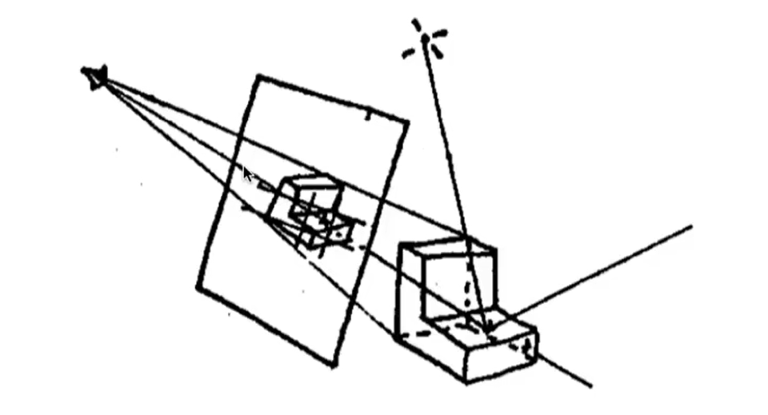

# 辐射度量学(Radiometry)

## 立体角

$$
I = \frac{\Phi}{\omega} \quad \omega = \frac{A}{r^2} \quad \omega:立体角\hfill \\
\mathrm d\omega = \frac{r \sin \theta \cdot \mathrm d\phi \cdot r \mathrm d\theta }{r^2} = \sin \theta \mathrm d\theta \mathrm d\phi \hfill \\
球面立体角:\omega = \iint_{S^2} \mathrm d\omega = \int_0^{2\pi} \mathrm d\phi \int_0^\pi \sin \theta \mathrm d\theta = 4 \pi \hfill \\
$$

- 立体角的单位为**球面度($sr$)，无量纲**

## 物理量

| 符号   | 名称                         | 含义                           | 单位              |
| ------ | ---------------------------- | ------------------------------ | ----------------- |
| $\Phi$ | 辐射通量(radiant flux)       | 单位时间内发出/吸收的能量      | $\mathrm{W}$      |
| $E$    | 辐照度(irradiance)           | 单位面积的辐射通量             | $\mathrm{W/m^2}$  |
| $I$    | 辐射强度(radiant iIntensity) | 单位立体角的辐射通量           | $\mathrm{W/sr}$   |
| $L$    | 辐射(radiance)               | 单位**投影面积**的**辐射强度** | $\mathrm{cd/m^2}$ |

## Spectral Power Distribution

- **SPD可以视为一个连续函数，或视为一个无穷维向量**

# 光度学(Photometry)

## 与辐射度量学的关系

$$
P=\frac{\int_0^\infty s(\lambda)k(\lambda) \mathrm d\lambda}{\int_0^\infty s(\lambda) \mathrm d\lambda}R \hfill \\
P:\mathrm{Photometry}中的某个物理量 \quad R:\mathrm{Radiometry}中与之对应的物理量 \hfill \\
s(\lambda):\mathrm{SPD}函数 \quad k(\lambda):\mathrm{Photometry \ Curve}函数 \hfill \\
$$

## 物理量

| 名称                         | 单位                       | 举例[1]                                                      |
| ---------------------------- | -------------------------- | ------------------------------------------------------------ |
| 光通量(luminous flux)        | $\mathrm{lm[=cd\cdot sr]}$ | 在任意包围光源的曲面上，通过光线的总亮度为$4\pi \ \mathrm{lm}$ |
| 光照度(illuminance)          | $\mathrm{lux[=lm/m^2]}$    | 距离光源0.1$\mathrm{m}$ ，法线与光线夹角为60°的微小平面上，辐照度为 $50 \mathrm{lux}$ |
| 光强强度(luminous intensity) | $\mathrm{cd}$              | 在空间中的任意位置，辐射强度为$1 \mathrm{cd}$                |
| 亮度(luminance)              | $\mathrm{nit[=cd/m^2]}$    | 距离光源$0.1\mathrm{m}$ 处观察光源时，亮度为$ 100 \mathrm{nit}$ |

[1]：假设光源为均匀发光的点光源，空间中没有其他物体（不用考虑折射、反射）

- $\mathrm{cd}$：**基本单位**之一；假设有一个光源，在某个方向上发出$540\times 10^{12} \mathrm{Hz}(556\mathrm{nm})$的单色辐射，且辐射强度为$\frac{1}{683} \mathrm{W/sr}$，则该方向上的光强度为$1 \mathrm{cd}$

*平面方向改变导致总光通量减小，所以平均光照度就等于总光通量除以总面积（不是除以投影面积）*

$$
L(\mathbf p,\mathbf l)=\frac{\mathrm d^2 \Phi(\mathbf  p,\mathbf l)}{\mathrm d\omega \mathrm d A \cos \theta}
$$

- 假设光源为均匀发光、未被遮挡的点光源：
  - 在光源的不同方位、不同距离处，辐射强度均相同
  - 其他条件不变时，离光源越近的表面，辐照度越高；被直射的表面，比被斜射的表面辐照度高
- 可以将**一条光线**视为**从某一点射出，或射入某一点（即无限小表面），始终占据无限小立体角**的事物

## 亮度与感知亮度

- **亮度(luminance)：单位投影面积的辐射强度经Photometry Curve转换而得的物理量**
- **感知亮度(brightness)：人眼感知光线后，产生的某种信号的强度**

## 渲染方程

$$
L_o(\mathbf p,\mathbf v,\mathbf n) = L_e(\mathbf p,\mathbf v) +L_r(\mathbf p,\mathbf v,\mathbf n) \hfill \\
L_r(\mathbf p,\mathbf v,\mathbf n)= \iint_\Omega L_i(\mathbf p,\mathbf l) (\mathbf l \cdot \mathbf n) f(\mathbf p,\mathbf l,\mathbf v,\mathbf n) \mathrm d\omega \hfill \\
注意到\mathbf l \cdot \mathbf n=\cos\langle \mathbf l,\mathbf n \rangle \quad (兰伯特余弦定理) \hfill \\
\\
\mathbf p:被观察点位置 \quad \mathbf v:由\mathbf p指向观察者位置的单位向量 \quad
\mathbf l:由\mathbf p指向光源(或反射源)的单位向量 \hfill \\
\mathbf n:\mathbf p处的单位法向量 \quad \Omega:以\mathbf p为中心,以\mathbf n为朝向的半球面(理论上总有\mathbf l \cdot \mathbf n \ge 0) \hfill \\
\\
L_o(\mathbf p,\mathbf v,\mathbf n):从\mathbf p沿\mathbf v方向发出和反射光线的总亮度 \hfill \\
L_e(\mathbf p,\mathbf v):从\mathbf p沿\mathbf v方向的自发光亮度 \hfill \\
L_i(\mathbf p,\mathbf l) :\mathbf 沿-\mathbf l射到\mathbf p的光线的亮度\hfill \\
L_r(\mathbf p,\mathbf v,\mathbf n) :从\mathbf p沿\mathbf v方向的反射光亮度 \hfill \\
f(\mathbf p,\mathbf l,\mathbf v,\mathbf n):\mathbf p处的双向反射分布函数(\mathbf{BRDF}) \hfill \\
\\
直接求解:L_r(\mathbf p,\mathbf l,\mathbf v,\mathbf n) 
=\iint_\Omega L_i(\mathbf p,\mathbf l,\mathbf v,\mathbf n) (\mathbf l \cdot \mathbf n) f(\mathbf p,\mathbf l,\mathbf v,\mathbf n) \mathrm d\omega \hfill \\
=\int_0^{2\pi} \mathrm d \theta \int_0^\frac{\pi}{2} L_i(\mathbf p,\mathbf l,\mathbf v,\mathbf n) (\mathbf l \cdot \mathbf n)f(\mathbf p,\mathbf l,\mathbf v,\mathbf n)\sin \phi \mathrm d\phi \hfill \\
其中,\mathbf l=\{\cos \theta\sin \phi,\sin \theta \sin \phi,\cos \phi\} \hfill \\
\\
对于均匀发光的点光源:I \equiv \frac{\Phi}{4\pi \ \mathrm{sr}} \quad L_i(\mathbf p) \equiv \frac{I}{r(\mathbf p)^2} \quad \hfill \\
\Phi:光源总功率 \quad I:光强度 \quad r(\mathbf p):光源到\mathbf p的距离 \hfill \\
$$

- 渲染方程是**二重积分**
- **渲染方程不涉及颜色，要将其用于着色，首先忽略不可见光，然后考虑可见光范围内的SPD；而SPD过于复杂，将其转换为线性颜色空间中的坐标，然后亮度相加变为线性颜色空间中的颜色相加**

# 色度学(Colorimetry)

- **颜色：人眼感知光线后，产生的某种信号**（注意与“颜色数据”、“颜色分量”、“颜色空间坐标”区分）
- **灰度(Grayscale)：用于描述亮度的一种数据**
- **色度(Chromaticity)：表示颜色的数据，可以分为亮度和色度；色度可以再分为色调和饱和度**

## 颜色与SPD

*上图中，两种不同的SPD在某个人看来可能是同种颜色（白色）；其他人看来则可能略有区别*

- **颜色根本上是由可见光范围内的SPD决定的**

## 人眼成像

- 人眼中，一般有三种视锥细胞，它们对不同波长的光敏感度不同，**三种细胞受到的刺激强度决定了颜色**
- 不同人三种视锥细胞的数量不同（甚至种类不同/功能异常），导致不同人看相同SPD的光感知到的颜色不同
  - 对于三色视觉者，颜色可以看成三维向量（每个分量上可分辨约100个值，总共能分辨约$100^3$种颜色）
  - 对于四色视觉者，颜色可以看成四维向量（总共能分辨约$100^4$种颜色）
  - 对于任何人，**SPD到颜色不可能是单射**

## 颜色空间

- **出于颜色通常是三维向量的考虑，颜色空间也是三维的**
- **SPD到颜色空间坐标不可能是单射（有严重信息损失）**

### 线性颜色空间

$$
有\mathrm{SPD}到颜色空间坐标的映射\mathbf{T},满足\mathbf{T}(\mathbf a+\mathbf b)=\mathbf{T}(\mathbf a)+\mathbf{T}(\mathbf b)的颜色空间是\textbf{线性颜色空间} \hfill \\
$$

- **可见光各波长处功率密度翻倍，则颜色空间中对应的坐标分量也翻倍，满足这样条件的颜色空间称为线性空间**
- **光线叠加的本质是SPD相加；在线性空间中，转换为坐标分量直接相加**

#### 线性RGB空间

$$
L=\int_0^\infty s(\lambda) \mathrm d\lambda \quad L'=\int_{380}^{780}s(\lambda) \mathrm d \lambda \hfill \\
R=\int_{380}^{780}s(\lambda)r(\lambda) \mathrm d \lambda \quad 
G=\int_{380}^{780}s(\lambda)g(\lambda) \mathrm d \lambda \quad 
B=\int_{380}^{780}s(\lambda)b(\lambda) \mathrm d \lambda \quad \hfill \\
L:亮度 \quad L':可见光亮度 \quad s(\lambda):\mathrm{SPD}函数 \hfill \\
$$

- 对于给定的SPD，将其与三个函数分别相乘，对波长积分，得到的三个值即RGB分量
- 某些SPD转换为RGB后得到的R分量可能为负数；换句话说，RGB被限定为正数时，无法表示所有（三色视觉者）可见颜色

#### 线性XYZ空间

$$
X=\int_{380}^{780}s(\lambda)\overline{x}(\lambda) \mathrm d \lambda \quad Y=\int_{380}^{780}s(\lambda)\overline{y}(\lambda) \mathrm d \lambda \quad 
Z=\int_{380}^{780}s(\lambda)\overline{z}(\lambda) \mathrm d \lambda \quad \hfill \\
$$

- **y曲线与Photometry Curve相同，因此亮度（或灰度）仅由Y分量决定**
- 显然，用RGB与XYZ坐标间的转换是不符合数学的，只存在经验公式

$$
x=\frac{X}{X+Y+Z} \quad y=\frac{Y}{X+Y+Z}\hfill \\
注意到,有一系列不同的(X,Y,Z)映射到同一个(x,y)上 \hfill \\
$$

- 限定$X+Y+Z=1$，则每个$(x,y)$对应一个颜色空间坐标，将这些坐标对应的颜色绘制到平面上，即得到**色度图**

### Gamma颜色空间

$$
常见的\mathrm{Gamma}校正公式:y=x^{1/\gamma} \quad (\gamma通常取2.2) \hfill \\
x:线性空间颜色分量 \quad y:\mathrm{Gamma}空间颜色分量 \hfill \\
$$

- 线性颜色空间坐标转换到Gamme颜色空间坐标的过程称为**Gamma校正**，逆过程称为**反Gamma校正**
- 最早的显示器使用**阴极射线管(CRT)**，其输出亮度近似和输入电压的2.2次幂成正比；**为了确保计算机最终输出的颜色分量和正确的输入电压成正比，渲染过程最终输出的颜色分量要进行Gamma校正**
- 人眼感知颜色的特性和CRT的特性有相似之处；**为了确保颜色分量均匀变化时，感知到的颜色也均匀变化，用户在各类软件中直接接触的颜色空间基本都是Gamma空间**
- **Gamma空间中坐标分量不可直接相加，不可用于计算灰度**

# 渲染过程中的颜色

## Spectral Rendering

- **依据SPD进行渲染**
- 理论上符合物理，但实际计算时的精度/计算量依然有限；用于电影、工业设计软件等精度要求高的场合
- 并不直接使用渲染方程，而是分别在各个波长上计算不同材质的反射等过程
- 可以规定光源发出光线的SPD
- 可以规定各种材质对不同波长的光线的反射率等信息

## RGB Rendering

- **依据RGB颜色分量进行渲染**

- 理论上并不符合物理，但很多场合已经能取得令人满意的渲染结果；常见于各类交互式应用
- 并不直接使用渲染方程，而是将渲染方程中的亮度改为颜色分量
- 光源的RGB和强度粗略反映了发出光线的SPD
- 纹理的RGB粗略反映了各种材质对不同波长的光线的反射率等信息

## 颜色数据处理

- inverse EOTF：将渲染结果重新编码的函数；目前实际采用的输入输出是线性空间颜色②和Gamma空间颜色②，所以编码过程包含Gamma校正
- EOTF：将编码值转换为光学值的函数，与显示设备硬件特性有关；目前实际采用的输入是Gamma空间颜色②，因此EOTF包含类似逆Gamma校正的计算过程
- OETF：将光学值转换为编码值的函数，与拍摄设备的硬件特性有关，和inverse EOTF不是一个事物
- **处理过程：**
  1. 对纹理颜色数据进行**反Gamma校正**
  2. 得到的线性空间颜色分量参与着色计算
  3. 对计算结果进行**Tone Mapping，将结果映射到LDR颜色分量范围内**
  4. 计算结果经由**inverse EOTF**转换为Gamma空间颜色分量，输出到帧缓冲中
  5. 帧缓冲中的颜色分量经**EOTF**转换为显示器发光元件的功率

- 现代游戏引擎中，还会使用**颜色分级(Color Grading)**，**白平衡(White Balance)**等技术进一步改善图像色彩

## 动态范围

- **动态范围**：（某时刻某个范围内）可变信号的最大值和最小非零值的比值
- 着色计算得到的颜色分量的动态范围可能很大，而发光元件的功率有限，未必能显示计算得到的颜色分量
- 图形学中，常讨论**渲染过程中颜色分量的动态范围**，或**显示器显示图像的动态范围**

| 动态范围 | 线性空间的颜色分量最大值 | 说明                    |
| -------- | ------------------------ | ----------------------- |
| HDR      | 不限制                   | 经Tone Mapping转换到LDR |
| LDR      | 1.0                      | 之后可以进行Gamma校正   |

## Tone Mapping

- **Tone Mapping：通过某种函数将整个非负数范围内的颜色值映射到一定范围内**
- Tone Mapping在线性颜色空间中进行，不改变颜色空间，但映射后颜色空间坐标已不能反映真实亮度

*上图中使用了一种较为简单的映射函数；更好地区分高亮度区域和更好地区分低亮度区域难以兼顾*

- 和强行截断超出范围的颜色分量相比，Tone Mapping使整幅图像颜色分量的平均值变低，而**平均对比度变高**

# 线性代数

## 向量与矩阵

$$
m\times n矩阵:\mathbf A=
\begin{bmatrix}
a_{11} & a_{12} & \cdots & a_{1n} \\
a_{21} & a_{22} & \cdots & a_{2n} \\
\vdots & \vdots & \ddots & \vdots \\
a_{m1} & a_{m2} & \cdots & a_{mn} \\
\end{bmatrix}
=[a_{ij}]_{m\times n}=
\begin{bmatrix}
\mathbf A^1 & \mathbf A^2 & \cdots & \mathbf A^n \\
\end{bmatrix}
=
\begin{bmatrix}
\mathbf A_1 \\ 
\mathbf A_2 \\ 
\cdots \\ 
\mathbf A_m \\
\end{bmatrix}
\hfill \\
\\
矩阵乘法:\mathbf A_{m\times p}+\mathbf B_{p\times n}=\mathbf C_{m\times n} \quad (\textbf{行m-列p-行p-列n}) \quad ,其中c_{ij}=\mathbf A_i \cdot \mathbf B^j \quad (点积)\hfill \\
\\
向量:\mathbf a=\begin{bmatrix} x_a \\ y_a \\ z_a \end{bmatrix},
\mathbf a^T=\begin{bmatrix} x_a & y_a & z_a \end{bmatrix}\hfill \\
点积:\mathbf a \cdot \mathbf b=\mathbf a^T\mathbf b=\Sigma a_ib_i \hfill \\
叉积:\mathbf a \times \mathbf b = 
\begin{bmatrix}
0 & -z_a & y_a \\
z_a & 0 & -x_a \\
-y_a & x_a & 0 \\
\end{bmatrix}
\begin{bmatrix}
x_b \\
y_b \\
z_b \\
\end{bmatrix}
=\begin{bmatrix}
y_az_b-y_bz_a \\
x_az_b-x_bz_a \\
x_ay_b-x_by_a \\
\end{bmatrix}
\hfill \\
投影:\mathbf a \bullet \mathbf b= \frac{\mathbf a\cdot\mathbf b}{|\mathbf b|} \frac{\mathbf b}{|\mathbf b|} \quad 若\mathbf b为单位向量,则\mathbf a \bullet \mathbf b=(\mathbf a \cdot \mathbf b)\mathbf b \hfill \\
长度:|\mathbf a|=\sqrt{\mathbf a \cdot \mathbf a} \hfill \\
夹角:\cos\langle\mathbf a,\mathbf b\rangle= \frac{\mathbf a \cdot \mathbf b}{|\mathbf a||\mathbf b|} \hfill \\
$$

## 四元数

$$
四元数:\mathbf q = q_0+\mathbf v_q =q_0+q_1\mathbf i+q_2\mathbf j+q_3\mathbf k(q_0,q_1,q_2,q_3为实数) \quad 共轭四元数:\mathbf q^* = q_0-\mathbf v_q \hfill \\
四元数的二范数:|\mathbf q|= (q_0^2+|\mathbf v_q|^2)^{\frac{1}{2}} = \sqrt{q^2_0+q_1^2+q_2^2+q_3^2}\hfill \\
\mathbf p \cdot \mathbf q= q_0p_0+q_1p_1+q_2p_2+q_3p_3 \quad (类似向量点乘) \hfill  \\
\mathbf p \times \mathbf q= \mathbf v_p \times \mathbf v_q = (p_2q_3-p_3q_2)\mathbf i+(p_3q_1-p_1q_3)\mathbf j+(p_1q_2-p_2q_1) \mathbf k \quad (类似向量叉乘) \hfill \\
\mathbf p \mathbf q = (p_0q_0 - \mathbf v_1 \cdot \mathbf v_2) +(p_0 \mathbf v_2 + q_0 \mathbf v_1 + \mathbf v_1 \times \mathbf v_2) \quad (默认乘法) \hfill \\
\mathbf q^{-1} =\frac{\mathbf q^*}{|\mathbf q|^2}, \mathbf q_1 \mathbf q_2 = \mathbf q_3 \Leftrightarrow \mathbf q_2 = \mathbf q_1^{-1} \mathbf q_3 \hfill \\
\\
四元数表示旋转: \hfill \\ 
\mathbf q = \cos \frac{\theta}{2}+\sin\frac{\theta}{2}\mathbf v_q (|\mathbf v_q|=1 \Rightarrow |\mathbf q|=1)
\quad \mathbf p=\mathbf v_p \quad 
\mathbf r = \mathbf q\mathbf p\mathbf q^{-1} \hfill \\
\mathbf q:表示旋转的四元数,\theta为旋转角,\mathbf v_q为转轴(必须是归一化的) \hfill \\ 
\mathbf p:表示初始坐标的四元数(实部为0,虚部系数即坐标) \hfill \\
\mathbf r:表示旋转后坐标的四元数(结果中虚部系数即坐标) \hfill \\
$$

- 四元数叉乘、默认乘法不满足交换律

## 变换

- **变换：函数，自变量和因变量均为n维向量**
- **线性变换：具有线性性质的变换（包括缩放、旋转、切变等；不包括平移）**
  - **线性变换和平移统称为仿射变换**

- **齐次坐标：用于表示n维向量及其各类变换的n+1维坐标**

$$
n维空间中有变换\mathbf A,若\forall向量 \mathbf a,\mathbf b,实数k,有:
\begin{cases}
\mathbf A(\mathbf a+\mathbf b)=\mathbf A(\mathbf a)+\mathbf A(\mathbf b) \\
\mathbf A(k\mathbf a)=k\mathbf A(\mathbf a) \\
\end{cases},
则\mathbf A为\textbf{线性变换} \hfill \\
n维空间中的线性变换总是可以表示为\mathbf b=\mathbf L_{n\times n}\mathbf a \hfill \\
一切仿射变换可以表示为\mathbf b=\mathbf L_{n\times n}\mathbf a+\mathbf t \hfill \\
引入齐次坐标后,\mathbf b=\mathbf L_{n\times n}\mathbf a+\mathbf t可以表示为\mathbf b'=\mathbf M_{(n+1)\times (n+1)}\mathbf a', 
其中\mathbf b'=\begin{bmatrix} \mathbf b \\ 1 \end{bmatrix},
\mathbf a'=\begin{bmatrix} \mathbf a \\ 1 \end{bmatrix},
\mathbf M=\begin{bmatrix}\mathbf L & \mathbf t \\ 0 & 1 \end{bmatrix} \hfill \\
$$

### 二维

$$
缩放(x,y)倍:
\mathbf L =
\begin{bmatrix}
x & 0 \\
0 & y \\
\end{bmatrix} \hfill \\
切变:
\mathbf L_x =
\begin{bmatrix}
1 & s \\
0 & 1 \\
\end{bmatrix},
\mathbf L_y =
\begin{bmatrix}
1 & 0 \\\
s & 1 \\
\end{bmatrix}
\hfill \\
绕原点逆时针旋转\theta:
\mathbf L =
\begin{bmatrix}
\cos \theta & -\sin \theta \\
\sin \theta & \cos \theta \\
\end{bmatrix} \hfill \\
$$

### 三维

- 规定$\mathbf i \times \mathbf j = -\mathbf k$（**左手系**，同Unity世界坐标系相同）；在此前提下，绕轴旋转均表示，从该轴的**负半轴看向正半轴**，在看到的平面内**逆时针旋转**

$$
缩放(x,y,z)倍:
\mathbf L =
\begin{bmatrix}
x & 0 & 0\\
0 & y & 0\\
0 & 0 & z\\
\end{bmatrix} \hfill \\
切变:
\mathbf L_{xy} =
\begin{bmatrix}
1 & 0 & 0 \\
0 & 1 & 0 \\
s & t & 1 \\
\end{bmatrix},
\mathbf L_{xz} =
\begin{bmatrix}
1 & 0 & 0 \\
s & 1 & t \\
0 & 0 & 1 \\
\end{bmatrix},
\mathbf L_{yz} =
\begin{bmatrix}
1 & s & t \\
0 & 1 & 0 \\
0 & 0 & 1 \\
\end{bmatrix}\hfill \\
绕坐标轴旋转\theta:
\mathbf L_x =
\begin{bmatrix}
1 & 0 & 0 \\
0 & \cos \theta & -\sin \theta \\
0 & \sin \theta & \cos \theta \\
\end{bmatrix},
\mathbf L_y =
\begin{bmatrix}
\cos \theta & 0 & \sin \theta \\
0 & 1 & 0 \\
-\sin \theta & 0 & \cos \theta \\
\end{bmatrix},
\mathbf L_z =
\begin{bmatrix}
\cos \theta & -\sin \theta & 0 \\
\sin \theta & \cos \theta & 0 \\
0 & 0 & 1 \\
\end{bmatrix}\hfill \\
绕单位向量\mathbf w=\begin{bmatrix} x \\ y \\z \end{bmatrix}旋转\theta:
\mathbf L=\mathbf I+\sin \theta \mathbf J+(1-\cos\theta)\mathbf J^2,其中
\mathbf J=
\begin{bmatrix}
0 & -z & y \\
z & 0 & -x \\
-y & x & 0 \\
\end{bmatrix}
\hfill \\
$$

### 有符号面积

$$
有符号面积:S1 = \frac{1}{2}(\mathbf {CP} \times\mathbf {BP}) \cdot \mathbf n 
\quad \mathbf n = \frac{\mathbf{CA} \times \mathbf{BA}}{|\mathbf{CA}| |\mathbf{BA}|} \hfill \\
重心坐标:(\alpha,\beta,\gamma) = (\frac{S1}{S},\frac{S2}{S},\frac{S3}{S}) \Leftrightarrow \mathbf P = \alpha \mathbf A + \beta \mathbf B + \gamma \mathbf C  \hfill \\
\\
P在三角形ABC内 \Leftrightarrow S1,S2,S3>0 \hfill \\
记\mathbf a=\mathbf {CP} \times\mathbf {BP},注意到必然有\mathbf a \parallel \mathbf n(同向/反向/\mathbf a = \mathbf 0) \hfill \\
因此 S1 > 0 \Leftrightarrow \mathbf c.x \times \mathbf n.x > 0 \quad (只求符号,不必求面积) \hfill \\
$$

- 边的方向会影响法向量方向，因此计算有符号面积时点的顺序必须统一（如以上公式）

# 渲染管线

- 渲染管线的各个步骤不是简单串行，而是**流水线式并行**：
  - 一步尚未完全完成时，部分结果先被用于下一步的计算
  - 一帧中靠后的步骤尚未完成时，下一帧中靠前的步骤已经开始

## 概念

- **通道(Pass)**：渲染管线中，一个独立的渲染过程
  - 每个通道有各自的纹理、着色器
  - 没有明确划分方式，多个通道间可能是并行关系，也可能是先后关系
  - 前向渲染管线中至少可能有片元着色、后处理两个通道

- 切线空间：由**表面某点的位置和表面朝向**确定的空间（坐标系），随表面旋转而改变
  - 在切线空间下才能方便地在物体旋转时正确地计算光照

- 图元：点、线、三角形面等基本图形

## 典型前向渲染管线

1. 应用阶段：
   1. 加载数据到显存：输入纹理、顶点、图元、光源、相机等数据
   2. 设置渲染状态
   3. 发出Draw Call
2. 几何阶段
   1. **顶点(Vertex)着色器**：对顶点进行**模型变换**（模型空间→世界空间），**观察变换**（世界空间→观察空间），**投影变换**（观察空间→裁剪空间）（合称**MVP变换**）
   2. 图元装配：根据顶点索引及相关参数，按照指定的方式计算出所有要渲染的**图元**，这一步可能进行**背面剔除**
   3. 几何(Geometry)着色器：可选的，对输入的图元（以给定的规则）进行变换、修改
   4. 曲面细分(Tessellation)着色器：可选的，用镶嵌化技术增加三角形面及顶点的数量
   5. 齐次裁剪：由硬件自动进行**齐次除法**（裁剪空间→NDC），并**裁剪NDC外**的图元，这一步可能进行**遮挡剔除**
   7. 屏幕映射：进行**视口变换**（NDC→屏幕）
3. **光栅化(Resterization)**阶段：
   1. 片元着色器：对于每个图元，进行**覆盖计算**；对于覆盖的每个片元，**着色计算、深度计算**等，输出到**片元缓冲**中
   2. 测试混合：根据片元缓冲进行**测试混合**，更新**深度缓冲、颜色缓冲、透明度缓冲**等，得到最终颜色
4. 像素后处理(pixel processing)阶段：可选的，如FXAA

## 延迟渲染(Deffered Rendering)

- 延迟渲染中使用的多组缓冲区统称为**G-Buffer**
  - 多组缓冲区可以看成多张贴图，每张存储不同信息，如深度、法线、纹理颜色、粗糙度、金属度等
  - 每个像素位置上始终只维护一套信息（不会像片元缓冲那样出现overdraw现象）
- 延迟渲染与前向渲染的区别在**光栅化**阶段：
  1. 对于每个图元，进行**覆盖计算**；对于覆盖的每个片元，计算其深度，如果小于当前该位置深度则**更新G-Buffer**
  2. 处理完所有片元后，根据G-buffe在每个片元位置进行**一次光照计算**
- 屏幕范围内，被不透明物体遮挡的部分无需渲染是理所应当的，这是使用延迟渲染的根本原因
  - 前向渲染将透明与不透明物体一起渲染，仅仅是逻辑简单，会导致overdraw
  - 延迟渲染无法处理半透明物体，因为**深度、法线等数据只能覆盖，不能混合**
  - 对于半透明物体，需要额外的Pass渲染（如依然利用前向渲染管线）
- 原本前向渲染的计算量越大，使用延迟渲染越有必要
  - 计算量过大的常见原因是光源数量过多；正因如此，一些前向渲染管线会限制场景中的光源总数
  - 延迟渲染解决的是overdraw问题
  - 如果要解决光源数量增加导致的计算量增大，可以对相机拍摄的范围分块（每个光源仅影响部分区块），即**分块延迟渲染**
- 延迟渲染的缺点：
  - 显存**带宽**占用大（G-Buffer每帧都在变换），需要尽可能压缩G-Buffer空间
  - **光照算法灵活性**受限（G-Buffer存储的是数据，不同光照算法的不同行为及其不同参数难以存储）

## Forward+渲染

## 应用阶段

### Draw Call

- **Draw Call**是由CPU向GPU发出的一条**绘制指令**，每条指令渲染若干个图形（如`glDrawElements`）
- **批量渲染(Batch)**可以减少CPU与GPU的通信次数，以降低开销；常见的做法是把多个对象使用的多种缓冲区分别合成（每种类型的缓冲区合称为一个）
- CPU与GPU**流水线式并行**，Draw Call存放在GPU缓冲区中，CPU不必等到GPU完成一个渲染命令才发送下一个渲染命令
- 一条Draw Call通常要访问以下数据（OpenGL中，这些数据在上下文中，需要在发出DrawCall前设置好）：
  - **顶点缓冲区**：各顶点的**位置、法线方向**，及**纹理坐标**等
  - **索引缓冲区**：规定各个顶点按照怎样的顺序组成三角形
  - **材质**：可能包含纹理贴图、纹理映射方式、法线贴图、PBR材质等数据
  - **着色器程序**：顶点着色器，片元着色器，及其他可选着色器；包括各着色器中的参数（uniform变量）
  - 其他设置：深度测试，混合模式，剔除模式等

## 几何阶段

- **输入：顶点缓冲区、索引缓冲区，顶点着色器程序等**
- **输出：变换（除了数值改变，还可能删除/增加顶点/三角形）后的顶点缓冲区、索引缓冲区等（不会修改原始缓冲区，而是使用显存中另外的区域）**
- 以下所有空间中，均假定使用**左手系**

### 顶点着色器

- 对于输入的所有顶点，**（并行地）逐顶点**调用顶点着色器
- 变换过程可以在CPU中进行（顶点缓冲区中**动态更新**变换后数据），也可以在着色器中进行（顶点缓冲区设置好变换前数据，并**动态更新**用于变换的着色器参数）

#### 模型空间

- 以模型的指定点为原点，模型的右方为x轴，上方为y轴，前方为z轴
- 坐标有xyzw分量。为了进行变换运算，加入额外的w分量（表示坐标的向量，其w为1；表示矢量的向量，其w为0）

#### 世界空间

$$
\mathbf{P}_{world}=\mathbf{M}_{model}\mathbf{P}_{model} 
\quad \mathbf{M}_{model} = \mathbf T \mathbf R \mathbf S \hfill \\
\mathbf S=
\begin{bmatrix}
r & 0 & 0 & 0 \\
0 & s & 0 & 0 \\
0 & 0 & t & 0 \\
0 & 0 & 0 & 1 \\
\end{bmatrix} \hfill \\

\mathbf R =
\begin{bmatrix}
1 & 0 & 0 & 0 \\
0 & \cos \alpha & -\sin \alpha & 0 \\
0 & \sin \alpha & \cos \alpha & 0 \\
0 & 0 & 0 & 1 \\
\end{bmatrix}
\begin{bmatrix}
\cos \beta & 0 & -\sin \beta & 0 \\
0 & 1 & 0 & 0 \\
\sin \beta & 0 & \cos \beta & 0 \\
0 & 0 & 0 & 1 \\
\end{bmatrix}
\begin{bmatrix}
\cos \gamma & -\sin \gamma & 0 & 0\\
\sin \gamma & \cos \gamma & 0 & 0\\
0 & 0 & 1 & 0\\
0 & 0 & 0 & 1 \\
\end{bmatrix} \hfill \\

\mathbf T = \begin{bmatrix}
1 & 0 & 0 & x \\
0 & 1 & 0 & y \\
0 & 0 & 1 & z \\
0 & 0 & 0 & 1 \\
\end{bmatrix}
\hfill \\
(x,y,z):物体坐标 \quad (\alpha,\beta,\gamma):物体欧拉角 \quad (r,s,t):物体缩放 \hfill \\
$$

- 由模型空间经**模型变换**而得，引擎预设好原点，右方为x轴，上方为y轴，前方为z轴
- **缩放→绕模型自身的坐标轴旋转→平移**

#### 观察空间

$$
\mathbf{P}_{view}=\mathbf{M}_{view}\mathbf{P}_{world} 
\quad \mathbf{M}_{view} = \mathbf R \mathbf T \hfill \\

\mathbf R =
\begin{bmatrix}
1 & 0 & 0 & 0 \\
0 & \cos \alpha & \sin \alpha & 0 \\
0 & -\sin \alpha & \cos \alpha & 0 \\
0 & 0 & 0 & 1 \\
\end{bmatrix}
\begin{bmatrix}
\cos \beta & 0 & \sin \beta & 0 \\
0 & 1 & 0 & 0 \\
-\sin \beta & 0 & \cos \beta & 0 \\
0 & 0 & 0 & 1 \\
\end{bmatrix}
\begin{bmatrix}
\cos \gamma & \sin \gamma & 0 & 0\\
-\sin \gamma & \cos \gamma & 0 & 0\\
0 & 0 & 1 & 0\\
0 & 0 & 0 & 1 \\
\end{bmatrix} \hfill \\

\mathbf T = \begin{bmatrix}
1 & 0 & 0 & -x \\
0 & 1 & 0 & -y \\
0 & 0 & 1 & -z \\
0 & 0 & 0 & 1 \\
\end{bmatrix} \hfill \\

(x,y,z):相机坐标 \quad (\alpha,\beta,\gamma):相机欧拉角 \hfill \\
$$

- （在世界空间下看）Unity中的相机通常朝向X轴正方向，OpenGL中则与之相反
- 由世界空间经**观察变换**而得，相机的右方为x轴，上方为y轴，前方为z轴
- **平移→绕相机的坐标轴旋转**

#### 裁剪空间

*拍摄区域可以偏离相机中心，只是游戏引擎通常不支持*
$$
正交投影:\mathbf{P}_{ndc}=\mathbf{M}_{ortho}\mathbf{P}_{view}
\quad \mathbf M_{ortho}=\mathbf S \mathbf T \\
\mathbf T = \begin{bmatrix}
1 & 0 & 0 & -\frac{r+l}{2} \\
0 & 1 & 0 & -\frac{t+b}{2} \\
0 & 0 & 1 & -\frac{n+f}{2} \\
0 & 0 & 0 & 1 \\
\end{bmatrix} \hfill \\
\mathbf S=\begin{bmatrix}
\frac{2}{r-l} & 0 & 0 & 0 \\
0 & \frac{2}{t-b} & 0 & 0 \\
0 & 0 & \frac{2}{n-f} & 0 \\
0 & 0 & 0 & 1 \\
\end{bmatrix} \hfill \\
l,r,b,t,n,f:观察空间坐标分量(而不是世界空间) \hfill \\
$$

$$
透视投影:\mathbf{P}_{ndc}=\mathbf{M}_{persp}\mathbf{P}_{view} 
\quad \mathbf M_{persp} = \mathbf M_{ortho}\mathbf M_{squish}\\
\mathbf M_{squish}=
\begin{bmatrix}
n & 0 & 0 & 0 \\
0 & n & 0 & 0 \\
0 & 0 & n+f & -nf \\
0 & 0 & 1 & 0 \\
\end{bmatrix} \hfill \\
\mathbf M_{ortho}同正交投影 \hfill \\
$$

- 由观察空间经**投影变换**而得，各个点的坐标的w分量表示该点到相机的距离
- 正交投影和透视投影的矩阵统称为**投影矩阵**；模型变换、观察变换、投影变换合称**MVP变换**
- 透视投影可视为两次变换的叠加，第一次先将平截头体“压缩”为长方体，之后的步骤和正交投影相同

### 图元装配

- 根据**顶点索引**及**相关参数**（如上图），按照指定的方式计算出所有要渲染的**图元**

### 齐次裁剪

#### 归一化设备坐标(NDC)

- 裁剪空间中各点经过**齐次除法**（每个点除以自身的w分量）得到NDC，因此NDC必然是边长为2的立方体中

#### 裁剪

- 裁剪**NDC外**的**图元**，对于部分处于NDC外的图元，裁剪时会产生新的图元
- 可能进行**遮挡剔除**

### 屏幕映射

#### 屏幕空间

$$
\mathbf{P}_{screen}=\mathbf{M}_{viewport}\mathbf{P}_{ndc} \hfill \\
\mathbf{M}_{viewport} =
\begin{bmatrix}
\frac{w}{2} & 0 & 0 & \frac{w}{2} \\
0 & \frac{h}{2} & 0 & \frac{h}{2} \\
0 & 0 & 1 & 0\\
0 & 0 & 0 & 1\\
\end{bmatrix} \hfill \\
w:屏幕宽度 \quad h:屏幕高度 \hfill \\
$$

- 由NDC经**视口变换**而得，屏幕左下角为原点，区域大小等于屏幕分辨率

## 光栅化阶段

- **输入：变换后的顶点缓冲区、索引缓冲区，片元着色器程序，材质，其他渲染设置等**
- **输出：更新片元缓冲和深度缓冲**
- **片元(Fragment)缓冲：存放各个像素上的若干个片元的缓冲区**
- **深度缓冲(Z-Buffer)：每个像素上，当前已渲染的片元的最小深度（深度即到相机的距离，能拍到的范围内深度总是为正）**

### 片元着色器

- 对于输入的每个三角形，计算器覆盖的片元，**（并行地）逐片元**调用片元着色器
- 片元着色器被调用的次数远多于其他着色器

- 理论上，从片元着色器开始，开始发生走样（几何阶段仅存在浮点误差）

#### 覆盖计算

- 计算输入的各个三角形覆盖的片元范围
- 通常使用采样的方式进行覆盖计算；先确定三角形的**AABB**，然后**逐片元采样**，判断其是否位于三角形内部（如果使用此方式，则覆盖计算与着色可以合并）
- 也可以使用**多边形扫描转换**算法等方式

#### 深度计算

- 计算各个片元的深度，并更新深度缓冲
  - 如果片元是半透明的（访问材质以确定是否透明），不更新深度缓冲
- 着色计算时，也可能用到片元深度，如环境光遮蔽（用的是片元深度计算结果，而不是等深度缓冲更新完再计算着色）
- 理论上，先计算完所有片元的深度，进行深度测试后，再对保留的片元着色计算效率更高；但实际上，这几步不是简单串行，而是流水线式并行，破坏GPU并行性可能反而导致效率降低

#### 着色计算

**以下涉及颜色的计算，均在线性空间中进行**

- 进行**纹理映射**，确定**基础颜色**
  - 基础颜色实际上是粗略地模拟物体对不同波长的光的吸收率（**不代表功率，而是无量纲数**）

- 进行**光照计算**，根据光源颜色、光照强度、物体和光源的几何关系计算**光照颜色**
  - 理论上光源有SPD，经过积分得到RGB分量；而实际上光源颜色和光照强度直接规定了初始光照颜色
  - 光照通常分为**直接光照**、**间接光照**，以不同方式分别计算其颜色，然后相加得到光照颜色
  - **阴影计算**得到遮蔽值，效果通常为，使初始光照颜色的RGB分量下降一定比例

- **片元颜色=基础颜色×光照颜色**

### 测试混合

- **输入：片元缓冲，深度缓冲**
- **输出：更新颜色缓冲**

- **颜色缓冲：当前已处理片元混合后的颜色**

- **透明度缓冲：当前已处理片元混合后的透明度**

- **模板(Stencil)缓冲：常见用途是计算哪些像素需要渲染**
- **帧(Frame)缓冲：颜色、深度、透明度、模板等缓冲构成的整体**
- 此阶段利用各个缓冲将同一位置的若干个片元混合为一个像素；各缓冲记录**每个像素位置上的仅一个数据（不同于片元缓冲）**

#### 模板测试

- 如果开启了模板测试，比较当前片元参考值和模板缓冲中的模板值，如果不通过则舍弃片元，通过则更新模板缓冲

#### 深度测试

- 如果开启了深度测试，比较当前片元和深度缓冲中的深度，如果不通过则舍弃片元，通过则更新深度缓冲

#### 混合

- 最常见的混合方式是 新背景色 = alpha × 前景色 + （1 - alpha）× 背景色

## 后处理

- ？

# 几何体表示

- 不论显示还是隐式表示，描述几何体时可能使用不同种类的**对象**：
  - **顶点**：网格
  - **内点**：曲线/曲面方程，Bezier曲线
  - **离散点**：点云
  - **立方体**：体素
  - **基本几何体**：CSG，过程生成

## 曲线连续性

- **函数连续点：左极限、右极限、函数值均存在且相等；任意阶导数（若存在）也都是不同的函数**
- 讨论连续性时，通常用**参数方程**表示曲线，将一组参数方程视为一个函数，**该函数的值和任意阶导数(若存在)均为向量**

$$
有参数方程表示的曲线\mathbf v(t):\hfill \\
\mathbf v_{+}(t_0)=\mathbf v_{-}(t_0) \Rightarrow \mathbf v(t)在t_0处连续(\mathrm{C}^0连续性) \hfill \\
\mathbf v^{(n)}_{+}(t_0)=\mathbf v^{(n)}_{-}(t_0) \Rightarrow \mathbf v(t)在t_0处具有\mathrm{C}^n \textbf{连续性} \hfill \\
$$

## 显式表示

- **直接或间接的给出几何体中某种对象的信息（数量、位置、顺序等）**
- **能直接或间接地获取几何体种某种对象的信息，但不容易判断某对象是否位于几何体内部**

### 点云

- 用足够多的点直接记录物体表面的点的位置
- 数据结构简单，但需要的点的数量极多
- 常见于实体扫描的结果，之后通常转换成Mesh再用于渲染

### 网格(Mesh)

- 以若干多边形拼合来表示物体表面
- 最常见的表示方式，其中又以纯三角形网格最常见

#### 网格细分(Subdivision)

- 增加三角面的个数，增加更多的形状细节
- 细分不依赖于"实际物体"信息，因此需要某种算法**"猜测实际细节"**

#### 网格简化(Simplification)

- 尽可能保持网格形状不变，尽可能减少三角形面

#### 网格规则化(Regularization)

- 尽可能保持网格形状不变，尽可能使各个三角面形状接近正三角形且大小接近

### 参数映射(Parameter Mapping)

*上图中，没有关于左侧几何体的信息，无法确定其是否为显式表示*

- 对于一个显式表示的几何体，在其基础上经过映射，间接给出新的几何体的对象信息

### Bezier Curve

- 给定n个控制点，再给定参数t，可以确定曲线上的一个点；点足够多后，可以近似地绘制出曲线

$$
B^n表示有n个点的点集,\mathbf b^n_i表示点集中的第i个点 \hfill \\
有函数F:B^{n-1}=F(B^n,t),其中\mathbf b^{n-1}_i=(1-t)\mathbf b^n_i+t\mathbf b^n_{i+1} \hfill \\
\Rightarrow B^1=F^{n-1}(B^n,t) \Rightarrow \mathbf b^1_1=\sum_{i=1}^n \mathbf b^n_i(1-t)^{n-i}t^i \quad (\mathbf b^1_1为最终要求的点) \hfill\\
$$

- 曲线段的起点和终点必然是第一个和最后一个控制点
- 对所有控制点进行**仿射变换**，曲线的**形状不变**（投影变换可能改变形状）
- ($0\le t \le 1$时)曲线总是位于所有**控制点构成的凸包(≠连成的多边形)内部**

*上图中，黑色点为相邻两条贝塞尔曲线的控制点，蓝色点为一条贝塞尔曲线的控制点*

- 绘制较为复杂的曲线时，需要使用多个控制点，每个控制点对曲线的控制力较低
- 可以**逐段绘制**贝塞尔曲线（习惯上，每段使用四个控制点）
- 单段贝塞尔曲线内部总有$\mathrm{C}^1$连续性；一个黑色控制点与相邻的两个蓝色控制点（见上图）共线时，能确保黑色控制点处有$\mathrm{C}^1$连续性

### Bicubic Bezier Surface

- 给定m条"平行"且间隔均匀的贝塞尔曲线（见上图），给定参数u,v，可以确定曲面上的一个点；点足够多后，可以近似地绘制出曲面
- 计算过程：
  1. 在每条贝塞尔曲线上，根据u，求曲线上的点
  2. 将曲线上的各点视为新的控制点，根据v，求新的曲线上的点，即为曲面上一点

## 隐式表示

- **不给出几何体中某种对象的信息，而是描述几何体中的对象满足的条件**
- **能直接判断某种对象是否位于几何体内部，但不容易（离散化地）获取几何体的某种对象**

### 曲面方程&有向距离场

- 描述闭合曲面（或曲线）

$$
f(\mathbf p)表示某点到物体表面的距离 \quad f(\mathbf p)\lt 0 \Leftrightarrow \mathbf p在曲面内\hfill \\
令f(\mathbf p)=0,即得到\textbf{曲面方程} \hfill \\
$$

- 引入max、min等非基本运算，则可以用有向距离场描述更复杂的曲面（如组合而成的非连通曲面）
- **有向距离场的复杂度不会随物体数量的膨胀而明显增大**

### Level Set Methods

- 计算出一定范围内若干个离散位置的函数值，存放在某种集合中
- 距离函数难以用函数表达时，或者说难以直接计算时（可能需要使用特殊方式计算，开销大），使用此方法可以事先计算好一些离散的值，以供查询

### Constructive Solid Geometry

- 在一些基本图形的基础上，通过“集合”运算表示复杂图形

- 用表达式表示一系列的运算，而表达式又可以表示为树，称为**CSG树**

### 过程生成

- 用**函数**描述（从基本几何体开始）生成几何体的过程
- **分形（Fractals）**：强调函数可以**递归调用**，生成自相似图形（和CSG树的主要不同点）

## 多边形扫描转换

### X-扫描线算法

- 输入：用顶点序列表示的多边形，颜色缓冲
  - **顶点坐标必须是离散化的，否则无法解决误差问题**
  - **顶点序列必须表示正常的多边形，可以利用极角排序生成符合要求的顶点序列**
- 输出：修改颜色缓冲，将多边形内部的区域**填色**
- 算法步骤：
  1. 输入顶点序列，确定所有顶点的y的范围
  2. 对于范围内的每个y的值，用一条直线与多边形求交，得到若干个交点
     - 如果交点与顶点重合，则考虑该顶点的两条边，**边必须位于扫描线上方（不含平行）才会记为一个交点**（下闭上开）
     - 可以证明，每条扫描线与多边形的交点数必然是偶数
  3. 将交点按照某种方式排序，然后两两配对，每对交点之间的点便是需要填色的区域
     - 求出交点后，将其**离散化（必须统一采用四舍五入，而不是四舍六入五留双）**，确定区间；之后必须采用左闭右开或右闭左开的规则
- 主要开销来自求交和排序，需要使用**有向边，有向边表，活性边表**来加速
- 有向边：以y较小的端点为起点，y较大的端点为终点的边（**若某条边两端点的y值离散化后相等，直接忽略**）
  - x：表示与当前扫描线的交点的x分量；一开始设为起点的x分量，随扫描线上移而改变
  - yMax：终点的y分量离散化后**-1（-1实现下闭上开）**；扫描线**大于（-1则此处不取等）**此值后，将此有向边从活性边表中移除
  - deltaX：y增加1时x的改变量
- 有向边表：包含所有有向边的集合
  - 用散列或字典来存放所有有向边
- 活性边表：与当前扫描线有交点的有向边构成的集合
  - 扫描线上移的过程中，根据有向边的yMax和有向边表的索引不断更新活性边表；活性边表为空时，算法结束
  - **每当新的边加入表（已有边的顺序不会发生变化），按照各有向边当时的x排序，若x相同，则按照deltaX排序**
  - 每当更新交点后，直接按表中边的顺序两两配对交点

### 边标志算法

- 输入输出与X-扫描线算法相同

- 算法步骤：
  1.  输入顶点序列，确定包含所有顶点的AABB
  2.  对每条边进行扫描转换（**若某条边两端点的y值相等，直接忽略**），得到若干离散化的点，**以特殊颜色标记这些点**
      - 类似X扫描线算法，**每条边的终点被忽略**（下闭上开）
      - **离散化每条边时，每次令y+1然后计算x的值**，这和X扫描线算法类似，和一般的直线扫描转换不同
      - 扫描转换某条边得到某个离散化的点时，**如果该点已标记为特殊颜色，则重置为默认颜色**
  3.  从下往上遍历AABB的每一行，每一行内从左往右遍历每个像素，逐像素判断是否进行填色
      - 用一个bool变量表示当前点是否需要填色，一开始为false，向左遍历时，每当遇到特殊颜色的点，则取反
      - 保持true的点，以及由false变为true的点要填色，而由true变为false的点不填色（左闭右开）
      - 算法结束后，仍为特殊颜色的点重置为默认颜色

# 裁剪

- **输入带裁剪线段和裁剪窗口范围，输出裁剪后保留的线段**

## Cohen-Sutherland算法

- 要保留的区域有四条边，将其延长为直线，将空间划分为9个区域
- 对于每一个点，分配一个**区域码(4bit)**。4位分别表示，该点是否位于**l1上侧/l2下侧/l3右侧/l4左侧**
- 算法过程：
  1. 输入线段两个端点的位置，计算两个端点的区域码
  2. 两个区域码进行**按位与**，若结果不是**0000**，舍弃线段，结束
  3. 若两点均为0000，保留线段，结束
  4. 对于不为0000的一点，找到**最低位的**1，将**该位对应的直线**与线段求交，用交点代替原本的点，回到2
- 区域码的初始值并不完全决定算法的结果，如区域码分别为0101和1000时，无法确定线段是否完全位于裁剪窗口外

## LiangBarskey算法

$$
l:\mathbf r = \mathbf r_0 + u\mathbf (\mathbf r_1 -\mathbf r_0) \hfill \\
\mathbf r_0,\mathbf r_1:线段两个端点的坐标
$$

- 要保留的区域有四条边，将其延长为直线，将待裁剪线段用参数方程表示（因此是**有向的**），其端点分别对应$u=0,u=1$处
- 根据带裁剪线段的**方向**，直线与窗口的至多四个交点加上起点、终点，可以分为两组：
  - **入组：有向直线从窗口外部进入窗口的点，及线段起点**
  - **出组：有向直线从窗口内部离开窗口的点，及线段终点**
  - **如果有要保留的线段，那么只可能是入组中$u$最大的点（记为$uIn$），及出组中$u$最小的点为端点的线段（记为$uOut$），且必须满足$uIn<uOut$**

- 算法过程：
  1. 输入线段两个端点的位置，确定参数方程
  2. 令$uIn=0,uOut=1$（即起点和终点）
  3. 求直线与裁剪窗口左边界的交点
     - 如果交点属于入组，则更新$uIn$，若已经有$uIn>uOut$，结束
     - 如果交点属于出组，则更新$uOut$，若已经有$uIn>uOut$，结束
     - 如没有交点（与左边界平行），且直线位于左边界的左侧，结束
  4. 类似3，如果没有结束，继续依次求与右、下、上边界的交点
  5. 根据$uIn,uOut$计算要返回的两个端点
- 直线与窗口左右边界的两个交点，必然分别属于入组、出组（上下同理），由此可以减少判断入组/出组的次数

# 图像信号

## 二维傅里叶变换

$$
二维离散傅里叶变换: F(u,v) = \sum_{x=0}^{M-1} \sum_{y=0}^{N-1} f(x,y) e^{-2j\pi(\frac{ux}{M} + \frac{vy}{N})}\hfill \\
逆变换:f(x,y) = \frac{1}{MN} \sum_{u=0}^{M-1} \sum_{v=0}^{N-1} F(u,v) e^{2j\pi(\frac{ux}{M} +\frac{vy}{N})}\hfill \\

F(u,v):变换结果(复变函数) \quad R(u,v):实部 \quad I(u,v):虚部的实系数 \hfill \\
\\
对于变换结果的任意一点(u_0,v_0): \hfill \\
A=|F|=\sqrt{R^2+I^2} \quad w = \sqrt{u^2+v^2} \quad \mathbf v = (u,v) \quad \phi = \arctan[\frac{I}{R}] \hfill \\
A:振幅 \quad w:频率 \quad \mathbf v:方向 \quad \phi:相位 \hfill \\
$$

- 图像可以分解为无数二维正弦波的叠加，二维正弦波除了具有频率、幅度、相位，还具有方向

*右上图像为左上图像的振幅谱*

- 图像的**谱**：包括**振幅/相位谱**，均为灰度图，以u/v为横纵坐标，图像中心点为原点，各点的**灰度**为该点对应波的**振幅/相位**
  - 谱中，一点到中心点的距离表示信号频率，一点相对于中心点的方向表示信号的方向
- 处理时可能会将原图复制若干份拼接起来，再计算中间一份的信号（本质上是延拓图像信号的定义域）
  - 原图如果不是自拼接的，那么连接处一定会存在高频信号（因此傅里叶变换的结果图中出明亮的水平和竖直线）

## 采样

- 采样定理：对模拟信号（连续信号）采样时，采样频率至少要到达模拟信号最高频率的两倍，才能还原出原始信号
- 渲染过程中，“模拟信号”对应纹理（纹理仍然是离散的），“离散信号”对应渲染得到的图像
- **走样来源于采样频率（时间频率/空间频率）不足**
- 走样可能导致**锯齿、摩尔纹、视错觉**等现象

- 采样频率不足时，在采样前使用**低通滤波**能够缓解走样（最常见的是均值滤波）

## 反走样

- 默认片元采样方式：对于每个片元，使用一个**采样点**，直接取**当时**的采样结果为输出结果

### 超采样(Super Sampling)

- 每个片元使用**多个采样点**，分别计算采样结果，对其**加权平均**得到输出结果
- 采样的开销成倍增加

### 多重采样(Multiple Sampling)

- 如果一个片元靠近所属三角形**边缘**，则使用多个采样点，仅在一个采样点进行纹理映射、光照计算，其他采样点只进行**覆盖计算**，**输出结果=颜色计算结果×覆盖比例**；如果一个片元远离所属三角形边缘，仍使用一个采样点

- 效果与超采样相近，而开销显著降低

### 时间采样(Temporal Sampling)

- 用于片元着色器中反走样
- 每个片元使用**当前采样点**，以及**前若干帧内“相同位置”的片元的采样结果**，对其**加权平均**得到输出结果
  - 采样点（相对于片元中心）的位置不必固定，可以随时间按一定规律变动
  - 每个片元中心会映射到某物体的某个纹理上的某个位置，（近似）映射到**同一物体的同一纹理的同一纹理坐标**的两个片元中心，称其为“相同位置”的片元
  - **重投影**：使用**速度缓冲**，来确定上一帧的某个片元与当前帧的哪个片元“位置相同”，
  - **数据验证**：使用某种规则来对前后采样结果对比检查，确定是否可能发生物体抖动、遮挡关系变化、光照变化等特殊情况，视情况考虑是否放弃前若干帧的采样结果
- 不增加总采样次数，开销较低

## 滤波

### 空间域滤波

$$
一元函数卷积:g(t) = h * f = \int_{-\infin}^{\infin}h(t-\tau)f(\tau)\mathrm d \tau \hfill \\
二元函数卷积:g(x,y) = h * f = \int_{-\infin}^{\infin} \int_{-\infin}^{\infin} h(x-u,y-v)f(u,v) \mathrm d u \mathrm d v \hfill \\
$$

- 将图像视为二元函数，空间域滤波的本质是卷积运算。而图像是离散的，所以卷积运算的具体方法是在图像上**应用"模板"**
- 均值滤波：以默认方式应用一个模板；效果为，某像素的颜色变为周围像素颜色的加权平均
- 中值滤波：应用一个模板，模板的作用仅仅是规定一个区域；某像素的颜色变为自身及周围若干个像素的颜色的“中位数”
- 微分锐化
  - Roberts锐化算法：对原图像应用两个模板，两个结果的和为结果
  - Priwittl锐化算法：对原图像应用两个模板，两个结果的平方和为结果
  - Sobe锐化算法：过程同Priwittl锐化算法

### 频率域滤波

- 将图像视为二元函数，频率域滤波的过程是固定的：
  1. 预处理
  2. 对图像进行离散二维傅里叶变换（空间域→频率域）
  3. 对变换结果进行某种处理
  4. 对图像进行离散二维逆傅里叶变换（频率域→空间域）
  5. 后处理

### 高通滤波

- 去除低频信号；效果大体为保留边缘，去除色块

### 低通滤波

- 低通滤波：去除高频信号；效果大体为图像变得模糊

# 着色

- **计算各片元的颜色**，待之后测试混合得到像素颜色，通常涉及以下值：
  - **原始颜色**：由**纹理映射**确定计算方式
  - **直接光照亮度**：由**光照模型**确定计算方式（计算直接光照亮度时不考虑遮蔽）
  - **遮蔽值**：计算**阴影**的本质是计算遮蔽值（直接光照亮度和遮蔽值分别独立地计算）
  - **间接光照亮度**：**全局光照**中包含若干种计算间接光照的方法

## 着色方式

- **Flat Shading：**每个面着色一次（法线方向为任意两边的叉积），该面的所有片元颜色相同

- **Gouraud Shading：**每个顶点着色一次，每个片元的颜色根据所属三角形顶点的颜色，利用重心坐标插值而得（直接对颜色插值完全不符合光学规律）

- **Phong Shading：**每个片元着色一次

## 法线计算

- **面法线**：该面任意两边的叉积
- **顶点法线**：通常由包含该顶点的所有面的法线方向平均而得（简单平均，或根据各个面的面积加权平均）
  - 顶点法线方向是建模时就确定好的，如果自动计算的结果不合适，可以人为修改顶点法线

- **片元法线**：根据所属面各顶点的法线，利用重心坐标插值而得
  - 理论上，一个面内的所有片元应当具有相同的法线方向；但现实中的物体由无数多的三角形面构成，模型无法精确模拟
  - 多数情况下，改用插值计算片元法线，能够使各个面过渡更平滑，看起来反而更真实，因此这是默认的计算方式
  - 如果确实要表现边缘锐利的平面，可以人为修改顶点法线（法线贴图也可以，但代价大）

### 法线贴图(Normal Map)

- 直接规定每个**纹素**的法线方向（法线是三维方向向量，可以用**RGB图**记录）
- 每个片元不再通过顶点插值计算法线方向，而是通过纹理映射计算
- 仅改变法线方向只能呈现出部分凹凸效果

### 位移贴图(Displacement Map)

- 直接规定每个**纹素**相对于所属模型平面的凹凸量（规定凹下或凸起的方向总是垂直于平面，所以可以用**灰度图**记录）
- 位移贴图在几何阶段就会发挥作用，会改变若干顶点的位置，乃至增加新的顶点和三角面（利用**动态曲面细分**技术）
- 每个片元不再通过顶点插值计算法线方向，而是映射到位移贴图，根据该点附近纹素的凹凸量直接计算出法线
- 位移贴图不仅改变法线方向，影响直接光照计算；还改变几何数据，影响阴影计算等（不影响渲染以外的系统）

## 纹理映射

- 纹理不仅包括颜色贴图，还包括法线贴图、粗糙度贴图、环境光贴图等，这些贴图中包含的信息统称为**材质**

- 纹理空间：纹理左下角为原点，纹理右上角为(1,1)（如果纹理坐标超出此范围，则需要考虑纹理的延展方式）
  - 若纹理分辨率为N×N，则纹素在纹理空间内是边长为1/N的正方形
  - 片元在屏幕空间内是边长为1的正方形，映射到纹理空间后为形状和大小不确定的四边形

- 理想情况下，进行纹理映射时，**计算其在纹理空间中对应的区域，结果为该区域中所有纹素的平均值**

- **顶点纹理坐标**：为模型设定纹理时，每个顶点的纹理坐标便已确定，存放在顶点缓冲区中

- **片元纹理坐标**：根据所属面各顶点的纹理坐标，利用重心坐标插值而得

- **最近点(Nearest)**：取最接近片远纹理坐标的单个纹素，直接取其纹理值

- **双线性插值(Bilinear)**：取最接近片远纹理坐标的四个纹素，求其纹理值的双线性插值

### Mipmap

- **Mipmap**：基于原纹理额外生成的若干个纹理；每次将前一次的纹理长和宽压缩为1/2
  - 原纹理每四个纹素（2×2）一组，其平均值存放在一个纹理中，以此方式压缩
  - 占用的总显存为原纹理的133%

*上左图中，每个纹素的尺寸为1/16，上右图中，每个纹素的尺寸为1/8；尺寸介于这两个值之间片元会被映射到这两个mipmap上*

- **三线性插值(Trilinear)**：求出纹理空间内某片元的尺寸，映射到**尺寸最接近的两张mipmap上**，两张mipmap中分求双线性插值，其结果再求线性插值

- **片元尺寸**：一个片元与其相邻片元的纹理坐标的差值可以近似表示该片元在纹理空间内的尺寸

### 各项异性过滤

- **Ripmap**：基于原纹理额外生成的若干个纹理；每次将前一次的纹理长或宽压缩为1/2
  - 原纹理每两个纹素（1×2或2×1）一组，其平均值存放在一个纹理中，以此方式压缩
  - 可以设置**各项异性倍率**，如16×表示长和宽最多压缩到1/16
  - 各向异性倍率为2×时，占用总显存为原纹理的225%；为无穷大时，则占用的总显存近似为400%

- **各向异性过滤(Anisotropic Filtering):**求出纹理空间内某片元的长宽，映射到**长宽最接近的四张ripmap上**，四张ripmap中分求双线性插值，其结果再求双线性插值

## 直接光照

### Blinn-Phong模型

- 认为**反射光=环境光(Ambient)+漫反射(Diffuse Reflection)光+镜面反射光(Specular Reflection)**
- 规定了漫反射和镜面反射的计算方式（只考虑直接光照）

$$
渲染方程中:L_r(\mathbf p,\mathbf l,\mathbf v,\mathbf n)= \iint_\Omega L_i(\mathbf p,\mathbf l) (\mathbf l \cdot \mathbf n) f(\mathbf p,\mathbf l,\mathbf v,\mathbf n) \mathrm d\omega \hfill \\

对于物体表面任意一点\mathbf p_0,规定f(\mathbf l,\mathbf v,\mathbf n) = k_d + k_s (\mathbf l \cdot \mathbf h)^\alpha,并忽略间接光照 \hfill \\
\Rightarrow L_r(\mathbf l,\mathbf v,\mathbf n)=L_d(\mathbf l,\mathbf v,\mathbf n)+L_s(\mathbf l,\mathbf v,\mathbf n) \hfill \\
\Rightarrow L_r(\mathbf l,\mathbf v,\mathbf n)=\sum_i [k_dL_i(\mathbf l \cdot \mathbf n) + k_s (\mathbf l \cdot \mathbf h)^p L_i(\mathbf l \cdot \mathbf n)] \hfill \\
其中\mathbf h =\frac{ \mathbf l + \mathbf v}{|\mathbf l+\mathbf v|} \hfill \\
\\
L_i:第i个光源直射\mathbf p_0处的亮度 \hfill \\
L_d(\mathbf l,\mathbf v,\mathbf n):\mathbf p_0处沿\mathbf v方向的漫反射光亮度 \hfill \\
L_s(\mathbf l,\mathbf v,\mathbf n):\mathbf p_0处沿\mathbf v方向的镜面反射光亮度 \hfill \\
k_d:\mathbf p_0处的漫反射系数 \quad k_s:\mathbf p_0处的镜面反射系数 \quad p:可调参数,p越大越集中 \hfill \\
$$

- **实际用于着色时，需要将亮度改为颜色，RGB三个通道上的$k_d,k_s$可以不同（由贴图规定）**
- 越光滑的物体，其镜面反射越强，即反射光越集中于与入射光对称的方向上（因此高光区域随光源和观察点变化而变化）
- 难以表现出各种不同的材质，塑料感强

### Macrofacet模型

- 基于微表面模型对Blinn-Phong模型的改进
- 物体的表面从微观的角度看，是凹凸不平的；物体表面的法线越趋近于同一个方向，看起来越光滑；法线越分散，看起来越粗糙

$$
渲染方程:L_r(\mathbf p,\mathbf l,\mathbf v,\mathbf n)= \iint_\Omega L_i(\mathbf p,\mathbf l) (\mathbf l \cdot \mathbf n) f(\mathbf p,\mathbf l,\mathbf v,\mathbf n) \mathrm d\omega \hfill \\
对于物体表面任意一点\mathbf p_0,规定f(\mathbf l,\mathbf v,\mathbf n) = k_d + \frac{DFG}{4 \ (\mathbf l \cdot \mathbf n)(\mathbf v \cdot \mathbf n)},并忽略间接光照 \hfill \\
\Rightarrow L_r(\mathbf l,\mathbf v,\mathbf n)=L_d(\mathbf l,\mathbf v,\mathbf n)+L_s(\mathbf l,\mathbf v,\mathbf n) \hfill \\
\Rightarrow L_r(\mathbf l,\mathbf v,\mathbf n)=\sum_i [k_dL_i(\mathbf l \cdot \mathbf n) + \frac{DFG}{4 \ (\mathbf l \cdot \mathbf n)(\mathbf v \cdot \mathbf n)} L_i(\mathbf l \cdot \mathbf n)] \hfill \\
D = \frac{\alpha^2}{\pi((\mathbf n \cdot \mathbf h)^2(\alpha^2-1)+1)^2} \quad 其中\mathbf h =\frac{ \mathbf l + \mathbf v}{|\mathbf l+\mathbf v|} \hfill \\
F = F_0 + (1-F_0)(1 - (\mathbf v \cdot \mathbf h))^5 \hfill \\
G = g(\mathbf l)g(\mathbf v) \quad 其中 g(\mathbf x) = \frac{\mathbf n \cdot \mathbf x}{(1-k)\mathbf n \cdot \mathbf x + k} \quad k = \frac{(\alpha + 1)^2}{8} \hfill \\
\\
D:描述法线的分散程度 \quad F:描述菲涅尔现象的强度 \quad G:描述表面凹凸带来的吸光能力(值越大,吸光能力越弱) \quad \hfill \\
\alpha:\mathbf p_0处的粗糙度 \quad F_0:\mathbf p_0处的菲涅尔反射率 \hfill \\
$$

- **粗糙度决定了法线分散程度及凹凸程度，进而影响DFG，进而影响镜面反射；用一个0~1的无量纲数表示**
- **粗糙度不影响漫反射，漫反射仅与材质有关（所以有漫反射系数，而没有镜面反射系数）**
- **实际用于着色时，需要将亮度改为颜色，RGB三个通道上的DFG和$k_d$可以不同（由贴图规定）**
- 菲涅尔反射率决定菲涅尔现象的强度；金属较高，非金属较低，介于两者之间的值看起来不真实(如半导体)
- 能比较好真实地表现各种材质

#### PBR材质

- 基于Macrofacet模型设计的材质，关键在于以下贴图：

  - Diffuse图：RGB，粗略模拟对不同波长的光的吸收率，与漫反射光强度相乘

  - Specular图：RGB，粗略模拟对不同波长的光的吸收率，与镜面反射光强度相乘

  - Glossiness图：灰度，即**光滑度（=1-粗糙度）**，影响镜面反射光亮度

#### Metalic PBR材质

- PBR材质的图复杂，不利于创作者制作，Metalic PBR材质对PBR材质进行了简化和包装：

  - Base Color图：RGB，同时影响镜面反射光和漫反射光颜色

  - Roughness图：灰度，即粗糙度，影响镜面反射光亮度

  - Metalic图：灰度，表示金属度，影响镜面反射光亮度

## 阴影

### Shadow Map

*对于上图，P1无阴影，P2有阴影但是被剔除，P3有阴影*

- **将光源视为摄像机**，“拍摄”一个区域；用灰度图记录结果，即**Shadow Map**（类似屏幕空间）
  - 本质上是从光源发出若干射线（均匀分布于“视锥”中），每条线与（不透明）物体求交，“片元”中记录第一个交点的**距离（也可记录深度，类似深度缓冲）**
    - Shadow Map在运行时动态更新，每帧更新若干次
  - 每个光源有独立的Shadow Map，独立地进行遮蔽计算
  - **屏幕空间和Shadow Map采样率不同、方位不同，导致屏幕空间的片元和Shadow Map中的“像素”并不一一对应**
- 将片元某个位置到光源的距离记为**A**，ShadowMap中对应位置值记为**B**：
  - A=B：表示光源可直射该片元
  - A>B：表示该片元与光源之间有物体遮挡
  - A<B：理论上不会发生

- 然而实际上计算A，B时必然产生误差：
  - A=B：完全相等的可能性几乎为0
  - A>B：理论上A=B的位置，有可能因误差进入这种情况，进而导致错误地认为该位置被遮蔽
  - A<B：理论上A=B的位置，有可能因误差进入这种情况，因此也认为光源可直射该片元
- 为避免错误，计算出A后，将其适当地减小一个值，该值被称为**阴影偏移(Shadow Bias)**
  - 设置阴影偏移会导致一些“原本存在”的阴影“消失”，尤其是细小凹凸处

- 由于精度有限，Shadow Map仅适用于以漫反射为主的材质（因为亮度变化平滑）

### 级联阴影(Cascade Shadow)

- 将光源照射区域按照到相机的距离分为几个阶段，对于不同阶段内的**光源**，采用不同的Shadow Map精度
- 两个阶段间需要实现平滑过渡
- 开销较大

### PCF

- 利用Shadow Mapping能够计算某光源在某片元的光照是否被遮挡，计算的结果只有被遮挡、不被遮挡两种，因此阴影很“硬”
- PCF是对**Shadow Map中的遮蔽值**滤波（最简单的是均值滤波），使阴影“软化”
- 现实中，通常离光源越远的位置，阴影越“软”，为此，可以**在更远的位置使用更大的卷积核**，以取得更明显的滤波效果，这种做法被称为PCSS

### VSSM

### Vitual Shadow Map

- 类似虚拟内存，随着可见区域变化，**动态加载和释放Shadow Map**，以节约显存空间

## 全局光照

- 全局光照指直接光照和间接光照（环境光），重点在于如何计算间接光照
- 最简单的做法是，将环境光设为常量

### 环境光遮蔽(Ambient Occlusion)

- 着色时，对于间接光照，最简单的做法是设为常量；引入环境光遮蔽后，对于每个片元，计算遮蔽值，**间接光照亮度=最大间接光照亮度×遮蔽值**
- 粗略地认为每个片元对应地位置上，光均匀地从半球面射入，估算这些光线被遮蔽的比例，即得到遮蔽值
- 屏幕空间是二维的，深度缓冲属于屏幕空间，根据各位置不同的深度值，可以构造出一个三维空间（类似于立方体积木，以下称为**“积木空间”**）

#### SSAO+

- 在积木空间中，在某片元的位置附近取若干个采样点，判断其是否位于积木内部
- **遮蔽值=位于积木内部的采样点比例**
- 由于采样的随机性，相邻片元间的遮蔽值可能有较大波动，需要平滑处理

#### HBAO

- 在积木空间中，以某片元为中心发射若干条射线，计算各方向上积木的遮蔽角度
- **一个方向的遮蔽值=遮蔽角度/90°，遮蔽值=各个方向遮蔽值的平均值**

#### 环境光遮蔽贴图

- 将物体表面预计算好的间接光照遮蔽值存在纹理中（灰度图）
- **仅考虑自身对自身的遮蔽**，不考虑其他物体，适用于有明显凹凸的物体
- **作用于片着色计算阶段，对此贴图采样，影响着色结果**

### 环境映射(贴图)

- 使用贴图记录**单个物体表面的**的**间接光照**的颜色（包括**折射**等传统光栅化渲染管线难以计算的）
- 可以**预计算（通常使用光线追踪）**生成，也可以通过**拍摄**现实场景得到；如果场景在变化，也可以**动态更新（仅使用环境贴图的物体需要计算）**
- 环境贴图可以是球面或立方体面（均存在“不均匀映射”的问题）
- **作用于片元着色计算阶段，对此贴图采样得到颜色，参与颜色相加**

### 光照贴图

*场景中所有物体的所有表面的着色结果统一记录在一张贴图上；与单纯的一张图片不同，静态场景还是可以从不同的方位拍摄*

- 使用贴图记录**整个场景**的经由**直接+间接光照**后的最终颜色（可以只计算间接光照，运行时计算直接光照）
- 由**预计算（光栅化渲染管线难以计算，通常使用光线追踪计算）**生成，常用于静态场景
- **作用于片元着色计算阶段，对此贴图采样直接得到颜色**

### Light Probe

*Light Probe不是真实存在的物体，不会产生遮挡；完全不会被光照的位置不需要放置Light Probe*

- 在场景中放置大量Light Probe，计算反射到其球面上的**间接光照**结果（**生成方式类似环境贴图**）
- Light Probe不需要每一帧更新，而是光源或某些物体运动后，更新其附近的Light Probe；更新不需要立即执行，可以延迟以实现负载均衡
- Light Probe的采样点数量较少，能用于实时渲染，得到的间接光照结果远达不到精确
- **作用于片元着色计算阶段，查找片元附近最近的几个Light Probe，对其采样，加权平均得到间接光照颜色，参与颜色相加**
  - 获取了片元的**法线方向**，便可以确定Light Probe上的**采样点坐标**
  - 常用的权重是片元（的世界坐标）到各Light Probe球心的**距离的反比**

# 后处理

## FXAA？

# 光线追踪

- **光线追踪通常被用于光栅化的着色这一步中，计算间接光照，而不是整个取代光栅化渲染管线**
- 光线追踪中对光的假设：
  - 总是沿直线传播
  - 一切光线互不干涉
  - 光路总是可逆的
- 光线在物体表面发生反射和折射时，均会发生分散，不再完全集中为一条直线。反射的分散称为**漫反射**，折射的分散称为**散射**

## Ray Casting

- 原始的光线追踪，仅计算**直接光照**
- 渲染过程：
  1. 对于每个像素，**从相机向该片元发出射线**
  2. 计算射线与场景中物体的第一个交点
  3. 根据交点坐标，获取材质信息（包含光线反射率）
  4. **连接交点与光源**，计算入射光亮度，进而计算反射入成像点的光线亮度

## Whitted-Style Ray Tracing

- 渲染过程：
  1. 类似Ray Casting，计算第一个交点
  2. 计算交点的**镜面反射**和**折射(不考虑散射)**光路，进而计算交点；不断递归的（有次数上限）
  3. 对于递归树上的叶节点，考虑光源直射该点，然后反射到上一级节点的光亮度；逐级递归，最终汇总到第一个交点
- **物体表面材质各不相同，总是可以分成反射、折射、漫反射的部分，漫反射的部分的计算方式和光栅化渲染管线相同（只考虑光源直射后的漫反射）**
- 由于未考虑散射，渲染结果不真实

## Monte Carlo Path Tracing

$$
蒙特卡洛积分法: \hfill \\
待计算表达式:S=\int_a^b s(x) \mathrm dx \hfill \\
确定一个合适的连续随机变量X,满足\int_a^b f_X(x) \mathrm dx =1 \hfill \\
进行n次采样,结果为\{X_1,...,X_n\},则蒙特卡洛积分结果为:S'=\frac{1}{n}\sum_{i=1}^n \frac{s(X_i)}{f_X(X_i)} \hfill \\
蒙特卡洛积分计算渲染方程: \hfill \\
L_r(\mathbf p,\mathbf v,\mathbf n)= \iint_\Omega L_i(\mathbf p,\mathbf l) (\mathbf l \cdot \mathbf n) f(\mathbf p,\mathbf l,\mathbf v,\mathbf n) \mathrm d\omega 
\approx \frac{1}{N}\sum_{i=1}^n \frac{L_i(\mathbf p,\mathbf l_i) (\mathbf l_i \cdot \mathbf n) f(\mathbf p,\mathbf l_i,\mathbf v,\mathbf n)}{p(\omega_i)} \hfill \\
若进行半球面均匀采样,p(\omega_i)=\frac{1}{2\pi} \hfill \\
$$

- 渲染过程：
  1. 类似Ray Casting，计算交点
  2. 在交点处半球面（如果要计算折射，改为球面）范围内进行**"随机"采样**，计算随机方向上的反射光路（递归的，通常会设置次数上限）
  3. 对于递归过程中计算出的每个交点，获取材质信息（包含光线反射率、折射率），并计算入射光亮度
  4. 根据各交点的入射光亮度，逐级回溯（每次折射、反射均损失部分亮度），以**蒙特卡洛积分法**得到射入成像点的光线总亮度
- 本质上，蒙特卡洛积分是用离散点的平均值代表整个积分范围内函数的平均值
  - 理论上，采样方向足够多时，能够得出正确的结果
  - 采样方向不够多时，如果采样方向固定不变则可能导致物体表面明暗相间（空间噪声），采样方向改变可能导致同一个位置忽明忽暗（时间噪声）
  - 可以根据采样点的位置以及环境信息，估计采样点的**重要性**，以进行**加权平均**（**重要性采样**）
  - 要能够实时渲染，目前的性能仅支持每个交点取一个采样方向（仅在第一个交点处取多个采样方向？），因此必须采用某些方式改善噪声问题（滤波，反走样）

# 射线求交

- 在光线追踪中发挥重要作用，也用于射线检测等

## 与曲线方程

$$
以参数方程表示射线:\mathbf p = \mathbf o + t \mathbf d \quad (t>0) \hfill \\以曲面方程表示曲面:f(\mathbf p) = 0 \hfill \\
则交点满足:f(\mathbf o + t \mathbf d) = 0,解方程得到交点 \hfill \\
$$

## 与轴对齐长方体

- **等同于裁剪问题**

## 与网格

- **未使用任何场景划分时**，通常先判断射线与网格的**轴对齐包围盒**是否有交点；有交点再逐个与三角形面求交

**先与三角形所在平面求交，再判断是否位于三角形内:**
$$
以参数方程表示射线:\mathbf p = \mathbf o + t \mathbf d \quad (t>0) \hfill \\
以点法式表示平面:(\mathbf p -\mathbf p_0) \cdot \mathbf n = 0 \quad \mathbf p_0:平面内任意一点 \quad \mathbf n:单位法线 \hfill \\
则交点满足:(\mathbf o + t \mathbf d-\mathbf p_0)\cdot \mathbf n = 0 \Rightarrow t = \frac{(\mathbf  p'-\mathbf o)\cdot \mathbf n}{\mathbf b\cdot \mathbf n} \hfill \\
若t>0,求对应点\mathbf p_t,判断\mathbf p_t是否位于三角形内 \hfill \\
$$
**利用重心坐标判断是否有交点：**
$$
假设射线上一点在三角形P_0P_1P_2内部:\mathbf o+t\mathbf d=\alpha\mathbf P_0+\beta\mathbf P_1 +(1-\alpha-\beta)\mathbf P_2 \hfill \\
\Rightarrow 
\begin{bmatrix} t \\ b_1 \\ b_2 \end{bmatrix}
=\frac{1}{\mathbf s_1 \cdot \mathbf{P_1P_0}} 
\begin{bmatrix} 
\mathbf s_2 \cdot \mathbf{P_0P_2} \\ 
\mathbf s_1 \cdot \mathbf{P_0O} \\
\mathbf s_2 \cdot \mathbf d
\end{bmatrix} \quad 其中\mathbf s_1=\mathbf d \times \mathbf{P_0P_2},\mathbf s_2 = \mathbf{P_0O} \times \mathbf{P_0P_1} \hfill \\
若t>0,b_1>0,b_2>0,b_1+b_2 < 1,则射线与三角形有交点 \hfill \\
$$

# 场景划分

- **进行射线求交等计算时，通常先快速粗略地判断哪些物体需要计算，然后再逐个进行精确计算**

## 空间划分(Spatial Partitions)

- **将整个空间划分为若干个不相容的区域，形成某种数据结构**
- **物体可能同时属于若干个区域，需要某种方式避免重复求交计算**

### 均匀(Uniform)空间划分

- 将空间划分为大小相同的网格，**每个网格记录哪些物体占用了自身**
- 空间划分过程：
  1. 统计物体总数，以及各个物体的空间范围，进而确定整个空间的范围
  2. 将空间划分为**数量合适**（习惯上，网格总数=30×物体总数）的网格
  3. 遍历每个物体，计算其占用的网格，更新网格数据
- 射线求交过程：
  1. 将射线“离散化”，计算其经过的网格
  2. 获取每个经过网格中记录的的物体，逐个与之求交
- 时间和空间开销较大，主要是因为物体分布不均匀

### K-Dimensional-Tree

- 逐步划分空间，形成树状结构
- 不论是否为叶节点，其对应区域必然为**轴对齐长方体**
- **仅叶节点记录哪些物体占用了自身对应的区域**
- 空间划分过程：？
- 射线求交过程：
  1. 使用一个队列记录节点，一开始令根节点入队
  2. 如果队列中没有节点，结束；如果队列中有节点，出队一个节点，计算射线是否经过该区域
  3. 如果经过，且当前节点为叶节点，令射线与该节点记录的所有物体求交；如果为非叶节点，令其子节点入队。回到2

## 物体划分(Object Partitions)

- **以每个物体为最小单元，划分到某种数据结构中**
- **数据结构中的各个（"同级"）元素，其占用的区域可能有所重合，但其包含的物体不会重合**

### Bounding Volume Hierarchy(BVH)

- 逐步划分物体，形成树状结构
- **每个叶节点直接与单个物体的包围盒一一对应；每个非叶节点则记录了包围其所有子物体的包围盒**
- 物体划分原则：
  - 一开始，所有物体属于同一个根节点
  - 对节点逐层划分，直到得到的叶节点仅包含一个物体
  - 划分一个节点时，总是选择一个坐标轴（例如，某结点包围盒**x轴方向最长**，则选择x轴），其中物体**按照其位置的x分量排序**，前半和后半分别分入一个子节点
- 射线求交过程：
  1. 使用一个队列记录节点，一开始令根节点入队
  2. 如果队列中没有节点，结束；如果队列中有节点，出队一个节点，计算射线是经过该包围盒
  3. 如果经过，且当前节点为叶节点，令射线与该节点对应的物体求交；如果为非叶节点，令其子节点入队。回到2
- 目前最常用的场景划分方式；避免了同一物体属于多个节点，以及划分不均匀的问题

# 其他渲染技术

## 透明物体渲染

- 透明物体意味着背后的面无法剔除，意味着overdraw，为了避免渲染大量透明物体（如云雾）开销过大，可以将透明物体单独取出来，渲染到分辨率更低的缓冲上；即透明物体和不透明物体有各自的一套缓冲区，将两者的颜色缓冲依据深度缓冲按特定规则混合

## 地形渲染

### Height Map

#### 原理

- 记录大量均匀分布（俯视角下均匀）的顶点的高度，通过它生成mesh

#### 数据结构

- 巨大的地图被分成若干大小相同的block，每个block通常采用四叉树的结构存储。block中还包含纹理、法线贴图等数据

#### 剔除

- 巨大的地形必然需要剔除和动态加载，地形以block形式存储，只需要以block为单位剔除即可

### 纹理混合

- 纹理混合常见于地形渲染中（如过渡区域）
- 使用heightmap，**只渲染每个位置上高度较高的纹理**。过渡区域可以**依据权重调节高度**，以实现平滑的过渡

### 虚拟纹理

- 类似虚拟内存，适合用于分块加载的地形

