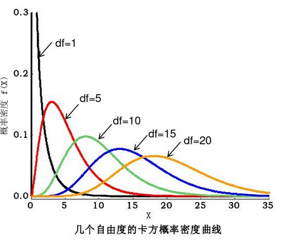
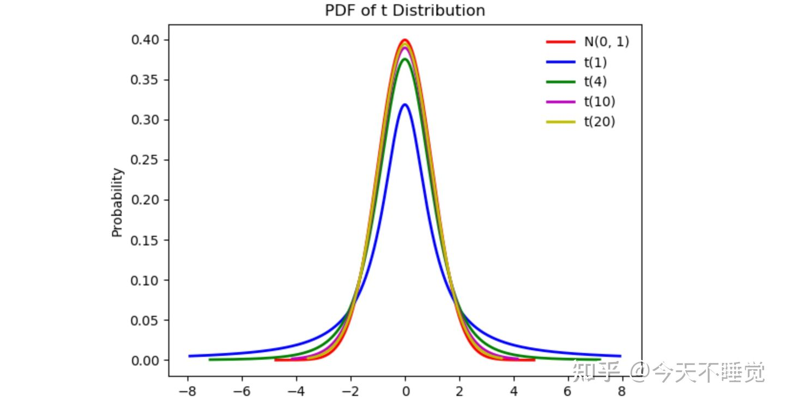

# 大数定律与中心极限定理

## 大数定律

$$
f(x) \xrightarrow[x\rightarrow x_0]{P} a \Leftrightarrow \forall \varepsilon>0,有\lim_{x\rightarrow x_0}P(|f(x)-a|<\varepsilon)=0 \hfill \\
\\
有n个随机变量\{X_n\},及其平均值\overline{X_N},若\exists a,s.t. \overline{X_n} \xrightarrow[n\rightarrow\infty]{P} a,则称\{X_n\}符合\textbf{大数定律}\hfill \\
\\
\mathrm{Chebshev}大数定律: \hfill \\
若\{X_n\}有相同的期望\mu和方差,且\textbf{互不相关}(不需要独立),则\overline{X_n} \xrightarrow[n\rightarrow\infty]{P} \mu \quad \hfill \\
\mathrm{Chebshev}不等式: \hfill \\
\forall \varepsilon>0,有P(|X-\mu|\ge \varepsilon) \le \frac{\sigma^2}{\varepsilon^2} \hfill \\
注:使用\mathrm{Chebshev}不等式估算时,把不等号改成等号 \hfill \\
\\
\mathrm{Khinchin}大数定律: \hfill \\
若\{X_n\}\textbf{独立同分布},则\overline{X_n} \xrightarrow[n\rightarrow\infty]{P} \mu \hfill \\
注:\mathrm{Chebshev}大数定律要求方差存在,而\mathrm{Khinchin}大数定律则不要求,所以后者并不是前者的弱化 \hfill \\
\\
\mathrm{Bernoulli}大数定律: \hfill \\
记n_A为n次\textbf{独立重复试验}中事件A发生的次数,每次试验中A发生的概率为p,则\forall \varepsilon>0 ,有\frac{n_A}{n}\xrightarrow[n\rightarrow\infty]{P} p \hfill \\
$$

## 中心极限定理

$$
\{X_n\}为一系列\textbf{独立同分布}随机变量,记S_n=\sum_{i=1}^n X_n,Y_n=\frac{S_n-ES_n}{\sqrt{DS_n}} \hfill \\
则n充分大时: \hfill \\
S_n \overset{近似}{\sim} N(n\mu,n\sigma^2) \quad 
Y_n=\frac{S_n-n\mu}{\sigma\sqrt{n}} \overset{近似}{\sim} N(0,1) \hfill \\
P(S_n \le x)=P(Y_n \le \frac{x-n\mu}{\sigma\sqrt{n}}) \approx \Phi(\frac{x-n\mu}{\sigma\sqrt{n}})  \hfill \\
\\
若X \sim B(n,p),n充分大时,X \overset{近似}{\sim} N(np,np(1-p)) \hfill \\
注:将二项分布近似成泊松分布要求n较大,p较小;而近似成正态分布要求n充分大 \hfill \\
$$

- 大量**独立同分布随机变量**的和、平均数，以及符合**二项分布的**随机变量都可以近似成正态分布

## 题型：大数定律和中心极限定理

$$
有36个灯泡,使用寿命X \sim E(0.01),每当一个灯泡损坏,立即替换下一个,记它们工作的总时间为Y,用中心极限定理估算P(X>4200): \hfill \\
易得:EX=100,DX=10000 \Rightarrow Y \overset{近似}{\sim} N(3600,36000) \hfill \\
设T=\frac{Y-3600}{600},则T \overset{近似}{\sim} N(0,1) 
\Rightarrow P(Y>4200)=P(T>1) \approx 1- \Phi(1)=0.1587 \hfill \\
$$

# 数理统计

## 概念

$$
从若干个体构成的总体中抽取一个个体,\textbf{随机且独立地}抽取若干个个体,抽出的个体称为\textbf{样本} \hfill \\
观察其特征,结果称为\textbf{观测值};每个样本的\textbf{观测值}可以视为随机变量 \hfill \\
可以将抽样的结果记为\{X_1,X_2,...X_n\},这些随机变量是\textbf{独立同分布}的 \hfill \\
F(x_1,x_2,...,x_n)=\prod_{i=1}^n F(x_i) \quad f(x_1,x_2,...,x_n)=\prod_{i=1}^n f(x_i) \hfill \\
\\
理论分布:\textbf{任意一个样本的实际分布},理论分布函数记为F(x) \hfill \\
经验分布:由\textbf{抽样结果推测出的任意一个样本的分布},经验分布函数记为F_n(x) \hfill \\
将一次抽样的观测值记为(x_1,x_2,...,x_n),不妨假设些观测值已经从小到大排好 \hfill \\
则经验分布列:P_n(X=x_i)=\frac{1}{n} \quad F_n(x)=
\begin{cases}
0 \quad x<x_0 \\
\frac{k}{n} \quad x_k \le x < x_{k+1} \\
1 \quad x \ge x_{k+1} \\
\end{cases} \hfill \\
F_n(x) \xrightarrow[n\rightarrow \infty]{P} F(x) \hfill \\
\\
统计量:值完全由样本决定的表达式(不包含未知数,不能为常数) \hfill \\
样本均值:\overline{X}=\frac{1}{n}\sum_{i=1}^n X_i \quad 样本方差:S^2=\frac{1}{\textbf{n-1}}\sum_{i=1}^n(X_i-\overline{X})^2=\frac{1}{\textbf{n-1}}(\sum_{i=1}^nX_i^2-n\overline{X}^2) \hfill \\
样本k阶原点矩:A_k=\frac{1}{n}\sum_{i=1}^n X_i^k \quad 样本k阶中心矩:B_k=\frac{1}{n}\sum_{i=1}^n (X_i-\overline{X})^k \hfill \\
注意:B_2= \frac{n-1}{n} S^2=A_2-A_1^2 \hfill \\
E\overline{X}=EX \quad D\overline{X}=\frac{DX}{n} \quad ES^2=DX \hfill \\
$$

## 抽样分布

$$
\chi^2分布:\chi^2\sim \chi^2(n) \hfill \\
若X\sim N(0,1),\chi^2=X_1^2+...+X_n^2,则\chi^2 \sim \chi^2(n) \hfill \\
E\chi^2=n \quad D\chi^2=2n \hfill \\
n=2时,\chi^2 \sim E(\frac{1}{2}) \hfill \\
将方程P(\chi^2>x)=\alpha的解记为\chi^2_\alpha \hfill \\
n充分大时,\chi^2 \sim N(n,2n) \hfill \\
\\
t分布:T \sim t(n) \hfill \\
若X\sim N(0,1),Y\sim\chi^2(n),(X,Y)独立,记T=\frac{X}{\sqrt{Y/n}},则T \sim t(n) \hfill \\
ET=0 \quad DT =\frac{n}{n-2} \hfill \\
n充分大时,T \sim N(0,1) \hfill \\
\\
F分布:F \sim F(n_1,n_2) \hfill \\
若X\sim \chi^2(n_1),Y\sim \chi^2(n_2),记F=\frac{X/n_1}{Y/n_2},则F \sim F(n_1,n_2) \hfill \\
$$

## 正态总体下的抽样分布

$$
S^2=\frac{1}{\textbf{n-1}}\sum_{i=1}^n(X_i-\overline{X})^2=\frac{1}{\textbf{n-1}}(\sum_{i=1}^nX_i^2-n\overline{X}^2) \hfill \\
A_k=\frac{1}{n}\sum_{i=1}^n X_i^k \quad B_k=\frac{1}{n}\sum_{i=1}^n (X_i-\overline{X})^k \hfill \\
\\
注:t_n符合特定分布的随机变量,t(n)表示随机变量的分布,t_\alpha(n)表示上侧分位点 \hfill \\
X \sim N(0,1),有样本\{X_1,X_2,...X_n\}: \quad (\textbf{总是优先构造标准正态分布}) \hfill \\
\\
\overline{X} 和S^2 独立,\overline{X} \sim N(0,\frac{1}{n}) \hfill \\
\chi^2_n=\sum_{i=1}^n X_i^2 \quad \chi^2_n \sim \chi^2(n) \hfill \\
\chi'^2_n=\sum_{i=1}^n (X_i-\overline{X})^2=(n-1)S^2 \quad \chi'^2_n \sim \chi^2(\textbf{n-1}) \hfill \\
A,B独立,A \sim \chi^2(n_1),B \sim \chi^2(n_2) \Rightarrow A+B \sim \chi^2(n_1+n_2) \quad (A,B的样本未必相同) \hfill \\
\\
t_n=\frac{X}{\sqrt{\chi^2_n/n}} \quad t_n\sim t(n) \quad t_\alpha(n) =t_{1-\alpha}(n) \hfill \\
t'_n=\frac{\overline{X}}{\sqrt{S^2/n}} \quad t'_n \sim t(\textbf{n-1}) \hfill \\
\\
F_{n_1,n_2}=\frac{\chi^2_{n_1}/n_1}{\chi^2_{n_2}/n_2} \quad F_{n_1,n_2} \sim F(n_1,n_2)
\quad F_\alpha(n_1,n_2)=\frac{1}{F_{1-\alpha}(n_2,n_1)}\hfill \\
t_n^2=\frac{X^2}{\chi^2_n/n}=F_{1,n} \quad t'^2_n=\frac{\overline{X}^2}{S^2/n}=F_{1,n-1} \hfill \\
\\
若X \sim N(0,\sigma_1),有样本\{X_1,X_2,...X_n\},Y \sim N(0,\sigma_2),有样本\{Y_1,Y_2,...Y_n\}: \hfill \\
\frac{\overline{X}-\overline{Y}}{\sqrt{\frac{\sigma_1^2}{n_1}+\frac{\sigma_2^2}{n_2}}} \sim N(0,1) \hfill \\
\frac{S_1^2/\sigma_1^2}{S_2^2/\sigma_2^2} \sim F(n_1-1,n_2-1) \hfill \\
$$

## 题型：抽样分布

$$
X \sim N(\mu_1,\sigma^2),Y\sim N(\mu_2,\sigma^2),其样本均值、样本方差分别为\overline{X},\overline{Y},S_1^2,S_2^2, \hfill \\
A^2=\frac{(n_1-1)S_1^2+(n_2-1)S_2^2}{n_1+n_2-2},B=\frac{\overline{X}-\overline{Y}-\mu_1+\mu_2}{A}\sqrt{\frac{n_1n_2}{n_1+n_2}},求B的分布: \hfill \\
令U=\frac{X-\mu_1}{\sigma},V=\frac{Y-\mu_2}{\sigma},其样本方差为S_3^2,S_4^2,则U \sim N(0,1),\overline{U}=\frac{\overline{X}-\mu_1}{\sigma},S_3^2=\frac{S_1^2}{\sigma^2} \quad (V同理) \hfill \\
A^2=\sigma^2\frac{(n_1-1)S_3^2+(n_2-1)S_4^2}{n_1+n_2-2}
=\sigma^2\frac{\chi^2_{n_1-1}+\chi^2_{n_2-1}}{n_1+n_2-2}
=\sigma^2\frac{\chi^2_{n_1+n_2-2}}{n_1+n_2-2} \hfill \\
B=\sigma \frac{\overline{U}-\overline{V}}{A\sqrt{\frac{\sigma^2}{n_1}+\frac{\sigma^2}{n_2}}}
=\frac{N}{\sqrt{\chi^2_{n_1+n_2-2}/(n_1+n_2-2)}} \Rightarrow B \sim t(n_2+n_1-2) \hfill \\
\\
X \sim N(\mu,\sigma^2),有简单随机样本\{X_1,...X_{2n}\},令T=\sum_{i=1}^n(X_i+X_{n+i}-2\overline{X})^2,求ET,DT: \hfill \\
令Y=X_i+X_{n+i},则Y \sim N(2\mu,2\sigma^2),\overline{Y}=2\overline{X},其样本方差为S^2_1 \hfill \\
令U=\frac{Y-2\mu}{\sqrt 2\sigma},其样本方差为S^2_2,则U \sim N(0,1),\overline{U}=\frac{\overline{Y}-2\mu}{\sqrt2 \sigma},S^2_2=\frac{S_1^2}{2\sigma^2} \hfill \\
故T=\sum_{i=1}^n(Y-\overline{Y})^2=(n-1)S_1^2=2\sigma^2(n-1)S^2_2=2\sigma^2\chi^2(n-1) 
\Rightarrow ET=2\sigma^2(n-1),DT=8\sigma^4(n-1) \hfill \\
\\
X \sim N(0,1),有简单随机样本\{X_1,...X_{m+n}\},求\frac{1}{m}(\sum_{i=1}^m X_i)^2+\frac{1}{n}(\sum_{i=m+1}^{m+n} X_i^2)服从的分布: \hfill \\
X \sim N(0,1) \Rightarrow \sum_{i=1}^m X_i \sim N(0,m) \Rightarrow \frac{\sum\limits_{i=1}^m X_i}{\sqrt{n}} \sim N(0,1) \Rightarrow \frac{1}{m}(\sum_{i=1}^m X_i)^2 \sim \chi^2(1) \hfill \\
同理得:\frac{1}{n}(\sum_{i=m+1}^{m+n} X_i^2) \sim N(0,1),且两者相互独立 \Rightarrow \frac{1}{m}(\sum_{i=1}^m X_i)^2+\frac{1}{n}(\sum_{i=m+1}^{m+n} X_i^2) \sim \chi^2(2) \hfill \\
$$

- 抽样分布只有有限的三种，容易猜测，主要是确定系数
- **如果两个表达式符合的分布相同，且都与其他表达式独立，则两个表达式可相互替换**

# 参数估计

## 概念

$$
要确定某个随机变量的分布,先猜想其分布类型,然后通过样本确定分布中未定的参数 \hfill \\
待估参数记为\theta(向量),其所有可能取值构成的向量空间记为 \Theta \hfill \\
注意:估计的依据有时候说成样本(X_1,X_2,...),有时候说成样本观测值(x_1,x_2,...),这无关紧要 \hfill \\
$$

## 点估计

$$
对参数的估计的结果是具体的(若干个)值,记为\hat{\theta} \hfill \\
另外,估计的数学期望记为\hat{\mu},估计的方差记为\hat{\sigma^2} \hfill \\
$$

### 矩估计法

$$
k阶原点矩:\nu_k=EX^k(由常量和待定参数构成的表达式) \quad 样本k阶原点矩:A_k=\frac{1}{n}\sum_{i=1}^n X_i^k (结果确定后,便为常量) \hfill \\
如果待定参数有t个,就取t个方程,求解的结果即\hat{\theta} \hfill \\
如果求期望/方差,则直接得\hat{\mu}=A_1,\hat{\sigma^2}=A_2-A_1^2=B_2 \hfill \\
$$

### 极大似然估计法

$$
调整待定参数,使得理论抽样结果与已得到的一组观测值恰好相同的可能性最大,求出这种情况的参数 \hfill \\
有似然函数L(\theta),求L(\theta)的极大值点(有多个待定参数时,L为多元函数),该点即\hat{\theta} \hfill \\
离散型:L(\theta)=\prod_{i=1}^n P(X=x_i) \quad (n为样本数,不是待定参数) \hfill \\
连续型:L(\theta)=\prod_{i=1}^n f(x_i) \hfill \\
确定极大值点时,除了求\frac{\mathrm d L}{\mathrm d\theta},还可以求\frac{\mathrm d \ln L}{\mathrm d\theta} \hfill \\
$$

### 估计量的评选标准

$$
无偏性: \hfill \\
\theta和\hat{\theta}表示任意一个待估参数(或向量)及其估计值,若E(\hat{\theta})=\theta,则称\hat{\theta}是\textbf{无偏的} \hfill \\
矩估计法和极大似然估计法均满足:\hat{\mu}=\overline{X}(无偏),\hat{\sigma^2}=B_2(有偏,\hat{\sigma^2}=S^2才无偏) \hfill \\
\\
有效性: \hfill \\
\hat{\theta_1}和\hat{\theta_2}均为\theta的估计值,若D\hat{\theta_1}<D\hat{\theta_2},则称\hat{\theta_1}较\hat{\theta_2}\textbf{有效} \hfill \\
若\hat{\theta_0}无偏,且\forall 无偏估计量\hat{\theta},有D\hat{\theta_0}<D\hat{\theta},则称\hat{\theta_0}为\textbf{最小方差无偏估计量},\textbf{或最优无偏估计量} \hfill \\
\\
一致性: \hfill \\
若\hat{\theta} \xrightarrow[n\rightarrow \infty]{P} \theta (n是用于计算\hat{\theta}的样本个数),则称\hat{\theta}是\theta的\textbf{一致估计量} \hfill \\
矩估计量必然是一致估计量,极大似然估计则需要满足一定条件 \hfill \\
$$

### 题型：点估计

$$
X\sim U(a,b),a,b待定,有样本\{X_1,X_2,...,X_n\},求a,b的矩估计量: \hfill \\
\nu_1=EX=\frac{a+b}{2} \quad \nu_2=EX^2=\frac{1}{b-a}\int_a^b x^2 \mathrm dx =\frac{1}{3}(a^2+ab+b^2) \hfill \\
令
\begin{cases}
\nu_1=A_1 \\
\nu_2=A_2 \\
\end{cases},解得
\begin{cases}
\hat{a}=A_1-\sqrt{3B_2} \\
\hat{b}=A_1+\sqrt{3B_2} \\
\end{cases} \hfill \\
\\
某零件的使用寿命为X,f(x)=
\begin{cases}
2e^{-2(x-\theta)} \quad x>\theta \\
0 \quad x\le \theta \\
\end{cases},有样本观测值\{x_1,x_2,...,x_n\},求\theta的最大似然估计值: \hfill \\
L(\theta)=\prod_{i=1}^n f(x_i)=
\begin{cases}
2^ne^{-2\sum\limits_{i=1}^n(x-\theta)} \quad x_i>\theta \\
0 \quad 其他 \\
\end{cases} \hfill \\
\forall 1\le i \le n,x_i>\theta时,L(\theta)=2^ne^{-2\sum\limits_{i=1}^n(x-\theta)} \quad 显然,L(\theta)随\theta增大而增大 \hfill \\
又因为\forall 1\le i \le n,x_i>\theta,故\hat{\theta}=\min\{x_1,x_2,...,x_n\} \hfill \\
\\
有总体X和简单样本\{X_n\},f(x)=
\begin{cases}
(\theta+1)x^\theta \quad 0<x<1 \\
0 \quad 其他 \\
\end{cases},\theta>-1.分别求\theta的矩估计量和极大似然估计量: \hfill \\
矩估计: \hfill \\
\nu_1=EX=\int_0^1 (\theta+1)x^{\theta+1} \mathrm dx=\frac{\theta+1}{\theta+2} \quad A_1=\overline{X} \hfill \\
故\frac{\hat{\theta}+1}{\hat{\theta}+2}=\overline{X} \Rightarrow \hat{\theta}=\frac{2\overline{X}-1}{1-\overline{X}} \hfill \\
极大似然估计: \hfill \\
L(\theta)=(\theta+1)^n(\prod_{i=1}^nx_i)^{\theta} \Rightarrow \ln L(\theta)=n \ln(\theta+1)+\theta n \overline{X} \hfill \\
故\frac{\mathrm d\ln L(\hat{\theta})}{\mathrm d \theta} =0 \Rightarrow 0=\frac{1}{\hat{\theta}+1}+\overline{X} \Rightarrow \hat{\theta}=-1-\frac{1}{\overline{X}} \hfill \\
$$

## 区间估计

$$
估计的结果是一个区间,以及一个置信概率,记为P(\underline{\theta}<\theta<\overline{\theta})=1-\alpha,称(\underline{\theta},\overline{\theta})是\theta的\textbf{置信水平}为1-\alpha的\textbf{置信区间} \hfill \\
置信水平固定时,置信区间不固定;其中,长度最小的一个置信区间最优 \hfill \\
$$

### 正态分布的区间估计

| 条件              | 置信区间                            | b                                                 | k                         |
| ----------------- | ----------------------------------- | ------------------------------------------------- | ------------------------- |
| $\sigma已知求\mu$ | $(\overline{X}-kb,\overline{X}+kb)$ | $u_{\alpha/2}$                                    | $\frac{\sigma}{\sqrt{n}}$ |
| $\sigma未知求\mu$ | $(\overline{X}-kb,\overline{X}+kb)$ | $t_{\alpha/2}(n-1)$                               | $\frac{s}{\sqrt{n}}$      |
| $求\sigma^2$      | $((n-1)S^2/b_1,(n-1)S^2/b_2)$       | $\chi^2_{\alpha/2}(n-1),\chi^2_{1-\alpha/2}(n-1)$ |                           |

### 题型：区间估计

$$
X \sim N(\mu,\sigma^2),\sigma^2已知,\mu未知,样本容量为16且置信度为0.95时,置信区间的最小长度为0.588,求\sigma: \hfill \\
易得:0.294=\frac{\sigma}{\sqrt{16}}u_{0.025},u_{0.025}=1.96 \Rightarrow \sigma=0.6 \hfill \\
$$

# 假设检验

## 概念

$$
基本步骤: \hfill \\
1.给定假设H_0,备择假设为H_1 \hfill \\
2.用样本构造统计量T,并假定一个风险水平\alpha \hfill \\ 
3.在H_0成立的前提下,求T的置信度为1-\alpha的置信区间(T的选择参考区间估计) \hfill \\
3.若假设中的量位于置信区间内,接受H_0,否则拒绝H_0 \hfill \\
\\
置信区间以外的部分即\textbf{拒绝域};风险水平越小,拒绝域越小,越难拒绝H_0(拒绝越有说服力) \hfill \\
拒绝H_0但H_0为真为\textbf{第一类错误},接受H_0但H_0为假为\textbf{第二类错误} \hfill \\
已知被检验量的值和风险水平(置信区间)时,才能计算犯错概率;此时已知H_0的真假,故两种错误中只有一种可能发生 \hfill \\
例如,已知H_0为真,则只可能犯第一类错误,故直接求被检验量落在拒绝域的概率即可 \hfill \\
$$

## 题型：假设检验

$$
X \sim N(\mu,0.01),对X抽样,得到10个样本观测值,\overline{x}=10.05,能否认为\mu=10(\alpha=0.05)? \hfill \\
则\mu的置信度为0.95的置信区间为\left(\overline{X}-\frac{0.1}{\sqrt{10}}u_{0.025},\overline{X}+\frac{0.1}{\sqrt{10}}u_{0.025}\right) =(9.988,10.112) \hfill \\
故能认为\mu=10 \hfill \\
$$
