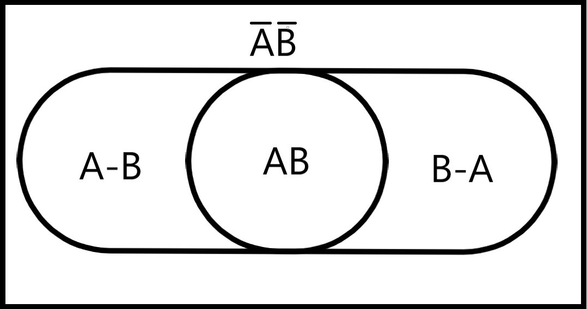
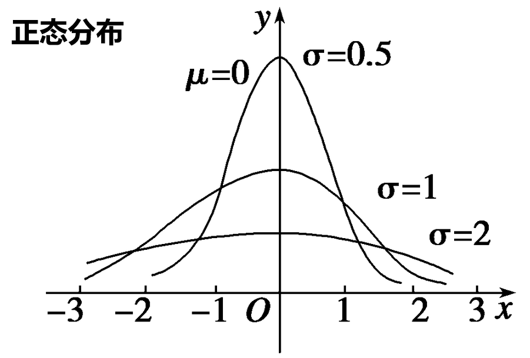
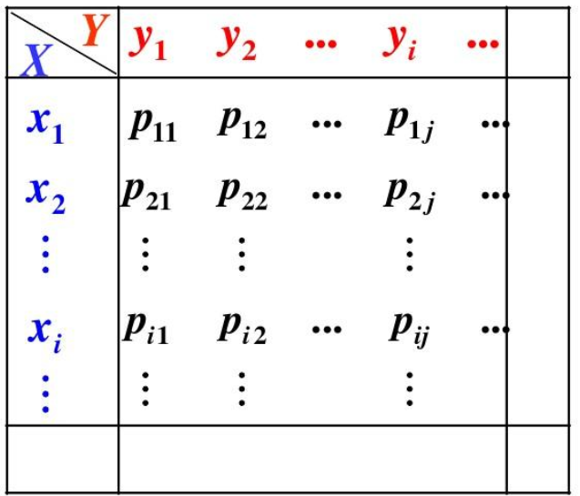

# 随机事件

## 概念

$$
\begin{aligned}
& 随机实验指满足以下条件的\textbf{试验}:①事先知道试验的一切可能结果②事先无法得知某次试验的结果③试验可以在相同条件下重复进行  \\
& 随机事件:\textbf{随机试验}的一个\textbf{可能结果},简称事件.不可再分的事件称为\textbf{基本事件},由若干基本事件组成的称为\textbf{复合事件}  \\
& 样本空间:某个随机试验的所有\textbf{可能产生的结果}构成的集合,记为\Omega   \\
& 必然事件:必然发生的事件,记为\Omega  \\
& 不可能事件:不可能发生的事件,记为\varnothing  \\
& \\
& 注:基本事件和复合事件的概念比较模糊,样本空间中的元素既可能是基本事件,也可能是复合事件.  \\
& 关键是,样本空间中的元素必须是\textbf{一个试验结果},即仅凭该元素本身能够完整描述试验的结果  \\
\end{aligned}
$$

## 随机事件的关系

$$
\begin{aligned}
& A发生且B发生: A \cap B(或AB)\quad  A发生或B发生: A \cup B (或A+B)\quad A不发生:\overline{A}=\Omega-A  \\
& A发生而B不发生:A-B=A\cap \overline{B} \quad A和B有且仅有一个发生(对称差):A \Delta B=(A-B)\cup(B-A)  \\
& 注:以上运算与布尔代数有类似的性质  \\
& \\
& A与B总是同时发生或同时不发生:A与B等价,记为 A=B  \\
& A必然发生:A = \Omega \quad A不可能发生:A=\varnothing  \\
& A发生,则B必然发生:B包含A,记为A \subset B \quad  \\
& A与B不可能同时发生:A与B互斥(不相容),记为AB = \varnothing \quad (注意:P(AB)=0不能推出AB=\varnothing)  \\
& A与B必然有且只有一个发生:A与B互逆,记为A= \overline{B} \quad A=\overline{B} \Leftrightarrow AB=\varnothing,A+B=\Omega \quad 互逆\Rightarrow 互斥  \\
& \\
& 有事件序列\{A_n\}:  \\
& ①事件序列的极限:l=\lim_{n\rightarrow \infty}A_n  \\
& ②若总有A_n \subset A_{n+1},A_n为单调递增序列(后一项总是包含前一项),且l=\bigcup_{i=1}^\infty A_n  \\
& ③若总有A_n \supset A_{n+1},A_n为单调递减序列(前一项总是包含后一项),且l=\bigcap_{i=1}^\infty A_n  \\
\end{aligned}
$$

**事件不能理解为以基本事件为元素的集合，而应该理解为韦恩图上的区域**

## 事件的概率

*常用公式已体现在上面的两张图中,不再重复列出*

## 条件概率

$$
\begin{aligned}
& B已经发生的前提下,A发生的概率,称为A在B发生的条件下的条件概率,记为P(A|B)  \\
& P(A|B)=\frac{P(AB)}{P(B)} \Rightarrow P(AB)=P(A|B)P(B)=P(B|A)P(A)  \\
& P(A|B)可以理解为:取出韦恩图中B发生的部分,将其视为全集,然后求A发生的部分在其中的占比  \\
& 若\{A_1,A_2,...A_n\}是\Omega的一个\textbf{划分}(不重复,不遗漏):  \\
& ①P(B)=\sum_{i=1}^nP(B|A_i)P(A_i) \quad (分类讨论)  \\
& ②P(A_i|B)=\frac{P(B|A_i)P(A_i)}{\sum\limits_{k=1}^n P(B|A_k)P(A_k)} \quad (B发生时A_i发生=\frac{B和A_i同时发生(条件概率公式)}{B发生(分类讨论)})  \\
& \\
& 若P(AB)=P(A)P(B),称A与B\textbf{独立} \quad (P(A)=0或1 \Rightarrow A与一切事件独立)   \\
& P(B)>0且P(A|B)=P(A)\Leftrightarrow  A与B独立 \Leftrightarrow \overline{A}与B独立 \Leftrightarrow A与\overline{B}独立 \Leftrightarrow \overline{A}与\overline{B}独立  \\
& 0<P(A)<1且P(A|B)=P(A|\overline{B}) \Leftrightarrow A与B独立  \\
& A与B独立可以理解为:A发生的概率不因B发生与否而改变,即韦恩图上AB在B中的占比等于A在全集中的占比  \\
& A_1,A_2,A_3独立指\textbf{两两独立},如果还满足P(A_1A_2A_3)=P(A_1)P(A_2)P(A_3),称A_1A_2A_3\textbf{相互独立}  \\
& 注意:|(条件概率)是优先级最低的运算符  \\
\end{aligned}
$$

- 证明不独立十分容易，找反例即可

## 题型：条件概率

$$
\begin{aligned}
& 10件产品中有4件不合格,从中随机取两件,已知有一件不合格,求另一件也不合格的概率:  \\
& 记A=第一件合格,B=第二件合格,则要求的概率为P(\overline{A}\overline{B}|\overline{A}+\overline{B})=\frac{1}{5}  \\
\end{aligned}
$$

# 随机变量

## 概念

$$
\begin{aligned}
& 有\textbf{函数}X(w),w为\textbf{随机事件},则称X为\textbf{随机变量}  \\
& 如,抛一枚硬币,规定抛出正面为1,背面为0,则X(w)=
\begin{cases}
1 \quad w=抛出正面 \\
0 \quad w=抛出背面 \\
\end{cases}  \\
& \\
& 定义F_X(x)=P(X \le x),简写为F(x),称为X的\textbf{分布函数},具有以下性质:  \\
& ①F(x)单调递增(不一定严格单调)  \\
& ②F(x)\textbf{右连续,未必左连续}  \\
& ③P(a<X\le b)=F(b)-F(a) \quad P(X<a)=F(a^-)  \\
& \\
& F(x)连续时:  \\
& ①P(X=k) \equiv 0,F(a^-)\equiv F(a)  \\
& ②若\exists f(t),s.t. F(x)=\int_{-\infty}^{t}f(t) \mathrm dt,则X为\textbf{连续型随机变量},称f(t)为X的\textbf{概率密度函数}  \\
& 注:f(x)不唯一,通常取f(x)=F'(x), 在有限个点改变f(x)的值不影响结果  \\
\end{aligned}
$$

## 离散型随机变量

$$
\begin{aligned}
& \mathrm C_m^n=\frac{n!}{m!(n-m)!} \quad \mathrm A_m^n=\frac{n!}{(n-m)!}  \\
& \\
& 两点分布:  \\
& P(X=k)=
\begin{cases}
p \quad k=1 \\
1-p \quad k=0 \\
\end{cases}  \\
& \\
& 二项分布:X \sim B(n,p) \quad 抽出黑球的概率为p,放回重抽,重复n次,X为抽出黑球的次数  \\
& P(X=k)=\mathrm C_n^kp^k(1-p)^{n-k} \quad EX=np \quad DX=np(1-p)  \\
& \\
& 泊松分布:X \sim P(\lambda) \quad 放回重抽n次(n\textbf{充分大}),平均会抽出黑球\lambda次,X为抽出黑球的实际次数  \\
& P(X=k)=\frac{\lambda^ke^{-\lambda}}{k!} \quad EX=\lambda \quad DX=\lambda  \\
& k=\lambda(\lambda非整数则向下取整)时,P(X=k)_{max}  \\
& 若X,Y独立,X \sim P(\lambda_1),Y \sim P(\lambda_2),则X+Y \sim P(\lambda_1+\lambda_2)  \\
& 实际上,泊松分布是二项分布在n充分大p充分小时的近似,P(X=k)=\lim_{n \rightarrow \infty} \mathrm C_n^k(\frac{\lambda}{n})^k(1-\frac{\lambda}{n})^{n-k}=\frac{\lambda^ke^{-\lambda}}{k!}  \\
& \\
& 超几何分布:X \sim H(n,M,N) \quad 共N个球,其中M个黑球,一次抽n个,X为抽出黑球的个数  \\
& P(X=k)=\frac{\mathrm C_M^k \mathrm C_{N-M}^{n-k}}{\mathrm C_N^n} \quad EX=np \quad DX=np(1-p)\frac{N-n}{N-1} \quad (p=\frac{M}{N})  \\
& \\
& 帕斯卡分布:X \sim NB(n,p) \quad 抽出黑球的概率为p,放回重抽,X为第n次抽出黑球时的已抽球次数  \\
& P(X=k)=\mathrm C_{k-1}^{n-1}p(1-p)^{k-1} \quad EX=\frac{n}{p} \quad DX=\frac{n(1-p)}{p^2}  \\
& n=1时,称为几何分布,记为X \sim GE(p)  \\
\end{aligned}
$$

## 连续型随机变量

$$
\begin{aligned}
& 均匀分布:X \sim U(a,b)  \\
& f(x)=
\begin{cases}
\frac{1}{b-a} \quad a<x<b \\
0 \quad 其他  \\
\end{cases}
\quad EX=\frac{a+b}{2} \quad DX=\frac{(a-b)^2}{12}  \\
& \\
& 指数分布:X \sim E(\lambda) \quad 每一瞬间,A有相同的概率死亡,平均死亡时间为\frac{1}{\lambda},X为实际死亡时间  \\
& f(x)=
\begin{cases}
\lambda e^{-\lambda x} \quad x\ge 0 \\
0 \quad x<0  \\
\end{cases}
\quad EX=\frac{1}{\lambda} \quad DX=\frac{1}{\lambda^2} \quad F(x)=
\begin{cases}
1-e^{-\lambda x} \quad x \le 0 \\
0 \quad x<0 \\
\end{cases}
 \\
& 指数分布具有\textbf{无记忆性}:P(X>k)=P(X>k+c|X>c)  \\
& 若X\sim P(\lambda_1),Y\sim P(\lambda_2),(X,Y)独立,则X+Y \sim P(\lambda_1+\lambda_2)  \\
& \\
& 正态分布:X \sim N(\mu,\sigma^2)  \\
& f(x)=\frac{1}{\sqrt{2\pi}\sigma}e^{-\frac{(x-\mu)^2}{2\sigma^2}} \quad EX=\mu \quad DX=\sigma^2
\quad EX^2 = \mu^2 + \sigma^2  \\
& 特别地,令Y=\frac{x-\mu}{\sigma},则Y\sim N(0,1),这一过程称为正态分布的\textbf{标准化}  \\
& 若X\sim (\mu_1,\sigma_1^2),Y\sim (\mu_2,\sigma_2^2),X,Y独立,则X\pm Y \sim N(\mu_1\pm\mu_2,\sigma_1^2+\sigma_2^2)  \\
& (任意个\textbf{独立的}正态分布的线性组合依然为正态分布)  \\
& \\
& 标准正态分布:X \sim N(0,1)  \\
& 标准正态分布的分布函数记为\Phi(x)=\frac{1}{\sqrt{2\pi}}\int_{-\infty}^xe^{-\frac{t^2}{2}} \mathrm dt \quad 概率密度函数记为:\phi(x)=\frac{1}{\sqrt{2\pi}}e^{-\frac{x^2}{2}}  \\
& 将方程P(X>x)= \alpha的解记为u_\alpha,也称为\textbf{上侧分位点},则\Phi(u_\alpha)=1-\alpha \\
& \\
& \Gamma (\alpha)=\int_{0}^{+\infty} \frac{x^{\alpha-1}}{e^x} \mathrm dx (\alpha>0)  \\
& \Gamma(\alpha+1)=\alpha \Gamma(\alpha) \quad \Gamma(n+1)=n!(n为正整数)  \\
& \Gamma(\frac{1}{2}) = \sqrt{\pi} \quad \Gamma(1)=1 \quad \Gamma(2) =1 \quad \Gamma(3) =2  \\
\end{aligned}
$$

## 随机变量函数

$$
\begin{aligned}
& Y=g(X),X,Y为随机变量,则称g(X)为\textbf{随机变量函数}  \\
& 对于离散型随机变量,已知g(X)和X的分布列,可以直接写出Y的分布列  \\
& 对于连续型随机变量X,以及Y=g(X):  \\
& ①F_Y(y)=P(Y \le y)=P(g(X) \le Y)=\int_{g(x) \le y} f_X(x) \mathrm dx  \\
& ②若Y=g(X)\textbf{严格单调},f_Y(y)=
\begin{cases}
f_X[g^{-1}(y)]|[g^{-1}(y)]'| \quad y在g(x)的值域内 \\
0 \quad y不在g(x)的值域内 \\
\end{cases}  \\
\end{aligned}
$$

## 题型：随机变量

$$
\begin{aligned}
& X \sim N(0,1),Y=9X^2,求Y的概率密度函数:  \\
& y>0时:  \\
& F_Y(y)=P(Y \le y)=P(9X^2 \le y)=P(-\frac{\sqrt{y}}{3} \le X \le \frac{\sqrt{y}}{3})
=\int_{-\frac{\sqrt{y}}{3}}^\frac{\sqrt{y}}{3} \frac{1}{\sqrt{2\pi}}e^{-\frac{x^2}{2}} \mathrm dx=\frac{2}{\sqrt{2\pi}}\int_0^\frac{\sqrt{y}}{3} e^{-\frac{x^2}{2}} \mathrm dx  \\
& f_Y(y)=F_Y(y)'=(\frac{\sqrt{y}}{3})'\frac{2}{\sqrt{2\pi}}e^{-\frac{y}{18}}=\frac{1}{3\sqrt{2\pi y}}e^{-\frac{y}{18}}  \\
& y \le 0时:f_Y(y)=0  \\
& \\
& X \sim E(\lambda),Y=
\begin{cases}
X \quad |X| \le 1 \\
-X \quad |X| > 1 \\
\end{cases}
,求Y的分布函数:  \\
& F_Y(y)=P(Y \le y)=P(|X| \le 1,X \le y)+P(|X|>1,-X \le y)  \\
& =P(0 \le X \le 1,X \le y)+P(X>1,X \ge -y)  \\
& y\le-1时:F_Y(y)=0+P(X \ge -y)=1-F_X(-y)=e^{\lambda y}  \\
& -1<y\le 0时:F_Y(y)=P(X \ge 1)=1-F_X(1)=e^{-\lambda}  \\
& 0 < y \le 1时:F_Y(y)=P(0\le X\le y)+P(X>1)=F_X(y)+1-F_X(1)=1-e^{\lambda x}+e^{-\lambda x}  \\
& y>1时:F_Y(y)=1  \\
\end{aligned}
$$

# 多维随机变量

## 概念

$$
\begin{aligned}
& 有随机变量X,Y,称F(x,y)=P(X\le x,Y \le y)为(X,Y)的\textbf{联合分布函数}  \\
& 称F_X(x)和F_y(y)为(X,Y)关于X和Y的\textbf{边缘分布函数} (边缘分布函数相当于一维随机变量的分布函数) \\
& F(x,y)具有以下性质:  \\
& ①F(x,y)关于x和y单调递增且右连续  \\
& ②F_X(x)=F(x,+\infty),F_Y(y)=F(+\infty,y)  \\
\end{aligned}
$$

- 求多维随机变量的分布函数时，应当充分使用图像辅助

## 离散多维随机变量分布

$$
\begin{aligned}
& 仍用分布列(二维表格)表示,记P(X=x_i,Y=y_i)=p_{ij}  \\
& p_{i\cdot}=\sum_j p_{ij} \quad p_{\cdot j}=\sum_i p_{ij} \quad 所有p_{i\cdot}构成X的边缘分布列,所有p_{\cdot j}构成Y的边缘分布列 \\
& 离散变量条件分布:P(X=x_i|Y=y_i)=\frac{p_{ij}}{p_{\cdot j}}  \\
\end{aligned}
$$

## 连续多维随机变量分布

$$
\begin{aligned}
& 若X,Y为连续随机变量:  \\
& F(x,y)=\int_{-\infty}^x\int_{-\infty}^y f(u,v) \mathrm du \mathrm dv  \\
& f_X(x)=\int_{-\infty}^{\infty} f(x,y) \mathrm dy \quad f_Y(y)=\int_{-\infty}^{\infty} f(x,y) \mathrm dx \\
& 若F(x,y)的两个偏导数均存在,f(x,y)=\frac{\partial^2 F(x,y)}{\partial x\partial y} \\
& \\
& 二维正态分布:(X,Y) \sim N(\mu_1,\mu_2,\sigma_1^2,\sigma_2^2,\rho) \quad |\rho|<1  \\
& f(x,y)=\frac{1}{2\pi\sqrt{1-\rho^2}}\exp(\frac{u^2-2\rho uv+v^2}{2\rho^2-2}) \quad 其中u=\frac{x-\mu_1}{\sigma_1},v=\frac{y-\mu_2}{\sigma_2}  \\
& 其中X \sim N(\mu_1,\sigma_1^2),Y \sim N(\mu_2,\sigma_2^2),且此时X与Y独立 \Leftrightarrow X与Y不相关 \Leftrightarrow \rho_{XY}=0  \\
& X,Y独立且符合正态分布 \Rightarrow (X,Y) \sim N(\mu_1,\mu_2,\sigma_1^2,\sigma_2^2,0)  \\
& \\
& 连续变量条件分布:f(x,y)=f(x|y)f_Y(y)=f(y|x)f_X(x)  \\
& (X,Y)独立 \Leftrightarrow f(x|y)\equiv f_X(x),f(x,y)\equiv f_X(x)f_Y(y)  \\
\end{aligned}
$$

## 随机变量的独立性

$$
\begin{aligned}
& 与事件的独立性类似,若P(X=x_0,Y=y_0) \equiv P(X=x_0)P(Y=y_0),则称(X,Y)独立  \\
& (X,Y)独立 \Rightarrow(g(X),h(Y))独立 \quad (g(X),h(Y))独立且g(X)和h(Y)的\textbf{反函数存在} \Rightarrow (X,Y)独立  \\
& 如:(X,Y)独立 \Leftrightarrow (X^3,Y^3)独立 \quad (X,Y)独立 \Rightarrow (X^2,Y^2)独立  \\
& 注意:即使(X,Y)不独立,依然可以在Y未确定时单独给出X的分布,相当于Y各种取值下的平均情况  \\
\end{aligned}
$$

## 多维随机变量函数

$$
\begin{aligned}
& Z=g(X,Y),X,Y,Z为随机变量,则称g(X,Y)为\textbf{二维随机变量函数},函数的输出依然是\textbf{一维随机变量}  \\
& 若X,Y,Z为离散随机变量,直接根据分布列求Z的分布列即可  \\
& \\
& 若X,Y,Z为连续随机变量:  \\
& 1)Z=X+Y  \\
& F_Z(z)=\iint\limits_{x+y \le z}f(x,y) \mathrm dx \mathrm dy  \\
& f_Z(z)=\int_{-\infty}^{+\infty}f(x,z-x) \mathrm dx =\int_{-\infty}^{+\infty}f(z-y,y) \mathrm dy  \\
& 特别地,如果X,Y独立,f_Z(z)=f_X*f_Y \quad (卷积,注意是z的函数)  \\

& \\
& 2)Z=\frac{X}{Y}  \\
& F_Z(z)=\iint\limits_{\frac{x}{y} \le z}f(x,y) \mathrm dx \mathrm dy=\iint\limits_{y>0,x\le yz}f(x,y) \mathrm dx \mathrm dy +\iint\limits_{y<0,x\ge yz}f(x,y) \mathrm dx \mathrm dy  \\
& f_Z(z)=\int_{-\infty}^{+\infty}|y|f(yz,y) \mathrm dy  \\
& \\
& 3)Z=\max\{X,Y\}(X,Y独立)  \\
& F_Z(z)=F_X(z)F_Y(z)  \\
& \\
& 4)Z=\min\{X,Y\}(X,Y独立)   \\
& F_Z(z)=1-[1-F_X(z)][1-F_Y(z	)]  \\
& \\
& 5)一般情形  \\
& 根据定义写出F_Z(z),然后求导得出f_Z(z)  \\
\end{aligned}
$$

## 题型：多维随机变量

$$
\begin{aligned}
& X_i \sim
\left(
\begin{array}
\ -1 & 0 & 1 \\
\frac{1}{4} & \frac{1}{2} & \frac{1}{4}
\end{array}
\right)(i=1,2),且P(X_1X_2=0)=1,求P(X_1=X_2):  \\
& 易得P(X_1=0,X_2=0)=1-2P(X_1=-1)-2P(X_1=1)=0 \quad (画表格)  \\
& \\
& f(x,y)=
\begin{cases}
cxe^{-x(y+1)} \quad x>0,y>0 \\
0 \quad 其他
\end{cases},Z=\max\{X,Y\},判断X,Y是否独立,并求F_Z(z)  \\
& F(+\infty,+\infty)=1 \Rightarrow \frac{1}{c}=\iint\limits_{x>0,y>0} xe^{-x(y+1)} \mathrm dx \mathrm dy=\int_0^{+\infty} xe^{-x} \mathrm dx \int_0^{+\infty} e^{-xy} \mathrm dy=1 \Rightarrow c=1  \\
& f_{XY}(1,1)=e^{-2},f_X(1)=\int_0^{+\infty}e^{-(y+1)} \mathrm dy=e^{-1},f_Y(1)=\int_0^{+\infty}xe^{-2x} \mathrm dx=\frac{1}{4}  \\
& \Rightarrow f_{XY}(1,1)\ne f_X(1)f_Y(1) \Rightarrow (X,Y)不独立 \quad (确定不独立时,找反例而不是证明恒等式不成立)  \\
& F_Z(z)=\iint\limits_{x \le z,y \le z}f(x,y) \mathrm dx\mathrm dy
=
\begin{cases}
1-e^{-z}+\frac{e^{-z(z+1)}-1}{z+1} \quad z \le 0 \\
0 \quad z<0 \\
\end{cases}  \\
& \\
& F(x,y)=
\begin{cases}
1-e^{2x}-e^{-3y}+e^{-2x-3y} \quad x>0,y>0 \\
0 \quad 其他 \\
\end{cases}
,求P(\max\{X,Y\}>1): \\
& 原式=1-P(X<1,Y<1)  \\
& F_X(x)=F(x,+\infty)=1-e^{-2x} \quad F_Y(y)=F(+\infty,y)=1-e^{-3y}  \\
& F_X(x)F_Y(y)=F(x,y) \Rightarrow X,Y独立 \Rightarrow 原式=1-F_X(1)F_Y(1)=e^{-2}+e^{-3}-e^{-5}  \\
& \\
& X \sim N(0,1),X=x时,Y \sim N(x,1),求\rho_{XY}:  \\
& 由题意得:f(x)=\frac{1}{\sqrt{2\pi}}e^\frac{-x^2}{2},f(y|x)=\frac{1}{\sqrt{2\pi}}e^\frac{-(x-y)^2}{2}
\Rightarrow f(x,y)=f(y|x)f(x)=\frac{1}{\sqrt{2\pi}}e^{-x^2+xy-\frac{y^2}{2}}  \\
& \Rightarrow (X,Y) 符合二维正态分布,\rho_{XY}=\frac{\sqrt 2}{2}  \\
& \\
& X_1,X_2,X_3相互独立,X_1,X_2\sim N(0,1),P(X_3=0)=P(X_3=1)=\frac{1}{2},Y=X_3X_1+(1-X_3)X_2,  \\
& 求(X_1,Y)的分布函数,用标准正态分布\Phi(x)表示:  \\
& F(x,y)=P(X_1 \le x,Y \le y)=\frac{1}{2}P(X_1 \le x,X_1 \le y)+\frac{1}{2}P(X_1\le x,X_2 \le y)
=\frac{1}{2}\Phi(x)\Phi(y)+\frac{1}{2} \Phi(\min\{x,y\})  \\
& \\
& (X,Y)在D:0<x<1,x^2<y<\sqrt x上服从均匀分布,U=\begin{cases}1 \quad X \le Y \\ 0 \quad X > Y \end{cases},Z=U+X,求F_Z(z):  \\
& F_Z(z)=P(U+X \le z)=P(X \le Y,X \le z)+P(X>Y,X+1 \le z) ,: X \in(0,1)  \\
& ①z \le 0时,F_Z(z)=0  \\
& ②z \ge 2时,F_Z(z)=1  \\
& ③0 < z < 1时,F_Z(z)=P(X \le y,X \le z)=\frac{3}{2}z^2 -z^3 \quad (画图,二重积分)   \\
& ④1 \ge z < 2时,F_Z(z)=P(X \le y)+P(X \le Y,X \le z-1)=\frac{1}{2}+2(z-1)^{3/2}-\frac{3}{2}(z-1)^2  \\
\end{aligned}
$$

- 给定二维分布时，先判断是否独立，独立有时能简化运算
- 多段/多区域函数先进行分类讨论，有助于简化运算

# 数字特征

## 数学期望

$$
\begin{aligned}
& 离散型随机变量:  \\
& EX=\sum_i x_ip_i \quad (此数列必须\textbf{绝对}收敛,期望才存在)  \\
& E[g(X)]=\sum_i g(x_i)p_i  \\
& E[g(X,Y)]=\sum_i \sum_j g(x_i,y_j)p_{ij}  \\
& E(X|Y=y_i)=\sum_i x_i \frac{p_{ij}}{p_{\cdot j}} \quad (y_i不确定,所以这是一个关于y_i的函数,而不是一个常数)  \\
& 注:上式中,X可以替换为g(X),将等式右边的x_i替换为g(x_i)即可  \\
& \\
& 连续型随机变量:  \\
& EX=\int_{-\infty}^{+\infty}xf(x)\mathrm dx \quad (此积分必须\textbf{绝对}收敛,期望才存在)  \\
& E[g(X)]=\int_{-\infty}^{+\infty}g(x)f(x)\mathrm dx  \\
& E[g(X,Y)]=\int_{-\infty}^{+\infty}\int_{-\infty}^{+\infty}g(x,y)f(x,y)\mathrm dx \mathrm dy  \\
& E(X|Y=y)=\int_{-\infty}^{+\infty}xf_{X|Y}(x|y) \mathrm dx =\int_{-\infty}^{+\infty}x \frac{f(x,y)}{f_Y(y)} \mathrm dx \quad (y不确定,所以这是一个关于y的函数,而不是一个常数)  \\
& 注:上式中,X可以替换为g(X),将等式右边的x替换为g(x)即可  \\
& \\
& 数学期望的性质:  \\
& ①E(aX+b)=aEX+b \quad (更复杂的函数参见上方)  \\
& ②E(X+Y)=EX+EY  \\
& ③若X,Y独立,EXY=EX\cdot EY且\forall y,有E(X|Y=y) \equiv EX  \\
& ④\mathrm {Cauchy-Shwarz}不等式:[EXY]^2 \le EX^2 EY^2  \\
& ⑤E[E(X|Y)]=EX \quad (E(X|Y)是与Y有关的随机变量)  \\
\end{aligned}
$$

## 方差

$$
\begin{aligned}
& 方差:DX=E(X-EX)^2=EX^2-(EX)^2  \\
& 注:EX是常数,随机变量减去常数后依然为随机变量  \\
& \\
& 方差的性质:  \\
& ①D(aX+b)=a^2DX  \\
& ②D(X\pm Y)=DX+DY \pm 2\mathrm{Cov}(X,Y)  \\
& ③DX \le E(X-C)^2,C=EX时取等号  \\
& ④DY=E(D(Y|X))+D(E(Y|X))  \\
& ⑤若X,Y独立D(XY)=DXDY+DX(EY)^2+DY(EX)^2  \\
\end{aligned}
$$

## 协方差

$$
\begin{aligned}
& 协方差:\mathrm{Cov}(X,Y)=E[(X-EX)(Y-EY)]=EXY-EX\cdot EY  \\
& \\
& 协方差的性质:  \\
& ①\mathrm{Cov}(aX,bY)=ab\mathrm{Cov}(Y,X)  \\
& ②\mathrm{Cov}(X,Y)=\mathrm{Cov}(Y,X) \quad \mathrm{Cov}(X_1+X_2,Y)=\mathrm{Cov}(X_1,Y)+\mathrm{Cov}(X_2,Y)  \\
& ②(X,Y)独立 \Rightarrow (X,Y)\textbf{不相关} \Leftrightarrow \mathrm{Cov}(X,Y)=0 \Leftrightarrow D(X+Y)=DX+DY  \\
& ④\mathrm{Cov}(X,X)=DX,\rho_{XX}=1  \\
& \\
& 相关系数:\rho_{XY}=\frac{\mathrm{Cov}(X,Y)}{\sqrt{DX\cdot DY}} \quad (|\rho_{XY}| \le 1)  \\
& \rho>0,\rho=0,\rho<0时,分别称为负相关,不相关,正相关(|\rho_{XY}|越接近1,XY越接近线性相关)  \\
& |\rho|=1 \Leftrightarrow \exists 常数a,b,s.t. P(Y=aX+b) =1  \\
\end{aligned}
$$

## 矩

$$
\begin{aligned}
& \textbf{k阶原点矩}:\nu_k=EX^k \quad \textbf{k阶原点绝对矩}:\alpha_k=E|X|^k  \\
& \textbf{k阶中心矩}:\mu_k=E(X-EX)^k \quad \textbf{k阶中心绝对矩}:\beta_k=\mu_k=E|X-EX|^k  \\
& 偏度:SX=\frac{\mu_3}{\mu_2^{3/2}} \quad 峰度:KX=\frac{\mu_4}{\mu_2^2}-3  \\
& \\
& 若X \sim N(\mu,\sigma ^2):
\mu_k=
\begin{cases}
\sigma^k(k-1)!! \quad (k为偶数) \\
0 \quad (k为奇数) \\
\end{cases}
\quad SX=0 \quad KX=0  \\
\end{aligned}
$$

## 题型：数字特征

$$
\begin{aligned}
& F(x)=0.4\Phi(2x-1)+0.6\Phi(\frac{x}{2}-1),求EX^2:  \\
& f(x)=0.8\phi(2x-1)+0.3\phi(\frac{x}{2}-1)  \\
& EX^2=0.8\int_{-\infty}^{+\infty}x^2\phi(2x-1)\mathrm dx+0.3\int_{-\infty}^{{+\infty}}x^2\phi(\frac{x}{2}-1) \mathrm dx=\frac{5}{\sqrt{2\pi}}\int_0^{+\infty}(x^2+1)e^{-\frac{x^2}{2}} \mathrm dx=  \\
& \xlongequal{t=\frac{x^2}{2}} \frac{5}{\sqrt{2\pi}}\int_0^\infty (2t+1)e^{-t} \frac{1}{\sqrt{2t}} \mathrm dt
=\frac{5}{\sqrt{\pi}}\Gamma(\frac{3}{2})+\frac{5}{2\sqrt{\pi}}\Gamma(\frac{1}{2})=5  \\
& \\
& X,Y独立,DX=4DY,U=3X+2Y,V=3X-2Y,求\rho_{UV}:  \\
& \mathrm{Cov}(U,V)=9\mathrm{Cov}(X,X)-6\mathrm{Cov}(X,Y)+6\mathrm{Cov}(X,Y)-4\mathrm{Cov}(Y,Y)=32DY  \\
& 易得:DU=DV=40DY \Rightarrow \rho_{UV}=\frac{32DY}{\sqrt{DU\cdot DV}}=\frac{4}{5}  \\
& \\
& X_1 \cdots X_n 独立且服从N(0,1),Y_i=X_i-\overline{X_i},求\mathrm {Cov}(Y_1,Y_n):  \\
& \mathrm {Cov}(Y_1,Y_n)=\mathrm {Cov}(X_1-\overline{X},X_n-\overline{X})
=\mathrm{Cov}(X_1,X_n)-\mathrm{Cov}(X_1,\overline{X})-\mathrm{Cov}(X_n,\overline{X})+\mathrm{Cov}(\overline{X},\overline{X})  \\
& =D\overline{X}-2\mathrm{Cov}(X_1,\overline{X})
=\frac{1}{n}-2\mathrm{Cov}(X_1,\frac{1}{n}X_1) \quad(只有重合项有协方差)=\frac{1}{n}-\frac{2}{n}DX_1=-\frac{1}{n}
 \\
& \\
& n封信,随机地发给n个收信者,X为收到自己的信的人数,求DX:  \\
& 设U_i=
\begin{cases}
1 \quad 第i个人收到了自己的信 \\
0 \quad 第i个人没有收到自己的信 \\
\end{cases}
\quad 易得:EU_i=\frac{1}{n},DU_i=\frac{1}{n}-\frac{1}{n^2}  \\
& DX=D(\sum_{i=1}^n U_i)=\sum_{i=1}^n DU_i+2\sum_{i<j}\mathrm {Cov}(U_i,U_j)  \\
& 易得:E(U_iU_j)=\frac{1}{n(n-1)} \quad (i \ne j) \Rightarrow \mathrm {Cov}(U_i,U_j)=\frac{1}{n^2(n-1)}  \Rightarrow DX=1  \\
& \\
& X的概率密度函数为f(x)=\frac{4x^2}{a^3\sqrt{\pi}}e^{-\frac{x^2}{a^2}} (x \ge 0),求DX:  \\
& EX^2=\int_0^\infty x^2f(x) \mathrm dx \xlongequal{t=\frac{x^2}{a^2}}
\frac{2a^2}{\sqrt{\pi}}\int_0^\infty t^{3/2}e^{-t} \mathrm dt=
\frac{2a^2}{\sqrt{\pi}} \Gamma(\frac{5}{2})=\frac{3a^2}{2}  \\
& EX=\int_0^\infty xf(x) \mathrm dx \xlongequal{t=\frac{x^2}{a^2}}
\frac{2a}{\sqrt{\pi}}\int_0^\infty te^{-t} \mathrm dt=\frac{2a}{\sqrt{\pi}}\Gamma(2)=\frac{2a}{\sqrt{\pi}}  \\
& DX=EX^2-(EX)^2=\frac{3a^2}{2}-\frac{4a^2}{\pi}  \\
& 注:若非必要,不要试图求未知参数,某些情况下,未知参数的取值不可确定的  \\
\end{aligned}
$$

