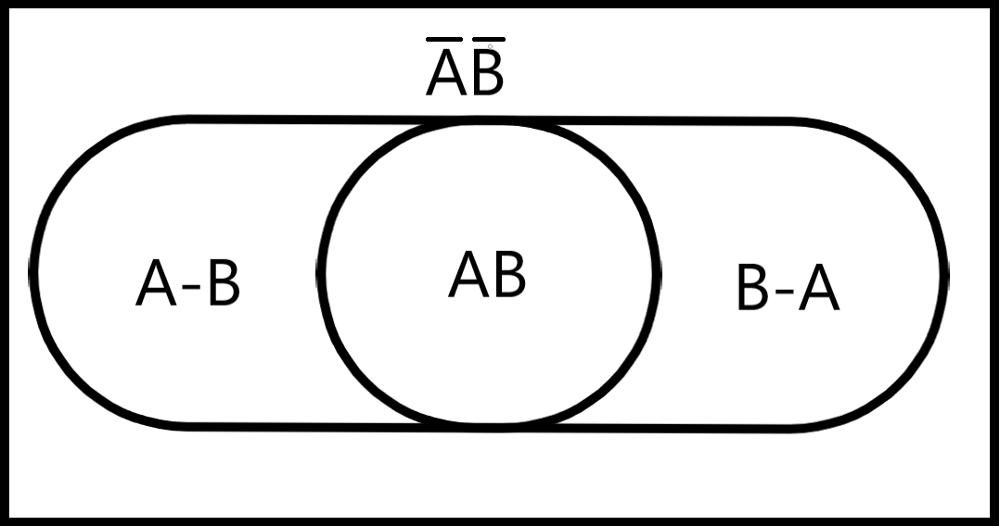
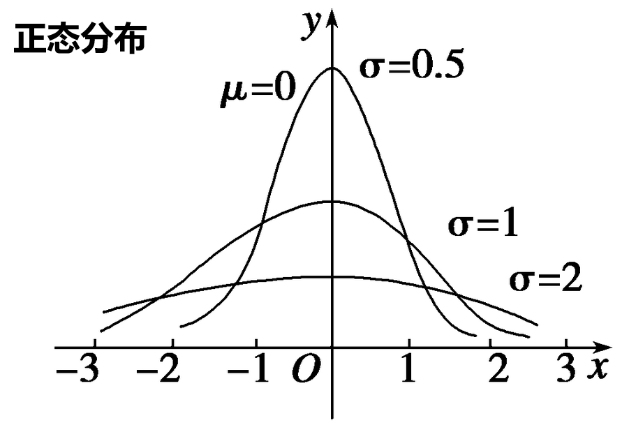
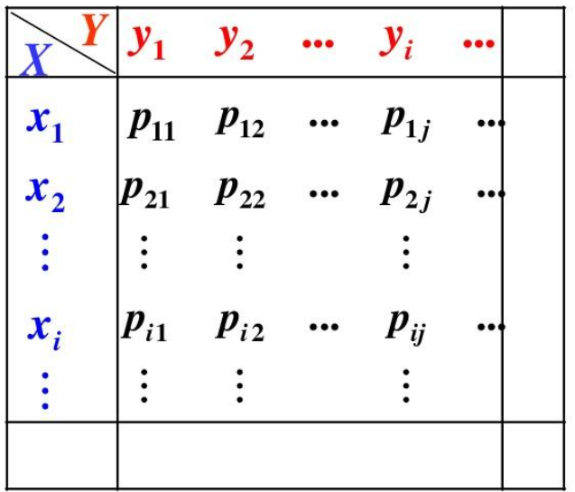
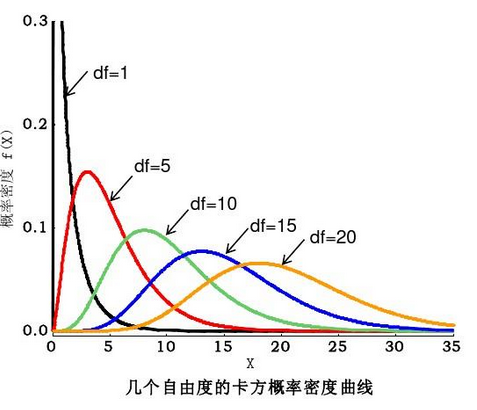
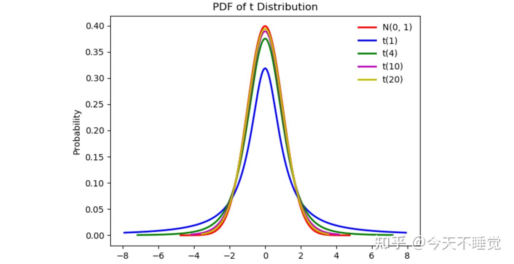
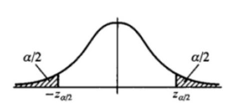

# 随机事件

## 概念

$$
随机实验指满足以下条件的\textbf{试验}:①事先知道试验的一切可能结果②事先无法得知某次试验的结果③试验可以在相同条件下重复进行 \hfill \\
随机事件:\textbf{随机试验}的一个\textbf{可能结果},简称事件.不可再分的事件称为\textbf{基本事件},由若干基本事件组成的称为\textbf{复合事件} \hfill \\
样本空间:某个随机试验的所有\textbf{可能产生的结果}构成的集合,记为\Omega  \hfill \\
必然事件:必然发生的事件,记为\Omega \hfill \\
不可能事件:不可能发生的事件,记为\varnothing  \hfill\\
\\
注:基本事件和复合事件的概念比较模糊,样本空间中的元素既可能是基本事件,也可能是复合事件. \hfill \\
关键是,样本空间中的元素必须是\textbf{一个试验结果},即仅凭该元素本身能够完整描述试验的结果 \hfill \\
$$

## 随机事件的关系

$$
A发生且B发生: A \cap B(或AB)\quad  A发生或B发生: A \cup B (或A+B)\quad A不发生:\overline{A}=\Omega-A \hfill \\
A发生而B不发生:A-B=A\cap \overline{B} \quad A和B有且仅有一个发生(对称差):A \Delta B=(A-B)\cup(B-A) \hfill \\
注:以上运算与布尔代数有类似的性质 \hfill \\
\\
A与B总是同时发生或同时不发生:A与B等价,记为 A=B \hfill \\
A必然发生:A = \Omega \quad A不可能发生:A=\varnothing \hfill \\
A发生,则B必然发生:B包含A,记为A \subset B \quad \hfill \\
A与B不可能同时发生:A与B互斥(不相容),记为AB = \varnothing \quad (注意:P(AB)=0不能推出AB=\varnothing) \hfill \\
A与B必然有且只有一个发生:A与B互逆,记为A= \overline{B} \quad A=\overline{B} \Leftrightarrow AB=\varnothing,A+B=\Omega \quad 互逆\Rightarrow 互斥 \hfill \\
\\
有事件序列\{A_n\}: \hfill \\
①事件序列的极限:l=\lim_{n\rightarrow \infty}A_n \hfill \\
②若总有A_n \subset A_{n+1},A_n为单调递增序列(后一项总是包含前一项),且l=\bigcup_{i=1}^\infty A_n \hfill \\
③若总有A_n \supset A_{n+1},A_n为单调递减序列(前一项总是包含后一项),且l=\bigcap_{i=1}^\infty A_n \hfill \\
$$

**事件不能理解为以基本事件为元素的集合，而应该理解为韦恩图上的区域**

## 事件的概率

*常用公式已体现在上面的两张图中,不再重复列出*

## 条件概率

$$
B已经发生的前提下,A发生的概率,称为A在B发生的条件下的条件概率,记为P(A|B) \hfill \\
P(A|B)=\frac{P(AB)}{P(B)} \Rightarrow P(AB)=P(A|B)P(B)=P(B|A)P(A) \hfill \\
P(A|B)可以理解为:取出韦恩图中B发生的部分,将其视为全集,然后求A发生的部分在其中的占比 \hfill \\
若\{A_1,A_2,...A_n\}是\Omega的一个\textbf{划分}(不重复,不遗漏): \hfill \\
①P(B)=\sum_{i=1}^nP(B|A_i)P(A_i) \quad (分类讨论) \hfill \\
②P(A_i|B)=\frac{P(B|A_i)P(A_i)}{\sum\limits_{k=1}^n P(B|A_k)P(A_k)} \quad (B发生时A_i发生=\frac{B和A_i同时发生(条件概率公式)}{B发生(分类讨论)}) \hfill \\
\\
若P(AB)=P(A)P(B),称A与B\textbf{独立} \quad (P(A)=0或1 \Rightarrow A与一切事件独立)  \hfill \\ 
P(B)>0且P(A|B)=P(A)\Leftrightarrow  A与B独立 \Leftrightarrow \overline{A}与B独立 \Leftrightarrow A与\overline{B}独立 \Leftrightarrow \overline{A}与\overline{B}独立 \hfill \\
0<P(A)<1且P(A|B)=P(A|\overline{B}) \Leftrightarrow A与B独立 \hfill \\
A与B独立可以理解为:A发生的概率不因B发生与否而改变,即韦恩图上AB在B中的占比等于A在全集中的占比 \hfill \\
A_1,A_2,A_3独立指\textbf{两两独立},如果还满足P(A_1A_2A_3)=P(A_1)P(A_2)P(A_3),称A_1A_2A_3\textbf{相互独立} \hfill \\
注意:|(条件概率)是优先级最低的运算符 \hfill \\
$$

- 证明不独立十分容易，找反例即可

## 题型：条件概率

$$
10件产品中有4件不合格,从中随机取两件,已知有一件不合格,求另一件也不合格的概率: \hfill \\
记A=第一件合格,B=第二件合格,则要求的概率为P(\overline{A}\overline{B}|\overline{A}+\overline{B})=\frac{1}{5} \hfill \\
$$

# 随机变量

## 概念

$$
有\textbf{函数}X(w),w为\textbf{随机事件},则称X为\textbf{随机变量} \hfill \\
如,抛一枚硬币,规定抛出正面为1,背面为0,则X(w)=
\begin{cases}
1 \quad w=抛出正面 \\
0 \quad w=抛出背面 \\ 
\end{cases} \hfill \\
\\
定义F_X(x)=P(X \le x),简写为F(x),称为X的\textbf{分布函数},具有以下性质: \hfill \\
①F(x)单调递增(不一定严格单调) \hfill \\
②F(x)\textbf{右连续,未必左连续} \hfill \\
③P(a<X\le b)=F(b)-F(a) \quad P(X<a)=F(a^-) \hfill \\
\\
F(x)连续时: \hfill \\
①P(X=k) \equiv 0,F(a^-)\equiv F(a) \hfill \\
②若\exists f(t),s.t. F(x)=\int_{-\infty}^{t}f(t) \mathrm dt,则X为\textbf{连续型随机变量},称f(t)为X的\textbf{概率密度函数} \hfill \\
注:f(x)不唯一,通常取f(x)=F'(x), 在有限个点改变f(x)的值不影响结果 \hfill \\
$$

## 离散型随机变量

$$
\mathrm C_m^n=\frac{n!}{m!(n-m)!} \quad \mathrm A_m^n=\frac{n!}{(n-m)!} \hfill \\
\\
两点分布: \hfill \\
P(X=k)=
\begin{cases}
p \quad k=1 \\
1-p \quad k=0 \\
\end{cases} \hfill \\
\\
二项分布:X \sim B(n,p) \quad 抽出黑球的概率为p,放回重抽,重复n次,X为抽出黑球的次数 \hfill \\
P(X=k)=\mathrm C_n^kp^k(1-p)^{n-k} \quad EX=np \quad DX=np(1-p) \hfill \\
\\
泊松分布:X \sim P(\lambda) \quad 放回重抽n次(n\textbf{充分大}),平均会抽出黑球\lambda次,X为抽出黑球的实际次数 \hfill \\
P(X=k)=\frac{\lambda^ke^{-\lambda}}{k!} \quad EX=\lambda \quad DX=\lambda \hfill \\
k=\lambda(\lambda非整数则向下取整)时,P(X=k)_{max} \hfill \\
若X,Y独立,X \sim P(\lambda_1),Y \sim P(\lambda_2),则X+Y \sim P(\lambda_1+\lambda_2) \hfill \\
实际上,泊松分布是二项分布在n充分大p充分小时的近似,P(X=k)=\lim_{n \rightarrow \infty} \mathrm C_n^k(\frac{\lambda}{n})^k(1-\frac{\lambda}{n})^{n-k}=\frac{\lambda^ke^{-\lambda}}{k!} \hfill \\
\\
超几何分布:X \sim H(n,M,N) \quad 共N个球,其中M个黑球,一次抽n个,X为抽出黑球的个数 \hfill \\
P(X=k)=\frac{\mathrm C_M^k \mathrm C_{N-M}^{n-k}}{\mathrm C_N^n} \quad EX=np \quad DX=np(1-p)\frac{N-n}{N-1} \quad (p=\frac{M}{N}) \hfill \\
\\
帕斯卡分布:X \sim NB(n,p) \quad 抽出黑球的概率为p,放回重抽,X为第n次抽出黑球时的已抽球次数 \hfill \\
P(X=k)=\mathrm C_{k-1}^{n-1}p(1-p)^{k-1} \quad EX=\frac{n}{p} \quad DX=\frac{n(1-p)}{p^2} \hfill \\
n=1时,称为几何分布,记为X \sim GE(p) \hfill \\
$$

## 连续型随机变量

$$
均匀分布:X \sim U(a,b) \hfill \\
f(x)=
\begin{cases}
\frac{1}{b-a} \quad a<x<b \\
0 \quad 其他 \hfill \\
\end{cases} 
\quad EX=\frac{a+b}{2} \quad DX=\frac{(a-b)^2}{12} \hfill \\
\\
指数分布:X \sim E(\lambda) \quad 每一瞬间,A有相同的概率死亡,平均死亡时间为\frac{1}{\lambda},X为实际死亡时间 \hfill \\
f(x)=
\begin{cases}
\lambda e^{-\lambda x} \quad x\ge 0 \\
0 \quad x<0 \hfill \\
\end{cases} 
\quad EX=\frac{1}{\lambda} \quad DX=\frac{1}{\lambda^2} \quad F(x)=
\begin{cases}
1-e^{-\lambda x} \quad x \le 0 \\
0 \quad x<0 \\
\end{cases}
\hfill \\
指数分布具有\textbf{无记忆性}:P(X>k)=P(X>k+c|X>c) \hfill \\
若X\sim P(\lambda_1),Y\sim P(\lambda_2),(X,Y)独立,则X+Y \sim P(\lambda_1+\lambda_2) \hfill \\
\\
正态分布:X \sim N(\mu,\sigma^2) \hfill \\
f(x)=\frac{1}{\sqrt{2\pi}\sigma}e^{-\frac{(x-\mu)^2}{2\sigma^2}} \quad EX=\mu \quad DX=\sigma^2
\quad EX^2 = \mu^2 + \sigma^2 \hfill \\
特别地,令Y=\frac{x-\mu}{\sigma},则Y\sim N(0,1),这一过程称为正态分布的\textbf{标准化} \hfill \\
若X\sim (\mu_1,\sigma_1^2),Y\sim (\mu_2,\sigma_2^2),X,Y独立,则X\pm Y \sim N(\mu_1\pm\mu_2,\sigma_1^2+\sigma_2^2) \hfill \\
(任意个\textbf{独立的}正态分布的线性组合依然为正态分布) \hfill \\
\\
标准正态分布:X \sim N(0,1) \hfill \\
标准正态分布的分布函数记为\Phi(x)=\frac{1}{\sqrt{2\pi}}\int_{-\infty}^xe^{-\frac{t^2}{2}} \mathrm dt \quad 概率密度函数记为:\phi(x)=\frac{1}{\sqrt{2\pi}}e^{-\frac{x^2}{2}} \hfill \\
将方程P(X>x)= \alpha的解记为u_\alpha,也称为\textbf{上侧分位点},则\Phi(u_\alpha)=1-\alpha\hfill \\
\\
\Gamma (\alpha)=\int_{0}^{+\infty} \frac{x^{\alpha-1}}{e^x} \mathrm dx (\alpha>0) \hfill \\
\Gamma(\alpha+1)=\alpha \Gamma(\alpha) \quad \Gamma(n+1)=n!(n为正整数) \hfill \\
\Gamma(\frac{1}{2}) = \sqrt{\pi} \quad \Gamma(1)=1 \quad \Gamma(2) =1 \quad \Gamma(3) =2 \hfill \\
$$

## 随机变量函数

$$
Y=g(X),X,Y为随机变量,则称g(X)为\textbf{随机变量函数} \hfill \\
对于离散型随机变量,已知g(X)和X的分布列,可以直接写出Y的分布列 \hfill \\
对于连续型随机变量X,以及Y=g(X): \hfill \\
①F_Y(y)=P(Y \le y)=P(g(X) \le Y)=\int_{g(x) \le y} f_X(x) \mathrm dx \hfill \\
②若Y=g(X)\textbf{严格单调},f_Y(y)=
\begin{cases}
f_X[g^{-1}(y)]|[g^{-1}(y)]'| \quad y在g(x)的值域内 \\
0 \quad y不在g(x)的值域内 \\
\end{cases} \hfill \\
$$

## 题型：随机变量

$$
X \sim N(0,1),Y=9X^2,求Y的概率密度函数: \hfill \\
y>0时: \hfill \\
F_Y(y)=P(Y \le y)=P(9X^2 \le y)=P(-\frac{\sqrt{y}}{3} \le X \le \frac{\sqrt{y}}{3}) 
=\int_{-\frac{\sqrt{y}}{3}}^\frac{\sqrt{y}}{3} \frac{1}{\sqrt{2\pi}}e^{-\frac{x^2}{2}} \mathrm dx=\frac{2}{\sqrt{2\pi}}\int_0^\frac{\sqrt{y}}{3} e^{-\frac{x^2}{2}} \mathrm dx \hfill \\
f_Y(y)=F_Y(y)'=(\frac{\sqrt{y}}{3})'\frac{2}{\sqrt{2\pi}}e^{-\frac{y}{18}}=\frac{1}{3\sqrt{2\pi y}}e^{-\frac{y}{18}} \hfill \\
y \le 0时:f_Y(y)=0 \hfill \\
\\
X \sim E(\lambda),Y=
\begin{cases}
X \quad |X| \le 1 \\
-X \quad |X| > 1 \\
\end{cases}
,求Y的分布函数: \hfill \\
F_Y(y)=P(Y \le y)=P(|X| \le 1,X \le y)+P(|X|>1,-X \le y) \hfill \\
=P(0 \le X \le 1,X \le y)+P(X>1,X \ge -y) \hfill \\
y\le-1时:F_Y(y)=0+P(X \ge -y)=1-F_X(-y)=e^{\lambda y} \hfill \\
-1<y\le 0时:F_Y(y)=P(X \ge 1)=1-F_X(1)=e^{-\lambda} \hfill \\
0 < y \le 1时:F_Y(y)=P(0\le X\le y)+P(X>1)=F_X(y)+1-F_X(1)=1-e^{\lambda x}+e^{-\lambda x} \hfill \\
y>1时:F_Y(y)=1 \hfill \\
$$

# 多维随机变量

## 概念

$$
有随机变量X,Y,称F(x,y)=P(X\le x,Y \le y)为(X,Y)的\textbf{联合分布函数} \hfill \\
称F_X(x)和F_y(y)为(X,Y)关于X和Y的\textbf{边缘分布函数} (边缘分布函数相当于一维随机变量的分布函数)\hfill \\
F(x,y)具有以下性质: \hfill \\
①F(x,y)关于x和y单调递增且右连续 \hfill \\
②F_X(x)=F(x,+\infty),F_Y(y)=F(+\infty,y) \hfill \\
$$

- 求多维随机变量的分布函数时，应当充分使用图像辅助

## 离散多维随机变量分布

$$
仍用分布列(二维表格)表示,记P(X=x_i,Y=y_i)=p_{ij} \hfill \\
p_{i\cdot}=\sum_j p_{ij} \quad p_{\cdot j}=\sum_i p_{ij} \quad 所有p_{i\cdot}构成X的边缘分布列,所有p_{\cdot j}构成Y的边缘分布列\hfill \\
离散变量条件分布:P(X=x_i|Y=y_i)=\frac{p_{ij}}{p_{\cdot j}} \hfill \\
$$

## 连续多维随机变量分布

$$
若X,Y为连续随机变量: \hfill \\
F(x,y)=\int_{-\infty}^x\int_{-\infty}^y f(u,v) \mathrm du \mathrm dv \hfill \\
f_X(x)=\int_{-\infty}^{\infty} f(x,y) \mathrm dy \quad f_Y(y)=\int_{-\infty}^{\infty} f(x,y) \mathrm dx \hfill\\
若F(x,y)的两个偏导数均存在,f(x,y)=\frac{\partial^2 F(x,y)}{\partial x\partial y}\hfill \\
\\
二维正态分布:(X,Y) \sim N(\mu_1,\mu_2,\sigma_1^2,\sigma_2^2,\rho) \quad |\rho|<1 \hfill \\
f(x,y)=\frac{1}{2\pi\sqrt{1-\rho^2}}\exp(\frac{u^2-2\rho uv+v^2}{2\rho^2-2}) \quad 其中u=\frac{x-\mu_1}{\sigma_1},v=\frac{y-\mu_2}{\sigma_2} \hfill \\
其中X \sim N(\mu_1,\sigma_1^2),Y \sim N(\mu_2,\sigma_2^2),且此时X与Y独立 \Leftrightarrow X与Y不相关 \Leftrightarrow \rho_{XY}=0 \hfill \\
X,Y独立且符合正态分布 \Rightarrow (X,Y) \sim N(\mu_1,\mu_2,\sigma_1^2,\sigma_2^2,0) \hfill \\
\\
连续变量条件分布:f(x,y)=f(x|y)f_Y(y)=f(y|x)f_X(x) \hfill \\
(X,Y)独立 \Leftrightarrow f(x|y)\equiv f_X(x),f(x,y)\equiv f_X(x)f_Y(y) \hfill \\
$$

## 随机变量的独立性

$$
与事件的独立性类似,若P(X=x_0,Y=y_0) \equiv P(X=x_0)P(Y=y_0),则称(X,Y)独立 \hfill \\
(X,Y)独立 \Rightarrow(g(X),h(Y))独立 \quad (g(X),h(Y))独立且g(X)和h(Y)的\textbf{反函数存在} \Rightarrow (X,Y)独立 \hfill \\
如:(X,Y)独立 \Leftrightarrow (X^3,Y^3)独立 \quad (X,Y)独立 \Rightarrow (X^2,Y^2)独立 \hfill \\
注意:即使(X,Y)不独立,依然可以在Y未确定时单独给出X的分布,相当于Y各种取值下的平均情况 \hfill \\
$$

## 多维随机变量函数

$$
Z=g(X,Y),X,Y,Z为随机变量,则称g(X,Y)为\textbf{二维随机变量函数},函数的输出依然是\textbf{一维随机变量} \hfill \\
若X,Y,Z为离散随机变量,直接根据分布列求Z的分布列即可 \hfill \\
\\
若X,Y,Z为连续随机变量: \hfill \\
1)Z=X+Y \hfill \\
F_Z(z)=\iint\limits_{x+y \le z}f(x,y) \mathrm dx \mathrm dy \hfill \\
f_Z(z)=\int_{-\infty}^{+\infty}f(x,z-x) \mathrm dx =\int_{-\infty}^{+\infty}f(z-y,y) \mathrm dy \hfill \\
特别地,如果X,Y独立,f_Z(z)=f_X*f_Y \quad (卷积,注意是z的函数) \hfill \\

\\
2)Z=\frac{X}{Y} \hfill \\
F_Z(z)=\iint\limits_{\frac{x}{y} \le z}f(x,y) \mathrm dx \mathrm dy=\iint\limits_{y>0,x\le yz}f(x,y) \mathrm dx \mathrm dy +\iint\limits_{y<0,x\ge yz}f(x,y) \mathrm dx \mathrm dy \hfill \\
f_Z(z)=\int_{-\infty}^{+\infty}|y|f(yz,y) \mathrm dy \hfill \\
\\
3)Z=\max\{X,Y\}(X,Y独立) \hfill \\
F_Z(z)=F_X(z)F_Y(z) \hfill \\
\\
4)Z=\min\{X,Y\}(X,Y独立)  \hfill \\
F_Z(z)=1-[1-F_X(z)][1-F_Y(z	)] \hfill \\
\\
5)一般情形 \hfill \\
根据定义写出F_Z(z),然后求导得出f_Z(z) \hfill \\
$$

## 题型：多维随机变量

$$
X_i \sim 
\left(
\begin{array}
\ -1 & 0 & 1 \\
\frac{1}{4} & \frac{1}{2} & \frac{1}{4}
\end{array}
\right)(i=1,2),且P(X_1X_2=0)=1,求P(X_1=X_2): \hfill \\
易得P(X_1=0,X_2=0)=1-2P(X_1=-1)-2P(X_1=1)=0 \quad (画表格) \hfill \\
\\
f(x,y)=
\begin{cases}
cxe^{-x(y+1)} \quad x>0,y>0 \\
0 \quad 其他
\end{cases},Z=\max\{X,Y\},判断X,Y是否独立,并求F_Z(z) \hfill \\
F(+\infty,+\infty)=1 \Rightarrow \frac{1}{c}=\iint\limits_{x>0,y>0} xe^{-x(y+1)} \mathrm dx \mathrm dy=\int_0^{+\infty} xe^{-x} \mathrm dx \int_0^{+\infty} e^{-xy} \mathrm dy=1 \Rightarrow c=1 \hfill \\
f_{XY}(1,1)=e^{-2},f_X(1)=\int_0^{+\infty}e^{-(y+1)} \mathrm dy=e^{-1},f_Y(1)=\int_0^{+\infty}xe^{-2x} \mathrm dx=\frac{1}{4} \hfill \\
\Rightarrow f_{XY}(1,1)\ne f_X(1)f_Y(1) \Rightarrow (X,Y)不独立 \quad (确定不独立时,找反例而不是证明恒等式不成立) \hfill \\
F_Z(z)=\iint\limits_{x \le z,y \le z}f(x,y) \mathrm dx\mathrm dy
=
\begin{cases}
1-e^{-z}+\frac{e^{-z(z+1)}-1}{z+1} \quad z \le 0 \\
0 \quad z<0 \\
\end{cases} \hfill \\
\\
F(x,y)=
\begin{cases}
1-e^{2x}-e^{-3y}+e^{-2x-3y} \quad x>0,y>0 \\
0 \quad 其他 \\
\end{cases}
,求P(\max\{X,Y\}>1):\hfill \\
原式=1-P(X<1,Y<1) \hfill \\
F_X(x)=F(x,+\infty)=1-e^{-2x} \quad F_Y(y)=F(+\infty,y)=1-e^{-3y} \hfill \\
F_X(x)F_Y(y)=F(x,y) \Rightarrow X,Y独立 \Rightarrow 原式=1-F_X(1)F_Y(1)=e^{-2}+e^{-3}-e^{-5} \hfill \\
\\
X \sim N(0,1),X=x时,Y \sim N(x,1),求\rho_{XY}: \hfill \\
由题意得:f(x)=\frac{1}{\sqrt{2\pi}}e^\frac{-x^2}{2},f(y|x)=\frac{1}{\sqrt{2\pi}}e^\frac{-(x-y)^2}{2} 
\Rightarrow f(x,y)=f(y|x)f(x)=\frac{1}{\sqrt{2\pi}}e^{-x^2+xy-\frac{y^2}{2}} \hfill \\
\Rightarrow (X,Y) 符合二维正态分布,\rho_{XY}=\frac{\sqrt 2}{2} \hfill \\
\\
X_1,X_2,X_3相互独立,X_1,X_2\sim N(0,1),P(X_3=0)=P(X_3=1)=\frac{1}{2},Y=X_3X_1+(1-X_3)X_2, \hfill \\
求(X_1,Y)的分布函数,用标准正态分布\Phi(x)表示: \hfill \\
F(x,y)=P(X_1 \le x,Y \le y)=\frac{1}{2}P(X_1 \le x,X_1 \le y)+\frac{1}{2}P(X_1\le x,X_2 \le y) 
=\frac{1}{2}\Phi(x)\Phi(y)+\frac{1}{2} \Phi(\min\{x,y\}) \hfill \\
\\
(X,Y)在D:0<x<1,x^2<y<\sqrt x上服从均匀分布,U=\begin{cases}1 \quad X \le Y \\ 0 \quad X > Y \end{cases},Z=U+X,求F_Z(z): \hfill \\
F_Z(z)=P(U+X \le z)=P(X \le Y,X \le z)+P(X>Y,X+1 \le z) ,: X \in(0,1) \hfill \\
①z \le 0时,F_Z(z)=0 \hfill \\
②z \ge 2时,F_Z(z)=1 \hfill \\
③0 < z < 1时,F_Z(z)=P(X \le y,X \le z)=\frac{3}{2}z^2 -z^3 \quad (画图,二重积分)  \hfill \\
④1 \ge z < 2时,F_Z(z)=P(X \le y)+P(X \le Y,X \le z-1)=\frac{1}{2}+2(z-1)^{3/2}-\frac{3}{2}(z-1)^2 \hfill \\
$$

- 给定二维分布时，先判断是否独立，独立有时能简化运算
- 多段/多区域函数先进行分类讨论，有助于简化运算

# 数字特征

## 数学期望

$$
离散型随机变量: \hfill \\
EX=\sum_i x_ip_i \quad (此数列必须\textbf{绝对}收敛,期望才存在) \hfill \\
E[g(X)]=\sum_i g(x_i)p_i \hfill \\
E[g(X,Y)]=\sum_i \sum_j g(x_i,y_j)p_{ij} \hfill \\
E(X|Y=y_i)=\sum_i x_i \frac{p_{ij}}{p_{\cdot j}} \quad (y_i不确定,所以这是一个关于y_i的函数,而不是一个常数) \hfill \\
注:上式中,X可以替换为g(X),将等式右边的x_i替换为g(x_i)即可 \hfill \\
\\
连续型随机变量: \hfill \\
EX=\int_{-\infty}^{+\infty}xf(x)\mathrm dx \quad (此积分必须\textbf{绝对}收敛,期望才存在) \hfill \\
E[g(X)]=\int_{-\infty}^{+\infty}g(x)f(x)\mathrm dx \hfill \\
E[g(X,Y)]=\int_{-\infty}^{+\infty}\int_{-\infty}^{+\infty}g(x,y)f(x,y)\mathrm dx \mathrm dy \hfill \\
E(X|Y=y)=\int_{-\infty}^{+\infty}xf_{X|Y}(x|y) \mathrm dx =\int_{-\infty}^{+\infty}x \frac{f(x,y)}{f_Y(y)} \mathrm dx \quad (y不确定,所以这是一个关于y的函数,而不是一个常数) \hfill \\
注:上式中,X可以替换为g(X),将等式右边的x替换为g(x)即可 \hfill \\
\\
数学期望的性质: \hfill \\
①E(aX+b)=aEX+b \quad (更复杂的函数参见上方) \hfill \\
②E(X+Y)=EX+EY \hfill \\
③若X,Y独立,EXY=EX\cdot EY且\forall y,有E(X|Y=y) \equiv EX \hfill \\
④\mathrm {Cauchy-Shwarz}不等式:[EXY]^2 \le EX^2 EY^2 \hfill \\
⑤E[E(X|Y)]=EX \quad (E(X|Y)是与Y有关的随机变量) \hfill \\
$$

## 方差

$$
方差:DX=E(X-EX)^2=EX^2-(EX)^2 \hfill \\
注:EX是常数,随机变量减去常数后依然为随机变量 \hfill \\
\\
方差的性质: \hfill \\
①D(aX+b)=a^2DX \hfill \\
②D(X\pm Y)=DX+DY \pm 2\mathrm{Cov}(X,Y) \hfill \\
③DX \le E(X-C)^2,C=EX时取等号 \hfill \\
④DY=E(D(Y|X))+D(E(Y|X)) \hfill \\
⑤若X,Y独立D(XY)=DXDY+DX(EY)^2+DY(EX)^2 \hfill \\
$$

## 协方差

$$
协方差:\mathrm{Cov}(X,Y)=E[(X-EX)(Y-EY)]=EXY-EX\cdot EY \hfill \\
\\
协方差的性质: \hfill \\
①\mathrm{Cov}(aX,bY)=ab\mathrm{Cov}(Y,X) \hfill \\
②\mathrm{Cov}(X,Y)=\mathrm{Cov}(Y,X) \quad \mathrm{Cov}(X_1+X_2,Y)=\mathrm{Cov}(X_1,Y)+\mathrm{Cov}(X_2,Y) \hfill \\
②(X,Y)独立 \Rightarrow (X,Y)\textbf{不相关} \Leftrightarrow \mathrm{Cov}(X,Y)=0 \Leftrightarrow D(X+Y)=DX+DY \hfill \\
④\mathrm{Cov}(X,X)=DX,\rho_{XX}=1 \hfill \\ 
\\
相关系数:\rho_{XY}=\frac{\mathrm{Cov}(X,Y)}{\sqrt{DX\cdot DY}} \quad (|\rho_{XY}| \le 1) \hfill \\
\rho>0,\rho=0,\rho<0时,分别称为负相关,不相关,正相关(|\rho_{XY}|越接近1,XY越接近线性相关) \hfill \\
|\rho|=1 \Leftrightarrow \exists 常数a,b,s.t. P(Y=aX+b) =1 \hfill \\
$$

## 矩

$$
\textbf{k阶原点矩}:\nu_k=EX^k \quad \textbf{k阶原点绝对矩}:\alpha_k=E|X|^k \hfill \\
\textbf{k阶中心矩}:\mu_k=E(X-EX)^k \quad \textbf{k阶中心绝对矩}:\beta_k=\mu_k=E|X-EX|^k \hfill \\
偏度:SX=\frac{\mu_3}{\mu_2^{3/2}} \quad 峰度:KX=\frac{\mu_4}{\mu_2^2}-3 \hfill \\
\\
若X \sim N(\mu,\sigma ^2):
\mu_k=
\begin{cases}
\sigma^k(k-1)!! \quad (k为偶数) \\
0 \quad (k为奇数) \\
\end{cases} 
\quad SX=0 \quad KX=0 \hfill \\
$$

## 题型：数字特征

$$
F(x)=0.4\Phi(2x-1)+0.6\Phi(\frac{x}{2}-1),求EX^2: \hfill \\
f(x)=0.8\phi(2x-1)+0.3\phi(\frac{x}{2}-1) \hfill \\
EX^2=0.8\int_{-\infty}^{+\infty}x^2\phi(2x-1)\mathrm dx+0.3\int_{-\infty}^{{+\infty}}x^2\phi(\frac{x}{2}-1) \mathrm dx=\frac{5}{\sqrt{2\pi}}\int_0^{+\infty}(x^2+1)e^{-\frac{x^2}{2}} \mathrm dx= \hfill \\
\xlongequal{t=\frac{x^2}{2}} \frac{5}{\sqrt{2\pi}}\int_0^\infty (2t+1)e^{-t} \frac{1}{\sqrt{2t}} \mathrm dt 
=\frac{5}{\sqrt{\pi}}\Gamma(\frac{3}{2})+\frac{5}{2\sqrt{\pi}}\Gamma(\frac{1}{2})=5 \hfill \\
\\
X,Y独立,DX=4DY,U=3X+2Y,V=3X-2Y,求\rho_{UV}: \hfill \\
\mathrm{Cov}(U,V)=9\mathrm{Cov}(X,X)-6\mathrm{Cov}(X,Y)+6\mathrm{Cov}(X,Y)-4\mathrm{Cov}(Y,Y)=32DY \hfill \\
易得:DU=DV=40DY \Rightarrow \rho_{UV}=\frac{32DY}{\sqrt{DU\cdot DV}}=\frac{4}{5} \hfill \\
\\
X_1 \cdots X_n 独立且服从N(0,1),Y_i=X_i-\overline{X_i},求\mathrm {Cov}(Y_1,Y_n): \hfill \\
\mathrm {Cov}(Y_1,Y_n)=\mathrm {Cov}(X_1-\overline{X},X_n-\overline{X})
=\mathrm{Cov}(X_1,X_n)-\mathrm{Cov}(X_1,\overline{X})-\mathrm{Cov}(X_n,\overline{X})+\mathrm{Cov}(\overline{X},\overline{X}) \hfill \\
=D\overline{X}-2\mathrm{Cov}(X_1,\overline{X})
=\frac{1}{n}-2\mathrm{Cov}(X_1,\frac{1}{n}X_1) \quad(只有重合项有协方差)=\frac{1}{n}-\frac{2}{n}DX_1=-\frac{1}{n}
\hfill \\
\\
n封信,随机地发给n个收信者,X为收到自己的信的人数,求DX: \hfill \\
设U_i=
\begin{cases}
1 \quad 第i个人收到了自己的信 \\
0 \quad 第i个人没有收到自己的信 \\
\end{cases}
\quad 易得:EU_i=\frac{1}{n},DU_i=\frac{1}{n}-\frac{1}{n^2} \hfill \\
DX=D(\sum_{i=1}^n U_i)=\sum_{i=1}^n DU_i+2\sum_{i<j}\mathrm {Cov}(U_i,U_j) \hfill \\
易得:E(U_iU_j)=\frac{1}{n(n-1)} \quad (i \ne j) \Rightarrow \mathrm {Cov}(U_i,U_j)=\frac{1}{n^2(n-1)} \hfill \Rightarrow DX=1 \hfill \\
\\
X的概率密度函数为f(x)=\frac{4x^2}{a^3\sqrt{\pi}}e^{-\frac{x^2}{a^2}} (x \ge 0),求DX: \hfill \\
EX^2=\int_0^\infty x^2f(x) \mathrm dx \xlongequal{t=\frac{x^2}{a^2}} 
\frac{2a^2}{\sqrt{\pi}}\int_0^\infty t^{3/2}e^{-t} \mathrm dt=
\frac{2a^2}{\sqrt{\pi}} \Gamma(\frac{5}{2})=\frac{3a^2}{2} \hfill \\
EX=\int_0^\infty xf(x) \mathrm dx \xlongequal{t=\frac{x^2}{a^2}} 
\frac{2a}{\sqrt{\pi}}\int_0^\infty te^{-t} \mathrm dt=\frac{2a}{\sqrt{\pi}}\Gamma(2)=\frac{2a}{\sqrt{\pi}} \hfill \\
DX=EX^2-(EX)^2=\frac{3a^2}{2}-\frac{4a^2}{\pi} \hfill \\
注:若非必要,不要试图求未知参数,某些情况下,未知参数的取值不可确定的 \hfill \\
$$

# 大数定律与中心极限定理

## 大数定律

$$
f(x) \xrightarrow[x\rightarrow x_0]{P} a \Leftrightarrow \forall \varepsilon>0,有\lim_{x\rightarrow x_0}P(|f(x)-a|<\varepsilon)=0 \hfill \\
\\
有n个随机变量\{X_n\},及其平均值\overline{X_N},若\exists a,s.t. \overline{X_n} \xrightarrow[n\rightarrow\infty]{P} a,则称\{X_n\}符合\textbf{大数定律}\hfill \\
\\
\mathrm{Chebshev}大数定律: \hfill \\
若\{X_n\}有相同的期望\mu和方差,且\textbf{互不相关}(不需要独立),则\overline{X_n} \xrightarrow[n\rightarrow\infty]{P} \mu \quad \hfill \\
\mathrm{Chebshev}不等式: \hfill \\
\forall \varepsilon>0,有P(|X-\mu|\ge \varepsilon) \le \frac{\sigma^2}{\varepsilon^2} \hfill \\
注:使用\mathrm{Chebshev}不等式估算时,把不等号改成等号 \hfill \\
\\
\mathrm{Khinchin}大数定律: \hfill \\
若\{X_n\}\textbf{独立同分布},则\overline{X_n} \xrightarrow[n\rightarrow\infty]{P} \mu \hfill \\
注:\mathrm{Chebshev}大数定律要求方差存在,而\mathrm{Khinchin}大数定律则不要求,所以后者并不是前者的弱化 \hfill \\
\\
\mathrm{Bernoulli}大数定律: \hfill \\
记n_A为n次\textbf{独立重复试验}中事件A发生的次数,每次试验中A发生的概率为p,则\forall \varepsilon>0 ,有\frac{n_A}{n}\xrightarrow[n\rightarrow\infty]{P} p \hfill \\
$$

## 中心极限定理

$$
\{X_n\}为一系列\textbf{独立同分布}随机变量,记S_n=\sum_{i=1}^n X_n,Y_n=\frac{S_n-ES_n}{\sqrt{DS_n}} \hfill \\
则n充分大时: \hfill \\
S_n \overset{近似}{\sim} N(n\mu,n\sigma^2) \quad 
Y_n=\frac{S_n-n\mu}{\sigma\sqrt{n}} \overset{近似}{\sim} N(0,1) \hfill \\
P(S_n \le x)=P(Y_n \le \frac{x-n\mu}{\sigma\sqrt{n}}) \approx \Phi(\frac{x-n\mu}{\sigma\sqrt{n}})  \hfill \\
\\
若X \sim B(n,p),n充分大时,X \overset{近似}{\sim} N(np,np(1-p)) \hfill \\
注:将二项分布近似成泊松分布要求n较大,p较小;而近似成正态分布要求n充分大 \hfill \\
$$

- 大量**独立同分布随机变量**的和、平均数，以及符合**二项分布的**随机变量都可以近似成正态分布

## 题型：大数定律和中心极限定理

$$
有36个灯泡,使用寿命X \sim E(0.01),每当一个灯泡损坏,立即替换下一个,记它们工作的总时间为Y,用中心极限定理估算P(X>4200): \hfill \\
易得:EX=100,DX=10000 \Rightarrow Y \overset{近似}{\sim} N(3600,36000) \hfill \\
设T=\frac{Y-3600}{600},则T \overset{近似}{\sim} N(0,1) 
\Rightarrow P(Y>4200)=P(T>1) \approx 1- \Phi(1)=0.1587 \hfill \\
\\
\mathbf X_n 的概率密度为f_n(x)=\frac{n}{\pi(1+n^2x^2)},证明:
$$

# 数理统计

## 概念

$$
从若干个体构成的总体中抽取一个个体,\textbf{随机且独立地}抽取若干个个体,抽出的个体称为\textbf{样本} \hfill \\
观察其特征,结果称为\textbf{观测值};每个样本的\textbf{观测值}可以视为随机变量 \hfill \\
可以将抽样的结果记为\{X_1,X_2,...X_n\},这些随机变量是\textbf{独立同分布}的 \hfill \\
F(x_1,x_2,...,x_n)=\prod_{i=1}^n F(x_i) \quad f(x_1,x_2,...,x_n)=\prod_{i=1}^n f(x_i) \hfill \\
\\
理论分布:\textbf{任意一个样本的实际分布},理论分布函数记为F(x) \hfill \\
经验分布:由\textbf{抽样结果推测出的任意一个样本的分布},经验分布函数记为F_n(x) \hfill \\
将一次抽样的观测值记为(x_1,x_2,...,x_n),不妨假设些观测值已经从小到大排好 \hfill \\
则经验分布列:P_n(X=x_i)=\frac{1}{n} \quad F_n(x)=
\begin{cases}
0 \quad x<x_0 \\
\frac{k}{n} \quad x_k \le x < x_{k+1} \\
1 \quad x \ge x_{k+1} \\
\end{cases} \hfill \\
F_n(x) \xrightarrow[n\rightarrow \infty]{P} F(x) \hfill \\
\\
统计量:值完全由样本决定的表达式(不包含未知数,不能为常数) \hfill \\
样本均值:\overline{X}=\frac{1}{n}\sum_{i=1}^n X_i \quad 样本方差:S^2=\frac{1}{\textbf{n-1}}\sum_{i=1}^n(X_i-\overline{X})^2=\frac{1}{\textbf{n-1}}(\sum_{i=1}^nX_i^2-n\overline{X}^2) \hfill \\
样本k阶原点矩:A_k=\frac{1}{n}\sum_{i=1}^n X_i^k \quad 样本k阶中心矩:B_k=\frac{1}{n}\sum_{i=1}^n (X_i-\overline{X})^k \hfill \\
注意:B_2= \frac{n-1}{n} S^2=A_2-A_1^2 \hfill \\
E\overline{X}=EX \quad D\overline{X}=\frac{DX}{n} \quad ES^2=DX \hfill \\
$$

## 抽样分布

$$
\chi^2分布:\chi^2\sim \chi^2(n) \hfill \\
若X\sim N(0,1),\chi^2=X_1^2+...+X_n^2,则\chi^2 \sim \chi^2(n) \hfill \\
E\chi^2=n \quad D\chi^2=2n \hfill \\
n=2时,\chi^2 \sim E(\frac{1}{2}) \hfill \\
将方程P(\chi^2>x)=\alpha的解记为\chi^2_\alpha \hfill \\
n充分大时,\chi^2 \sim N(n,2n) \hfill \\
\\
t分布:T \sim t(n) \hfill \\
若X\sim N(0,1),Y\sim\chi^2(n),(X,Y)独立,记T=\frac{X}{\sqrt{Y/n}},则T \sim t(n) \hfill \\
ET=0 \quad DT =\frac{n}{n-2} \hfill \\
n充分大时,T \sim N(0,1) \hfill \\
\\
F分布:F \sim F(n_1,n_2) \hfill \\
若X\sim \chi^2(n_1),Y\sim \chi^2(n_2),记F=\frac{X/n_1}{Y/n_2},则F \sim F(n_1,n_2) \hfill \\
$$

## 正态总体下的抽样分布

$$
S^2=\frac{1}{\textbf{n-1}}\sum_{i=1}^n(X_i-\overline{X})^2=\frac{1}{\textbf{n-1}}(\sum_{i=1}^nX_i^2-n\overline{X}^2) \hfill \\
A_k=\frac{1}{n}\sum_{i=1}^n X_i^k \quad B_k=\frac{1}{n}\sum_{i=1}^n (X_i-\overline{X})^k \hfill \\
\\
注:t_n符合特定分布的随机变量,t(n)表示随机变量的分布,t_\alpha(n)表示上侧分位点 \hfill \\
X \sim N(0,1),有样本\{X_1,X_2,...X_n\}: \quad (\textbf{总是优先构造标准正态分布}) \hfill \\
\\
\overline{X} 和S^2 独立,\overline{X} \sim N(0,\frac{1}{n}) \hfill \\
\chi^2_n=\sum_{i=1}^n X_i^2 \quad \chi^2_n \sim \chi^2(n) \hfill \\
\chi'^2_n=\sum_{i=1}^n (X_i-\overline{X})^2=(n-1)S^2 \quad \chi'^2_n \sim \chi^2(\textbf{n-1}) \hfill \\
A,B独立,A \sim \chi^2(n_1),B \sim \chi^2(n_2) \Rightarrow A+B \sim \chi^2(n_1+n_2) \quad (A,B的样本未必相同) \hfill \\
\\
t_n=\frac{X}{\sqrt{\chi^2_n/n}} \quad t_n\sim t(n) \quad t_\alpha(n) =t_{1-\alpha}(n) \hfill \\
t'_n=\frac{\overline{X}}{\sqrt{S^2/n}} \quad t'_n \sim t(\textbf{n-1}) \hfill \\
\\
F_{n_1,n_2}=\frac{\chi^2_{n_1}/n_1}{\chi^2_{n_2}/n_2} \quad F_{n_1,n_2} \sim F(n_1,n_2)
\quad F_\alpha(n_1,n_2)=\frac{1}{F_{1-\alpha}(n_2,n_1)}\hfill \\
t_n^2=\frac{X^2}{\chi^2_n/n}=F_{1,n} \quad t'^2_n=\frac{\overline{X}^2}{S^2/n}=F_{1,n-1} \hfill \\
\\
若X \sim N(0,\sigma_1),有样本\{X_1,X_2,...X_n\},Y \sim N(0,\sigma_2),有样本\{Y_1,Y_2,...Y_n\}: \hfill \\
\frac{\overline{X}-\overline{Y}}{\sqrt{\frac{\sigma_1^2}{n_1}+\frac{\sigma_2^2}{n_2}}} \sim N(0,1) \hfill \\
\frac{S_1^2/\sigma_1^2}{S_2^2/\sigma_2^2} \sim F(n_1-1,n_2-1) \hfill \\
$$

## 题型：抽样分布

$$
X \sim N(\mu_1,\sigma^2),Y\sim N(\mu_2,\sigma^2),其样本均值、样本方差分别为\overline{X},\overline{Y},S_1^2,S_2^2, \hfill \\
A^2=\frac{(n_1-1)S_1^2+(n_2-1)S_2^2}{n_1+n_2-2},B=\frac{\overline{X}-\overline{Y}-\mu_1+\mu_2}{A}\sqrt{\frac{n_1n_2}{n_1+n_2}},求B的分布: \hfill \\
令U=\frac{X-\mu_1}{\sigma},V=\frac{Y-\mu_2}{\sigma},其样本方差为S_3^2,S_4^2,则U \sim N(0,1),\overline{U}=\frac{\overline{X}-\mu_1}{\sigma},S_3^2=\frac{S_1^2}{\sigma^2} \quad (V同理) \hfill \\
A^2=\sigma^2\frac{(n_1-1)S_3^2+(n_2-1)S_4^2}{n_1+n_2-2}
=\sigma^2\frac{\chi^2_{n_1-1}+\chi^2_{n_2-1}}{n_1+n_2-2}
=\sigma^2\frac{\chi^2_{n_1+n_2-2}}{n_1+n_2-2} \hfill \\
B=\sigma \frac{\overline{U}-\overline{V}}{A\sqrt{\frac{\sigma^2}{n_1}+\frac{\sigma^2}{n_2}}}
=\frac{N}{\sqrt{\chi^2_{n_1+n_2-2}/(n_1+n_2-2)}} \Rightarrow B \sim t(n_2+n_1-2) \hfill \\
\\
X \sim N(\mu,\sigma^2),有简单随机样本\{X_1,...X_{2n}\},令T=\sum_{i=1}^n(X_i+X_{n+i}-2\overline{X})^2,求ET,DT: \hfill \\
令Y=X_i+X_{n+i},则Y \sim N(2\mu,2\sigma^2),\overline{Y}=2\overline{X},其样本方差为S^2_1 \hfill \\
令U=\frac{Y-2\mu}{\sqrt 2\sigma},其样本方差为S^2_2,则U \sim N(0,1),\overline{U}=\frac{\overline{Y}-2\mu}{\sqrt2 \sigma},S^2_2=\frac{S_1^2}{2\sigma^2} \hfill \\
故T=\sum_{i=1}^n(Y-\overline{Y})^2=(n-1)S_1^2=2\sigma^2(n-1)S^2_2=2\sigma^2\chi^2(n-1) 
\Rightarrow ET=2\sigma^2(n-1),DT=8\sigma^4(n-1) \hfill \\
\\
X \sim N(0,1),有简单随机样本\{X_1,...X_{m+n}\},求\frac{1}{m}(\sum_{i=1}^m X_i)^2+\frac{1}{n}(\sum_{i=m+1}^{m+n} X_i^2)服从的分布: \hfill \\
X \sim N(0,1) \Rightarrow \sum_{i=1}^m X_i \sim N(0,m) \Rightarrow \frac{\sum\limits_{i=1}^m X_i}{\sqrt{n}} \sim N(0,1) \Rightarrow \frac{1}{m}(\sum_{i=1}^m X_i)^2 \sim \chi^2(1) \hfill \\
同理得:\frac{1}{n}(\sum_{i=m+1}^{m+n} X_i^2) \sim N(0,1),且两者相互独立 \Rightarrow \frac{1}{m}(\sum_{i=1}^m X_i)^2+\frac{1}{n}(\sum_{i=m+1}^{m+n} X_i^2) \sim \chi^2(2) \hfill \\
$$

- 抽样分布只有有限的三种，容易猜测，主要是确定系数

# 参数估计

## 概念

$$
要确定某个随机变量的分布,先猜想其分布类型,然后通过样本确定分布中未定的参数 \hfill \\
待估参数记为\theta(向量),其所有可能取值构成的向量空间记为 \Theta \hfill \\
注意:估计的依据有时候说成样本(X_1,X_2,...),有时候说成样本观测值(x_1,x_2,...),这无关紧要 \hfill \\
$$

## 点估计

$$
对参数的估计的结果是具体的(若干个)值,记为\hat{\theta} \hfill \\
另外,估计的数学期望记为\hat{\mu},估计的方差记为\hat{\sigma^2} \hfill \\
$$

### 矩估计法

$$
k阶原点矩:\nu_k=EX^k(由常量和待定参数构成的表达式) \quad 样本k阶原点矩:A_k=\frac{1}{n}\sum_{i=1}^n X_i^k (结果确定后,便为常量) \hfill \\
如果待定参数有t个,就取t个方程,求解的结果即\hat{\theta} \hfill \\
如果求期望/方差,则直接得\hat{\mu}=A_1,\hat{\sigma^2}=A_2-A_1^2=B_2 \hfill \\
$$

### 极大似然估计法

$$
调整待定参数,使得理论抽样结果与已得到的一组观测值恰好相同的可能性最大,求出这种情况的参数 \hfill \\
有似然函数L(\theta),求L(\theta)的极大值点(有多个待定参数时,L为多元函数),该点即\hat{\theta} \hfill \\
离散型:L(\theta)=\prod_{i=1}^n P(X=x_i) \quad (n为样本数,不是待定参数) \hfill \\
连续型:L(\theta)=\prod_{i=1}^n f(x_i) \hfill \\
确定极大值点时,除了求\frac{\mathrm d L}{\mathrm d\theta},还可以求\frac{\mathrm d \ln L}{\mathrm d\theta} \hfill \\
$$

### 估计量的评选标准

$$
无偏性: \hfill \\
\theta和\hat{\theta}表示任意一个待估参数(或向量)及其估计值,若E(\hat{\theta})=\theta,则称\hat{\theta}是\textbf{无偏的} \hfill \\
矩估计法和极大似然估计法均满足:\hat{\mu}=\overline{X}(无偏),\hat{\sigma^2}=B_2(有偏,\hat{\sigma^2}=S^2才无偏) \hfill \\
\\
有效性: \hfill \\
\hat{\theta_1}和\hat{\theta_2}均为\theta的估计值,若D\hat{\theta_1}<D\hat{\theta_2},则称\hat{\theta_1}较\hat{\theta_2}\textbf{有效} \hfill \\
若\hat{\theta_0}无偏,且\forall 无偏估计量\hat{\theta},有\hat{\theta_0}<D\hat{\theta},则称\hat{\theta_0}为\textbf{最小方差无偏估计量},\textbf{或最优无偏估计量} \hfill \\
\\
一致性: \hfill \\
若\hat{\theta} \xrightarrow[n\rightarrow \infty]{P} \theta (n是用于计算\hat{\theta}的样本个数),则称\hat{\theta}是\theta的\textbf{一致估计量} \hfill \\
矩估计量必然是一致估计量,极大似然估计则需要满足一定条件 \hfill \\
$$

### 题型：点估计

$$
X\sim U(a,b),a,b待定,有样本\{X_1,X_2,...,X_n\},求a,b的矩估计量: \hfill \\
\nu_1=EX=\frac{a+b}{2} \quad \nu_2=EX^2=\frac{1}{b-a}\int_a^b x^2 \mathrm dx =\frac{1}{3}(a^2+ab+b^2) \hfill \\
令
\begin{cases}
\nu_1=A_1 \\
\nu_2=A_2 \\
\end{cases},解得
\begin{cases}
\hat{a}=A_1-\sqrt{3B_2} \\
\hat{b}=A_1+\sqrt{3B_2} \\
\end{cases} \hfill \\
\\
某零件的使用寿命为X,f(x)=
\begin{cases}
2e^{-2(x-\theta)} \quad x>\theta \\
0 \quad x\le \theta \\
\end{cases},有样本观测值\{x_1,x_2,...,x_n\},求\theta的最大似然估计值: \hfill \\
L(\theta)=\prod_{i=1}^n f(x_i)=
\begin{cases}
2^ne^{-2\sum\limits_{i=1}^n(x-\theta)} \quad x_i>\theta \\
0 \quad 其他 \\
\end{cases} \hfill \\
\forall 1\le i \le n,x_i>\theta时,L(\theta)=2^ne^{-2\sum\limits_{i=1}^n(x-\theta)} \quad 显然,L(\theta)随\theta增大而增大 \hfill \\
又因为\forall 1\le i \le n,x_i>\theta,故\hat{\theta}=\min\{x_1,x_2,...,x_n\} \hfill \\
\\
有总体X和简单样本\{X_n\},f(x)=
\begin{cases}
(\theta+1)x^\theta \quad 0<x<1 \\
0 \quad 其他 \\
\end{cases},\theta>-1.分别求\theta的矩估计量和极大似然估计量: \hfill \\
矩估计: \hfill \\
\nu_1=EX=\int_0^1 (\theta+1)x^{\theta+1} \mathrm dx=\frac{\theta+1}{\theta+2} \quad A_1=\overline{X} \hfill \\
故\frac{\hat{\theta}+1}{\hat{\theta}+2}=\overline{X} \Rightarrow \hat{\theta}=\frac{2\overline{X}-1}{1-\overline{X}} \hfill \\
极大似然估计: \hfill \\
L(\theta)=(\theta+1)^n(\prod_{i=1}^nx_i)^{\theta} \Rightarrow \ln L(\theta)=n \ln(\theta+1)+\theta n \overline{X} \hfill \\
故\frac{\mathrm d\ln L(\hat{\theta})}{\mathrm d \theta} =0 \Rightarrow 0=\frac{1}{\hat{\theta}+1}+\overline{X} \Rightarrow \hat{\theta}=-1-\frac{1}{\overline{X}} \hfill \\
$$

## 区间估计

$$
估计的结果是一个区间,以及一个置信概率,记为P(\underline{\theta}<\theta<\overline{\theta})=1-\alpha,称(\underline{\theta},\overline{\theta})是\theta的\textbf{置信水平}为1-\alpha的\textbf{置信区间} \hfill \\
置信水平固定时,置信区间不固定;其中,长度最小的一个置信区间最优 \hfill \\
$$

### 正态分布的区间估计

| 条件              | 置信区间                            | b                                                 | k                         |
| ----------------- | ----------------------------------- | ------------------------------------------------- | ------------------------- |
| $\sigma已知求\mu$ | $(\overline{X}-kb,\overline{X}+kb)$ | $u_{\alpha/2}$                                    | $\frac{\sigma}{\sqrt{n}}$ |
| $\sigma未知求\mu$ | $(\overline{X}-kb,\overline{X}+kb)$ | $t_{\alpha/2}(n-1)$                               | $\frac{s}{\sqrt{n}}$      |
| $求\sigma^2$      | $((n-1)S^2/b_1,(n-1)S^2/b_2)$       | $\chi^2_{\alpha/2}(n-1),\chi^2_{1-\alpha/2}(n-1)$ |                           |

### 题型：区间估计

$$
X \sim N(\mu,\sigma^2),\sigma^2已知,\mu未知,样本容量为16且置信度为0.95时,置信区间的最小长度为0.588,求\sigma: \hfill \\
易得:0.294=\frac{\sigma}{\sqrt{16}}u_{0.025},u_{0.025}=1.96 \Rightarrow \sigma=0.6 \hfill \\
$$

# 假设检验

## 概念

$$
基本步骤: \hfill \\
1.给定假设H_0,备择假设为H_1 \hfill \\
2.用样本构造统计量T,并假定一个风险水平\alpha \hfill \\ 
3.在H_0成立的前提下,求T的置信度为1-\alpha的置信区间(T的选择参考区间估计) \hfill \\
3.若假设中的量位于置信区间内,接受H_0,否则拒绝H_0 \hfill \\
\\
置信区间以外的部分即\textbf{拒绝域};风险水平越小,拒绝域越小,越难拒绝H_0(拒绝越有说服力) \hfill \\
拒绝H_0但H_0为真为\textbf{第一类错误},接受H_0但H_0为假为\textbf{第二类错误} \hfill \\
已知被检验量的值和风险水平(置信区间)时,才能计算犯错概率;此时已知H_0的真假,故两种错误中只有一种可能发生 \hfill \\
例如,已知H_0为真,则只可能犯第一类错误,故直接求被检验量落在拒绝域的概率即可 \hfill \\
$$

## 题型：假设检验

$$
X \sim N(\mu,0.01),对X抽样,得到10个样本观测值,\overline{x}=10.05,能否认为\mu=10(\alpha=0.05)? \hfill \\
则\mu的置信度为0.95的置信区间为\left(\overline{X}-\frac{0.1}{\sqrt{10}}u_{0.025},\overline{X}+\frac{0.1}{\sqrt{10}}u_{0.025}\right) =(9.988,10.112) \hfill \\
故能认为\mu=10 \hfill \\
$$
