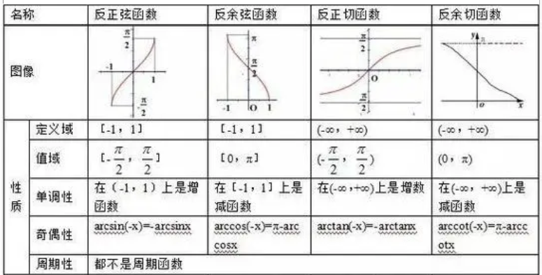

# 前置

## 三角函数

$$
\sec x = \frac{1}{\cos x} \quad \csc x = \frac{1}{\sin x} \quad \sec^2x - \tan^2x = 1 \quad  \hfill \\
\arccos x + \arcsin x = \frac{\pi}{2} \quad \arctan x = \arcsin \frac{x}{\sqrt{1+x^2}} \quad \arctan x + arccot \ x = \frac{\pi}{2}  \hfill \\
\sinh x = \frac {e^{x} - e^{-x}}{2} \quad \cosh x = \frac {e^{x} + e^{-x}}{2} \quad \cosh ^2 x - \sinh^2 x =1  \hfill 
$$

## 四元数

$$
四元数:\mathbf q = q_0+\mathbf v_q =q_0+q_1\mathbf i+q_2\mathbf j+q_3\mathbf k(q_0,q_1,q_2,q_3为实数) \quad 共轭四元数:\mathbf q^* = q_0-\mathbf v_q \hfill \\
四元数的二范数:|\mathbf q|= (q_0^2+|\mathbf v_q|^2)^{\frac{1}{2}} = \sqrt{q^2_0+q_1^2+q_2^2+q_3^2}\hfill \\
\mathbf p \cdot \mathbf q= q_0p_0+q_1p_1+q_2p_2+q_3p_3 \quad (类似向量点乘) \hfill  \\
\mathbf p \times \mathbf q= \mathbf v_p \times \mathbf v_q = (p_2q_3-p_3q_2)\mathbf i+(p_3q_1-p_1q_3)\mathbf j+(p_1q_2-p_2q_1) \mathbf k \quad (类似向量叉乘) \hfill \\
\mathbf p \mathbf q = (p_0q_0 - \mathbf v_1 \cdot \mathbf v_2) +(p_0 \mathbf v_2 + q_0 \mathbf v_1 + \mathbf v_1 \times \mathbf v_2) \quad (默认乘法,没有乘号或点号) \hfill \\
\mathbf q^{-1} =\frac{\mathbf q^*}{|\mathbf q|^2}, \mathbf q_1 \mathbf q_2 = \mathbf q_3 \Leftrightarrow \mathbf q_2 = \mathbf q_1^{-1} \mathbf q_3 \hfill \\
绕轴旋转\theta:\mathbf q = (\cos \frac{\theta}{2},\sin\frac{\theta}{2}\mathbf v_q)且|\mathbf q|=1,\mathbf v的三个分量即表示转轴的(x,y,z) \hfill  \\
$$

- 四元数乘法不满足交换律

## 重要不等式

$$
\mathrm{Cauchy}不等式:\sum_{i=1}^n a_i^2 \sum_{i=1}^n b_i^2 \ge (\sum_{i=1}^na_ib_i)^2 \hfill \\
ab+cd \le \sqrt{(a^2+c^2)(b^2+d^2)} \hfill \\
\int_a^b f(x)^2 \mathrm dx\int_a^b g(x)^2 \mathrm dx \ge \left[\int_a^b f(x)g(x) \mathrm dx \right]^2 \hfill \\
$$

- **基本不等式有多种变形（乘-除，加-减，平方-开方）**

# 函数

## 函数与映射

$$
有非空集合X,Y和对应法则f.若\forall x \in X,根据f,有唯一的y\in Y与之对应,那么f是X到Y的映射,记为f:X \rightarrow Y \hfill \\
称y是x的像,x是y的原像 \hfill \\
也称f是一元函数,x是自变量,y是因变量 \hfill \\
将所有x可能的值的集合称为定义域,记为D_f,D_f=X,将所有y可能的值的集合称为值域,记为R_f,R_f \subseteq Y \hfill \\
\\
满射:R_f=Y \hfill \\
单射:\forall x_1 \neq x_2,有f(x_1) \neq f(x_2) \hfill \\
逆映射:f:X \rightarrow Y为单射,则逆映射为f^{-1}:R_f \rightarrow X \hfill \\
复合映射:f:D_f \rightarrow Y,g:D_g \rightarrow Z \hfill,R_f \subseteq D_g,则存在g \circ f:D_f \rightarrow Z  \quad (g \circ f 相当于g[f(x)])\hfill \\
$$

## 函数的性质

$$
\exist k,s.t. f(x) \leq k,则k为f(x)的上界 \hfill \\
\exist M,s.t. |f(x)| \leq M,则f(x)是有界的 \hfill \\
\exist l>0,s.t.f(x)=f(x+l),则l为f(x)的周期 \hfill \\
反函数:若y=f(x)对应单射,则\exist y=g(x),s.t. x=g(y) \Leftrightarrow y=f(x),那么g(x)为f(x)的反函数,记为f^{-1}(x) \hfill \\
$$

- 函数的自变量和因变量互换，仍为同一个函数

# 极限与连续性

## 数列的极限

$$
x_n为数列,若\exist a,s.t.\exist N,s.t.\forall n \gt N,有|x_n-a| < \varepsilon(\varepsilon为任意小的正数,n,N为正整数,即n充分大时),\\
则称n \rightarrow \infty 时,x_n趋于(收敛于)a,x_n的极限为a,记为\lim_{n\rightarrow \infty} x_n = a \hfill \\
\\
\{x_n\}收敛 \Leftrightarrow \forall \varepsilon > 0,\exist N,s.t.m>N,n>N时|x_n-x_m|<\varepsilon(m,n,N为正整数) \hfill \\
$$

- **收敛：n充分大时，数列趋近于某个值**
- **有界：数列的上界和下界均存在（上界≠上确界，任何恒大于数列的数都是上界）**
- 对于数列，**收敛是有界的充分不必要条件**（$(-1)^n$有界但不收敛），**单调有界是收敛的充分不必要条件**
- 数列收敛等价于数列的一切子数列收敛（子数列：从原数列中取出**无穷多的**部分项）

## 题型：数列的极限

$$
正项数列\{x_n\}满足x_{n+1}+\frac{1}{x_n} <2,证明\lim_{x\rightarrow \infty}x_n存在,并求其值: \hfill \\
(反证法或不等式)易得:0<x_{n+1} < x_n < x_1 \Rightarrow {x_n}收敛,即\lim_{x\rightarrow \infty}x_n存在 \hfill \\
设A=\lim_{x\rightarrow \infty}x_n,则A+\frac{1}{A} \le 2 \Rightarrow A=1 \hfill \\
$$

## 函数的极限

$$
域:(a,b)是a的左邻域,是b的右邻域;\forall r > 0,(a-r,a+r)是a的邻域,邻域中去掉a点为去心邻域,记为\mathring{N}(a,r) \hfill \\
若\forall \varepsilon>0,\exist r > 0,s.t. \forall x \in \mathring{N}(a,r),有|f(x)-l|<\varepsilon,则\lim_{x \rightarrow a} f(x)=l \hfill \\
若\forall \varepsilon>0,\exist r > 0,s.t. \forall x \in (a,a+r),有|f(x)-l|<\varepsilon,则\lim_{x \rightarrow a^+} f(x)=l \hfill \\
若\forall \varepsilon>0,\exist r > 0,s.t. \forall x \in (a-r,a),有|f(x)-l|<\varepsilon,则\lim_{x \rightarrow a^-} f(x)=l \hfill \\
\lim_{x \rightarrow a} f(x)=l \Leftrightarrow \lim_{x \rightarrow a^+} f(x)= \lim_{x \rightarrow a^-} f(x)=l \quad 极限存在 \Leftrightarrow 左右极限存在且相等\hfill \\
\\
函数与数列极限的关系(出现n\rightarrow \infty时,默认n为正整数): \hfill \\
a_n=\frac{1}{n\pi},f(x)=\sin x\Rightarrow \lim_{n\rightarrow \infty} a_n=0, \lim_{n\rightarrow \infty}f(a_n)=0,但\lim_{x \rightarrow 0} f(x)不存在\quad (\textbf{重要反例})\hfill \\
a_n\equiv0,f(x)=\frac{\sin x}{x} \Rightarrow \lim_{n \rightarrow \infty} a_n=0,\lim_{x\rightarrow 0}f(x)=1,但\lim_{n \rightarrow \infty}f(a_n)不存在 \quad (\textbf{重要反例})\hfill \\
\lim_{x\rightarrow + \infty} f(x)=a \Rightarrow \lim_{n\rightarrow \infty} f(n)=a \hfill \\
\lim_{n\rightarrow \infty} f(n)=a且\textbf{x充分大时f(x)单调} \Rightarrow \lim_{x\rightarrow +\infty} f(x)=a \quad (\textbf{单调排除了函数值跳动的情况})\hfill \\
$$

- **收敛：对于函数，只能说函数在某点收敛，即函数在某点极限存在**
- **有界：函数的上界和下界均存在（上界≠上确界，任何恒大于数列的数都是上界）**
- **若函数在a有极限，则函数在a的某些去心邻域上有界（反之不然）**
- **函数的极限和数列的极限不能等同（一个是离散，一个连续）**

$$
保号性: \lim_{x \rightarrow a}f(x)>0 \Rightarrow f(a)>0 \quad f(a) \ge 0 \Rightarrow \lim_{x \rightarrow a}f(a) \ge 0 (右边必须取等号,可以用反证法排除) \hfill \\
推论: \lim_{x\rightarrow a}f(x)=A \Rightarrow f(x)=A+o(x),o(x)为未知函数,满足\lim_{x\rightarrow a}o(x)=0 \hfill \\
夹逼定理:若\lim_{n \rightarrow a} f(x) 
= \lim_{n \rightarrow a} g(x) = l,a的某个去心邻域内,f(x) \le h(x) \le g(x),则\lim_{n \rightarrow a} h(x) = l \hfill \\
若f(x)在(a,b)上连续,则f(a^-),f(b^+)存在 \Leftrightarrow f(x)在(a,b)上\textbf{有界} \quad (a,b分别可以取-\infty,+\infty) \hfill \\
$$

- **保号性通常用于证明函数在某点取极小值或极大值**
- **有界性问题通常可以转化为单侧极限是否存在的问题**
- 极限的各种运算均可以拆分/合并/交换/结合（但每个部分的极限必须存在，且整个式子必须同时取极限）

## 无穷大与无穷小

$$
\alpha,\beta均为无穷小:\hfill \\
高阶无穷小:\lim \frac{\beta}{\alpha} = 0,记为\beta = o(\alpha) \hfill \\
同阶无穷小:\lim \frac{\beta}{\alpha} = C \quad 等价无穷小:\lim \frac{\beta}{\alpha} = 1 \hfill,记为\beta \sim \alpha \\
$$

- 有限值/有界函数与无穷小的积为无穷小
- 无穷大和无穷小有符号（0没有符号），但有时无法确定符号
- 无穷大与高阶无穷大相加减时，无穷大可忽略；无穷小类似

## 特殊极限

$$
若\lim_{x \rightarrow a} \frac{f(x)}{g(x)} 的结果是\frac{0}{0}/\frac{\infty}{\infty}型,且f(x)和g(x)在a处可导,则\lim_{x \rightarrow a} \frac{f(x)}{g(x)} = \lim_{x \rightarrow a} \frac{f'(x)}{g'(x)}\hfill \\
(1+A)^B =e^{AB} \quad (A \rightarrow 0,B \rightarrow \infty) \quad
\lim_{n \rightarrow \infty}(1+\frac{1}{n})^n\sim e-\frac{e}{2n} \hfill \\
\lim_{n\rightarrow +\infty} \left(\sum_{i=1}^n a_n \right)^{\frac{1}{n}}= \max\{a_1,a_2,...,a_n\} \hfill \\
$$

## 题型：求极限/等价无穷小

$$
\alpha=\int_0^{\arctan^2x } f(t) \mathrm dt,\beta=\int_0^{x-\ln(1+x)}\frac{f(t)}{\ln(1+t)}\mathrm dt,f(0)=0,f'(0)=0,f''(0)=2,求\lim_{x\rightarrow 0^+}\frac{\alpha}{\beta}的等价无穷小: \hfill \\
f(x)=f(0)+f'(0)x+\frac{f''(0)x^2}{2}+L=x^2+L \quad (L为拉格朗日余项) \Rightarrow f(x) \sim x^2 \hfill \\
\lim_{x\rightarrow 0^+}\frac{\alpha}{\beta}
=\lim_{x\rightarrow 0^+}\frac{\int_0^{x^2 } t^2 \mathrm dt}{\int_0^{\frac{x^2}{2}}t\mathrm dt}
=\frac{3x^2}{8}
\hfill \\
\\
求\lim_{x\rightarrow \infty}\sqrt[n]{\prod_{k=1}^n\left(1+\frac{k^2}{n^2} \right)}: (利用指数)\hfill \\
\\
求\lim_{n \rightarrow \infty}\frac{1}{\sqrt[n] n}\sum_{i=1}^n \frac{i}{n+\ln i}: (n+\ln i放缩成n和n+\ln n) 
\hfill \\
\\
求\lim_{x\rightarrow 0}\frac{(1+x)^{\frac{2}{x}}-e^2}{x^2}: \hfill \\
原式=\lim_{x\rightarrow 0}\frac{e^{{ \frac{2\ln(1+x)}{x}}}  -e^2}{x^2}
=\lim_{x\rightarrow 0}\frac{f'(2)(\frac{2\ln(1+x)}{x}-2)}{x^2},其中f(x)=e^x \Rightarrow 原式=-e^2 \hfill \\
\\
\lim_{x\rightarrow +\infty}f(x)存在,f(x)=\frac{x^{1+x}}{(1+x)^x}-\frac{x}{e}+2 \lim_{x\rightarrow +\infty} f(x),求\lim_{x\rightarrow +\infty}f(x): \hfill \\
设C=\lim_{x\rightarrow +\infty}f(x),则C= \lim_{x\rightarrow \infty} \left[\frac{x^{1+x}}{(1+x)^x}-\frac{x}{e} \right]+2C \Rightarrow C =\lim_{x\rightarrow \infty} \left[\frac{x}{e} -\frac{x}{e-e/2x}\right] =-\frac{1}{2e} \hfill \\
\\
f(x)在x=0处连续,\lim_{x\rightarrow 0}\frac{e^{f(x)}-\cos x+\sin x}{x}=0,求f'(0): \hfill \\
f'(0)=\lim_{x\rightarrow x}\frac{f(x)-f(0)}{x} \hfill \\
设\frac{e^{f(x)}-\cos x+\sin x}{x}=o(x),其中\lim_{x\rightarrow 0}o(x)=0 
\Rightarrow f(x)= \ln [o(x)x+\cos x- \sin x],f(0)=0 \hfill \\
\Rightarrow f'(0)=\frac{\ln [o(x)x+\cos x- \sin x]}{x}=1 \hfill \\
\\
求\lim_{n\rightarrow \infty} \sum_{i=0}^n \frac{n}{n^2+1+i^2}: \hfill \\
原式=\frac{1}{n} \lim_{n\rightarrow \infty} \sum_{i=0}^n \frac{1}{1+\frac{i^2+1}{n^2}},其中\frac{i^2}{n^2}<\frac{i^2+1}{n^2}<\frac{(i+1)^2}{n^2} (无法直接放缩,变形后放缩,再使用积分定义) \hfill \\
$$

- **及时提取常数和相当于常数的表达式**
- 洛必达法则（**灵活判断哪些地方可以直接等价无穷小代换，代换要深入到哪一步**）
- 泰勒展开（**如果函数未知，但题目给出了函数的各阶导数，可以用泰勒展开求函数的等价无穷小**）
- 微分中值定理（**函数在极小范围内的导数近似不变，本质上是忽略高阶无穷小**）
- 极限保号性的推论（**常用于含极限的方程**）
- 整体代换
- 夹逼定理（下面列举了适合用夹逼定理的情况，除此之外的情况考虑积分定义或级数求和）：
  - n项和，每一项中出现了“高阶不变量+低阶变化量”，那么低阶变化量就是放缩的对象
  - 根式，根式内有多个不同阶的量

- 套用积分的定义（出现$\frac{i}{n}$形时）
- 利用指数和对数变形

## 连续性

$$
若f(x_0) = \lim_{x \rightarrow x_0}f(x),则f(x)在x_0连续,其中\lim_{x \rightarrow x_0}f(x) = \lim_{\Delta x \rightarrow 0} f(x_0+\Delta x) \hfill \\
若f(x_0) = \lim_{x \rightarrow x_0^-}f(x),则,则f(x)在x_0左连续 \hfill \\
若f(x_0) = \lim_{x \rightarrow x_0^+}f(x),则,则f(x)在x_0右连续 \hfill \\
\\
介值定理:若f(x)在[a,b]上连续,\forall C介于f(a)和f(b)之间,\exist \xi \in (a,b),s.t.f(\xi)=C \hfill \\
$$

- **连续点：左极限、右极限、函数值均存在且相等**
- **间断点：不连续的点（如果已经确定一个点是间断点，那么函数值不影响间断点的判断）**
  - **第一类间断点：左右极限均存在的间断点**
    - **可去间断点：左右极限相等**
    - **跳跃间断点：左右极限不等**

  - **第二类间断点：左右极限至少一个不存在的间断点**

- 连续函数经加减乘除（分母不为0）/代换/取反函数（仅限单射），依然连续

- 闭区间上的连续函数必然有最大值和最小值

## 题型：判断间断点

$$
f(x)=\lim_{n\rightarrow \infty}\frac{x^2+(x-1)^{2n}}{2+x(x-1)^{2n}},求f(x)的间断点,并分类: \hfill \\
\lim_{x\rightarrow 0^-}f(x)=\lim_{x\rightarrow 0^-}\frac{1}{x}=-\infty \Rightarrow x=0是第二类间断点 \hfill \\
\lim_{x\rightarrow 2^+}f(x)=\lim_{x\rightarrow 2^+}\frac{1}{x}=\frac{1}{2} \quad \lim_{x\rightarrow 2^-}f(x)=\lim_{x\rightarrow 2^-}\frac{x^2}{2}=2 \Rightarrow x=2是第二类间断点 \hfill \\
$$

# 导数

$$
f(x)在x_0的某个邻域内有定义,则f'(x_0)=\lim_{\Delta x \rightarrow 0}\frac{f(x_0+\Delta x)-f(x_0)}{\Delta x}=\lim_{x \rightarrow x_0} \frac{f(x)-f(x_0)}{x-x_0} \hfill \\
右导数: f_+'(x_0)=\lim_{x \rightarrow x_0^+} \frac{f(x)-f(x_0)}{x-x_0} \quad 左导数: f_-'(x_0)=\lim_{x \rightarrow x_0^-} \frac{f(x)-f(x_0)}{x-x_0} \hfill \\
若 f_+'(x_0)=f'_-(x_0),f(x_0)= f_+'(x_0);否则f(x_0)不存在 \hfill \\
f(x)在x_0处可导 \Leftrightarrow f'(x_0)存在 \Leftrightarrow f'_+(x_0)=f'_-(x_0) \hfill \\
f'(x)在x_0连续 \Rightarrow f'(x_0)=\lim_{x\rightarrow x_0}f'(x) \quad(\lim_{x\rightarrow x_0^+}f'(x)=\lim_{x\rightarrow x_0^-}f'(x)时,\lim_{x\rightarrow x_0}f'(x)存在) \hfill \\
\\
f'(x_0)和\lim_{x\rightarrow x_0}f'(x)\textbf{是不同的式子,前者才是导数,而后者与导数连续性有关}  \hfill \\
\\
\forall x_1<x_2,有f(x_1)<f(x_2) \Rightarrow f(x)单调递增 \hfill \\
若f(x)可导,则f(x)单调递增 \Leftrightarrow f'(x) \ge 0且f'(x)=0的点不存在或不连续 \hfill \\
$$

- 导数也是一种极限，而且是**从正负两个方向、以任意方式趋向于一个值**

$$
(\tan x)' = \sec^2 x \quad \hfill (\cot x)' = -(\csc x)^2 \quad (\sec x)' = \sec x \tan x \quad (\csc x)' =  -\csc x \cot x \hfill \\
(\arcsin x)' = \frac{1}{\sqrt{1-x^2}} \quad (\arctan x)' = \frac{1}{1+x^2} \hfill \\
(\frac{1}{x+b})' = \frac{(-1)^n n!}{(x+b)^{n+1}}(x的系数不为1时，提取系数即可) \hfill \\
\\
y'=y(\ln |y|)' \quad \hfill \\
若x=f(y)在I上单调增或单调减且可导(f'(y) \ne 0),则I上\frac{\mathrm d y}{\mathrm d x} = \frac{1}{\frac{\mathrm d x}{\mathrm d y}},即[f^{-1}(x)]' = \frac{1}{f'(y)} \hfill \\
如:y=\sqrt{x}(x>0)是x=y^2(x>0)的反函数,f'(y)=2y,则[f^{-1}(x)]'= \frac{1}{2y}=\frac{1}{2\sqrt{x}} \hfill \\
$$

- 运用反函数求导法则时，**自变量和因变量中途不能互换**

$$
x=f(t),y=g(t):\hfill \\
\frac{\mathrm dy}{\mathrm dx} = \frac{\mathrm dy/ \mathrm dt}{\mathrm dx/ \mathrm dt} \quad \frac{\mathrm d^2y}{\mathrm dx^2} = \frac{\mathrm d\frac{\mathrm dy}{\mathrm dx}}{\mathrm dx} = \frac{\mathrm d\frac{\mathrm dy}{\mathrm dx}/\mathrm dt}{\mathrm dx/ \mathrm dt}(\frac{\mathrm dy}{\mathrm dx}上一步已求出) \hfill \\
$$

## 微分

$$
若y=f(x)在x_0处有\Delta y = A\Delta x + o(\Delta x)(A必须与\Delta x无关),则y在x_0处可微,微分\mathrm dy = A \Delta x \hfill \\
f(x)在x_0处可微 \Leftrightarrow f(x)在x_0处导数存在;此时\mathrm dy = A \Delta x 可改为 \mathrm dy = f'(x_0) \mathrm d x \hfill \\
\mathrm d^2x=\mathrm d(\mathrm dx) \quad \mathrm dx^2= (\mathrm dx)^2 \quad \mathrm d(x^2)=2x \mathrm dx \hfill \\
$$

- 微分是增量忽略高阶小量后得到的结果
- 将微分应用到近似运算时，Δx不需要趋于0，可能是一个很小的常数

## 曲率

$$
曲率:K=|\frac{\Delta \alpha}{\Delta s}| \quad \Delta \alpha:角度变化量(可以用切线与坐标轴成的角为基准) \quad \Delta s:弧长变化量(沿弧线移动的距离) \hfill \\
\mathrm ds = \sqrt{1+y'^2} \mathrm dx  \quad \mathrm d\alpha=\frac{y''}{1+y'} \mathrm dx \quad K=\frac{|y''|}{(1+y'^2)^{\frac{3}{2}}} \hfill \\
s = \int \sqrt{1+y'^2} \mathrm dx = \int \sqrt{x'^2(t)+y'^2(t)} \mathrm dt(参数方程)=\int\sqrt{\rho^2(\theta)+\rho'^2(\theta)}\mathrm d\theta (极坐标) \hfill \\
$$

## 几何意义

$$
严格单调递增:某区间上始终有f'(x) \ge 0,且f'(x)=0的点不构成区间 \hfill \\
凹函数:若\forall \alpha,\beta \in [a,b] (\alpha < \beta),0<t<1,总有f(Lerp(\alpha,\beta,t)) \le Lerp(f(\alpha),f(\beta),t),则f(x)在(a,b)上为凹函数 \hfill \\
若f(x)在某区间上二阶可导且f''(x) \ge 0,则f(x)在该区间上为凹函数 \hfill \\
\\
拐点:f(x)在x_0处连续,x_0左右两侧函数凹凸性相反,则x_0为函数的拐点.若函数三阶可导,拐点满足f''(0)=0,f'''(0) \ne 0 \hfill \\
驻点:导数为0的点 \hfill \\
受检点:所有的驻点和不可导(导数不存在)点.极值点必然为受检点或边界点 \hfill \\
可导点不可能同时为极值点和拐点 \hfill \\
若f(x)=(x-a)^{n}g(x),n>1,g(x)为多项式函数,g(a) \ne 0,则n为偶数 \Rightarrow a为极值点,n为奇数 \Rightarrow a为拐点 \hfill \\
\\
渐近线:记曲线y=f(x)上一点到直线L的距离为d,若\lim_{x^2+y^2 \rightarrow +\infty} d=0,L是y=f(x)的渐近线 \hfill \\
斜渐近线:若\lim_{x\rightarrow \infty}\frac{y}{x} = k,\lim_{x\rightarrow \infty}(y-kx)=b,斜渐近线为y=kx+b(注意无穷有正负,一个种类的渐近线可能有两条,下同) \hfill \\
若f(x) \sim kx+b+o(x),其中\lim_{x\rightarrow \infty}o(x)=0,那么y=kx+b是y=f(x)的一条斜渐近线 \hfill \\
水平渐近线:若\lim_{x\rightarrow \infty} y = c,水平渐近线为y=c \hfill \\
竖直渐近线:若\lim_{y\rightarrow \infty} x = c,竖直渐近线为x=c \hfill \\
$$

## 题型：连续/可导/可微/极限存在

$$
\textbf{导数连续} \Rightarrow \textbf{可导} \Rightarrow \textbf{左右导数存在} \Rightarrow \textbf{连续} \hfill \\
\textbf{某点的邻域内可导} \Rightarrow \textbf{该点可导(反之不然)} \quad \textbf{某点的邻域内连续} \Rightarrow \textbf{该点连续(反之不然)} \hfill \\
\textbf{某点k阶可导} \Rightarrow \textbf{该点的充分小邻域内k-1阶可导} \hfill \\
\textbf{(对于一元函数)可导}\Leftrightarrow \textbf{可微} \hfill \\
\\

若f(x_0) \ne 0,则f(x)在x_0可导\Leftrightarrow|f(x)|在x_0可导 \hfill \\
若f(x_0) = 0,则f'(x_0)=0 \Leftrightarrow |f(x)|在x_0可导 \hfill \\
$$

$$
f(x)=
\begin{cases}
0 \quad (x为有理数) \\
x^2 \quad (x为无理数) \\
\end{cases}
,f(x)在x=0处连续且可导;在x=0的任何邻域,以及他任何一点不连续且不可导(重要反例) \hfill \\
\hfill \\
f(x)=
\begin{cases}
x^a\sin\frac{1}{x} \quad x>0 \\
x^2 \quad x \le 0
\end{cases}
,在x=0处可导,f'(x)在x=0处不连续,求a的取值范围: \hfill \\
f(x)在x=0可导 \Rightarrow f'_+(0)=f'_-(0) \quad 其中f'_-(0)=0,f'_+(0)=\lim_{x\rightarrow0^+}\frac{f(x)-f(0)}{x}=\lim_{x\rightarrow0^+}x^{a-1}\sin\frac{1}{x}  \Rightarrow a>1\hfill \\
f'(x)在x=0处不连续 \Rightarrow f'(0) \ne\lim_{x\rightarrow 0}f'(x)或\lim_{x\rightarrow 0}f'(x)不存在 \Rightarrow a \le 2 \hfill \\
\\
f(x)=\lim_{n \rightarrow \infty}\sqrt[n]{2+(2x)^n+x^{2n}}(x \ge 0),求f(x)的可导区间: \hfill \\
易得:f(x)=
\begin{cases}
1 \quad 0 \le x \lt \frac{1}{2} \\
2x \quad \frac{1}{2} \le x \lt 2 \\
x^2 \quad x \ge 2 \\
\end{cases}
\Rightarrow f(x)在(0,\frac{1}{2}),(\frac{1}{2},2),(2,+\infty)上可导 \hfill \\
\\
f(x)=
\begin{cases}
x, x\le 0 \hfill \\
\frac{1}{n}, \frac{1}{n+1} \lt x \le \frac{1}{n}
\end{cases},
判断f(x)在x=0处的可导性: \hfill \\
f'(0^-)=0,f'(0^+)=\lim_{x\rightarrow 0}\frac{f(x)}{x}=1(夹逼),故f(x)在x=0处不可导 \hfill \\
\\
y=f(x),
\begin{cases}
x=2t+|t| \\
y=|t|\sin t
\end{cases},判断f'(x)的连续性: \hfill \\
\frac{\mathrm dy}{\mathrm dt}=
\begin{cases}
\sin t+t\cos t \quad t>0 \\
-\sin t+t\cos t \quad t \le 0 \\
\end{cases},
\frac{\mathrm dt}{\mathrm dx}=
\begin{cases}
\frac{1}{3} \quad t>0 \\
1 \quad t \le 0 \\
\end{cases} \hfill \\
x\ne 0时,f'(x)显然连续;f'(0^+)=f'(0^-)=0 \Rightarrow f'(x)在R上连续 \hfill \\
$$

- 如果仅仅是做判断，优先考虑举反例

## 题型：求导数/微分

$$
y=f(x)二阶可导,f'(x)\ne 0,f(0)=1,f'(0)=-1,f''(0)=2,求\left[\frac{\mathrm d^2x}{\mathrm d y^2} \right]_{y=1}: \hfill \\
\frac{\mathrm dx}{\mathrm d y}=\frac{1}{\mathrm dy/\mathrm dx}=\frac{1}{f'(x)},记t=\frac{1}{f'(x)},则\frac{\mathrm d^2x}{\mathrm d y^2}=\frac{\mathrm dt}{\mathrm dy}=\frac{\mathrm dt}{\mathrm dx}\frac{\mathrm dx}{\mathrm dy}=\frac{-f''(x)}{f'^2(x)}\frac{1}{f'(x)}=\frac{-f''(x)}{f'^3(x)} 
\Rightarrow 原式=2
\hfill \\
\\
f(x)=\frac{1}{\ln(x+1)}-\frac{1}{x},f(x)=k在(0,1)内有实根,求k的取值范围: \hfill \\
易得:x\in (0,1)时,f(x)单调递增  \hfill \\
故f(x)=k在(0,1)上有解\Rightarrow f(1^-)<k<f(0^+) \Rightarrow \frac{1}{\ln 2} -1< k <\frac{1}{2} \hfill \\
\\
f(x)=(x^3-1)^n,求f^{(n)}(1): \hfill \\
f(x)=(x-1)^{n}(x^2+x+1)^{n},记u=(x-1)^n,v=(x^2+x+1)^n,则f^{(n)}(x)=\sum_{i=0}^n \mathrm{C}_n^i u^{(n-i)}v^{(i)} \hfill \\
x=1时,\forall 0 \le k \le n-1,有u^{(k)}=0,故f^{(n)}(1)=\mathrm{C}_n^0 u^{(n)}v=3^n\cdot n! \hfill \\
\\
f(x)=\frac{1+x+x^2}{1-x+x^2},求f^{(4)}(0): \hfill \\
f(x)=1+2x\frac{a}{1-x+x^2}=1+(2x^2+2x)\frac{1}{1+x^3} \hfill \\
其中\frac{1}{1+x^3}=1-x^3+o(x^3) \Rightarrow f(x)=g(x)-2x^4,g(x)表示所有非4次项 \Rightarrow f^{(4)}(0)=-48 \hfill \\
$$

- **dy、dx可以看作独立的数（但偏导数不行=）**
- 化简（**拆分**，换元）
- 泰勒展开（**通常用于求x=0处的高阶导数；这种情况下展开成幂级数后，只要关心$x^n$这一项即可**）
- 对数求导法，指数求导法
- 整体代换
- 导数的定义（**将难以处理的表达式转化为已知函数的导数，难以直接求导的函数转而用定义求**）
- 利用指数和对数变形

# 微分中值定理

## 定理

$$
\mathrm{Fermat}定理:若函数在极值点可导,该点的导数为0 \hfill \\
\mathrm{Rolle}定理:若f(x)在[a,b]上连续,在(a,b)上可导,f(a)=f(b),则\exist \xi \in (a,b),s.t.f'(\xi)=0 \hfill \\
若f(x)在[a,b]上连续,在f(a,b)上n阶可导,f^{(n)}(x) \ne 0,则f(x)=0在(a,b)上至多有n个实数解 \hfill \\
\mathrm{Lagrange}中值定理:若f(x)在[a,b]上连续,在(a,b)上可导,则\exist \xi \in (a,b),s.t. f'(\xi) = \frac{f(b)-f(a)}{b-a} \hfill \\
\mathrm{Cauchy}中值定理:若f(x),g(x)在[a,b]上连续,在(a,b)上可导,且g'(x) \ne 0,则\exist \xi \in (a,b),s.t. \frac{f(a)-f(b)}{g(a)-g(b)} = \frac{f'(\xi)}{g'(\xi)} \hfill \\
$$

## 题型：微分中值定理

$$
f(x)在[1,2]上连续,在(1,2)上可导,f(1)=0,证明:\exists \xi \in(1,2),s.t. 4f(2)=\xi^2f(\xi)+\xi^3f'(\xi) \hfill \\
4f(2)+x^2f(x)+x^3f'(x)=0 \Rightarrow f(x)=\frac{-4f(2)/x+C}{x} \Rightarrow C=xf(x)+\frac{4f(2)}{x} \hfill \\
令g(x)=xf(x)+\frac{4f(2)}{x},则g(1)=4f(2),g(2)=4f(2),g'(x)=f(x)+xf'(x)-\frac{4f(2)}{x} \hfill \\
由\mathrm{Rolle}定理:\exist \xi \in (1,2), s.t. g'(0)=0 \Rightarrow 4f(2)=\xi^2f(\xi)+\xi^3f'(\xi) \hfill \\
\\
f(x)在[0,1]上有二阶导数,f(0)=0,f(1)=1,\int_0^1f(x) \mathrm dx=1,证明:\exists \eta \in (0,1),s.t. f''(\eta) \le -2 \hfill \\
泰勒展开:f(x)=f(a)+f'(a)(x-a)+\frac{f''(\eta)}{2}(x-a)^2,其中0<a<1 \hfill \\
设f(x)在[0,1]上的最大值为M,由\int_0^1f(x) \mathrm dx=1,f(0)=0得:M > 1 \hfill \\
由介值定理得:\exist c \in (0,1),s.t.f(c)=1 \Rightarrow 由罗尔定理得,\exist \xi \in (c,1),s.t. f'(\xi)=0,且f(\xi)=M \hfill \\
令x=0,a=\xi则0=M+0+\frac{a^2}{2}f''(\eta) \Rightarrow f''(\eta)=-\frac{2M}{a^2}<-2,其中\eta \in(0,1) \hfill \\
\\
f(x)在[0,1]连续,a=\int_0^1 f(x)\mathrm dx,证明:\exists \xi_1,\xi_2 \in (0,1),使\frac{1}{f(\xi_1)}+\frac{1}{f(\xi_2)}=\frac{2}{a}: \hfill \\
设F(x)=\int_0^x f(t) \mathrm dt,则F(0)=0,F(1)=a \hfill \\
易得:\exists 0<\xi_1<t<\xi_2<1,使F'(\xi_1)=\frac{F(t)}{t},F'(\xi_2)=\frac{F(1)-F(t)}{1-t} \hfill \\
设F(t)=b,原式左边=\frac{t}{b}+\frac{1-t}{a-b} \quad (令b=\frac{a}{2}) \hfill \\
\\
f(x)在[-a,a]有二阶连续导数,f(0)=0,证明:\exist \xi \in(-a,a),使f''(\xi)=\frac{f(a)+f(-a)}{a^2} \hfill \\
泰勒展开:f(a)=f(0)+f'(0)a+f''(\xi_1)a^2,\xi_1 \in (0,a) \hfill \\
f(-a)=f(0)+f'(0)-f'(0)a+f''(\xi_2)a^2,\xi_2 \in (-a,0) \hfill \\
\Rightarrow \frac{f(a)+f(-a)}{a^2}=\frac{f''(\xi_1)+f''(\xi_2)}{2}=f''(\xi) \quad (介值定理,设最大最小值)\hfill \\
$$

- **构造函数（适用于一阶导数，如果无法直接观察出需要的函数，使用下面的方法）：**
  1. 将要证明的等式转化为微分方程（无法解决不等式问题）
  2. 求解微分方程
  3. 化简结果，使等号的一边仅留下常数项（常数项特指一阶线性微分方程结果中的“C”，不包括原等式中的其他常数），另一边就是要构造的函数
  4. 代入题目条件，然后用Rolle定理证明原等式

- **泰勒展开（适用于高阶导数，如果题目所给函数有K阶导数，那么就展开到K-1阶，加上一个K阶的拉格朗日余项）**
- **介值定理（构建多个不同自变量间的联系，设最大值、最小值）**
- **放缩**
- **如果出现多个$\xi$，必须在不同的区间应用中值定理**

# 不定积分

$$
若F'(x) = f(x),则F(x)为f(x)的不定积分(之一),也成为f(x)的\textbf{原函数}(之一),记为\int f(x) \mathrm dx =F(x) + C \hfill \\
\int f(x) \mathrm dg(x) = \int f(x)g'(x) \mathrm dx \quad \int u \mathrm dv = uv - \int v \mathrm du \hfill 
\\
\\
若F(x)是f(x)的原函数: \hfill \\
①某区间上,只要f(x)的间断点数量有限,F(x)存在且连续 \hfill \\
②若x_0是f(x)的连续点,F'(x_0)=f(x_0) \hfill \\
③若x_0是f(x)的间断点,F'(x_0)=\lim_{x\rightarrow x_0}f(x) \quad (只有x_0为可去间断点时,右侧极限存在) \hfill \\
$$

## 常见不定积分

$$
\int \frac{1}{x^2+a^2}=\frac{1}{a}\arctan \frac{x}{a} \quad \int \frac{1}{x^2-a^2} = \frac{1}{2a}\ln|\frac{x-a}{x+a}| \hfill \\
\int \frac{1}{\sqrt{x^2+a^2}} \mathrm dx =\ln(\sqrt{x^2+a^2}+x) \quad \int \frac{1}{\sqrt{x^2-a^2}} \mathrm dx =\ln|\sqrt{x^2-a^2}+x| \hfill \\
\int \tan x \mathrm dx = -\ln|\cos x| \quad \int \cot x = \ln|\sin x| \quad (凑微分)\hfill \\
\int \sec x \mathrm dx= \ln|\sec x + \tan x| \quad \int \csc x \mathrm dx=\ln|\csc x - \cot x| \quad (变形,三角代换)\hfill \\
$$

## 题型：求不定积分

$$
\int \frac{1}{\sin^2x \cos x} \mathrm dx= \int \sec x \mathrm dx+\int \csc x\cot x \mathrm dx
=\ln|\sec x+\tan x|-\csc x+ C  \hfill \\
\\
\int \frac{1+\sin x}{1+\cos x}e^x \mathrm dx=\int\frac{1+2\sin\frac{x}{2}\cos\frac{x}{2}}{2\cos^2\frac{x}{2}} e^x\mathrm dx=\frac{1}{2}\int \sec^2\frac{x}{2} e^x\mathrm dx+\int e^x \tan \frac{x}{2} \mathrm dx \hfill \\
=\int e^x \mathrm d(\tan \frac{x}{2})+\int \tan\frac{x}{2} \mathrm d(e^x) =e^x\tan\frac{x}{2}+C \hfill \\
\\
\int\frac{1}{x^4(1+x^2)} \mathrm dx \xlongequal{t=\frac{1}{x}}-\int\frac{t^4}{1+t^2} \mathrm dx=-\int t^2-1+\frac{1}{1+t^2}=-\frac{1}{3x^2}+\frac{1}{x}-\arctan \frac{1}{x}+C \hfill \\
\\
\int \frac{\sin x}{\sin x+\cos x} \mathrm dx=\int \frac{\sin(x+\frac{\pi}{4}-\frac{\pi}{4})}{\sqrt 2 \sin(x+\frac{\pi}{4})} \mathrm dx=\frac{1}{2}\int 1-\tan(x+\frac{\pi}{4}) \mathrm dx =\frac{1}{2} \ln|\cos(x+\frac{\pi}{4})|+\frac{x}{2}+C \hfill \\
\\
\int \frac{\sin x\cos x\sqrt{1+\sin^2x}}{2+\sin^2 x} \mathrm dx=\int\frac{s\sqrt{1+s^2}}{2+s^2} \mathrm ds \xlongequal{t=\sqrt {1+s^2}}\int 1-\frac{1}{t^2+1} \mathrm dt=\sqrt{1+\sin x^2}-\arctan \sqrt{1+\sin x^2}+C \hfill \\
\\
\int_0^2(x^2+4)\sqrt{4x-x^2} \mathrm dx \xlongequal{x-2=2\sin t}\int_0^2(4\sin^2t+8 \sin t+8)\sqrt{4-4\sin^2 t} \mathrm d(2\sin t+ 2) \hfill \\
=16\int_{-\pi}^0 (\sin^2t+2\sin t+2)\cos^2t \mathrm dt
=9\pi-\frac{32}{3} \quad (拆分) \hfill \\
$$

- 化简（换元，拆分，三角函数变形）
- 分部积分法（反对幂指三，越靠前，越适合**最终充当积分变量**）
  - 三角函数和幂函数同时出现时，通常需要使用两次分部积分法

# 定积分

$$
\int_b^af(x) \mathrm dx = \lim_{n \rightarrow +\infty} \sum_{i=1}^{n}f[a+\frac{i}{n}(b-a)] \hfill \\
若某区间上连续的函数f(x)的积分上限为+\infty(-\infty几乎一样): \hfill \\
记l=\lim_{x \rightarrow +\infty} x^pf(x),若\exist p>1,s.t. l存在,原积分收敛;若\exist p\le1,s.t.l\ne0,原积分发散(与\int_{1}^{+\infty} \frac{1}{x} \mathrm dx同阶的函数恰好发散) \hfill \\
\\
若某区间上连续的函数f(x)的积分上限为瑕点b(b为积分下限时几乎一样): \hfill \\
记l=\lim_{x \rightarrow b^-} (x-b)^pf(x),若\exist p<1,s.t. l存在,原积分收敛;若\exist p\ge 1,s.t.l\ne0,原积分发散(与\int_{0}^{b} \frac{1}{x-b}\mathrm dx同阶的函数恰好发散) \hfill \\
$$

- **有界且有有限间断点的函数必定可积；收敛的反常积分可积**
- **积分的两端均为无穷大或瑕点，或积分区间内部有瑕点时，必须将积分拆分成两段**
- **反常积分有时能直接求，有时无法直接求；无法求时用判别法判别**
- **积分上限/下限的表达式可以作等价无穷小代换，代换时的改变量只要是积分区间的高阶无穷小，便不影响结果**

## 特殊定积分

$$
\int_a^b f(x) \mathrm dx=\int_a^b f(a+b-x) \mathrm dx \hfill \\
\frac{\mathrm d \int_{g(x)}^{h(x)}f(t) \mathrm dt}{\mathrm dx} = g'(x)f(g(x))-h'(x)f(h(x)) \quad(若f的自变量含x,可用换元法消去) \hfill \\
\\
\Gamma (\alpha)=\int_{0}^{+\infty} x^{\alpha-1}e^{-x} \mathrm dx (\alpha>0) \hfill \\
\Gamma(\alpha+1)=\alpha \Gamma(\alpha) \quad \Gamma(n+1)=n!(n为正整数) \hfill \\
\Gamma(\alpha)\Gamma(1-\alpha)=\frac{\pi}{\sin \alpha\pi}(0<\alpha<1) \hfill \\
\Gamma(\frac{1}{2}) = \sqrt{\pi} \quad \Gamma(1)=1 \quad \Gamma(2) =1 \quad \Gamma(3) =2 \hfill \\
\\
\int_{0}^{+\infty} e^{-x^2} \mathrm dx = \frac{\sqrt{\pi}}{2} \hfill \\
\\
\int_0^{\pi}\sin mx \sin nx \mathrm dx=  \int_0^{\pi}\cos mx \cos nx \mathrm dx=
\begin{cases}
0(m \ne n) \\
\frac{\pi}{2}(m = n)
\end{cases} \quad (m,n为正整数) \hfill \\
\\
\int_0^{\frac{\pi}{2}} \sin^n x \mathrm dx=\int_0^{\frac{\pi}{2}} \cos^n x \mathrm dx=
\begin{cases}
\frac{(n-1)!!}{n!!}(n为奇数)\\
\frac{\pi}{2}\cdot\frac{(n-1)!!}{n!!}(n为偶数)\\
\end{cases}
\hfill \\
\\
若f(x)以T为周期,F(x)是f(x)的原函数: \hfill \\
F(x)以T为周期 \Leftrightarrow \exist a,s.t. \int_a^{a+T}f(t) \mathrm dt=0 \hfill \\
f(x)是奇函数 \Rightarrow F(x)以T为周期 \hfill \\
$$

## 题型：求定积分

$$
g(x)连续,g(x)=\int_{-x}^xf(t+x)+f(t-x) \mathrm dt,求g'(x): \hfill \\
g(x)=\int_{-x}^xf(t+x) \mathrm dt+\int_{-x}^xf(t-x) \mathrm dt \xlongequal{u=t+x,v=t-x} \int_0^{2x}f(u) \mathrm du+\int_{-2x}^{0}f(v)\mathrm dv \hfill \\
\Rightarrow g'(x)=2f(2x)-(-2)f(-2x)=2f(2x)+2f(-2x) \hfill \\
\\
f(x)=\int_x^{2x}te^{-(x-t)^2} \mathrm dt,求f''(x): \hfill \\
f(x)\xlongequal{u=t-x}\int_0^{x}(x+u)e^{-u^2} \mathrm du=x\int_0^x e^{-u^2} \mathrm du+\int_0^x ue^{-u^2} \mathrm du \hfill \\
f'(x)=2xe^{-x^2}+\int_0^xe^{-u^2} \mathrm du \quad f''(x)=3e^{-x^2}-4x^2e^{-x^2} \hfill \\
\\
求\int_1^{+\infty} 8x^2e^{-2(x-1)} \mathrm dx: \hfill \\
原式\xlongequal{t=2(x-1)}\int_0^{+\infty} (t^2+4t+4) e^{-t}\mathrm dt \hfill \\
=\Gamma(3)+4\Gamma(2)+4\Gamma(1)=10 \hfill \\
\\
F(x)=\int\frac{\sin x}{1+\sin^4x} \mathrm dx,判断F(x)是否是周期函数: \hfill \\
猜想F(x)的一个周期是2\pi,\int_{-\pi}^{\pi}\frac{\sin x}{1+\sin^4x}=0 \Rightarrow F(x)是周期函数 \hfill \\
\\
n为正整数,求\int_0^1 x^2 \ln^n x \mathrm dx: \hfill \\
记a_n=\int_0^1 x^2 \ln^n x \mathrm dx,则a_0=\frac{1}{3}
a_n=-\frac{n}{3}\int_0^1 x^2 \ln^{n-1} x \mathrm dx=-\frac{3}{n}a_{n-1} 
\Rightarrow a_n=\frac{(-1)^n n!}{3^{n+1}} \hfill \\
$$

- 积分内部含有非积分变量的字母时，用换元法消去
- **积分上下限非常接近且函数值连续时，可以近似认为区间内函数值不变（积分中值定理）**

## 应用

$$
S=\int y \mathrm dx=\int y (\frac{\mathrm dx}{\mathrm dt}) dt(参数方程) \quad S:函数与X轴间图形的面积 \hfill \\
V_x=\int_{a}^{b}\pi y^2 \mathrm dx \quad V_x:绕X轴旋转的旋转体体积(转轴不为X时,可平移) \hfill \\
V_y=\int_{a}^{b}2\pi xy\mathrm dx \quad V_y:绕Y轴旋转的旋转体体积(也可以将Y视作X) \hfill \\
\\
直角坐标转极坐标:令x=\rho\cos\theta,y=\rho\sin\theta \hfill \\
若曲线的极坐标表示为\rho=\rho(\theta): \hfill \\
S=\frac{1}{2} \int_{\alpha}^{\beta} \rho^2(\theta) \mathrm d \theta \quad S:弧线两端与原点连线构成的图形的面积 \hfill \\
$$

## 卷积

*左下图像随s变化而变化，卷积即s到左下图像总面积的映射*
$$
有可积函数f(x),g(x),定义C(x)=f*g=\int_{-\infty}^{+\infty}f(t)g(x-t) \mathrm dt,则称C是f和g的卷积 \hfill \\
卷积与乘法相似,满足交换律、结合律、分配律 \hfill \\
(f*h)'=f'*h=f*h' \ \hfill \\
$$

## 题型：定积分几何意义

$$
曲线L:
\begin{cases}
x=2(t-\sin t) \\
y=2(1-\cos t) \\
\end{cases}
,(0\le t \le 2\pi),与x轴围成的区域为D \hfill \\
1)求D绕y轴旋转得到的几何体的体积. \hfill \\
V_y=2\pi\int_0^{4\pi}xy\mathrm dx=2\pi\int_0^{2\pi}2(t-\sin t)2(1-\cos) \frac{\mathrm dx}{\mathrm dt}\mathrm dt=16\pi\int_0^{2\pi} (1-\sin t)(1-\cos t)^2 \mathrm dt \hfill \\
记g(t)=(t-\sin t)(1-\cos t)^2,则g(2\pi-t)=(2\pi-t+\sin t)(1-\cos t)^2 \hfill \\
故V_y=8\pi\int_0^{2\pi}g(t)+g(2\pi-t) \mathrm dt=16\pi^2\int_0^{2\pi}(1-\cos t)^2 \mathrm dt=48\pi^3 \hfill \\
2)求曲线的长度. \hfill \\
s=\int_0^{2\pi}\sqrt{(\frac{\mathrm dx}{\mathrm dt})^2+(\frac{\mathrm dy}{\mathrm dt})^2} \mathrm dt=2\int_0^{2\pi}\sqrt{2-2\cos t} \mathrm dt=4\int_0^{2\pi}|\sin \frac{t}{2}| \mathrm dt=16\int_0^\pi \sin\frac{t}{2} \mathrm d(\frac{t}{2})=16 \hfill \\
$$

# 微分方程

## 线性微分方程

$$
微分方程:含有未知函数及其导数的方程,形如F(x,y',y'',...,y^{(n)})=0 的方程 \hfill \\
线性微分方程:形如\sum_{i=1}^{n} a_iy^{(i)}=f(x)的微分方程(a_i是x的函数),简写为Ly=f(x),其中L=\sum_{i=1}^n a_i(x)\frac{\mathrm d^i}{\mathrm dx^i} \hfill \\
齐次方程:f(x) \equiv 0的线性微分方程 \hfill \\
阶:微分方程包含的所有导数中，求导次数最多的一项的次数 \hfill \\
通解:能够表示微分方程的所有解的含有任意常数的函数.n阶微分方程的通解必然包含n个任意常数 \hfill \\
(如:y''=3的通解为y=\frac{3}{2}x^2+C_1x+C_2) \hfill \\
特解:能够作为微分方程的解的一个特定函数 \hfill \\
\\
若某区间上有函数组\{y_n\},若存在任意不全为0的常数组\{\lambda_n\},使\sum_{i=1}^{n} \lambda_i y_i \equiv 0,该函数组为线性相关函数组,否则为线性无关函数组 \hfill \\
Ly=0的通解总是形如:y=\sum_{i=1}^{n} C_iy_i \quad \{y_n\}:解基组,线性无关 \hfill \\
Ly=f(x)的通解总是形如:y=y^*+\sum_{i=1}^{n} C_iy_i \quad y^*:任意一个特解 \hfill \\
Ly_1=f(x),Ly_2=f(x) \Rightarrow L(y_2-y_1)=0 \quad Ly=f(x)的任意两解之差是Ly=0的解 \hfill \\
Ly_1=0,Ly_2=0 \Rightarrow L(\alpha y_1+\beta y_2)y=0 \quad Ly=0的任意个解的线性和依然是Ly=0的解 \hfill \\
$$

## 可分离变量的微分方程

$$
可分离变量的微分方程:g(y)\mathrm dy=f(x)\mathrm dx \hfill \\
两边求积分即可解出(注意绝对值和多解性) \hfill \\
\\
一阶齐次微分方程:\frac{\mathrm dy}{\mathrm dx} = f(\frac{y}{x}) \hfill \\
令u=\frac{y}{x},则u+x\frac{\mathrm du}{\mathrm dx}=f(u),化为可分离变量的微分方程 \hfill \\
对于某些微分方程,换元后可化为一阶齐次微分方程 \hfill \\
$$

- **先尝试凑出通解和特解**

## 一阶线性微分方程

$$
一阶线性微分方程:y'+py=q(p,q为x的函数) \hfill \\
记P=e^{\int p \mathrm dx}(\textbf{忽略不定积分的常数项}) \quad y=\frac{\int Pq \mathrm dx}{P} (\textbf{不定积分有常数项})\hfill \\
\\
若微分方程形如y'+py=qy^n,则称其为伯努利方程 \hfill \\
令z=y^{1-n},化简得\frac{z'}{1-n}+pz=q,变为一阶线性微分方程 \hfill \\
$$

- **先尝试凑出通解和特解**

## 二阶线性微分方程

$$
可降阶的二阶微分方程:\hfill\\
①若y^{(n)}=p,多次求积分即可 \hfill \\
②若y''=f(y',x),令p=y',化为一阶线性微分方程 \hfill \\
③若y''=f(y',y),令p=y',化为一阶线性微分方程 \hfill \\
\\
二阶常系数齐次线性微分方程:y''+py'+qy=0 \hfill \\
特征方程:\lambda^2+p\lambda+q=0 \hfill \\
y=\begin{cases}
C_1e^{\lambda_1x}+C_2e^{\lambda_2x} \quad(\lambda_1 \ne \lambda_2)\\
(C_1+C_2x)e^{\lambda_1x} \quad(\lambda_1=\lambda_2)\\
e^{\alpha x}(C_1\cos\beta x+C_2\sin\beta x) \quad (\lambda=\alpha \pm \beta i)
\end{cases} \hfill\\
\\
y''+py'+qy=e^{\lambda x}P_m(x) \quad (可以有\lambda=0)\hfill \\
\Rightarrow y^*=x^ne^{\lambda x}Q_m(x) \quad(\lambda是齐次方程的n重根,可以有n=0) \hfill \\
P_m(x),Q_m(x):任意的m次多项式(注意可能有非1系数) \hfill \\
\\
y''+py'+qy=e^{\lambda x}(A \cos \omega x+B \sin \omega x)  \quad (可以有\lambda=0)\hfill \\
\Rightarrow y^*=
\begin{cases}
e^{\lambda x}(C \cos \omega x+D \sin \omega x) \quad (\lambda \pm \omega i不是特征根) \\
xe^{\lambda x}(C \cos \omega x+D \sin \omega x) \quad (\lambda \pm \omega i是特征根) \\
\end{cases} \hfill \\
A,B,C,D:常数 \hfill \\
$$

## 题型：解线性微分方程

$$
求y''-y=4xe^x的通解: \hfill \\
特征根:\lambda_1=1,\lambda_2=-1 \Rightarrow y''-y=0的通解为y=C_1e^x+C_2e^{-x} \hfill \\
特解的形式为y^*=x(ax+b)e^x,代入原式,解得:y^*=(x^2-x)e^x \hfill \\
y''-y=4xe^x的通解为:y=C_1e^x+C_2e^{-x}+(x^2-x)e^x \hfill \\
\\
u=f(\sqrt{x^2+y^2})且二阶连续可导,\frac{\partial^2 u}{\partial x^2}+\frac{\partial^2 u}{\partial y^2}=0,f(1)=0,f'(1)=2,求f(x): \hfill \\
易得:\frac{\partial^2 u}{\partial x^2}=\frac{y^2}{r^2}f''(r)+\frac{x^2}{r^3}f'(r) \quad (注意:f'(r)=\frac{\mathrm df(x)}{\mathrm dx} |_{x=r}) \hfill \\
同理得:\frac{\partial^2 u}{\partial y^2}=\frac{x^2}{r^2}f''(r)+\frac{y^2}{r^3}f'(r) \hfill \\
\frac{\partial^2 u}{\partial x^2}+\frac{\partial^2 u}{\partial y^2}=0 \Rightarrow rf''(r)+f'(r)=0 \Rightarrow x^2f''(x)+f'(x)=0 \hfill \\
易得:f(x)=\ln x^2 \hfill \\
$$

- 不确定方程的类型时，先尝试分离变量
- 要求二阶非齐次方程的通解，先改为齐次方程，齐次方程的通解是非齐次方程的解基

## 题型：逆求线性微分方程

$$
三阶常系数齐次方程有特解y_1=e^x,y_2=2xe^x,y_3=3e^{-x},求该微分方程: \hfill \\
特征根为:\lambda_1=\lambda_2=1,\lambda_3=-1 \Rightarrow 特征方程为(\lambda-1)(\lambda-1)(\lambda+1)=0 \Rightarrow 原方程为y'''-y''-y'+y=0 \hfill \\
$$

- 根据定义列含有待定参数的方程
- 特征根法（仅用于常系数齐次方程，**任意阶均可使用，公式与二阶的类似**）

# 无穷级数

## 数项级数

$$
p-级数:\sum_{n=1}^\infty \frac{1}{n^p} \quad p>1时收敛,p \le 1时发散 \hfill \\
\sum \frac{1}{n(\ln n)^p} \quad p>1时收敛,p \le 1时发散 \hfill \\
部分和:S_k=\sum\limits_{n=1}^k a_n \quad 若S=\lim_{k\rightarrow \infty}S_k存在,则记S=\sum\limits_{n=1}^\infty  a_n,并称级数收敛于S \hfill \\
余项:R_k=S-S_k=\sum\limits_{n=k+1}^\infty a_n,余项与级数的收敛性一致 \hfill \\
\lim_{n \rightarrow \infty}S_n \Leftrightarrow \Sigma a_n收敛 \Rightarrow \lim_{n\rightarrow\infty}a_n=0 \hfill \\
$$

- 任意个收敛级数的线性和依然收敛（判断收敛时，可以拆分）
- 改变级数中有限项的值，或去除有限项，收敛性不变

### 正项级数

$$
若a_n \gt 0恒成立,\sum_{n=1}^\infty a_n为正项级数 \hfill \\
收敛性判别法:\hfill \\
1.若\textbf{从某项起}有a_n \le k b_n(k为正常数),则\Sigma b_n收敛\Rightarrow\Sigma a_n收敛,\Sigma a_n发散 \Rightarrow \Sigma b_n发散 \hfill \\
2.若b_n\ne 0,l=\lim_{n\rightarrow \infty} \frac{a_n}{b_n},则: \hfill \\
\quad ①0\lt l \lt +\infty时,\Sigma a_n和\Sigma b_n敛散性相同 \hfill \\
\quad ②l=0时,\Sigma b_n 收敛 \Rightarrow \Sigma a_n收敛 \hfill \\
\quad ③l=+\infty时,\Sigma b_n发散 \Rightarrow \Sigma a_n发散 \hfill \\
3.令l=\lim_{n\rightarrow\infty}\frac{a_{n+1}}{a_n} \quad l<1 \Rightarrow \Sigma a_n收敛;l>1 \Rightarrow \Sigma a_n发散 \hfill \\
4.令l=\lim_{n\rightarrow\infty}\sqrt[n]{a_n}\quad l<1 \Rightarrow \Sigma a_n收敛;l>1 \Rightarrow \Sigma a_n发散 \hfill \\
5.令l=\lim_{n\rightarrow\infty}n(\frac{a_n}{a_{n+1}}-1)  \quad l>1 \Rightarrow \Sigma a_n收敛;l<1 \Rightarrow \Sigma a_n发散 \hfill \\
6.令l=\lim_{n\rightarrow\infty}n^p a_n \quad p>1且l<+\infty \Rightarrow \Sigma a_n收敛;p\le 1且0<l<+\infty \Rightarrow \Sigma a_n发散 \hfill \\
7.若a_n=f(n),f(x)在[c,+\infty)上单调,\Sigma a_n与\int_c^{+\infty}f(x)\mathrm dx敛散性相同 \hfill \\
\\
以规则3为例,l=1时,不能靠规则判别;但如果恒有\frac{u_{n+1}}{u_n}>1 (取极限时才取等号),则级数发散; \hfill \\
如果恒有\frac{u_{n+1}}{u_n}<1 (取极限时才取等号),依然不能判别 \hfill \\
\\
令a_n=
\begin{cases}
\frac{1}{n^2} \quad n不是完全数 \\
\frac{1}{n} \quad n是完全数 \\
\end{cases},则\Sigma a_n收敛,但\lim_{n \rightarrow \infty} na_n不存在 \quad (\textbf{重要反例}) \hfill \\
$$

### 变号级数

$$
\{a_n\}中正项与负项均有\textbf{无限项}时,称\sum_{n=1}^\infty a_n为变号级数 \hfill \\
a_n \gt 0恒成立时,称\sum_{n=1}^\infty (-1)^na_n为交错级数 \hfill \\
\mathrm {Leibniz}判别法:若从某一项起a_n\textbf{单调递减且收敛于0},则\Sigma (-1)^{n-1} a_n收敛;若从第一项起便满足,则还有|R_k|\le a_{k+1}(包括S\le a_1) \hfill \\
若\Sigma|a_n|收敛,称\Sigma a_n绝对收敛;若\Sigma|a_n|发散而\Sigma a_n收敛,称\Sigma a_n条件收敛 \hfill \\
\Sigma a_n条件收敛 \Rightarrow \left|\frac{a_n}{n}\right|<1 \hfill \\
\\
若\Sigma a_n收敛,\Sigma b_n收敛,a_n和b_n中任何一个为正项级数或绝对收敛,则\Sigma a_nb_n 绝对收敛\hfill \\
$$

- 负项级数收敛性与正项级数一致，**有限的**正/负项不影响收敛性
- Leibniz判别法只能证明交错级数收敛，无法确定是条件收敛还是绝对收敛

### 题型：敛散性

$$
a_n=(-1)^n\ln(1+\frac{1}{\sqrt{n}}),判断\sum_{i=1}^{\infty} a_n的敛散性: \hfill \\
令b_n=a_{2n}+a_{2n+1}=\ln(1+\frac{1}{\sqrt{2n}})-\ln(1+\frac{1}{\sqrt{2n+1}}),则原式\sum_{i=1}^{\infty} b_n \hfill \\
n充分大时,b_n \sim \frac{1}{\sqrt{2n}}-\frac{1}{\sqrt{2n+1}}=\frac{1}{\sqrt{2n}\sqrt{2n+1}(\sqrt{2n+1}+\sqrt{2n})}<\frac{1}{4\sqrt{2}n^{\frac{3}{2}}},故原式收敛 \hfill \\
\\
正项级数\Sigma a_n收敛,证明:\Sigma \frac{\sqrt{a_n}}{n}收敛: \hfill \\
\frac{\sqrt{a_n}}{n} \le \frac{1}{2}(\frac{1}{n^2}+a_n)\quad (基本不等式) \quad
显然,\frac{1}{2}(\frac{1}{n^2}+a_n)收敛 \Rightarrow \Sigma \frac{\sqrt{a_n}}{n}收敛 \hfill \\
\\
\sum_{i=1}^\infty(-1)^{n+1}\frac{\sqrt{n+1}-\sqrt n}{n^p}条件收敛,求p的取值范围 \hfill \\
记a_n=\frac{\sqrt{n+1}-\sqrt n}{n^p},则\lim_{n \rightarrow \infty} a_n=\frac{1}{2n^{p+\frac{1}{2}}} \hfill \\
原式收敛 \Rightarrow a_n单调递减且趋于0 \Rightarrow p \gt -\frac{1}{2} \hfill \\
原式条件收敛 \Rightarrow \sum_{i=1}^\infty a_n发散\Rightarrow p \ge \frac{1}{2} \quad 综上,-\frac{1}{2} \lt p \le \frac{1}{2} \hfill \\
\\
f(x)可导,f(0)=1,0<f'(x)<\frac{1}{2},{x_n}满足x_{n+1}=f(x_n),证明:\sum_{n=1}^\infty (x_{n+1}-x_n)绝对收敛 \hfill \\
|x_{n+1}-x_n|=|f(x_n)-f(x_{n-1})|=|f(\xi)(x_n-x_{n+1})|,其中x_{n-1}<\xi<x_n \quad (中值定理给放缩提供便利)\hfill \\
\Rightarrow |x_{n+1}-x_n|<\frac{1}{2}|x_n-x_{n-1}| \Rightarrow |x_{n+1}-x_n|<\frac{1}{2^{n-1}} |x_1-x_0| \quad  (放缩后直接求) \hfill \\
$$

- 要判断交错级数的敛散性，优先使用Leibniz判别法；如果无法判别，通常两两合并，转化为正项级数
- 可使用**整体代换、等价无穷小、放缩法**等方法变形，然后套用**判别式**或**直接求和函数**

## 函数项级数

$$
函数项级数:\sum_{n =1}^\infty f_n(x) \quad (\textbf{代入常数后,函数项级数变为数项级数}) \hfill \\
部分和函数:S_k(x)=\sum_{n=1}^k f_n(x) \hfill \\
余项函数:R_k(x)=\sum_{n=k+1}^\infty f_n(x) \quad (由于函数值可能为非有限值,余项函数与和函数的敛散性未必一致) \hfill \\
收敛:若某区间内,S(x)=\lim_{n\rightarrow \infty}S_n(x)存在,则称\Sigma f_i(x)收敛 \hfill \\
一致收敛:若某区间内,\forall k \in [1,+\infty),R_k(x)始终收敛,则称\Sigma f_n(x)一致收敛(收敛,且每一项均为有限值)\hfill \\
若区间I上,\Sigma f_i(x)一致收敛,S'(x)=\sum_{n=1}^\infty f_n'(x),\int_\alpha^\beta S(x)\mathrm dx=\sum_{n=1}^\infty \int_\alpha^\beta f_n(x)\mathrm dx(导数和积分可拆分) \hfill \\
\hfill \\
若\Sigma f_n(x_0)收敛,称x_0为该级数的收敛点;所有收敛点的集合称为\textbf{收敛域} \hfill \\
$$

- 和函数与各个原函数的连续性、可微性未必一致；一致收敛时，这些性质保持一致

### 幂级数

$$
幂级数:\sum_{n=0}^\infty a_nx^n \quad (\textbf{唯独幂级数n从0开始}) \hfill \\
收敛半径:对于任意幂级数,存在唯一的R>0,满足:\hfill \\
\quad ①(-R,+R)上该级数\textbf{绝对收敛}\hfill \\
\quad ②R或-R上该级数可能\textbf{条件收敛}/绝对收敛/发散 \hfill \\
\quad ③[-R,R]外该级数发散 \hfill \\
则称R为该级数的收敛半径 \hfill \\
R=\lim_{n\rightarrow\infty}\left|\frac{a_n}{a_{n+1}}\right| (注意R可能为0或+\infty) \hfill \\
\\
和函数在收敛半径内一致收敛,连续可微,积分或求导若干次后收敛半径不变: \hfill \\
\int_a^b \sum\limits_{n=0}^\infty a_nx^n \mathrm dx =\sum\limits_{n=0}^\infty (a_n \int_a^bx^n \mathrm dx) =\sum\limits_{n=0}^\infty a_n \left[\frac{x^{n+1}}{n+1}\right]_a^b \hfill \\
令a=0,b=x,\int_0^x \sum\limits_{n=0}^\infty a_nt^n \mathrm dt= \sum\limits_{n=0}^\infty a_n \frac{x^{n+1}}{n+1} \hfill \\
(\sum\limits_{n=0}^\infty a_nx^n)' =\sum\limits_{n=0}^\infty (a_nx^n)' =\sum\limits_{n=0}^\infty na_nx^{n-1} \hfill \\
\\
Taylor级数:若f(x)在x_0处无限可导,记S(x)=f(x_0)+\sum_{n=1}^\infty \frac{f^{(n)}(x_0)}{n!}(x-x_0)^n \quad (x_0为常数) \hfill \\
S_k(x)=f(x_0)+\sum_{n=1}^k \frac{f^{(n)}(x_0)}{n!}(x-x_0)^n \quad
R_k(x)=\sum_{n=k+1}^\infty \frac{f^{(n)}(x_0)}{n!}(x-x_0)^n \hfill \\
Tylor定理:f(x)在x_0处无限可导,则f(x)=f(x_0)+\sum_{n=1}^k \frac{f^{(n)}(x_0)}{n!}(x-x_0)^n + L \quad (k为任意正整数)\hfill \\
L:\mathrm{Lagrange}余项 \quad 可以证明:R_k(x)=L=\frac{f^{(k+1)}(\xi)}{(k+1)!}(x-x_0)^{k+1} \quad (\xi为介于x和x_0间的常数) \hfill \\
注意: \hfill \\
1.如果S(x)存在,f(x)=S(x)=S_k(x)+R_k(x);如果\lim_{x\rightarrow x_0}R_k(x)=0,则 \lim_{x\rightarrow x_0}f(x)=\lim_{x\rightarrow x_0}S_k(x) \hfill \\
2.Taylor定理常用于求\lim_{x\rightarrow x_0}f(x)-f(x_0)的等价无穷小 \hfill \\
3.x_0-R\lt x \lt x_0+R时,\lim_{x\rightarrow x_0}L =0,R为收敛半径 \hfill \\
4.如果f(x)为\textbf{偶函数},幂级数中只有偶次项;如果f(x)为\textbf{奇函数},幂级数中只有奇次项 \hfill \\
$$

- **x=0处的泰勒级数就是幂级数（如果能直接泰勒展开的话）**
- **幂级数展开的每一项中与n无关的项可以提取出来**

### 常见泰勒展开

$$
A\rightarrow 0时: \hfill \\
\sin A=A-\frac{A^3}{3!}+\frac{A^5}{5!}+... \quad \cos A=1-\frac{A^2}{2!}+\frac{A^4}{4!}+... \quad \tan A=A+\frac{A^3}{3}+... \hfill \\
\arcsin A = A + \frac{A^3}{6}+... \quad \arctan A=A-\frac{A^3}{3}+...  \quad \cos^\alpha A=1-\frac{\alpha A^2}{2}+... \hfill \\
e^A=1+A+\frac{A^2}{2!}+... (c^A=e^{A\ln c}) \quad
\ln (1+A)=A-\frac{A^2}{2}+\frac{A^3}{3}-... \quad (1+A)^\alpha = 1+\alpha A+\frac{\alpha(\alpha-1)}{2}A^2+... \hfill \\
\\
A\rightarrow 0以外: \hfill \\
\ln A=A-1-\frac{(A-1)^2}{2}+... (A \rightarrow 1) \hfill \\
\\
幂级数求和/展开: \hfill \\
\sum_{n=0}^\infty A^n = \frac{1}{1-A} \ (|A|<1) \quad \sum_{n=0}^\infty \frac{A^{2n}}{(2n)!}=\frac{e^A+e^{-A}}{2} \quad \sum_{n=1}^\infty \frac{A^n}{n}=-\ln(1-A) \ (|A|<1) \hfill \\
$$

**Taylor展开中的A可以整体代换为x的函数**

### 题型：收敛域

$$
u_n= \left[\frac{1}{2^n}+\frac{(-1)^n}{3^n} \right]\frac{(x-1)^n}{n},求\sum_{n=2}^\infty u_n的收敛域: \hfill \\
u_n为幂级数,\lim_{n\rightarrow \infty}\left|\frac{u_n}{u_{n+1}} \right|=2 \Rightarrow (-1,3)上收敛 \hfill \\
易得:x=-1时,原级数收敛;x=3时,原级数发散 \hfill \\
综上,收敛域为[-1,3) \hfill \\
\\
u_n=\frac{n!}{n^n}e^{-nx},求 \sum_{n=1}^\infty u_n的收敛域: \hfill \\
u_n>0,\sum_{n=1}^\infty u_n 收敛 \Rightarrow \lim_{n\rightarrow \infty}\frac{u_{n+1}}{u_n} \le 1 \Rightarrow 
e^{-x-1} \le 1 \Rightarrow x \ge -1 \hfill \\
x=-1时,\frac{u_{n+1}}{u_n}=\frac{e}{(1+\frac{1}{n})^n}>1 \Rightarrow \sum_{n=1}^\infty u_n 发散 \hfill \\
综上收敛域为 (-1,\infty) \hfill \\
$$

- **幂级数套用收敛半径公式，然后单独考虑端点**
- **对于一般的函数级数，逆用数项级数的判别法**

### 题型：求幂级数展开

$$
求f(x)=\frac{1}{-x^2+x+2}在x=0处的幂级数展开:\hfill \\
f(x)=\frac{1}{3}\frac{1}{x+1} + \frac{1}{6}\frac{1}{1-\frac{x}{2}} = \frac{1}{3} \sum_{n=0}^\infty (-1)^nx^n +\frac{1}{6}\sum_{n=0}^{\infty}\left(\frac{n}{2}\right)^n \hfill \\
=\sum_{n=0}^\infty \frac{1}{3}\left[(-1)^n+\frac{1}{2^{n+1}}\right]x^n \hfill \\
\\
求f(x)=\frac{1}{1+2x+4x^2}在x=0处的幂级数展开,并求f^{(100)}(x): \hfill \\ 
f(x)\xlongequal{t=2x}\frac{1-t}{1-t^3}=(1-t)\sum_{n=0}^\infty t^{3n}
=\sum_{n=0}^\infty 2^{3n}x^{3n} -\sum_{n=0}^\infty 2^{3n+1}x^{3n+1}  \hfill \\
故f^{(100)}(x)=-[(-2)^{100}x^{100}]^{(100)}=-2^{100}(100!) \quad (只有x^{100}次项求导后有意义) \hfill \\
\\
将f(x)=\arctan \frac{1+x}{1-x}展开为幂级数: \hfill \\
f'(x)=\frac{\frac{2x}{(1-x)^2}}{1+(\frac{1+x}{1-x})^2}=\sum_{n=0}^\infty (-1)^nx^{2n} \hfill \\
\Rightarrow f(x)=\int_0^xf'(t) \mathrm dt + f(0)=\frac{\pi}{4}+ \sum_{n=0}^{\infty}\frac{(-1)^n}{2n+1}x^{2n+1} \hfill \\
$$

- 直接泰勒展开
- 将原式变形（**拆分，提取x，整体代换**），得到展开已知的幂级数
- 对原式求导/求积分，得到展开已知的幂级数，然后还原成原函数（要注意能否积分、能否求导）

### 题型：求和函数

$$
求\sum_{n=1}^\infty \frac{n}{(n+1)2^n}: \hfill \\
记S(x)=\sum_{n=1}^\infty \frac{nx^n}{n+1}=\frac{1}{x}\sum_{n=1}^\infty \frac{nx^{n+1}}{n+1}\hfill \\
记T(x)=\sum_{n=1}^\infty \frac{nx^{n+1}}{n+1},则T'(x)=\sum_{n=1}^\infty nx^n
=x\sum_{n=1}^\infty nx^{n-1}
=x(\sum_{n=1}^\infty x^n)'
=x(\frac{1}{1-x})'
=\frac{x}{(x-1)^2}
\hfill \\
\Rightarrow T(x)= \ln |x-1|-\frac{x}{x-1} \Rightarrow 原式=S(\frac{1}{2})=2T(\frac{1}{2})=2-2\ln2 \hfill \\
\\
求\sum_{n=1}^{\infty}\frac{n}{2n-1}(\frac{1+x}{1-x})^{2n}的和函数: \hfill \\
设t=\frac{1+x}{1-x},原式=\sum_{n=1}^{\infty}\frac{n}{2n-1}t^{2n}=\frac{1}{2}\sum_{n=1}^\infty t^{2n}+\frac{t}{2}\sum_{n=1}^\infty\frac{t^{2n-1}}{2n-1} \hfill \\
其中\frac{1}{2}\sum_{n=1}^\infty t^{2n}=\frac{1}{2}\sum_{n=0}^\infty (t^{2})^n-1=\frac{1}{2}(\frac{1}{1-t^2}-1)=\frac{t^2}{2(1-t^2)} \hfill \\
\frac{t}{2}\sum_{n=1}^\infty\frac{t^{2n-1}}{2n-1}=\frac{t}{2}\sum_{n=0}^\infty\frac{t^{2n+1}}{2n+1}=\frac{t}{2}\int_0^t \sum_{n=0}^\infty s^{2n} \mathrm ds=\frac{t}{2}\int_0^t \frac{\mathrm ds}{1-s^2}=\frac{t}{4}\ln\frac{1+t}{1-t} \hfill \\
原式=\frac{t^2}{2(1-t^2)}+\frac{t}{4}\ln\frac{1+t}{1-t}\quad  (|t|<1)=-\frac{(1+x)^2}{4x}-\frac{1+x}{4(1-x)}\ln(-x) \quad (x<0) \hfill \\
\\
求\sum_{n=1}^\infty (-1)^nn(n+1)2^{-n}: \hfill \\
记S(x)=\sum_{n=1}^\infty n(n+1)x^n,则原式=S(-\frac{1}{2}) \hfill \\
S(x)=x\sum_{n=1}^\infty (x^{n+1})''=x(\sum_{n=0}^\infty x^n - x-1)''=x(\frac{1}{1-x}-1-x)''=\frac{2x}{(1-x)^3} \Rightarrow 原式=-\frac{8}{27} \hfill \\
\\
\sum_{n=1}^\infty \frac{n^2}{n!}=
\sum_{n=1}^\infty \frac{n}{(n-1)!}
=\sum_{n=1}^\infty \frac{1}{(n-1)!}+\sum_{n=2}^\infty \frac{1}{(n-2)!}
=2\sum_{n=0}^\infty \frac{1}{n!}=2e \hfill \\
$$

- **如果要求的是“和函数”，说明题目所给表达式能写成一个确定的函数，通常用已知级数或积分定义来求；而如果要求的是一个值，那么要考虑夹逼定理的可能性**
- 将原式变形（**拆分，提取x，整体代换**），得到若干个已知的求和式，然后逆用展开式
- 对原式求导/求积分，得到和函数已知的展开，然后还原成原式
- 对原式求导/求积分，得到与原式有特殊关系的函数，建立**微分方程**求解
- 出现无法处理的常数时，可以考虑将其暂时用未知数代替，然后尝试求和（求一般情况公式，然后代入特殊值）

## 傅里叶级数

$$
傅里叶级数:S(x)=\frac{a_0}{2}+\sum\limits_{n=1}^{\infty}(a_n\cos nx+b_n\sin nx) \hfill \\
其中:a_n=\frac{1}{\pi}\int_{-\pi}^\pi f(x)\cos nx \mathrm dx \quad (n \ge 0,注意a_0特殊性),b_n=\frac{1}{\pi}\int_{-\pi}^\pi f(x)\sin nx \mathrm dx \quad (n \ge 1)\hfill \\
\\
[-\pi,\pi]上,f(x)满足以下条件时,傅里叶展开成立: \hfill \\
1.f(x)连续或仅有有限个第一类间断点(左右极限均存在,但未必相等) \hfill \\
2.f(x)分段可导(即仅有有限个不可导的点) \hfill \\
\\
满足上述条件时,有:
S(x)=
\begin{cases}
f(x) \quad -\pi<x<\pi且f(x)在x连续 \\
\frac{f(x^-)+f(x^+)}{2} \quad -\pi<x<\pi且f(x)在x间断 \\
\frac{f((-\pi)^+)+f(\pi^-)}{2} \quad x=\pm\pi \\
\end{cases} \hfill \\
\\
若f(x)在[-\pi,\pi]为奇函数,则a_n=0(n\ge 1,注意a_0特殊性),S(x)= \frac{a_0}{2}+\sum\limits_{n=1}^{\infty}b_n\sin nx,这被称为正弦级数 \hfill \\
若f(x)在[-\pi,\pi]为偶函数,则b_n=0,S(x)= \frac{a_0}{2}+\sum\limits_{n=1}^{\infty}a_n\cos nx,这被称为余弦级数 \hfill \\
\\
注意:\hfill \\
1.f(x)的定义域不为R时,需要进行延拓,规则如下: \hfill \\
\quad ①如果S(x)中只有a_n项,进行偶延拓;如果只有b_n项,进行奇延拓 \hfill \\
\quad ②如果S(x)的定义域是有限区间,(完成奇/偶延拓后),将定义域视为周期 \hfill \\
2.S(x)必然是周期为2\pi的函数(周期不是2\pi时,积分上下限和n相应地变化) \hfill \\
3.一些三角函数可以直接展开成有限项的傅里叶级数 \hfill \\
4.求傅里叶展开时,展开式需要根据具体函数求,S(x)则可以直接写出 \hfill \\
5.事先告知a_n或b_n中一些项的值时,可以逆用求a_n,b_n的公式求积分的结果 \hfill \\
\\
\int_{-\pi}^\pi \sin nx \mathrm dx=\int_{-\pi}^\pi \cos nx \mathrm dx (n \ne 0)=0 \hfill \\
对于形如\int_0^\pi P(x) \cos nx \mathrm dx 和 \int_0^\pi e^ax \cos nx \mathrm dx 的积分,使用分部积分法 \hfill \\
$$

### 题型：求[a,b]上的傅里叶级数

$$
在[a,b]上将f(x)展开为傅里叶级数的含义: \hfill \\
1.求一次函数u(x),使x\in[-\pi,\pi]时,u(x)\in[a,b] \hfill \\
2.令g(x)=f(u(x)) \quad (可以证明,f(x)在[a,b]上的泰勒展开与g(x)在[-\pi,\pi]上的泰勒展开系数相同) \hfill \\
3.求g(x)在[-\pi,\pi]上展开时的a_n和b_n \quad (可以证明,u(x)中的常数项只会影响a_0)\hfill \\
4.写出S(x)的展开式以及S(x)与f(x)的关系:\hfill \\
[a,b]上f(x)的傅里叶展开满足:S(x)=\begin{cases}
f(x) \quad a \lt x<b且f(x)在b连续 \\
\frac{f(x^-)+f(x^+)}{2} \quad a\lt x<b且f(x)在x间断 \\
\frac{f(a^+)+f(b^-)}{2} \quad x=a,b
\end{cases} \hfill \\
\\
在[-1,1]上将f(x)=1-|x|展开为傅里叶级数:\hfill \\
1.u(x)=\frac{x}{\pi} \hfill \\
2.g(x)=f(u(x))=1-\left|\frac{x}{\pi}\right| \hfill \\
3.a_0=1,a_n=
\begin{cases}
\frac{4}{n^2\pi^2} \quad n为奇数 \\
0 \quad n为偶数,n \ge 2 \\
\end{cases}
,b_n=0 \hfill \\
4.S(x)=\frac{1}{2}+\frac{4}{\pi^2}\sum\limits_{n=1}^\infty \frac{\cos(2n+1)\pi}{(2n+1)^2} \sin nx=
\begin{cases}
x \quad 1\lt x<3 \\
2 \quad x=1,3
\end{cases} \hfill \\
$$
