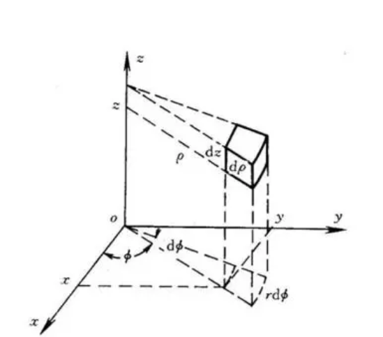
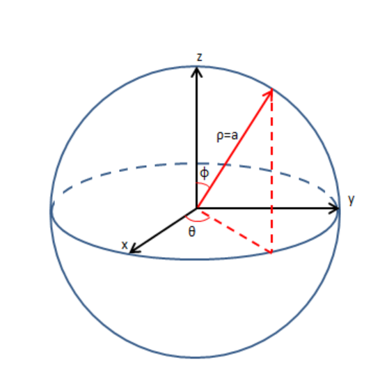
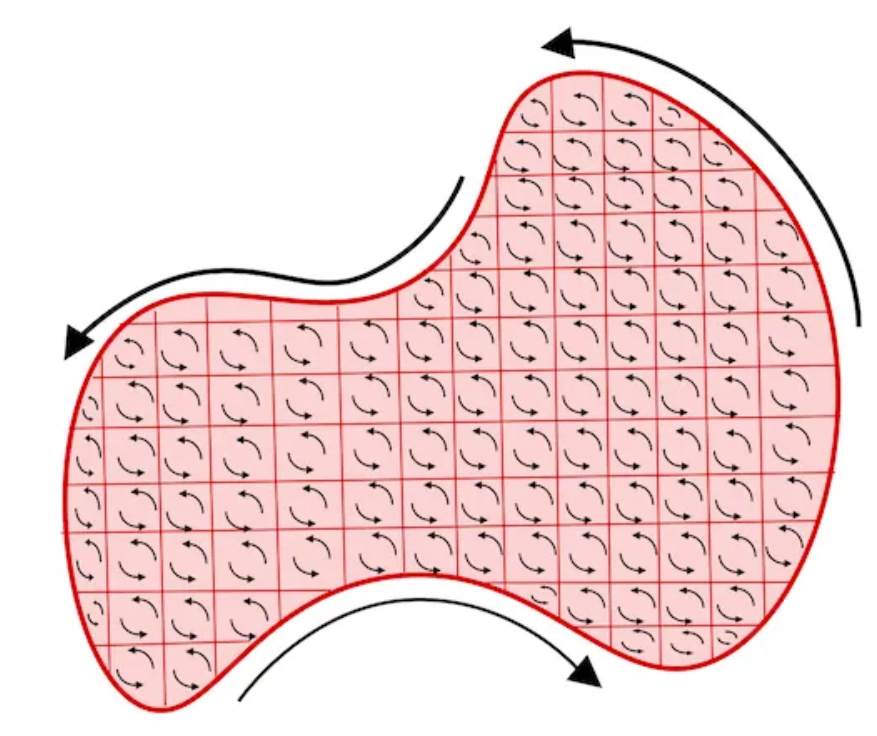
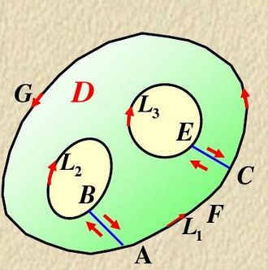

# 空间解析几何

## 平面

$$
点法式:\mathbf {M_0M} \cdot \mathbf n = 0 \quad \mathbf M_0:平面上某点,\mathbf M:平面上任意一点,\mathbf n:法线 \hfill \\
一般式:Ax+By+Cz+D = 0 
\begin{cases}
D=0 \quad 过原点\\
A=0 \quad 与X轴平行或重合 \\
A=B=0 \quad 与XY平面平行或重合 \\
\end{cases}
\quad (ABCD \ne 0,两边可同时除非0常数)\hfill \\
截距式:\frac{x}{a}+\frac{y}{b}+\frac{z}{c}=1 \quad a,b,c:坐标轴上的截距 \quad (不能表示与任何一个坐标轴平行或重合的平面) \hfill \\
一般式转点法式:法向量为\{A,B,C\},并取平面上任意一点作为\mathbf M_0 \hfill \\
\\
某点(x_1,y_1,z_1)到平面(一般式)距离:d=\frac{|Ax_1+By_1+Cz_1+D|}{\sqrt{A^2+B^2+C^2}} \hfill \\
平面夹角:\cos\theta=\cos\langle\mathbf n_1,\mathbf n_2\rangle \quad \theta \in[0,\pi) \hfill \\
平面束:过一条直线的所有平面.若该直线由平面\pi_1=0,\pi_2=0相交而得,则平面束方程为\pi_1+\lambda \pi_2=0 \hfill \\
$$

## 直线

$$
叉积:\mathbf p \times \mathbf q = 
\begin{bmatrix}
\mathbf i & \mathbf j & \mathbf k \\
p_x&p_y&p_z \\
q_x&q_y&q_z \\
\end{bmatrix} \hfill \\
一般式:
\begin{cases}
A_1x+B_1y+C_1z+D_2 = 0 \\
A_2x+B_2y+C_2z+D_2 = 0 \\
\end{cases}
\quad (两平面必须相交) \hfill \\
点向式(\textbf{标准方程}): \frac{x-x_0}{a}=\frac{y-y_0}{b}=\frac{z-z_0}{c} \quad \mathbf s =\{a,b,c\}\quad (若x为常数,去掉\frac{x-x_0}{a}一项,改为x=x_0,其余类似) \\
参数方程:
\begin{cases}
x=x_0+at \\
y=y_0+bt \\
z=z_0+ct \\
\end{cases}
\quad 矢量方程: \mathbf r=\mathbf r_0 + t\mathbf s \hfill \\
一般式转点向式:写出一般式中两个平面的法向量,它们的叉积即为\mathbf s,然后在直线上任取一点 \hfill \\
\\

直线与平面夹角:\sin \theta=|\cos\langle\mathbf s,\mathbf n \rangle| \quad \theta \in[0,\frac{\pi}{2}] \hfill \\
直线与平面交点:将直线改写成参数方程,然后代入平面方程,求出t \hfill \\
\\
某点到直线(点向式)距离:d=\frac{|\mathbf{P_0P_1}\times \mathbf s|}{|\mathbf s|} \quad \mathbf{P_0P_1}=\{x_1-x_0,y_1-y_0,z_1-z_0\}\hfill \\
直线共面:[\mathbf{r}\mathbf s_1\mathbf s_2]=0 \quad \mathbf{r}:两直线上分别任取一点的连线 \quad \hfill \\
直线夹角:\cos\theta=\cos\langle\mathbf s_1,\mathbf s_2\rangle \hfill \\
$$

## 曲面

$$
一般式:F(x,y,z)=0 \hfill \\
参数方程:
\begin{cases}
x=x(u,v)\\
y=y(u,v)\\
z=z(u,v)\\
\end{cases} 
\quad 矢量方程:\mathbf r(u,v) = \{x(u,v),y(u,v),z(u,v)\}\hfill \\
法向量:对于一般式,\mathbf n=\{F_x,F_y,F_z\};对于参数方程,\mathbf n= \frac{\partial\mathbf r}{\partial u} \times \frac{\partial\mathbf r}{\partial v}(两个切向量的叉积) \hfill \\
求旋转曲面:假设出曲线/直线上的一点的坐标,然后假设该点旋转后的坐标为(x,y,z),然后根据几何关系建立方程 \hfill \\
$$

## 曲线

$$
一般式:
\begin{cases}
F_1(x,y,z)=0 \\
F_2(x,y,z)=0 \\
\end{cases} \hfill \\
参数方程:
\begin{cases}
x=x(t)\\
y=y(t)\\
z=z(t)\\
\end{cases} 
\quad 矢量方程:\mathbf r(t) = \{x(t),y(t),z(t)\}\hfill \\
切线:对于参数方程,切向量=\{x'(t),y'(t),z'(t)\},对于一般式,切向量=\{F_x,F_y,F_z\} \times \{G_x,G_y,G_z\}(两个法向量的叉积) \hfill \\
求曲线
\begin{cases}
F_1(x,y,z)=0 \\
F_2(x,y,z)=0 \\
\end{cases}
对XY平面的投影曲线方程:投影到XY平面,则对原方程组消去z并取z=0,得
\begin{cases}
G(x,y)=0 \\
z=0 \\
\end{cases}
\hfill \\
$$

## 题型：空间解析几何

$$
L_1:\frac{x-1}{0}=\frac{y-1}{1}=\frac{z-1}{1},求L_1绕z轴旋转一周后得到的曲面方程: \hfill \\
设L_1上有一点A(1,1+t,1+t),旋转后变为B(x,y,z) \hfill \\
由几何关系得:z=1+t,1+(1+t)^2=x^2+y^2 \Rightarrow x^2+y^2-z^2=1 \hfill \\
$$

# 多元函数微分学

## 极限

$$
在2维空间\mathbf R^2上: \hfill \\
邻域:给定其中一点P_0,N(P_0,\delta)=\{P||P_0P|<\delta\},则N为P_0的\delta邻域 \hfill \\
有R^2上的点集D,实数集Z和对应法则f,若\forall P \in D,根据f,有唯一的z\in Z与之对应,那么f是D到Z的映射,记为f:D \rightarrow Z \hfill \\
二元函数的极限:\lim_{P\rightarrow P_0}f(P)=\lim_{x\rightarrow x_0,y\rightarrow y_0}f(x,y) = l \hfill \\
二元函数在P_0连续 \Leftrightarrow \lim_{P\rightarrow P_0}f(P)=f(P_0) \hfill \\
$$

- 多元函数连续意味着**在所有方向上连续**（偏导数也是多元函数）

## 偏导数

$$
有二元函数f(x,y),x与y无关,点(x_0,y_0),若关于x的函数f(x,y_0)在x_0可导,则称该导数为f(x,y)在(x_0,y_0)的偏导数,\hfill \\ 
记为\frac{\partial f}{\partial x}|_{x=x_0}=\frac{\partial f(x_0,y_0)}{\partial x}=f_x(x_0,y_0) \hfill \\
f_{xx}=\frac{\partial}{\partial x}(\frac{\partial f}{\partial x})=\frac{\partial^2 f}{\partial x^2} \quad
(仅当x与y无关时)f_{xy}=\frac{\partial}{\partial y}(\frac{\partial f}{\partial x})=\frac{\partial^2 f}{\partial x \partial y} \hfill \\
f(x,y)连续 \Rightarrow f_{xy}=f_{yx} \hfill \\
\\
f_x(x,y)在P_0(x_0,y_0)连续 \Leftrightarrow \lim_{P \rightarrow P_0} f_x(x,y)=f_x(x_0,y_0) \quad (必须是二元极限)  \hfill \\
$$

- 不同于微分，同名的偏导数符号**不总是**能相消

## 全微分

$$
z=f(x,y),在(x_0,y_0)处有\Delta z = f(x_0+\Delta x,y_0+\Delta y)-f(x_0,y_0),\rho=\sqrt{(\Delta x)^2+(\Delta y)^2} \hfill \\
若(x_0,y_0)处x和y的偏导数均存在,有\mathrm dz = f_x(x_0,y_0) \Delta x +f_y(x_0,y_0)\Delta y \hfill \\
z在(x_0,y_0)可微 \Leftrightarrow \mathrm dz存在且\Delta z = \mathrm dz+o(\rho) \Leftrightarrow \lim_{\rho \rightarrow 0}\frac{\Delta z-\mathrm dz}{\rho}=0 \hfill \\
$$

- 全微分是全增量忽略高阶小量后得到的结果
- 全微分是第二型曲线积分的一种

## 多元函数微分学

$$
定义\frac{Dy}{Dx} =
\begin{cases}
\frac{\mathrm dx}{\mathrm dy} \quad y可以仅由x确定 \\
\frac{\partial x}{\partial y} \quad y与x有关,但无法仅由x确定 \\
1 \quad y \equiv x \hfill \\
0 \quad y与x无关
\end{cases} \hfill \\
\\
若y=f(u_1,u_2,...,u_n),且y与x有关: \hfill \\
定义:\frac{Dy^i}{Du_i}(也可以写成\frac{Df^i}{Du_i})表示,\textbf{将原函数中除了第i个参数,其他全视为常数,然后对第i个参数求导} \hfill \\
简记:f'_i=\frac{Df^i}{Du_i} \quad (注意:当且仅当u_i与其他自变量均无关时,才有\frac{Dy}{Du_i} =\frac{Dy^i}{Du_i},即\frac{\partial y}{\partial u_i} =f'_i) \hfill \\
则\frac{Dy}{Dx}=\sum_{i=1}^n f'_i\frac{Du_i}{Dx} \hfill \\
f'_i=f'_i(u_1,u_2,...,u_n)\textbf{依然是多元函数};简记:\frac{D(f'_i)^j}{Du_j}=f''_{ij} \quad (f连续时,f''_{ij}=f''_{ji}) \hfill \\
则\frac{Df'_i}{Dx}=\sum_{j=1}^n f''_{ij}\frac{Du_j}{Dx} \hfill \\
\\
例①:y=f(x,s,t)=ax+bs+ct \quad (a,b为常数,s=x^2,t与x无关),则
\begin{cases}
f'_1=a,f'_2=b,f'_3=c \\
\frac{\partial y}{\partial x}=f'_1\frac{\mathrm dx}{\mathrm dx}+f'_2\frac{\mathrm ds}{\mathrm dx}=a+2bx
\end{cases} \hfill \\
例②:z=f(x^2,xy)\quad (x,y无关),则f_x=2xf'_1+yf'_2, \hfill \\
f_{xx}= \frac{\partial 2xf'_1}{\partial x}+\frac{\partial yf'_2}{\partial x}=2f'_1+2x(2xf''_{11}+yf''_{12})+0+y(2xf''_{12}+yf''_{22}) 
=2f'_1+4x^2f''_{11}+4xyf''_{12}+y^2f''_{22}
\hfill \\
$$

## 多元隐函数

$$
隐函数存在定理:f(x,y)=0 \Rightarrow f(x,y(x)) =0 \Rightarrow f'_1+f'_2\frac{\mathrm dy}{\mathrm dx} = 0 \Rightarrow \frac{\mathrm dy}{\mathrm dx}=-\frac{f'_1}{f'_2} \hfill \\
上式要成立,必须满足f'_1,f'_2连续,f'_2 \ne 0 \quad (条件满足的范围就是\frac{\mathrm dy}{\mathrm dx}=-\frac{f_1}{f_2}成立的范围,比如在R^2上均成立)\hfill \\
同理可以得到\frac{\mathrm dx}{\mathrm dy}存在的条件 \hfill \\
\\
三元隐函数存在定理:f(x,y,z)=0 \Rightarrow f(x,y,z(x,y)) =0 \Rightarrow f'_1+f'_3z_x = 0 (见注解)\Rightarrow z_x=-\frac{f'_1}{f'_3} \hfill \\
上式要成立,必须满足f'_1,f'_2,f'_3连续,f'_3 \ne 0 \quad \hfill \\
同理可以得到z_y,x_y,x_z,y_x,y_z存在的条件 \hfill \\
注:如果把z看作x,y的函数,那么x和y就是不相关的自由变量,故\frac{\mathrm dy}{\mathrm dx} = 0 \hfill \\
\\
f(x,y,u,v)=0,g(x,y,u,v)=0 \Rightarrow f(x,y,u(x,y),v(x,y))=0,g(x,y,u(x,y),v(x,y))=0 \hfill \\
\Rightarrow u_x=-\frac{J_{3\rightarrow 1}}{J},v_x=-\frac{J_{4\rightarrow 1}}{J} \hfill \\
其中,\mathrm{Jacobi}行列式J=
\begin{bmatrix}
f_3&f_4\\
g_3&g_4\\
\end{bmatrix};
J_{3\rightarrow 1}表示,把J中下标3替换为下标1得到的矩阵
\hfill \\
上式要成立,必须满足f_1 \sim f_4,g_1\sim g_4均连续,J \ne 0 \hfill \\
f和g为仅包含x,u,v的函数时也完全一样,将偏导数改为导数即可(因为上面的过程中y与x无关,和常数没有区别) \hfill \\
$$

## 方向导数和梯度

$$
有函数u=f(x,y,z)和向量\mathbf n=\{a,b,c\}:\hfill \\
有线段PP_0,P_0位于以P为起点以\mathbf n为方向的射线上,记\rho=|PP_0|,l=\lim_{\rho \rightarrow0}\frac{f(P)-f(P_0)}{\rho},\hfill \\
若l存在,则称其为f(x,y,z)在P_0点沿\mathbf n的方向导数,记为\frac{\partial f(P_0)}{\partial \mathbf n} \hfill \\
\frac{\partial f(P_0)}{\partial \mathbf n}=\lim_{s\rightarrow0^+}\frac{f(P_0 + s \mathbf n)-f(P_0)}
{|s\mathbf n|} \hfill\\
\\
梯度(数量\rightarrow向量):\mathbf{grad} u = \nabla u=\{\frac{\partial u}{\partial x},\frac{\partial u}{\partial y},\frac{\partial u}{\partial z}\} \hfill \\
若方向导数和梯度均存在: \hfill \\
\frac{\partial f}{\partial \mathbf n}= \mathbf{grad} f \cdot \mathbf n^0 \hfill \\
\mathbf n//\mathbf{grad}f时,|\frac{\partial f}{\partial \mathbf n}|_{max}=|\mathbf{grad}f| \hfill \\
\mathbf n^0:\mathbf n的单位化 \hfill \\
$$

- 偏导数是**平行于自变量轴的直线**上的导数，方向导数是**任意射线**上的导数，梯度是向量，是方向导数绝对值最大的方向
- 方向导数的公式中含有向量，但分别经多元函数映射和取模运算变为数量，所以结果依然为数量

## 微分学几何意义

$$
有空间曲线\mathbf r(t)=\{x(t),y(t),z(t)\}: \hfill \\
切线:\frac{x-x_0}{x'(t_0)}=\frac{y-y_0}{x'(t_0)}=\frac{z-z_0}{x'(z_0)} \hfill \\
切平面:x'(t_0)(x-x_0)+y'(t_0)(y-y_0)+z'(t_0)(z-z_0) \hfill \\
\\
有空间曲线
\begin{cases}
F_1(x,y,z)=0 \\
F_2(x,y,z)=0 \\
\end{cases}: \hfill \\
切线方向:\mathbf T = \mathbf{grad} F_1(P_0) \times \mathbf{grad}F_2(P_0) \quad (切线两个方向皆可)\hfill \\
切平面:\mathbf T \cdot \mathbf {P_0}=0 \hfill \\
\\
有空间曲面F(x,y,z)=0: \hfill \\
切线:\mathbf n=\mathbf{grad} F(P_0) (\mathbf n \ne 0时,才存在切平面和法线) \hfill \\
切平面:\mathbf {P_0}\cdot \mathbf{grad}f(P_0)=0 \hfill \\
$$

## 多元函数极值

$$
极值的必要条件:位于驻点,即\mathbf{grad}f(P)=0的点 \hfill \\
极值的充分条件:f(x,y)在某区域内有二阶连续偏导数,M= 
\begin{bmatrix}
f_{xx}&f_{xy} \\
f_{yx}&f_{yy} \\
\end{bmatrix},则
\begin{cases}
|M|>0,f_{xx}>0 \quad 极小值点 \\
|M|>0,f_{xx}<0 \quad 极大值点 \\
|M|=0 \quad 不确定 \\
|M|<0 \quad 不是极值点
\end{cases}
\hfill \\
可以直接代入极值点的x,然后观察函数随y的变化(y同理),来判断极大/极小值/非极值点 \hfill \\
\\
受检点:驻点或偏导数不存在的点 \hfill \\
\\
条件极值:求f(x,y)极值;g(x,y)=0,(x,y) \in D \quad 称f(x,y)为目标函数,g(x,y)=0为约束条件 \hfill \\
若P_0 \in D,\exist N(P_0,\delta)\subset D,s.t.\forall P \in N,f(P) \ge P_0,则称P_0为(局部)最优点;若N=D,则称P_0为全局最优点\hfill \\
若f和g的一阶偏导数存在,则条件极值点满足\frac{f_x}{g_x}=\frac{f_y}{g_y} \hfill \\
令L(x,y,\lambda)=f(x,y)+\lambda g(x,y),则\mathbf{grad}L=0时,原函数可能取极值(\lambda是与x,y无关的变量) \hfill \\
$$

- 极值：在**某点的某个邻域内**取得最小值或最大值的点（**所有偏导数必须存在，且不能是边界点**）
- 最值：在**函数的定义域内**取得最小值或最大值的点（区域不一定包含**边界点**；如果不包含边界点，可能导致没有最值）
- 求最值：找到所有**受检点**，求其函数值，然后求出区域**边界上所有点**的最值，最后选出最大值和最小值
- 求自由极值：求各个偏导数，以各偏导数均为0建立方程，得到若干个解，求这些解的对应点的函数值
- 求条件极值：通过L函数建立方程，得到若干个解（$\lambda$**不用解**），求这些解的对应点的函数值

## 题型：多元函数极限/可导性/可微性

$$
\textbf{(某点上)各个偏导数连续} \Rightarrow \textbf{可微} \Rightarrow \textbf{所有偏导数和方向导数存在/极限存在/连续} \hfill \\
\textbf{(某点上)某个偏导数存在} \Rightarrow \textbf{在某个方向上连续} \hfill \\

若\lim_{\rho \rightarrow 0}f(x,y)=f'_x(0)=f'_y(0)=0 ,则f(x,y)可微 \Leftrightarrow \lim_{\rho \rightarrow 0} \frac{f(x,y)}{\rho} \equiv 0 \hfill \\
$$

$$
f(x,y)=
\begin{cases}
\frac{x^2y}{x^2+y^2} \quad (x,y) \ne (0,0)\\
0 \quad (x,y)=(0,0) \\
\end{cases}
,判断f(x,y)在(0,0)处是否可微,极限和偏导数是否存在 \hfill \\
\lim_{(x,y)\rightarrow(0,0)} f(x,y)=\lim_{(x,y)\rightarrow(0,0)} \frac{x^2y}{x^2+y^2} \quad
其中\left|\frac{x^2y}{x^2+y^2} \right| \le |y|,故 \lim_{(x,y)\rightarrow(0,0)} f(x,y)=0,即极限存在 \hfill \\
f_x(0,0)=\lim_{x\rightarrow 0}\frac{f(x,0)-f(0,0)}{x}=0,同理得:f_y(0,0)=0,即x和y方向的偏导数均存在 \hfill \\
记I=\lim_{\rho \rightarrow 0}\frac{f(x,y)}{\rho}=\lim_{\rho \rightarrow 0}\frac{x^2y}{\rho^3} \quad 不妨令x=y,则 I=\lim_{x \rightarrow 0}\frac{x}{2\sqrt{2}|x|} \ne 0 \Rightarrow 不可微 \hfill \\
$$

- 二元函数的极限中,x和y的**趋近速度**具有任意性，所以要证明极限存在通常只能靠不等式；要证明极限不存在，只要举反例即可

## 题型：多元函数极值

$$
f(x,y)在(0,0)处某去心邻域内连续,\lim_{(x,y)\rightarrow(0,0)}\frac{f(x,y)-f(0,0)}{x^2+1-x\sin y}=-3.证明:f(x,y)在(0,0)处取极大值 \hfill \\
由极限的保号性知:\exists \delta>0,s.t. 当\rho<\delta时,\frac{f(x,y)-f(0,0)}{x^2+1-x\sin y}<0 \hfill \\
其中x^2+1-x\sin y \ge \max\{x^2-x+1,x^2+x+1\} >0,故\rho < \delta时f(x,y)-f(0,0)<0,即f(x,y)在(0,0)处取极大值 \hfill \\
\\
z=x^2+12xy+2y^2,4x^2+y^2 \le 25,求z的最值: \hfill \\
z_x=2x+12y,z_y=4y+12x \Rightarrow 自由极值:z(0,0)=0 \hfill \\
记g(x,y)=4x^2+y^2-25,L(x,y,\lambda)=z(x,y)+\lambda g(x,y) \hfill \\
\mathbf {grad} L=\mathbf 0 \Rightarrow 
\begin{cases}
z_x+\lambda g_x=0 \\
z_y+\lambda g_y=0 \\
g(x,y)=0 \\
\end{cases} 
\Rightarrow (x,y)=(\pm2,\mp3),(\pm\frac{3}{2},\pm 4) \hfill \\
\Rightarrow 条件极值:z(\pm2,\mp3)=106.25,z(\pm\frac{3}{2},\pm 4)=-50 \hfill \\
综上,z的最小值和最大值分别为106.25和-50 \hfill \\
$$

- **自由极值和条件极值可以转化（如3个变量，其中一个可以用另外两个表示），用条件极值通常更容易计算**
- 于表达式未知的函数，要判断极大值还是极小值，可以使用极限的保号性

# 重积分

## 二重积分

$$
(\textbf{各种多重积分都是简写,不能分成几部分独立计算;对某个自变量积分时,其他自变量视为常数}) \hfill \\
直角坐标:d\sigma=\mathrm dx \mathrm dy \hfill \\
D:y_1(x) \le y \le y_2(x),a \le x \le b \Rightarrow \iint\limits_Df\mathrm d\sigma = \int_a^b\mathrm dx \int_{y_1(x)}^{y_2(x)}f(x,y) \mathrm dy \hfill \\
\\
一般变量代换:x=x(u,v),y=y(u,v),\mathrm d\sigma=|J| \mathrm du \mathrm dv,|J|=
\begin{bmatrix}
x_u&x_v \\
y_u&y_v \\
\end{bmatrix}, \hfill \\
则\iint\limits_Df\mathrm d\sigma = \iint\limits_G f |J| \mathrm du \mathrm dv \hfill \\
\\
极坐标:x=r\cos\theta,y=r\sin\theta,\mathrm d\sigma=r\mathrm dr \mathrm d\theta \hfill \\
D:r_1(\theta) \le r \le r_2(\theta),\alpha \le \theta \le \beta \Rightarrow \iint\limits_Df\mathrm d\sigma = \int_{\alpha}^{\beta}\mathrm d\theta \int_{r_1(\theta)}^{r_2(\theta)}f(r\cos\theta,r\sin\theta)r\mathrm dr \hfill \\
注意:r是积分对象而不是积分上限,不要混淆r和r_2 \hfill \\
$$

## 三重积分

$$
直角坐标:\mathrm dv=\mathrm dx \mathrm dy\mathrm dz \hfill \\
V:z_1(x,y) \le z \le z_2(x,y),(x,y)\in D:\iiint\limits_Vf\mathrm dv=\iint\limits_D \mathrm dx \mathrm dy\int_{z_1(x,y)}^{z_2(x,y)}f(x,y,z)\mathrm dz \hfill \\
V:a \le z \le b,截面为D_z:\iiint\limits_Vf\mathrm dv=\int_{a}^{b}\mathrm dz \iint\limits_{D_z}f(x,y,z)\mathrm dx \mathrm dy \hfill \\
\\
一般变量代换:x=x(u,v,w),y=y(u,v,w),z=z(u,v,w),\mathrm dv=|J| \mathrm du \mathrm dv \mathrm dw,|J|=
\begin{bmatrix}
x_u&x_v&x_w \\
y_u&y_v&y_w \\
z_u&z_v&z_w \\
\end{bmatrix}, \hfill \\
则\iiint\limits_V f\mathrm dx\mathrm dy\mathrm dz = \iiint\limits_\Omega f |J| \mathrm du \mathrm dv \mathrm dw \hfill \\
\\
$$

$$
柱面坐标系:x=r\cos\theta,y=r\sin\theta,z=z,\mathrm dv = r \mathrm dr\mathrm d\theta \mathrm dz \ \hfill \\
V:z_1(\theta,r) \le z \le z_2(\theta,r),r_1(\theta) \le r \le r_2(\theta),\alpha \le \theta \le \beta, \hfill \\
\Rightarrow \iiint\limits_Vf\mathrm dv=\int_{\alpha}^{\beta} \mathrm d\theta\int_{r_1(\theta)}^{r_2(\theta)} r\mathrm dr\int_{z_1(r,\theta)}^{z_2(r,\theta)} f \mathrm dz\hfill \\
\\
球面坐标系:x=\rho\cos\theta\sin\phi,y=\rho\sin\theta\sin\phi,z=\rho\cos\phi,\mathrm dv = \rho^2\sin\phi \mathrm d\rho\mathrm d\theta \mathrm d\phi \hfill \\
V:\rho_1(\theta,\phi) \le \rho \le \rho_2(\theta,\phi),\phi_1(\theta)\le \phi \le \phi_2(\theta),\alpha \le \theta \le \beta \hfill \\
\Rightarrow \iiint\limits_Vf\mathrm dv= \int_{\alpha}^{\beta} \mathrm d\theta \int_{\phi_1(\theta)}^{\phi_2(\theta)}\sin\phi \mathrm d \phi \int_{\rho_1(\theta,\phi)}^{\rho_2(\theta,\phi)} f\rho^2\mathrm d \rho \hfill \\
$$

## 应用

$$
质心:\overline{x}=\frac{\iiint x\rho  \mathrm dv}{M} \hfill \\
旋转体体积:V= 2\pi \iint\limits_D f(x,y) \mathrm dx \mathrm dy \quad f(x,y):区域内一点到转轴的距离 \hfill \\
绕x轴转动的转动惯量: J_x=\iint \mu y^2 \mathrm d\sigma(xy平面内的薄板) \quad J_x=\iiint \rho(y^2+z^2)\mathrm dv(几何体) \hfill \\
$$

## 题型：多重积分

$$
\Omega是x^2+(y-z)^2=(1-z)^2 \quad (0\le z \le 1)和z=0围成的立体,求\Omega的形心: \hfill \\
设形心为(x_c,y_c,z_c),由对称性知:x_c=0,y_c=z_c \hfill \\
z_c=\frac{\iiint\limits_V z \mathrm dv}{\iiint\limits_V  \mathrm dv} (不要试图用x,y表达z;而是应当按高度切分,先二后一积分) \hfill \\
\\
f(x,y)连续,\lim_{(x,y)\rightarrow(1,0)}\frac{f(x,y)-2x-2}{\sin \pi x+y^2}=-1,求\lim_{r\rightarrow0} \iint\limits_{(x-1)^2+4y^2 \le r^2}\frac{f(x,y) \mathrm dx \mathrm dy}{r^2}: \hfill \\
f(x,y)连续 \Rightarrow \lim_{r\rightarrow0} 原式=\frac{\pi r^2 f(1,0)}{2r^2}f(1,0) =\frac{\pi}{2}f(1,0) \hfill \\
\lim_{(x,y)\rightarrow(1,0)}\frac{f(x,y)-2x-2}{\sin \pi x+y^2}=-1 \Rightarrow f(1,0)=4 \Rightarrow 原式=2\pi \hfill \\
$$

- 换元法（改变坐标系） 
- 交换顺序（通常需要画图确定新的上下限）

- **利用对称性、奇偶性简化运算（不要试图在第二型积分等难以理解的积分中使用对称性）**

- **积分上下限非常接近且函数值连续时，可以近似认为区间内函数值不变（积分中值定理）**

# 曲线曲面积分

## 第一型曲线积分

$$
一般参数方程:\mathrm ds = \sqrt{x'^2+y'^2+z'^2}\mathrm dt \hfill \\
L:x=x(t),y=y(t),z=z(t),\alpha \le t \le \beta:\int_L f \mathrm ds=\int_\alpha^\beta  \sqrt{x'^2+y'^2+z'^2}f(t) \mathrm dt \hfill \\
\\
柱面坐标系参数方程:\mathrm ds =\sqrt{r^2+r'^2+z'^2} \mathrm d\theta \hfill \\
r=r(\theta),z=z(\theta),\alpha \le \theta \le \beta:\int_L fds =\int_\alpha^\beta f(\theta) \sqrt{r^2+r'^2+z'^2} \mathrm d\theta \hfill \\
$$

- 第一型曲线积分是对弧长的积分，没有方向性

## 题型：求第一型曲线积分

$$
曲线L:
\begin{cases}
x^2+y^2+z^2=a^2 \\
x+y+z=0 \\
\end{cases},
求\oint_L(x^2+2y^2+z) \mathrm ds :
原式=\oint_L(x^2+y^2+z^z) \mathrm ds=a^2\oint_L \mathrm ds \hfill \\
易得:L是半径为a的圆;故原式=2\pi a^3 \hfill \\
$$

## 第一型曲面积分

$$
投影法:\mathrm dS = \sqrt{1+z_x^2+z_y^2}\mathrm dx \mathrm dy \hfill \\
若z=z(x,y),\iint\limits_S f \mathrm dS= \iint\limits_D f(x,y)\sqrt{1+z_x^2+z_y^2}\mathrm dx \mathrm dy \hfill \\
若S为平面, \mathrm dS= \frac{\mathrm dx\mathrm dy}{\cos \theta } \quad \theta:S和xy平面的夹角 \hfill \\
\\
锥面:z=\sqrt{x^2+y^2} \Rightarrow \mathrm dS=\sqrt2 \mathrm dx\mathrm dy \hfill \\
$$

- 也可以投影到yz、zx平面

## 题型：第一型曲面积分

$$
S:x^2+y^2=a^2位于z=-a和z=a之间的部分,求\iint\limits_S \frac{1}{x^2+y^2+z^2} \mathrm dS \hfill \\
记S_1:S上y=\sqrt{a^2-x^2}的部分，S_2:S上y=-\sqrt{a^2-x^2}的部分,D:S_1和S_2在xz平面上的投影 \hfill \\
\iint\limits_{S_1} \frac{1}{x^2+y^2+z^2} \mathrm dS=\iint\limits_{S_1} \frac{1}{a^2+z^2} \mathrm dS
=\iint\limits_D \frac{\sqrt{1+y_x^2+y_z^2}}{a^2+z^2} \mathrm dx \mathrm dz
=\iint\limits_D \frac{a}{\sqrt{a^2-x^2}(a^2+z^2)} \mathrm dx \mathrm dz=\frac{\pi^2}{2} \hfill \\
由对称性得:原式=2\iint\limits_{S_1} \frac{1}{x^2+y^2+z^2} \mathrm dS=\pi^2 \hfill \\
$$

## 第二型曲线积分

$$
\int_L \mathbf F \cdot \mathbf T \mathrm ds = \int_L \mathbf F \mathrm d \mathbf r 
=\int_L P \mathrm dx+Q\mathrm dy+R \mathrm dz
\hfill \\ \mathbf F=\{P,Q,R\} ,\mathbf T \mathrm ds = \mathrm d\mathbf r=\{\mathrm dx,\mathrm dy,\mathrm dz\} \hfill \\
\mathbf r:原点到曲线上一点的位移 \quad \mathbf T:曲线上一点的\textbf{单位}切向量  \hfill \\
\\
分别投影法: \hfill \\
\int_L P \mathrm dx+Q\mathrm dy+R \mathrm dz=\int_L P(x) \mathrm dx+\int_L Q(y)\mathrm dy+\int_L R(z) \mathrm dz \hfill \\
统一投影法: \hfill \\
若z=z(x),y=y(x),\int_L P \mathrm dx+Q\mathrm dy+R \mathrm dz=\int P(x) \mathrm dx+Q(x)y'\mathrm dx+R(x)z' \mathrm dx \hfill \\
注意积分上下限和L的方向的关系 \hfill \\
\\
参数方程: \hfill \\
\int_L P \mathrm dx+Q\mathrm dy+R \mathrm dz=\int_{\alpha}^{\beta}Px'+Qy'+Rz'  \mathrm dt \hfill \\
L:x=x(t),y=y(t),z=z(t),\alpha \le t \le \beta \hfill \\
$$

- 可以理解为，沿曲线运动时，力的做功；d**r**可理解为，沿切向量移动一小段距离后，位移的改变量
- 曲线有方向，改为另一向后，结果加负号
- 对向量求微分，结果依然为向量，即原矢量各个分量的微分构成的新向量

### Green公式（二维第二型曲线积分→二重积分）

$$
若二元函数P,Q在某曲线L围成的区域D内有一阶连续偏导数,\oint_L P\mathrm dx+Q \mathrm dy = \iint\limits_D Q_x -P_y \ \mathrm dx \mathrm dy \hfill \\
L:\textbf{正向}曲线,如果不为正向,等式右边加负号 \hfill \\
$$

- 要求某闭合曲线的积分，可以将它围成的区域细分成许多区域，内部的积分抵消，只剩下沿外围曲线的积分，所以这些区域的围道积分之和等于整个区域的围道积分；将所有区域近似看作无限小正方形，其围道积分便容易求出，恰好等于该区域上的某个二重积分
- **正向曲线**：对于单连通区域，曲线沿逆时针方向即为正方向；对于非单连通区域，可以添加辅助线，使之成为单连通区域，这种情况下，区域外侧的曲线沿逆时针方向为正方向，区域内部的曲线沿顺时针方向为正方向（如上图，L1、L2、L3均为正方向，L1、L2、L3连同辅助线共通构成L）

### Stokes公式（三维第二型曲线积分→第二型曲面积分→第一型曲面积分）

$$
若三元函数P,Q,R在以闭合曲线L为边界的平面\Sigma上有一阶连续偏导数,\hfill \\
\oint_L P \mathrm d x +Q \mathrm d x+R \mathrm d z=\iint\limits_S \nabla \times \mathbf F \mathrm d\mathbf r=\iint\limits_\Sigma 
\begin{bmatrix}
\mathrm dy\mathrm dz & \mathrm dx\mathrm dz & \mathrm dx\mathrm dy \\
\frac{\partial}{\partial x} & \frac{\partial}{\partial y} & \frac{\partial}{\partial z} \\
P & Q & R \\
\end{bmatrix}
=
\iint\limits_\Sigma
\begin{bmatrix}
\cos \alpha & \cos \beta & \cos \gamma \\
\frac{\partial}{\partial x} & \frac{\partial}{\partial y} & \frac{\partial}{\partial z} \\
P & Q & R \\
\end{bmatrix}
\mathrm dS
\hfill \\
L:\textbf{正向}曲线,若不为正向,右边加符号 \hfill \\
注意:题目会给出曲线方程,不论是否代入这些方程,不论哪一步代入方程,结果相同 \hfill \\
$$

- **正向曲线：曲线方向和平面法向量的方向符合右手螺旋定则**

### 全微分方程与路径无关积分

$$
若D为平面上的单连通区域,P,Q在平面内有一阶连续偏导数,则: \hfill \\
\int P\mathrm dx + Q \mathrm dy 在D内与积分路径无关 \Leftrightarrow \exist u(x,y),s.t. \mathrm du=P \mathrm dx + Q\mathrm dy \Leftrightarrow D内P_y \equiv Q_x \hfill \\
若\mathrm du=P\mathrm dx + Q\mathrm dy,则\int_{(x_0,y_0)}^{(x_1,y_1)}P\mathrm dx + Q\mathrm dy = u(x_1,y_1)-u(x_0,y_0) \hfill \\
注意:\frac{\partial u}{\partial x}=P \quad \frac{\partial u}{\partial y}=Q \hfill \\
\\
若P\mathrm dx + Q\mathrm dy=0,且\exist \mathrm du = P\mathrm dx + Q\mathrm dy,则原方程为全微分方程,通解为u+C \hfill \\
\\
凑微分: \hfill \\
x \mathrm dy +y \mathrm dx = \mathrm dxy \quad \frac{x \mathrm dy-y \mathrm dx}{x^2} = \mathrm d\frac{y}{x} \quad \frac{ - x \mathrm dy + y \mathrm dx}{xy} = \mathrm d \ln|\frac{y}{x}| \hfill \\
\frac{ - x \mathrm dy + y \mathrm dx}{x^2-y^2} =\frac{1}{2} \mathrm d \ln|\frac{x-y}{x+y}| \quad \frac{x \mathrm dx + y \mathrm dy}{x^2+y^2} = \frac{1}{2}\mathrm d \ln(x^2+y^2) \quad \frac{-x\mathrm dy + y \mathrm dx}{x^2+y^2} = \mathrm d \arctan\frac{x}{y} \hfill \\
$$

- 全微分方程成立隐含了积分与路径无关的条件
- 有的非全微分方程，两边乘同一个式子（被称为积分因子）后会变为全微分方程

## 题型：含有偏导数的微分方程

$$
f(x,y)可微,\frac{\partial f}{\partial x}=-f(x,y),f(0,y)=\sin y,求f(x,y): \hfill \\
\frac{\partial f}{\partial x}=-f(x,y)\Rightarrow f(x,y)=C(y)e^{-x} \quad (\textbf{先将y视为常数积分,然后将常数项替换为含y函数})\hfill \\
f(0,y)=\sin y代入得:f(x,y)=\sin ye^{-x} \hfill \\
\\
(xy-yf(x)) \mathrm dx+(f(x)+y^2) \mathrm dy = \mathrm du(x,y),f(0)=-1,求u(x,y) \hfill \\
由题意得:x-f(x)=f'(x) \Rightarrow f'(x)+f(x)=x \Rightarrow f(x)=\frac{\int xe^x \mathrm dx}{e^x}=x-1+Ce^{-x} \hfill \\
f(0)=-1代入,得:f(x)=x-1 \quad 代入原式得:y \mathrm dx+(x-1+y^2) \mathrm dy = \mathrm du(x,y) \hfill \\ 
\Rightarrow \mathrm du(x,y) = y\mathrm dx+x\mathrm dy - \mathrm dy +y^2 \mathrm dy \Rightarrow u(x,y)=xy-y+\frac{y^3}{3}+C \hfill \\
另解: \hfill \\
由题意得:u(x,y)的积分与路径无关 \Rightarrow \int_{(0,0)}^{(0,b)} (x-1+y^2) \mathrm dy+\int_{(0,b)}^{(a,b)} y \mathrm dx = \int_{(0,0)}^{(a,b)} \mathrm du(x,y) \hfill \\
\Rightarrow \frac{b^3}{3}-b+ab=u(a,b)+C_0 \Rightarrow u(x,y)=xy-y+\frac{y^3}{3}+C \hfill \\
另解: \hfill \\
\frac{\partial u}{\partial x}=y \Rightarrow u(x,y)=xy+C(y) \hfill \\
\frac{\partial u}{\partial y}=x-1+y^2 \Rightarrow u(x,y)=xy-y+\frac{y^3}{3}+C(x) \hfill \\
综上:u(x,y)=xy-y+\frac{y^3}{3}+C \hfill \\
\\
\int_L F(x,y)(y \mathrm dx+x\mathrm dy)积分与路径无关,F(x,y)=0确定的隐函数y=y(x)存在,且过(1,2),求F(x,y): \hfill \\
积分与路径无关 \Rightarrow y F'_2=xF'_1 \Rightarrow \frac{y}{x}=\frac{F'_1}{F'_2}=-\frac{\mathrm dy}{\mathrm dx} (隐函数存在定理) \Rightarrow F(x,y)=xy-2 \hfill \\
$$

- **已知对x的偏导数时，将y视为常数进行积分，然后将积分结果中的常数替换为含y函数**（常数项也包含在其中）

## 题型：求第二型曲线积分

$$
L:|x|+|y|=1,沿逆时针方向,求\oint_L\frac{(x-y) \mathrm dx+(x+4y) \mathrm dy}{x^2+4y^2}: \hfill \\
易得:P=\frac{x-y}{x^2+4y^2},Q=\frac{x+4y}{x^2+4y^2},Q_x=P_y;在L内,除(0,0)处,P和Q有一阶连续偏导数 \hfill \\
设曲线S:x^2+4y^2=1,沿逆时针方向,
原式=\oint_S \frac{(x-y) \mathrm dx+(x+4y) \mathrm dy}{x^2+4y^2} =\oint_S (x-y)\mathrm dx+(x+4y) \mathrm dy \hfill \\
显然,x-y和x+4y在S包围的区域内有连续偏导数 \Rightarrow 
原式=\iint\limits_{x^2+4y^2 \le 1}2\mathrm d\sigma = \pi \hfill \\
\\
\int_{(0,0)}^{(t,t^2)}f(x,y) \mathrm dx+x\cos y \mathrm dy =t^2,f(x,y)有一阶连续偏导数,求f(x,y): \hfill \\
由题意得:原积分为路径无关积分 \Rightarrow f_y=\cos y \Rightarrow f(x,y)=\sin y+C(x) \hfill \\
t^2=\int_0^tf(x,t^2) \mathrm dx \quad (另一项为0)=t\sin t^2+\int_0^t C(x) \mathrm dx \hfill \\
\Rightarrow C(t)=2t-\sin t^2-2t^2\cos t^2 \Rightarrow f(x,y)=\sin y+2x-\sin x^2-2x^2\cos x^2 \hfill \\
\\
L:
\begin{cases}
x^2+y^2=4y \\
3y-z+1=0 \\
\end{cases}
,从上往下看沿逆时针方向,求\oint_L yz\mathrm dx+3xz \mathrm dy-xy \mathrm dz: \hfill \\
记\Sigma为L围成的上侧平面,\Sigma的法向量为\mathbf n,易得\mathbf n=\frac{1}{\sqrt{10}}\{0,-3,1\} \hfill \\
原式=\frac{1}{\sqrt{10}}
\iint\limits_\Sigma
\begin{bmatrix}
0& -3 & 1 \\
\frac{\partial}{\partial x} & \frac{\partial}{\partial y} & \frac{\partial}{\partial z} \\
yz & 3xz & -xy \\
\end{bmatrix}
\mathrm dS
=\frac{2}{\sqrt{10}}\iint\limits_\Sigma \mathrm dS
=2\iint\limits_D \mathrm d \sigma
=8 \pi \hfill \\
\\
L为x^2+y^2=-2y(y \ge -1)从(1,-1)到(-1,-1)的一段,求I=\int_L f[f(x)+1] \mathrm dy -\frac{y^2[f(x)+1]+2yf(x)}{\sqrt{1-x^2}} \mathrm dx: \hfill \\
易得:y=\sqrt{1-x^2}-1,\mathrm dy=\frac{-x}{\sqrt{1-x^2}} \mathrm dx,代入I化简得:I
=\int_{-1}^1 \frac{2-2\sqrt{1-x^2}}{\sqrt{1-x^2}} \mathrm dx=2\pi -4 \hfill \\
$$

- **如果曲线上x,y,z能统一用一个变量表示，用参数方程或使用投影法**
- 曲线封闭且内部**无奇点**时，套用格林公式（**函数不可导时，不能使用**）
  - **有奇点时且旋度恒为0时，原积分等于内部任意一个包围奇点的闭合曲面的积分**
  - **容易求$\cos \alpha,\cos \beta,\cos \gamma$时，考虑使用斯托克斯公式**
  - 曲线不封闭时，添加辅助线，分段求积分
- 注意路径无关积分

## 第二型曲面积分

$$
方向余弦:向量方向的一种表示法,形如\{cos \alpha,\cos \beta,\cos\gamma\},\textbf{必定为单位向量} \hfill \\
\alpha,\beta,\gamma为方向向量与各坐标轴正方向的夹角\hfill \\
\\
\iint\limits_S \mathbf F \cdot \mathbf n \mathrm dS  = \iint\limits_S \mathbf F \mathrm d\mathbf S
=\iint\limits_S P\mathrm dy\mathrm dz+Q\mathrm dz\mathrm dx+R\mathrm dx\mathrm dy
=\iint\limits_S P\cos \alpha+Q\cos \beta+R\cos \gamma \mathrm dS \hfill \\
\mathbf F =\{P,Q,R\},\mathbf n=\{\cos\alpha,\cos \beta,\cos\gamma \},\mathbf n\mathrm dS=\mathrm d\mathbf S=\{\mathrm dy\mathrm dz,\mathrm dx\mathrm 
dz,\mathrm dx\mathrm dy\} \hfill \\
\mathbf n:曲面上某点的\textbf{单位}法向量 \hfill \\
\\
投影法: \hfill \\
若z=z(x,y),\iint\limits_S P\mathrm dy\mathrm dz+Q\mathrm dz\mathrm dx+R\mathrm dx\mathrm dy
=\iint\limits_S -z_xP(x,y)-z_yQ(x,y)+R(x,y) \mathrm dx \mathrm dy \hfill \\
\iint\limits_S R \mathrm dx \mathrm dy= \pm \iint\limits_D R(x,y)\mathrm dx\mathrm dy \hfill \\
D:S在xy平面的投影,\textbf{n偏向z轴正方向时取正号} \hfill \\
\textbf{注:可以统一投影,也可以投影到各自的平面,主要看条件是否满足} \hfill \\
$$

- d**S**可以理解为，以**n**为法向量扩散开一个微小平面，该平面在各个坐标平面上的投影面积（有向面积）构成的向量；根据投影和法向量的关系，各个面上投影的二重积分间可以相互转换
- 定向曲面有两侧，改为另一侧后，结果加负号；**与第一型曲线积分不同，表示投影的dxdy是有符号的，与n的分量的符号一致；将S投影到某个坐标轴平面，便转换为二重积分，这一步dxdy才失去符号，并根据曲面方向确定表达式符号**

###  Gauss公式（第二型曲面积分→三重积分）

$$
若三元函数P,Q,R在闭合曲面S围成的区域V中有一阶连续偏导数, \hfill \\
\oiint\limits_S \{P,Q,R\} \mathrm d \mathbf S=\iiint\limits_V \nabla \cdot \{P,Q,R\} \ \mathrm dv =\iiint\limits_V P_x+Q_y+R_z \ \mathrm dv \hfill \\
S:\textbf{外侧曲面},如果不为外侧,等式右边加负号 \hfill \\
$$

- **外侧曲面**：即法向量总是指向闭合空间的外的那一侧
- 类似格林公式，可以将闭合空间分为无数小正方形，内部的曲面积分抵消

## 题型：求第二型曲面积分

$$
求\iint\limits_\Sigma yz(y-z) \mathrm dy \mathrm dz+zx(z-x)\mathrm dz \mathrm dx+xy(x-y) \mathrm dx \mathrm dy ,\hfill \\
其中\Sigma为曲面z=\sqrt{4x-x^2-y^2}被平面(x-1)^2+y^2=1所截部分的上侧: \hfill \\
易得:z_x=\frac{2-x}{z},z_y=\frac{-y}{z},则原式=\iint\limits_\Sigma \frac{x-2}{z}zy(y-z)+\frac{y}{z}zx(z-x)+xy(x-y) \mathrm dx \mathrm dy \hfill \\
=\iint\limits_\Sigma -2y^2 \mathrm dx \mathrm dy=-2\iint\limits_{D}y^2 \mathrm dx \mathrm dy=-\frac{\pi}{2} \hfill \\
$$

- 曲面封闭且内部**无奇点**时，套用高斯公式（**函数不可导时，不能使用高斯公式**）
  - **有奇点且散度恒为0时，原积分等于空间内任意一个包围奇点的曲面积分**
  - 曲面不封闭时，添加辅助面，分段求积分
- 曲面不容易补成闭合曲面时，考虑投影法（**投影时，不能使多个点被投影到同一点；分割曲面或改变投影平面以解决**）

## 场论

$$
\mathbf F=\{P,Q,R\} \hfill \\
\mathrm {Hamiton}算子:\nabla=\{\frac{\partial}{\partial x},\frac{\partial}{\partial y},\frac{\partial}{\partial z}\} \hfill \\
\mathrm {Laplace}算子:\Delta=\nabla^2=\{\frac{\partial^2}{\partial x^2},\frac{\partial^2}{\partial y^2},\frac{\partial^2}{\partial z^2}\} \hfill \\
梯度(数量\rightarrow向量):\mathbf{grad} u = \nabla u=\{\frac{\partial u}{\partial x},\frac{\partial u}{\partial y},\frac{\partial u}{\partial z}\} \hfill \\
散度(向量\rightarrow数量):\mathrm{div} \mathbf F= \nabla \cdot \mathbf F=P_x+Q_y+R_z \hfill \\
旋度(向量\rightarrow向量):\mathbf{rot} \mathbf F= \nabla \times \mathbf F =
\begin{bmatrix}
\mathbf i & \mathbf j & \mathbf k \\
\frac{\partial}{\partial x} & \frac{\partial}{\partial y} & \frac{\partial}{\partial z} \\
P & Q & R \\
\end{bmatrix} = \{R_y-Q_z,P_z-R_x,Q_x-P_y\}\hfill \\
\\
若场内处处满足\mathrm{div} \mathbf F =0,则为无源场,流入和流出量相等 \hfill \\
若场内处处满足\mathbf{rot} \mathbf F =\mathbf 0,则为无旋场,积分与路径无关(\textbf{三维路径无关积分}) \hfill \\
$$
