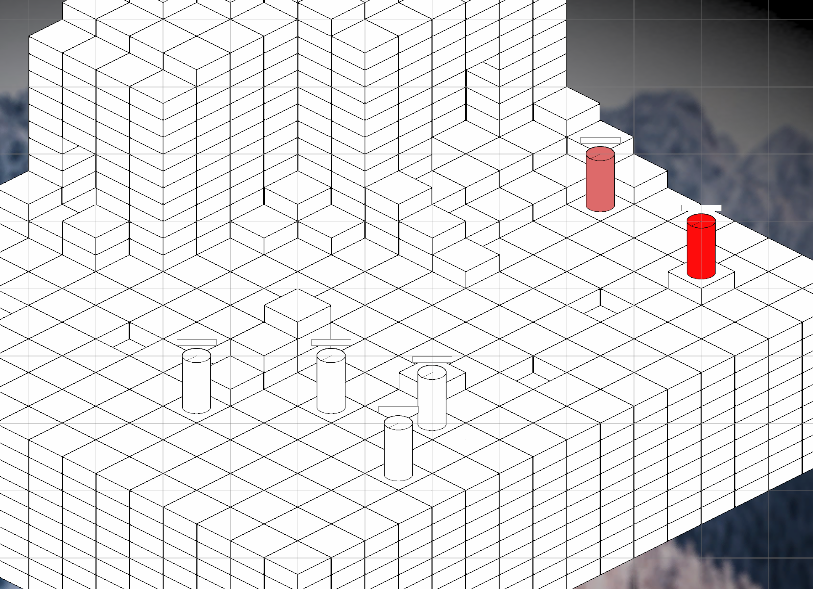
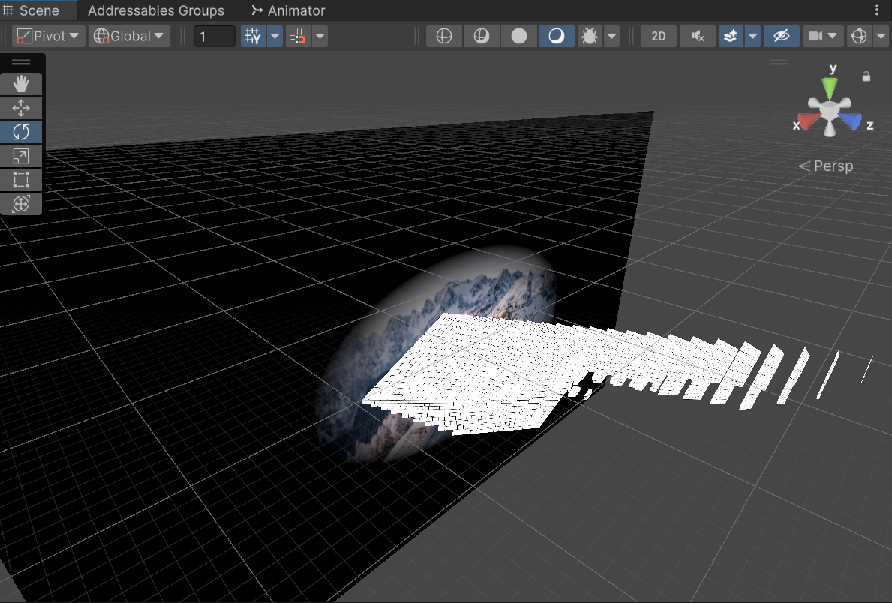
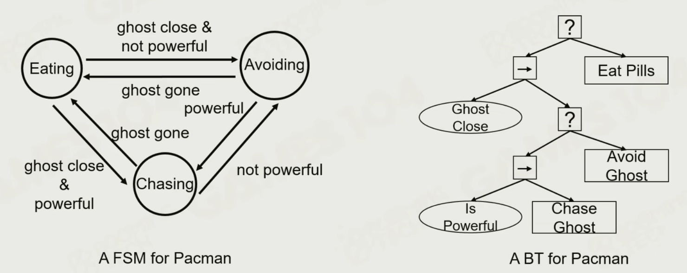
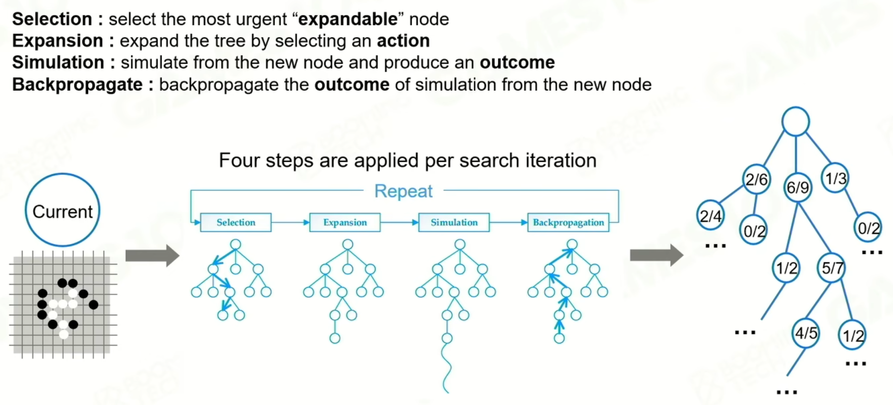
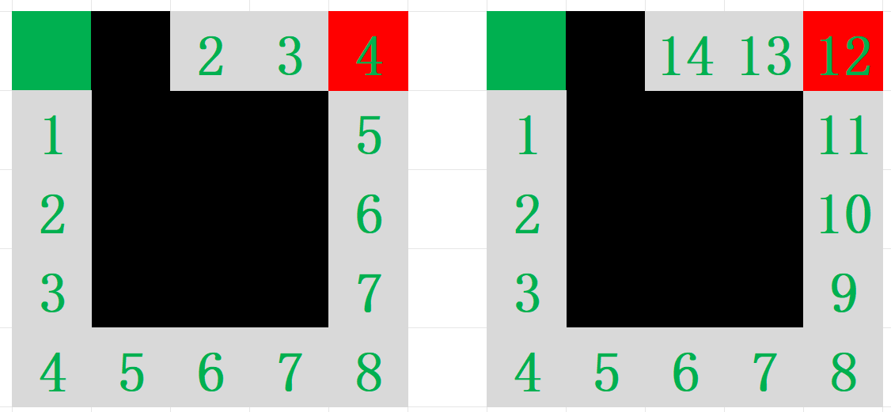
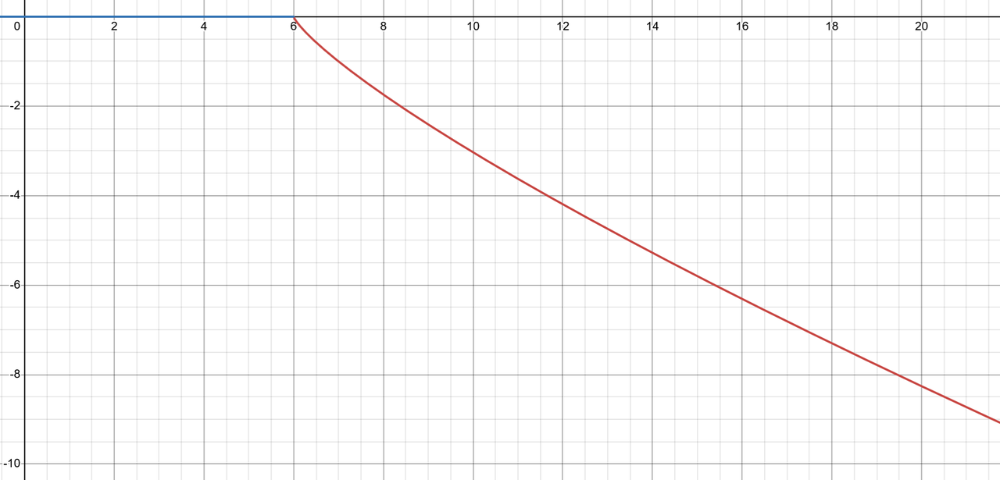
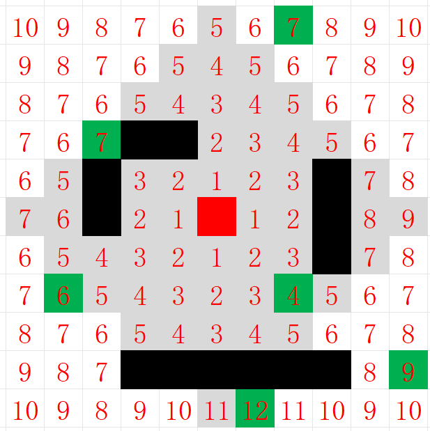

## 概述

- **本文主要讨论3D战棋游戏开发中容易遇到的共通性的问题，和Isometric Strategy项目中的部分情况及解决方法**
- **战棋游戏：基于网格，控制多名友方角色与多名敌人战斗**
  - 回合制最为常见（火焰纹章系列，XCOM等）
  - 也可能是其他的非即时制（三角战略，皇家骑士团等）
- **3D：基于3D网格（类似Minecraft）**
  - **本文讨论的前提是，地图不存在中空结构**
  - **在本文中，Z轴的正方向（而不是Y轴的正方向）对应游戏中的上方向**

## 物理检测



*左上图由正交相机拍摄得到，右上图由透视相机拍摄得到。其中的物体均通过SpriteRenderer渲染*

- **出于以下一或多个原因，开发者可能需要在战棋游戏中自行实现物理检测：**
  - **游戏并非即时制，且可能要让玩家在作出行动之前就知道结果，引擎中的API用起来不方便**
  - **游戏逻辑上是3D的，而实现是2D的（2D图像模拟3D），导致无法使用碰撞体**
  - **游戏中的碰撞检测逻辑上不复杂，但计算次数多，用碰撞体会产生性能问题**

### 线段与轴对齐长方体

$$
l:\mathbf r = \mathbf r_0 + u\mathbf (\mathbf r_1 -\mathbf r_0) \hfill \\
\mathbf r_0,\mathbf r_1:线段两个端点的坐标
$$

- **用参数方程表示射线，求射线进入、离开长方体的点**
- **即Liang-Barsky算法（略微改进）**

```C#
/// <summary>
/// 线段与轴对齐长方体求交
/// </summary>
/// <param name="min">轴对齐包围盒的六个顶点中，xyz均最小的点</param>
/// <param name="extend">轴对齐包围盒的大小</param>
/// <param name="from">线段起点</param>
/// <param name="to">线段终点</param>
/// <returns>如果有交点，返回true，并将from和to修改为两个交点；否则返回false</returns> 
public static bool LineSegmentCastBox(Vector3 min, Vector3 extend, ref Vector3 from, ref Vector3 to)
 {
     float uIn = 0, uOut = 1;	//进入、离开长方体的点的u值（u为参数方程中的参数）
     float u1, u2;
     Vector3 v = to - from;

     bool IntersectAndCheck(float p1, float p2, float p0, float q)
     {
         if (q == 0)
             return p0 >= p1 && p0 <= p2;

         u1 = (p1 - p0) / q;
         u2 = (p2 - p0) / q;
         if (u1 > u2)
             (u1, u2) = (u2, u1);
         uIn = Mathf.Max(uIn, u1);
         uOut = Mathf.Min(uOut, u2);
         return uIn < uOut;
     }

     if (IntersectAndCheck(min.x, min.x + extend.x, from.x, v.x)
         && IntersectAndCheck(min.y, min.y + extend.y, from.y, v.y)
         && IntersectAndCheck(min.z, min.z + extend.z, from.z, v.z))
     {
         to = from + uOut * v;
         from += uIn * v;
         return true;
     }
     return false;
 }
```

### 线段与轴对齐圆柱体

- **圆柱的轴线与Z轴平行**
- **先投影到XY平面，求线段和圆的交点，再判断交点的Z分量是否落在范围内**

```C#
/// <summary>
/// 线段与轴对齐圆柱体求交
/// </summary>
/// <param name="bottomCenter">圆柱体下表面中心点</param>
/// <param name="height">圆柱高度</param>
/// <param name="radius">圆柱半径</param>
/// <param name="from">线段起点</param>
/// <param name="to">线段终点</param>
/// <returns>如果有交点，返回true，并将from和to修改为两个交点；否则返回false</returns>
public static bool LineSegmentCastCylinder(Vector3 bottomCenter, float height, float radius, ref Vector3 from, ref Vector3 to)
{
    from -= bottomCenter;
    to -= bottomCenter;
    bool ret = LineSegmentCastCylinder(height, radius, ref from, ref to);  //转换为圆心在原点的问题
    from += bottomCenter;
    to += bottomCenter;
    return ret;
}

/// <summary>
/// 线段与轴对齐圆柱体求交（规定圆柱下表面中心点位于原点）
/// </summary>
/// <param name="height">圆柱高度</param>
/// <param name="radius">圆柱半径</param>
/// <param name="from">线段起点</param>
/// <param name="to">线段终点</param>
/// <returns>如果有交点，返回true，并将from和to修改为两个交点；否则返回false</returns>
private static bool LineSegmentCastCylinder(float height, float radius, ref Vector3 from, ref Vector3 to)
{
    float uIn = 0, uOut = 1;
    float u1 , u2;
    Vector3 v = to - from;
    //先投影到xy平面，求线段与圆的交点

    if(v.x == 0)
    {
        float d = radius * radius - from.x * from.x;
        if(d < 0)
            return false;
        float y1 = -Mathf.Sqrt(d);
        float y2 = -y1;
        u1 = (y1 - from.y) / v.y;
        u2 = (y2 - from.y) / v.y;
    }
    else
    {
        //y=kx+m
        float k = v.y / v.x;
        float m = from.y - k * from.x;
        //ax^2+bx+c=0
        float a = k * k + 1;
        float b = 2 * m * k;
        float c = m * m - radius * radius;
        float d = b * b - 4 * a * c;
        if(d < 0) 
            return false;
        float x1 = (-b - Mathf.Sqrt(d)) / 2 / a;
        float x2 = (-b + Mathf.Sqrt(d)) / 2 / a;
        u1 = (x1 - from.x) / v.x;
        u2 = (x2 - from.x) / v.x;
    }

    if (u1 > u2)
        (u1, u2) = (u2, u1);
    uIn = Mathf.Max(uIn, u1);
    uOut = Mathf.Min(uOut, u2);
    if (uIn >= uOut)
        return false;

    float z1 = from.z + uIn * v.z;
    float z2 = from.z + uOut * v.z;
    if( z1 >= 0 && z1 < height && z2 >= 0 && z2 < height)
    {
        to = from + u2 * v;
        from += u1 * v;
        return true;
    }
    return false;
}
```

### 线段与球体

- **用方程表示直线和球面，联立得到的方程组很容易求解**

### 射线与Mesh

- **先判断射线与网格的轴对齐包围盒是否有交点，有交点再逐个与三角形面求交**

**先与三角形所在平面求交，再判断是否位于三角形内:**
$$
以参数方程表示射线:\mathbf p = \mathbf o + t \mathbf d \quad (t>0) \hfill \\
以点法式表示平面:(\mathbf p -\mathbf p_0) \cdot \mathbf n = 0 \quad \mathbf p_0:平面内任意一点 \quad \mathbf n:单位法线 \hfill \\
则交点满足:(\mathbf o + t \mathbf d-\mathbf p_0)\cdot \mathbf n = 0 \Rightarrow t = \frac{(\mathbf  p'-\mathbf o)\cdot \mathbf n}{\mathbf b\cdot \mathbf n} \hfill \\
若t>0,求对应点\mathbf p_t,判断\mathbf p_t是否位于三角形内 \hfill \\
$$
**利用重心坐标判断是否有交点：**
$$
假设射线上一点在三角形P_0P_1P_2内部:\mathbf o+t\mathbf d=(1-b_1-b_2)\mathbf P_0+b_1\mathbf P_1 +b_2\mathbf P_2 \hfill \\
\Rightarrow 
\begin{bmatrix} t \\ b_1 \\ b_2 \end{bmatrix}
=\frac{1}{\mathbf s_1 \cdot \mathbf{P_1P_0}} 
\begin{bmatrix} 
\mathbf s_2 \cdot \mathbf{P_0P_2} \\ 
\mathbf s_1 \cdot \mathbf{P_0O} \\
\mathbf s_2 \cdot \mathbf d
\end{bmatrix} \quad 其中\mathbf s_1=\mathbf d \times \mathbf{P_0P_2},\mathbf s_2 = \mathbf{P_0O} \times \mathbf{P_0P_1} \hfill \\
若t>0,b_1>0,b_2>0,b_1+b_2 < 1,则射线与三角形有交点 \hfill \\
$$

### 曲线与几何体

- **数学上没有通用的解法，考虑将曲线离散化成点求近似解（求一系列点是否位于某种几何体内部）**

```C#
public static bool BoxOverlap(Vector3 min, Vector3 extend, Vector3 p)
{
    return p.x >= min.x && p.x < min.x + extend.x
        && p.y >= min.y && p.y < min.y + extend.y
        && p.z >= min.z && p.z < min.z + extend.z;
}
public static bool CylinderOverlap(Vector3 bottomCenter, float height, float radius, Vector3 p)
{
    if (p.z < bottomCenter.z || p.z >= bottomCenter.z + height)
        return false;
    float projSqrDistance = ((Vector2)(p - bottomCenter)).sqrMagnitude;
    return projSqrDistance < radius * radius;
}
```

### 大量物体物理检测优化

- **进行一次物理检测时，遍历所有地块效率很低**
- **为了实现游戏逻辑，通常会用字典存放所有的地块，这是一种直接的分块**
  - 三维数组？

- **利用分块，根据物体（地块、角色等）的几何约束简化物理检测；约束越严格，越有利于简化检测**
  - 物体大小没有约束？
  - 物体的长宽不超过1？
  - 物体的长宽高均不超过1？
- 以物体的长宽不超过1为例：
  - 对于线段与地块求交，确定线段覆盖的所有(X,Y)，在每个(X,Y)上遍历物体求交（遍历的方向取决于线段方向z分量的正负）
  - 对于离散点与地块求交，根据离散点所属的(X,Y)，遍历该位置上所有物体求交


```C#
/// <summary>
/// 获取第一个与有向抛物线相交的GridObject(自动忽略与from重合的物体)
/// </summary>
/// <param name="from">抛物线起点</param>
/// <param name="velocity">抛物线初速度</param>
/// <param name="g">重力加速度（沿Z轴负方向为正）</param>
public GridObject ParabolaCast(Vector3 from, Vector3 velocity, float g)
{
    List<GridObject> gridObjects = new();
    float deltaTime = Mathf.Max(1f / velocity.magnitude / GridPhysics.settings.parabolaPrecision, 0.01f);
    for (float t = 0f; ; t += deltaTime)
    {
        Vector3 point = from + t * velocity + t * t / 2 * g * Vector3.back;
        if (point.z < 0)	//项目中规定所有地块的高度大于等于0
            break;
        Vector2Int xy = new(Mathf.FloorToInt(point.x), Mathf.FloorToInt(point.y));
 		GetObjectsXY(xy, gridObjects);
        for (int j = 0; j < gridObjects.Count; j++)
        {
            if (gridObjects[j].Overlap(point) && !gridObjects[j].Overlap(from))
                return gridObjects[j];
        }
    }
    return null;
}

/// <summary>
/// 获取XY坐标上的所有物体（从上往下或从下往上）
/// </summary>
public void GetObjectsXY(Vector2Int xy, List<GridObject> objects, bool top_down = true)
{
    objects.Clear();
    //maxLayerDict记录了某个XY上，最高的地块的Z值，以便加速查询
    if (!maxLayerDict.ContainsKey(xy))
        return;
    if(top_down)
    {
        for (int layer = maxLayerDict[xy]; layer >= 0; layer--)
        {
            Vector3Int temp = xy.AddZ(layer);
            GridObject obj = GetObject(temp);
            if (obj != null)
                objects.Add(obj);
        }
    }
    else
    {
        for (int layer = 0; layer <= maxLayerDict[xy]; layer++)
        {
            Vector3Int temp = xy.AddZ(layer);
            GridObject obj = GetObject(temp);
            if (obj != null)
                objects.Add(obj);
        }
    }
}
```

## 行动策略AI

### 实现方式的选择



- **状态机：人为规定的若干条规则控制状态切换，更偏向于反应、按固定模式行动**
  - **适用于选项固定且选项较少的情况**
  - **行动逻辑高度可控，且容易修改**
- **行为树：与状态机类似，形式上更灵活，更适合处理相对复杂的逻辑**
- **基于结果的评分：明确各种行动可能产生的所有结果，给出所有类型的结果的评分规则，选择评分最高的行动来执行**
  - **能处理选择不固定或选项极多的情况，但制定一套相对合理的评分规则极其困难（根据当前战况来评分，却必须有预见性）**
  - **程序实现相对简单，需要引入充分数量的可调参数以便控制行动逻辑**



- **蒙特卡洛树搜索：理论上合适的方法，具有高度预见性**
  - **实现成本极高，计算成本极高；战棋的规则比围棋复杂得多，表示状态和模拟状态的变化也复杂得多**
  
- **机器学习**

### 基于结果的评分

- **明确所有技能可以产生的所有效果：**
  - 对单位造成伤害/回复
  - 消灭单位
  - 召唤单位
  - 修改单位的某种状态的持续时间
  - 使单位某种资源改变
  - 使单位的位置改变

#### 基本评分规则

$$
V(e,\beta,\alpha)=P(\alpha)P(\beta)V(e,\beta,\beta) \hfill \\
P(\alpha)=
\begin{cases}
1 \quad \alpha属于友方阵营 \\
0  \quad \alpha属于中立阵营 \\
-1 \quad \alpha属于敌方阵营 \\
\end{cases} \hfill \\
e:行为产生的结果 \quad \alpha:行为的实施者 \quad \beta:行为的承受者 \quad
V(e,\beta,\alpha):[对\beta造成e]这件事对\alpha而言的价值 \hfill \\
\\
V(e,\beta,\beta) 的值人为规定 \hfill \\
$$

- 对单位造成伤害：失去1生命对受伤者的基础价值为-1
  - 可以让每失去1生命的价值的绝对值，随受伤者现有生命百分比降低而提高
- 消灭单位：对被消灭单位的价值为-100
- 召唤单位：根据单位的强度人为规定价值
- 修改单位的某种状态的持续时间：根据状态的作用、时间的改变量人为规定价值
  - 例如，某状态持续时间100，不能叠加只能刷新
- 使单位的某种资源改变：根据资源的作用人为规定价值
  - 在这里，资源指各种施法资源，不像状态那样有持续时间，而是一直持有
  - 要考虑如何避免AI一直获取资源，而不前进（比如设置资源上限）

- 使单位的位置改变：见下文

#### 评分规则的预见性

**状态的价值：**

- **状态有持续时间，因此离敌人较近时，施加状态才有意义**
- **多用函数、函数式编程，而不是单纯的变量**
  - 行为会改变，如何方便地编辑？


```c#
public class BuffSO : ScriptableObject
{
    public int duration;

    public float primitiveValue;
    public ValueModifier modifier;

    /// <summary>
    /// 假设victim被施加了此状态，由victim考虑此事对自身的价值
    /// </summary>
    public float ValueForVictim(PawnEntity victim)
    {
        if (modifier != null)
            return modifier.CalculateValue(primitiveValue, victim);
        return primitiveValue;
    }
}

public abstract class ValueModifier : ScriptableObject
{
    /// <summary>
    /// 假设某事发生在victim上，由victim考虑这件事对自己的价值
    /// </summary>
    public abstract float CalculateValue(float primitiveValue, PawnEntity victim);
}

public class ValueModifier_EnemyAlly : ValueModifier
{
    public int radius;
    public float amplitude_enemy;
    public float amplitude_ally;

    //价值=k×原始价值
    //k初始为0，取值范围为[0,1]
    //半径radius内的每个敌人至多使k提高amplitude_enemy
    //每个友方则至多使k降低amplitude_ally
    public override float CalculateValue(float primitiveValue, PawnEntity victim)
    {
        float DistanceValue(PawnEntity pawn)
        {
            int distance = IsometricGridUtility.ProjectManhattanDistance(
                (Vector2Int)victim.GridObject.CellPosition, 
                (Vector2Int)pawn.GridObject.CellPosition);
            return 1f / distance;
        }

        List<PawnEntity> enemeis = victim.Sensor.enemies;
        List<PawnEntity> allies = victim.Sensor.allies;
        float k = 0;
        for (int i = 0; i < enemeis.Count; i++)
        {
            k += amplitude_enemy * DistanceValue(enemeis[i]);
        }
        for (int i = 0; i < allies.Count; i++)
        {
            k += amplitude_ally * DistanceValue(allies[i]);
        }
        return Mathf.Clamp01(k) * primitiveValue;
    }
}
```


**位置改变的价值：**



*左上图表示各点到某角色的曼哈顿距离，右上图表示各点移动到某角色将经过的距离*


$$
g(x,y)= 
\begin{cases}
0 \quad d(x,y) \le dr(x) \\
-[d(x,y)-dr(x)]^{0.8} \quad d(x,y) > dr(x) \\
\end{cases} \\
d(x,y):从x移动到y的距离 \quad dr(x):x的最佳威胁距离 \\ \\ 
h(x)=\frac{1+\mathrm{HP}(b_k)}{2} \quad i(x)= \frac{2-\mathrm{HP}(b_k)}{2}\\ \mathrm{HP}(x):x当前\mathrm{HP}与最大\mathrm{HP}的比值 \\ \\ 
友方角色记为a_1,a_2,...,a_m;敌方角色记为b_1,b_2,...,b_n;假设当前将要移动的是b_k: \\ 
R(b_k)=-h(b_k)r(b_k)\sqrt[4]{\sum_{i=0}^m [g(b_k,a_i)]^4} \quad S(b_k)=\sqrt[4]{\sum_{i=0}^m [h(a_i)r(a_i)g(a_i,b_k)]^4}  \\ 
F(b_k)=k_1R(b_k)+k_2S(b_k) \\ 
r(x):x的进攻能力 \quad F(b_k):阵型分 \quad k_1,k_2:大于0的系数 \\
注:R(b_k)总是为负数,绝对值越大阵型越差;S(b_k)总是为正数,绝对值越大阵型越好 \\
$$

- **每个单位有最合适的到对方单位的距离（理论上取决于攻击范围）**
- **离得很远时，接近对方单位的价值相对较小，但我们可能不希望NPC龟缩**
- **血量越高，进攻倾向越强，撤退倾向越低；反之亦然**
- **接近n个单位的价值，不应该是接近1个单位的价值的n倍**

#### 个体差异性和可控性

$$
F(b_k)=[a+a(b_k)]R(b_k)+[d+d(b_k)]S(b_k)  \hfill \\
a:全局进攻系数 \quad a(b_k):b_k个性中的进攻系数 \quad d:全局防守系数 \quad d(b_k):全局防守系数 \hfill \\
$$

- **应当引入充分数量的可调参数，使得策划可以控制每个个体的差异**

## 寻路

- **地图是3D的，但本文讨论的前提是，人只能站在空地上，因此一个XY位置上只可能有一个人；因此依然适合使用A*寻路（以及其他基于2D网格的寻路算法）**

- **战棋游戏中有移动力、穿行、跳跃、飞行、困难地形、AI等多种与寻路有关的功能需求，高度灵活的算法能够适应多样的需求**

### A*算法可变内容

- **权重系数：$FCost = HCost + w * GCost$**
  - **默认情况下，$w=1$，即标准A*算法**
  - **$w = 0$时退化为迪杰斯特拉算法**
  - **$w>1$时效率更高，但未必找到最短路径**
- **获取相邻节点的方式：默认为获取相邻四节点**
- **地块不能简单地分为障碍和可通行地块**
- **移动者：一种抽象概念，包含以下参数/函数**
  - **移动检查：判断移动者能否从某个位置移动到另一个位置**
    - **高度差过大时，不能移动（关联角色的攀爬力、下落力）**
    - **默认情况下，移动者可以穿过友方单位，而不能穿过敌方单位**
  - **停留检查：判断移动者能否最终停留在某个位置**
    - **移动者不能停留在其他单位所在格**
  - **移动开销计算：计算从某个位置移动到另一个位置带来的移动力开销**
    - **困难地形带来更大的移动力开销（某些单位无视困难地形）**
  - **移动力：一次移动中能走过的最大“距离”（计算路径时依然必须考虑移动力以外的区域）**

### 具体需求及处理方式

| 需求               | 权重系数 | 寻路目标         | 移动检查                 | 停留检查       | 其他调整               |
| ------------------ | -------- | ---------------- | ------------------------ | -------------- | ---------------------- |
| **计算移动路径**   | $\ge 1$  | 移动技能释放位置 | 默认                     | 默认           |                        |
| **计算可达范围**   | 0        | 任意不可达点     | 默认                     | 默认           |                        |
| **计算角色间距离** | 0        | 任意不可达点     | 额外考虑跳跃，可穿过单位 | 可停留在单位上 | 获取相邻节点时考虑跳跃 |



*计算一个角色移动到其他各个角色的距离，类似流场寻路*

## 参考

GAMES101,Lecture13:https://www.bilibili.com/video/BV1X7411F744

GAMES104,第十六、十七节:https://www.bilibili.com/video/BV1r34y1J7Sg
