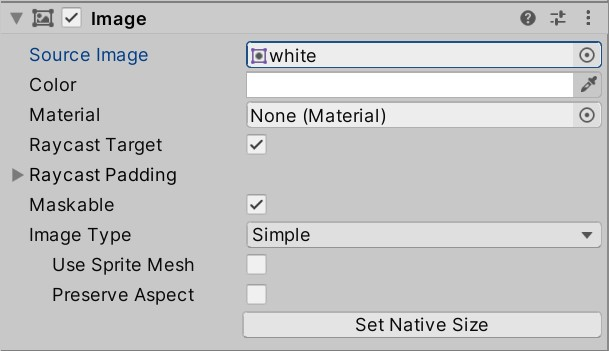
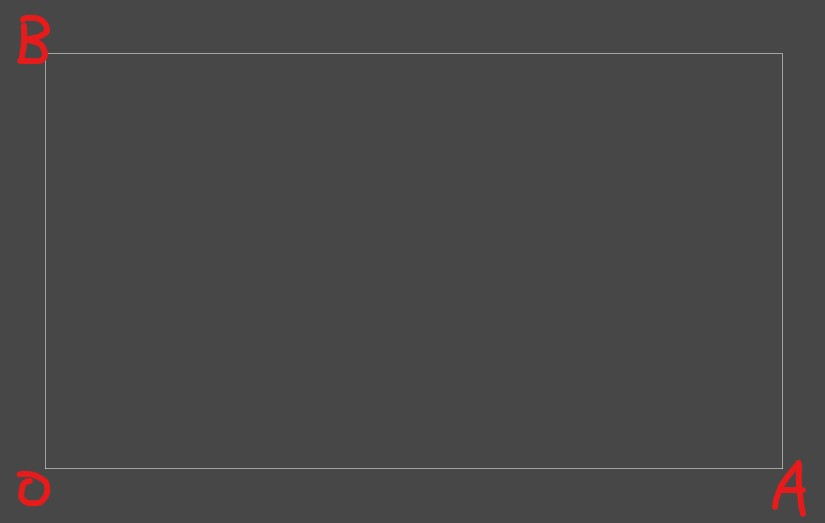
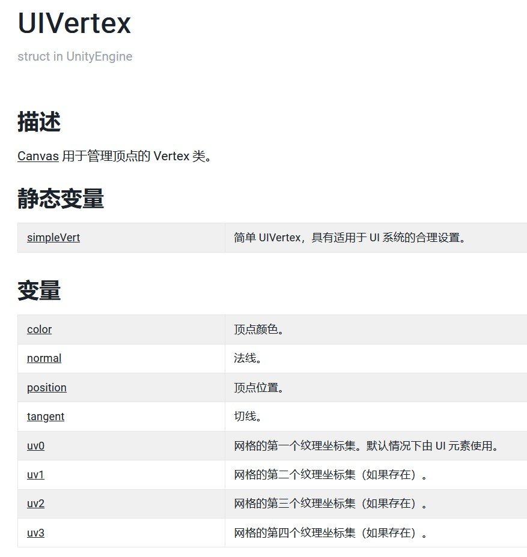
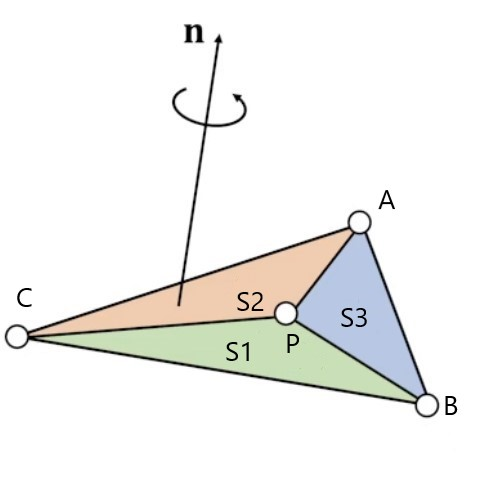

# Image组件



- Raycast Padding：射线检测的区域外扩或内缩
- Image Type：绘图方式
  - Simple：矩形网格或使用图片本身的网格
  - Sliced：图片分割成九宫格，每块的”缩放程度“不同（修改uv）
  - Tiled：图片重复使用（修改uv）
  - Filled：图片逐渐填充（修改网格形状）


## UI坐标与世界坐标




- Canvas（非World Space）下的游戏物体和一般游戏物体的**世界坐标**使用的是同一套坐标系，只是**世界坐标到屏幕坐标的映射**不同
- 对于有RectTransform的游戏物体，rectTransform.position和transform.position，rectTransform.localPosition和rectTransform.localPosition相同
- 如上图，Scene窗口有一个标出屏幕范围的框。若屏幕为1920×1080，几个点的世界坐标为O(0,0)，A(1920,0)，B(0,1080)

## UIVertex类




## Image组件运行过程（部分）

1. 修改Image的数据，导致Image被设为dirty
2. 调用OnPopulateMesh更新mesh（更新各顶点的位置、颜色、uv等，以及三角形）
3. 渲染一个属于Image的mesh的片元时：
   1. 计算该片元在所属的三角形中的重心坐标
   2. 通过插值求出此片元的颜色、uv、法线等

## 重心坐标


$$
有符号面积：S1 = \frac{1}{2}(\mathbf P - \mathbf C) \times (\mathbf P - \mathbf B) \cdot \mathbf n \\(\alpha,\beta,\gamma) = (\frac{S1}{S},\frac{S2}{S},\frac{S3}{S}) \\线性插值：\mathbf P = \alpha \mathbf A + \beta \mathbf B + \gamma \mathbf C \\P在三角形ABC内 \Leftrightarrow \alpha,\beta,\gamma>0
$$

## OnPopulateMesh

```c#
protected override void OnPopulateMesh(VertexHelper toFill)
{
    if (activeSprite == null)
    {
        base.OnPopulateMesh(toFill);
        return;
    }

    switch (type)
    {
        case Type.Simple:
            if (!useSpriteMesh)
                GenerateSimpleSprite(toFill, m_PreserveAspect);
            else
                GenerateSprite(toFill, m_PreserveAspect);
            break;
        case Type.Sliced:
            GenerateSlicedSprite(toFill);
            break;
        case Type.Tiled:
            GenerateTiledSprite(toFill);
            break;
        case Type.Filled:
            GenerateFilledSprite(toFill, m_PreserveAspect);
            break;
    }
}
```

**GenerateFilledSprite片段**

```C#
 if (m_FillMethod == FillMethod.Horizontal || m_FillMethod == FillMethod.Vertical)
 {
     if (fillMethod == FillMethod.Horizontal)
     {
         float fill = (tx1 - tx0) * m_FillAmount;

         if (m_FillOrigin == 1)
         {
             v.x = v.z - (v.z - v.x) * m_FillAmount;
             tx0 = tx1 - fill;
         }
         else
         {
             v.z = v.x + (v.z - v.x) * m_FillAmount;
             tx1 = tx0 + fill;
         }
     }
     else if (fillMethod == FillMethod.Vertical)
     {
         float fill = (ty1 - ty0) * m_FillAmount;

         if (m_FillOrigin == 1)
         {
             v.y = v.w - (v.w - v.y) * m_FillAmount;
             ty0 = ty1 - fill;
         }
         else
         {
             v.w = v.y + (v.w - v.y) * m_FillAmount;
             ty1 = ty0 + fill;
         }
     }
 }

s_Xy[0] = new Vector2(v.x, v.y);
s_Xy[1] = new Vector2(v.x, v.w);
s_Xy[2] = new Vector2(v.z, v.w);
s_Xy[3] = new Vector2(v.z, v.y);

s_Uv[0] = new Vector2(tx0, ty0);
s_Uv[1] = new Vector2(tx0, ty1);
s_Uv[2] = new Vector2(tx1, ty1);
s_Uv[3] = new Vector2(tx1, ty0);
```

## 参考

https://docs.unity.cn/cn/2022.1/Manual/UnityManual.html

https://github.com/Unity-Technologies/uGUI

## 项目地址

https://gitee.com/xu-kechen/mesh-extend
