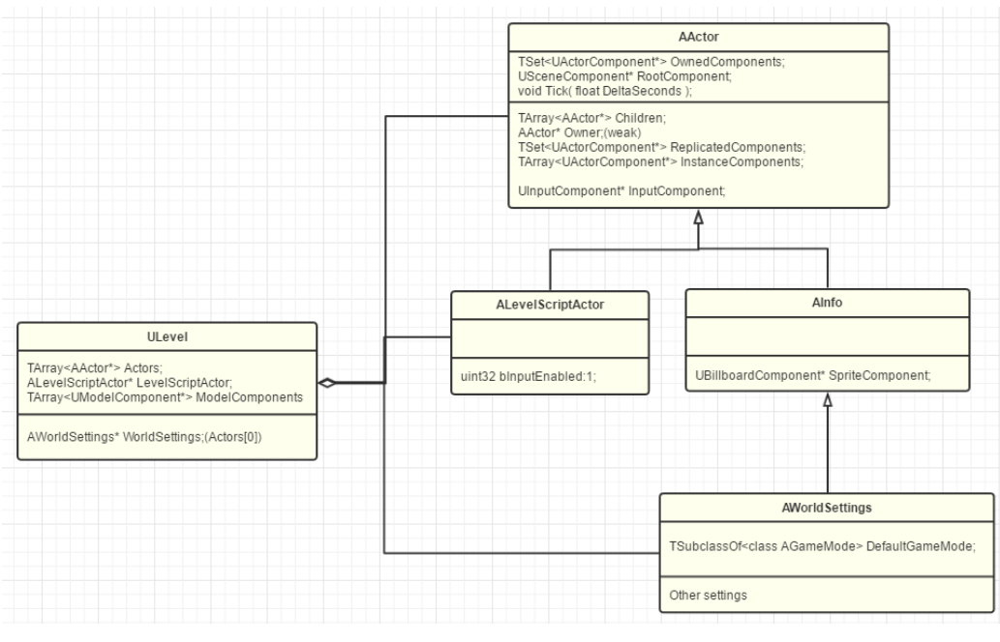
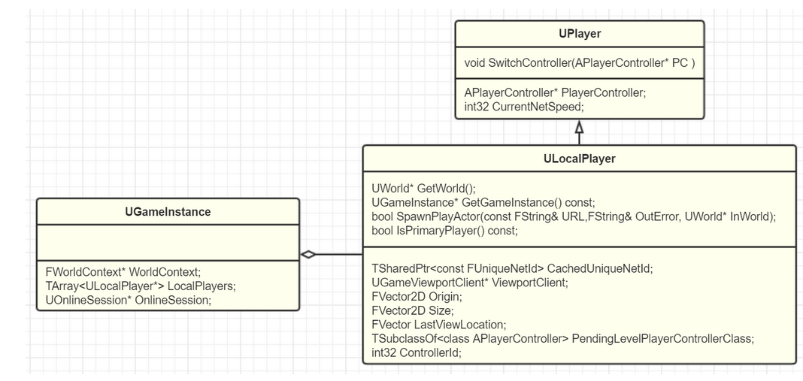
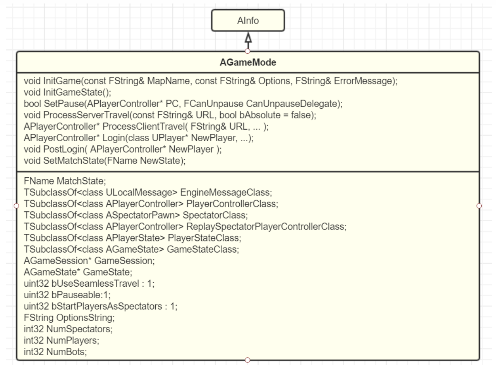
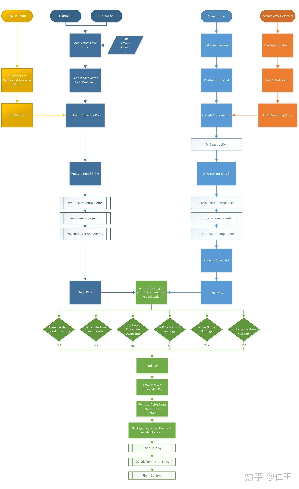
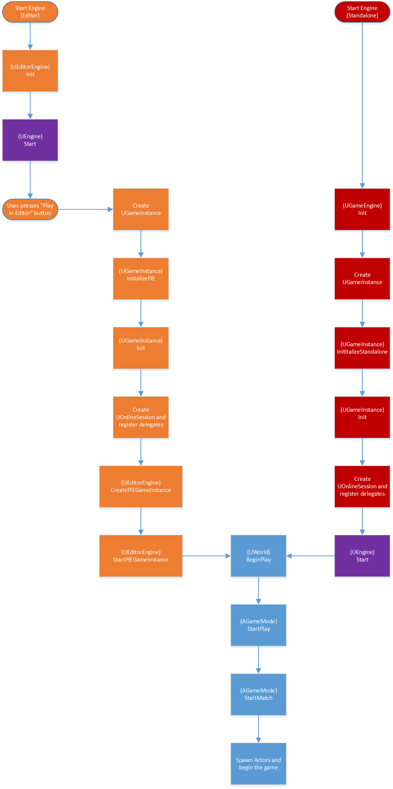

## 代码框架

### UObject

- Unreal中所有类的父类
- 提供序列化、反射、自动内存分配回收

### AActor

- 具有Tick函数、父物体(Owner)、子物体(Children)、组件(InstanceComponents)
- 不一定有Transform但有便捷的方法来访问其position或rotation
- Actor被实例化时，其OwnedComponents也被实例化为InstanceComponents，网络复制时产生ReplicationComponents，InstanceComponents中通常包含一个SceneComponent(只有包含此组件才能被放入Level中)作为RootComponent

### UActorComponent

- 组件，包含RecieveTick函数、拥有者(OwnerPrivate)、所处的世界(WorldPriavte)
- 组件有嵌套关系

### ULevel

- 场景，包含AActor
- 每个场景必然包含一份AWorldSettings，必定是Actors数组中的0号元素
- 可用于分块加载

### AWorldSetting

- 包含若干AGameMode

### UWorld

- 包含多个场景，每个场景中包含若干ULevel
- CurrentLevel为当前控制的类，PersistentLevel为永久存在的类（所以使用此Level的WorldSetting作为**全局关卡设置**）
- UWorld可以有多个，但同时只能运行一个

### APawn

- 受到Controlle控制(每个Pawn有默认的Controller)
- 具有移动和接收输入的功能

### ACharacter

- 在APawn的基础上，具有人形(网格、碰撞体、骨骼蒙皮)

### AController

- 控制一个Pawn，并不是死绑定的，可以切换操控的角色
- 通常将输入相关的逻辑写在这里

### APlayerState

- 默认包含分数和PlayerId(可用作标识符，尤其在网络同步中)
- 通常将其他状态信息写在这里
- HUD通常也写在这里

### UPlayer

- 不是Actor，用于保存与Player有关的信息及网络同步

### UEngine

### AGameMode

- 游戏模式，通常将Level的切换规则写在这里，每个关卡都可使用若干GameMode(同时只能由一个生效)
- 如果WorldSettings中的GameMode为NULL，会使用默认的GameMode
- 继承自AGamemodeBase，逻辑不复杂时，继承AGamemodeBase即可
- 在这里设置APlayerController

### AGameState

- 关卡状态，生命周期与Level相同
- 通常，UGameInstance中的字段觉得AGameState，AGameMode用AGameState作为关卡切换的依据

### UGameInstance

- 唯一的，包含与整个游戏有关的信息，生命周期为整个游戏

### ISaveGameInstance

- 包含存档、读档、删档等接口

## Actor生命周期

## 游戏运行过程

# UMG

## 分类

- UPanelWiget：可以有多个子控件
- UWiget：不能有子控件（按钮是特例，有一个子控件）

UMG不是Actor，无法直接置入Level中，需要某些Actor控制UMG的生命周期

## 位置

### 单点对齐

- 以锚点为原点，控件的**对齐点**的坐标为位置
- 对齐点受Alignment控制（类似Sprite Editor里的锚点，相对值）

### 一边对齐

假设与上边对齐

- 只剩y坐标，x坐标变成了两个(控件左边到屏幕左侧的距离、控件右侧到屏幕右侧的距离)
- 不存在对齐点？

# 动画

## Animation Sequence

## Blend Space

## 动画叠加

- 动画混合是 (k1 A + k2 B)/(k1+k2)，动画叠加是(A - C) + B
- 设定了一个动画的Additive Anim Type及基础姿势，即表明该动画为A，基础姿势为C
- 之后通过蓝图节点或蒙太奇指定B

## 蒙太奇

- 若干段动画的结合，有多个插槽，每个插槽上可放置若干动画，还将整个时间轴分为若干片段
- 播放蒙太奇时，可指定插槽，可利用片段进行复杂的流程控制
- 蒙太奇不是持续播放的动画，而是插入动画。在原本的动画输入输出间插入一个蒙太奇节点，效果是，调用播放蒙太奇动画时，蒙太奇动画覆盖原有动画，否则播放原有动画

## 姿势

- 特指蒙皮动画的一帧
- 可以从动画中截取一帧，生成姿势

