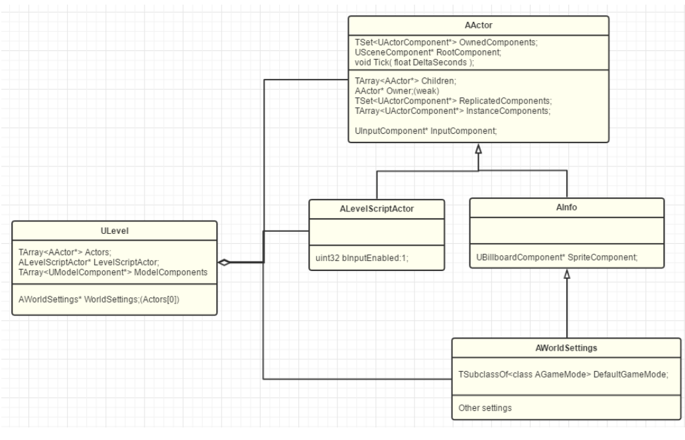
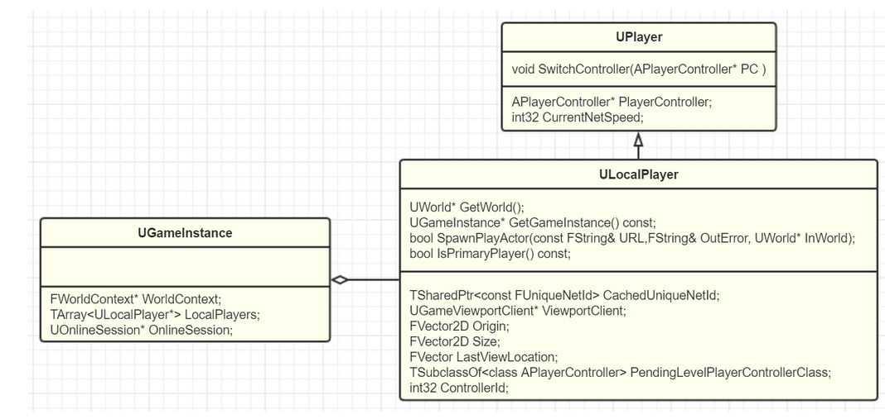
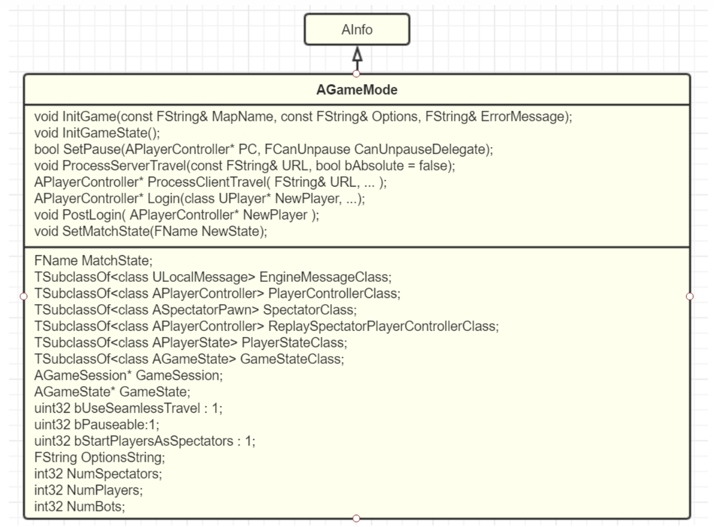
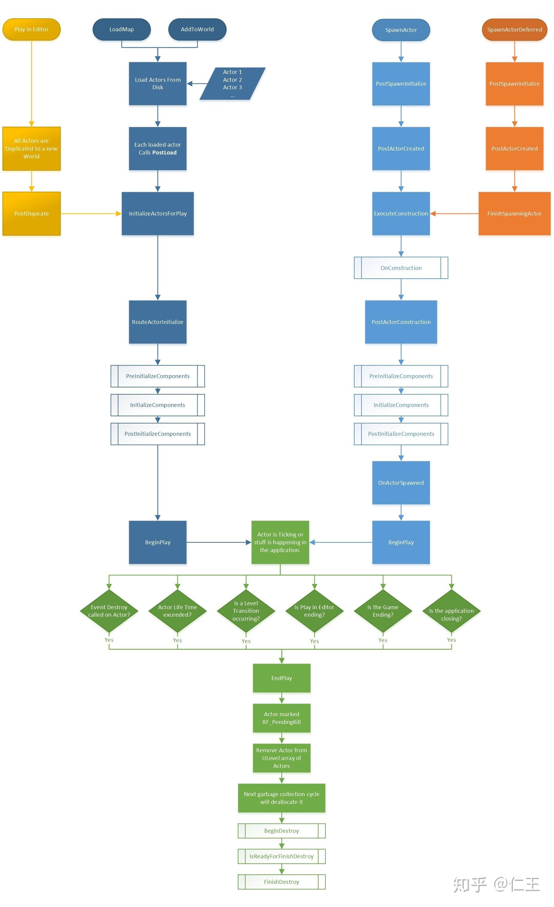
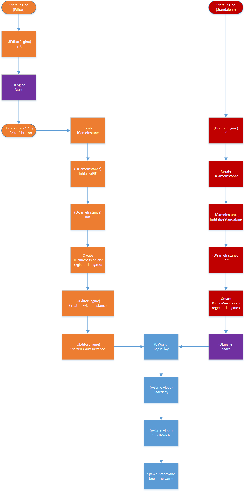

# C++

## Class Default Object

- 所有`UObject`的所有子类都分别持有一个的，作为模板存在的类实例
- 其中包含了类中各变量的默认值，但通常不应该直接修改，而应该在`PostInitProperties`或后续函数中覆盖
- 构造新`UObject`实例时，将其CDO的占用的整块内存直接复制一份，而不必执行完整的构造逻辑，以实现**高效创建**

## GC

- 使用**标记-清除**算法
  - GC执行时，要求进程**完全暂停**
  - **不分代**；需要遍历所有`UObject`，而不是所有堆对象
  - 回收后**不压缩**（不将不连续分布的对象移动到一起），导致内存碎片增多，进而导致更频繁的申请更大内存
  - 开发者无法自行实现压缩，只能尽量减少GC，减少内存分配（如对象池）
- `Uobject`的GC必须由引擎管理
  - 任何情况下都不应该定义`UObject`类实例（即不能分配到栈上）
  - 对于本地变量、函数参数，可以定义`UObject`指针或引用（如果确定存在）
    - 要确保作用域内`UObject`存活，可使用`TStrongObjectPtr`

  - `UObject`类中，所有作为成员变量的`TObjectPtr<UObject>`应该由`UPROPERTY`修饰，这样才受引擎管理
  - 原生C++类中可以`Uobject`指针成员不能直接delete
    - 可以令原生类继承`FGCObject`，然后显式将成员注册到`Collector`
    - 也可以用`TStrongObjectPtr`，确保生命周期内`UObject`存活

- 原生C++对象必然不参与标记-清除，可以自行GC，或使用智能指针
- UE会自动检查引用关系并创建**GC集群（Cluster）**
  - 如果有若干个`UObject`实例仅被某一`UObject`实例引用，那么它们构成集群，该`UObject`是集群的Root
  - 检查集群是否存活时，仅检查Root是否存活即可

- UE使用一个`GUObjectArray`维护所有受引擎GC管理的对象
  - 是一个连续数组，其中每个元素是一个结构体，包含对象指针、GC状态等信息
  - 所有`UObject`有`InternalIndex`成员，表示它在`GUObjectArray`中的索引
  - 编译阶段每个类会生成`ReferenceTokenStream`，确定受引擎GC管理成员以及它们在类内的偏移量，以便GC时快速检索
  - `GUObjectArray`只能添加元素，不会删除已经不存活的元素（这也确保`InternalIndex`的有效性）

- Roots：垃圾回收器完全确定当前不会被回收的对象
  - 静态变量，栈上变量等
  - `AddRoots`显式添加的对象
  - `UWorld`，`UGameInstance`，CDO等引擎自动添加的永久对象
- 流程：
  1. 遍历`GUObjectArray`，将其中所有元素标记为“不可达”
  2. 确定Roots，从Roots出发，根据`ReferenceTokenStream`，找到所有存活的`UObject`对象，将其标记为“可达”
  3. 遍历`GUObjectArray`，将“不可达”对象占用的内存释放
- 使用**增量式GC**，即把一轮内GC内的工作**分配到多帧进行**
  - 性能要求极高的场景，可以通过**预分配内存+临时禁用GC**，进一步分摊GC成本

## 核心

### UObject

- 所有引擎对象的父类
- 提供反射，序列化，GC，编辑器拓展相关的功能

### UProperty

- `UProperty`是用于实现反射的类，`UPROPERTY`宏用于修饰`UObject`指针成员
- `UPROPERTY()`的部分“参数”：
  - 编辑器访问权限
  - 蓝图访问权限
  - 配置和存储
  - 元数据

### Actor

- 指`AActor`及其子类实例，以及派生出的蓝图类
- 只有Actor能直接放到场景中，地位类似`GameObject`，但自身也有一些逻辑（一般只有整个Actor共享的逻辑/数据）

生命周期（按顺序）：

| 函数                       | 含义/调用时机      | 说明                                             |
| -------------------------- | ------------------ | ------------------------------------------------ |
| `SpawnActor<T>`            | 动态创建Actor      | 还有其他创建方式                                 |
| `PostInitProperties`       | 构造后             | 构造时直接复制CDO                                |
| `PostSpawnInitialize`      |                    |                                                  |
|                            |                    |                                                  |
| `PostActorCreated`         | 动态创建后         | 与`PostActorCreated`，`PostDuplicate`互斥        |
| `PostLoad`                 | 从硬盘加载后       | 适用于人为放到场景中的物体                       |
| `PostDuplicate`            | 复制后             | 仅在编辑器模式下，完全取代`PostActorCreated`     |
|                            |                    |                                                  |
| `UWorld::AddActor()`       |                    | 将`Tick`注册到`FTickTaskManager`                 |
| `PreInitializeComponents`  | 组件初始化之前     |                                                  |
| `InitializeComponents`     | 通知所有组件初始化 |                                                  |
| `PostInitializeComponents` | 所有组件初始化后   |                                                  |
|                            |                    |                                                  |
| `BeginPlay`                | 第一次`Tick`之前   |                                                  |
| `Tick`                     | 每帧               | 用TickGroup控制调用时机，一个Actor只有一个`Tick` |
|                            |                    |                                                  |
| `EndPlay`                  | 销毁前             |                                                  |
| `Destroyed`                | 销毁后             |                                                  |

- 以上所有生命周期函数，都**严格分阶段串行调用**；同时创建/运行/销毁的一系列物体，
- Actor没有禁用状态，但可以直接`SetActorTickEnabled`

### Component

- 指`UActorComponent`及其子类对象，以及派生出的蓝图类
- Component挂载在Actor上，地位类似`MonoBehaviour`

生命周期（按顺序）：

| 函数                  | 含义/调用时机                 | 说明                                                 |
| --------------------- | ----------------------------- | ---------------------------------------------------- |
| `PostInitProperties`  | 构造后                        |                                                      |
| `InitializeComponent` | 初始化                        |                                                      |
|                       |                               |                                                      |
| `OnRegister`          | 所属的`Actor`注册到`UWorld`时 |                                                      |
| `BeginPlay`           | 第一次`Tick`之前              |                                                      |
| `TickComponent`       | 每帧                          | 用TickGroup控制调用时机，一个Component只有一个`Tick` |
|                       |                               |                                                      |
| `EndPlay`             | 销毁前                        |                                                      |
| `Destroyed`           | 销毁后                        |                                                      |

### Level

- 指`ULevel`实例，不应该继承此类
- `ULevel`用一个数组记录其中的所有Actor，其中的0号元素是`AWorldSetting`（当某个关卡被用作主关卡时，其`AWorldSetting`对World生效）
- 额外持有一个特殊的Actor，`ALevelScriptActor`，是关卡蓝图的父类

### World

- 指`UWorld`实例，不应该继承此类
- World中可以包含若干个Level，运行时动态变化

### FTickTaskManager

- 统一调度所有Actor和Component的`Tick`，构建了基于依赖关系的Task Group
  - `TickGroup`控制基本的`Tick`时机
  - 可以人为设置依赖关系（`AddTickPrerequisiteActor`），控制同一`TickGroup`内的顺序
  - 默认情况下子Actor自动依赖父Actor，组件自动依赖所属的Actor

| Tick Group          | 枚举值 | 用途                                                    |
| ------------------- | ------ | ------------------------------------------------------- |
| `TG_PrePhysics`     | 0      | 大部分 Actor 的 Tick。输入处理、AI 决策、动画参数设置   |
| `TG_StartPhysics`   | 1      | 物理模拟启动前的特殊处理                                |
| `TG_DuringPhysics`  | 2      | 物理模拟异步执行，TG_DuringPhysics 中的 Tick 与物理并行 |
| `TG_EndPhysics`     | 3      | 物理结果处理（接收碰撞回调时）                          |
| `TG_PostPhysics`    | 4      | 基于物理结果更新状态。移动摄像机、更新 IK               |
| `TG_PostUpdateWork` | 5      | 动画后处理、Finalize 阶段的更新                         |
| `TG_LastDemotable`  | 6      | 低优先级 Tick（可被降频）                               |
| `TG_NewlySpawned`   | 7      | 本帧新生成的 Actor 的首次 Tick                          |

### GameMode

- 通常用于规定规则（游戏开始结束，获胜条件，关卡切换，玩家加入、重生等）
- 仅存在于服务器端

### GameState

- 指`GameStateBase`及其子类（`AGameState`适用于竞技类比赛）
- 通常包含`GameMode`相关的游戏数据（默认包含玩家列表，当前`GameMode`，当前游戏状态等数据；可人为添加其他数据）
- 由服务器发给客户端

# 蓝图

- 几类资源文件的统称，与C++协同使用（非必须）

- 各种蓝图资产中，与程序有关的部分会**增量编译**成**字节码**，由**蓝图虚拟机**运行
  - 和C++程序相比，编译更快，执行更慢；因此更适合实现表层的、经常修改的逻辑
- **蓝图虚拟机**：引擎中内置的C++程序，能执行一些底层的原子操作（读写变量，调用C++函数，跳转等）
  - 蓝图中的各种逻辑需要编译成由这些底层指令和数据组成的**字节码**

## 蓝图类

- 蓝图资产的一种，**概念上单继承**自一个C++类，但本身**不是C++类**
  - 编译而得的机器码在类的上下文中运行（可访问父类成员），以体现继承、多态
  - 能够通过**蓝图接口**绕开单继承的限制
- 除了程序，还有类似Prefab的功能（如设置参数默认值），且不同蓝图类的编辑窗口不同（如Actor蓝图中可设置Component）
- 要让蓝图访问C++类成员，需要用`UCLASS`宏修饰类，设为对蓝图可见
  - 静态函数和成员函数需要用`UFUNCTION`修饰，设为对蓝图可见
    - 调用成员函数需要指定实例(Target)，如果是父类的成员函数，Target默认为self

  - 成员变量需要用`UProperty`修饰，设为对蓝图可见

| UPROPERTY参数        | 含义           |
| -------------------- | -------------- |
| `EditAnyWhere`       | 编辑器中可修改 |
| `VisibleAnyWhere`    | 编辑器中只读   |
| `EditDefaultsOnly`   | 只能保持默认值 |
| `BlueprintReadWrite` | 蓝图中可读写   |

| UFUNCTION参数                 | 含义                           |
| ----------------------------- | ------------------------------ |
| `BlueprintCallable`           | 蓝图中可调用                   |
| `BlueprintPure`               | 纯函数（不能调用其他非纯函数） |
| `BlueprintImplementableEvent` | 留给蓝图实现的纯虚函数         |

## 关卡蓝图

- 一个特殊的蓝图类（继承自`ALevelScriptActor`)，仅存在于关卡文件中
- 用于实现关卡特有的逻辑，通常应该让蓝图类来获取关卡蓝图，并在关卡蓝图中定义一些事件

## 蓝图接口

- 类似抽象类，蓝图类实现蓝图接口，以实现多继承
- 其中定义纯虚函数，蓝图实现接口时，显示为事件（？）

## 动画蓝图

## 控件蓝图

## 代码框架

### UObject

- Unreal中所有类的父类
- 提供序列化、反射、自动内存分配回收

### AActor

- 具有Tick函数、父物体(Owner)、子物体(Children)、组件(InstanceComponents)
- 不一定有Transform但有便捷的方法来访问其position或rotation
- Actor被实例化时，其OwnedComponents也被实例化为InstanceComponents，网络复制时产生ReplicationComponents，InstanceComponents中通常包含一个SceneComponent(只有包含此组件才能被放入Level中)作为RootComponent

### UActorComponent

- 组件，包含RecieveTick函数、拥有者(OwnerPrivate)、所处的世界(WorldPriavte)
- 组件有嵌套关系

### ULevel

- 场景，包含AActor
- 每个场景必然包含一份AWorldSettings，必定是Actors数组中的0号元素
- 可用于分块加载

### AWorldSetting

- 包含若干AGameMode

### UWorld

- 包含多个场景，每个场景中包含若干ULevel
- CurrentLevel为当前控制的类，PersistentLevel为永久存在的类（所以使用此Level的WorldSetting作为**全局关卡设置**）
- UWorld可以有多个，但同时只能运行一个

### APawn

- 受到Controlle控制(每个Pawn有默认的Controller)
- 具有移动和接收输入的功能

### ACharacter

- 在APawn的基础上，具有人形(网格、碰撞体、骨骼蒙皮)

### AController

- 控制一个Pawn，并不是死绑定的，可以切换操控的角色
- 通常将输入相关的逻辑写在这里

### APlayerState

- 默认包含分数和PlayerId(可用作标识符，尤其在网络同步中)
- 通常将其他状态信息写在这里
- HUD通常也写在这里

### UPlayer

- 不是Actor，用于保存与Player有关的信息及网络同步

### UEngine

### AGameMode

- 游戏模式，通常将Level的切换规则写在这里，每个关卡都可使用若干GameMode(同时只能由一个生效)
- 如果WorldSettings中的GameMode为NULL，会使用默认的GameMode
- 继承自AGamemodeBase，逻辑不复杂时，继承AGamemodeBase即可
- 在这里设置APlayerController

### AGameState

- 关卡状态，生命周期与Level相同
- 通常，UGameInstance中的字段觉得AGameState，AGameMode用AGameState作为关卡切换的依据

### UGameInstance

- 唯一的，包含与整个游戏有关的信息，生命周期为整个游戏

### ISaveGameInstance

- 包含存档、读档、删档等接口

## Actor生命周期

## 游戏运行过程

# UMG

## 分类

- UPanelWiget：可以有多个子控件
- UWiget：不能有子控件（按钮是特例，有一个子控件）

UMG不是Actor，无法直接置入Level中，需要某些Actor控制UMG的生命周期

## 位置

### 单点对齐

- 以锚点为原点，控件的**对齐点**的坐标为位置
- 对齐点受Alignment控制（类似Sprite Editor里的锚点，相对值）

### 一边对齐

假设与上边对齐

- 只剩y坐标，x坐标变成了两个(控件左边到屏幕左侧的距离、控件右侧到屏幕右侧的距离)
- 不存在对齐点？

# 动画

## Animation Sequence

## Blend Space

## 动画叠加

- 动画混合是 (k1 A + k2 B)/(k1+k2)，动画叠加是(A - C) + B
- 设定了一个动画的Additive Anim Type及基础姿势，即表明该动画为A，基础姿势为C
- 之后通过蓝图节点或蒙太奇指定B

## 蒙太奇

- 若干段动画的结合，有多个插槽，每个插槽上可放置若干动画，还将整个时间轴分为若干片段
- 播放蒙太奇时，可指定插槽，可利用片段进行复杂的流程控制
- 蒙太奇不是持续播放的动画，而是插入动画。在原本的动画输入输出间插入一个蒙太奇节点，效果是，调用播放蒙太奇动画时，蒙太奇动画覆盖原有动画，否则播放原有动画

## 姿势

- 特指蒙皮动画的一帧
- 可以从动画中截取一帧，生成姿势

