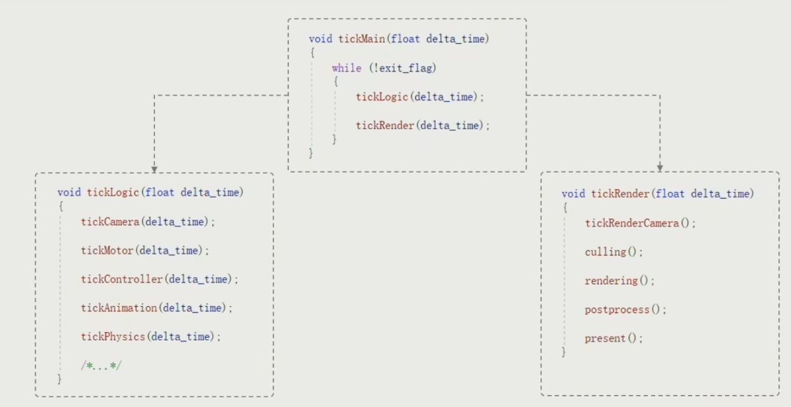
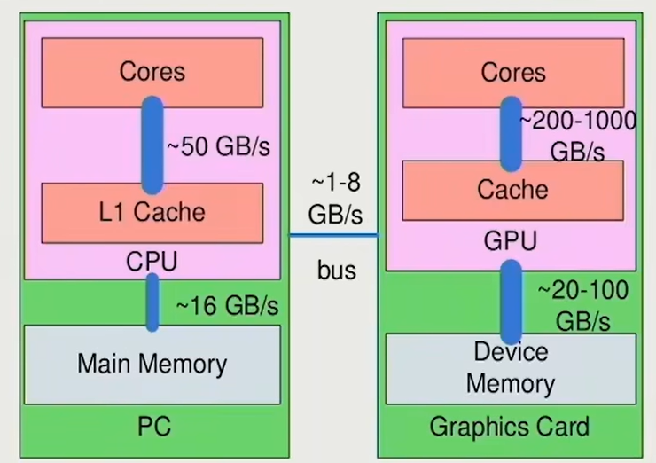

# 引擎分层

## 平台层

- **统一封装API**：将各平台不同的API封装为统一的API，以供上层调用
  - 操作系统：文件系统、环境变量等不同
  - 渲染API：统一封装的渲染API通常称为**Render Hardware Interface(RHI)**
  - 发布渠道：发布渠道也可能影响应用程序本身（如收费逻辑）

## 核心层

- **内存管理**：以合适的方式、在合适的时机分配和回收内存
  - 内存分配优化的三个主要手段：使用**内存池(如C++中的Allocator)，提高缓存命中率，内存对齐**

- **进程管理**
- **工具库**：工具函数，数据结构（追求极致效率，从内存分配开始着手）

## 资源层

- **资源导入**：处理导入引擎的各种类型的文件，形成**Asset**
  - 图像、模型、材质、音频这类文件有多种格式，导入后形成统一的有限种格式（处理效率更高，消除传输障碍）
  - 一些其他类型的文件不作处理（引擎往往无法直接使用这些文件，可能要依赖第三方库）

- **资源管理**：查找、查看资源，记录Asset间的引用关系等
  - 用**GUID**来索引Asset，GUID与Asset一一对应（由导入时间决定，一旦导入，不因任何事件改变）
  - 用统一文件格式（如Unity中的.meta）来记录**用于资源管理的信息**（GUID、Importer、AssetBundle等）
  - 还需要记录Asset间的引用关系（用GUID表示）；可以用XML文件记录（Unity中，引用信息直接记录在场景等Asset中）

- **资源加载/释放**：在合适的时机加载/释放特定的资源
  - 分块加载
  - 资源回收


## 功能层



- **层次结构**：游戏引擎的一部分功能模块可以称为**层**
  - 作为层来处理的功能模块主要来自功能层内部；资源层、核心层则通常是各模块均可调用

  - 各层之间有高低关系，**高层可访问低层，反之不可**（如游戏逻辑为低层，渲染为高层）
  
  - 各个层可以动态加载、卸载
- **游戏循环**：按照特定顺序（如从低层到高层）逐个更新功能模块
- **动画系统**
- **物理系统**
- **渲染系统**
- **声音系统**
- **输入系统**：以某种方式获取用户输入
  - 常见的是**轮询方式**，脚本可在任何时机查询输入；以合适的频率轮询则可以正确地持续监测输入

- **UI**
- **事件系统**：在不同模块之间传递信息
  - **高层可以订阅低层事件，反之不可**
  - **事件响应时，也可能与层有关（如，事件参数逐层向下传递，在某层被成功处理则不再向下传）**
- **脚本**
- **Gameplay**
- **多线程**

## 工具层

- **编辑器**：使修改游戏内容更加方便的工具，对程序以外的的开发人员意义更大

第三方库

- 可能涉及上述的各层（主要是功能层）
- 第三方库与引擎有不同的交互方式：
  - 直接作为源代码或静态库参与引擎的编译
  - 作为动态库在运行时发挥作用
  - 间接地通过硬盘上的文件交互

# 游戏场景

- 游戏呈现出的一切内容，都直接或间接地包含在场景中

## 内容

- 游戏物体
- 环境：地形、植被、天空等，与一般游戏物体的不同之处在于，可能由独立的系统，以特殊的方式记录、呈现
- 

## 信息交互

- 一个对象不会直接控制另一个对象的具体行为，顶多是指示对方执行某个行为，很多情况下，中间会插入一个中介，两方都只获取中介，这个中介通常被成为事件系统
- 一些工作会被分配到多个线程进行，但如果对执行顺序有要求的话，就不能完全在多线程进行。比如碰撞检测，多个线程分别处理一部分游戏物体，但仅仅记录碰撞信息，之后的某个时机再结算所有碰撞反馈，结算碰撞反馈时，确保每个物体的结算在一个线程上进行即可

# 内存管理

## 依赖关系和生命周期

- 游戏对象间存在广泛的依赖，需要控制各个游戏对象的生成/销毁顺序
- 主要考虑的是公共服务的加载时机，有以下方式控制：
  - 人为设定
  - 以数字规定每个服务的激活顺序
  - 自动计算服务的依赖关系，形成依赖图，然后拓扑排序

## 内存分配器

- 在条件允许时，使用栈分配器/池分配器，而不是直接动态分配内存


### 堆栈分配器

- 只能按顺序连续分配内存，只能按相反顺序连续回收内存
- 不会产生内存碎片，但限制了对象的构造、析构顺序

### 池分配器

- 将内存划分为若干大小相同的块，用**链表**（队列可以实现类似的功能，但要求使用连续的内存）连接，可以取出和放回
- 仅能用于大小一致（或不超过某个值）的一堆对象，不产生外部碎片，可能产生内部碎片

### 碎片清理

- 移动已分配的内存块，使未分配的内存尽量聚集起来
- 移动内存要借助**句柄**(handle)，相当于指针的指针；移动内存块时先拷贝数据，再更新句柄，指向新的地址，这一步称为指针重定位(**relocation**)

## 缓存

- 缓存使用SRAM实现，成本更高，速度更快
- 现代计算机的缓存集成在CPU上

### 程序局部性

- 程序大部分情况下是顺序执行的

- 时间局部性：执行某条指令后，在短时间内可能再次执行该条指令
- 空间局部性：访问某个内存地址后，在短时间内可能再次访问该地址或与其相邻的地址

### 读缓存

```c++
CPU输入地址;
if(命中)
{
    缓存中数据输出到CPU;
}
else //未命中
{
    将主存中的数据写入缓存;
    #ifdef 回写式
        if(发生替换)
            将被替换的数据写入主存;
    #endif
	缓存中数据输出到CPU;
}
```

### 写缓存

- 写分配：缓存**未命中时**，先将主存中数据调入缓存（**即使要写的数据不足一块，也要调出一块**），然后将数据写入缓存、主存。写数据时多花时间，但会提高命中率
- 非写分配：缓存**未命中时**，仅将数据写入主存
- 透写式（全写法）：缓存**命中时**，将数据写入缓存，然后写入主存，一行数据被替换时不需要额外操作
- 回写式（写回法）：缓存**命中时**，仅将数据写入缓存，一行数据被替换时再写入主存。一开始节约时间，但之后会频繁将内存中的数据写入主存。运行结束后，也需要花额外时间将缓存中的数据写入主存。需要额外的**修改位**
- 缓存和主存间通常采用**写分配+回写式**，各级缓存之间通常采用**非写分配+透写式**

```c++
CPU输入地址和数据;
if(命中)
{
#ifdef 透写式
    将数据写入缓存;
    将数据写入主存;
#else //回写式
   将数据写入缓存;
#endif
}
else //未命中
{
#ifdef 写分配
    从主存中的数据写入缓存;
	#ifdef 回写式
        if(发生替换)
            将被替换的数据写入主存;
    #endif
    将数据写入缓存;
    将数据写入主存;
#else //非写分配
    将数据写入主存;
#endif
}
```


### 组相联映射


- 缓存分**S = 2^s**组，每组缓存分**E**行，每行有1bit有效位，**t**bit标记，**B = 2^b**Byte数据
- **每组有E行时，组相联映射称为E-路组相联映射**
- 地址 = 标记位(t位)+组索引(s位)+块内偏移(b位)
  - 通过组索引确定相应序号的组，通过比对标记位确定是否已存在于缓存中（**每组**使用一个**比较器**，能够并行地比对组内每一行的标志位）
  - 原地址和缓存中的地址的低s+b位总是相同
  - 如果没有说明编址方式，默认按字节编址；从缓存地址长度可以反过来确定编址方式

- **缓存总容量=地址映射表容量(有效位+标记位)+数据容量=行数×(t+B+1)**
  - **采用回写式时，每行还会多一位修改位**
  - **考虑替换算法时，可能还需要一些额外的控制位**

# CPU

- 核心数量相对少，并发度相对低；功能相对复杂，处理各种不同类型的运算和指令的能力相对均衡

## SIMD

- 单指令多数据流(Single Instruction Multiple Data)，在**同一时刻**对**多组数据**执行同一条指令（如基本运算）
- 常见于**CPU**中，利用多个寄存器储存多组数据
- 对于一些简单的向量运算，高级编译器会自动进行SIMD优化

# GPU

- 核心数量多，并发度高；运算单元极多，擅长处理大量简单重复运算
- 高并发度允许GPU同时处理大量指令，这些指令必须是可并行的（**分支、循环会破坏可并行性**）
- 渲染是**流水线式并行**的，总时间不是每步简单相加，时间瓶颈可能来自于多方面

## 数据传输



- **通常，渲染结果不需要传输给CPU（除非要记录/分析图像），而是直接输出到渲染缓冲区中，然后由显示控制器将其输出到屏幕上**
- CPU与GPU的数据传输速度显著慢于读写缓存，甚至慢于读写内存
- 应尽量将CPU和GPU之间传输的数据精简到最少
- 如非必要，不要将显卡中的数据读入缓存或内存，也不要令游戏逻辑依赖渲染结果（延迟高）

## SIMT

- 单指令多线程(Single Instruction Multiple Thread)，**多个线程同时**运行同一条指令，处理**多组数据**
- SIMT是并发度高的体现，但SIMT不涉及分支、循环的问题

# 动画

## Live2D

将人的图像分解为各个部件，每个部件具有自己的mesh、深度、几个控制点。控制点和深度按照输入移动，并计算mesh的变化

## Rigid Hierarchy Animation

- 最简单的骨骼动画，将物体分解为几个部分，由骨骼连接，每个部分可以作为一个整体在一定范围内运动，但每个部分内部无法变形

- 除了世界坐标系和模型坐标系，每根骨骼还有各自的本地坐标系，坐标系随骨骼旋转/位移而旋转/位移
- 每个顶点包含位移、朝向、缩放、骨骼默认长度（常量）数据，总自由度为9
- 骨骼默认长度指某顶点与下一个顶点间的距离，如果从一个顶点延伸出多个骨骼，这个顶点被视为位置重合的多个顶点（？）
- 人形骨骼根节点通常取角色两脚间，
- 朝向：**规定本地坐标系x轴的方向（x轴和两顶点连线未必重合）**
- 位移：本地坐标系下，此顶点指向下个顶点的位移
- 缩放：计算完位移后再进行缩放，影响顶点和皮肤上顶点的位置
- 位移、朝向、缩放都可以用4×4矩阵表示，将他们相乘得到**Affine Matrix**(计算顺序为朝向、位移、缩放)。**用任何一个顶点的模型坐标（扩展为4×4矩阵）左乘它的Affine Matrix，得到下一个顶点的模型坐标**。根节点的模型坐标不需要计算，额外存储（执行某些动作时，根节点坐标会变化）

## Per-vertex Animation

控制皮肤每个顶点的位置。过于复杂，通常由物理模拟产生

### Morph Target Animation

属于Per-vertex Animation，预设一些关键帧(每帧包含完整的顶点数据)，用一些可调节变量描述这些关键帧间的差异，最终呈现出的结果为这些关键帧各顶点位置的插值。常用于捏脸

## Skinned Animation

- 对Rigid Hierarchy Animation的完善，皮肤上每个点的位置不仅受自身所处骨骼的位置影响，**还受到附近的其他骨骼的位置的影响**。合理的函数关系能模拟出较为真实的皮肤质感。现代工具能让艺术家像绘画一样控制mesh随骨骼的运动这一过程背后的函数（通过类似于绘画的方式控制周围几个骨骼顶点的影响系数）


- 计算属于某块骨骼的mesh顶点的位置时，**在该骨骼的本地坐标系中**，获取周围相关顶点的坐标、缩放，根据函数计算出该顶点**在本地坐标系中的位置**，然后转换回世界坐标

### Root Joint

- 通常位于两脚之间，作为描述角色速度、位置的参照点。导出时，通常单独用位移曲线来表示


### Bind Point

- 用于控制两个物体的贴合，生效时，连接点处的位置和方向(局部坐标轴)都重合


### Interpolation

- 指两个关键帧内的动画通过插值得出

- position和scale通常用线性插值即可


- orientation使用NLerp/SLerp插值法


### Animation Compression

- 使用蒙皮动画时，每个关键帧要储存的数据为所有关节的位移、朝向、缩放


- 压缩的关键在于只保留几个关键帧，用某种方法拟合出曲线，关键帧是自动确定的，需要的关键帧数量的与动作的变化幅度有关
- 皮肤顶点位置的计算可以在CPU中计算，也可以在顶点着色器中（读取顶点默认位置和蒙皮矩阵，然后计算顶点实际位置）计算
- 只要骨架相同，物理和动画资源可以复用，不受蒙皮修改影响


### Blend

- 指多段动画混合成一段动画，两端动画间的插值，用于平滑过渡
- 混合要求动画具有某种相似性，比如走路与跑步混合时，脚落地的时间点要重合
- 用若干变量控制多个动画混合时的权重

# 粒子系统

## 要素

- 粒子：外观、运动方式、生命周期、环境交互
- 粒子发射器：发射速度、发射方向等

## 粒子类型

- Billboard Particle：始终朝向相机的二维图片
- Mesh Particle：许多粒子，每个粒子可以视为简化过的游戏物体，仅保留部分信息和部分交互（一个一个渲染的吗？）
- Ribbon Particle：一些粒子，粒子不是渲染的对象，而是渲染的位置依据（比如沿着粒子渲染出一条带）

## 粒子渲染

### 难点

- 数量多
- 透明物体多
- 粒子间相互混合

### 深度排序

- 逐粒子排序：开销大
- 逐Emitter排序：多个Emitter混合时效果不理想

# 声音系统

## 声音

- 响度：声波的振幅
- 音调：声波的频率
- 音色：主要指乐器的泛音（乐器不会只发出单个频率的声波，而是多个频率、响度不同的声波的混合）

$$
N = k \log_{10}\frac{p}{p_0} \hfill \\
P:声强(单位:\mathrm{Pa}) \quad P_0:0分贝所定义的声强 \quad N:分贝数(无量纲) \hfill \\
$$


## 三维声音渲染

# 工具链

**让编辑游戏更简便的工具，调用底层，以友好的界面和操作面向各类用户**

## 目标

### 版本兼容

- 核心问题是字段相较之前增加、减少了
- 按顺序读写字段不可行。需要为每个字段分配id（对于Json来说，变量名就是id）

### 可靠性

- 撤销/重复功能。将指令抽象成一个类，包括执行时行为、撤销时行为、标识符等

### 所见即所得

- 尽量能在编辑游戏时就能看到游戏运行时的效果
- 编辑器中便会执行部分游戏运行时的代码

### 可拓展性

- 主要的拓展方式是，继承/实现引擎的原有类/接口，然后主动调用或令引擎调用这些重写过的API

## GUI

### Immediate Mode

- 每帧直接调用绘图API来绘制
- 轻量级，可拓展性有限，效果有限

### Retained Mode

- 提交绘图指令，储存在缓冲区中，每帧GPU统一处理
- 效率高（能实现GUI热更新）

### MVC

- Model：除了自身的数据，只可能持有其他有影响的Model
- View：只持有自身的数据。根据自身数据调用绘图API，并提供输入事件API
- Controller：持有Model和View。一方面为输入事件绑定响应方法，修改Model数据；一方面将Model中的数据传给View

### MVVM

- Model：同MVC
- View：与MVC略有不同的是，通过某种方式（命名方式、标记等）将UI相关变量同Model中的变量**绑定**起来
- ViewModel：仅仅获取Model、通知View更新。以**绑定**为依据传递数据，而不用程序员写逻辑（原理类似特性和反射）

## 序列化

- 运行时数据转化为持久保存的数据
- 完全没有结构的数据必须按固定的顺序读写，无法应对数据丢失、更新。结构的存在允许了数据顺序交换、缺失、多余
- 不论有无结构，数据可以以某种方式“无损压缩”成二进制文件，乃至加密

## 反序列化

- 持久保存的数据转化为运行时数据
- 为了在大量数据中查询，通常使用树状结构（类似于字典的嵌套）


## Varaiance

- 仅需要改变一个现有对象的**一部分**内容时会用到
- 一个游戏对象会引用各种素材，出于储存空间、修改成本等方面的考虑，应该不仅能直接引用，还能**继承**其他游戏对象的引用，继承者被称为被继承者的变体

## World Editor

World Editor工具既有按类型分的（粒子、动画……），也有按游戏内容分的（地形、道路……）

- Viewport：用于显示Editor模式下模拟出的游戏，执行相机移动、渲染、GUI、选中拖拽等逻辑（各种Editor逻辑和部分Runtime逻辑）
- Inspector
- Content Browser：核心是文件命名与检索功能，文件夹结构没有强制要求（比如资源类型→资源内容）
- Mouse Picking（Ray Casting）：鼠标与相机连线产生射线，进行射线检测（开销大，对复杂的mesh如果精确检测开销更大）
- RTT：渲染时，额外使用一个缓存记录物体id，鼠标选取时根据屏幕空间坐标在缓存中检索即可
- Transform Editing

- Instance Brush
- Rule System：特定游戏物体间的关系/约束，如：路必须贴合地面，路面上没有植被

## 反射

- 获取、利用类、实例、函数本身的信息（类型、字段、参数……）
- 主要利用编译过程中的数据，主要方式是字符匹配

# 事件系统

# 3C

# AI

## 寻路

### Waypoint Network

- 设置关键点，关键点间生成路径
- 寻路时，先回到最近的路径上（终点同样投影到最近的路径上），然后查找最短路径，适用Dijkstra算法
- 修改成本高，NPC行为受限

### Grid

- 地图划分为等大正方形网格
- 适用A*算法。HCost小于等于无障碍距离时，必然能找到最短路径；HCost系数越大，找到路径越快
- 准确度有限，空间和时间开销大

### Navigation Mesh

- 地图划分为网格
- 寻路时，路径只能是**mesh的任意两条边的中点的连线**。到达一点后，将周围几条边的中点加入待选点，用和A*相同的方式在待选点中选择
- 找到路径后再平滑处理

### Sparse Voxel Octree

- 地图划分为八叉树（如果一个节点内存在不同类型的区域，就对其划分，直到完全属于同种区域或达到最小划分限度）
- 用于三维场景寻路，准确度有限，空间和时间开销大

## 路径与运动

### Seek&Flee

- 除了向固定点移动，物体还有跟随、逃离行为

### Velocity Match

- 物体加速度有限时，需要提前计算加速、减速时机

### Aligh

- 使物体转动到目标角度时，同样涉及角加速度

## 群体模拟

- Rule-based Model：对每个个体应用相同的规则
- Macrosopic Model：统一控制大量个体
- Mesoscopic Model：上述两种方法的结合

## 避障

- Force-based Model：依据某些数据，对物体施加额外的力，如：到墙壁的距离，到其他物体的距离
- Velocity-based Model：在Force-based Model的基础上，考虑其他物体的速度，如：B面向A移动比B静止对A产生的“斥力”更大

## 决策

### 行为树

- 节点有三种状态：Success，Failure，Running
- **每一帧都会获取根节点的返回值**。为了获取返回值，依次访问各种子节点，子节点的返回值一路向上返回到根节点；根节点一直处于Running状态，一旦返回Success，立刻重新进入根节点
- Sequence：按顺序执行节点。任何一个子节点Faliure，返回Faliure；一个子节点为Sucess且没有后续子节点时，返回Success
- Selector：选择一个（或多个）节点执行。所有子节点均为Faliure时，返回Faliure；Success的子节点数量达到设定值时，返回Sucess
- Paralell：所有子节点可以同时执行（能否进入子节点仅与节点自身逻辑有关，没有对子节点执行顺序和个数的限制）。所有子节点均为Faliure时，返回Faliure；至少一个子节点为Sucess且其他子节点为Faliure时，返回Sucess
- Decrator：多种功能型节点的统称，如：等待，循环
- Precondition：一个节点的Precondition不满足时，返回Faliure
- Blackboard：行为树涉及的环境变量。既有外部，也有内部；既有当前，也有历史
- 偏向于反应，而不是实现目标

### Hierachy Tasks Network

- 设定任务，然后将其逐级分解成更小的任务
- 介于反应和实现目标之间

#### 组成

- HTN Domain：有层级结构的任务，作为资源储存
- World State和Sensor：感知器与感知到的世界状态
- Planner：尚待执行的任务，运行时依据World State，从HTN Domain中取出任务
- Plan Runner：正在执行的任务，运行时依据任务的precondition和World State判断是否执行，执行完后根据effect更新World State

#### 任务

- 所有任务都有precondition、action、effect
- Primitive Task：原子任务，一旦执行，不会被打断，通常是一个非常简单的行为
- Combound Task：复合任务，包含多个**方法**。方法有优先级和条件。复合任务在方法中**选择一个执行**（或都不执行）。方法内部包含一串任务，**按顺序执行，直到完成所有任务或任何一个任务条件不满足**

#### 运行

*下列过程是简化版，没有利用Planner*

1. 从根任务开始
2. 执行复合任务
3. 逐个向下查找可执行的方法。如果没有可执行的方法，意味着这个复合任务被打断，获取此复合任务所属的方法，获取该方法所属的复合任务，在该复合任务中继续3（如果是根任务，回到1）
4. 访问方法中的下一个任务，如果是原子任务，跳转到5；如果是复合任务，跳转到2
5. 如果可执行此任务，执行并对World State应用effect，等任务执行完后回到4；如果不能执行，获取此原子任务所属的方法，获取该方法所属的复合任务，在该复合任务中继续3（如果是根任务，回到1）


### Goal Oriented Action Planning

- 偏向实现目标，而不是反应
- 不适用于非常复杂的游戏

#### 组成

- 同样有Planner，Plan Runner，Sensor，World State
- Goal Set：所有目标（非常明确的目标；不像HTN中，根任务只有一个，目标分散地体现在逐级任务中）
- Action Set：所有可采取的行动（不像HTN中，行为与任务绑定，而是可以灵活选择）

#### Gaol

- 同样有前置条件与优先级。**优先尝试完成优先级更高的目标，在此前提下尽量完成更多目标**
- 目标用World State（中的几项）表述（通常统一成bool变量）

#### Action

- 同样有前置条件和效果
- 有cost，作为可行Action的选择依据


#### 运行

1. 按优先级顺序，获取下一个目标。如果之后没有任务，从头开始
2. 如果有可能能完成此目标，进行计划；否则，回到1
3. 在Action Set中找到能实现目标且cost最少的Action序列（**从目标开始往当前状态倒推**）。建立一个栈储存尚不满足的State，将当前World State与目标不一致的部分全部加入。逐个取出栈顶的State，找到可以满足此State的Action，将其加入Action序列中，如果该Action的前置条件对State有要求，将其入栈（实际上，需要规划各种可行路线，尽量规划出cost最小的序列。可以构建出一个图，在图上使用A*算法，可以使用与最终目标相差的State数估计距离）
4. 执行Plan。如果中途发现无法完成目标，回到1（从头开始？）

### Monte Carlo Tree Search

- 介于传统AI和机器学习之间
- 利用随机采样和统计的方法获得近似最优解
- 适用于输赢明确的游戏
- 构建树：游戏状态是节点，行为是边
- 每个节点有Q/N两个变量，分别为胜利次数和模拟次数
- 行为选择具有随机性，不过仍会遵循一些限制

#### 运行

**注意：以围棋为例，假设正在计算黑方下一步落子；奇数/偶数层节点分别代表黑/白方；每方总是按照最有利于自己的方向走棋，而每层的Q总是表示黑方的胜利次数，因此奇数/偶数层计算UCB、LCB的表达式会有所不同**

1. 选择：从根节点开始，逐步往下选择，直到选中一个**可拓展的节点**。选择的依据是，始终选择所有子节点中UCB最大的节点
2. 拓展：从选中节点的状态出发，选择下一步行动，并将新状态添加为选中节点的子节点
3. 模拟：从新增子节点开始向下模拟，直到给出游戏结果
4. 反向传播：向上更新结果，对于新增节点到根节点的所有节点，其N+1，如果这次模拟的结果是胜利；其Q+1，否则Q不变
5. 给出结果：在合适的时机停止模拟。然后从根节点的下一层子节点中选择一个，作为下一步行动。选择的依据是，选择子节点中LCB最大的节点


#### Upper Confidence Bounds

$$
UCB = \frac{Q}{N} + C \sqrt{\frac{2\ln N_p}{N}} \hfill \\
UCB:此数值越大,越优先探索此节点 \quad C:可调系数 \quad N_p:父节点的总探索次数  \hfill \\
$$

#### Lower Confidence Bounds

$$
LCB = \frac{Q}{N} -C\sqrt{\frac{2\ln N_p}{N}}  \hfill \\
LCB:此数值越大,越优先选择此节点 \quad C:可调系数 \quad N_p:父节点的总探索次数  \hfill \\
$$

# 网络

- 整个游戏可以视为一个包含极多状态的状态机，引起状态变化的因素可分为两类：
  - 时间：状态机自发随时间变化，理论上各个客户端可以自行计算
  - 玩家输入：各个客户端的输入需要汇总起来一并计算

## 同步方式

- 区分不同同步方式，根本上取决于服务器在客户端之间同步哪些数据
- 帧同步：仅同步各玩家输入，各个客户端自行计算游戏状态变化
- 状态同步：服务器接收各玩家输入，计算完游戏状态后再同步给各个客户端


