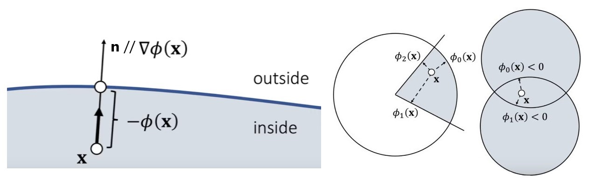

## 目标

- Static Actor：移动事先给定
- Dynamic Actor：移动由计算得出
- Kinematic Actor：移动事先给定，但需要通过计算得出移动对其他物体间的作用
- Trigger：触发器

## 模拟方式

**Mesh：网格，由点和面组成，通常只有三角形**

**Particle：粒子，即点云**

**Grid：网格，由等距的线划分的无数立方体**

**Hybrid：混合**

| 模拟方式 | Contacts整体 | Fracture破碎 | Cloth | Hair | Elastic弹性 | Plastic塑性 | Smoke | Drops&Waves | Splashes水花 |
| :------: | :----------: | :----------: | :---: | :--: | :---------: | :---------: | :---: | :---------: | :----------: |
|   Mesh   |      √       |      √       |   √   |  √   |      √      |      √      |       |      √      |      ？      |
| Particle |              |      ？      |       |      |             |             |   √   |             |      √       |
|   Grid   |              |              |  ？   |  ？  |             |             |   √   |      √      |      √       |

## 刚体物理

### 动力学

输入力F和力矩M，在每一帧计算物体的状态
$$
\begin{cases} 
\mathbf v(t_1) = \mathbf v(t_0) + m^{-1}\mathbf F(t_0) \Delta t \\
\mathbf x(t_1) = \mathbf x(t_0) + \mathbf v(t_1) \Delta t \\
\mathbf w(t_1) = \mathbf w(t_0) + \mathbf I(t_0)^{-1} \mathbf M(t_0) \Delta t \\
\mathbf q(t_1) = \mathbf q(t_0) + (0,\frac{\Delta t}{2} \mathbf w(t_1)) \mathbf q(t_0) \\
\end{cases}\\
$$

$$
\begin{cases}
\mathbf x_i = \mathbf x + \mathbf R \mathbf r_i \\
\mathbf v_i = \mathbf v + \mathbf w \times \mathbf R \mathbf r_i
\end{cases} \
x_i:微元的世界坐标,r_i:微元的本地坐标,w:整个物体的角速度
$$

#### 积分方式

- Explict Euler法：用起点状态代表接下来一段时间内的状态，系统能量可能会不断增大

- Implict Euler法：用终点状态状态代表之前一段时间的状态（只能通过微分方程求近似解），系统能量可能会不断减小
- Semi Implict法：用起点状态的加速度计算终点速度，然后用终点状态的速度计算终点状态的位移，系统能量可能周期性波动

- 中点法：用中间时刻的状态代表前后半段时间内的状态

- 梯形法：用起点状态和终点状态的线性插值代表这段时间内的状态

$$
理论公式:
\begin{cases}
\mathbf v(t_1) = \mathbf v(t_0) +\int_{t_0}^{t_1} \mathbf a(t) \mathrm d t \\
\mathbf x(t_1) = \mathbf x(t_0) + \int_{t_0}^{t_1} \mathbf v(t) \mathrm d t \\
\end{cases}
$$

$$
Semi-Implict法:
\begin{cases}
\mathbf v(t_1) = \mathbf v(t_0) + \mathbf a(t_0) \Delta t \\
\mathbf x(t_1) = \mathbf x(t_0) + \mathbf v(t_1) \Delta t \\
\end{cases}\\
$$

$$
Leapfrog法:
\begin{cases}
\mathbf v(t_{0.5}) = \mathbf v(t_{-0.5}) +a(t_0) \Delta t \\
\mathbf x(t_1) = \mathbf x(t_0) + \mathbf v(t_{0.5}) \Delta t \\
\end{cases}\\
$$

#### 转动

旋转矩阵是3×3矩阵，可以由欧拉角或四元数得到。位矢**右乘（位矢在右）**旋转矩阵即得到新的位矢。

计算四元数的改变量时，设计到四元数的加法和乘法。每次计算完后，都要将四元数标准化（Unity会自动标准化,且人为标准化可能引发错误）

转动惯量矩阵完全由质量分布决定（不同于转动惯量，**转动惯量矩阵不是沿某个特定轴的转动惯量，所有物理量的运算在同一个坐标系内进行，没有转轴的概念**）
$$
\mathbf M_i = \mathbf R\mathbf r_i \times \mathbf F_i, \mathbf M = \sum \mathbf M_i \\
\mathbf M_i:某时刻微元受到的力矩,\mathbf R:该时刻的旋转矩阵,\mathbf r_i:本地空间中，微元的位矢,\mathbf F_i :该时刻微元受到的力 \\
\mathbf I_{ref} = \sum m_i(|\mathbf r_i|^2 \mathbf I_3 - \mathbf r_i \mathbf r_i^T),\mathbf I = \mathbf R \mathbf I_{ref} \mathbf R^T \\
\mathbf I_{ref} :本地空间的转动惯量矩阵,\mathbf I:发生旋转后的转动惯量矩阵,\mathbf I_3:3阶单位矩阵 \\
\begin{cases}
\mathbf w(t_1) = \mathbf w(t_0) +\int_{t_0}^{t_1} \mathbf I(t)^{-1} \mathbf M(t) \mathrm d t \\
\mathbf q(t_1) = \mathbf q(t_0) + \int_{t_0}^{t_1} (0,\frac{\mathrm d t}{2} \mathbf w(t)) \mathbf q(t)\\
\end{cases}
$$

### 碰撞模拟

#### 物理方法

一点发生碰撞，然后影响整个物体，j：冲量。已知物理材质，便能由Impulse Method法算出冲量，也可以反过来求所需的物理材质

$$
\begin{cases}
\mathbf v^{'} = \mathbf v + m^{-1} \mathbf j \\
\mathbf w^{'} = \mathbf w + \mathbf I^{-1}(\mathbf R \mathbf r_i \times \mathbf j) \\
\mathbf v_i^{'} = \mathbf v^{'} + \mathbf w^{'} \times \mathbf R \mathbf r_i = \mathbf v_i + m^{-1} \mathbf j - \mathbf R \mathbf r_i \times (\mathbf I^{-1}(\mathbf R \mathbf r_i \times \mathbf j))
\end{cases}
$$

#### SDF

$$
有向距离函数(SDF):\phi(\mathbf x)
\begin{cases}
<0\ , 在曲面内 \\
=0\ , 在曲面上 \\
>0\ , 在曲面外
\end{cases} \\
交部分:\mathbf x 在内部时，\phi(\mathbf x) = max \{ \phi_0(\mathbf x),\phi_1(\mathbf x),\phi_2(\mathbf x) \}(<0)\\
并部分:\mathbf x 在外部时，\phi(\mathbf x) = min \{ \phi_0(\mathbf x),\phi_1(\mathbf x) \} \\
\nabla \phi(\mathbf x)的方向是最快离开物体内部的方向,其延长线与物体表面交于一点,该点的法线也沿该方向,即\mathbf n =\frac{\nabla\phi(\mathbf x)}{|\nabla\phi(\mathbf x)|}  \\
$$ { }

#### Quadratic Penalty Method

$$
\phi(\mathbf x)<0时,\mathbf N(弹力) = k (-\phi(\mathbf x)) \frac{\nabla\phi(\mathbf x)}{|\nabla\phi(\mathbf x)|} \\
碰撞的两方会陷入对方，为了更好地模拟，通常将\phi(\mathbf x) = \varepsilon处视为表面，则\phi(\mathbf x)< \varepsilon时,\mathbf N = k (\varepsilon - \phi(\mathbf x)) \mathbf n \\
$$

#### Log-Barrier Penalty Method

$$
\phi(\mathbf x)>0时,\mathbf N = \frac{\rho}{\phi(\mathbf x)} \mathbf n \\
物体未进入内部时就一直受到斥力,但远离时斥力很小(能避免物体进入内部,要求\Delta t较小) \\
$$

#### Impulse Method

$$
一旦\phi(\mathbf x)<0,\mathbf x^{'} = \mathbf x - \phi(\mathbf x)\mathbf n \\
此时,若\mathbf v \cdot \mathbf n<0(理论上左式肯定满足,但模拟未必精确),\mathbf v_n^{'} = - e \mathbf v_n,\frac{\mathbf v_t^{'} - \mathbf v_t}{\mathbf v_n^{'} - \mathbf v_n} \leq \mu \\
物体进入另一物体内时会立刻返回表面，速度的改变符合物理规律
$$

#### Shape Matching

考虑刚体的运动时，先令其个顶点不受约束自由运动，再让顶点聚合成刚体的形状，各顶点的位置决定了聚合后刚体的位置和旋转。各顶点理论位置和模拟位置有偏差，确定理论位置时，应使偏差的平方和最小。

Shape Mathing和粒子系统类似，其思想可用于软体、流体模拟。
$$
某顶点模拟位置:\mathbf y_i,某顶点理论位置:\mathbf x+\mathbf R\mathbf r_i(\mathbf x,\mathbf R待定) \\
偏差:S=\sum |\mathbf x+\mathbf R\mathbf r_i - \mathbf y_i|^2 \\
\mathbf x = \overline{\mathbf y_i},\mathbf A =\mathbf (\sum (\mathbf y_i - \mathbf x)\mathbf r_i^T) (\sum \mathbf r_i \mathbf r_i^T)^{-1},\mathbf R = Polar(\mathbf A)时,S_{min}
$$

## 碰撞检测

### 检测阶段

1. Broad Phase：以某种高效率的方式判断碰撞体间是否有可能发生碰撞（通常检测AABB是否相交）
2. Narrow Phase：判断有可能发生碰撞的碰撞体间是否发生了碰撞

### Sort And Sweep

1. 取一个坐标轴
2. **获取所有AABB在该坐标轴上的最小值和最大值并排序**，不断更新一些数据，确保始终能查询某个最小/最大值属于哪个物体，并查询该物体的另一个最大/最小值
3. 遍历每个AABB。对于每个AABB，其最大最小值间的AABB均**可能**和该AABB相交，然后将该AABB的最小、最大值移出序列
4. 确认筛选出的AABB对是否确实相交

**物体位置改变或增加新物体时，进行插入排序**

**适合使用AVLTree等数据结构**

### Boundary Volume Hierachy Tree

## 角色控制器

- 角色的碰撞体通常采用胶囊体，且分为两层，内层可视为真正的刚体，外层则有多种作用：比如，和墙壁碰撞（但不和一般物体碰撞）能避免相机穿墙
- 跨越障碍、爬坡的算法可能需要特殊写

## 布娃娃

- 在某些情况下（通常是角色死后），用布娃娃的物理模拟代替原本角色的物理模拟
- 一个角色的物理逻辑发生变化时，可能需要使用布娃娃。比如，活着→ 死亡→ 倒下的过程中发生的变化为：活着时的物理逻辑→ Kinematic（播放死亡动画）→ 死去后的物理逻辑

## 衣料模拟

### Animation-based Cloth Simulation

- 将衣服视为骨骼的一部分
- 实现简单，但不真实

### Mesh-based Cloth Simulation

- mesh指的是在mesh上进行物理模拟。渲染时当然有mesh，不管物理模拟时有没有mesh。两个mesh不同，渲染用的mesh通常更精细，物理mesh控制渲染mesh（类似骨骼与蒙皮的关系）
- 将mesh视为质点和连接质点的弹簧

## 破坏模拟

## 载具模拟

