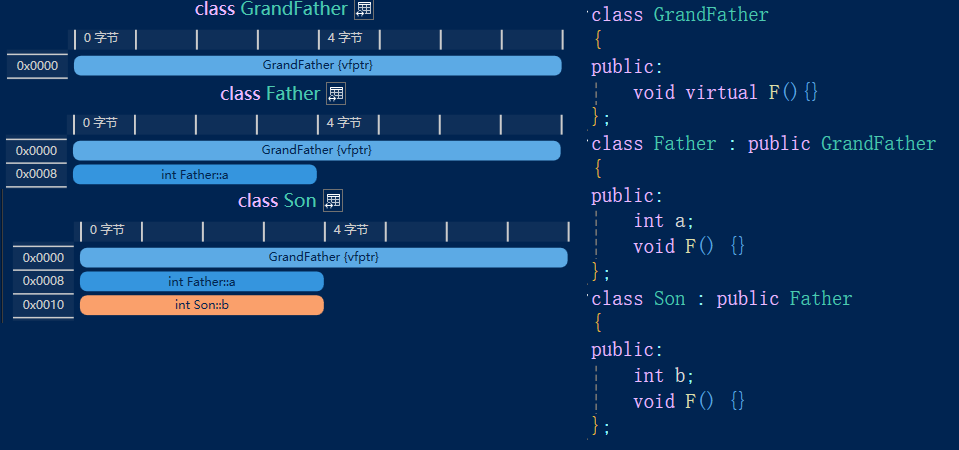

# 原理

## 编译

### 编译工具

- **预处理器(preprocessor)**：能由源文件和头文件生成**处理好的翻译单元**的程序；主要工作是处理源程序中的**预处理语句(preprocessor statement)**
- **编译器(compiler)**：能根据**处理好的翻译单元**生成**目标程序**的程序，包括**编译程序**和**汇编程序**
- **链接器(linker)**：能根据**目标程序**生成**可执行程序**的程序；主要工作是进行**符号解析，地址映射**
- **目标程序(.obj)**:**可重定位的(relocatable)**（指令中的地址还不是物理地址）、**未链接的(unlinked)**（引用了其他目标程序或库中的函数、数据，但尚未与它们链接，尚未确定函数具体实现、变量的逻辑地址）的**机器指令**
- **链接库：预编译的二进制文件，包含类、函数、变量的定义等数据；程序会在某些时机链接到库**
  - **静态链接库(.lib)**：在**编译**时根据**静态链接库文件**解析**目标文件**；多个项目无论是否共用静态链接库，编译时总会重复多次
  - **动态链接库(.dll)**：在**程序运行**时根据**动态链接库文件**确定**进程**；多个项目可以共用动态链接库
  - 动态链接库编译得到的程序更小，但运行时有额外开销（编译结果中不会包含函数具体实现等数据，运行时才确定）
  - 链接到库，本质上是确定函数的具体实现和


### 编译过程

- 编译是由**一个解决方案**（包含若干个源文件，以及头文件、链接库等）生成**包括可执行文件(.exe)文件在内的若干文件**的过程
  - 狭义的编译指编译过程中，由源程序生成汇编语言程序这一步

- 编译**一个源文件**的步骤：
  1. 输入源文件
  2. 经**预处理器**生成**处理好的翻译单元**
  3. 经C++**编译器**生成**目标程序**
  4. 经**链接器**生成**可执行程序**

## 项目结构

### 解决方案与项目


- 一个解决方案中包含若干个项目
  - 项目有独立的设置、独立的开发语言
  - 通常将其中一个设置为**应用程序（生成.exe）**，其余设置为**库（生成.dll或.lib）**，并**令应用程序引用各个库**
  - 正确设置了项目间引用后，Visual Studio自动将**本解决方案生成的.exe、.lib、.dll放在一个文件夹中**（因此不必人为添加.lib，但仍需要设置附加包含目录）

### 引用文件

- **各对象的定义位于库中，静态链接库包含对库的引用，而声明通常位于头文件中，必须同时引用静态链接库和头文件才能正确编译**


- **头文件(.h或无后缀)**通过#include指令引用，需指定文件路径，编译器尝试用若干种方式检索指定的头文件
  - #include指令本质上是单纯地把头文件中地内容复制到当前文件中
  - 若#include了非头文件（lib等文件与头文件的数据格式不同），编译时才会检查出内容错误

| 路径类型                                 | 示例                                                   | 备注                        |
| ---------------------------------------- | ------------------------------------------------------ | --------------------------- |
| **标准库目录**下的相对路径               | `#include<iostream>`                                   |                             |
| **附加包含目录**下的相对路径             | `#include"glfw3.h"`                                    | 必须设置附加包含目录        |
| 从**当前源文件所在文件夹**出发的相对路径 | `#include"..\Dependencies\glfw3.h"`                    | `../`表示退回上一级文件目录 |
| 绝对路径                                 | `#include"D:\memo\编程\C++\Test\Dependencies\glfw3.h"` |                             |


- **静态链接库(.lib)在VS中通过项目设置直接添加，也可以将exe文件与lib文件放在一个文件夹中来访问**


- **动态链接库(.dll)在exe文件运行时才链接，编译器不能访问dll文件（不要将dll文件添加到附加依赖项中）**
  - **但为了正确编译，仍然需要引用lib文件**（C++程序使用的dll文件总是伴随着一个lib文件）
  - 要让一个项目使用dll文件，**将exe文件与dll文件放在一个文件夹中**
  - 要让多个项目共用dll文件，需要设置**运行时环境变量**

## 内存分区

### 堆区(Heap)

- 由new/malloc关键字分配，由delete/free回收
- 无法在堆区分配特别大的一块空间（不像CLR那样，能够自动利用虚拟内存）
- 堆区占用的总空间可以动态增长
- 堆分配需要在堆空间中查询足够大的一块内存空间，所以效率较低

### 栈区(Stack)

- 不由new/malloc关键字分配。由编译器分配和回收
- 栈分配只需要维护一些指针，以确定的顺序分配和回收内存，所以效率较高
- 栈区的大小通常是固定的
- **“栈区”不同于数据结构中的“栈”，其中变量不一定是连续分配的**

### 全局/静态储存区(.bss段/.data段)

- 未初始化的全局和static变量存放在.bss段，初始化的存放在.data段


### 常量区(.rodata段)

- 常量。可以通过特殊方法修改
- 虚函数表也存放在常量区，因为虚函数表的内容也是常数


### 代码区(.text段)

- 函数等。无法修改

## 错误处理

### 异常

- 抛出异常，本质上是生成一个异常对象，储存错误信息
- 抛出异常后，查找可以处理该异常的catch语句块，找不到，就施放**当前函数调用栈**中的本地变量，将异常抛到上层函数调用，重复这个过程。这个过程是**栈展开(unwind)**；如果直到最上层也无法处理异常，则**中止程序**
- 析构函数不能将抛出抛出到上层，有异常必须在析构函数内部处理掉

### 断言

- 通常用宏实现，内容通常是：如果满足某种条件，就终止程序
- 性能开销较小
- 仅适合处理严重错误，仅适合处理程序员错误而不是用户错误

## 调试

- Visual Studio提供了Debug模式和Release模式，Debug模式下，编译器会执行许多额外的操作，使得各种调试功能能够使用

# 概念

## 头文件

- C++要求在使用一个类/函数/变量**之前**必须**声明**或**定义**
  - 对于仅在本文件中使用的对象，通常会直接在使用前就定义；或是先声明，在之后的代码中定义
  - 对于使用的外部对象，需要将其一一声明。可以将声明（或定义）写在头文件中，然后调用#include指令
- **头文件中可以仅包含声明，也可以直接包含定义**
  - 如果仅包含声明，那么定义则写在源文件中（需要隐藏实现时，通常这样做）
  - 包含定义的源文件也必须引用包含声明的头文件
  - **如果头文件中已经定义了一个类，源文件中只能独立地定义各个函数，且不能添加头文件中没有声明的成员**

```C++
//Test.cpp
#include<iostream>
#include"library.h"
using namespace std;

int main()
{
	Library* l = new Library();
	Library::LogC();
	Library::LogS();
	l->LogA();
}

//Library.h
#pragma once

class Library
{
public:
	const static int c = 5;
	static int s;
	int a;
	Library()
	{
		a = 0;
	}
	static void LogC();
	static void LogS();
	void LogA() const; 
};

//Library.cpp
#include<iostream>
#include"library.h"
using namespace std;

int Library::s = 1;
void Library::LogC()
{
	cout << Library::c << endl;
}

void Library::LogS()
{
	cout << Library::s << endl;
}

void Library::LogA() const
{
	cout << Library::a << endl;
}
```

## 宏

- `#define,#ifdef,#endif`等指令，作用于预处理阶段
- **宏必须谨慎使用，避免带来理解困难**
- 定义宏时，如果要表示换行，使用`\`
- 常见用途：
  - **简化多次出现的重复代码（同时起到封装的作用）**
  - **在编译时（而不是运行时）确定不同上下文对应的代码（如Debug和Release，不同平台）**

```c++
#define DEBUGMODE 0

#if DEBUGMODE == 1
    #define LOG(x) cout << x << endl;
#else
    #define LOG(x)
#endif

int main()
{
 	int a = 1;
    LOG(a);
}
```


- 可以设置项目的预处理指令（注意不能有空格），其优先级低于人为编写的预处理指令

## 命名空间

- 仅辅助命名，不与访问修饰符产生协同作用
- `using namespace`指令根据在代码中位置的不同，在不同作用域内生效（文件内部/类内部/函数内部）
- 使用时必须避免混淆，**不能在头文件中使用`using namespace`**

## 关键字

### auto

- 自动确定的变量类型
- **auto一定不会自动确定成引用（但可以自动确定成指针），必要时在auto后加上引用符号**
- 有利于减少代码修改，但同时影响可读性、可靠性；适用于代替名称过长的类型名


### friend

- **friend关键字总是用在类中，且不被访问修饰符修饰**

- 修饰全局函数：该全局函数可以访问此类的私有成员


- 修饰类：该类中的函数可以访问此类中的私有成员


- 修饰函数：该函数可以访问此类中的私有成员(这个类应当为其他类中的某个函数，如`friend void Student::F(int)`

### for

- **for兼具C#中foreach的作用（通常应使用指针或引用，否则会将对象拷贝多次）**

```c++
foreach(Vertex& v:vertices)
{
	cout << v << endl;
}
```

## 变量

### 变量类型

- **C++中没有引用类型，所有类型都是值类型**
- **所有类型的数据（包括数组，基本数据类型），都可以分配到栈上或堆上，关键是看分配内存时有没有调用new或malloc**
- 由于C++不会进行垃圾回收，并且出于性能考虑，应当谨慎使用堆分配

### 类型转换

- 类型转换可能会改变数据（的二进制表示）
- 可以利用**类型转换运算符**（配合指针、引用等）进行各种类型转换，其行为可能是不确定、不安全的
- C++中添加了四个**类型转换函数**：
  - **static_cast：安全的类型转换（如子类指针转父类指针，某些数值类型之间转换）**
  - **dynamic_cast：指针、引用之间不安全的类型转换（如父类指针转子类指针）**
  - **reinterpret_cast：相当于改用不同类型的指针指向一个地址，不改变该地址上的二进制数据**
  - **const_cast：将常量指针/常量引用强制转换为非常量指针/非常量引用**

- 相比于类型转换运算符，类型转换函数并没有实现额外的转换，而是额外进行了合法性检测等工作
  - 能够使用static_cast的上下文中，使用dynamic_cast不会引发异常，但开销更高
  - 使用dynamic_cast时，若类型转换不合理，则会返回**空指针**或**抛出引用不可为空异常**

### 全局变量

- 作用域为全局
- 访问其他文件中的全局变量前必须声明（使用extern关键字）

### 静态全局变量

- **作用域为本文件**

## 指针

### 指针类型

- **指针本身只是一个表示地址的无符号8字节整数（在64位系统上），不与特定的数据类型绑定**
- **指针类型代表以何种方式访问该指针指向的数据，且可以用不同类型的指针指向同一地址**
  - **但指针类型的改变不一定是合法的，编译器对非法操作的处理是不确定的，要谨慎使用**

- **void*也是合法的指针类型，没有指明以何种方式访问该指针指向的数据，且可以隐式转换成其他指针类型**

### 指针运算

- **指针加/减常数时，实际的变化量要乘以指针指向数据占用的空间**
- **两指针相加无意义，两指针相减，返回值为int，结果要除以指针指向数据占用的空间**

### NULL和nullptr

```c++
#ifdef __cplusplus
#define NULL 0
#else
#define NULL ((void *)0)
#endif
```

- **(void *)0可能导致指针和整数的混淆，而nullptr不可能隐式被转换成整数0（nullptr需要通过模板类来实现）**

### 常量指针

- **不能通过指针来修改其指向的内容**
  - **对于某个类的常量指针，不能修改该类的成员变量，且只能访问有const说明符的成员函数**

- **对常量取地址会得到常量指针；不能把常量指针赋值给非常量指针**（会破坏常量的约束）

### 指针常量

- **不能修改指针指向的地址，不能为空指针（不需要检查常量指针或引用是否为空）**

```c++
char c = 'A';
const char* p1 = &c;		//常量指针
char* const p2 = &c;		//指针常量
const char* const p2 = &c;	//常量指针常量
```

## 引用

- 引用是变量的“别名”，有类似**指针常量**的特性，在引用符号右侧再加const修饰没有意义
- **引用和指针的许多语法有所不同，某些情况下不能将其视为常量指针（如函数返回值）**
- 引用不同于C#的引用类型，后者指向的地址是可变的，且可以设为空指针


```c++
void F(int& arg);	
void F(int* const arg);
int& a = b;	 
int* const a = &b;
```

## 数组

- 数组的本质是指针，只是提供了一些特殊的语法
- **数组可以分配在栈上或堆上；但如果编译时数组大小不确定，只能分配在堆上；利用模板参数可以在编译时确定数组大小**
- **利用sizeof运算符能够计算数组元素个数**

## 二维数组

- **每个元素为指向数组的指针**
- **各数组在内存中不连续，改用一维数组实现通常更高效**

```c++
int main()
{
	int col = 10;
	int row = 20;
	int** a1 = new int* [col];
	for (int i = 0; i < col; i++)
	{
		a1[i] = new int[row];
	}
	for (int i = 0; i < col; i++)
	{
		delete[] a1[i];	//delete[]与new[]依然一一对应
	}
	delete[] a1;
}
```

## 左值/右值

- **左值：可以**出现在赋值号左右两侧的对象（**≠确实**出现在赋值号左侧的变量）
  - 占用一块内存空间，可以取地址，未以const修饰时可修改
- **右值：只能**出现在赋值号右侧的对象（**≠确实**出现在赋值号右侧的变量）
  - 临时存在于内存或寄存器中，不可取地址，**被视为常量**

### move

- `B=move(A)`将左值A转换为右值，然后赋值给B，这通常意味着A变为“临时变量”，即接下来不会再使用A
  - 但A不会被立即释放，依然是在离开作用域时释放

- move函数会以A为参数调用**移动构造函数**，通常实现方式为**把A的所有成员浅拷贝给B，后将A的指针成员必须全部设为nullptr**
  - **A的成员原本指向的对象不会在A析构时析构，而是在B析构时析构**
  - **本质上是避免深拷贝，降低开销。但这种降低开销的做法是有前提的，即确实不需要再使用A**

- **特别地，如果B不是一般的左值，而是右值引用，这种情况下不会移动A，而是仅仅为A增加一个新的引用**

## 左值引用/右值引用

- **不能将左值赋值给右值引用**
- **不能将右值赋值给左值引用，但可以赋值给常量左值引用（类似常量和常量指针的关系）**
- **左值引用和右值引用均可以出现在赋值号左侧，均属于左值的一种**
- **用const修饰右值引用没有意义，和一般的右值引用没有区别**

|                  | 左值                          | 左值引用 | 常量左值引用 | 右值引用 | 右值                          |
| ---------------- | ----------------------------- | -------- | ------------ | -------- | ----------------------------- |
| **类实例左值**   | **分配内存，调用构造函数**[1] | 同左     | 同左         | 同左     | **分配内存，调用构造函数**[2] |
| **左值引用**     | **新增指针，指向已分配内存**  | 同左     | **不允许**   | 同左     | 不允许                        |
| **常量左值引用** | **新增指针，指向已分配内存**  | 同左     | 同左         | 同左     | **分配内存，调用构造函数**[3] |
| **右值引用**     | 不允许                        | 不允许   | **不允许**   | 不允许   | **同上**                      |

*上表中，第一行表示赋值号右侧对象的类型，第一列表示赋值号左侧对象的类型*

[1]：调用哪个构造函数视情况而定，还可能会调用等号重载；无论如何都会调用至少一次某种构造函数

[2]：只有在这种情况下，才可能调用移动构造函数

[3]：如果右值不是临时量，而是原有左值转换而来的，那么便不会分配内存，仅新增指针

```c++
class Test
{
public:
	int* a;
	Test()
	{
		a = new int(0);
		cout << "默认" << endl;
	}
	Test(const Test& t)
	{
		a = new int(*(t.a));
		cout << "拷贝" << endl;
	}
	Test(Test&& t) noexcept
	{
		a = t.a;
		t.a = nullptr;
		cout << "移动" << endl;
	}
	~Test()
	{
		delete a;
		cout << "析构" << endl;
	}
};
```

### 右值引用←右值

```c++
int main()
{
	{
		Test t1;				//默认
		Test&& r1 = move(t1);
		Test t2 = r1;			//拷贝
	}							//析构，析构
}
```

### 常量左值引用←右值

```c++
void Visit(const Test& t)
{
	cout << *(t.a) << endl;			//0
}
int main()
{
	{
		Test t1;					//默认
		Visit(move(t1));
	}								//析构
}
```

*以上代码为上表注释[3]的特殊情况*

### 左值←右值

```c++
int main()
{
	{
		Test t1;				//默认
		Test t2 = move(t1);		//移动
		cout << t1.a << endl;	//0(空指针)
	}							//析构，析构
}
```

- **将原本为左值的类实例移动后赋值给另一个左值时，会调用移动构造函数**
- **将字面量赋值给类实例会调用带参构造函数（构造时隐式类型转换）**

## 函数

- 如果函数的声明与定义分离，**某些说明符（static，virtual，override...）**仅出现在声明中

### 静态本地变量

- 作用域为函数体内部
- 多次执行函数的过程中，静态本地变量的值会被保留下来
- **定义静态本地变量的语句实际上只会被执行一次（所以通常在定义时赋初值）**

```C++
class Library
{
public:
	void Log(int num)
    {
        static int prev = 0;
        cout << prev << endl;
        prev = num;
    }
};
```

### 签名

- 包括以下内容：
  - 函数名
  - 参数列表
  - noexpect说明符（C++17以后）

### 函数栈帧


- 函数调用过程：
  1. 预分配用于存放返回值的空间
  2. 参数从左往右逐个入栈
  3. 保存现场（通用寄存器，栈地址寄存器，代码段地址等）
  4. 分配本地变量
  5. 执行函数体，计算出返回值
  6. 将返回值复制到返回值寄存器中，然后再复制到外部函数栈中接收返回值的地址
  7. 释放本地变量
  8. 恢复现场
  9. 回到外部函数
- 某些情况下，返回值寄存器中存放地址，地址传递到外部函数栈后，**可能**会依据地址调用**拷贝构造函数/移动构造函数**

### 参数

-  传递参数时，一定会为参数**栈分配**，并调用该类的**拷贝构造函数**

  - 传指针或传引用时，本质上是拷贝地址（一般指针可为空，而常量指针和引用不可为空）

  - 参数的生命周期是函数体内部
-  将参数定义为**实例常量**（而不是一般实例）意义不大，因为修改实例本身不影响函数外部
-  **默认参数**的语法与C#相同；函数定义和声明中，默认参数只需要且只能出现一次

|                    | 类实例                 | 左值引用     | 常量左值引用           | 右值引用               |
| ------------------ | ---------------------- | ------------ | ---------------------- | ---------------------- |
| **外部类实例**     | 拷贝到函数栈           | 仅拷贝地址   | 仅拷贝地址             | 编译错误               |
| **左值引用**       | 拷贝到函数栈           | 仅拷贝地址   | 仅拷贝地址             | 编译错误               |
| **常量左值引用**   | 拷贝到函数栈           | **编译错误** | **仅拷贝地址**         | 编译错误               |
| **右值引用**       | 拷贝到函数栈           | 仅拷贝地址   | 仅拷贝地址             | 编译错误               |
| **临时类实例**     | **直接在函数栈内构造** | **编译错误** | **直接在函数栈内构造** | **直接在函数栈内构造** |
| **移动后的类实例** | **正确地移动到函数栈** | 编译错误     | **仅拷贝地址，不移动** | **仅拷贝地址，不移动** |

*上表中，第一行为定义函数时规定的参数类型，第一列为实际传入的参数；上表仅表示传参时发生的行为，在函数内部还可能发生其他拷贝行为*


### 返回值	

- **函数返回时的行为，和返回值本身的类型、生命周期有关，也和定义的返回值类型有关，还涉及返回值优化**
  - **返回值为基本数据类型时，直接复制**
  - **返回值为指针时，行为明确，即复制地址；必须确保该地址指向的对象没有被释放（堆上变量，全局变量，静态本地变量，所在类成员变量等）**
  - **返回引用时，行为不明确；但无论如何必须确保返回的地址指向的对象没有被释放**
  - **返回类实例时，会正确地调用某种构造函数，可以用于返回会被释放地对象**
- **外部如果不接收返回值，那么返回时的行为不会执行，也不会进行返回值调用，正常地分配和释放函数本地变量**
- 返回指针或引用时，函数调用本身可能会成为左值（只是通常会将其赋值给一个有名称的左值，而不是直接访问这个匿名左值）
- 将返回值定义为**实例常量**（而不是一般实例）意义不大，因为返回的实例是右值
- 如果将**返回值**定义为**常量引用**，不能赋值给非常量引用，不能通过返回值修改实例成员
- 习惯上，**如果函数外部需要人为释放返回值指向的内存，便将返回值定义为指针（而不是引用）**


|                | 类实例                               | 左值引用                                                  | 常量左值引用 | 右值引用 |
| -------------- | ------------------------------------ | --------------------------------------------------------- | ------------ | -------- |
| **本地类实例** | **不构造本地变量，直接构造外部变量** | **违法操作**[1]                                           | 同左 | 编译错误 |
| **临时类实例** | **不构造本地变量，直接构造外部变量**         | 编译错误                        | **违法操作**[1] |**违法操作**[2]|
| **参数类实例**[5] | **调用移动构造函数构造外部变量**[3] | **违法操作**[1] | 同左 | 编译错误 |
| **全局类实例等** | **调用拷贝构造函数构造外部变量**[4] | **同左**                            | **同左** | 编译错误 |
| **移动后的本地/参数类实例** | 编译错误 | 编译错误 | **违法操作**[1] | **违法操作**[2] |
| **移动后的全局类实例等** | 编译错误 | 编译错误 | **正确地移动** | **正确地移动** |

*上表中，第一行为定义函数时规定的返回值类型，第一列为实际返回的对象；规定函数外部均以类实例接收返回值（而不是引用或常量引用）*

[1]：调用拷贝构造函数时，本地变量已被释放，导致违法内存访问（不一定引发异常或数据错误）

[2]：仍然构造本地变量，然后调用移动构造函数，此时本地变量已被释放。外部变量复制了已被释放的指针，而外部变量析构时，试图再次释放这些指针，导致违法内存访问（一定会引发异常）

[3]：这种情况下，正确地先调用移动构造函数，再释放本地变量

[4]：这种情况下，正确地先调用拷贝构造函数，再释放本地变量

[5]：参数定义成类实例时，传参时才会发生拷贝，这种情况才算”参数类实例"；传引用或指针则仅拷贝地址，此情况下的返回值实际上属于第四种情况

```c++
class Test
{
public:
	int* a;
	Test()
	{
		a = new int(0);
		cout << "默认" << endl;
	}
	Test(const Test& t)
	{
		a = new int(*(t.a));
		cout << "拷贝" << endl;
	}
	Test(Test&& t) noexcept
	{
		a = t.a;
		t.a = nullptr;
		cout << "移动" << endl;
	}
	~Test()
	{
		delete a;
		cout << "析构" << endl;
	}
};
```

- 返回多个变量的方式：
  - 定义包含各个变量的结构体
  - 改用引用参数或指针参数（此方式一定不需要拷贝类实例）
  - 返回数组（实际上不能直接返回数组，只能返回指针，这意味着必须进行堆分配）
  - 返回array、vector等容器（不需要进行堆分配）
  - 返回元组

### const说明符

- 如果用const修饰**成员函数**：
  - 表示本函数不会修改所在类的所有**非静态成员变量**
  - 此函数不能调用**无const修饰**的**成员**函数
  - **某个类的常量引用或常量指针只能访问以const修饰的成员方法**


```c++
class Test
{
public:
	const char* s = "Hello";
	void Print() const {}
	void Reset() {}
};
class TestPtr	//相当于unique_ptr
{
private:
	Test* p;
public:
	TestPtr(Test* p) { this->p = p; }
	~TestPtr() { delete p; }
	Test* operator->()
	{
		return p;
	}
	const Test* operator->() const
	{
		return p;
	}
};

int main()
{
	const TestPtr t = new Test();
	t->Print();
	t->Reset();	//正确地报错，发挥了const的作用
}
```

*以上代码中，如果删掉第二个operator->，或删掉其返回值中的const，那么TestPtr的const约束便无法按照设想那样延申到Test*上*

- **有时一个函数应当提供有/无const说明符的两个版本，确保常量引用和常量指针正确地发挥约束作用**

### 虚函数

- 以virtual修饰的函数一定是虚函数
- **若一个函数是虚函数，其子类中同签名的函数，无论是否以virtual修饰，均为虚函数**

### 纯虚函数

- 纯虚函数是特殊的虚函数，不包含实现（相当于C#的abstract）
- 以virtual修饰，函数名后附加“=0”的，一定是纯虚函数
- 若一个函数是纯虚函数，其子类中同签名的函数，如果函数名后依然附加“=0”，则依然为纯虚函数；否则为一般的虚函数
- 如果一个函数不是纯虚函数，其子类中同签名的函数，不能是纯虚函数

### 重载/重写/覆盖

- 只有**同一个类或有继承关系的若干个类中同名且签名不同的函数**才可能发生**重载**
- 只有**有继承关系的若干个类中的同签名函数**才可能发生**重写或覆盖**（相当于C#中的override和new）
- override是说明符，表示该函数可能发生重写，非必须，主要作用是帮助编译器检查
- 判断重写/覆盖的步骤：
  1. 假设构造了B类型的实例，B继承A，通过A类型指针调用F函数
  2. **确定A中的F函数是否为虚函数（与A的子类无关，但可能与A的父类有关）**
  3. **是虚函数时，发生重写；否则发生覆盖**

```C++
class Gen1
{
public:
	void F()
	{
		cout << "Gen1" << endl;
	}
};
class Gen2 : public Gen1
{
public:
	void virtual F() //不可override
	{
		cout << "Gen2" << endl;
	}
};
class Gen3 : public Gen2
{
public:
	void F() override
	{
		cout << "Gen3" << endl;
	}
};
class Gen4 : public Gen3
{
public:
	void F() override
	{
		cout << "Gen4";
		Gen3::F();	//子类函数中调用父类函数
	}
};

int main()
{
	Gen1* g1 = new Gen2();
	g1->F();				//Gen1
	Gen2* g2 = new Gen3();
	g2->F();				//Gen3
	Gen3* g3 = new Gen4();
	g3->F();				//Gen4Gen3
	Gen1* g4 = new Gen4();
	g4->F();				//Gen1
}
```

### 内联

- **在声明时就定义的成员函数默认由inline修饰；而声明与定义分离的成员函数需要人为在定义时添加inline修饰**
- **inline只是一种建议，由inline修饰且确实能够内联的函数才会内联**

## 运算符

- **运算符重载如果依附于单个实例，则定义在该实例类的内部，否则定义为全局函数**
  - **全局函数和成员函数的调用方法不同（C#中，可以通过this参数统一两者，但C++中不行）**
  - **如果全局函数需要访问private成员，应使用友元**


### new

- 为类实例分配内存空间。指针类型固定，大小自动计算，会自动调用构造函数
- new[]用于分配多个连续的内存块（数组）
- 可以使用**placement new**这一语法，在事先分配好的内存上调用构造函数来完成初始化
- 重载new运算符，可用于判断是否发生堆分配

### delete

- 回收一个类实例的内存空间。会自动调用析构函数
- delete[]用于回收多个连续的内存块（数组）

### =

- **如果赋值号左侧是尚未构造的对象，那么等号必然会调用某种构造函数，否则调用赋值运算符**
- **赋值运算符必须人为定义，可能需要定义多个不同参数的重载**
  - 未定义则不可使用等号运算符，这时该类实例具有**“不变性”**
  - 最常见的以**常数引用**为参数，与拷贝构造函数共同发挥作用
  - 以**右值引用**为参数的等号运算符也被称为**移动赋值运算符**（见移动构造函数）


```c++
struct Vector2
{
	const int x, y;
	Vector2() :x(0), y(0)
	{
		cout << "默认" << endl;
	}
	Vector2(int x, int y) :x(x), y(y)
	{
		cout << "带参" << endl;
	}
	Vector2(const Vector2& v) :x(v.x), y(v.y)
	{
		cout << "拷贝" << endl;
	}
	Vector2 operator=(const Vector2& v) const
	{
		cout << "重载" << endl;
		return Vector2(v.x, v.y);	//带参
	}
};

int main()
{
	Vector2 v0(1, 2);	//带参
	Vector2 v1 = v0;	//拷贝
	v1 = v0;			//重载
}
```

### <<

- 全局函数，第一个参数为**ostream&**（不可用const修饰），返回值为ostream&

```c++
class Vector2
{	
    int x, y;
public:
	Vector2(int x, int y) :x(x), y(y) {}
	Vector2 operator+(const Vector2 v)
	{
		return Vector2(x + v.x, y + v.y);
	}
	friend ostream& operator<<(ostream& stream, const Vector2& v);
};

ostream& operator<<(ostream& stream, const Vector2& v)
{
	stream << "(" << v.x << "," << v.y << ")";
	return stream;
}

int main()
{
	Vector2 v1(1, 1);
	Vector2 v2(-1, 1);
	cout << v1 + v2 << endl;	//(1,2)
}
```

### ->

- **此运算符无参数，默认情况下，此运算符返回*this**
- **常用于智能指针这种在核心功能上“包装”了一层的情况，目的是简化调用**
- **通常应该提供有const说明符和无const说明符的两个重载**

```c++
class Test
{
public:
	const char* s = "Hello";
	void Print() const
	{
		cout << s << endl;
	}
};

class TestPtr	//相当于unique_ptr
{
private:
	Test* p;
public:
	TestPtr(Test* p)
	{
		this->p = p;
	}
	Test* operator->()
	{
		return p;
	}
	const Test* operator->() const
	{
		return p;
	}
	~TestPtr()
	{
		delete p;
	}
};

int main()
{
	const TestPtr t = new Test();
	t->Print();
}
```

## 函数指针

- 除了直接调用，函数只能以指针的形式存在（函数的取地址符可省略）

### lambda表达式

- 用完即弃的匿名方法

```c++
template<typename T>
int Compare(T x, T y, int(*Comparer)(T, T))
{
	return Comparer(x, y);
}

int CompareInt(int a, int b)
{
	if (a > b)
		return 1;
	if (a < b)
		return -1;
	return 0;
}

int main()
{
	auto Comparer1 = CompareInt;
	cout << Compare(1, 2, Comparer1) << endl;
	int(*Comparer2)(float, float)  = [](float a, float b) { return 0; };
	cout << Compare(1.0f, 2.0f, Comparer2) << endl;		//直接传入lambda表达式时，无法正确编译
}
```

## 类

- **类不能加修饰符，相当于固定为public**


### 静态成员变量/成员常量

- **静态成员量必须在类定义的外部通过全局语句初始化**
- **常量、常量指针、常量引用可以在声明时初始化，也可以用和静态变量一样的方式初始化(初始化时也必须保留const)**
- **静态成员变量/成员常量仅被定义而没有初始化时，各文件无法正确地链接到该成员**

```c++
class Library
{
public:
	const static int c = 5;
	static int num;
	const char* s = "Hello";
	const int& i = 1;
};

Library::num = 1;	//如果此语句和类定义不在一个文件中,则必须改为int Library::s = 1;
```

### 可变成员变量

- 以**mutable**修饰的成员变量
- 带有const说明符的成员函数也可以修改可变成员变量
- 成员变量若定义为实例，可能会拷贝外部变量，类析构时自动回收
- 成员变量若定义为引用或指针，可避免拷贝，但必须注意其来源：
  - 若来源为外部堆对象地址，必须注意人为释放该地址的时机
  - 若来源为外部栈对象地址，必须确保其地址在使用完毕之前不会被释放
  - 若来源为类内部分配地址，在类析构时回收即可


### 构造函数

- **对于类的各个成员变量，如果没有在构造函数中显式初始化，便会尝试自动调用其无参构造函数**
  - **指针、数值类型等不会被设为默认值**
  - **引用类型必须显式初始化**

- **定义类实例而不赋值也会调用默认构造函数**
- **调用构造函数时，当且仅当使用new关键字时，才进行堆分配，才会返回指针**

```c++
class Test
{
public:
	int* a;
	Test(const Test& t)
	{
		a = new int(*(t.a));
	}
	~Test()
	{
		delete a;
	}
};
```

#### 默认构造函数

- 未定义构造函数时，（编译时）自动生成默认构造函数，不进行任何初始化行为
- 无论参数列表如何，人为定义的任何构造函数均会覆盖默认构造函数
- 利用default关键字可以定义与默认构造函数相同的无参构造函数

```c++
class Test
{
public :
	Test() = defalut;
};
```

#### 拷贝构造函数

- **拷贝构造函数可分为三类：**
  - **A：默认拷贝构造函数**（只进行浅拷贝）
  - **B：以该类常量引用为参数的拷贝构造函数**
  - **C：以该类引用为参数的拷贝构造函数**
- **永远使用B，而不是C（见传参）；更不要让B和C共存，会导致问题变得复杂**

```c++
class Test
{
public:
	int* a;
    Test()
	{
		a = new int(0);
	}
	Test(const Test& t)
	{
		a = new int(*(t.a));
	}
	~Test()
	{
		delete a;
	}
};
```

#### 移动构造函数

- **参数列表为右值引用，必须添加noexcept说明符**
- **人为定义的拷贝构造函数或移动构造函数会覆盖默认移动构造函数**
  - **默认的移动构造函数仅执行浅拷贝，而不会将指针成员设为nullptr（见move）**
  - **默认移动赋值运算符不存在，用到时必须人为定义**

- **理论上，只要类包含指针成员，就应当人为定义移动构造函数**

```C++
class Test
{
public:
	int* a;
	Test()
	{
		a = new int(0);
	}
	Test(Test&& t) noexcept
	{
		a = t.a;
		t.a = nullptr;
	}
    Test& operator=(Test&& t) noexcept
	{
        if(&t != this)
        {
			a = t.a;
			t.a = nullptr;
        }
        return *this;
	}
	~Test()
	{
		delete a;
	}
};
```

#### 初始化成员列表

- 主要作用：
  - 将平凡的变量赋值和其余行为分离开来，提高可读性
  - 降低在构造函数中构造其他类时的开销
- 如果构造函数的声明与定义分离，初始化成员列表仅出现在定义中

```C++
class Test
{
    string name;
public:
	Test() :name("Eden")	//直接把"Eden"赋值到Test实例的相应内存区域
    {
        
    }
};
```

```c++

class Test
{
    string name;
public:
	Test()
    {
        name = "Eden";	//在栈上为一个string分配内存，赋值为"Eden"，然后拷贝到Test实例的相应内存区域，离开构造函数后释放栈上的string
    }
};
```

#### 构造时隐式类型转换

- **栈分配类实例**，且该类构造函数仅有一个参数时，可以简写为形如`Test t1 = "Hello";`
- **函数的某个参数为类实例或类引用**，且该类构造函数仅有一个参数时，可以简写为形如`Print("Hello");`
- **简写也属于隐式类型转换，使用explicit修饰构造函数可禁用此类隐式类型转换（但依然可以显式类型转换）**

```c++
class Test
{
public:    
    Test(const char* s) { cout << s << endl; }    
    Test(const Test& t) { cout << "Copy" << endl;}
    explicit Test(int num) { cout << num << endl; }
};
void Print(const Test& t)
{    
    cout << "Print" << endl;}
int main()
{    
    Test t1 = "Hello";    
    Test t2 = t1;    
    Print("Hello");     //Hello Print    
    Print(t1);          //Print    
    Test t3 = (Test)1;  //1（显式类型转换）
}
```

### 析构函数

- 分配在栈上的类实例被自动释放时，或分配在堆上的类实例被delete时，会调用析构函数
- 类实例被释放时，类成员本身占用的空间会自动释放，**需要在析构函数中释放的是类成员中指针（包括数组）指向的空间**
- 可以主动调用析构函数，通常没有意义

```c++
class Test
{
public:
	Test() { cout << "构造" << endl; }
	virtual ~Test() { cout << "析构" << endl; }
};
void F()
{
	Test* p = new Test();	//离开函数后不会析构，发生内存泄露
	Test t;					//离开函数后自动析构
}

int main()
{
	F();
}
```

### 继承

#### 访问权限

- **类继承时默认采用私有继承（C#默认采用公有继承）**
- **如果不是非公有继承，不能直接实现多态（子类指针不能隐式转换为父类指针）**
- **C++允许多重继承，且没有接口的概念**

| 修饰符    | public继承后 | protected继承后 | private继承后 |
| --------- | ------------ | --------------- | ------------- |
| public    | public       | protected       | private       |
| protected | protected    | protected       | private       |
| private   | 不可见       | 不可见          | 不可见        |

- **private表示子类可见，但不能继续继承；prtoteted表示，子类可见，且可以继续继承**

#### 成员函数

- **在子类中，要调用父类中被重写/覆盖的函数时，需指明父类名**
- **调用子类的构造函数前，必须先调用父类的某个构造函数；如果没有指定，则调用默认构造函数**
- **如果有可能将子类实例赋值给父类指针，父类的析构函数必须用virtual修饰**

```c++
class Parent
{
public:
	int age;
	Parent()
	{
		age = 0;
	}
	Parent(int age)
	{
		this->age = age;
	}
	virtual ~Parent()
	{

	}
	void F()
	{
		cout << "Parent" << endl;
	}
};
class Child : public Parent
{
public:
	Child()
	{

	}
	Child(int age) :Parent(age)
	{

	}
	~Child()
	{

	}
	void F()
	{
		Parent::F();
		cout << "Child" << endl;
	}
};
```

#### 多态

- **如果要正确地实现多态，需要实现多态的类必须始终使用指针传递**
- C++中，需要实现多态的父类必须有**至少一个虚函数**（否则多态无意义）

```C++
class Parent
{
	virtual void F()
	{

	}
};

class Son : public Parent
{

};

int main()
{
	Parent* p1 = new Son();
	Son* s = dynamic_cast<Son*>(p1);
}
```

### 内存布局

- 类实例总是占用连续的一块内存，包括**非静态成员变量**和虚函数表指针（如果有）
- 特别地，**空类固定占用1B空间**


- 将内存对齐时的基本单位称为“块”，块大小取决于成员变量中占用空间最大的一个，但不超过8B
- **小于等于一块的变量不能横跨两个块；大于等于一块的变量的起始地址必须是一个块的起始地址**
- **变量按照定义顺序分配内存，满足上述规则的前提下尽量紧密排列** 
- 子类不能使用父类末尾为了对齐空出的空间，必须从一个新的块开始分配

### 虚函数表



- **只要一个类中存在至少一个虚函数，便持有一个虚函数表指针，占用8B**
- **函数实现位于代码段中，而虚函数表中包含若干个地址，指向各个虚函数的具体实现**

## 结构体

- 结构体和类几乎一样，除了以下区别：
  - **结构体的成员默认为public，且默认采用公有继承**
  - 结构体无法实现模板类等特殊功能
- 习惯上，单纯包含一些public数据的对象会被定义为结构体
- 可以定义匿名类/结构体：
  - 如果定义了全局匿名类/结构体，便只能在定义结构体时一并构造其实例
  - 在类/结构体中定义匿名类/结构体，便可以不指名结类/构体名，直接访问其中的成员

## 联合体

- 各个成员占用相同的一块内存空间：
  - 第一个成员规定了整个联合体占用的空间
  - 联合体中每个成员可以视为**指向同一个地址的不同指针**
- 可以定义匿名联合体，且这种做法相当常见：
  - 非匿名联合体中可以像类一样定义成员方法，但无法使用继承、虚函数等特性
  - 不能定义全局匿名联合体，要么命名，要么改变作用域（设为静态也是改变作用域）
  - 在类/结构体中定义匿名联合体，便可以不指名联合体名，直接访问其中的成员

```C++
struct Vector2
{
	float x, y;
	float Magnitude()
	{
		return sqrtf(x * x + y * y);
	}
};
struct Vector3
{
	float x, y, z;
	float Magnitude()
	{
		return sqrtf(x * x + y * y + z * z);
	}
};
struct Vector4
{
	union
	{
		struct
		{
		    float x, y, z, w;
		};
		struct
		{
			float r, g, b, a;	//取别名
		};
		struct
		{
			Vector3 v3;			//视为Vector3，不访问w
		};
		struct
		{
			Vector2 v2a, v2b;	//视为两个Vector2
		};
	};
};

int main()
{
	Vector4 v4 = { 1.0f,2.0f,2.0f,4.0f };
	cout << v4.v3.Magnitude() << endl;
	v4.z = 3.0f;
	cout << v4.v2a.Magnitude() << endl;
	cout << v4.v2b.Magnitude() << endl;
}
```

## 枚举

- 访问枚举常量时，仅需要给出枚举常量名，而不用给出枚举名（与C#不同），这意味着枚举常量不能和其他作用域重合的对象重名
- 可以利用namespace、using指令辅助命名

## 模板

- 模板比泛型的功能更强大，且限制更宽松（编译前不检查语义上的错误，编译时才会发现），模板中的“T”称为”模板参数“
- **模板参数不仅可以表示单个未确定的类型（以typename修饰），还可以表示若干个未确定的类型（以typename...修饰），及未确定的值（以具体变量类型名修饰）**
- 模板本质上是一种特殊的编译方式；仅仅定义模板函数，编译后不包含该函数；以具体模板参数调用了该函数，编译后则包含对应版本的函数

### 模板函数

- 模板参数用在函数内部
- 模板函数可以与非模板版本同时存在，调用函数时优先选择非模板版本
- 需要访问模板类实例时且无法确定某模板参数时，使用模板方法

```c++
template<int size>
void Reset(Array<int, size> a)
{
	for (int i = 0; i < size; i++)
	{
		a[i] = 0;
	}
}
```

### 模板类

- 模板参数用于类内部

```C++
template<typename T,int size>
class Array
{
public:
	T datas[size];	//可以在栈上分配的数组
	T& operator[](int index)
	{
		return datas[index];
	}
};

int main()
{
	Array<int,10> a;
	a[0] = 1;
}
```

### 模板参数列表

```c++
template<typename R, typename... Args >
class Function;

template<typename R, typename... Args >
class Function<R(Args...)>
{
public:
	R(*Func)(Args...);
	Function(R(*)(Args...) F)
	{
		Func = F;
	}
};

int Transform(float f)
{
	return (int)f;
}

int main()
{
	Function<int(float)> F1 = Transform;
}
```

# API

## 通用

### string

- iostream头文件中包含string的定义，但string的一些成员被定义在string头文件中
- 使用char*指向存放字符串的空间，并额外包含长度等成员变量
- **字符串是不可变的，等号运算符等函数会构造新的字符串**
- 默认情况下，string类中的字符串分配在堆上
- **小字符串优化**：
  - 字符数量少于某个预设值（通常为15）的字符串会被分配到某个**栈上一块预分配好的缓冲区**中，以降低开销
  - 如何正确地分配回收栈空间？


## 内存分配

### malloc

- 单纯地分配一块内存空间。大小需要指定，指针类型不固定，分配的空间不会进行任何初始化
- 调用malloc，再在分配的内存上根据类的内存布局复现构造函数中的行为，可以取得和new相同的效果

### free

- 单纯的回收一块内存空间。传入的指针类型仅仅指明了要回收的空间大小，并不会自动调用参数的析构函数（如果有）
- 强行让某类指针指向一块地址，然后主动调用该类的析构函数，再调用free，可以取得和delete相同的效果

### sizeof

- 获取指定对象或指定类型占用的字节数
  - 用于**数组**：返回数组占用的总空间
  - 用于指针：64位计算机上总是返回8
  - 用于**引用**/实例/类型：返回该类型的实例占用的空间

```c++
int main()
{
	int a[5];
	int* p = a;
	int& r = *a;
	cout << sizeof(a) << endl;		//20
	cout << sizeof(p) << endl;		//8
	cout << sizeof(r) << endl;		//4
	cout << sizeof(a[0]) << endl;	//4
	cout << sizeof(int) << endl;	//4
}
```

### strlen

- 获取char* 所指的字符串的字符个数（不含结束符）

```c++
int main()
{
	const char* p = "Hello";
	char a[6] = { 'H','e','l','l','o',0 };
	cout << sizeof(p) << endl;	//8
	cout << sizeof(a) << endl;	//6
	cout << strlen(p) << endl;	//5
	cout << strlen(a) << endl;	//5
}
```

## 数据结构

### array

- 大小固定且类型可变（利用模板参数），分配在栈上的数组

### vector

- 存放同种类型元素、可动态增长的数组
- 作为参数传递时，通常传引用而不是实例
- push_back通常会调用**拷贝构造函数**；如果传入的是右值，则优先调用**移动构造函数**（若存在）
- emplace_back如果直接传入构造函数的参数，则直接在vertor容器内构造实例，避免拷贝或移动；传入实例则与push_back一致
- 删除元素、数组扩容时，可能会引发元素移动，此时**优先调用移动赋值运算符**
- 移动vector实例时`A=move(B)`，将B的所有元素浅拷贝给A，对B可能不会执行任何操作（故谨慎使用move）
- 优化策略：
  - **条件允许时，尽可能预设好vector的容量**
  - **确保正确定义了存入对象的拷贝构造函数、移动构造函数、移动赋值运算符**
  - **视情况选择存入实例（分配回收开销低，复制开销高）还是存入指针**

```c++
class Vertex
{
public:
	int x,y,z;
	Vertex(int x, int y, int z) :x(x), y(y), z(z)
	{

	}
	Vertex(const Vertex& v) :x(v.x), y(v.y), z(v.z)
	{
		cout << "拷贝" << endl;
	}
	Vertex(Vertex&& v) noexcept :x(v.x), y(v.y), z(v.z)
	{
		cout << "移动" << endl;
	}
	Vertex& operator=(Vertex&& v) noexcept 
	{
		x = v.x;
		y = v.y;
		z = v.z;
		cout << "移动赋值" << endl;
		return *this;
	}
};

int main()
{
	vector<Vertex> vertices;
	vertices.reserve(4);					//预设容量
	Vertex v(1, 2, 3);
	vertices.push_back(v);					//拷贝
	vertices.push_back(Vertex(3, 4, 5));	//移动
	vertices.emplace_back(Vertex(3, 4, 5));	//移动
	vertices.emplace_back(3, 4, 5);			
	vertices.erase(vertices.begin());		//移动赋值*3
}			
```

### sort

- 对标准库中的一些容器进行排序
- 通过迭代器指定参与排序的元素范围
- **排序用的函数必须返回bool(返回true表示第一个参数排在前面)**；未指定排序函数时，使用该类型的**<运算符（升序）**

```c++
int main()
{
	vector<int> vs = { 3,5,4,1,2 };
	sort(vs.begin(), vs.end(), [](int x, int y) {return x >= y; });
	for (int value : vs)
		cout << value << endl;
}
```

## 智能指针

- **智能指针本质上是包含指针的模板类，其本身不是指针**
- **通常在栈上分配智能指针类实例，在堆上分配则仍需要主动释放**

### unique_ptr

- **指针指向堆上的地址，unique_ptr实例离开作用域时，释放指针指向的地址**
- **地址不可复制**（可能造成内存泄漏）
- 可以由release函数手动回收，相当于提前结束作用域

```c++
class Test
{
public:
	Test() { cout << "构造" << endl; }
	~Test() { cout << "析构" << endl; }
};

int main()
{
	{
		unique_ptr<Test> p = make_unique<Test>();	//构造
	}												//析构
}
```

### shared_ptr

- **指针指向堆上的地址，且额外包含一个int*，指向计数器**
- 构造新的shared_ptr时，额外给计数器分配内存，初值设为1
- 复制shared_ptr时，拷贝两个指针，并使计数器+1
- shared_ptr离开作用域时析构，析构函数中使计数器-1，计数器归0时释放两个指针指向的地址
- **不能手动回收**（可能造成内存泄漏）

```c++
int main()
{
	{
		shared_ptr<Test> s1 = make_shared<Test>();		//构造
		{
			shared_ptr<Test> s2 = s1;					//引用+1
		}												//引用-1
	}													//析构
}
```

### weak_ptr

- **指针指向堆上的地址，可以读引用计数器，但不会修改引用计数器，不确保地址没有被回收**
- **weak_ptr可以赋值给另一个weak_ptr，但不能赋值给另一个shared_ptr**（因为指向的地址可能已被释放）
- shared_ptr总是可以赋值给weak_ptr（因此也可以通过make_shared函数构造）

```c++
int main()
{
	{
		weak_ptr<Test> s1;								//构造
		{
			shared_ptr<Test> s2 = make_shared<Test>();	//构造
		}												//析构
		cout << s1.use_count() << endl;					//0
	}													
}
```

## 函数式编程

### function

- **function类实例包含一个函数指针**，通过模板规定返回值和参数

```c++
template<typename T>
class Comparer
{
	function<int(T, T)> CompareFunc;
public:
	Comparer(const function<int(T, T)>& c)
	{
		CompareFunc = c;
	}
	int Compare(T x, T y) const
	{
		return CompareFunc(x, y);
	}
};
int CompareInt(int a, int b)
{
	if (a > b)
		return 1;
	if (a < b)
		return -1;
	return 0;
}
int main()
{
	Comparer<int> comparer(CompareInt);
	cout << comparer.Compare(1, 2) << endl;
}
```

## 并发编程

- C++中的线程有以下几种状态：
  - 就绪态：尚未运行；有空闲的CPU资源便自动转为运行态
  - 运行态：正在运行
  - 阻塞态：不满足运行条件，暂停运行；等待的事件发生后，转为就绪态
  - 可连接态：运行完毕，资源尚未释放
  - 终止态：资源已释放，线程本身的声明周期尚未结束

### thread

```c++
bool finished;
void DoWork()
{
	using namespace std::literals::chrono_literals;
	static int i = 0;
	while(!finished)
	{
		i++;
		this_thread::sleep_for(1s);
		cout << "Working" << endl;
	}
}

int main()
{
	thread t1(DoWork);	//创建线程p1，设为就绪态
	cin.get();			//阻塞主线程，等到用户输入后转为就绪态
	finished = true;	
	t1.join();			//阻塞主线程，等到p1线程转为可连接态后，连接t1，主线程转为就绪态
}
```

## 计时

### high_resolution_clock

- 精确获取时间，但不适合用于计时

```c++
#include<chrono>
using namespace std::chrono;
using namespace std::literals::chrono_literals;
class AutoTimer
{
public:
	time_point<steady_clock> start, end;
	AutoTimer()
	{
		start = high_resolution_clock::now();
	}
	~AutoTimer()
	{
		end = high_resolution_clock::now();
		cout << (end - start).count() / 1e6 << endl;
	}
};

void Function()
{
	AutoTimer timer;
	for (int i = 0; i < 100; i++)
	{
		cout << "Hello" << endl;
	}
}		//AutoTimer析构时自动计时

int main()
{
	Function();
}
```

