# 编译

## 编译工具&对象

- **头文件**：能够通过`#include`来引用（本质上是直接复制其内容）的文件
- **源文件/编译单元(compilation unit)**：用于生成目标文件的基本单元
- **预处理器(preprocessor)**：能由源文件和头文件生成**处理好的编译单元**的程序；主要工作是处理源程序中的**预处理语句**
  - **预处理语句(preprocessor statement)：**主要包括`#include`，`#define`等语句
- **编译器(compiler)**：能根据**处理好的编译单元**生成**目标程序**的程序，包括**编译程序**和**汇编程序**
- **链接器(linker)**：能根据**目标程序**生成**可执行程序**或**动态链接库**的程序；主要工作是进行**符号解析，重定位**
- **目标文件(.obj)**：**可重定位的(relocatable)**（符号的地址还不是虚拟地址）、**未链接的(unlinked)**（引用了其他目标程序或库中的函数、数据，但尚未与它们链接，尚未确定函数具体实现、变量的逻辑地址）的**机器码**（中间文件，最终不会保留）
- **静态链接库(.lib)**：若干**目标文件**的“压缩包”，同样**尚未链接**
  - **最终会被链接到可执行程序内，可执行程序运行时不再依赖静态链接库**

- **可执行程序(.exe)**：已完成**重定位、链接**的程序
- **动态链接库(.dll)**：类似可执行程序，不过只完成了**部分链接**，确保可以被可执行程序运行时访问
  - **多个程序可以共用动态链接库（外存中可以只存一份，运行时也可以同时访问一块内存），代价是运行时的额外开销**
- **如果一个项目仅包含头文件，直接引用即可；包含源文件则必须生成可执行程序/目标程序/链接库才可访问**


## 编译过程

- 编译是由**一个解决方案**（包含若干项目，每个项目中包含若干源文件、头文件、链接库等）生成**包括可执行文件(.exe)文件在内的若干文件**的过程
  - 狭义的编译指编译过程中，由源程序生成汇编语言程序这一步
- 编译**一个解决方案**的可能步骤：
  1. 输入**若干项目**，包含**若干源文件**
  2. **预处理**：每个源文件经**预处理器**生成一个**处理好的编译单元**
  3. **编译**：每个**处理好的编译单元**经**编译程序**生成一个**汇编语言文件**；包括**词法分析，语法分析，语义分析，代码生成和优化**
  4. **汇编**：每个**汇编语言文件**经**汇编程序**生成一个**(可重定位的、未链接的)目标文件**
  5. **链接**：将若干个**目标文件**，经**链接器**分别生成**动态链接库**或**可执行程序**
     - **符号解析**：将每个目标文件中的未定义符号（如外部函数、全局变量）与其他目标文件或库中的定义进行匹配
     - **重定位**：合并各目标文件的代码段和数据段，为符号分配运行时虚拟地址
     - **静态链接**：某些静态链接库的内容目标文件会先合并成**静态链接库**，可直接复制到可执行文件内

## 头文件

- C++要求在使用一个类/函数/变量**之前**必须**声明**，需要被多个文件使用的声明应位于头文件中
- 引用头文件，本质上是复制头文件的内容
- **头文件之间，不可以相互包含、循环包含，必须确保依赖关系是单向的**（`#pragma once`仅能防止一个文件多次包含某头文件）
  - 如果一个头文件中的类相互依赖，则可以在该头文件中使用**前向声明**
  - 如果两个头文件中的类相互依赖，则可以在一个头文件中使用**前向声明**，然后不再包含另一个头文件
  - 源文件中通常不需要使用前向声明（因为依赖的对象通常包含在头文件中）
  - **如果在某文件中前向声明了一个类，在这个文件中只能使用A的指针（或智能指针/引用），而不能使用A的实例**

```C++
//Test.cpp
#include<iostream>
#include"library.h"
using namespace std;

int main()
{
	Library* l = new Library();
	Library::LogC();
	Library::LogS();
	l->LogA();
}

//Library.h
#pragma once

class Library
{
public:
	const static int c = 5;
	static int s;
	int a;
	Library()
	{
		a = 0;
	}
	static void LogC();
	static void LogS();
	void LogA() const; 
};

//Library.cpp
#include<iostream>
#include"library.h"
using namespace std;

int Library::s = 1;
void Library::LogC()
{
	cout << Library::c << endl;
}

void Library::LogS()
{
	cout << Library::s << endl;
}

void Library::LogA() const
{
	cout << Library::a << endl;
}
```

## 宏

- `#define,#ifdef,#endif`等指令，作用于预处理阶段
- 一条宏定义的生效范围为**一个编译单元（即一个头文件）**；因此**`#if`，`#ifdef`类指令通常定义在头文件中，使各个源文件共享，而`#define`等指令通常定义在源文件中，表示各个源文件的不同设置**
- 定义宏时，如果要表示换行，使用`\`
- 常见用途：
  - **类似枚举常量的作用**
  - **简化多次出现的重复代码**
  - **尽可能在编译时（而不是运行时）确定不同上下文对应的代码（如Debug和Release，不同平台）**

```c++
#ifdef ENG_ENABLE_ASSERTS
	//使用多层括号避免可能的语法错误
	#define ENGINE_ASSERT(x, ...) { if(!(x)) { ENGINE_ERROR("Assertion Failed: {0}", __VA_ARGS__); __debugbreak(); } }	
#else
	//发布后禁用中断,确保不产生额外开销
	#define ENGINE_ASSERT(x, ...)
#endif
```

```c++
//避免在每次继承Event类时重复书写以下代码
#define EVENT_CLASS_TYPE(type) static EventType GetStaticType() { return EventType::type; }\
								virtual EventType GetEventType() const override { return GetStaticType(); }\
								virtual const char* GetName() const override { return #type; }
//#type表示,预处理时,将"#type"替换成type这一宏参数实际表示的字符串
```

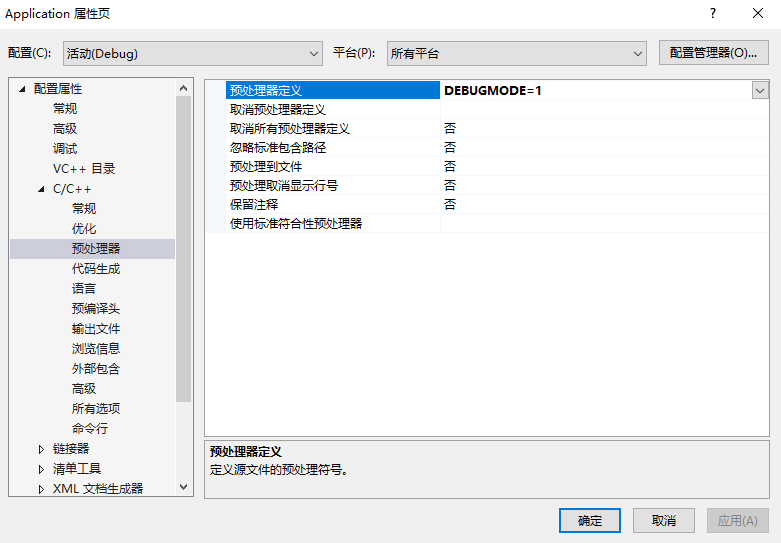

- 可以设置项目的预处理指令（省略`#define`，不能有空格），其**优先级低于人为编写的预处理指令**
- **与平台有关的预处理指令必须在项目设置中分别设置**

## Visual Studio项目

- Visual Studio编辑器及其项目文件仅能在Windows平台运行；如果不使用任何第三方插件，仅能构建运行于Windows平台的程序

### 解决方案与项目

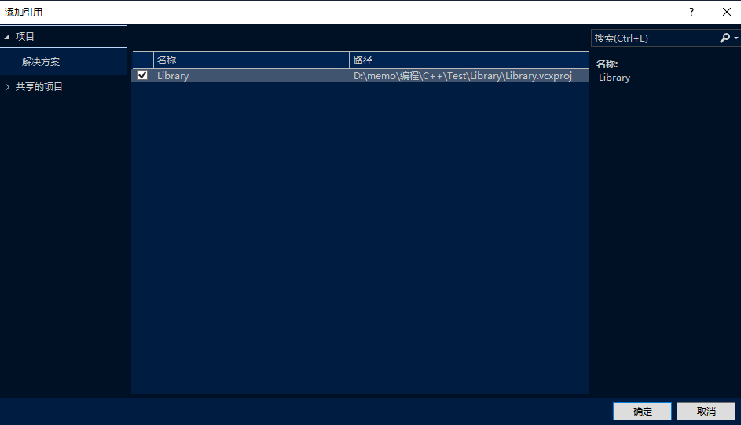

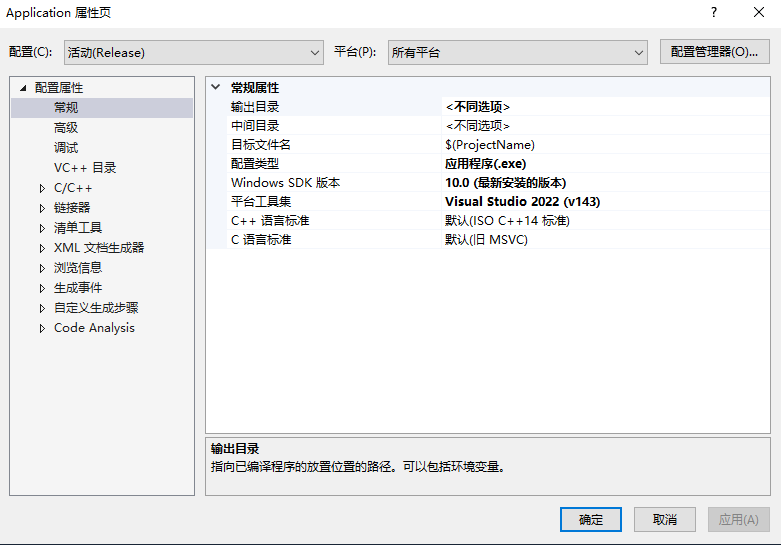

- 一个解决方案中包含若干个项目
  - 项目有独立的设置、独立的开发语言
  - 通常将其中一个设置为**应用程序（生成.exe）**，其余设置为**库（生成.dll或.lib）**，并**令应用程序引用各个库**
  - 设置了项目间引用，本质上是**将.lib、.dll生成到输出目录**（因此不必设置附加依赖项）

### 包含头文件

- **头文件(.h或无后缀)仅在预处理阶段发挥作用（本质上是单纯的复制），头文件缺失或内容错误可能在编译前或编译时被发现**


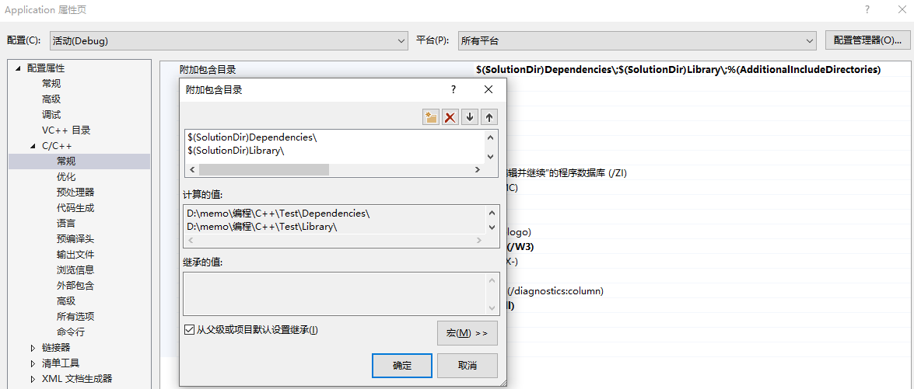

- 头文件通过#include指令引用，需指定文件路径，编译器尝试用若干种方式检索指定的头文件

| 路径类型                                 | 示例                                                   | 备注                        |
| ---------------------------------------- | ------------------------------------------------------ | --------------------------- |
| **标准库目录**下的相对路径               | `#include<iostream>`                                   |                             |
| **附加包含目录**下的相对路径             | `#include"glfw3.h"`                                    | 必须设置附加包含目录        |
| 从**当前源文件所在文件夹**出发的相对路径 | `#include"..\Dependencies\glfw3.h"`                    | `..\`表示退回上一级文件目录 |
| 绝对路径                                 | `#include"D:\memo\编程\C++\Test\Dependencies\glfw3.h"` |                             |

### 预编译头(Precompiled Header)

- **令一个头文件包含其他所有文件所需的部分头文件，并告知编译器，首先预编译这一头文件**
  - 其他文件不必再重复编译预编译头中的头文件，减少编译时间
  - 预编译的结果会被保留下来，修改源文件后，不必再重新编译预编译头，减少重编译时间

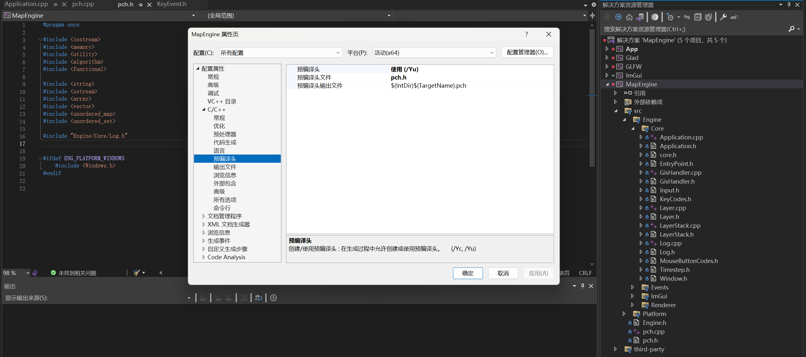

- 预编译头**以项目为单位**；将项目设置为使用预编译头，然后设置**从项目根路径开始的相对路径**以指明预编译头文件的位置
  - **其他文件如果要引用预编译头，必须放在其他头文件之前**

### 依赖静态链接库

- **静态链接库(.lib)仅在编译阶段发挥作用，编译得到的.exe文件无需依赖.lib文件即可运行**

- 默认情况下，在编译时，会自动查询**输出目录**下的静态链接库，使之参与编译
  - 令A项目引用B项目，并将B项目设为静态链接库，本质上是**在输出目录中创建B编译得到的.lib文件**

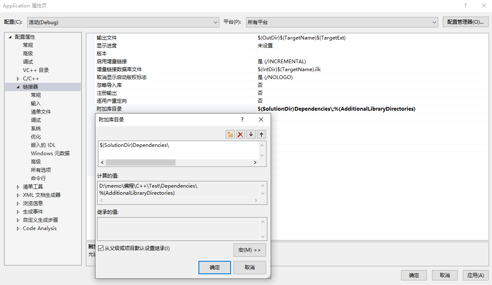

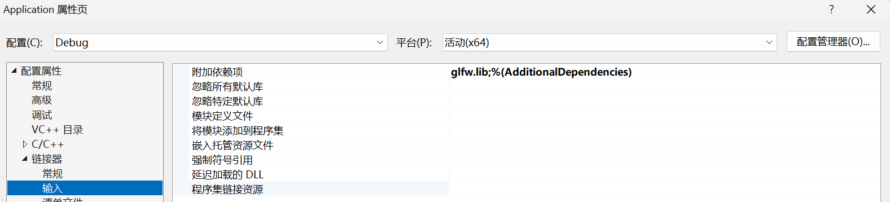

- 也可以人为设置静态链接库引用（在**附加库目录**中查找**附加依赖项**）


### 依赖动态链接库

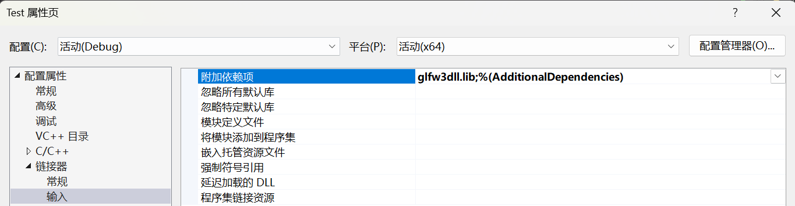

- **动态链接库(.dll)仅在exe文件运行时发挥作用，编译器不能访问dll文件**
  - **为了正确地编译，仍然需要引用lib文件**（C++程序使用的dll文件总是伴随着lib文件）
- exe文件运行时，会自动在**所在文件夹**中查询依赖的dll文件
  - 令A项目引用B项目，并将B项目设为动态链接库，本质上是**在输出目录中创建B编译得到的.dll文件**
- 多个应用程序可以**共用.dll文件**，这需要通过设置**环境路径、注册表**等方式实现

### 模块定义文件

- **模块定义文件(.def)用于规定.dll文件中需要导出的对象，及其导出顺序、别名等**
  - .def文件可以覆盖__declspec(dllexport)的作用，也可以一起使用
  - 某些情况下[1]，无法使用__declspec(dllexport)规定需要导出的对象，必须使用.def文件
- 需要人为设置模块定义文件引用（在**附加库目录**中查找**模块定义文件**）

[1]：有源文件A，.dll文件B，.lib文件C。A依赖B，B依赖C，而A不直接依赖C。如果用于生成B的源代码中没有使用C中的某个API，那么B中不会包含该API，此情况下如果在A中使用C中的某个API，会引发链接错误

# 内存管理

## 内存分区

- 现代操作系统使用虚拟内存，内存分区是基于**虚拟地址**划分的（下以Linux系统为例，地址从低到高）
- 物理地址和虚拟地址中都有内存碎片，但开发者通常关注的都是虚拟内存中的内存碎片

### 代码段(.text)

- 机器码形式的程序文件

### 只读数据(.rodata)段

- 常量。可以通过特殊方法修改
- 虚函数表也存放在常量区，因为虚函数表的内容也是常数

### 已初始化数据(.data)段

- 静态常量，已初始化的静态/全局变量

### 未初始化数据(.bss)段

- 未初始化的静态/全局变量的”元数据“（仅记录接下来要为各个静态变量分配多少空间，没有为这些未初始化变量分配内存）

### 堆(Heap)段

- 由new/malloc等关键字分配，由delete/free回收
- 堆区的大小理论上**等于虚拟内存大小**，实际上受限于物理内存（可能还要算上部分外存空间）
- 占用的总空间可以动态增长（从低地址向高地址增长）
- 堆分配需要在堆空间中查询足够大的一块内存空间，所以效率较低

### 文件映射段

- 临时存放进程要访问的文件
- 占用的空间由低地址向高地址增长

### 栈(Stack)段

- 不由new/malloc等关键字分配，编译后自动确定回收时机
- 栈分配只需要维护一些指针，以确定的顺序分配和回收内存，所以效率较高
- 栈区的大小**运行时固定，可在编译时设置**（Windows默认1MB）；**低地址为栈顶，高地址为栈底**
- 栈区中的变量不一定是连续分配的

### 内核空间(Kernel Space)

- 存放与操作系统有关，各种进程共通的数据（PCB，页表，中断向量表等）

# 语言特性

## 命名空间

- 仅辅助命名，不与访问修饰符产生协同作用
- `using namespace`指令根据在代码中位置的不同，在不同作用域内生效（文件内部/类内部/函数内部）
- 使用时须避免混淆，不应该在**头文件的全局范围中**使用`using namespace`

```c++
int Add(int a, int b)
{
    return a + b;
}
namespace AddFunction
{
    int Add(int a, int b)
    {
        return a - b;
    }
}

int main() 
{
    using namespace std;
    using namespace AddFunction;
    //cout << Add(1, 2);
    cout << ::Add(1, 2);        //::表示default global namespace
    cout << AddFunction::Add(1, 2);
    return 0;
}
```

- **匿名命名空间**中的对象只能被本文件访问，因此只应该用在**源文件**中（用于代替**静态全局变量**）

```c++
namespace	
{
    const char kOutputSize[] = "outputSize";
    const char kFixedOutputSize[] = "fixedOutputSize";
    const char kSamplePattern[] = "samplePattern";
    const char kSampleCount[] = "sampleCount";
    const char kUseAlphaTest[] = "useAlphaTest";
    const char kAdjustShadingNormals[] = "adjustShadingNormals";
    const char kForceCullMode[] = "forceCullMode";
    const char kCullMode[] = "cull";
}
```

## 关键字

### extern

- **修饰函数或变量，表示该对象既不存在于本文件中，也不存在于引用的头文件中（该对象所在的文件会直接或间接地引用本文件）**
  - 预处理时，对于extern对象，编译器会忽略其没有声明/定义的问题
  - 链接时，编译器会在所有被链接在一起的文件中查找该extern对象

```c++
//用户应当定义此方法,本文件不需要也不可能去引用用户的文件
extern Application* CreateApplication();

int main(int argc, char** argv)
{
	auto app = CreateApplication();
	app->Run();
	delete app;
}
```

### static

- **修饰全局变量（或函数）时，表示该全局变量（或函数）的作用域为当前源文件（建议改用匿名命名空间）**
- 修饰类成员时，表示该成员属于类而非任何一个实例
- 修饰本地变量时，表示该变量只会初始化一次且生命周期持续到程序结束

### inline

- **在现代编译器中，内联已完全由编译器控制，inline与内联无关，而是用于明确函数作用范围**
- **出现在多个翻译单元的同一函数（即头文件中的函数）必须以inline修饰其声明**
  - **如果头文件中成员函数的声明与定义重合，inline默认省略**
  - **在源文件中声明和定义的函数不需要inline修饰**

- **从C++17开始，可以有出现在多个翻译单元的同一变量，且必须显式以inline修饰**

### constexpr

- 用于修饰变量，表示该变量是**编译期**已知值的常量(`const`实例的值可以在运行时确定)
  - 可替代成员常量，这样各种类型的成员常量都可以在声明时直接初始化
- 用于修饰函数，表示该函数可以在**编译期**执行
  - 这类函数存在限制，随C++版本提高，限制逐渐减少
- 与宏定义不同，宏是简单的文本替换，`constexpr`是编译期的计算和优化

```c++
constexpr int square(int x) {
    return x * x;
}
constexpr int a = square(5);   // 编译期计算，a = 25
```

### auto

- 自动确定的变量类型
- **auto一定不会自动确定成引用（但可以自动确定成指针），必要时在auto后加上引用符号**
- 有利于减少代码修改，但同时影响可读性、可靠性；适用于代替名称过长的类型名

### decltype

- 用于确定现存实例或函数的类型，比`auto`更准确，能区分**有无引用/有无const/数组还是指针**

| decltype内的表达式      | 举例                                               | 例子推导结果         |
| ----------------------- | -------------------------------------------------- | -------------------- |
| 变量名/字面量           | `int x` `decltype(x)`                              | `int`                |
| 带括号的变量名          | `int x` `decltype((x))`                            | `int&`               |
| 函数名(后面需要补上`*`) | `bool compare(int a, int b) ` `decltype(compare)*` | `bool (*)(int, int)` |
| 非字面量的右值          | `int x` `decltype(move(x))`                        | `int&&`              |

```c++
bool compare(int a, int b) 
{
    return a > b;
}

int main() 
{
    std::map<int, std::string, decltype(compare)*> myMap(compare);
    return 0;
}
```


### friend

- friend关键字总是用在类中，且不被访问修饰符修饰

- 修饰全局函数：该函数可以访问此类的私有成员


- 修饰类：该类中的函数可以访问此类中的私有成员
- 友元**不具有对称性或传递性**，**不会自动继承**

```c++
class A {
private:
    int secret;
public:
    A(int v) : secret(v) {}
    friend void print(const A& obj);
};

void print(const A& obj) {
    std::cout << obj.secret << endl;
}
```

### for

- **for兼具foreach循环的作用；只要条件允许，就建议使用foreach循环**
- **如果容器中的元素为类实例，通常在foreach循环中使用引用以避免拷贝**

```c++
for(Vertex& v:vertices)
{
	cout << v << endl;
}
```

- **foreach循环中，不能增删容器元素；for循环中，必须考虑增删元素对循环的影响**

```c++
void Invoke(Args... args)
{
	typename std::list<IAction<Args...>*>::iterator it;
	for (it = actions.begin(); it != actions.end(); )
	{
		IAction<Args...>* p = *it;
		it++;	//调用p->Invoke时,p有可能将自身从actions中移除,可以提前令迭代器+1,避免访问被释放的内存
        //此做法无法防止p之后的元素被移除
		p->Invoke(args...);
	}
}
```

### noexcept

- 一般函数默认被`noexcept(false)`修饰，表示可能会抛出异常
- 析构函数默认被`noexcept(true)`（等同于`noexcept`）修饰，表示不会抛出异常
- 不会抛出异常是一种安全性的承诺，某些情况下会影响编译器的选择（见移动构造函数）
- 被`noexcept`修饰的函数，如果试图向上抛出异常，会调用`std::terminate`，导致进程中止

### __declspec

- `__declspec(dllexport)`:修饰类或全局方法（的声明），需要导出到dll文件的对象必须以此关键字修饰
- ` __declspec(dllimport)`:修饰类或全局方法（的声明），具体实现从dll文件导入的对象必须以此关键字修饰

```c++
#ifdef PLATFORM_WINDOWS		//表示某平台为WINDOWS(应当对项目而不是源文件设置)
	#ifdef DYNAMIC_LINK		//表示某个源文件采用动态链接
		#ifdef BUILD_DLL	//表示某个源文件需要导出为dll(而不是从dll导入)
			#define ENGINE_API __declspec(dllexport)
		#else
			#define ENGINE_API __declspec(dllimport)
		#endif
	#else
		#define ENGINE_API	//不使用动态链接,则将宏定义为空
	#endif
#endif
```

## 变量

### 声明/定义

- **变量声明：规定变量的类型和名称**
- **变量定义：规定变量的类型和名称，并为某个变量分配内存（是否分配内存，是区分声明和定义的唯一标准）**
  - **初始化：为变量分配内存并设定初始值（定义是初始化的一部分）**
  - **声明时初始化：声明语句和初始化语句重合**
- **每个翻译单元**必须各自包含要使用的变量**声明**，但变量**定义**在所有**相互链接的目标文件**中只能出现一次
  - **如果变量只有声明而没有定义，并且确实试图访问该变量，链接时会产生错误（某些类型的变量能够自动隐式初始化，便不会出现这种情况）**

### 变量类型

- **C++中没有引用类型/值类型之分**
- **所有类型的数据（包括数组、基本数据类型），都可以分配到栈上或堆上，关键是看分配内存时是否使用new、malloc等API**

### 类型转换

- 类型转换可能会改变数据（的二进制表示）
- 可以利用**类型转换运算符**（配合指针、引用等）进行各种类型转换，其行为可能是不确定、不安全的
- C++中添加了四个**类型转换函数**：
  - **static_cast：隐式类型转换，安全，可以省略（如子类指针转父类指针，某些数值类型之间转换）**
  - **dynamic_cast：指针、引用之间不安全的类型转换（如父类指针转子类指针）**
  - **reinterpret_cast：相当于改用不同类型的指针指向一个地址，不改变该地址上的二进制数据**
  - **const_cast：将常量指针/常量引用强制转换为非常量指针/非常量引用**

- 相比于类型转换运算符，类型转换函数并没有实现额外的转换，而是额外进行了合法性检测等工作
  - 能够使用static_cast的上下文中，使用dynamic_cast不会引发异常，但开销更高
  - 使用dynamic_cast时，若类型转换不合理，则会返回**空指针**或**抛出引用不可为空异常**

### 全局变量

- **定义在类外部的变量，作用域为全局**
- **通常在头文件中声明（必须以extern修饰），在源文件中定义**
  - **被static修饰时，作用域缩小到本文件，因此仅能用在源文件中**


## 指针

### 指针类型

- **（在64位系统上）指针本身只是一个表示地址的无符号8字节整数（相当于size_t），不与特定的数据类型绑定**
- **指针类型代表以何种方式访问该指针指向的数据，且可以用不同类型的指针指向同一地址**
  - **但指针类型的改变不一定是合法的，编译器对非法操作的处理是不确定的，要谨慎使用**
- **void*也是合法的指针类型，没有指明以何种方式访问该指针指向的数据**
  - **所有指针类型可以static_cast为void***
  - **void*须reinterpret_cast为其他指针**


### 指针运算

- **指针可以reinterpret_cast为size_t**
- **指针加/减常数时，实际的变化量要乘以指针指向数据占用的空间**
- **两指针相加无意义，两指针相减，返回值为size_t，结果要除以指针指向数据占用的空间**

### NULL和nullptr

```c++
#ifdef __cplusplus
#define NULL 0
#else
#define NULL ((void *)0)
#endif

using nullptr_t = decltype(nullptr);
```

- **`NULL`是`(void *)0`，可以转换成各种指针和数值类型，容易造成混淆**
- **`nullptr`是`std::nullptr_t`类型的一个字面量，能赋值给各种类型的指针，且试图赋值给数值类型会报错**

### 常量指针

- **不能通过指针来修改其指向的内容**
  - **对于某个类的常量指针，不能修改该类的成员变量，且只能访问有const说明符的成员函数**

- **对常量取地址会得到常量指针；不能把常量指针赋值给非常量指针**（会破坏常量的约束）

### 指针常量

- **不能修改指针指向的地址，不能为空指针（不需要检查常量指针或引用是否为空）**

```c++
char c = 'A';
const char* p1 = &c;		//常量指针
char* const p2 = &c;		//指针常量
const char* const p2 = &c;	//常量指针常量
```

## 引用

- 引用是变量的“别名”，**对引用赋值，实际上是修改引用指向的内容**；定义引用占用的空间等于指针
- **引用在初始化时必须赋值，因此可空对象只能用指针**；引用初始化后不能再指向另一个变量
- 引用和指针常量的其他不同：
  - `sizeof`返回引用所指向变量的大小，返回指针本身的大小
  - 用于传参、传返回值时行为不同


```c++
void F(int& arg);
void F(int* const arg);
int& a = b;	 
int* const a = &b;
```

## 数组

- **创建数组，本质上是分配一块连续的、存放多个同种元素的内存，并用指针指向起始地址**
- **数组可以分配在栈上或堆上；但如果编译时数组大小不确定，只能分配在堆上；利用模板参数可以在编译时确定数组大小**
- **利用sizeof运算符能够计算数组元素个数**

### 二维数组

- **每个元素为指向数组的指针**
- **各数组在内存中不连续，改用一维数组实现通常更高效**

```c++
int main()
{
	int col = 10;
	int row = 20;
	int** a1 = new int* [col];
	for (int i = 0; i < col; i++)
	{
		a1[i] = new int[row];
	}
	for (int i = 0; i < col; i++)
	{
		delete[] a1[i];	//delete[]与new[]依然一一对应
	}
	delete[] a1;
}
```

## 左值/右值

- **左值：可以**出现在赋值号左右两侧的对象（**≠确实**出现在赋值号左侧的变量）
  - 占用一块内存空间，可以取地址，未以const修饰时可修改
- **右值：只能**出现在赋值号右侧的对象（**≠确实**出现在赋值号右侧的变量）
  - 临时存在于内存或寄存器中，不可取地址，**被视为常量**
- **只要没有定义新的类实例（包括临时类实例），便不会调用任何一个构造函数**

### 移动

- 通常情况下，移动的实现是将A对象的成员浅拷贝给B对象，然后将A的指针成员设为空值
  - A对象不再使用，A的指针成员不会在A析构时释放，而是在B析构时释放
  - 但A不会立即析构（仍能访问A，但不应该这样做），依然是离开作用域时析构
- 通常通过**移动构造函数**和**移动赋值运算符**实现
- 已定义移动构造函数的情况下，调用移动构造函数的必要条件：赋值号左边是待初始化的类实例，赋值号右边是相同类的右值
  - 如果没有定义移动构造函数，转而试图调用拷贝构造函数
- 已定义移动赋值运算符的情况下，调用移动赋值运算符的必要条件：赋值号左边是已初始化的类实例，赋值号右边是相同类的右值
  - 如果没有定义移动赋值运算符，转而试图调用拷贝赋值运算符
  - 赋值本身不意味着创建新的类实例，除非赋值函数内部创建新的类实例

- `std::move`**将左值转换为右值**；该函数本身本身不进行移动，只是为移动创造**必要条件**

```c++
//将临时数据转移到容器中
std::vector<std::string> vec;
std::string s = "hello";
vec.push_back(std::move(s));

//临时数据传给函数
void takeOwnership(std::vector<int> v) { }
std::vector<int> data{1,2,3};
takeOwnership(std::move(data));

//移动unique_ptr
std::vector<std::unique_ptr<int>> vec;
vec.push_back(std::make_unique<int>(5));
auto p = std::move(vec[0]);	//不能拷贝unique_ptr,只能移动
```

### 左值引用/右值引用

- **不能将左值赋值给右值引用**
- **不能将右值赋值给左值引用，但可以赋值给常量左值引用（类似常量和常量指针的关系）**
- **左值/右值引用本身也属于左值，不构成移动的必要条件，除非`move([左值/右值引用])`**
- 用const修饰右值引用没有意义，和一般的右值引用没有区别

|                      | 左值                          | 左值引用 | 常量左值引用 | 右值引用 | 右值[1]                      |
| -------------------- | ----------------------------- | -------- | ------------ | -------- | ---------------------------- |
| **待初始化的类实例** | **分配内存，调用构造函数**[2] | 同左     | 同左         | 同左     | 同左                         |
| **已初始化的类实例** | **调用赋值运算符**[3]         | 同左     | 同左         | 同左     | 同左                         |
| **左值引用**         | **新增指针，指向已分配内存**  | 同左     | **不允许**   | 同左     | 不允许                       |
| **常量左值引用**     | **新增指针，指向已分配内存**  | 同左     | 同左         | 同左     | **新增指针，指向已分配内存** |
| **右值引用**         | 不允许                        | 不允许   | **不允许**   | 不允许   | **同上**                     |

*上表中，第一行表示赋值号右侧对象的类型，第一列表示赋值号左侧对象的类型*

[1]：特指与赋值号左侧相同类的实例，其他类的实例可能意味着调用一般的带参构造函数（构造时隐式类型转换）

[2]：调用哪个构造函数视情况而定，等号右边是右值时，才可能调用移动构造函数

[3]：调用哪个赋值运算符视情况而定，等号右边是右值时，才可能调用移动赋值运算符

```c++
class MyClass
{
public:
	int* a;
	MyClass()
	{
		a = new int(0);
		cout << "默认" << endl;
	}
	MyClass(const MyClass& t)
	{
		a = new int(*(t.a));
		cout << "拷贝" << endl;
	}
	MyClass(MyClass&& t) noexcept
	{
		a = t.a;
		t.a = nullptr;
		cout << "移动" << endl;
	}
	~MyClass()
	{
		delete a;
		cout << "析构" << endl;
	}
};
```

- **将函数参数定义为右值引用，与常量引用类似（万能引用），区别是仍然为移动保留必要条件**
  - **这种情况下，传参本身不会引发移动，函数内部用该参数构造新实例时才可能引发移动**

```c++
void Test(MyClass&& o)
{
    delete o.a;
	*(o.a) = 15;
	cout << *(o.a) << endl;
}

int main()
{
	MyClass o;					//默认
	Test(move(o));				//15
	cout << *(o.a) << endl;		//15
}								//析构
```

```c++
int main()
{
    Test t1;				//默认
    Test t2 = move(t1);		//移动
    cout << t1.a << endl;	//0(空指针)
}							//析构，析构
```

### 完美转发

- 完美转发是指，在函数传参时完美保留参数的**类别（左值/右值，有无const）**
- `std::forward`函数确保参数保持其原本的类别，进而确保调用了正确的函数重载
- 通常用在模板函数中；函数重载能在一定程度上实现完美转发的功能，但会使得代码十分臃肿

```c++
void target(MyClass& a)  { MyClass o =a; }
void target(MyClass&& a) { MyClass o =move(a); }

template<typename T>
void wrapper(T&& arg) {
    target(std::forward<T>(arg));
}

int main()
{
    MyClass obj;			//默认
    wrapper(obj);          	//拷贝,析构
    wrapper(MyClass());   	//默认,移动,析构,析构
    wrapper(std::move(obj));//移动,析构
}							//析构
```

## 函数

### 定义/声明

- **函数声明：规定函数的类型和名称**
- **函数定义：规定函数的类型和名称，及其具体实现（是否有具体实现，是区分声明和定义的唯一标准）**
  - **声明时定义：声明时直接包含函数定义**
- **每个翻译单元**必须各自包含要使用的函数**声明**，但函数**定义**在所有**相互链接的目标文件**中只能出现一次
  - 头文件被多个文件引用，因此**如果要在头文件中包含函数定义，必须使用内联**
  - 如果函数的定义和声明不分离，默认就是内联的
  - **如果函数只有声明而没有定义，并且确实试图调用该函数，链接时会产生错误**
- 如果函数不在声明时定义，**一部分说明符（static，virtual，override...）**仅出现在声明中

### 静态本地变量

- 作用域为函数体内部
- 多次执行函数的过程中，静态本地变量的值会被保留下来
- **定义静态本地变量的语句只会被执行一次（所以通常在定义时赋初值）**

```C++
class Library
{
public:
	void Log(int num)
    {
        static int prev = 0;
        cout << prev << endl;
        prev = num;
    }
};
```

### 签名

- 包括以下内容：
  - 函数名
  - 参数列表
  - noexpect说明符（C++17以后）

### 函数栈帧

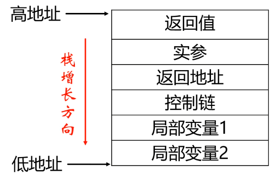

- 函数调用过程：
  1. **分配返回值**空间，优先使用寄存器；空间不足时使用栈，此时需要额外传递一个参数，即将要写入返回值的栈地址）
  2. 从左往右**传参**，优先使用通用寄存器，空间不足后使用栈
  3. **保存现场(建立栈帧)**，**caller‑saved寄存器**中的值入栈（之后可直接修改这些寄存器）
  4. 执行**call指令**，下一条指令地址入栈，然后跳转到函数入口地址
  5. 执行**函数体**，分配本地变量；如果用到**callee‑saved寄存器**，先将其值入栈
  6. 将算出的返回值写入相应位置
  7. 释放本地变量；将来自**callee‑saved寄存器**的值出栈
  8. **恢复现场(撤销栈帧)**，将来自**caller‑saved寄存器**的值出栈
  9. 执行**ret指令**，跳转到下一条指令的地址
  10. 清理栈中的剩余变量

### 参数

-  如果参数是类实例，传参时一定会在函数栈内分配新的类实例，并调用拷贝构造函数
-  如果参数是指针/引用，则只会拷贝地址
  -  特别地，如果传入临时类实例，则直接在函数栈内调用相应的构造函数

-  将参数定义为**实例常量**（而不是一般实例）意义不大，因为修改实例本身不影响函数外部
-  **默认参数**的语法与C#相同；函数定义和声明中，默认参数只需要且只能出现一次
-  **parameter**表示**“形参”**（比如用于讨论函数的参数列表如何定义），**argument**表示**“实参”**（比如用于给具体参数取名）

|                    | 类实例                 | 左值引用     | 常量左值引用           | 右值引用               |
| ------------------ | ---------------------- | ------------ | ---------------------- | ---------------------- |
| **外部类实例**     | 拷贝到函数栈           | 仅拷贝地址   | 仅拷贝地址             | 编译错误               |
| **左值引用**       | 拷贝到函数栈           | 仅拷贝地址   | 仅拷贝地址             | 编译错误               |
| **常量左值引用**   | 拷贝到函数栈           | **编译错误** | **仅拷贝地址**         | 编译错误               |
| **右值引用**       | 拷贝到函数栈           | 仅拷贝地址   | 仅拷贝地址             | 编译错误               |
| **临时类实例**     | **直接在函数栈内构造** | **编译错误** | **直接在函数栈内构造** | **直接在函数栈内构造** |
| **移动后的类实例** | **移动到函数栈**       | 编译错误     | **仅拷贝地址，不移动** | **仅拷贝地址，不移动** |

*上表中，第一行为定义函数时规定的参数类型，第一列为实际传入的参数；上表仅表示传参时发生的行为*


### 返回值

- **函数返回时的行为，和返回值本身的类型、生命周期有关，也和定义的返回值类型有关**
  - **返回值为基本数据类型时，直接复制**
  - **返回值为指针时，行为明确，即复制地址；必须确保该地址指向的对象没有被释放**
  - **返回引用时，行为不明确；但无论如何必须确保返回的对象没有被释放**
  - **返回类实例时，会正确地调用某种构造函数，可以用于返回会被释放的对象**
- **外部如果不接收返回值，那么返回时的行为不会执行**
- 理论上返回时使用`std::move`可避免额外分配、释放，实际上**返回值优化(RVO)**会自动避免这一情况
- 返回指针或引用时，函数调用本身可能成为左值
- 如果将返回值定义为**常量引用**，不能赋值给非常量引用，不能通过返回值修改实例成员（返回**实例常量**则没意义）
- 习惯上，**如果函数外部需要人为释放返回值指向的内存，便将返回值定义为指针（而不是引用）**


|                | 类实例                               | 左值引用                                                  | 常量左值引用 | 右值引用 |
| -------------- | ------------------------------------ | --------------------------------------------------------- | ------------ | -------- |
| **本地类实例** | **不构造本地变量，直接构造外部变量** | **违法操作**[1]                                           | 同左 | 编译错误 |
| **临时类实例** | **不构造本地变量，直接构造外部变量**         | 编译错误                        | **违法操作**[1] |**违法操作**[2]|
| **参数类实例**[5] | **调用移动构造函数构造外部变量**[3] | **违法操作**[1] | 同左 | 编译错误 |
| **全局类实例等** | **调用拷贝构造函数构造外部变量**[4] | **同左**                            | **同左** | 编译错误 |
| **移动后的本地/参数类实例** | 编译错误 | 编译错误 | **违法操作**[1] | **违法操作**[2] |
| **移动后的全局类实例等** | 编译错误 | 编译错误 | **正确地移动** | **正确地移动** |

*上表中，第一行为定义函数时规定的返回值类型，第一列为实际返回的对象；规定函数外部均以类实例（而不是引用）接收返回值*

[1]：调用拷贝构造函数时，本地变量已被释放，导致违法内存访问（不一定引发异常或数据错误）

[2]：会构造本地变量，并试图调用移动构造函数，但此时本地变量已被释放。外部变量复制了已被释放的指针，而外部变量析构时，试图再次释放这些指针，导致违法内存访问（一定会引发异常）

[3]：正确地先调用移动构造函数，再释放本地变量

[4]：正确地先调用拷贝构造函数，再释放本地变量

[5]：特指参数定义成了类实例，并返回参数的情况；如果参数定义成了引用或指针，再返回参数，实际上会导致[4]

```c++
class Test
{
public:
	int* a;
	Test()
	{
		a = new int(0);
		cout << "默认" << endl;
	}
	Test(const Test& t)
	{
		a = new int(*(t.a));
		cout << "拷贝" << endl;
	}
	Test(Test&& t) noexcept
	{
		a = t.a;
		t.a = nullptr;
		cout << "移动" << endl;
	}
	~Test()
	{
		delete a;
		cout << "析构" << endl;
	}
};
```

- 返回多个变量的方式：
  - 定义包含各个变量的结构体
  - 改用引用参数或指针参数（此方式一定不需要拷贝类实例）
  - 返回数组（实际上不能直接返回数组，只能返回指针，这意味着必须进行堆分配）
  - 返回array、vector等容器（不需要进行堆分配）
  - 返回元组

### const说明符

- 如果用const修饰**成员函数**：
  - 表示本函数不会修改所在类的所有**非静态成员变量**
  - 此函数不能调用**无const修饰**的**成员**函数
  - **某个类的常量引用或常量指针只能访问以const修饰的成员方法**


```c++
class Test
{
public:
	const char* s = "Hello";
	void Print() const {}
	void Reset() {}
};
class TestPtr	//相当于unique_ptr
{
private:
	Test* p;
public:
	TestPtr(Test* p) { this->p = p; }
	~TestPtr() { delete p; }
	Test* operator->()
	{
		return p;
	}
	const Test* operator->() const
	{
		return p;
	}
};

int main()
{
	const TestPtr t = new Test();
	t->Print();
	t->Reset();	//正确地报错，发挥了const的作用
}
```

*以上代码中，如果删掉第二个operator->，或删掉其返回值中的const，那么TestPtr的const约束便无法按照设想那样延申到Test*上*

- **有时一个函数应当提供有/无const说明符的两个版本，确保常量引用和常量指针正确地发挥约束作用**

### 虚函数

- 以virtual修饰的函数一定是虚函数
- **若一个函数是虚函数，其子类中同签名的函数，无论是否以virtual修饰，均为虚函数**

### 纯虚函数

- 纯虚函数是特殊的虚函数，不包含实现（类似C#的abstract）
- 以virtual修饰，函数名后附加“=0”的，一定是纯虚函数
- 若一个函数是纯虚函数，其子类中同签名的函数，如果函数名后依然附加“=0”，则依然为纯虚函数；否则为一般的虚函数
- 如果一个函数不是纯虚函数，其子类中同签名的函数，不能是纯虚函数

### 重载/重写/覆盖

- 只有**同一个类或有继承关系的若干个类中同名且签名不同的函数**才可能发生**重载**
- 只有**有继承关系的若干个类中的同签名函数**才可能发生**重写或覆盖**（类似C#中的override和new）
- **只有使用指针，才有可能正确地调用被重写的函数**
- override是说明符，表示该函数可能发生重写，非必须，主要作用是帮助编译器检查
- 判断重写/覆盖的步骤：
  1. 假设构造了B类型的实例，B继承A，通过A类型指针调用F函数
  2. **确定A中的F函数是否为虚函数（不用看A的子类，可能要看A的父类）**
  3. **是虚函数时，发生重写；否则发生覆盖**

```C++
class Gen1
{
public:
	void F()
	{
		cout << "Gen1" << endl;
	}
};
class Gen2 : public Gen1
{
public:
	void virtual F() //这里不可使用override
	{
		cout << "Gen2" << endl;
	}
};
class Gen3 : public Gen2
{
public:
	void F() override
	{
		cout << "Gen3" << endl;
	}
};
class Gen4 : public Gen3
{
public:
	void F() override
	{
		cout << "Gen4";
		Gen3::F();	//子类函数中调用父类函数
	}
};

int main()
{
	Gen1* g1 = new Gen2();
	g1->F();				//Gen1
	Gen2* g2 = new Gen3();
	g2->F();				//Gen3
	Gen3* g3 = new Gen4();
	g3->F();				//Gen4Gen3
	Gen1* g4 = new Gen4();
	g4->F();				//Gen1
}
```


## 运算符

- **运算符重载如果依附于单个实例，则定义在该实例类的内部，否则定义为全局函数**
  - **全局函数和成员函数的调用方法不同（C#中，可以通过this参数统一两者，但C++中不行）**
  - **如果全局函数需要访问private成员，应使用友元**


### new

- 为类实例分配内存空间。指针类型固定，大小自动计算，然后会自动调用该类型的构造函数
  - 从底层来看，调用名为**operator new**的标准库函数分配内存
  - 是**类型安全**的，试图把new对赋值给其他类型会编译错误

- `new[]`用于分配多个连续的内存块（数组）
- `new(nothrow)`称为**nothrow new**，如果分配失败会返回`nullptr`而不是抛出`std::bad_alloc`异常
- `new({实例名})`称为**placement new**，不额外分配内存，而是在分配好的内存上重新初始化
- 重载new运算符，可用于检查是否发生堆分配

### delete

- 回收一个类实例的内存空间。会自动调用析构函数
  - 从底层来看，为**operator delete**的标准库函数回收内存

- delete[]用于回收多个连续的内存块（数组）

### =

- **如果赋值号左侧是尚未构造的对象，那么等号必然会调用某种构造函数，否则调用赋值运算符**
- **赋值运算符必须人为定义，可能需要定义多个不同参数的重载**
  - 未定义则不可使用等号运算符，这时该类实例具有**“不变性”**（见以下代码）
  - 最常见的以**常数引用**为参数，与拷贝构造函数共同发挥作用
  - 以**右值引用**为参数的等号运算符也被称为**移动赋值运算符**（见移动构造函数）


```c++
struct Vector2
{
	const int x, y;
	Vector2() :x(0), y(0)
	{
		cout << "默认" << endl;
	}
	Vector2(int x, int y) :x(x), y(y)
	{
		cout << "带参" << endl;
	}
	Vector2(const Vector2& v) :x(v.x), y(v.y)
	{
		cout << "拷贝" << endl;
	}
	Vector2 operator=(const Vector2& v) const	//错误的写法
	{
        cout << "重载" << endl;
		return Vector2(v.x, v.y);
	}
};

int main()
{
	Vector2 v0(1, 2);	//带参
	Vector2 v1 = v0;	//拷贝
	v1 = v0;			//重载
}
```

| 类                  | 调用赋值运算符时行为                             |
| ------------------- | ------------------------------------------------ |
| C#中的string        | 该指针（引用类型）指向一个新的地址               |
| Unity中的Vector2    | 该指针（引用类型）指向一个新的地址               |
| C++中的string       | 该实例的一个成员（指向字符串的指针）的值发生改变 |
| 上面代码中的Vector2 | **该实例所有成员的值不会发生改变**               |

### <<

- 全局函数，第一个参数为**ostream&**（不可用const修饰），返回值为ostream&

```c++
class Vector2
{	
    int x, y;
public:
	Vector2(int x, int y) :x(x), y(y) {}
	Vector2 operator+(const Vector2 v)
	{
		return Vector2(x + v.x, y + v.y);
	}
	friend ostream& operator<<(ostream& stream, const Vector2& v);
};

ostream& operator<<(ostream& stream, const Vector2& v)
{
	stream << "(" << v.x << "," << v.y << ")";
	return stream;
}

int main()
{
	Vector2 v1(1, 1);
	Vector2 v2(-1, 1);
	cout << v1 + v2 << endl;	//(1,2)
}
```

### ->

- **此运算符无参数，默认情况下，此运算符返回*this**
- **常用于智能指针这种在核心功能上“包装”了一层的情况，目的是简化调用**
- **通常应该提供有const说明符和无const说明符的两个重载**

```c++
class Test
{
public:
	const char* s = "Hello";
	void Print() const
	{
		cout << s << endl;
	}
};

class TestPtr	//相当于unique_ptr
{
private:
	Test* p;
public:
	TestPtr(Test* p)
	{
		this->p = p;
	}
	Test* operator->()
	{
		return p;
	}
	const Test* operator->() const
	{
		return p;
	}
	~TestPtr()
	{
		delete p;
	}
};

int main()
{
	const TestPtr t = new Test();
	t->Print();
}
```

### ==

- 要比较两个自定义类型的**实例**是否相等，要将==运算符的重载定义为**成员函数**（如果是非成员函数的运算符重载，不能两个参数都是自定义类型）
- 要比较两个自定义类型的**指针**是否相等（比较其具体内容，乃至多态相关的问题），不能通过重载该类型的==运算符；对两个指针使用==运算符始终意味着比较地址是否相等

## 函数指针

- 除了直接调用，函数只能以指针的形式存在（一般情况下，函数的取地址符可省略）
- 如果两个函数的参数列表和具体实现完全相同，可能会被优化成同一个函数，具有相同的地址
- **函数指针的释放时机由编译器自动确定，不应人为释放**

```c++
int Func(int a)
{
    return a;
}
int main(int argc, const char* argv[])
{
    int (*p1)(int a);	//p为函数指针类型的实例
    p1 = Func;
	typedef int (*int_int)(int a);	//int_int定义了一个函数指针类型
	int_int p2 = Func;
    return 0;
}
```

- **无法直接获取成员函数的地址**
- **成员函数指针、函数指针、数据指针间不可相互转换/比较**

```c++
class Comparer
{
public:
    bool Compare(int a, int b)
    {
        return a > b;
    }
};

int main()
{
    Comparer c;
    auto F = &Comparer::Compare;	//bool(Comparer::*F)(int, int) = &Comparer::Compare;
    cout << (c.*F)(1, 0) << endl;	//F与无法用于区分来自不同实例的同一成员方法
    return 0;
}
```

## lambda表达式

- 用完即弃的匿名方法
- lambda表达式中，可以**捕获**变量，分为按值捕获和按引用捕获（类似函数传参）
- lambda表达式可以用作函数的返回值，赋值给`func`等对象
  - 返回被捕获变量和返回一般变量类似，返回引用或指针有风险；必要时按值捕获（或取内容），将变量复制一份到函数外
  


```c++
#include <iostream>
#include <functional>

std::function<int()> create_lambda_bad() {
    int local = 10;
    // 自动按引用捕获所有用到的变量
    return [&]() { return local; };
}

std::function<int()> create_lambda_good() {
    int local = 10;
    // 自动按值捕获所有用到的变量
    return [=]() { return local; };
}
```

## 类

- **类不能加修饰符，相当于固定为public**

### 成员变量

- 如果将成员变量定义为**实例**：
  - **若来源为外部实例，会发生拷贝**
  - **类析构时自动释放**

- 如果将成员变量定义为**指针**：
  - **若在类内部分配地址，一般必须在类析构时回收（注意避免接收外部传入的地址）**
  - **若来源为外部地址，可以深拷贝，析构时释放目的地址，源地址在外部人为释放（效率低但通用的做法）**
  - **若来源为外部堆地址，可以浅拷贝，可以选择析构时释放或由外部释放（效率高，必须向外部说明，必须避免传入栈地址）**
  - **若来源为外部栈地址，可以浅拷贝，等外部自动释放（效率高，必须确保使用时外部尚未释放该成员的空间）**
  - **构造时可以初始化为空，之后重新赋值**

- 如果将成员变量定义为**引用**：
  - **类析构时自动释放（释放指针本身的空间，而不是被引用对象占用的空间）**
  - **若来源为类外部对象，仅浅拷贝地址（必须确保使用时外部尚未释放该成员的空间）**
  - **构造时必须引用现存对象**


### 可变成员变量

- 以**mutable**修饰的成员变量
- 带有const说明符的成员函数也可以修改可变成员变量

### 成员初始化

|                        | 全局语句     | 声明时              | 初始化成员列表 | 构造函数内部        | 没有显式初始化               |
| ---------------------- | ------------ | ------------------- | -------------- | ------------------- | ---------------------------- |
| **静态实例**           | **可行**     | **可能编译错误[1]** | **编译错误**   | **只是重新赋值[2]** | **链接错误[3]**              |
| **实例**               | **编译错误** | 可行但少见          | 可行           | 可行                | **试图自动调用无参构造函数** |
| **指针**               | 同上         | 可行但少见          | 可行           | 可行                | **野指针**                   |
| **引用**               | 同上         | 可行                | **可行**       | **只是重新赋值[2]** | **编译错误[4]**              |
| **常量实例/指针/引用** | 同上         | **可行**            | **可行**       | **编译错误[5]**     | **编译错误[4]**              |

*上表中，第一行表示初始化时机，第一列表示成员类型*

[1]：如果被`constexpr`或`inline`修饰，可以直接初始化（但`const`不行）；int,bool,枚举类型的静态实例可以直接初始化

[2]：如果在此前没有以别的方式前初始化，会导致链接错误

[3]：只有声明没有定义；如果试图访问该成员，会导致链接错误

[4]：包含此类型的成员时，无法生成默认构造函数；如果又没有人为定义构造函数并初始化该成员，则试图构造实例时导致编译错误

[5]：实质上是试图重新赋值，而常量无法重新赋值

```c++
class Library
{
public:
	const static int c = 5;	//声明时初始化
	const static int num;	//声明
	const char* s = "Hello";//声明时初始化
	const int& i = 1;		//声明时初始化
};

//静态成员初始化语句必须位于.cpp文件中
const int Library::num = 1;	//初始化,注意const不能省略（如果有引用或指针,也不能省略）
```

### 构造函数

- **定义类实例而不赋值也会调用默认构造函数**
- **调用构造函数时，当且仅当使用new运算符时，才进行堆分配，才会返回指针**
- **构造函数执行顺序：**
  1. **如果有父类，先执行其父类的构造函数（头递归）**
  3. **按照初始化成员列表，执行各个成员变量的构造函数（按照定义顺序）**
  4. **执行自身的构造函数内部的代码（各成员之前已构造好，只可能发生重新赋值）**


```c++
class Test
{
public:
	int* a;
	Test(const Test& t)
	{
		a = new int(*(t.a));
	}
	~Test()
	{
		delete a;
	}
};
```

#### 默认构造函数

- 未定义构造函数时，（编译时）自动生成默认构造函数，某些情况下无法生成默认构造函数（见成员初始化）
- 无论参数列表如何，人为定义的任何构造函数均覆盖默认构造函数
- 利用default关键字可以定义与默认构造函数相同的无参构造函数

```c++
class Test
{
public :
	Test() = defalut;
};
```

#### 拷贝构造函数

- **拷贝构造函数可分为三类：**
  - **A：默认拷贝构造函数**（只进行浅拷贝）
  - **B：以该类常量引用为参数的拷贝构造函数**
  - **C：以该类引用为参数的拷贝构造函数**
- **永远使用B，而不是C（见传参）；更不要让B和C共存，会导致问题变得复杂**

```c++
class Test
{
public:
	int* a;
    Test()
	{
		a = new int(0);
	}
	Test(const Test& t)
	{
		a = new int(*(t.a));
	}
	~Test()
	{
		delete a;
	}
};
```

#### 移动构造函数

- **参数列表为右值引用，必须添加noexcept说明符（否则编译器可能会保守地转而调用拷贝构造函数）**
- **人为定义的移动构造函数会覆盖默认移动构造函数，仅定义拷贝构造函数而不定义移动构造函数则会导致该类没有移动构造函数**
  - **默认的移动构造函数仅执行浅拷贝，而不会将指针成员设为nullptr（见move）**
  - **默认移动赋值运算符不存在，用到时必须人为定义**

```C++
class Test
{
public:
	int* a;
	Test()
	{
		a = new int(0);
	}
	Test(Test&& t) noexcept
	{
		a = t.a;
		t.a = nullptr;
	}
    Test& operator=(Test&& t) noexcept
	{
        if(&t != this)
        {
			a = t.a;
			t.a = nullptr;
        }
        return *this;
	}
	~Test()
	{
		delete a;
	}
};
```

#### 初始化成员列表

- **如果一个成员没有出现在初始化成员列表中，必定要调用该成员的无参构造函数**
  - **没有无参构造函数的成员必须出现在初始化成员列表中**
  - **直接初始化比初始化后再赋值开销更低**
  - **可以用于初始化常量成员、引用成员，但不可用于初始化静态成员**
  
- **初始化成员列表按照定义变量的顺序执行，与列表中的顺序无关**
- **如果调用了父类的构造函数，自身成员初始化必须位于调用父类构造函数之后**
- 如果构造函数的声明与定义分离，初始化成员列表应当仅出现在定义中

```C++
class Test
{
    string name;
public:
	Test() :name("Eden")	//直接把"Eden"写到Test实例的相应内存区域
    {
        
    }
};
```

```c++
class Test
{
    string name;
public:
	Test()
    {
        name = "Eden";	//在栈上临时为一个string分配内存,写入"Eden",然后拷贝到Test实例占用的内存区域
    }
};
```

#### 构造时隐式类型转换

- **栈分配类实例**，且该类构造函数仅有一个参数时，可以简写为形如`Test t1 = "Hello";`
- **函数的某个参数为类实例或类引用**，且该类构造函数仅有一个参数时，可以简写为形如`Print("Hello");`
- **使用explicit修饰构造函数可禁用构造时隐式类型转换（但依然可以显式类型转换）**

```c++
class Test
{
public:    
    Test(const char* s) { cout << s << endl; }    
    Test(const Test& t) { cout << "Copy" << endl;}
    explicit Test(int num) { cout << num << endl; }
};
void Print(const Test& t)
{    
    cout << "Print" << endl;}
int main()
{    
    Test t1 = "Hello";    
    Test t2 = t1;    
    Print("Hello");     //Hello Print    
    Print(t1);          //Print    
    Test t3 = (Test)1;  //1（显式类型转换）
}
```

### 析构函数

- 分配在栈上的类实例被自动释放时，或分配在堆上的类实例被delete时，会调用析构函数
- 类实例被释放时，类成员本身占用的空间会自动释放，**需要在析构函数中释放的是类成员中指针（包括数组）指向的空间**

```c++
class Test
{
public:
	Test() { cout << "构造" << endl; }
	virtual ~Test() { cout << "析构" << endl; }
};
void F()
{
	Test* p = new Test();	//离开函数后不会析构，发生内存泄露
	Test t;					//离开函数后自动析构
}

int main()
{
	F();
}
```

- 有可能被继承的类，应当定义**虚析构函数**（子类析构函数自动为虚析构函数，**不需要继续用virtual修饰**）
  - 子类的析构函数不会重写父类的，而是会**先后**被调用（除非父类的析构函数是纯虚函数）


### 继承

#### 访问权限

- **类继承时默认采用私有继承（C#默认采用公有继承）**
- **如果不是非公有继承，不能直接实现多态（子类指针不能隐式转换为父类指针）**
- **C++允许多重继承，且没有接口的概念**

| 修饰符    | public继承后 | protected继承后 | private继承后 |
| --------- | ------------ | --------------- | ------------- |
| public    | public       | protected       | private       |
| protected | protected    | protected       | private       |
| private   | 不可见       | 不可见          | 不可见        |

- **private表示子类可见，但不能继续继承；prtoteted表示，子类可见，且可以继续继承**

#### 成员函数

- **在子类中，要调用父类中被重写/覆盖的函数时，需指明父类名**
- **调用子类的构造函数前，必须先调用父类的某个构造函数（如果没有指定，则尝试调用默认构造函数）**
- **如果有可能将子类实例赋值给父类指针，父类的析构函数必须用virtual修饰**

```c++
class Parent
{
public:
	int age;
	Parent()
	{
		age = 0;
	}
	Parent(int age)
	{
		this->age = age;
	}
	virtual ~Parent()
	{

	}
	void F()
	{
		cout << "Parent" << endl;
	}
};
class Child : public Parent
{
public:
	Child()
	{

	}
	Child(int age) :Parent(age)
	{

	}
	~Child()
	{

	}
	void F()
	{
		Parent::F();
		cout << "Child" << endl;
	}
};
```

#### 多继承

- 如果一个类继承多个父类，每个父类的成员变量和函数都会继承一份
- 发生**菱形继承**时，父类的父类中的每个成员会被继承两次，产生二义性
  - 试图直接访问父类的父类的成员会引发编译错误，必须**显式指定**访问从哪边继承而来的成员

#### 虚继承

- 虚继承：以`virtual`关键字修饰的继承（和访问修饰符并存）
- 虚基类：如果类B虚继承类A，那么A是B，以及B的所有子类的虚基类（但B不是其子类的虚基类）
  - 对于每个虚基类，编译时要创建一个**虚基类表**
  - 对于每个虚继承的类实例，要额外分配一个**虚基类指针**（不同于虚函数指针，被继承时会被复制），指向虚基类表

- 在菱形继承中，**虚继承所有**父类，可避免成员复制和二义性
- 虚继承会引入额外的虚基类表，以及额外的访问**虚基类**成员的成本

### 多态

- **如果将某个变量定义为类实例，就一定表示那个类本身，而不是其派生类的实例**
  - **不能定义包含纯虚函数的类实例**

- **而某个类的指针可以指向其派生类的实例，因此要实现多态必须使用指针**
  - 需要实现多态的父类必须有**至少一个虚函数**（否则多态无意义）


```C++
class Parent
{
	virtual void F()
	{

	}
};

class Son : public Parent
{

};

int main()
{
	Parent* p1 = new Son();
	Son* s = dynamic_cast<Son*>(p1);
}
```

### 内存布局

- 类实例总是占用连续的一块内存，包括**虚函数表指针（如果有）**，**虚基类指针（如果有）**，**非静态成员变量**
  - 如果继承了父类，父类的成员变量总是排在子类的成员变量之前
  - 多继承的情况下，所有父类的成员按继承顺序排列
  - 菱形继承+虚继承的情况下，原本被复制两份的祖父类成员会被放到最后，且引入额外的虚基类指针和虚基类表（？）

- **空类固定占用1B空间**（为了确保不同实例具有不同地址）

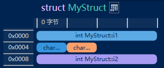


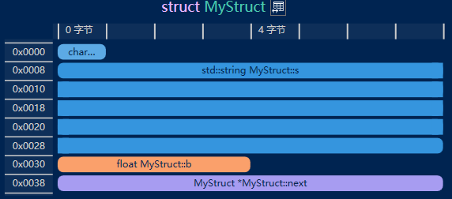

- **对齐要求**：对类实例或类实例成员占据空间以及首地址的要求，以字节为单位
  - 类实例的首地址必须是类的对齐要求的整数倍；所有**成员的首地址**必须是**成员自身(而非整个类)对齐要求**的整数倍
  - `alignof`关键词将“对齐要求”作为整型返回；定义类时`alignas`关键词可指定块的大小（如果小于默认对齐要求，则被无视）
  - `#pragma pack`宏用于强制设置结构体的对齐要求，会正常地影响包含这一结构体的其他结构体
- 对齐要求取决于**所有类成员对齐要求的最大值**
  - 对于内置类型成员，对齐要求等于其自身占用空间
  - 对于类和结构体成员，递归地求其对齐要求（如`std::string`占40B，但对齐要求为8B）
- **变量按照定义顺序分配内存，满足上述规则的前提下尽量紧密排列**
- 内存对齐主要出于性能考虑，因为现代计算机中，CPU、缓存总是一次性访问一块数据（比如64位系统每8字节一块）
  - 某些原子操作可能强制要求内存对齐


```c++
#pragma pack(1)
struct Packed{	//5Byte
char c;
int i;
};
#pragma pack
struct Test{	//17Byte
    Packed a;
    int num;
    Packed b;
};
```

### 虚函数表

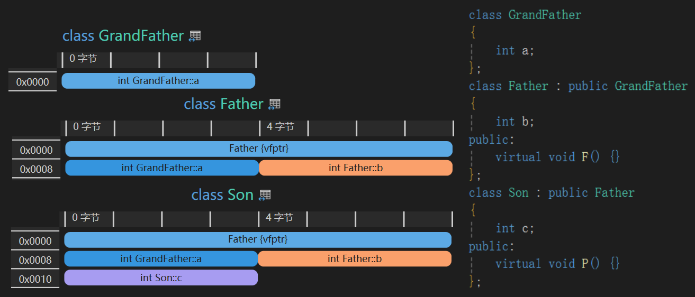

- **虚函数表**：类似数组，其中包含若干个虚函数指针，**通常位于只读数据段**，大小就等于其中指针所占大小
- **虚函数指针**：每个指针指向该类中的虚函数实现，本质上是指向**代码段**的地址
- **虚函数表**在**编译**时生成
  - **编译阶段**中的**语义分析阶段**确定了虚函数表的逻辑结构
  - **汇编阶段**生成**中间文件**时，确定虚函数表将占用的段、各个表项的符号引用（可重定位），并将虚函数表写入文件
  - **链接阶段**，可能会合并相同的虚函数表，并完成函数地址**重定位**
- 每次构造类实例时，分配虚函数表指针
  - 指向哪个虚函数表，取决于调用哪个构造函数
  - 将某个实例的指针赋值给父类指针不改变虚函数表指针
- 如果一个类继承N个带有虚函数的类，则通常需要分配N个虚函数表，且每个该类实例需要分配N个虚函数表指针
  - 如果父类没有虚函数而自身有虚函数，则具有一个虚函数表
  - 如果父类和自身都有虚函数，会和自其中一个父类（默认第一个）继承而来的虚函数放在一个表中
  - 特别地，虚继承的情况下，自身如果有虚函数，会额外使用一个虚函数表指针
  

## 结构体

- 结构体和类几乎一样，唯一区别是**结构体的成员默认为public，且默认采用公有继承**
- 习惯上，单纯包含一些public数据的对象会被定义为结构体
- 可以定义**匿名结构体成员（指成员变量没有名称，而不是结构体没有类型名）**，如此便可以直接访问该结构体的成员

## 联合体

- 各个成员占用相同的一块内存空间：
  - 第一个成员规定了整个联合体占用的空间
  - 联合体中每个成员可以视为**指向同一个地址的不同指针**
- 可以定义匿名联合体**（指联合体实例没有名称，联合体是否有类型名不影响）**：
  - 非匿名联合体中可以像类一样定义成员方法，但无法使用继承、虚函数等特性
  - 不能定义全局匿名联合体，要么命名，要么改变作用域（设为静态也是改变作用域）
  - 在类/结构体中定义匿名联合体，便可以直接访问其中的成员

```C++
struct Vector2
{
	float x, y;
	float Magnitude()
	{
		return sqrtf(x * x + y * y);
	}
};
struct Vector3
{
	float x, y, z;
	float Magnitude()
	{
		return sqrtf(x * x + y * y + z * z);
	}
};
struct Vector4
{
	union
	{
		struct
		{
		    float x, y, z, w;
		};
		struct
		{
			float r, g, b, a;	//取别名
		};
		struct
		{
			Vector3 v3;			//视为Vector3，不访问w
		};
		struct
		{
			Vector2 v2a, v2b;	//视为两个Vector2
		};
	};
};

int main()
{
	Vector4 v4 = { 1.0f,2.0f,2.0f,4.0f };
	cout << v4.v3.Magnitude() << endl;
	v4.z = 3.0f;
	cout << v4.v2a.Magnitude() << endl;
	cout << v4.v2b.Magnitude() << endl;
}
```

## 枚举

- 访问枚举常量时，仅需要给出枚举常量名，而不用给出枚举名（与C#不同），这意味着枚举常量不能和其他作用域重合的对象重名
- 可以利用namespace、using指令辅助命名

## 模板

- 模板比泛型的功能更强大，且限制更宽松（编译前不检查语义上的错误，编译时才会发现），模板中的“T”称为”模板参数“
- **模板参数不仅可以表示单个未确定的类型（以typename修饰），还可以表示若干个未确定的类型（模板参数列表），及未确定的值（以具体变量类型名修饰）**
- 模板本质上是**编译时执行的自动代码生成手段**；定义模板函数后，只有以具体模板参数调用了该函数，编译后才包含对应版本的函数（这一行为也称为模板的**实例化**）
- **模板和模板特化必须定义在同一命名空间中**，而实例化不必（引用的头文件中含有模板即可）

### 模板函数

- **模板函数（及模板类中的函数）及其特例化的定义一般位于头文件中**（如果位于源文件中，编译器无法自动确定需要编译哪些版本的模板函数）
- 调用模板函数时优先选择匹配的特化
- 需要访问模板类实例时且无法确定某模板参数时，应使用模板方法

```c++
template<int size>
void Reset(Array<int, size> a)
{
	for (int i = 0; i < size; i++)
	{
		a[i] = 0;
	}
}
```

### 模板类

```C++
template<typename T,int size>
class Array
{
public:
	T datas[size];	//在栈上分配的大小"不确定"的数组
	T& operator[](int index)
	{
		return datas[index];
	}
};

int main()
{
	Array<int,10> a;
	a[0] = 1;
}
```

- 模板类支持偏特化（模板函数不行，应当转而利用函数重载，或`enable_if`等）
  - 全特化：为模板的所有参数指定具体类型
  - 偏特化：为模板的部分参数指定具体类型

```c++
template <typename T, typename U>
class MyClass {};

template <typename T>
class MyClass<T, T> {};

template <typename T>
class MyClass<T, int> {};

//后续给出MyClass<int*,float*>之类的全特化时,优先匹配此偏特化版本
template <typename T, typename U>
class MyClass<T*, U*> {};
```

- 模板类中还可能包含模板类和模板参数，即模板嵌套

```c++
template<typename I, typename TResult, typename ... Args>
class MemberFunc;

template<typename TResult,typename ... Args>
class IFunc
{
public:
	template<typename I_, typename TResult_, typename ... Args_>
	bool Equal(const MemberFunc<I_, TResult_, Args_...>& other);
};

template<typename I, typename TResult,typename ... Args>
class MemberFunc :public IFunc<TResult, Args...>
{
	TResult(I::*F)(Args...);
	I* instancePtr;
public:
	bool operator==(const MemberFunc<I, TResult, Args...>& other)
	{
		return F == other.F && instancePtr == other.instancePtr;
	}
};

template<typename TResult, typename ... Args>
template<typename I_, typename TResult_, typename ... Args_>
bool IFunc<TResult, Args...>::Equal(const MemberFunc<I_, TResult_, Args_...>& other)
{
    MemberFunc<I_, TResult_, Args_...>* p = dynamic_cast<MemberFunc<I_, TResult_, Args_...>*> (this);
    if (p)
        return p->operator==(other);
    return false;
}
```

- 定义模板类实例时，如果还不能具体确定模板参数，则必须使用`typename`修饰

```c++
template<typename TResult, typename ... Args>
class Func : public Delegate
{
	std::list<IFunc<TResult, Args...>*> funcs;
public:
	void Test()
	{
		typename std::list<IFunc<TResult, Args...>*>::iterator it;	//无法确定具体模板参数
		for (it = funcs.begin(); it != funcs.end(); it++);
	}
};
```

- 利用using指令可以给模板类取别名

```c++
template<typename T>
using Ref = std::shared_ptr<T>;

Ref<int> a;
```

- 如果父类为模板参数不确定的模板类，访问父类成员时必须使用this->，否则编译器无法正确编译

```c++
template<typename TValue, typename TLerp>
class Circulation : public Timer<TValue, TLerp>
{
protected:
	virtual void AfterComplete_(TValue _)
	{
		TValue temp = this->target;
		this->target = this->origin;
		this->origin = temp;
		this->Restart();
	}
};
```

### is_same

- `std::is_same<A,B>::value`：A与B相同时，此表达式返回true，否则返回false

```c++
template<typename TResult, typename... Args>
class Func : public Delegate
{
public:
    //编译时,会生成很多版本的此函数,每个版本的返回值在编译时就已确定
    template<typename TResult_, typename... Args_>
    bool IsSameAs(const Func<TResult_, Args_...>& other) const 
    {
        return std::is_same<TResult, T1>::value && 
               std::is_same<std::tuple<Args...>, std::tuple<A1...>>::value;
    }
};
```

### is_base_of

- `std::is_base_of<A,B>::value`：A是B的基类，或A与B是同一个类时，此表达式返回true，否则返回false

### enable_if

- 用于**仅在符合条件时定义模板函数（使用不符合条件的模板参数则编译时报错）**
- `typename std::enable_if<A, B>::type`：当模板参数A的值为true时，此表达式表示B这个类型；当模板A的值为false时，包含此表达式的模板函数/类不编译

```c++
template<typename R>
class Function
{
private:
	std::function<R> f;
public:
    //R不为void时,返回f()
	typename std::enable_if<!std::is_same<R, void>::value, R>::type Invoke() 
	{
		return f();
	}
    //R为void时,不返回
	typename std::enable_if<std::is_same<R, void>::value, void>::type Invoke() 
	{
		f();
	}
};
```

## 错误处理

### 错误

- C++标准中有明确规定的错误行为，分为编译错误和运行时错误
- 源码中，产生运行时错误通常都会抛出异常，如`std::bad_alloc`，（用`std::vector::at()`访问时）`std::out_of_range`

### 未定义行为

- C++标准中未规定的行为，导致程序运行结果难以预测，甚至直接中止
- 常见的未定义行为有整数除0、访问空指针、（用`[]`访问时）数组越界
- 出于性能考虑，某些未定义行为没有被规定成错误

### 异常

- 抛出异常，本质上是生成一个异常对象，储存错误信息
- 抛出异常后，**在当前函数中查找可以处理该异常的catch语句块**，找不到，就**释放当前函数调用栈**，将异常抛到上层函数调用，重复此过程。这个过程是**栈展开(unwind)**；如果直到最上层也无法处理异常，则**中止程序**
- 析构函数必须顺利执行完毕，不能将异常抛出到上层（有异常必须在内部处理掉）
- 如果一个函数有可能抛出异常，那么编译器要生成异常处理代码，为异常信息传递保留额外的栈空间

### 断言

- 通常用宏实现，内容通常是：如果满足某种条件，就终止程序
- 性能开销较小
- 仅适合处理严重错误，仅适合处理程序员错误而不是用户错误

# 并发编程

## 线程&进程

- 进程：程序在某个**数据集合**上的一次**运行活动**
- 进程**通信方式：共享内存，消息传递，管道通信**
  - 共享内存：一个进程创建持久的共享内存段，并指定标识符；其他内存可随时通过标识符，也建立起其虚拟内存到同一片物理内存的映射
  - 消息传递：以操作系统为中介，一个进程将数据打包成特定格式发送，由另一进程接收；适用于多机器通信
  - 管道通信：为两个进程创建一个临时（队列式）缓冲区，一方读一方写

- **内核级线程(线程)**：进程的一个**执行单元**；一个进程包含若干个线程，它们共享部分进程使用的资源
  - **共享的资源：堆空间(地址空间)，全局变量，文件相关数据等**
  - **独有的资源：线程栈，某些寄存器(PC,SP)，TCB等**
  - 线程是平级的，同属于进程
- **用户级线程(协程)**：内核级线程的一个执行单元；一个内核级线程包含若干个协程，它们共享部分进程使用的资源
  - 单线程内交替执行，而不是并行
  - 协程切换完全由程序控制，操作系统不参与；创建、销毁、切换的开销比线程更低

- **C++只关注线程同步（各种线程同步的机制都建立在共享堆空间的前提上）**
- **C++程序中，线程有以下几种状态：**
  - **就绪态：可以运行但尚未运行的状态；有空闲的CPU资源便自动转为运行态**
  - **运行态：运行到某些等待逻辑，且条件不满足时，转入阻塞态**
  - **阻塞态：等待状态，仍处于内存中，不占用CPU；等待的条件满足后，转为就绪态**
    - **一个内核级线程阻塞，会导致属于它的用户级线程全部阻塞，但不会导致其他同级的内核级线程阻塞**
    - 即使全部内核级线程被阻塞，也不会导致进程被阻塞，只是没有线程在执行
  - **终止态：运行完毕，资源可能尚未释放**
- C++程序中，**主线程**（执行`main`函数的线程）具有特殊性，它终止意味着进程终止，会强制终止该进程的其他线程
- **在A线程中创建B线程，A线程便成为B线程的持有者，B线程无法独立地占用资源；如果不调用其他任何函数，A线程执行完毕后即终止，释放资源，不论B线程是否仍需要这些资源**

## thread

- **用于管理该线程的对象，并不等于线程本身**
- C++中的`thread`有joinable和not joinable两种状态
  - joinable：`thread`正管理着一个线程
  - not joinable：`thread`没有在管理一个线程

- **`join`：调用A的`join`的作用是，等待A管理的进程终止，然后将A设为not joinable（然后调用`join`的线程才可以继续运行）**
- **`detach`：调用A的`detach`的作用是，将A设为not joinable，不再管理线程（该线程仍会独立运行，由操作系统回收）**

```c++
std::atomic<bool> finished;
void DoWork()
{
	using namespace std::literals::chrono_literals;
	static int i = 0;
	while(!finished)
	{
		i++;
		this_thread::sleep_for(1s);
		cout << "Working" << endl;
	}
}

int main()
{
	thread t1(DoWork);	//创建线程p1，设为就绪态
	cin.get();			//阻塞主线程，等到用户输入
	finished = true;	
	t1.join();			//阻塞主线程，等待p1线程终止
}
```

## 锁

### mutex

-  本质是**互斥锁**

```c++
std::mutex mtx;
int shared_resource = 0;

static void Increment()
{
    for (int i = 0; i < 10000; ++i) 
    {
        mtx.lock();         //P操作
        shared_resource++;
        mtx.unlock();       //V操作
    }
}

int main() 
{
    std::thread t1(Increment);
    std::thread t2(Increment);

    t1.join();
    t2.join();

    std::cout << "Final value of shared_resource: " << shared_resource << std::endl;
    return 0;
}
```

### lock_guard

- **对`mutex`的封装，用`mutex`构造`lock_guard`实例，构造时自动上锁，析构时自动解锁**
- 通常用于局部作用域，简化lock和unlock的语法

### unique_lock

- 对mutex的封装，用法相比lock_guard更加灵活
  - 有和`lock_guard`相同的用法
  - 构造时可传入`defer::lock`，表示构造时不自动上锁
  - 构造时可额外指定**最大等待时间**，超过等待时间则直接**终止线程**，释放占用的资源
- `try_lock_for`：上锁，并设定最大等待时间，超过等待时间则直接**终止线程**，释放占用的资源

## 信号量

### condition_variable

- 用于实现**同步关系**，本质上是**记录型信号量**
- **`wait`操作相当于P操作；且特别地，阻塞线程时会将之前上锁的互斥量解锁，因此先对互斥量上锁也不会导致死锁**
  - **给出等待条件，不意味着等待条件满足时会自动唤醒；而是在调用notify时，判断条件是否满足以确定是否唤醒**

- **`notify_all`相当于V操作，唤醒所有在等待条件满足的线程；如果确定只需要唤醒一个线程，可以使用`notify_once`**
- 以下为生产者-消费者模型，`mtx`实现互斥关系，`cv`实现同步关系
  - `cv`的值表示产品数量，`cv`大于0时，任意一个消费者可以取走一个产品
  - 没有考虑缓冲区容量上限，因此没有再使用一个同步信号量

```c++
std::mutex mtx;
std::condition_variable cv;
std::queue<int> product;

void producer(int id) {
    for (int i = 0; i < 5; ++i) {
        std::unique_lock<std::mutex> lck(mtx);	//P(mtx)
        product.push(id * 100 + i);				
        std::cout << "Producer " << id << " produced " << product.back() << std::endl;
        cv.notify_one();						//V(cv)
        lck.unlock();							//V(mtx)
        std::this_thread::sleep_for(std::chrono::milliseconds(100));
    }
}

void consumer(int id) {
    while (true) {
        std::unique_lock<std::mutex> lck(mtx);			//P(mtx)
        cv.wait(lck, []{ return !product.empty(); });	//P(cv)
        if (!product.empty()) 
        {
            int prod = product.front();
            product.pop();
            std::cout << "Consumer " << id << " consumed " << prod << std::endl;
        }
        lck.unlock();									//V(mtx)
    }
}

int main() {
    std::thread producers[2];
    std::thread consumers[2];

    for (int i = 0; i < 2; ++i) {
        producers[i] = std::thread(producer, i + 1);
    }

    for (int i = 0; i < 2; ++i) {
        consumers[i] = std::thread(consumer, i + 1);
    }
    for (int i = 0; i < 2; ++i) {
        producers[i].join();
        consumers[i].join();
    }
    return 0;
}
```

## 原子操作

### atomic

- `std::atomic<T>`类实例提供一系列原子操作API
- 一些底层的操作直接调用CPU硬件指令，无需锁；在此基础上，利用软件层面的锁实现更多在外部看来“无锁”的原子操作
- 所有`atomic<T>`实例**不能相互拷贝**，只能和`T`实例相互赋值
- 各种API不会返回其自身的引用，只可能返回当前值的复制

`atomic<T>`：

| API                                                          | 含义                     |
| ------------------------------------------------------------ | ------------------------ |
| `store(T, memory_order order)`；`T operator=(T)`             | 赋值                     |
| `T load(memory_order)`；`operator T() const`                 | 取值                     |
| `int exchange(int, memory_order)`                            | 交换，返回旧值           |
| `bool compare_exchange_weak(int&, int, memory_order, memory_order)` | 当前值符合预期时写入新值 |
| `bool compare_exchange_strong(int&, int, memory_order, memory_order)` | 当前值符合预期时写入新值 |

- 64位以内的整型支持原子算术操作（只能与另一个非原子整型运算）；C++20起，浮点数也支持原子加减

`atomic<int>`：

| API                                                       | 含义 |
| --------------------------------------------------------- | ---- |
| `int fetch_add(int, memory_order)`；`int operator+=(int)` | 加   |
| `int fetch_sub(int, memory_order)`；`int operator-=(int)` | 减   |
| `int fetch_and(int, memory_order)`；`int operator&=(int)` | 与   |
| `int fetch_or(int, memory_order)`；`int operator|=(int)`  | 或   |
| `int fetch_xor(int, memory_order)`；`int operator^=(int)` | 异或 |
| `int operator++()`                                        | 自增 |
| `int operator--()`                                        | 自减 |

### memory_order

| memory_order           | 含义 |
| ---------------------- | ---- |
| `memory_order_relaxed` |      |
|                        |      |
|                        |      |


# API

## 通用

### string

- iostream头文件中包含string的定义，但string的一些成员被定义在string头文件中
- string类本身可以分配在栈上或堆上，包含一个指向字符串的指针，该字符串默认情况下分配在堆上
- **使用char*指向存放字符串的空间（通常分配在堆上），并额外包含长度等成员变量**
  - **对字符串使用赋值运算符，通常会在堆上重新分配一块空间存放新字符串，然后释放旧字符串的空间**
- **小字符串优化**：字符数量少于某个预设值（通常为15）的字符串（不是指string类本身）会被分配到某个**栈上一块预分配好的缓冲区**中，以降低开销


## 内存分配

### malloc

- 在堆上分配一块指定大小的内存空间，不会进行任何初始化
  - 没有指定指针类型，返回void*，需要人为类型转换，并不类型安全

- 调用malloc，再在分配的内存上根据类的内存布局复现构造函数中的行为，可以取得和new相同的效果
- 除了分配对象本身占用的空间，还会分配一块额外的空间，并写入描述对象占用空间的**元数据**（`new`也类似）
  - 如何写入、如何访问元数据都是定死的（取决于操作系统，而不是IDE），因此不需要为元数据再准备元数据


### free

- 单纯的回收一块堆上内存空间。传入的指针类型仅仅指明了要回收的空间大小，不会自动调用相应的析构函数
- 强行让某类指针指向一块地址，然后人为调用该类的析构函数，再调用free，可以取得和delete相同的效果
- 根据元数据确定需要释放的内存大小（`delete`也类似）

### alloca

- 在**栈**上分配一块指定大小的内存空间
- 分配的空间会被自动回收（因此禁止在作用域外使用`alloca`返回的指针）

### sizeof

- 获取指定对象或指定类型占用的字节数
  - 用于**数组**：返回数组占用的总空间（数组作为指针参数传递后，在函数内部无法正确获取数组占用的总空间）
  - 用于指针：64位计算机上总是返回8
  - 用于**引用**/实例/类型：返回该类型的实例占用的空间

```c++
int main()
{
	int a[5];
	int* p = a;
	int& r = *a;
	cout << sizeof(a) << endl;		//20
	cout << sizeof(p) << endl;		//8
	cout << sizeof(r) << endl;		//4
	cout << sizeof(a[0]) << endl;	//4
	cout << sizeof(int) << endl;	//4
}
```

### strlen

- 获取char* 所指的字符串的字符个数（不含结束符）

```c++
int main()
{
	const char* p = "Hello";
	char a[6] = { 'H','e','l','l','o',0 };
	cout << sizeof(p) << endl;	//8
	cout << sizeof(a) << endl;	//6
	cout << strlen(p) << endl;	//5
	cout << strlen(a) << endl;	//5
}
```

## 数据结构

- **各类容器作为参数传递时，大部分情况下传引用（传实例则发生深拷贝）**
- **如无特殊说明，各类容器的元素分配在堆上，容器析构时自动释放**
  - **如果元素是指针，仅指针本身分配在堆上，仅释放指针本身（注意内存泄漏问题）**
  - **元素不能定义为引用**
  - **如果元素是实例，访问元素时考虑使用引用来避免拷贝**

### array

- 大小固定且类型可变（利用模板参数），分配在**栈**上的数组

### iterator

- 有**类似于指向容器元素的指针**的功能和语法，但**不能转换为容器元素指针**
- 能够执行自增、自减、加法、减法，但底层实现和指针不同

```c++
int index = 0;
auto it = collection.begin();
while((it+index)! = collection.end())	//使用加法有时能避免容器元素变动导致的bug,但开销高于直接自增迭代器
{
    //可能会修改容器元素
	index++;   
}
```

### list

- 存放同种类型元素的链表
- 支持在头部/尾部删除/添加元素

### vector

- 存放同种类型元素、可动态增长的数组
- push_back通常会调用**拷贝构造函数**；如果传入的是右值，则优先调用**移动构造函数**（若存在）
- emplace_back如果直接传入构造函数的参数，则直接在vector容器内构造实例，避免拷贝或移动；传入实例则与push_back一致
- 删除元素、数组扩容时，可能会引发元素移动，此时**优先调用移动赋值运算符**
- 移动vector实例时`A=move(B)`，将B的所有元素浅拷贝给A，对B可能不会执行任何操作（故谨慎使用move）
- 优化策略：
  - **条件允许时，尽可能预设好vector的容量**
  - **确保正确定义了存入对象的拷贝构造函数、移动构造函数、移动赋值运算符**
  - **视情况选择存入实例（分配回收开销低，复制开销高）还是存入指针**

```c++
struct Vertex
{
	int x,y,z;
	Vertex(int x, int y, int z) :x(x), y(y), z(z)
	{

	}
	Vertex(const Vertex& v) :x(v.x), y(v.y), z(v.z)
	{
		cout << "拷贝" << endl;
	}
	Vertex(Vertex&& v) noexcept :x(v.x), y(v.y), z(v.z)
	{
		cout << "移动" << endl;
	}
	Vertex& operator=(Vertex&& v) noexcept 
	{
		x = v.x;
		y = v.y;
		z = v.z;
		cout << "移动赋值" << endl;
		return *this;
	}
};

int main()
{
	vector<Vertex> vertices;
	vertices.reserve(4);					//预设容量
	Vertex v(1, 2, 3);
	vertices.push_back(v);					//拷贝
	vertices.push_back(Vertex(3, 4, 5));	//移动
	vertices.emplace_back(Vertex(3, 4, 5));	//移动
	vertices.emplace_back(3, 4, 5);			
	vertices.erase(vertices.begin());		//移动赋值*3
}			
```

### sort

- 对标准库中的一些容器进行排序
- 通过迭代器指定参与排序的元素范围
- **通过函数指针或特定格式的结构体指定排序方式**
  - **比较函数返回true表示第一个参数排在前面；数值类型的默认比较函数是`a<b`，表示升序**
  - 提供的函数必须有**严格弱排序（如果传入某对参数时返回true，那么交换这对参数后一定不能依然返回true）**的性质


```c++
struct VertexComparer {
    bool operator()(Vector2Int a, Vector2Int b) const {
        return a.x > b.x || (a.x == b.x && a.y > b.y);
    }
};

int main() {
    vector<Vector2Int> ret;
    VertexComparer comparer;
    sort(ret.begin(), ret.end(), comparer);
    return 0;
}
```

### set

- **通过红黑树实现**，每个元素仅包含值
  - **元素始终有序，可以在构造时传入比较方法以自定义顺序，以及按顺序访问、范围查询**
  - **插入、删除的时间复杂度为O(log N)**
- 数值类型的默认比较器表示**升序**

```c++
std::set<int, std::greater<int>> descendingSet;	//降序集合

std::set<int> s;
//查找小于x且最大的元素
int getPre(int x){
    auto i = s.lower_bound(x);	//使用默认比较器时,表示找到第一个>=s的元素
    if(i == s.begin())
        return -1;
    i--;
    return *i;
}
//查找大于x且最小的元素
int getBack(int x)
{
    auto i = s.upper_bound(x);	//使用默认比较器时,表示找到第一个>s的元素
    if(i == s.end())
        return -1;
    return *i;
}
```

### multiset

- 类似set，但允许重复元素
- 如果根据数值删除，会删除所有该数值的元素；如果按迭代器删除，只删除迭代器所指的元素

```c++
int xCount(int x){
    return s.count(x);	//获取某个值的元素在几何中的个数
}
```

### map

- 与set类似，**通过红黑树实现**，每个元素包含键值对
- 不能像`unordered_map`那样直接用`[]`访问

### unordered_set

- **通过散列实现**，每个元素仅包含值
  - **使用拉链法避免冲突(每列可能是链表，也可能是红黑树，目前主流方案使用动态适应的数据结构)**
  - **元素是无序的**
  - **存放自定义类型时，必须确保该类型重载了==，并在头文件中为该类型定义了hash模板结构体**
  - **插入、删除的时间复杂度近似为O(log 1)**

```c++
namespace std	//表示在以下代码段省略std,不是表示以下代码段仅在引用std时生效
{
	template <>
	struct hash<Vector3>	//在头文件定义此模板结构体,便可在任何包含此头文件的文件中使用unodered_set<Vector3>
	{
		size_t operator()(const Vector3& v) const
		{
			return hash<float>()(v.x) ^ hash<float>()((v.y)) ^ hash<float>()((v.z));	//用异或运算计算哈希值
		}
	};
}
```

### unordered_map

- 与unordered_set类似，**通过散列实现**，每个元素包含键值对
  - **必须确保key重载了==，并定义了hash模板结构体(通常用内置类型作为key，自然满足此条件)**
  - 使用[]赋值时，不需要检查是否存在key（**不存在key则直接新增**）
  - **insert**以pair类型对象为参数；而**emplace**有key和value两个参数（开销更低）
  - **find**返回一个迭代器，找不到时返回**end**，应当用此方法判断是否包含某个键（要查找值则只能遍历）

```c++
std::unordered_map<EInvokeTiming, Action<>> cycle;	//枚举等内置类型不需要人为定义hash
std::unordered_map<EInvokeTiming, Action<>> temp;
void Update()
{
	for (auto& pair : temp)				//使用引用避免拷贝
	{
		cycle.insert(std::move(pair));	//使用move避免拷贝
	}
	temp.clear();
}
```

```c++
int GetUniformLocation(const char* name) const
{
    auto it = locaionCache.find(name);
    if (it != locaionCache.end())
    {
        return it->second;
    }
    return -1;
}
```

### priority_queue

- 数值类型的默认比较器表示**最大堆**

```C++
priority_queue<int, vector<int>, greater<int>> minHeap;	// 最小堆

struct Task { int priority; };
struct Comparer {
    bool operator()(const Task& a, const Task& b) {
        return a.priority > b.priority; // a>b表示最小堆
    }
};
priority_queue<Task, vector<Task>, Comparer> taskQueue;

struct ListNode {
 	int val;
	struct ListNode *next;
};
struct Comparer{
    bool operator()(const ListNode* a,const ListNode* b)
    {
        return a->val > b->val;
    }
};
priority_queue<ListNode*,vector<ListNode*>,Comparer> heads;
```

## 智能指针

- **智能指针本质上是包含指针的模板类，其本身不是指针**
- **通常在栈上分配智能指针类实例，在堆上分配则仍需要主动释放**
- **引用计数式内存管理的缺点：**
  - 引用计数器的原子操作在多线程环境带来额外开销
  - 对控制块的访问增加了缓存不命中的可能性
  - 控制块的分配带来额外的空间开销（`make_shared`确保对象和控制块被分到连续的一块内存中，以减少内存碎片）
  - 生命周期管理不够严格（开发者可能滥用智能指针）


### unique_ptr

- **指针指向堆上的地址，unique_ptr实例离开作用域时，释放指针指向的地址**
- **生命周期类似栈上对象，但同时支持多态、空对象、延迟构造、前向声明**
- **不可相互拷贝（可能造成内存泄漏），只能移动**
- 可以由release函数手动回收，相当于提前结束作用域

```c++
class Test
{
public:
	Test() { cout << "构造" << endl; }
	~Test() { cout << "析构" << endl; }
};

int main()
{
    unique_ptr<Test> p1 = make_unique<Test>();	//构造	
    shared_ptr<Test> p2 = std::move(p1);		//析构
}												
```

### shared_ptr

- 其本身是一个结构体，包含一个指向**被管理对象**的指针，以及一个指向**控制块**的指针

- 控制块：包含强引用计数器（通常为`std::atomic<long>`），弱引用计数器，分配器，删除器

```c++
struct control_block_base {
    std::atomic<long> strong_count;
    std::atomic<long> weak_count;

    virtual void destroy() = 0;
    virtual ~control_block_base() = default;
};

template<typename T, typename Deleter = std::default_delete<T>>
struct control_block_impl : control_block_base {
    T* ptr;
    Deleter deleter;

    control_block_impl(T* p, Deleter d) : ptr(p), deleter(std::move(d)) {
        strong_count.store(1, std::memory_order_relaxed);
        weak_count.store(1, std::memory_order_relaxed);   // 属于第一个 shared_ptr 的弱计数
    }

    void destroy() override {
        deleter(ptr);
    }
};
```

```c++
template<typename T>
class shared_ptr {
    T* ptr = nullptr;
    control_block_base* cb = nullptr;

    // 内部辅助：从控制块构造（用于 aliasing 等情况）
    shared_ptr(T* p, control_block_base* c) : ptr(p), cb(c) {
        if (cb) cb->strong_count.fetch_add(1, std::memory_order_relaxed);
    }

public:
    // 默认构造
    shared_ptr() = default;

    // 从裸指针构造（使用默认删除器）
    template<typename U>
    explicit shared_ptr(U* p) {
        if (p) {
            ptr = p;
            cb = new control_block_impl<U>(p, std::default_delete<U>());
        }
    }
    // 拷贝构造
    shared_ptr(const shared_ptr& other) : ptr(other.ptr), cb(other.cb) {
        if (cb) cb->strong_count.fetch_add(1, std::memory_order_relaxed);
    }
    // 移动构造
    shared_ptr(shared_ptr&& other) noexcept : ptr(other.ptr), cb(other.cb) {
        other.ptr = nullptr;
        other.cb = nullptr;
    }
    // 析构
    ~shared_ptr() {
        if (cb) {
            if (cb->strong_count.fetch_sub(1, std::memory_order_acq_rel) == 1) {
                cb->destroy();                     // 销毁对象
            }
            // 每析构一个 shared_ptr，弱计数 -1
            if (cb->weak_count.fetch_sub(1, std::memory_order_acq_rel) == 1) {
                delete cb;                         // 销毁控制块
            }
        }
    }
    
    // 拷贝赋值
    // 移动赋值
    // use_count(), get(), operator*
};
```


- **可以为空，判断是否为空的语法和指针基本一致**
- 能在`shared_ptr`外面再套指针/引用/`shared_ptr`，不过不常见
- 复制shared_ptr时，拷贝两个指针，计数器+1
- 修改shared_ptr时（只能将另一个shared_ptr赋值给shared_ptr），先使当前计数器-1（以确定是否需要释放当前指向的内存），然后指向新的内存，并指向新的计数器
- shared_ptr离开作用域时析构，析构函数中使计数器-1
- 计数器归0时释放指针指向的内存，以及计数器的内存
- **不能手动回收**（可能造成内存泄漏）
- **两个类实例相互持有对方的shared_ptr时，会导致内存无法回收（通常，应当令父对象持有子对象的shared_ptr，子对象持有父对象的weak_ptr）**

| 行为                                                  | 含义                     | 对引用计数的影响 |
| ----------------------------------------------------- | ------------------------ | ---------------- |
| `make_shared()`                                       | 构造新的智能指针         | 设为1            |
| `shared_ptr& operator=( const shared_ptr& ) noexcept` | 让另一指针也指向同一对象 | +1[1]            |
| `shared_ptr& operator=( shared_ptr&& ) noexcept`      | 转而让另一指针指向对象   | 不变[1]          |
| `~shared_ptr()`                                       | 析构                     | -1               |
| `F(shared_ptr)`                                       | 按值传智能指针           | **临时+1[2]**    |
| `F(const shared_ptr&)`                                | 按引用传智能指针         | **不变**         |
| `F(const shared_ptr&&)`                               | 按右值引用传智能指针     | **不变[3]**      |

[1]：被赋值的对象如果非空，那么它原本指向的对象的引用计数-1

[2]：离开函数作用域时，拷贝的对象被释放

[3]：传参本身不引发拷贝或移动，函数内部利用该参数构造新智能指针时才可能发生移动

```c++
int main()
{
    shared_ptr<Test> s1 = make_shared<Test>();	//构造
    {
        shared_ptr<Test> s2 = s1;				//引用+1
    }											//引用-1
}												//析构
```

### weak_ptr

- **指针指向堆上的地址，可以读引用计数器，但不会修改引用计数器，不确保地址没有被回收**
- **weak_ptr可以赋值给另一个weak_ptr，但不能赋值给另一个shared_ptr**（因为指向的地址可能已被释放）
- shared_ptr总是可以赋值给weak_ptr（因此也可以通过make_shared函数构造）

## 函数式编程

### function

- **function类实例包含一个函数指针**，可以通过该实例调用函数
  - 通过模板参数规定函数的返回值、参数列表
  - 通过`target<?>()`成员函数获取**指向函数指针的指针**（取内容后可以判断是否为同一函数）
  - 通过`target_type()`成员函数获取其**函数指针的类型**（可以比较参数列表及返回值是否相同）
  

```c++
bool StaticCompare1(int a, int b)
{
    return a > b;
}
bool StaticCompare2(int a, int b)
{
    return a < b;
}

int main()
{
    function<bool(int, int)> F1 = StaticCompare1;
    auto p1 = F1.target<bool(*)(int, int)>();
    function<bool(int, int)> F2 = StaticCompare2;
    auto p2 = F2.target<bool(*)(int, int)>();

    cout << (*p1 == StaticCompare1) << endl;    //1
    cout << (*p1 == *p2) << endl;               //0
    cout << (F1.target_type() == F2.target_type()) << endl;   //1
    return 0;
}
```

- **成员函数不能直接赋值给function**

```c++
class Comparer
{
public:
    bool Compare(int a, int b)
    {
        return a > b;
    }
};

int main()
{
    Comparer c;
    function<bool(Comparer&, int, int)> F1 = &Comparer::Compare;
    cout << F1(c, 2, 1) << endl;
    cout << F1.target_type().name() << endl;    //bool (__cdecl Comparer::*)(int,int) __ptr64
    return 0;
}
```

### mem_fn

- 通过**成员函数**生成**可调用对象**（确定返回值的具体模板参数很麻烦）
- **实质上是在成员函数的参数列表开头添加一个参数，类型为该函数所属类指针，由此将成员函数转换为非成员函数**

```c++
class Comparer
{
public:
    bool Compare(int a, int b)
    {
        return a > b;
    }
};

int main()
{
    Comparer c;
    auto F = mem_fn(&Comparer::Compare);    //取地址可以省略
    cout << F(&c, 1, 0) << endl;            //取地址可以省略
    return 0;
}
```

### bind

- 通过现有函数生成新的可调用对象
  - 可以**固定**若干个参数
  - 可以调整**未被固定的参数**的顺序

```c++
void Print(int a, int b, int c)
{
    cout << a << b << c << endl;
}

int main()
{
    //(将来调用F时)F的第2个参数被传给Print的第1个参数，4被传给Print的第二个参数,F的第1个参数被传给Print的第三个参数
    function<void(int, int)> F = bind(&Print, placeholders::_2, 4, placeholders::_1);
    F(2, 3);    //342
    return 0;
}
```

- **bind可以在固定住“成员函数转换而得的非成员函数”的第一个参数，进而保留成员函数的调用方式**

```c++
class Comparer
{
public:
    bool Compare(int a, int b)
    {
        return a > b;
    }
};

int main()
{
    Comparer c;
    //第一个取地址不可省略，第二个取地址可以省略
    function<bool(int, int)> F = bind(&Comparer::Compare, &c, placeholders::_1, placeholders::_2);
    cout << F(2, 1) << endl;
    return 0;
}
```

- 如果将bind返回的可调用对象赋值给function：
  - **function模板中的参数列表在“合理范围”内是可变的，不需要与bind返回的可调用对象完全对应（编译器无法检查是否对应）**
  - **`target<?>()`的模板参数难以确定（？）**

```c++
void Print3(int a, int b, int c)
{
    cout << a << b << c << endl;
}
void Print2(int a, int b)
{
    cout << a << b << endl;
}

int main()
{
    function<void(int, int)> F1 = bind(&Print3, placeholders::_1, placeholders::_2, 0);
    auto p1 = F1.target<void(*)(int, int)>();   //这里的模板参数是错误的，因此返回nullptr
    function<void(int, int)> F2 = Print2;
    auto p2 = F2.target<void(*)(int, int)>();

    cout << p1 << endl;   //nullptr
    cout << (F1.target_type() == F2.target_type()) << endl;   //0
    cout << F1.target_type().name() << endl;    //class std::_Binder<struct std::_Unforced,void (__cdecl*)(int,int,int),struct std::_Ph<1> const & __ptr64,struct std::_Ph<1> const & __ptr64,int>
    cout << F2.target_type().name() << endl;    //void (__cdecl*)(int,int)
    return 0;
}
```


## 计时

### high_resolution_clock

- 精确获取时间

```c++
#include<chrono>
using namespace std::chrono;
using namespace std::literals::chrono_literals;
class AutoTimer
{
public:
	time_point<steady_clock> start, end;
	AutoTimer()
	{
		start = high_resolution_clock::now();
	}
	~AutoTimer()
	{
		end = high_resolution_clock::now();
		cout << (end - start).count() / 1e6 << endl;
	}
};

void Function()
{
	AutoTimer timer;
	for (int i = 0; i < 100; i++)
	{
		cout << "Hello" << endl;
	}
}		//AutoTimer析构时自动计时

int main()
{
	Function();
}
```

# 优化

## CPU

### 动态分支预测

## 编译器

### 内联

### 静态分支预测

### 常量折叠

### SIMD

### 循环展开

## 代码

### 缓存命中优化

- 核心思想是加强代码的**时间局部性**和**空间局部性**
- 条件允许的情况下，优先使用更紧凑的数据结构：
  - 优先使用数组
  - 优先使用SoA（含数组的结构体），而非AoS（以结构体为元素的数组）
  - 类成员冷热分解，故意将冷数据转移到堆上（堆分配有代价，仅适用于分配少、访问频繁、冷数据空间大的情况）
  - 使用内存池
- 条件允许的情况下，优先以连续的方式访问内存：
  - 遍历二维数组时行优先
  - 尽量将访问临近成员的循环合并
  - 如无必要，不使用指针、动态多态
- 减少内存碎片也能在整体上提高缓存命中率

