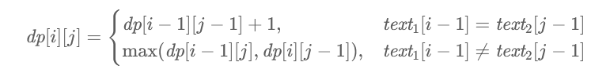
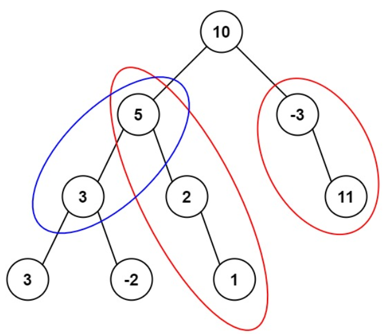
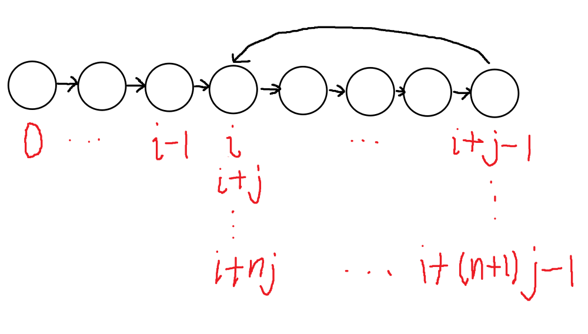

## 随机数

### 多数元素

- 输入：一个数组
- 输出：数组中的**多数元素**（占比**大于**50%的元素）的值
- 输入的数组**总是存在多数元素**
- 最直接的做法未必总是效率低，注意通过随机数规避测试用例的“人为陷阱”

```c#
public class Solution
{
    public int MajorityElement(int[] nums)
    {
         Random r = new Random();
        for (int i = 0; i < nums.Length; i++)
        {
            int next = r.Next(0,nums.Length);
            if (Verify(nums,nums[next]))
                return nums[next];
        }
        return -1;
    }

    public bool Verify(int[] nums, int val)
    {
        int count = 0;
        for (int i = 0; i < nums.Length; i++)
        {
            if (nums[i] == val)
                count++;
        }
        return count > nums.Length / 2;
    }
}
```

## 滑动窗口

```pseudocode
求最值()
{
	while(true)
	{
		while(窗口可以右扩)
		{
			窗口右扩;
		}
		更新最大窗口长度;
		while(窗口不能右扩)
		{
			窗口左缩;
		}
	}
}
```

### 最长不重复子串

```c
public class Solution
{
    public int LengthOfLongestSubstring(string s)
    {
        if(string.IsNullOrEmpty(s)) 
            return 0;
        HashSet<char> set = new HashSet<char>();
        int from = 0, to = 0;
        int max = 0;
        while (true)
        {
            while (!set.Contains(s[to]))
            {
                set.Add(s[to]);
                to++;
                if(to == s.Length)
                    return Math.Max(to - from, max);
            }
            max = Math.Max(to - from, max);
            while (true)
            {
                bool flag = s[from] == s[to];
                set.Remove(s[from]);
                from++;
                if (flag)
                    break;
            }
        }
    }
}
```

### 修改后最长重复子串

- 输入：一个字符串，整数`k`；你可以将字符串的任意字符修改为任意其他字符，最多能修改`k`次
- 输出：确定某种修改方式，使得最长重复子串的长度最长，输出该长度

```c#
public class Solution
{
    private string s;
    private int k;

    public int CharacterReplacement(string s, int k)
    {
        if(string.IsNullOrEmpty(s)) 
    		return 0;
        this.s = s;
        this.k = k; 
        int max = 0;
        Dictionary<char,int> temp = new Dictionary<char,int>();
        for (int i = 0;i < s.Length;i++)
        {
            if(!temp.ContainsKey(s[i]))
                temp.Add(s[i], 1);
            else
                temp[s[i]]++;
        }
        foreach (var pair in temp)
        {
            if (pair.Value + k > max)		//如果某种字符的数量达不到max-k,那么修改后该字符的连续重复子串不可能是最长的
                max = Math.Max(Calculate(pair.Key), max);
        }
        return max; 
    }

    public int Calculate(char target)
    {
        int from = 0,to = -1;
        int residualK = k;
        int max = 0;
        while (true)
        {
            while (residualK >= 0)
            {
                to++;
                if (to == s.Length)
                    return Math.Max(to - from, max);
                if (s[to] != target)
                    residualK--;
            }
            max = Math.Max(to - from, max); //此时 residualK == -1
            while (residualK < 0)
            {
                if (s[from] != target)
                    residualK++; 
                from++;
            }
        }
    }
}
```

## 贪心算法

### 跳跃问题

- 输入一个非负整数数组，你最初位于下标0处 。数组中的每个元素代表你在该位置**可以跳跃的最大距离**
- 输出**能否跳到最后一个下标**
- “可以跳跃的最大距离”这一表述决定了此问题不同于图连通性问题，并且决定了可以用贪心算法

```c#
public class Solution
{
    public bool CanJump(int[] nums)
    {
        int min = nums.Length - 1;	//min==5表示,至少要到达5才能到达终点
        while(min > 0)
        {
            int i = 0;
            for (; i < min && i + nums[i] < min; i++);
            if(i == min)
                return false;
            min = i;
        }
        return true;
    }
}
```

### 容量问题

- 输入：非负整数数组`a`；取两个不同的下标`i,j`，规定`b=(i-j)*Math.Min(i,j)`
- 输出：`b`所有取值中的最大值
- 并不容易发现可以使用贪心算法

```c#
public class Solution
{
    private int[] heights;
    public int MaxArea(int[] height)
    {
        heights = height;
        int left = 0;
        int right = height.Length - 1;
        int max = 0;
        while(left < right)
        {
            max = Math.Max(max, Calculate(left, right));
            if (height[left] < height[right])
                left++;
            else
                right--;
        }
        return max;
    }
    private int Calculate(int left, int right)
        =>(right - left) * Math.Min(heights[left], heights[right]);
}
```

### 接雨水

- `LeftMax`表示当前位左侧（含自身）最高柱子高度，`RightMax`表示当前位置右侧（含自身）最高柱子高度
- 关键在于认识到`capacity=min(LeftMax,RightMax)-height`
- 注意求`LeftMax`和`RightMax`可以在$O(n) $内完成

```C#
public class Solution 
{
    public int trap(int[] height) 
    {
        int n = height.length;
        if (n == 0)
            return 0;
        int[] leftMax = new int[n];
        leftMax[0] = height[0];
        for (int i = 1; i < n; ++i) 
        {
            leftMax[i] = Math.max(leftMax[i - 1], height[i]);
        }
        int[] rightMax = new int[n];
        rightMax[n - 1] = height[n - 1];
        for (int i = n - 2; i >= 0; --i) 
        {
            rightMax[i] = Math.max(rightMax[i + 1], height[i]);
        }
        int ans = 0;
        for (int i = 0; i < n; ++i) 
        {
            ans += Math.min(leftMax[i], rightMax[i]) - height[i];
        }
        return ans;
    }
}
```

## 动态规划

### 最长递增子序列

- 一维动态规划（动态规划应优先考虑一维的可行性），dp[i]表示**以第i个元素为结尾的最长子序列**长度

```c++
int lengthOfLIS(int* nums, int numsSize)
{
    if(numsSize==0)
    	return 0;
    int max=1,i,j;
    int dp[numsSize];
    for(i=0;i<numsSize;i++)
    	dp[i]=1;
    for(i=1;i<numsSize;i++)
    {
        for(j=0;j<i;j++)
        {
            if(nums[i]>nums[j]&&dp[i]<dp[j]+1)
            {
                dp[i]=dp[j]+1;
                if(dp[i]>max)
                	max=dp[i];
            }
        }
    }
    return max;
}
```

### 最长回文子串

- 在暴力解法的基础上，通过存储之前答案和递推的方式降低时间复杂度，自然而然地实现动态规划
- cache[l,r]表示[l,r]子串是否为回文子串

```C
int** cache;

int Check(char * s,int l,int r)
{
    if(l == r)
        cache[l][r] == 1; 
    else if(r == l +1)
        cache[l][r] = (s[l] == s[r]);
    else
        cache[l][r] = s[l] == s[r] && Check(s,l + 1, r - 1);
    return cache[l][r];
}

char* longestPalindrome(char* s)
{
    int n = strlen(s);
    cache = malloc(n * sizeof(int*));
    for (int i = 0; i < n; i++)
    {
        cache[i] = malloc(n * sizeof(int));
    }
    
    int max = 1;
    char* ans = malloc(n + 1);
    strncpy(ans,s,1);
    ans[1] = '\0';
    for (int l = 0; l < n; l++)
    {
        for (int r = l + 1; r < n; r++)
        {
            if(r - l + 1 > max && Check(s,l,r))
            {
                max = r - l + 1;
                strncpy(ans, s+l,max);
                ans[max]='\0';
            }
        }
    }
    return ans;
}
```

### 最长公共子序列



- 关键在于`dp`的选取，本题`dp[i][j]`表示`text1[0,i]`和`text2[0,j]`的公共子串长度

```C
int longestCommonSubsequence(char* text1, char* text2) 
{
    int m = strlen(text1), n = strlen(text2);
    int dp[m + 1][n + 1];
    memset(dp, 0, sizeof(dp));
    for (int i = 1; i <= m; i++) 
    {
        char c1 = text1[i - 1];
        for (int j = 1; j <= n; j++) 
        {
            char c2 = text2[j - 1];
            if (c1 == c2) 
            {
                dp[i][j] = dp[i - 1][j - 1] + 1;
            } 
            else 
            {
                dp[i][j] = fmax(dp[i - 1][j], dp[i][j - 1]);
            }
        }
    }
    return dp[m][n];
}
```

### 二叉树结点的最近公共祖先

- 输入一个二叉树，和结点`p,q`
- 返回`p,q`的**最近公共祖先**（`p,q`的共同祖先中，深度最先的结点；特别地，每个结点都是自身的祖先）

- 逐点递归判断每个点是否是`p,q`的共同祖先时间复杂度过高，必须保存局部结果以避免重复运算；鉴于数据结构，无法像传统动态规划一样用二维数组，而应当用树

```C
struct _TreeNodeRecord
{
    struct TreeNode* node;
    struct _TreeNodeRecord* left;
    struct _TreeNodeRecord* right;
    int pFlag;
    int qFlag;
};
typedef struct _TreeNodeRecord TreeNodeRecord;

TreeNodeRecord* CreateRecord(struct TreeNode* node)
{
    if(node == NULL)
        return NULL;
    TreeNodeRecord* ret = malloc(sizeof(TreeNodeRecord));
    ret->node = node;
    ret->left = CreateRecord(node->left);   //递归构造树
    ret->right = CreateRecord(node->right);
    ret->pFlag = 0;
    ret->qFlag = 0;
    return ret;
}

int UpdatePFlag(TreeNodeRecord* record,struct TreeNode* p)
{
    if(record == NULL)
        return 0;
    
    record->pFlag = (record->node == p) || UpdatePFlag(record->left,p) || UpdatePFlag(record->right,p);    
    return record->pFlag;
}
int UpdateQFlag(TreeNodeRecord* record,struct TreeNode* q)
{
    if(record == NULL)
        return 0;
    
    record->qFlag = (record->node == q) || UpdateQFlag(record->left,q) || UpdateQFlag(record->right,q);    
    return record->qFlag;
}

int Verify(TreeNodeRecord* record)
{
    return record != NULL && record->pFlag && record->qFlag;
}
struct TreeNode* searchAncestor(TreeNodeRecord* record)
{
    if(Verify(record->left))
        return searchAncestor(record->left);
    if(Verify(record->right))
        return searchAncestor(record->right);
    return record->node;
}

struct TreeNode* lowestCommonAncestor(struct TreeNode* root, struct TreeNode* p, struct TreeNode* q)
{
    TreeNodeRecord* r = CreateRecord(root);
    UpdatePFlag(r,p);
    UpdateQFlag(r,q);
    return searchAncestor(r);
}
```

## 模拟

### 前序+中序构造二叉树

- 递归模拟

```C
struct TreeNode* Generate(int* preorder, int* inorder, int size)
{
    if(size == 0)
        return NULL;
    struct TreeNode* root = malloc(sizeof(struct TreeNode));
    root->left = root->right = NULL;
    root->val = preorder[0];
    int i = 0;
    for(;i < size;i++)
    {
        if(inorder[i] == preorder[0])
            break;
    }
    root->left = Generate(preorder + 1, inorder , i);
    root->right = Generate(preorder + 1 + i,inorder + 1 + i, size - 1 - i);
    return root;
}

struct TreeNode* buildTree(int* preorder, int preorderSize, int* inorder, int inorderSize) 
{
    struct TreeNode* root = Generate(preorder,inorder,preorderSize);
    return root;
}
```

### N皇后

- 整个搜索答案的过程可以视为一棵树，每当建立一个新节点，便向上回溯
- 由于事先不知道解的数量，故用类似链表的结构暂存答案；链表结点和树结点合为一个结点
- 每行有且仅有一个皇后，利用这一点大幅减少分支

```c#
public class Solution
{
    public class Node
    {
        public Node parent;
        public int val;

        public Node(Node parent,int val)
        {
            this.parent = parent;
            this.val = val;
        }
    }

    List<IList<string>> ret;
    public int n;
    public IList<IList<string>> SolveNQueens(int n)
    {
        this.n = n;
        ret = new List<IList<string>>();
        for (int i = 0; i < n; i++)
        {
            Node root = new Node(null, i);
            BuildTree(root);
        }
        return ret;
    }

    public bool Check(int a,int b)	//判断棋盘上某两个位置是否冲突
    {
        int xa = a / n;
        int xb = b / n;
        int ya = a % n;
        int yb = b % n;
        if (xa == xb || ya == yb)
            return false;
        if (xb - xa == yb - ya || xa - xb == yb - ya)
            return false;
        return true;
    }

    public bool Backtrack(Node p, int val)	//回溯,判断某个棋子是否与其他棋子冲突
    {
        for (; p != null; p = p.parent)
        {
            if (!Check(p.val, val))
                return false;
        }
        return true;
    }

    public void BuildTree(Node root)
    {
        if (root.val + n >= n * n)
        {
            DrawQueen(root);
            return;
        }
        int val = root.val / n * n + n;    //从下一行开始
        for (int i = 0; i < n; i++)
        {
            if (Backtrack(root, val))
            {
                Node node = new Node(root, val);
                BuildTree(node);
            }
            val++;
        }
    }

    public void DrawQueen(Node leaf)
    {
        List<string> board = new List<string>();
        for (int i = 0; i < n; i++)
        {
            string temp = new string('.', n);
            board.Add(temp);
        }
        for (; leaf != null; leaf = leaf.parent) 
        {
            int x = leaf.val / n;
            int y = leaf.val % n;
            string temp = board[x];
            board[x] = temp[..y] + "Q" + temp[(y + 1)..];
        }
        ret.Add(board);
    }
}
```

### 生成括号

- 输入一个整数`n`，表示要生成的括号对数
- 输出所有符合条件的字符串：每个字符串由`n`对左右括号构成，要求括号必须是**成对匹配的**
- 搜索过程类似上一题

```c
struct _Node
{
    struct _Node * parent;
    struct _Node * nextAnswer;
    int lcount;
    int rcount;
};
typedef struct _Node Node;

int count;
Node* ans;

Node* generateLNode(Node* root)
{
    Node* l = malloc(sizeof(Node));
    l->parent = root;
    l->nextAnswer = NULL;
    l->lcount = root->lcount + 1;
    l->rcount = root->rcount;
    return l;
}

Node* generateRNode(Node* root)
{
    Node* r = malloc(sizeof(Node));
    r->parent = root;
    r->nextAnswer = NULL;
    r->lcount = root->lcount;
    r->rcount = root->rcount + 1;
    return r;
}

void buildTree(Node* root,int n)
{
    if(root->lcount + root->rcount == n * 2)
    {
        root->nextAnswer = ans;
        ans = root;
        count++;
        return;
    }
    
    if(root->lcount == root->rcount)
    {
        Node* l = generateLNode(root);
        buildTree(l,n);
    }
    else if(root->lcount == n)
    {
        Node* r = generateRNode(root);
        buildTree(r,n);
    }
    else
    {
        Node* l = generateLNode(root);
        buildTree(l,n);
        Node* r = generateRNode(root);
        buildTree(r,n);
    }
}

void printAnswer(char** board,int index,Node* leaf,int n)
{
    n *=2;
    board[index] = malloc(sizeof(char) * (n + 1));
    board[index][n] = 0;
    for (int i = n - 1; i > 0; i--)
    {
        if(leaf->lcount == leaf->parent->lcount)
            board[index][i] = ')';
        else
            board[index][i] = '(';
        leaf = leaf->parent;
    }
    board[index][0] = '(';
}

char** generateParenthesis(int n, int* returnSize) 
{
    count = 0;
    ans = NULL;
    Node* root = malloc(sizeof(Node));
    root->parent = NULL;
    root->nextAnswer = NULL;
    root->lcount = 0;
    root->rcount = 0;
    buildTree(root,n);

    char** ret = malloc(sizeof(char*) * count);
    *returnSize = count;
    for (int i = 0; i < count; i++)
    {
        printAnswer(ret,i,ans,n);
        ans = ans->nextAnswer;
    }
    return ret;
}
```

### 二叉树的路径和

- 输入：一个二叉树，整数`targetSum`，找出所结点值总和等于`targetSum`的**路径**（将二叉树视为有向图，路径的定义与图相同）
- 输出：符合条件的路径的数目
- 溢出问题可以通过取余解决



```C
int pathSum_Continue(struct TreeNode* root, int targetSum)  //保持起点不变查找
{
    if(root == NULL)
        return 0;
    
    int target = targetSum % 1000000007 - root->val % 1000000007;
    int count = 0;
    if(target == 0)
        count++;
    count += pathSum_Continue(root->left,target);
    count += pathSum_Continue(root->right,target);
    return count;
}

int pathSum(struct TreeNode* root, int targetSum)   //以root为路径起点查找
{
    if(root == NULL)
        return 0;
    
    int target = targetSum  % 1000000007 - root->val % 1000000007;
    int count = 0;
    if(target == 0)
        count++;
    count += pathSum(root->left,targetSum) + pathSum_Continue(root->left,target);
    count += pathSum(root->right,targetSum) + pathSum_Continue(root->right,target);
    return count;
}
```

### 全排列

- 输入：一个数组，每个元素各不相同
- 输出：数组元素的**全排列**
- 数组元素的具体值无关紧要，关心的是下标的排列顺序；先初始化好第一种排列，然后递推地计算下一个排列

```C
void Swap(int* a,int* b)
{
    int temp = *a;
    *a = *b;
    *b = temp;
}
void Sort(int* nums,int n)
{
    int minmax = -1;
    for (int i = 1; i < n; i++)
    {
        if(nums[i] > nums[0])
        {
            if(minmax == -1)
                minmax = i;
            else if(nums[i] < nums[minmax])
                minmax = i;
        }
    }
    Swap(nums,nums + minmax);
    for (int i = 1; i < n; i++)
    {
        int min = i;
        for (int j = i + 1; j < n; j++)
        {
            if(nums[j] < nums[min])
                min = j;
        }
        Swap(nums + i,nums + min);
    }
}
void nextOrder(int* order,int n)    //将下标数组更新为序列中的下一项
{
    int max = order[n - 1];
    for (int i = n - 2; i >= 0; i--)
    {
        if(order[i] < max)
        {
            Sort(order + i, n - i);
            break;
        }
        else
            max = order[i];
    }
}
int** permute(int* nums, int numsSize, int* returnSize, int** returnColumnSizes) 
{
    int ansCount = 1;
    int* order = malloc(sizeof(int) * numsSize);    //下标数组
    for(int i = 0;i < numsSize;i ++)
    {
        order[i] = i;
        ansCount *= i + 1;
    }
    int** ret = malloc(sizeof(int*) * ansCount);
    *returnColumnSizes = malloc(sizeof(int) * ansCount);
    *returnSize = ansCount;

    for (int i = 0; i < ansCount; i++)
    {
        (*returnColumnSizes)[i] = numsSize;
        ret[i] = malloc(sizeof(int) * numsSize);
        for (int j = 0; j < numsSize; j++)
        {
            ret[i][j] = nums[order[j]];
        }
        nextOrder(order,numsSize);
    }
    return ret;
}
```

## 前缀和

### 和为K的子数组

- 输入一个数组，和一个数`k`
- 输出和为`k`的子数组的总数
- 求前缀和，然后问题转化为两数之差等于k的问题

```C#
public class Solution
{
    public int SubarraySum(int[] nums, int k)
    {
        int[] prefix = new int[nums.Length];    //前缀和
        Dictionary<int,int> prefixCount = new Dictionary<int,int>();    //各种值的前缀和计数
        prefixCount.Add(0, 1);
        int count = 0;
        for (int i = 0; i < nums.Length; i++)
        {
            prefix[i] = i == 0? nums[0]: prefix[i - 1] + nums[i];
            if (prefixCount.ContainsKey(prefix[i] - k)) 
                count += prefixCount[prefix[i] - k];     
                   
            if (prefixCount.ContainsKey(prefix[i]))
                prefixCount[prefix[i]]++;
            else
                prefixCount.Add(prefix[i], 1);
        }
        return count;
    }
}
```

## 双指针

### 有环链表的入环点

- 输入一个链表
- 返回链表中**入环点**（即唯一一个同时是两个结点的后继结点的结点）的地址，如果没有，返回NULL

- 使用快慢指针，容易证明，慢指针第一次走完环之前，一定会与快指针相遇
- 由数学关系知，快慢指针相遇时，令一个新的慢指针指向头结点，之后两个慢指针一定会在入环点相遇


$$
slow=i+x \quad fast=i+nj+x \quad slow=2fast \Rightarrow slow=nj \hfill \\
slow:慢指针经过的结点总数 \quad fast:快指针经过的结点总数 \quad i:环外结点数 \quad j:环内结点数 \quad x:相遇位置 \hfill \\
$$

```C
struct ListNode* detectCycle(struct ListNode* head) 
{
    struct ListNode *slow = head, *fast = head;
    while (fast != NULL) 
    {
        if (fast->next == NULL)
            return NULL;
        
        slow = slow->next;
        fast = fast->next->next;
        if (fast == slow) 
        {
            struct ListNode* ans = head;
            while (ans != slow) 
            {
                ans = ans->next;
                slow = slow->next;
            }
            return ans;
        }
    }
    return NULL;
}
```

## 单调栈

- 在栈的基础上，还要求有序（**如果某个元素入栈会破坏顺序，必须先进行若干次出栈，直到该元素入栈不会破坏顺序**）

### 下一个更大的数

- 输入：一个int数组
- 输出：对于每个元素，找出右边下一个更大的数，计算其下标与当前数下标之差（没有则记为0），结果用int数组输出

```c#
public class Solution
{
    public int[] DailyTemperatures(int[] nums)
    {
        Stack<int> stack = new Stack<int>();
        int[] ret = new int[nums.Length];
        for (int i = 0; i < nums.Length; i++)
        {
            while (stack.Count > 0 && nums[i] > nums[stack.Peek()])
            {
                int index = stack.Pop();
                ret[index] = i - index;
            }
            stack.Push(i);
        }
        while (stack.Count > 0)
        {
            int index = stack.Pop();
            ret[index] = 0;
        }
        return ret;
    }
}
```

## 其他

### 查找旋转后有序数组

- 输入：一个数组，该数组初始为升序，然后旋转过（在某个位置分为两个部分，交换两个部分的顺序）；输入要查找的数
- 输出：查找的数的下标，不存在则返回-1
- 数据规模较小时改用简单查询，能规避二分查找的特殊情况

```C
int searchRange(int* nums, int from,int to, int target) 
{
    if(to - from < 10)
    {
        for (int i = from; i <= to; i++)
        {
            if(nums[i] == target)
                return i;
        }
        return -1;
    }
    int mid = (to + from) /2;
    if(nums[from] > nums[to])
    {
        int ans = searchRange(nums,from,mid,target);
        if(ans != -1)
            return ans;
        return searchRange(nums,mid+1,to,target);
    }
    if(nums[mid] == target)
        return mid;
    if(nums[mid] > target)
        return searchRange(nums,from,mid,target);
    return searchRange(nums,mid+1,to,target);
}

int search(int* nums, int numsSize, int target) 
{
    return searchRange(nums,0,numsSize-1,target);
}
```

### C++哈希表

```C
struct _HashNode
{
    struct _HashNode* next;
    int val;
    int count;	//混合了HashSet和Dictionary的功能
};
typedef struct _HashNode HashNode;
struct _HashTable
{
    HashNode** heads;
    int size;
};
typedef struct _HashTable HashTable;

HashNode* createNode(int val)
{
    HashNode* node = malloc(sizeof(HashNode));
    node->val = val;
    node->count = 1;
    node->next = NULL;
    return node;
}
HashTable* createTable(int size)
{
    HashTable* table = malloc(sizeof(HashTable));
    table->heads = malloc(sizeof(HashTable*) * size);
    for (int i = 0; i < size; i++)
    {
        table->heads[i] = NULL;
    }
    table->size = size;
    return table;
}

int hash(int size, int val)
{
    return val % size;
}
int add(HashTable* table, int val)
{
    int h = hash(table->size,val);
    if(table->heads[h] == NULL)
    {
        table->heads[h] = createNode(val);
        return 1;
    }
    HashNode* p = table->heads[h];
    while(1)
    {
        if(p->val == val)
        {
            p->count ++;
            return p->count;
        }
        if(p->next == NULL)
        {
            p->next = createNode(val);
            return 1;
        }
        p = p->next;
    }
    return -1;
}
int tryRemove(HashTable* table,int val)
{
    int h = hash(table->size,val);
    if(table->heads[h] == NULL)
        return 0;
    HashNode* p = table->heads[h];
    while(1)
    {
        if(p->val == val)
        {
            if(p->count > 0)
            {
                int temp = p->count;
                p->count--; //懒删除
                return temp;
            }
            return 0;
        }
        if(p->next == NULL)
            return 0;
        p = p->next;
    }
}
int contain(HashTable* table,int val)
{
    int h = hash(table->size,val);
    if(table->heads[h] == NULL)
        return 0;
    HashNode* p = table->heads[h];
    while(p != NULL)
    {
        if(p->val == val)
            return p->count;
    }
    return 0;
}
void print(HashTable* table)
{
    for (int i = 0; i < table->size; i++)
    {
        if(table->heads[i] == NULL)
            printf("(NULL)\n");
        else
        {
            for(HashNode* p = table->heads[i];p != NULL;p = p->next)
            {
                printf("(%d.%d)->",p->val,p->count);
            }
            printf("\n");
        }
    }
}
```
